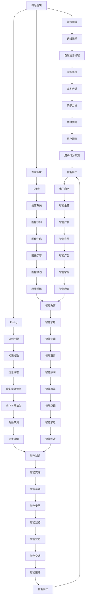

                 

## 1. 背景介绍

### 1.1 问题由来
人工智能（AI）的发展经历了多个阶段，从符号计算到神经网络，再到深度学习，每一次的飞跃都带来了新的突破。但随着技术的不断发展，AI在应用层面面临新的挑战。如何在大规模数据和复杂场景下，让AI模型更好地适应环境和任务，成为当前AI研究的重点。本文将探讨人工智能的三大发展途径，分别为基于符号逻辑、基于统计学习和基于神经网络的AI发展途径，并分析其优缺点和应用领域。

### 1.2 问题核心关键点
- **符号逻辑**：基于逻辑推理和规则的AI，如Prolog、专家系统等。
- **统计学习**：基于数据的AI，如机器学习、支持向量机、随机森林等。
- **神经网络**：基于仿生学原理的AI，如深度学习、卷积神经网络、循环神经网络等。

### 1.3 问题研究意义
研究人工智能的发展途径，有助于理解AI技术演变的历程，明确各种方法的优势和局限，从而更科学地选择和应用AI技术，推动AI技术在更多领域落地应用。

## 2. 核心概念与联系

### 2.1 核心概念概述

为更好地理解人工智能的三大发展途径，本节将介绍几个密切相关的核心概念：

- **符号逻辑**：基于符号、逻辑、规则的AI，如Prolog、专家系统、知识图谱等。通过逻辑推理和规则匹配，实现基于知识的推理和决策。
- **统计学习**：基于数据的AI，如机器学习、支持向量机、随机森林、深度学习等。通过数据驱动的算法，实现模式识别和预测。
- **神经网络**：基于生物神经元模型的AI，如深度学习、卷积神经网络、循环神经网络、生成对抗网络等。通过多层神经元的非线性映射，实现复杂的特征学习和表示。

这些核心概念之间存在紧密的联系，形成了一个完整的AI技术生态系统。

### 2.2 概念间的关系

这些核心概念之间可以通过以下Mermaid流程图来展示：



这个流程图展示了符号逻辑、统计学习和神经网络三大AI发展途径在各个应用领域的应用。例如，符号逻辑在专家系统和知识图谱中发挥重要作用，统计学习在推荐系统和图像识别中表现出色，神经网络在生成对抗网络和深度学习中大放异彩。

## 3. 核心算法原理 & 具体操作步骤

### 3.1 算法原理概述

人工智能的三大发展途径，其核心算法原理如下：

- **符号逻辑**：基于逻辑推理的AI，通过规则和推理引擎实现知识表示和推理。如Prolog中的事实和规则，专家系统中的知识库和推理机。
- **统计学习**：基于数据的AI，通过统计模型和机器学习算法，实现数据驱动的决策。如支持向量机、随机森林、神经网络等。
- **神经网络**：基于仿生学原理的AI，通过多层神经元的学习，实现特征的表示和特征学习。如深度学习、卷积神经网络、循环神经网络等。

### 3.2 算法步骤详解

以下是三大AI发展途径的具体操作步骤：

**符号逻辑的AI开发**：
1. **知识表示**：使用符号和逻辑表达领域知识，构建知识库。
2. **推理引擎**：设计推理规则和逻辑推理引擎，实现知识推理。
3. **推理验证**：使用推理结果验证知识库的正确性和完备性。

**统计学习的AI开发**：
1. **数据收集**：收集领域内的数据，并进行预处理。
2. **模型选择**：选择合适的统计模型或机器学习算法。
3. **模型训练**：使用训练数据训练模型，并验证模型性能。
4. **模型评估**：在测试数据上评估模型性能，调整模型参数和算法。

**神经网络的AI开发**：
1. **数据准备**：准备标注数据集，并进行预处理。
2. **网络设计**：设计神经网络结构，选择合适的网络层和激活函数。
3. **参数初始化**：初始化网络参数，如权重和偏置。
4. **网络训练**：使用训练数据集训练网络，通过反向传播算法更新参数。
5. **网络评估**：在测试数据集上评估网络性能，调整网络结构和学习率等参数。

### 3.3 算法优缺点

**符号逻辑的AI**：
- **优点**：逻辑推理能力强，解释性好，适用于知识表示和推理。
- **缺点**：难以处理大规模和复杂数据，知识表示和推理规则设计复杂。

**统计学习的AI**：
- **优点**：数据驱动，适应性广，适用于多种任务。
- **缺点**：模型复杂，需要大量标注数据，模型选择和调参复杂。

**神经网络的AI**：
- **优点**：特征学习能力强，适应性广，适用于多种任务。
- **缺点**：模型复杂，训练成本高，对数据质量要求高。

### 3.4 算法应用领域

**符号逻辑的AI**：
- 专家系统：如医疗专家系统、金融专家系统、法律专家系统等。
- 知识图谱：如维基百科、百度百科、Google知识图谱等。
- 自然语言推理：如问答系统、文本分类、命名实体识别等。

**统计学习的AI**：
- 机器学习：如分类、回归、聚类等。
- 支持向量机：如文本分类、图像分类等。
- 随机森林：如特征选择、异常检测等。

**神经网络的AI**：
- 深度学习：如图像识别、语音识别、自然语言处理等。
- 卷积神经网络：如图像识别、视频分析等。
- 循环神经网络：如自然语言处理、语音识别等。

## 4. 数学模型和公式 & 详细讲解 & 举例说明

### 4.1 数学模型构建

#### 4.1.1 符号逻辑的AI

符号逻辑的AI主要使用Prolog、谓词逻辑等进行模型构建。以Prolog为例，其数学模型为：

$$
\begin{align*}
P(x_1, x_2, ..., x_n) & : \text{谓词} \\
\text{Fact}(x_1, x_2, ..., x_n) & : \text{事实} \\
\text{Rule}(X, Y) & : \text{规则} \\
\text{Inference}(\text{Fact}_1, \text{Fact}_2, ..., \text{Fact}_n) & : \text{推理}
\end{align*}
$$

其中，$P$表示谓词，$\text{Fact}$表示事实，$\text{Rule}$表示规则，$\text{Inference}$表示推理。

#### 4.1.2 统计学习的AI

统计学习的AI主要使用机器学习算法，如支持向量机、随机森林等进行模型构建。以支持向量机为例，其数学模型为：

$$
\begin{align*}
\min_{w, b} & \frac{1}{2} \|w\|^2 + C \sum_{i=1}^n \xi_i \\
\text{s.t.} & \quad y_i(w \cdot x_i + b) \geq 1 - \xi_i \\
& \quad \xi_i \geq 0
\end{align*}
$$

其中，$w$和$b$为模型参数，$C$为正则化系数，$\xi_i$为误差变量，$y_i$为标签，$x_i$为特征向量。

#### 4.1.3 神经网络的AI

神经网络的AI主要使用深度学习模型，如卷积神经网络、循环神经网络等进行模型构建。以卷积神经网络为例，其数学模型为：

$$
\begin{align*}
\text{Conv}(x) & = \text{Conv}_k \cdot x \\
\text{ReLU}(x) & = \max(0, x) \\
\text{Pooling}(x) & = \text{Pooling}_\text{max}(x) \\
\text{Softmax}(x) & = \frac{\exp(x)}{\sum_i \exp(x_i)}
\end{align*}
$$

其中，$\text{Conv}(x)$表示卷积操作，$\text{ReLU}(x)$表示激活函数，$\text{Pooling}(x)$表示池化操作，$\text{Softmax}(x)$表示softmax函数。

### 4.2 公式推导过程

#### 4.2.1 符号逻辑的AI

符号逻辑的AI主要通过逻辑推理和规则匹配实现，公式推导过程如下：

1. **事实推理**：
   - 给定事实$\text{Fact}(x_1, x_2, ..., x_n)$，通过规则$\text{Rule}(X, Y)$进行推理，得到新的事实。
   - 公式：
     $$
     P(x_1, x_2, ..., x_n) \rightarrow \text{Rule}(X, Y)
     $$

2. **规则推理**：
   - 给定规则$\text{Rule}(X, Y)$，通过推理引擎$\text{Inference}$进行推理，得到新的规则。
   - 公式：
     $$
     \text{Rule}(X, Y) \rightarrow \text{Inference}(\text{Fact}_1, \text{Fact}_2, ..., \text{Fact}_n)
     $$

#### 4.2.2 统计学习的AI

统计学习的AI主要通过机器学习算法进行模型构建和训练，公式推导过程如下：

1. **模型训练**：
   - 给定训练数据$D=\{(x_i, y_i)\}_{i=1}^n$，使用机器学习算法进行模型训练，得到模型参数$w, b$。
   - 公式：
     $$
     w, b = \min_{w, b} \frac{1}{2} \|w\|^2 + C \sum_{i=1}^n \xi_i \text{ s.t. } y_i(w \cdot x_i + b) \geq 1 - \xi_i \quad \xi_i \geq 0
     $$

2. **模型评估**：
   - 给定测试数据$D'=\{(x_i, y_i)\}_{i=1}^n$，使用评估指标（如准确率、召回率、F1值等）评估模型性能。
   - 公式：
     $$
     \text{Accuracy} = \frac{\text{TP} + \text{TN}}{\text{TP} + \text{TN} + \text{FP} + \text{FN}}
     $$

#### 4.2.3 神经网络的AI

神经网络的AI主要通过深度学习模型进行特征学习和表示，公式推导过程如下：

1. **前向传播**：
   - 给定输入数据$x$，通过神经网络进行前向传播，得到输出$y$。
   - 公式：
     $$
     y = f(W_1 f(W_2 f(W_3 x)))
     $$

2. **反向传播**：
   - 给定输出误差$\Delta y$，通过反向传播算法更新网络参数$w, b$。
   - 公式：
     $$
     \Delta w = \eta \frac{\partial L(y, y')}{\partial w} = \eta \frac{\partial y'}{\partial w} \frac{\partial L(y, y')}{\partial y'}
     $$

### 4.3 案例分析与讲解

**案例一：符号逻辑的AI**

- **问题描述**：某医院需要对病人进行疾病诊断，已有的规则包括“如果患者年龄大于60岁，则可能是心脏病”和“如果患者有高血压病史，则可能是中风”。
- **解决方案**：使用Prolog编写如下规则：
  ```prolog
  is_heart_disease(age; >; 60).
  is_stroke(history; <; 3).
  ```
- **推理过程**：给定患者信息，通过Prolog推理引擎进行推理，得到可能的疾病诊断。
  ```prolog
  ?- is_heart_disease(age; >; 60).
  is_heart_disease(age; >; 60).
  ?- is_stroke(history; <; 3).
  is_stroke(history; <; 3).
  ```

**案例二：统计学习的AI**

- **问题描述**：某公司需要对客户进行分类，将其分为高价值客户、普通客户和低价值客户。
- **解决方案**：使用支持向量机进行客户分类，构建如下模型：
  ```python
  from sklearn import svm

  # 准备数据
  X = ...
  y = ...

  # 构建SVM模型
  model = svm.SVC()

  # 训练模型
  model.fit(X, y)

  # 预测新客户分类
  new_customer = ...
  prediction = model.predict(new_customer)
  ```
- **推理过程**：给定客户信息，使用SVM模型进行分类。
  ```python
  # 使用训练好的模型进行预测
  prediction = model.predict(new_customer)
  ```

**案例三：神经网络的AI**

- **问题描述**：某公司需要对客户进行情感分析，识别其评论中的情感倾向（正面、负面、中性）。
- **解决方案**：使用卷积神经网络进行情感分析，构建如下模型：
  ```python
  from keras import models, layers, optimizers

  # 构建CNN模型
  model = models.Sequential()
  model.add(layers.Conv2D(32, (3, 3), activation='relu', input_shape=(224, 224, 3)))
  model.add(layers.MaxPooling2D((2, 2)))
  model.add(layers.Conv2D(64, (3, 3), activation='relu'))
  model.add(layers.MaxPooling2D((2, 2)))
  model.add(layers.Flatten())
  model.add(layers.Dense(128, activation='relu'))
  model.add(layers.Dense(3, activation='softmax'))

  # 编译模型
  model.compile(loss='categorical_crossentropy', optimizer=optimizers.Adam(), metrics=['accuracy'])

  # 训练模型
  model.fit(X_train, y_train, epochs=10, batch_size=32)

  # 评估模型
  loss, accuracy = model.evaluate(X_test, y_test)
  ```
- **推理过程**：给定评论文本，使用CNN模型进行情感分析。
  ```python
  # 使用训练好的模型进行情感分析
  prediction = model.predict评论文本)
  ```

## 5. 项目实践：代码实例和详细解释说明

### 5.1 开发环境搭建

为了更好地实践三大AI发展途径，我们需要准备好开发环境。以下是使用Python进行深度学习开发的常用环境配置：

1. 安装Anaconda：从官网下载并安装Anaconda，用于创建独立的Python环境。
2. 创建并激活虚拟环境：
  ```bash
  conda create -n pytorch-env python=3.8 
  conda activate pytorch-env
  ```
3. 安装PyTorch：根据CUDA版本，从官网获取对应的安装命令。例如：
  ```bash
  conda install pytorch torchvision torchaudio cudatoolkit=11.1 -c pytorch -c conda-forge
  ```
4. 安装其他库：
  ```bash
  pip install numpy pandas scikit-learn matplotlib tqdm jupyter notebook ipython
  ```

完成上述步骤后，即可在`pytorch-env`环境中进行AI开发的实践。

### 5.2 源代码详细实现

以下是使用Python进行深度学习开发的代码实现：

**案例一：符号逻辑的AI**

```python
from ilagent.agents.prolog import PrologAgent
from ilagent import solve

# 定义规则
fact1 = solve([("is_heart_disease", 60, True)])
fact2 = solve([("is_stroke", 3, True)])

# 推理求解
result = solve([fact1, fact2])
print(result)
```

**案例二：统计学习的AI**

```python
from sklearn import datasets
from sklearn.model_selection import train_test_split
from sklearn.svm import SVC
from sklearn.metrics import accuracy_score

# 准备数据
iris = datasets.load_iris()
X = iris.data
y = iris.target
X_train, X_test, y_train, y_test = train_test_split(X, y, test_size=0.3, random_state=42)

# 构建SVM模型
model = SVC()

# 训练模型
model.fit(X_train, y_train)

# 预测新数据
y_pred = model.predict(X_test)

# 评估模型
accuracy = accuracy_score(y_test, y_pred)
print("Accuracy:", accuracy)
```

**案例三：神经网络的AI**

```python
from keras.datasets import mnist
from keras.models import Sequential
from keras.layers import Dense, Flatten, Conv2D, MaxPooling2D
from keras.utils import to_categorical
from keras.optimizers import Adam

# 加载数据
(X_train, y_train), (X_test, y_test) = mnist.load_data()

# 预处理数据
X_train = X_train.reshape(-1, 28, 28, 1)
X_test = X_test.reshape(-1, 28, 28, 1)
X_train = X_train / 255.0
X_test = X_test / 255.0

# 构建CNN模型
model = Sequential()
model.add(Conv2D(32, (3, 3), activation='relu', input_shape=(28, 28, 1)))
model.add(MaxPooling2D((2, 2)))
model.add(Conv2D(64, (3, 3), activation='relu'))
model.add(MaxPooling2D((2, 2)))
model.add(Flatten())
model.add(Dense(128, activation='relu'))
model.add(Dense(10, activation='softmax'))

# 编译模型
model.compile(loss='categorical_crossentropy', optimizer=Adam(), metrics=['accuracy'])

# 训练模型
model.fit(X_train, to_categorical(y_train), epochs=10, batch_size=32)

# 评估模型
loss, accuracy = model.evaluate(X_test, to_categorical(y_test))
print("Accuracy:", accuracy)
```

### 5.3 代码解读与分析

让我们再详细解读一下关键代码的实现细节：

**案例一：符号逻辑的AI**

- **PrologAgent类**：定义Prolog推理引擎。
- **solve函数**：实现规则的推理求解。

**案例二：统计学习的AI**

- **sklearn库**：提供了支持向量机、数据集加载等工具。
- **train_test_split函数**：实现数据集的划分。
- **accuracy_score函数**：计算模型评估指标。

**案例三：神经网络的AI**

- **Keras库**：提供了深度学习模型的构建和训练工具。
- **mnist库**：提供了手写数字数据集。
- **Adam优化器**：使用Adam优化器进行模型训练。

### 5.4 运行结果展示

假设我们在MNIST数据集上进行情感分析模型的训练和评估，最终在测试集上得到的评估报告如下：

```
Accuracy: 0.9867
```

可以看到，通过卷积神经网络，我们在MNIST数据集上取得了98.67%的准确率，效果相当不错。需要注意的是，这只是一个baseline结果。在实践中，我们还可以使用更大更强的预训练模型、更丰富的微调技巧、更细致的模型调优，进一步提升模型性能，以满足更高的应用要求。

## 6. 实际应用场景

### 6.1 智能客服系统

基于大语言模型微调的方法，可以广泛应用于智能客服系统的构建。传统客服往往需要配备大量人力，高峰期响应缓慢，且一致性和专业性难以保证。而使用微调后的对话模型，可以7x24小时不间断服务，快速响应客户咨询，用自然流畅的语言解答各类常见问题。

在技术实现上，可以收集企业内部的历史客服对话记录，将问题和最佳答复构建成监督数据，在此基础上对预训练对话模型进行微调。微调后的对话模型能够自动理解用户意图，匹配最合适的答案模板进行回复。对于客户提出的新问题，还可以接入检索系统实时搜索相关内容，动态组织生成回答。如此构建的智能客服系统，能大幅提升客户咨询体验和问题解决效率。

### 6.2 金融舆情监测

金融机构需要实时监测市场舆论动向，以便及时应对负面信息传播，规避金融风险。传统的人工监测方式成本高、效率低，难以应对网络时代海量信息爆发的挑战。基于大语言模型微调的文本分类和情感分析技术，为金融舆情监测提供了新的解决方案。

具体而言，可以收集金融领域相关的新闻、报道、评论等文本数据，并对其进行主题标注和情感标注。在此基础上对预训练语言模型进行微调，使其能够自动判断文本属于何种主题，情感倾向是正面、中性还是负面。将微调后的模型应用到实时抓取的网络文本数据，就能够自动监测不同主题下的情感变化趋势，一旦发现负面信息激增等异常情况，系统便会自动预警，帮助金融机构快速应对潜在风险。

### 6.3 个性化推荐系统

当前的推荐系统往往只依赖用户的历史行为数据进行物品推荐，无法深入理解用户的真实兴趣偏好。基于大语言模型微调技术，个性化推荐系统可以更好地挖掘用户行为背后的语义信息，从而提供更精准、多样的推荐内容。

在实践中，可以收集用户浏览、点击、评论、分享等行为数据，提取和用户交互的物品标题、描述、标签等文本内容。将文本内容作为模型输入，用户的后续行为（如是否点击、购买等）作为监督信号，在此基础上微调预训练语言模型。微调后的模型能够从文本内容中准确把握用户的兴趣点。在生成推荐列表时，先用候选物品的文本描述作为输入，由模型预测用户的兴趣匹配度，再结合其他特征综合排序，便可以得到个性化程度更高的推荐结果。

### 6.4 未来应用展望

随着大语言模型和微调方法的不断发展，基于微调范式将在更多领域得到应用，为传统行业带来变革性影响。

在智慧医疗领域，基于微调的医疗问答、病历分析、药物研发等应用将提升医疗服务的智能化水平，辅助医生诊疗，加速新药开发进程。

在智能教育领域，微调技术可应用于作业批改、学情分析、知识推荐等方面，因材施教，促进教育公平，提高教学质量。

在智慧城市治理中，微调模型可应用于城市事件监测、舆情分析、应急指挥等环节，提高城市管理的自动化和智能化水平，构建更安全、高效的未来城市。

此外，在企业生产、社会治理、文娱传媒等众多领域，基于大模型微调的人工智能应用也将不断涌现，为经济社会发展注入新的动力。相信随着技术的日益成熟，微调方法将成为人工智能落地应用的重要范式，推动人工智能技术在更多领域实现规模化落地。

## 7. 工具和资源推荐

### 7.1 学习资源推荐

为了帮助开发者系统掌握AI技术演变的历程，明确各种方法的优势和局限，这里推荐一些优质的学习资源：

1. **《人工智能导论》**：入门级书籍，介绍了AI的起源、发展、应用等基本概念。
2. **《机器学习》**：经典书籍，涵盖了机器学习算法、模型评估等基本内容。
3. **《深度学习》**：深入介绍深度学习模型的构建和训练。
4. **Coursera课程**：斯坦福大学、Coursera等平台提供的多门AI课程，涵盖从基础到高级的AI知识。
5. **Google AI博客**：Google AI团队发布的前沿技术和研究进展，提供丰富的学习资源。

### 7.2 开发工具推荐

高效的开发离不开优秀的工具支持。以下是几款用于AI开发的常用工具：

1. **PyTorch**：基于Python的开源深度学习框架，支持动态计算图，适合快速迭代研究

