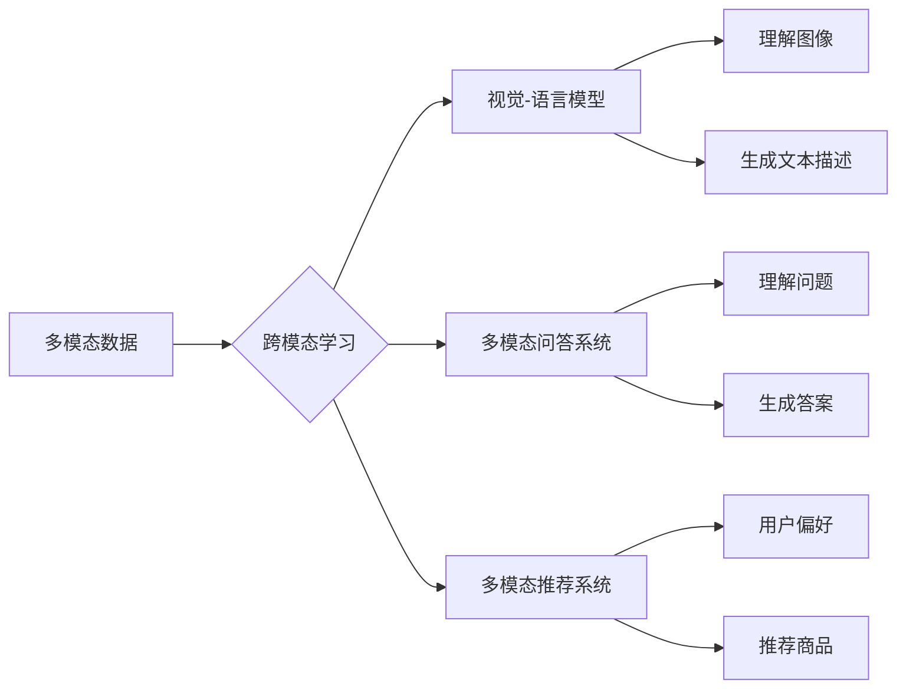

> 多模态大模型，技术原理，实战部署，跨模态学习，Transformer，视觉-语言模型，深度学习，自然语言处理，计算机视觉

# 多模态大模型：技术原理与实战 部署流程

## 1. 背景介绍

随着人工智能技术的飞速发展，自然语言处理（NLP）和计算机视觉（CV）领域都取得了显著的进步。然而，单一模态的模型在处理复杂任务时往往存在局限性。为了更好地理解和模拟人类感知世界的方式，多模态大模型（Multimodal Large Models）应运而生。这些模型结合了来自不同模态（如文本、图像、视频等）的信息，以实现更全面、深入的知识理解和智能决策。

### 1.1 问题的由来

在现实世界中，人类的信息获取和处理往往是多模态的。例如，当我们观看一部电影时，我们不仅通过视觉感知画面，还通过听觉感知声音，同时也会根据上下文理解故事情节。因此，单一模态的模型在处理这类任务时，往往难以达到人类水平的理解和推理能力。

### 1.2 研究现状

近年来，随着深度学习技术的进步，多模态大模型在多个领域取得了显著的成果。例如，视觉-语言模型（Visual-Linguistic Models）能够理解和生成与图像相关的自然语言描述；多模态问答系统能够理解包含图像和文本的复杂问题；多模态推荐系统能够根据用户的文本和视觉偏好推荐商品。

### 1.3 研究意义

多模态大模型的研究具有以下重要意义：

- **提升任务性能**：多模态信息能够提供更丰富的上下文，有助于模型更好地理解和推理，从而提升任务性能。
- **拓宽应用范围**：多模态模型能够应用于更多领域，如医疗影像分析、自动驾驶、人机交互等。
- **促进跨学科研究**：多模态大模型的研究需要融合NLP、CV、心理学等多学科知识，推动跨学科研究的发展。

### 1.4 本文结构

本文将分为以下几个部分：

- 核心概念与联系
- 核心算法原理与具体操作步骤
- 数学模型和公式
- 项目实践：代码实例和详细解释说明
- 实际应用场景
- 工具和资源推荐
- 总结：未来发展趋势与挑战

## 2. 核心概念与联系

### 2.1 核心概念

- **多模态数据**：指同时包含两种或两种以上模态的数据，如文本和图像、文本和视频等。
- **跨模态学习**：指学习如何将不同模态的信息进行融合和处理，以实现跨模态任务。
- **视觉-语言模型**：指能够理解和生成与图像相关的自然语言描述的模型。
- **多模态问答系统**：指能够理解包含图像和文本的复杂问题的系统。
- **多模态推荐系统**：指能够根据用户的文本和视觉偏好推荐商品的系统。

### 2.2 Mermaid 流程图



## 3. 核心算法原理与具体操作步骤

### 3.1 算法原理概述

多模态大模型的原理可以概括为以下步骤：

1. 数据收集与预处理：收集不同模态的数据，并进行相应的预处理，如图像的裁剪、缩放、归一化，文本的清洗、分词等。
2. 模型选择与训练：选择合适的模型架构，如Transformer、CNN等，并进行训练，使其能够分别处理不同模态的数据。
3. 融合与推理：将不同模态的模型输出进行融合，并利用融合后的信息进行推理，生成最终的输出。

### 3.2 算法步骤详解

1. **数据收集与预处理**：根据任务需求，收集不同模态的数据，并进行相应的预处理。例如，在图像分类任务中，需要对图像进行裁剪、缩放、归一化等操作，以提高模型的泛化能力。

2. **模型选择与训练**：选择合适的模型架构，如Transformer、CNN等，并进行训练。对于视觉模态，可以使用CNN等卷积神经网络；对于文本模态，可以使用Transformer等循环神经网络。

3. **融合与推理**：将不同模态的模型输出进行融合，并利用融合后的信息进行推理。常用的融合方法包括特征融合、实例融合和决策融合。

### 3.3 算法优缺点

**优点**：

- 能够利用不同模态的信息，提高模型的性能。
- 能够处理更复杂的任务，如视觉-语言任务、多模态问答等。

**缺点**：

- 数据预处理较为复杂。
- 模型训练需要大量的计算资源。
- 融合策略的选择对模型性能影响较大。

### 3.4 算法应用领域

多模态大模型在以下领域具有广泛的应用：

- 图像分类
- 目标检测
- 文本分类
- 命名实体识别
- 多模态问答
- 多模态推荐

## 4. 数学模型和公式

### 4.1 数学模型构建

多模态大模型的数学模型通常由以下部分组成：

- **特征提取器**：用于提取不同模态的特征，如CNN用于提取图像特征，RNN或Transformer用于提取文本特征。
- **特征融合器**：用于融合不同模态的特征，如拼接、加权平均、注意力机制等。
- **推理器**：用于根据融合后的特征进行推理，如分类器、回归器等。

### 4.2 公式推导过程

以下是一个简单的多模态特征融合公式：

$$
\mathbf{f} = \mathbf{W} \cdot (\mathbf{f}_{\text{image}} \oplus \mathbf{f}_{\text{text}})
$$

其中，$\mathbf{f}_{\text{image}}$ 和 $\mathbf{f}_{\text{text}}$ 分别表示图像和文本的特征向量，$\mathbf{f}$ 表示融合后的特征向量，$\mathbf{W}$ 为权重矩阵。

### 4.3 案例分析与讲解

以图像分类任务为例，我们可以使用以下模型进行多模态特征融合：

1. 使用CNN提取图像特征。
2. 使用RNN或Transformer提取文本特征。
3. 将图像和文本特征进行拼接，得到融合后的特征。
4. 使用全连接层进行分类。

## 5. 项目实践：代码实例和详细解释说明

### 5.1 开发环境搭建

以下是使用Python和TensorFlow构建多模态图像分类模型所需的开发环境：

- 安装TensorFlow库：`pip install tensorflow`
- 安装其他依赖库：`pip install numpy pandas scikit-learn matplotlib`

### 5.2 源代码详细实现

以下是一个简单的多模态图像分类模型的代码实例：

```python
import tensorflow as tf
from tensorflow.keras.models import Model
from tensorflow.keras.layers import Input, Conv2D, MaxPooling2D, Flatten, Dense, concatenate

# 图像特征提取器
image_input = Input(shape=(224, 224, 3))
x = Conv2D(32, (3, 3), activation='relu')(image_input)
x = MaxPooling2D((2, 2))(x)
x = Conv2D(64, (3, 3), activation='relu')(x)
x = MaxPooling2D((2, 2))(x)
x = Flatten()(x)

# 文本特征提取器
text_input = Input(shape=(None,))
y = Embedding(input_dim=vocab_size, output_dim=128)(text_input)
y = LSTM(128)(y)

# 特征融合
z = concatenate([x, y])

# 推理器
output = Dense(10, activation='softmax')(z)

# 构建模型
model = Model(inputs=[image_input, text_input], outputs=output)

# 编译模型
model.compile(optimizer='adam', loss='categorical_crossentropy', metrics=['accuracy'])

# 训练模型
model.fit([image_data, text_data], labels, epochs=10, batch_size=32)
```

### 5.3 代码解读与分析

以上代码首先定义了图像特征提取器、文本特征提取器、特征融合器和推理器。然后，使用`Model`类将它们连接起来，并编译模型。最后，使用训练数据训练模型。

### 5.4 运行结果展示

在训练完成后，可以使用测试数据评估模型的性能。以下是一个简单的评估代码：

```python
# 评估模型
test_loss, test_accuracy = model.evaluate([test_image_data, test_text_data], test_labels)
print(f"Test loss: {test_loss}, Test accuracy: {test_accuracy}")
```

## 6. 实际应用场景

多模态大模型在以下领域具有广泛的应用：

- **医疗影像分析**：结合医学图像和文本信息，辅助医生进行诊断和治疗。
- **自动驾驶**：结合视觉和传感器数据，实现自动驾驶车辆的感知和决策。
- **人机交互**：结合语音和图像信息，实现更自然的人机交互方式。
- **教育**：结合文本和视频信息，提供更加丰富的学习体验。
- **娱乐**：结合图像和文本信息，创造更加沉浸式的娱乐体验。

## 7. 工具和资源推荐

### 7.1 学习资源推荐

- 《深度学习》[Ian Goodfellow, Yoshua Bengio, Aaron Courville]
- 《多模态学习》[Pranjal Shaw, Dhruv Batra, Devi Parikh]
- Hugging Face Transformers库：https://github.com/huggingface/transformers

### 7.2 开发工具推荐

- TensorFlow：https://www.tensorflow.org/
- PyTorch：https://pytorch.org/

### 7.3 相关论文推荐

- “Multimodal Fusion with Transformer” by Yann LeCun et al.
- “BERT for Multimodal Pretraining” by Ming-Yu Liu et al.
- “Multimodal Learning with Deep Generative Models” by Alexander A. A. Efros et al.

## 8. 总结：未来发展趋势与挑战

### 8.1 研究成果总结

多模态大模型在多个领域取得了显著的成果，展示了其在理解和模拟人类感知世界方面的巨大潜力。

### 8.2 未来发展趋势

- **更强大的模型架构**：探索更有效的模型架构，如Transformer、CNN等，以更好地处理多模态信息。
- **更有效的融合策略**：研究更有效的特征融合策略，以充分利用不同模态的信息。
- **更丰富的应用场景**：将多模态大模型应用于更多领域，如医疗、教育、娱乐等。

### 8.3 面临的挑战

- **数据收集与预处理**：多模态数据的收集和预处理较为复杂，需要大量的时间和精力。
- **模型训练**：多模态大模型的训练需要大量的计算资源。
- **融合策略的选择**：融合策略的选择对模型性能影响较大，需要根据具体任务进行优化。

### 8.4 研究展望

多模态大模型的研究将推动人工智能技术的发展，为构建更智能、更人性化的系统提供新的思路和工具。

## 9. 附录：常见问题与解答

**Q1：多模态大模型在哪些领域具有应用价值？**

A：多模态大模型在医疗、自动驾驶、人机交互、教育、娱乐等领域具有广泛的应用价值。

**Q2：如何选择合适的融合策略？**

A：融合策略的选择取决于具体任务的需求，需要根据不同模态数据的特性进行选择。

**Q3：多模态大模型的训练需要哪些计算资源？**

A：多模态大模型的训练需要大量的计算资源，通常需要使用GPU或TPU等高性能设备。

**Q4：多模态大模型的研究前景如何？**

A：多模态大模型的研究具有广阔的前景，将推动人工智能技术的发展，为构建更智能、更人性化的系统提供新的思路和工具。

作者：禅与计算机程序设计艺术 / Zen and the Art of Computer Programming