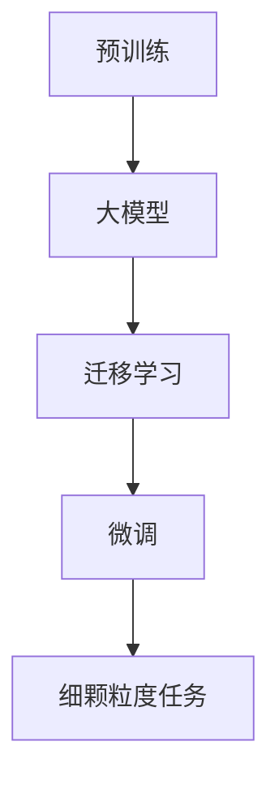

> 大模型，细颗粒度任务，自然语言处理，预训练，微调，迁移学习，性能评估

# 大模型在细颗粒度任务中的表现

随着深度学习技术的飞速发展，大模型（Large Models）在自然语言处理（Natural Language Processing，NLP）领域取得了显著的成果。这些大模型通常在海量无标签数据上进行预训练，从而学习到丰富的语言知识和常识。然而，大模型在处理细颗粒度任务（Fine-Grained Tasks）时，性能表现如何？本文将深入探讨这一问题，分析大模型在细颗粒度任务中的表现，并展望未来发展趋势与挑战。

## 1. 背景介绍

细颗粒度任务是指对语言的理解更加深入、粒度更加细致的任务，例如情感分析、主题分类、实体识别等。这些任务对模型的语言理解和推理能力要求较高，同时也对模型的可解释性和鲁棒性提出了挑战。大模型在细颗粒度任务中的表现，直接关系到其在实际应用中的价值。

## 2. 核心概念与联系

### 2.1 核心概念

#### 大模型

大模型是一种规模庞大的深度学习模型，通常包含数十亿到千亿个参数。它们通过在大量无标签数据上进行预训练，学习到丰富的语言知识和常识。

#### 细颗粒度任务

细颗粒度任务是指对语言的理解更加深入、粒度更加细致的任务，例如情感分析、主题分类、实体识别等。

#### 预训练

预训练是指在大规模无标签数据上进行训练，使模型学习到丰富的语言知识和常识。

#### 微调

微调是指在预训练模型的基础上，使用少量有标签数据进行进一步训练，使模型适应特定任务。

#### 迁移学习

迁移学习是指将一个领域学习到的知识迁移应用到另一个不同但相关的领域。

### 2.2 核心概念原理和架构的 Mermaid 流程图



## 3. 核心算法原理 & 具体操作步骤

### 3.1 算法原理概述

大模型在细颗粒度任务中的表现，主要依赖于预训练和微调两个阶段。

#### 预训练

预训练阶段，大模型在大量无标签数据上进行训练，学习到丰富的语言知识和常识。这一阶段的主要任务是让模型具备强大的语言理解和生成能力。

#### 微调

微调阶段，大模型使用少量有标签数据进行进一步训练，使模型适应特定任务。这一阶段的主要任务是让模型在特定任务上达到最佳的性能。

### 3.2 算法步骤详解

#### 预训练

1. 选择合适的预训练模型，如BERT、GPT-3等。
2. 收集大规模无标签数据，进行预训练。
3. 训练过程中，使用自监督学习任务，如掩码语言模型、下一句预测等。

#### 微调

1. 选择合适的预训练模型作为初始化参数。
2. 收集少量有标签数据，进行微调。
3. 使用监督学习任务，如分类、回归等，进行模型优化。

### 3.3 算法优缺点

#### 优点

- 预训练阶段学习到丰富的语言知识和常识，为细颗粒度任务提供了强大的基础。
- 微调阶段能够针对特定任务进行调整，提高模型性能。
- 大模型在处理细颗粒度任务时，通常能够取得较好的效果。

#### 缺点

- 预训练阶段需要大量无标签数据，成本较高。
- 微调阶段需要少量有标签数据，难以获取。
- 大模型的训练和推理过程计算量较大，资源消耗较高。

### 3.4 算法应用领域

大模型在细颗粒度任务中的应用领域广泛，包括：

- 情感分析：分析文本情感倾向，如正面、负面、中性等。
- 主题分类：将文本划分为不同的主题类别。
- 实体识别：识别文本中的命名实体，如人名、地名、机构名等。
- 问答系统：回答用户提出的问题。
- 机器翻译：将一种语言的文本翻译成另一种语言。

## 4. 数学模型和公式 & 详细讲解 & 举例说明

### 4.1 数学模型构建

#### 预训练

假设预训练模型为 $M_{\theta}$，其中 $\theta$ 为模型参数。预训练阶段，模型的目标是最小化损失函数 $\mathcal{L}(\theta)$，即：

$$
\theta^* = \mathop{\arg\min}_{\theta} \mathcal{L}(\theta)
$$

#### 微调

微调阶段，模型的目标是最小化损失函数 $\mathcal{L}_{\text{task}}(\theta)$，即：

$$
\theta^* = \mathop{\arg\min}_{\theta} \mathcal{L}_{\text{task}}(\theta)
$$

### 4.2 公式推导过程

#### 预训练

预训练阶段，常见的损失函数有：

- 掩码语言模型：$ \mathcal{L}_{\text{MLM}}(\theta) = -\sum_{i=1}^n \log P(w_i|w_{<i}, w_{>i}) $
- 下一句预测：$ \mathcal{L}_{\text{NLP}}(\theta) = -\sum_{i=1}^n \log P(w_i|w_{<i}) $

#### 微调

微调阶段，常见的损失函数有：

- 交叉熵损失：$ \mathcal{L}_{\text{CE}}(\theta) = -\sum_{i=1}^n \log P(y_i|w_i) $
- 均方误差损失：$ \mathcal{L}_{\text{MSE}}(\theta) = \frac{1}{2}\sum_{i=1}^n (y_i - \hat{y}_i)^2 $

### 4.3 案例分析与讲解

假设我们使用BERT模型进行情感分析任务，预训练阶段使用掩码语言模型进行预训练，微调阶段使用交叉熵损失进行模型优化。

#### 预训练

预训练阶段，模型的目标是最小化掩码语言模型的损失函数。具体步骤如下：

1. 加载预训练的BERT模型。
2. 对预训练数据进行处理，生成掩码序列。
3. 使用掩码序列进行模型训练，更新模型参数。

#### 微调

微调阶段，模型的目标是最小化交叉熵损失的损失函数。具体步骤如下：

1. 加载预训练的BERT模型。
2. 对情感分析数据进行处理，生成输入序列和标签。
3. 使用输入序列和标签进行模型训练，更新模型参数。

## 5. 项目实践：代码实例和详细解释说明

### 5.1 开发环境搭建

1. 安装Python环境。
2. 安装TensorFlow或PyTorch。
3. 安装Hugging Face的Transformers库。

### 5.2 源代码详细实现

以下使用PyTorch和Transformers库，实现BERT模型进行情感分析的示例代码：

```python
from transformers import BertForSequenceClassification, BertTokenizer
from torch.utils.data import DataLoader, TensorDataset
from torch.optim import AdamW

# 加载预训练的BERT模型和分词器
model = BertForSequenceClassification.from_pretrained('bert-base-uncased')
tokenizer = BertTokenizer.from_pretrained('bert-base-uncased')

# 加载数据
train_texts = [...]  # 训练文本
train_labels = [...]  # 训练标签

# 编码文本数据
train_encodings = tokenizer(train_texts, truncation=True, padding=True)
train_input_ids = torch.tensor(train_encodings['input_ids'])
train_attention_mask = torch.tensor(train_encodings['attention_mask'])
train_labels = torch.tensor(train_labels)

# 创建数据集和 DataLoader
train_dataset = TensorDataset(train_input_ids, train_attention_mask, train_labels)
train_dataloader = DataLoader(train_dataset, batch_size=16, shuffle=True)

# 设置优化器
optimizer = AdamW(model.parameters(), lr=2e-5)

# 训练模型
model.train()
for epoch in range(3):
    for batch in train_dataloader:
        inputs = {'input_ids': batch[0], 'attention_mask': batch[1]}
        labels = batch[2]
        outputs = model(**inputs, labels=labels)
        loss = outputs.loss
        loss.backward()
        optimizer.step()
        optimizer.zero_grad()
```

### 5.3 代码解读与分析

以上代码展示了使用PyTorch和Transformers库，实现BERT模型进行情感分析的完整流程。

1. 加载预训练的BERT模型和分词器。
2. 加载训练数据，并对其进行编码。
3. 创建数据集和 DataLoader。
4. 设置优化器。
5. 训练模型。

## 6. 实际应用场景

### 6.1 情感分析

情感分析是常见的细颗粒度任务，例如：

- 产品评论分析：分析用户对产品的评价，为产品改进提供参考。
- 社交媒体分析：分析社交媒体用户情感，监测舆情动态。
- 客户服务：分析客户反馈，提高客户满意度。

### 6.2 主题分类

主题分类是将文本划分为不同的主题类别，例如：

- 新闻分类：将新闻分为政治、经济、科技、娱乐等类别。
- 文本聚类：将相似文本划分为同一类别。

### 6.3 实体识别

实体识别是识别文本中的命名实体，例如：

- 人名识别：识别文本中的人名。
- 地名识别：识别文本中的地名。
- 机构名识别：识别文本中的机构名。

## 7. 工具和资源推荐

### 7.1 学习资源推荐

- 《深度学习自然语言处理》
- 《NLP技术全解》
- 《自然语言处理实战》

### 7.2 开发工具推荐

- TensorFlow
- PyTorch
- Transformers库

### 7.3 相关论文推荐

- BERT: Pre-training of Deep Bidirectional Transformers for Language Understanding
- Generative Pretraining with Transformer
- Attention is All You Need

## 8. 总结：未来发展趋势与挑战

### 8.1 研究成果总结

本文对大模型在细颗粒度任务中的表现进行了探讨，分析了预训练和微调阶段的作用，并介绍了相关数学模型和公式。通过实际项目实践，展示了使用BERT模型进行情感分析的示例代码。

### 8.2 未来发展趋势

1. 大模型将继续发展，模型规模和参数量将不断增大。
2. 预训练任务将更加多样化，针对特定任务的预训练模型将更加普遍。
3. 微调方法将更加高效，降低对标注数据的依赖。
4. 可解释性和鲁棒性将成为大模型研究的重要方向。

### 8.3 面临的挑战

1. 训练和推理的资源消耗仍然较高。
2. 模型的可解释性仍然有限。
3. 模型的鲁棒性仍然不足。

### 8.4 研究展望

1. 探索更加高效的预训练和微调方法。
2. 提高大模型的解释性和鲁棒性。
3. 将大模型应用于更多领域，推动人工智能技术的发展。

## 9. 附录：常见问题与解答

### Q1：大模型在细颗粒度任务中的表现如何？

A：大模型在细颗粒度任务中的表现通常较好，能够取得优异的性能。但具体表现取决于任务类型、数据质量、模型结构和微调方法等因素。

### Q2：如何提高大模型在细颗粒度任务中的性能？

A：提高大模型在细颗粒度任务中的性能，可以从以下几个方面着手：

1. 选择合适的预训练模型。
2. 使用高质量的数据进行微调。
3. 调整模型结构和微调参数。
4. 探索更加高效的微调方法。

### Q3：大模型在细颗粒度任务中的可解释性如何？

A：大模型在细颗粒度任务中的可解释性仍然有限。目前，研究者正在探索各种方法来提高大模型的解释性，例如注意力机制可视化、模型压缩等。

### Q4：大模型在细颗粒度任务中的鲁棒性如何？

A：大模型在细颗粒度任务中的鲁棒性仍然不足。目前，研究者正在探索各种方法来提高大模型的鲁棒性，例如对抗样本训练、知识蒸馏等。

作者：禅与计算机程序设计艺术 / Zen and the Art of Computer Programming