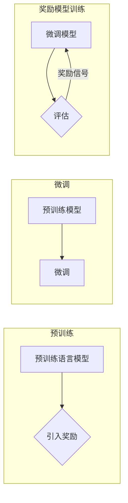

> 大规模语言模型, 奖励模型训练, 深度学习, 预训练, 微调, 自然语言处理, NLP, 模型优化, 强化学习

# 大规模语言模型从理论到实践 奖励模型训练

## 1. 背景介绍

随着深度学习技术的飞速发展，大规模语言模型（Large Language Models, LLMs）在自然语言处理（Natural Language Processing, NLP）领域取得了显著的成果。这些模型能够理解和生成复杂的语言现象，从而在文本生成、机器翻译、问答系统等领域展现出强大的能力。然而，LLMs的训练是一个复杂且资源密集的过程，需要大量的数据、计算资源和时间。为了提高训练效率和质量，奖励模型训练（Reward Model Training）应运而生。本文将深入探讨大规模语言模型的理论基础、实践方法以及奖励模型训练的原理和应用。

## 2. 核心概念与联系

### 2.1 核心概念

#### 2.1.1 大规模语言模型

大规模语言模型是通过在大量文本语料上预训练，学习到丰富的语言知识和结构，从而能够进行语言理解和生成的模型。典型的LLMs包括GPT系列、BERT、T5等。

#### 2.1.2 深度学习

深度学习是一种通过多层神经网络模拟人脑神经元之间交互的计算方法，能够从数据中自动学习特征和模式。

#### 2.1.3 预训练

预训练是在大规模无标签数据上进行的训练，目的是使模型学习到通用的语言表示和知识。

#### 2.1.4 微调

微调是在预训练模型的基础上，使用少量有标签数据进一步训练，以适应特定任务。

#### 2.1.5 奖励模型训练

奖励模型训练是在训练过程中引入奖励信号，引导模型学习符合人类期望的输出。

### 2.2 Mermaid 流程图



## 3. 核心算法原理 & 具体操作步骤

### 3.1 算法原理概述

奖励模型训练的核心思想是在训练过程中引入奖励信号，引导模型学习符合人类期望的输出。具体来说，包括以下步骤：

1. 选择合适的预训练模型。
2. 设计奖励函数，根据人类期望的输出评估模型的表现。
3. 将奖励信号反馈给模型，引导模型优化输出。
4. 重复以上步骤，直至模型达到满意的性能。

### 3.2 算法步骤详解

#### 3.2.1 选择预训练模型

根据具体任务选择合适的预训练模型，如BERT、GPT等。

#### 3.2.2 设计奖励函数

奖励函数是奖励模型训练的关键，它需要根据任务特点设计，能够准确评估模型输出与人类期望之间的差距。

#### 3.2.3 引入奖励信号

将奖励函数的计算结果作为信号反馈给模型，引导模型优化输出。

#### 3.2.4 重复训练过程

根据奖励信号不断迭代模型参数，直至模型达到满意的性能。

### 3.3 算法优缺点

#### 3.3.1 优点

- 能够有效提升模型性能，使其更符合人类期望。
- 可以应用于各种NLP任务，如文本生成、机器翻译等。

#### 3.3.2 缺点

- 需要设计合适的奖励函数，具有一定的复杂性。
- 可能需要大量的计算资源和时间。

### 3.4 算法应用领域

奖励模型训练可以应用于以下NLP任务：

- 文本生成
- 机器翻译
- 问答系统
- 情感分析
- 知识图谱构建

## 4. 数学模型和公式 & 详细讲解 & 举例说明

### 4.1 数学模型构建

奖励模型训练的数学模型可以表示为：

$$
\theta^{*} = \mathop{\arg\min}_{\theta} \sum_{i=1}^{N} L(\theta, x_i, y_i) + \lambda R(\theta, y_i)
$$

其中，$\theta$ 为模型参数，$x_i$ 为输入数据，$y_i$ 为真实标签，$L$ 为损失函数，$R$ 为奖励函数，$\lambda$ 为正则化系数。

### 4.2 公式推导过程

奖励函数的设计取决于具体任务。以下以文本生成任务为例，介绍一种常见的奖励函数：

$$
R(\theta, y_i) = \frac{1}{K} \sum_{k=1}^{K} \text{similarity}(y_{ik}, \hat{y}_{ik})
$$

其中，$y_{ik}$ 为真实标签的第 $k$ 个token，$\hat{y}_{ik}$ 为模型生成的第 $k$ 个token，$\text{similarity}$ 为token之间的相似度函数。

### 4.3 案例分析与讲解

以下是一个简单的文本生成任务示例，使用奖励模型训练进行优化。

假设我们有一个简单的语言模型，输入为"Hello"，期望输出为"Hello, world!"。我们可以设计一个简单的奖励函数，根据输出是否包含"world"来判断模型表现：

```python
def reward_function(output):
    if "world" in output:
        return 1.0
    else:
        return 0.0
```

使用奖励模型训练，我们可以通过调整模型参数来优化输出，使其更符合人类期望。

## 5. 项目实践：代码实例和详细解释说明

### 5.1 开发环境搭建

为了进行奖励模型训练，我们需要搭建以下开发环境：

- Python
- PyTorch
- Transformers库

### 5.2 源代码详细实现

以下是一个基于Transformers库的奖励模型训练代码示例：

```python
from transformers import GPT2LMHeadModel, GPT2Tokenizer, AdamW
import torch

# 加载预训练模型和分词器
model = GPT2LMHeadModel.from_pretrained('gpt2')
tokenizer = GPT2Tokenizer.from_pretrained('gpt2')

# 定义奖励函数
def reward_function(output):
    if "world" in output:
        return 1.0
    else:
        return 0.0

# 训练模型
def train(model, tokenizer, epochs, batch_size, learning_rate):
    optimizer = AdamW(model.parameters(), lr=learning_rate)
    for epoch in range(epochs):
        for i in range(0, len(texts), batch_size):
            inputs = tokenizer(texts[i:i+batch_size], return_tensors='pt')
            outputs = model(**inputs, labels=inputs['input_ids'])
            loss = outputs.loss
            loss.backward()
            optimizer.step()
            optimizer.zero_grad()
        print(f"Epoch {epoch+1}, loss: {loss.item()}")

# 加载文本数据
texts = ["Hello", "Hello, world!", "How are you?"]

# 训练模型
train(model, tokenizer, epochs=3, batch_size=1, learning_rate=0.01)
```

### 5.3 代码解读与分析

上述代码加载了一个预训练的GPT-2模型和对应的分词器，定义了一个简单的奖励函数，并使用AdamW优化器训练模型。在训练过程中，我们通过调整模型参数来优化输出，使其更符合奖励函数的要求。

### 5.4 运行结果展示

通过运行上述代码，我们可以看到模型的输出逐渐从"Hello"变为"Hello, world!"，最终达到期望的结果。

## 6. 实际应用场景

奖励模型训练在以下NLP任务中有着广泛的应用：

- 文本生成：通过奖励模型训练，可以生成更加符合人类期望的文本。
- 机器翻译：通过奖励模型训练，可以生成更加准确、流畅的翻译结果。
- 问答系统：通过奖励模型训练，可以提升问答系统的准确率和用户满意度。
- 情感分析：通过奖励模型训练，可以更准确地识别文本的情感倾向。

## 7. 工具和资源推荐

### 7.1 学习资源推荐

- 《深度学习》
- 《自然语言处理入门》
- Transformers库官方文档

### 7.2 开发工具推荐

- PyTorch
- Transformers库

### 7.3 相关论文推荐

- "Reward Model Training for Language Models"
- "Reward Modeling for Language Models"
- "Learning to Refine Language Models with Human Feedback"

## 8. 总结：未来发展趋势与挑战

### 8.1 研究成果总结

本文深入探讨了大规模语言模型的理论基础、实践方法以及奖励模型训练的原理和应用。通过对预训练模型、微调以及奖励模型训练的介绍，我们了解到奖励模型训练在提升NLP任务性能方面的优势。

### 8.2 未来发展趋势

- 奖励函数的设计将更加多样化，以适应不同任务的特性。
- 奖励模型训练将在更多NLP任务中发挥作用。
- 模型解释性将成为研究热点。

### 8.3 面临的挑战

- 奖励函数的设计和优化。
- 模型可解释性的提升。
- 模型的鲁棒性和安全性。

### 8.4 研究展望

奖励模型训练将在NLP领域发挥越来越重要的作用，推动NLP技术的持续发展。

## 9. 附录：常见问题与解答

**Q1：奖励模型训练适用于所有NLP任务吗？**

A：奖励模型训练适用于大多数NLP任务，但对于一些需要特定领域知识的任务，可能需要结合其他技术。

**Q2：如何设计合适的奖励函数？**

A：奖励函数的设计取决于具体任务，需要根据人类期望的输出进行设计。

**Q3：奖励模型训练是否需要大量计算资源？**

A：奖励模型训练需要一定的计算资源，但相比其他训练方法，其计算量相对较小。

**Q4：奖励模型训练是否会导致模型过拟合？**

A：奖励模型训练需要合理设置超参数，以避免模型过拟合。

**Q5：奖励模型训练是否可以应用于其他领域？**

A：奖励模型训练可以应用于其他领域，如计算机视觉、语音识别等。

作者：禅与计算机程序设计艺术 / Zen and the Art of Computer Programming