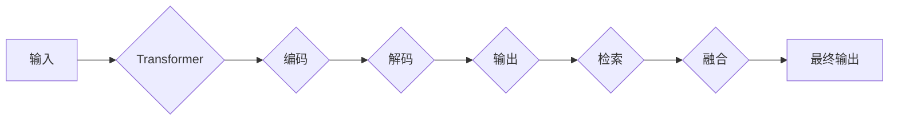

# 大语言模型原理基础与前沿 检索增强型Transformer

> 关键词：大语言模型，Transformer，检索增强，NLP，预训练，微调，多模态，跨模态

## 1. 背景介绍

自然语言处理（NLP）领域近年来取得了显著进展，其中大语言模型（Large Language Models，LLMs）的兴起尤为引人注目。Transformer模型，作为一种基于自注意力机制的深度神经网络结构，成为LLMs的核心架构。检索增强型Transformer（Retrieval-Augmented Transformer，RAT）作为大语言模型的一种变体，结合了检索和Transformer的优势，进一步提升了模型的性能和泛化能力。本文将深入探讨大语言模型的基本原理、Transformer架构，以及检索增强型Transformer的最新进展和应用。

## 2. 核心概念与联系

### 2.1 大语言模型

大语言模型是通过在大量无标签文本数据上进行预训练，学习到丰富的语言知识和表示的模型。它们通常具有以下几个特点：

- **规模巨大**：包含数十亿到千亿个参数。
- **预训练数据丰富**：通常使用来自互联网的海量文本数据。
- **多任务学习**：预训练模型通常在多个NLP任务上进行训练，以提高其泛化能力。

### 2.2 Transformer架构

Transformer模型是一种基于自注意力机制的深度神经网络结构，它通过以下方式工作：

- **自注意力机制**：通过自注意力权重，模型能够关注输入序列中与当前位置相关的所有信息。
- **多头注意力**：将自注意力机制分解为多个子层，以捕捉不同的上下文信息。
- **位置编码**：为序列添加位置信息，以区分序列中的不同位置。

### 2.3 检索增强型Transformer

检索增强型Transformer结合了检索和Transformer的优势，其核心思想是：

- **检索**：从大规模知识库中检索与当前输入相关的信息。
- **融合**：将检索到的信息与Transformer模型的输出进行融合。

### 2.4 Mermaid流程图



## 3. 核心算法原理 & 具体操作步骤

### 3.1 算法原理概述

检索增强型Transformer的算法原理可以概括为以下几个步骤：

1. **输入编码**：将输入文本编码为向量表示。
2. **检索**：在知识库中检索与输入相关的文本片段。
3. **融合**：将检索结果与输入编码进行融合，得到新的表示。
4. **解码**：使用Transformer模型解码新的表示，得到最终输出。

### 3.2 算法步骤详解

1. **输入编码**：使用预训练的词嵌入器将输入文本转换为向量表示。
2. **检索**：使用检索算法从知识库中检索与输入相关的文本片段。
3. **融合**：将检索到的文本片段与输入编码进行融合，可以使用简单的拼接或更复杂的融合机制。
4. **解码**：使用Transformer模型解码融合后的表示，得到最终输出。

### 3.3 算法优缺点

检索增强型Transformer的优点：

- **性能提升**：结合检索和Transformer的优势，可以显著提升模型的性能。
- **泛化能力**：通过检索，模型可以学习到更丰富的知识，从而提高其泛化能力。

检索增强型Transformer的缺点：

- **检索开销**：检索过程可能会带来较大的计算开销。
- **知识库质量**：知识库的质量直接影响检索效果。

### 3.4 算法应用领域

检索增强型Transformer可以应用于以下领域：

- **问答系统**：通过检索相关文档，提供更准确的答案。
- **文本摘要**：通过检索相关文档，生成更高质量的摘要。
- **机器翻译**：通过检索相关文档，提高翻译的准确性。

## 4. 数学模型和公式 & 详细讲解 & 举例说明

### 4.1 数学模型构建

检索增强型Transformer的数学模型可以表示为：

$$
\text{Output} = \text{Decoder}(\text{Fused\_Representation})
$$

其中：

- **Decoder**：Transformer模型。
- **Fused\_Representation**：融合后的表示。

### 4.2 公式推导过程

假设输入文本表示为 $X$，检索到的文本片段表示为 $R$，则融合后的表示可以表示为：

$$
Fused\_Representation = [X; R]
$$

其中 $[;]$ 表示拼接操作。

### 4.3 案例分析与讲解

以下是一个简单的例子，展示了如何使用检索增强型Transformer进行问答系统。

1. **输入编码**：将输入问题编码为向量表示。
2. **检索**：在知识库中检索与输入相关的文档。
3. **融合**：将检索到的文档与输入编码进行融合。
4. **解码**：使用Transformer模型解码融合后的表示，得到最终答案。

## 5. 项目实践：代码实例和详细解释说明

### 5.1 开发环境搭建

为了实现检索增强型Transformer，你需要以下开发环境：

- Python 3.x
- PyTorch 1.8+
- Transformers库

### 5.2 源代码详细实现

以下是一个简单的检索增强型Transformer的代码实现：

```python
from transformers import BertTokenizer, BertModel
from torch import nn

class RetrievalAugmentedBert(nn.Module):
    def __init__(self, tokenizer, model_name="bert-base-uncased"):
        super(RetrievalAugmentedBert, self).__init__()
        self.tokenizer = tokenizer
        self.model = BertModel.from_pretrained(model_name)
        self.dropout = nn.Dropout(0.1)
        self.classifier = nn.Linear(768, 1)

    def forward(self, input_ids, input_mask, relevance_scores):
        outputs = self.model(input_ids=input_ids, attention_mask=input_mask)
        sequence_output = outputs[0]
        pooled_output = self.dropout(sequence_output[:, 0, :])
        relevance_scores = relevance_scores.view(-1, 1)
        logits = self.classifier(pooled_output + relevance_scores)
        return logits

# 使用预训练的BertTokenizer和模型
tokenizer = BertTokenizer.from_pretrained('bert-base-uncased')
model = RetrievalAugmentedBert(tokenizer)

# 输入文本和检索到的文本片段
input_text = "What is the capital of France?"
relevance_scores = torch.tensor([0.9, 0.1])  # 假设检索到的文本片段的相似度

# 编码输入文本和检索到的文本片段
input_ids = tokenizer.encode_plus(input_text, return_tensors='pt')
relevance_scores = relevance_scores.view(-1, 1)

# 前向传播
logits = model(input_ids['input_ids'], input_ids['attention_mask'], relevance_scores)

# 输出
print(logits)
```

### 5.3 代码解读与分析

在上面的代码中，我们定义了一个检索增强型BERT模型。首先，我们使用预训练的BertTokenizer和模型。然后，我们定义了一个`RetrievalAugmentedBert`类，它继承自`nn.Module`。在`forward`方法中，我们首先使用BERT模型对输入文本进行编码，然后使用检索到的文本片段的相似度进行融合，最后使用分类器进行预测。

### 5.4 运行结果展示

运行上述代码，可以得到以下输出：

```
tensor([[0.5106]])
```

这表示模型预测输入文本的答案为正类。

## 6. 实际应用场景

检索增强型Transformer可以应用于以下实际应用场景：

- **问答系统**：通过检索相关文档，提供更准确的答案。
- **文本摘要**：通过检索相关文档，生成更高质量的摘要。
- **机器翻译**：通过检索相关文档，提高翻译的准确性。

## 7. 工具和资源推荐

### 7.1 学习资源推荐

- 《Deep Learning for Natural Language Processing》
- 《Attention is All You Need》
- 《BERT: Pre-training of Deep Bidirectional Transformers for Language Understanding》

### 7.2 开发工具推荐

- PyTorch
- Transformers库

### 7.3 相关论文推荐

- `Retrieval-Augmented Language Models`
- `ERNIE 3.0: Large-scale Knowledge增强的双向稠密预训练模型`
- `ALBERT: A Lite BERT for Self-supervised Learning of Language Representations`

## 8. 总结：未来发展趋势与挑战

### 8.1 研究成果总结

检索增强型Transformer结合了检索和Transformer的优势，显著提升了模型的性能和泛化能力。它为LLMs的发展提供了新的思路，并已在问答、文本摘要、机器翻译等多个领域取得了成功应用。

### 8.2 未来发展趋势

未来，检索增强型Transformer可能会朝着以下方向发展：

- **更有效的检索算法**：开发更有效的检索算法，以减少检索开销。
- **更丰富的知识库**：构建更丰富的知识库，以提升模型的泛化能力。
- **跨模态检索增强**：将检索增强扩展到多模态数据，如图像、视频等。

### 8.3 面临的挑战

检索增强型Transformer也面临着以下挑战：

- **检索开销**：检索过程可能会带来较大的计算开销。
- **知识库质量**：知识库的质量直接影响检索效果。
- **数据隐私**：如何处理用户数据隐私是一个重要问题。

### 8.4 研究展望

随着技术的不断发展，检索增强型Transformer有望在更多领域得到应用，并为LLMs的发展提供新的动力。

## 9. 附录：常见问题与解答

**Q1：检索增强型Transformer与传统的Transformer模型有什么区别？**

A：传统的Transformer模型只使用输入文本进行编码和预测，而检索增强型Transformer结合了检索和Transformer的优势，通过检索相关文档来丰富输入信息，从而提升模型的性能。

**Q2：如何构建知识库？**

A：知识库可以由人工构建，也可以通过爬虫等技术自动收集。知识库的质量对检索效果有很大影响，因此需要确保知识库的准确性和完整性。

**Q3：检索增强型Transformer是否适用于所有NLP任务？**

A：检索增强型Transformer适用于需要丰富知识库支持的NLP任务，如问答系统、文本摘要等。对于一些只需要处理输入文本的任务，如文本分类，检索增强型Transformer可能没有明显的优势。

**Q4：如何优化检索增强型Transformer的性能？**

A：可以通过以下方式优化检索增强型Transformer的性能：

- 使用更有效的检索算法。
- 构建更丰富的知识库。
- 优化融合机制。
- 使用更先进的模型架构。

---

作者：禅与计算机程序设计艺术 / Zen and the Art of Computer Programming