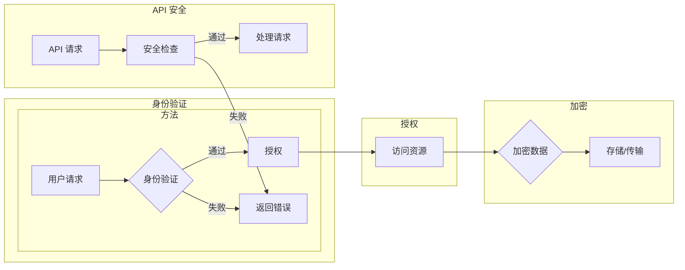

# 安全 API 设计的基本概念

> 关键词：API 设计，安全架构，身份验证，授权，加密，API 安全，最佳实践

## 1. 背景介绍

随着互联网技术的迅猛发展，API（应用程序编程接口）已经成为连接不同系统、服务和应用程序的重要桥梁。然而，API 的广泛应用也带来了新的安全挑战。一个设计不当的 API 可能成为攻击者的攻击目标，导致数据泄露、服务中断等严重后果。因此，安全地设计 API 成为软件开发者和安全专家共同关注的重要议题。

## 2. 核心概念与联系

### 2.1 核心概念

#### 2.1.1 API

API 是一组定义良好的接口，允许不同的软件系统之间进行交互。它定义了请求和响应的格式，以及执行特定操作的方法。

#### 2.1.2 身份验证

身份验证是确保只有授权用户可以访问 API 的过程。常见的身份验证方法包括：

- 基于用户名和密码
- OAuth 2.0
- JWT（JSON Web Tokens）

#### 2.1.3 授权

授权是在身份验证成功后，根据用户角色或权限限制用户访问 API 的具体资源或操作。

#### 2.1.4 加密

加密是将数据转换为不可读形式的过程，以确保数据在传输和存储过程中不被未授权访问。

#### 2.1.5 API 安全

API 安全是指确保 API 在设计、实现和部署过程中不受攻击和保护数据不被泄露的一系列措施。

### 2.2 架构的 Mermaid 流程图



## 3. 核心算法原理 & 具体操作步骤

### 3.1 算法原理概述

安全 API 设计的核心原理是确保 API 在身份验证、授权、加密和 API 安全等方面得到有效保障。

### 3.2 算法步骤详解

1. **设计安全的 API 接口**：确保 API 接口遵循 RESTful 设计原则，使用 HTTPS 协议，避免暴露敏感信息。

2. **实现身份验证**：选择合适的身份验证方法，如 OAuth 2.0 或 JWT，确保只有授权用户可以访问 API。

3. **实现授权**：根据用户角色或权限，限制用户对 API 资源的访问。

4. **实现数据加密**：使用 HTTPS 协议对数据进行加密传输，确保数据在传输过程中的安全性。

5. **实施 API 安全措施**：使用 API 安全工具和策略，如 API 网关、速率限制、API 监控等，防止攻击和滥用。

### 3.3 算法优缺点

#### 3.3.1 优点

- 提高安全性：防止未授权访问和数据泄露。
- 提高可靠性：减少 API 暴露的风险，确保服务稳定运行。
- 提高可维护性：采用标准化的安全措施，便于维护和更新。

#### 3.3.2 缺点

- 增加开发成本：需要投入更多时间和精力设计、实现和测试安全措施。
- 性能影响：加密和验证过程可能会对性能产生一定影响。

### 3.4 算法应用领域

安全 API 设计适用于所有需要提供 API 接口的场景，如 web 服务、移动应用、物联网设备等。

## 4. 数学模型和公式 & 详细讲解 & 举例说明

### 4.1 数学模型构建

安全 API 设计的数学模型主要涉及加密算法和密码学。

#### 4.1.1 加密算法

- 对称加密：使用相同的密钥进行加密和解密。
- 非对称加密：使用不同的密钥进行加密和解密。
- 混合加密：结合对称加密和非对称加密的优点。

#### 4.1.2 密码学

- 消息摘要：将任意长度的消息生成固定长度的摘要。
- 数字签名：用于验证消息的完整性和发送者身份。

### 4.2 公式推导过程

#### 4.2.1 对称加密

设明文 $M$，密钥 $K$，加密函数 $E$，解密函数 $D$，则有：

$$
C = E(M, K) \\
M = D(C, K)
$$

#### 4.2.2 非对称加密

设公钥 $P$，私钥 $Q$，加密函数 $E$，解密函数 $D$，则有：

$$
C = E(M, P) \\
M = D(C, Q)
$$

### 4.3 案例分析与讲解

#### 4.3.1 HTTPS 协议

HTTPS 协议结合了 HTTP 协议和 SSL/TLS 协议，提供数据传输加密、身份验证和完整性保护等功能。

- 使用非对称加密算法生成公钥和私钥。
- 客户端使用服务器的公钥加密数据，并发送给服务器。
- 服务器使用私钥解密数据。
- 双方协商加密算法和密钥，并建立安全的通信通道。

## 5. 项目实践：代码实例和详细解释说明

### 5.1 开发环境搭建

1. 安装 Node.js 环境。
2. 使用 npm 或 yarn 安装 Express 框架和 JWT 库。

### 5.2 源代码详细实现

```javascript
const express = require('express');
const jwt = require('jsonwebtoken');
const app = express();

app.use(express.json());

const secretKey = 'your_secret_key';

app.post('/login', (req, res) => {
  const { username, password } = req.body;
  // 验证用户名和密码
  // ...
  const token = jwt.sign({ username }, secretKey, { expiresIn: '1h' });
  res.json({ token });
});

app.use((req, res, next) => {
  const token = req.headers.authorization.split(' ')[1];
  jwt.verify(token, secretKey, (err, decoded) => {
    if (err) {
      return res.status(401).json({ message: 'Unauthorized' });
    }
    req.user = decoded;
    next();
  });
});

app.get('/protected', (req, res) => {
  res.json({ message: 'Protected resource' });
});

app.listen(3000, () => {
  console.log('Server is running on port 3000');
});
```

### 5.3 代码解读与分析

- 使用 Express 框架创建一个简单的 web 服务器。
- 使用 JWT 库生成和验证 JWT 令牌。
- 使用中间件验证请求的 JWT 令牌，确保用户已登录。
- 只允许已登录用户访问受保护的资源。

### 5.4 运行结果展示

1. 启动服务器。
2. 使用 Postman 或 curl 工具发送登录请求。
3. 使用获取的 JWT 令牌发送受保护的请求。

## 6. 实际应用场景

安全 API 设计在各个领域都有广泛的应用，以下是一些常见的应用场景：

- **电子商务**：用户登录、订单处理、支付等。
- **社交媒体**：用户认证、内容发布、评论管理等。
- **在线银行**：账户信息查询、转账、支付等。
- **物联网**：设备管理、数据采集、设备控制等。

## 7. 工具和资源推荐

### 7.1 学习资源推荐

- 《API 设计：构建可复用、可维护、安全的应用程序》
- 《OAuth 2.0：身份验证与授权的完整指南》
- 《密码学：设计与分析现代密码系统》

### 7.2 开发工具推荐

- **身份验证**：OAuth 2.0、JWT、OAuth 2.0 开发工具包
- **授权**：Spring Security、Apache Shiro
- **加密**：SSL/TLS、JWT 库、加密库

### 7.3 相关论文推荐

- 《OAuth 2.0：身份验证与授权框架》
- 《JSON Web Tokens：基于 JSON 的安全令牌》
- 《API 安全：设计、实现与部署》

## 8. 总结：未来发展趋势与挑战

### 8.1 研究成果总结

安全 API 设计是确保 API 安全性的重要手段。本文介绍了安全 API 设计的基本概念、核心原理、具体操作步骤和实际应用场景，并推荐了相关学习资源和开发工具。

### 8.2 未来发展趋势

- **自动化安全测试**：开发自动化测试工具，对 API 进行安全测试，提高安全测试效率。
- **安全协议发展**：不断改进和更新安全协议，如 OAuth 2.0、JWT 等，以应对新的安全威胁。
- **边缘计算与安全**：在边缘计算环境下，确保 API 的安全性，防止数据泄露。

### 8.3 面临的挑战

- **不断变化的安全威胁**：随着攻击手段的不断升级，需要不断更新安全策略和防御措施。
- **数据保护法规**：遵守数据保护法规，如 GDPR、CCPA 等，保护用户隐私。
- **安全性与性能的平衡**：在确保安全性的同时，提高 API 的性能。

### 8.4 研究展望

安全 API 设计是确保 API 安全性的重要手段。未来，随着技术的发展和应用场景的不断拓展，安全 API 设计将面临更多的挑战和机遇。我们需要不断探索新的安全技术和解决方案，构建更加安全、可靠的 API 环境。

## 9. 附录：常见问题与解答

**Q1：什么是 OAuth 2.0？**

A1：OAuth 2.0 是一种授权框架，允许第三方应用在用户授权的情况下，代表用户访问受保护的资源。

**Q2：什么是 JWT？**

A2：JWT 是一种基于 JSON 的安全令牌，用于在网络上安全地传输信息。

**Q3：如何选择合适的身份验证方法？**

A3：选择身份验证方法需要根据具体场景和需求进行权衡。常见的身份验证方法包括基于用户名和密码、OAuth 2.0 和 JWT。

**Q4：如何保证 API 的安全性？**

A4：为了保证 API 的安全性，需要采取以下措施：
- 使用 HTTPS 协议
- 实施身份验证和授权
- 加密敏感数据
- 定期进行安全审计

**Q5：如何处理 API 的攻击和滥用？**

A5：可以采取以下措施来处理 API 的攻击和滥用：
- 限制 API 请求的频率和速率
- 监控 API 使用情况
- 及时响应安全事件

作者：禅与计算机程序设计艺术 / Zen and the Art of Computer Programming