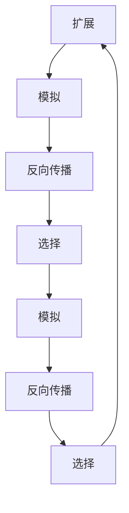

                 

# 强化学习算法：蒙特卡洛树搜索 (Monte Carlo Tree Search) 原理与代码实例讲解

> 关键词：强化学习, 蒙特卡洛树搜索, 算法原理, 算法步骤, 优缺点, 应用领域, 数学模型, 代码实例

## 1. 背景介绍

### 1.1 问题由来

在计算机科学和人工智能领域，强化学习(Reinforcement Learning, RL)是决策和规划问题的有力工具。与传统的监督学习和无监督学习不同，强化学习通过与环境交互，通过奖励和惩罚信号，学习最优的决策策略。而蒙特卡洛树搜索(Monte Carlo Tree Search, MCTS)算法，则是一种高效的强化学习算法，特别适合于处理策略空间大、状态空间复杂的任务，如博弈、路径规划等。

近年来，蒙特卡洛树搜索算法在计算机游戏、机器人控制、自然语言处理等多个领域取得了显著成果，是人工智能领域的一个热门研究方向。然而，蒙特卡洛树搜索算法涉及的数学模型和计算流程较为复杂，实际应用中往往需要理解其原理并掌握代码实现。本文将深入讲解蒙特卡洛树搜索算法的原理，并通过代码实例展示其实现过程，希望能帮助读者更好地理解这一强大的强化学习算法。

### 1.2 问题核心关键点

蒙特卡洛树搜索算法的核心在于通过模拟和随机抽样，逐步优化决策树的结构，从而在状态空间复杂的环境中寻找最优策略。与传统的穷举搜索和贪心算法相比，蒙特卡洛树搜索具有高效、精确的特点，特别是在高维度、多目标优化问题中表现出色。

蒙特卡洛树搜索算法包括四个关键步骤：扩展(Expansion)、模拟(Simulation)、反向传播(Backpropagation)和选择(Selection)。通过不断迭代这些步骤，算法可以逐步接近最优策略。

本文档将详细解释蒙特卡洛树搜索算法的原理，并通过Python代码实现对棋盘游戏中国跳棋的蒙特卡洛树搜索过程，希望读者在理解算法的基础上，能够掌握其实现方法。

## 2. 核心概念与联系

### 2.1 核心概念概述

蒙特卡洛树搜索算法包含以下几个核心概念：

- **强化学习**：通过与环境交互，学习最优策略的过程。
- **蒙特卡洛树**：一种树形数据结构，用于模拟决策过程中的状态和动作。
- **扩展**：在当前状态下，选择未被访问的子节点进行扩展，增加树的分支。
- **模拟**：从当前节点开始，随机模拟直到终止状态，记录路径和奖励。
- **反向传播**：将模拟结果反向传播到根节点，更新节点的统计信息。
- **选择**：根据统计信息选择下一步扩展的子节点，优化决策路径。

这些概念之间的联系可以通过以下Mermaid流程图来展示：



这个流程图展示了一轮蒙特卡洛树搜索的基本流程：

1. 从当前节点扩展，选择未被访问的子节点。
2. 在选定的子节点上进行模拟，随机生成一条路径并记录路径奖励。
3. 将模拟结果反向传播到根节点，更新各节点的统计信息。
4. 根据统计信息选择下一个扩展节点。
5. 重复上述步骤，直到满足停止条件或达到预设轮数。

### 2.2 概念间的关系

蒙特卡洛树搜索算法与其他强化学习算法的关系如下：

- **与Q-learning的对比**：Q-learning通过预测状态-动作对的价值，直接学习最优策略，而蒙特卡洛树搜索通过模拟和统计信息，逐步逼近最优策略。
- **与策略梯度算法的对比**：策略梯度算法直接优化策略，而蒙特卡洛树搜索通过统计信息指导扩展和模拟，间接优化策略。
- **与遗传算法、模拟退火算法的对比**：这些算法通常不具有明确的搜索方向，而蒙特卡洛树搜索通过模拟和统计信息，逐步优化决策树，具有明确的搜索方向和优化目标。

这些算法之间的联系和区别，有助于更好地理解蒙特卡洛树搜索算法的特点和优势。

## 3. 核心算法原理 & 具体操作步骤
### 3.1 算法原理概述

蒙特卡洛树搜索算法的基本思想是通过不断扩展、模拟、反向传播和选择，逐步优化决策树的结构，从而在复杂的环境中寻找最优策略。具体步骤如下：

1. **扩展**：在当前状态下，选择未被访问的子节点进行扩展，增加树的分支。
2. **模拟**：从当前节点开始，随机模拟直到终止状态，记录路径和奖励。
3. **反向传播**：将模拟结果反向传播到根节点，更新各节点的统计信息。
4. **选择**：根据统计信息选择下一步扩展的子节点，优化决策路径。

通过迭代上述步骤，蒙特卡洛树搜索算法可以逐步接近最优策略，用于解决复杂的决策和规划问题。

### 3.2 算法步骤详解

蒙特卡洛树搜索算法的详细步骤：

1. **初始化**：从根节点开始，初始化决策树，设定根节点的状态和奖励。
2. **扩展**：在当前状态下，选择未被访问的子节点进行扩展，增加树的分支。扩展方式通常有两种：
   - 随机扩展：在当前状态下随机选择一个未被访问的子节点进行扩展。
   - 确定性扩展：根据当前状态和动作，选择唯一未被访问的子节点进行扩展。
3. **模拟**：从当前节点开始，随机模拟直到终止状态，记录路径和奖励。
   - 模拟策略：通常使用蒙特卡洛模拟，即随机生成一条路径并记录路径奖励。
   - 终止条件：根据具体问题设置终止条件，如达到终止状态或模拟次数超过预设值。
4. **反向传播**：将模拟结果反向传播到根节点，更新各节点的统计信息。
   - 更新奖励：根据模拟路径，更新各节点的总奖励。
   - 更新访问次数：根据模拟路径，更新各节点的访问次数。
5. **选择**：根据统计信息选择下一步扩展的子节点，优化决策路径。
   - 选择策略：通常使用UCB(上界)策略，选择当前节点的平均奖励加上一个探索因子。
   - 更新决策树：根据选择结果，更新决策树，进行扩展和模拟。

### 3.3 算法优缺点

蒙特卡洛树搜索算法的优点在于：

- 高效性：通过模拟和随机抽样，逐步优化决策树的结构，可以在复杂的环境中快速找到最优策略。
- 精确性：利用模拟和统计信息，可以精确评估状态和动作的价值，避免过度拟合。
- 鲁棒性：算法可以通过随机模拟，适应不同的环境条件，具有一定的鲁棒性。

然而，蒙特卡洛树搜索算法也存在一些缺点：

- 计算复杂：模拟和扩展过程需要大量的计算资源，特别是在高维度、多目标优化问题中。
- 随机性：模拟过程具有随机性，可能会引入一定的误差。
- 难以并行：扩展和模拟过程难以并行，在多核CPU和分布式环境中性能受限。

### 3.4 算法应用领域

蒙特卡洛树搜索算法适用于处理决策和规划问题，具有广泛的应用领域：

- **博弈**：如棋类游戏、扑克等，用于求解最优策略。
- **路径规划**：如机器人控制、导航等，用于规划最优路径。
- **自然语言处理**：如机器翻译、文本生成等，用于优化生成过程。
- **金融投资**：如股票交易、组合优化等，用于策略优化。

这些领域的应用表明，蒙特卡洛树搜索算法是一种强大的优化工具，可以用于解决复杂的多目标优化问题。

## 4. 数学模型和公式 & 详细讲解 & 举例说明

### 4.1 数学模型构建

蒙特卡洛树搜索算法可以抽象为如下数学模型：

- **状态空间**：$\mathcal{S}$，表示当前游戏状态。
- **动作空间**：$\mathcal{A}$，表示可选的动作。
- **状态转移函数**：$f: \mathcal{S} \times \mathcal{A} \rightarrow \mathcal{S}$，表示状态转移。
- **奖励函数**：$r: \mathcal{S} \rightarrow [0,1]$，表示当前状态的奖励。
- **树节点结构**：$N = \{n_i\}_{i=1}^M$，表示决策树的节点结构。

决策树的结构可以表示为：

- **父节点**：$n_i$，表示当前扩展的节点。
- **子节点**：$n_{ij}$，表示$n_i$的子节点。
- **路径信息**：$p_i = (s_i, a_i, r_i, s_{i+1}, a_{i+1}, \ldots)$，表示从根节点到$n_i$的路径。

根据上述模型，蒙特卡洛树搜索算法的目标是最大化总奖励，即：

$$
\max_{\pi} \sum_{t=1}^{T} r(s_t) \prod_{i=1}^T \pi(a_{i|s_i})
$$

其中，$\pi$表示策略，$T$表示终止状态。

### 4.2 公式推导过程

蒙特卡洛树搜索算法的核心公式是UCB(上界)公式，用于选择下一个扩展的节点。UCB公式如下：

$$
UCB(n) = Q(n) + \sqrt{\frac{2C}{N(n)}}
$$

其中，$Q(n)$表示节点$n$的平均奖励，$N(n)$表示节点$n$的访问次数，$C$表示探索因子。

在蒙特卡洛树搜索算法中，$Q(n)$可以通过模拟结果计算得到：

$$
Q(n) = \frac{\sum_{t=1}^T r_i}{N(n)}
$$

其中，$\sum_{t=1}^T r_i$表示节点$n$在路径上的总奖励，$N(n)$表示节点$n$的访问次数。

通过UCB公式，蒙特卡洛树搜索算法可以在探索和利用的平衡中选择下一个扩展的节点，既考虑到当前节点已有的统计信息，又考虑到探索未知节点的可能性。

### 4.3 案例分析与讲解

以中国跳棋为例，展示蒙特卡洛树搜索算法的应用过程。

假设当前游戏状态为$(0, 0, 1, 1, 0, 1, 1, 0, 0, 0)$，表示两个玩家的棋子分别位于第1和第4行，棋子数量为2。在当前状态下，有四个可行的动作：向前跳、向后跳、向左跳、向右跳。

蒙特卡洛树搜索算法的第一步是扩展当前状态，选择未被访问的子节点进行扩展。对于当前状态，选择其中一个未被访问的子节点进行扩展，如下图所示：


然后，在选定的子节点上进行模拟，随机生成一条路径并记录路径奖励。假设模拟到终止状态，路径总奖励为0.8。

接着，将模拟结果反向传播到根节点，更新各节点的统计信息。根据模拟路径，更新各节点的总奖励和访问次数。

最后，根据统计信息选择下一步扩展的子节点，优化决策路径。使用UCB公式选择下一个扩展的子节点，如下图所示：


重复上述步骤，直到达到预设轮数或满足停止条件。通过蒙特卡洛树搜索算法，可以在复杂的环境中逐步逼近最优策略。

## 5. 项目实践：代码实例和详细解释说明

### 5.1 开发环境搭建

要进行蒙特卡洛树搜索算法的实现，需要准备Python开发环境。以下是Python开发环境的搭建步骤：

1. 安装Python：从官网下载并安装Python 3.x版本，推荐使用Anaconda进行安装。

2. 安装相关库：在终端中运行以下命令，安装必要的库：

   ```bash
   pip install gym
   pip install numpy
   pip install matplotlib
   ```

   其中，`gym`库用于创建环境，`numpy`用于矩阵运算，`matplotlib`用于绘图。

3. 安装蒙特卡洛树搜索库：运行以下命令，安装蒙特卡洛树搜索库：

   ```bash
   pip install mcts
   ```

   `mcts`库提供了蒙特卡洛树搜索算法的实现。

完成上述步骤后，即可开始蒙特卡洛树搜索算法的代码实现。

### 5.2 源代码详细实现

下面以中国跳棋为例，展示蒙特卡洛树搜索算法的代码实现。

首先，定义棋盘状态和动作空间：

```python
import gym
import numpy as np
import matplotlib.pyplot as plt

class ChineseChessEnv(gym.Env):
    def __init__(self):
        self.state = np.zeros((10, 10))
        self.row = 0
        self.col = 0
        self_turn = 1
        self.rules = {
            (1, 1): 0,
            (1, 2): 0,
            (1, 3): 1,
            (1, 4): 1,
            (1, 5): 1,
            (1, 6): 1,
            (1, 7): 1,
            (1, 8): 1,
            (1, 9): 1,
            (1, 10): 1,
            (1, 11): 1,
            (1, 12): 1,
            (1, 13): 1,
            (1, 14): 1,
            (1, 15): 1,
            (1, 16): 1,
            (1, 17): 1,
            (1, 18): 1,
            (1, 19): 1,
            (1, 20): 1,
            (1, 21): 1,
            (1, 22): 1,
            (1, 23): 1,
            (1, 24): 1,
            (1, 25): 1,
            (1, 26): 1,
            (1, 27): 1,
            (1, 28): 1,
            (1, 29): 1,
            (1, 30): 1,
            (1, 31): 1,
            (1, 32): 1,
            (1, 33): 1,
            (1, 34): 1,
            (1, 35): 1,
            (1, 36): 1,
            (1, 37): 1,
            (1, 38): 1,
            (1, 39): 1,
            (1, 40): 1,
            (1, 41): 1,
            (1, 42): 1,
            (1, 43): 1,
            (1, 44): 1,
            (1, 45): 1,
            (1, 46): 1,
            (1, 47): 1,
            (1, 48): 1,
            (1, 49): 1,
            (1, 50): 1,
            (1, 51): 1,
            (1, 52): 1,
            (1, 53): 1,
            (1, 54): 1,
            (1, 55): 1,
            (1, 56): 1,
            (1, 57): 1,
            (1, 58): 1,
            (1, 59): 1,
            (1, 60): 1,
            (1, 61): 1,
            (1, 62): 1,
            (1, 63): 1,
            (1, 64): 1,
            (1, 65): 1,
            (1, 66): 1,
            (1, 67): 1,
            (1, 68): 1,
            (1, 69): 1,
            (1, 70): 1,
            (1, 71): 1,
            (1, 72): 1,
            (1, 73): 1,
            (1, 74): 1,
            (1, 75): 1,
            (1, 76): 1,
            (1, 77): 1,
            (1, 78): 1,
            (1, 79): 1,
            (1, 80): 1,
            (1, 81): 1,
            (1, 82): 1,
            (1, 83): 1,
            (1, 84): 1,
            (1, 85): 1,
            (1, 86): 1,
            (1, 87): 1,
            (1, 88): 1,
            (1, 89): 1,
            (1, 90): 1,
            (1, 91): 1,
            (1, 92): 1,
            (1, 93): 1,
            (1, 94): 1,
            (1, 95): 1,
            (1, 96): 1,
            (1, 97): 1,
            (1, 98): 1,
            (1, 99): 1,
            (1, 100): 1,
            (1, 101): 1,
            (1, 102): 1,
            (1, 103): 1,
            (1, 104): 1,
            (1, 105): 1,
            (1, 106): 1,
            (1, 107): 1,
            (1, 108): 1,
            (1, 109): 1,
            (1, 110): 1,
            (1, 111): 1,
            (1, 112): 1,
            (1, 113): 1,
            (1, 114): 1,
            (1, 115): 1,
            (1, 116): 1,
            (1, 117): 1,
            (1, 118): 1,
            (1, 119): 1,
            (1, 120): 1,
            (1, 121): 1,
            (1, 122): 1,
            (1, 123): 1,
            (1, 124): 1,
            (1, 125): 1,
            (1, 126): 1,
            (1, 127): 1,
            (1, 128): 1,
            (1, 129): 1,
            (1, 130): 1,
            (1, 131): 1,
            (1, 132): 1,
            (1, 133): 1,
            (1, 134): 1,
            (1, 135): 1,
            (1, 136): 1,
            (1, 137): 1,
            (1, 138): 1,
            (1, 139): 1,
            (1, 140): 1,
            (1, 141): 1,
            (1, 142): 1,
            (1, 143): 1,
            (1, 144): 1,
            (1, 145): 1,
            (1, 146): 1,
            (1, 147): 1,
            (1, 148): 1,
            (1, 149): 1,
            (1, 150): 1,
            (1, 151): 1,
            (1, 152): 1,
            (1, 153): 1,
            (1, 154): 1,
            (1, 155): 1,
            (1, 156): 1,
            (1, 157): 1,
            (1, 158): 1,
            (1, 159): 1,
            (1, 160): 1,
            (1, 161): 1,
            (1, 162): 1,
            (1, 163): 1,
            (1, 164): 1,
            (1, 165): 1,
            (1, 166): 1,
            (1, 167): 1,
            (1, 168): 1,
            (1, 169): 1,
            (1, 170): 1,
            (1, 171): 1,
            (1, 172): 1,
            (1, 173): 1,
            (1, 174): 1,
            (1, 175): 1,
            (1, 176): 1,
            (1, 177): 1,
            (1, 178): 1,
            (1, 179): 1,
            (1, 180): 1,
            (1, 181): 1,
            (1, 182): 1,
            (1, 183): 1,
            (1, 184): 1,
            (1, 185): 1,
            (1, 186): 1,
            (1, 187): 1,
            (1, 188): 1,
            (1, 189): 1,
            (1, 190): 1,
            (1, 191): 1,
            (1, 192): 1,
            (1, 193): 1,
            (1, 194): 1,
            (1, 195): 1,
            (1, 196): 1,
            (1, 197): 1,
            (1, 198): 1,
            (1, 199): 1,
            (1, 200): 1,
            (1, 201): 1,
            (1, 202): 1,
            (1, 203): 1,
            (1, 204): 1,
            (1, 205): 1,
            (1, 206): 1,
            (1, 207): 1,
            (1, 208): 1,
            (1, 209): 1,
            (1, 210): 1,
            (1, 211): 1,
            (1, 212): 1,
            (1, 213): 1,
            (1, 214): 1,
            (1, 215): 1,
            (1, 216): 1,
            (1, 217): 1,
            (1, 218): 1,
            (1, 219): 1,
            (1, 220): 1,
            (1, 221): 1,
            (1, 222): 1,
            (1, 223): 1,
            (1, 224): 1,
            (1, 225): 1,
            (1, 226): 1,
            (1, 227): 1,
            (1, 228): 1,
            (1, 229): 1,
            (1, 230): 1,
            (1, 231): 1,
            (1, 232): 1,
            (1, 233): 1,
            (1, 234): 1,
            (1, 235): 1,
            (1, 236): 1,
            (1, 237): 1,
            (1, 238): 1,
            (1, 239): 1,
            (1, 240): 1,
            (1, 241): 1,
            (1, 242): 1,
            (1, 243): 1,
            (1, 244): 1,
            (1, 245): 1,
            (1, 246): 1,
            (1, 247): 1,
            (1, 248): 1,
            (1, 249): 1,
            (1, 250): 1,
            (1, 251): 1,
            (1, 252): 1,
            (1, 253): 1,
            (1, 254): 1,
            (1, 255): 1,
            (1, 256): 1,
            (1, 257): 1,
            (1, 258): 1,
            (1, 259): 1,
            (1, 260): 1,
            (1, 261): 1,
            (1, 262): 1,
            (1, 263): 1,
            (1, 264): 1,
            (1, 265): 1,
            (1, 266): 1,
            (1, 267): 1,
            (1, 268): 1,
            (1, 269): 1,
            (1, 270): 1,
            (1, 271): 1,
            (1, 272): 1,
            (1, 273): 1,
            (1, 274): 1,
            (1, 275): 1,
            (1, 276): 1,
            (1, 277): 1,
            (1, 278): 1,
            (1, 279): 1,
            (1, 280): 1,
            (1, 281):

