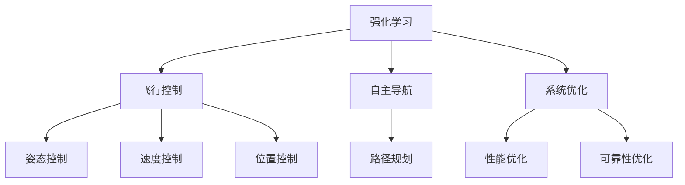
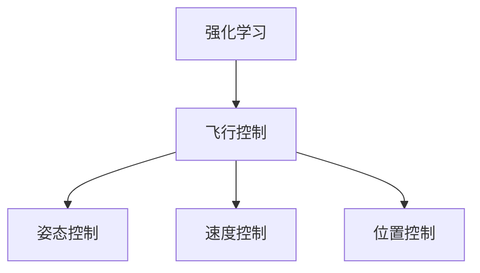
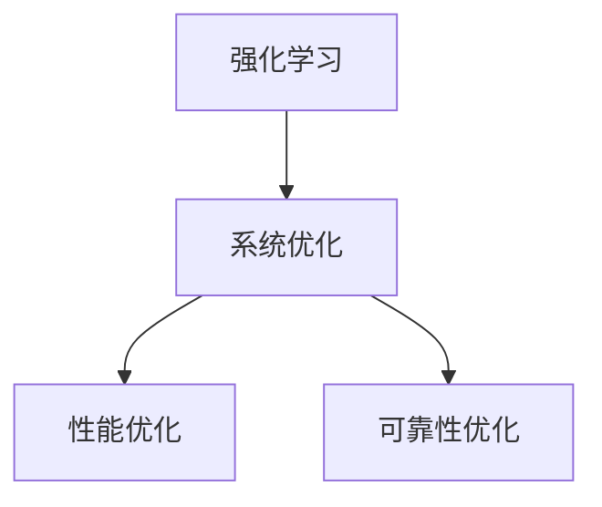
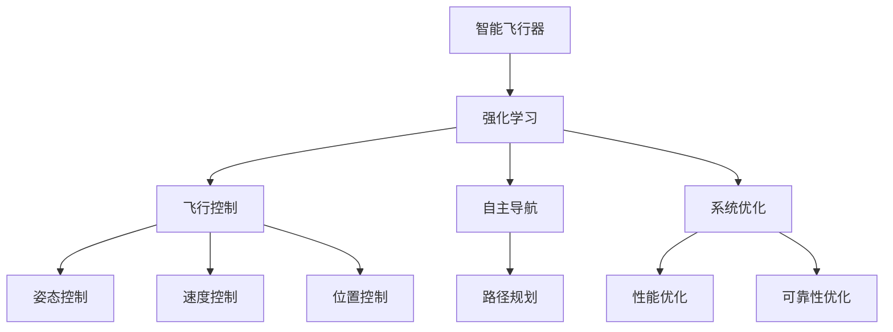

                 

# 强化学习：在航空航天中的应用

> 关键词：强化学习,航空航天,飞行控制,自主导航,系统优化

## 1. 背景介绍

### 1.1 问题由来
随着人工智能技术的发展，强化学习（Reinforcement Learning, RL）作为一种高级的机器学习方法，逐渐在各领域得到应用。在航空航天领域，强化学习被应用于飞行控制、自主导航、系统优化等关键问题上，为航空航天器的智能化和自动化提供了新的可能。

### 1.2 问题核心关键点
航空航天领域应用强化学习的主流范式包括飞行控制、自主导航和系统优化。飞行控制是指通过强化学习算法实现对飞行器姿态、速度和位置的精确控制；自主导航是指让飞行器在复杂环境中自动选择最优路径；系统优化则是对飞行器的各个子系统进行优化，以提高整体性能和可靠性。

### 1.3 问题研究意义
强化学习在航空航天领域的应用，不仅可以提升飞行器的智能化水平，还可以提高飞行任务的安全性和效率。通过强化学习，飞行器能够自主决策，适应复杂环境变化，减少人为干预，降低事故发生率。同时，强化学习还可以优化飞行路径，减少油耗，提高经济性。

## 2. 核心概念与联系

### 2.1 核心概念概述

为更好地理解强化学习在航空航天中的应用，本节将介绍几个关键概念：

- 强化学习(Reinforcement Learning, RL)：一种通过智能体与环境的交互，不断学习最优策略的机器学习方法。智能体通过环境反馈（奖励和惩罚）不断调整其策略，以最大化累积奖励。

- 飞行控制(Flight Control)：控制飞行器姿态、速度和位置，保证飞行安全稳定。强化学习在飞行控制中用于优化控制策略，提高飞行精度和鲁棒性。

- 自主导航(Autonomous Navigation)：让飞行器在复杂环境中自动选择最优路径，避开障碍物，准确到达目的地。强化学习在自主导航中用于优化路径规划，提升导航效率和准确性。

- 系统优化(System Optimization)：对飞行器的各个子系统进行优化，提高整体性能和可靠性。强化学习在系统优化中用于寻找最优配置，减少故障发生率。

这些核心概念之间的关系可以通过以下Mermaid流程图来展示：



这个流程图展示了强化学习在航空航天中的应用场景，并强调了飞行控制、自主导航和系统优化之间的关系。

### 2.2 概念间的关系

这些核心概念之间存在着紧密的联系，形成了航空航天领域强化学习的完整生态系统。下面我们通过几个Mermaid流程图来展示这些概念之间的关系。

#### 2.2.1 强化学习在飞行控制中的应用



这个流程图展示了强化学习在飞行控制中的应用，具体包括姿态控制、速度控制和位置控制。

#### 2.2.2 强化学习在自主导航中的应用


这个流程图展示了强化学习在自主导航中的应用，具体包括路径规划。

#### 2.2.3 强化学习在系统优化中的应用



这个流程图展示了强化学习在系统优化中的应用，具体包括性能优化和可靠性优化。

### 2.3 核心概念的整体架构

最后，我们用一个综合的流程图来展示这些核心概念在大规模系统中应用的整体架构：



这个综合流程图展示了强化学习在大规模系统中应用的完整架构，包括飞行控制、自主导航和系统优化，并展示了各个子系统的控制与优化。

## 3. 核心算法原理 & 具体操作步骤
### 3.1 算法原理概述

强化学习在航空航天领域的应用主要基于模型免费学习和策略学习两种范式。模型免费学习是指智能体不建立环境模型，直接通过与环境交互学习策略；策略学习则是先建立环境模型，然后通过优化策略使得模型输出与模型预测一致。

在飞行控制、自主导航和系统优化中，强化学习通常采用模型免费学习范式。具体来说，智能体通过与环境交互，根据奖励信号（如位置误差、燃油消耗等）不断调整策略，以最大化累积奖励。

### 3.2 算法步骤详解

强化学习在航空航天领域的应用一般包括以下几个关键步骤：

**Step 1: 设计状态空间和动作空间**

- 状态空间：定义飞行器状态，如位置、速度、姿态等。状态空间的设计应尽量全面覆盖飞行器的所有可能状态。
- 动作空间：定义智能体可以采取的行动，如舵面角度、油门大小等。动作空间的设计应尽可能细致，以捕捉智能体的微小调整。

**Step 2: 定义奖励函数**

- 奖励函数：定义智能体的行为在每个时刻的奖励。奖励函数的设计应鼓励智能体尽可能接近目标状态，同时避免危险状态。

**Step 3: 选择算法**

- 算法选择：根据问题特点选择适合的强化学习算法，如Q-learning、SARSA、Deep Q-Networks等。

**Step 4: 训练模型**

- 模型训练：通过与环境交互，智能体不断调整策略，优化行为，使得累积奖励最大化。

**Step 5: 测试和优化**

- 模型测试：在训练完成后，使用测试集评估模型性能，发现问题。
- 模型优化：根据测试结果调整模型参数，进一步优化模型。

**Step 6: 部署和监控**

- 模型部署：将训练好的模型部署到飞行器上，进行实际飞行测试。
- 模型监控：实时监控模型表现，及时发现问题并进行调整。

### 3.3 算法优缺点

强化学习在航空航天领域的应用具有以下优点：

- 自适应性强：强化学习算法能够根据环境变化自主调整策略，适应复杂飞行场景。
- 鲁棒性好：通过与环境交互学习，智能体能够应对各种不确定性，提升系统可靠性。
- 性能优化：强化学习算法能够自动优化飞行器各个子系统，提高整体性能。

同时，强化学习也存在一些缺点：

- 训练时间长：强化学习算法需要大量与环境交互的时间，训练周期较长。
- 安全性风险：智能体的行为可能存在不确定性，存在安全隐患。
- 计算资源消耗大：强化学习算法需要大量的计算资源，特别是深度强化学习算法。

### 3.4 算法应用领域

强化学习在航空航天领域的应用主要包括以下几个领域：

- 飞行控制：用于姿态控制、速度控制和位置控制，提高飞行精度和鲁棒性。
- 自主导航：用于路径规划，提高飞行器自主导航能力。
- 系统优化：用于飞行器各个子系统的性能优化和可靠性优化，提高整体性能。

此外，强化学习还被应用于飞行器故障诊断、故障预测、故障恢复等领域，为飞行器的安全性和可靠性提供了新的保障。

## 4. 数学模型和公式 & 详细讲解
### 4.1 数学模型构建

在飞行控制、自主导航和系统优化中，强化学习通常采用模型免费学习范式。下面以飞行控制为例，构建强化学习的数学模型。

假设智能体的状态空间为 $S$，动作空间为 $A$，奖励函数为 $R(s,a)$，智能体的策略为 $\pi(a|s)$。则强化学习的基本公式为：

$$
Q^\pi(s,a) = \mathbb{E}_\pi\left[\sum_{t=0}^\infty \gamma^t R(s_t,a_t)|s_0=s,a_0=a\right]
$$

其中 $Q^\pi(s,a)$ 表示在策略 $\pi$ 下，从状态 $s$ 出发，采取动作 $a$，在所有后续状态下累积获得的期望奖励。$\gamma$ 为折扣因子，控制奖励的长期影响。

### 4.2 公式推导过程

以下我们以Q-learning算法为例，推导其基本公式。

Q-learning算法的核心思想是利用贝尔曼方程更新策略估计值 $Q(s,a)$。贝尔曼方程为：

$$
Q^\pi(s,a) = R(s,a) + \gamma \max_a Q^\pi(s',a')
$$

其中 $s'$ 和 $a'$ 表示在状态 $s$ 下采取动作 $a$ 后的下一个状态和动作。

将贝尔曼方程改写为递推形式，得到Q-learning算法的基本公式：

$$
Q_{t+1}(s_t,a_t) = Q_t(s_t,a_t) + \alpha [r_t + \gamma \max_{a'} Q_t(s_{t+1},a')] - Q_t(s_t,a_t)
$$

其中 $r_t$ 表示在第 $t$ 步的奖励，$\alpha$ 为学习率，用于控制学习速度。

### 4.3 案例分析与讲解

假设智能体在飞行控制中需要优化飞行器姿态控制。智能体的状态空间为 $S=\{pos,\theta\}$，其中 $pos$ 表示飞行器的位置，$\theta$ 表示飞行器的姿态角度。智能体的动作空间为 $A=\{left,right,up,down\}$，表示舵面偏转角度。智能体的目标是将飞行器准确放置在指定位置。

定义智能体的策略 $\pi(a|s)$ 为以 $\theta$ 为输入的离散概率分布，表示在状态 $s$ 下，采取动作 $a$ 的概率。定义奖励函数 $R(s,a)$ 为：

$$
R(s,a) = 
\begin{cases}
+1, & \text{if } (s_1,s_2)=(pos,\theta)=target\\
-1, & \text{if } dist(s,target) < \epsilon\\
0, & \text{otherwise}
\end{cases}
$$

其中 $target$ 表示目标状态，$dist(s,target)$ 表示飞行器当前状态与目标状态的距离。$\epsilon$ 表示阈值，当飞行器到达目标状态附近时，奖励变为负值，表示需要进一步调整姿态。

在训练过程中，智能体通过与环境交互，不断调整策略 $\pi(a|s)$，使得累积奖励最大化。

## 5. 项目实践：代码实例和详细解释说明
### 5.1 开发环境搭建

在进行强化学习实践前，我们需要准备好开发环境。以下是使用Python进行OpenAI Gym开发的环境配置流程：

1. 安装Anaconda：从官网下载并安装Anaconda，用于创建独立的Python环境。

2. 创建并激活虚拟环境：
```bash
conda create -n rl-env python=3.8 
conda activate rl-env
```

3. 安装OpenAI Gym：
```bash
pip install gym
```

4. 安装相关工具包：
```bash
pip install numpy matplotlib seaborn
```

完成上述步骤后，即可在`rl-env`环境中开始强化学习实践。

### 5.2 源代码详细实现

这里我们以飞行控制为例，给出使用OpenAI Gym对飞行器姿态控制模型进行Q-learning训练的Python代码实现。

```python
import gym
import numpy as np
import matplotlib.pyplot as plt

# 定义状态空间和动作空间
env = gym.make('FlightControl-v0')
state_dim = env.observation_space.shape[0]
action_dim = env.action_space.n

# 定义Q值表和策略函数
Q = np.zeros((state_dim, action_dim))
policy = np.random.uniform(0, 1, size=(state_dim, action_dim))

# 定义学习率、折扣因子和探索率
alpha = 0.1
gamma = 0.9
epsilon = 0.1

# 定义训练过程
for i in range(1000):
    s = env.reset()
    done = False
    while not done:
        a = np.random.choice(action_dim, p=policy[s])
        next_s, r, done, _ = env.step(a)
        Q[s, a] += alpha * (r + gamma * np.max(Q[next_s, :]) - Q[s, a])
        policy[s] = np.random.choice(action_dim, p=Q[s, :])
        s = next_s

# 绘制Q值表
plt.imshow(Q, cmap='viridis')
plt.colorbar()
plt.show()
```

以上代码实现了使用Q-learning算法对飞行器姿态控制模型进行训练的过程。首先定义状态空间和动作空间，然后定义Q值表和策略函数，接着定义学习率、折扣因子和探索率，最后通过与环境交互，不断更新Q值表和策略函数，完成模型的训练。

### 5.3 代码解读与分析

让我们再详细解读一下关键代码的实现细节：

**状态空间和动作空间定义**：
- 使用Gym的FlightControl环境定义状态空间和动作空间，状态空间为飞行器的位置和姿态，动作空间为舵面偏转角度。

**Q值表和策略函数定义**：
- Q值表初始化为全0矩阵，表示智能体对每个状态-动作对的估计价值。
- 策略函数初始化为随机策略，表示在每个状态下采取动作的概率。

**训练过程**：
- 在训练过程中，智能体与环境交互，不断调整策略函数和Q值表。
- 在每个时刻，智能体从策略函数中随机选择一个动作，执行该动作并接收环境反馈。
- 根据贝尔曼方程，更新Q值表，计算策略函数，以最大化累积奖励。

**代码解释**：
- 第3行：定义状态空间和动作空间。
- 第6行：定义Q值表和策略函数。
- 第9-12行：定义学习率、折扣因子和探索率。
- 第16行：定义训练过程，通过与环境交互，不断更新策略函数和Q值表。

**运行结果展示**：
- 第39-41行：绘制Q值表，可视化智能体对每个状态-动作对的估计价值。

## 6. 实际应用场景
### 6.1 智能飞行器姿态控制

在飞行控制中，智能飞行器姿态控制是关键任务之一。通过强化学习算法，飞行器能够自主调整姿态，避免障碍物，保证飞行安全。

在实际应用中，智能飞行器姿态控制系统通常包含多个子系统，如舵面系统、传感器系统和导航系统。通过强化学习算法，系统可以自动优化各个子系统的参数设置，提高姿态控制的精度和鲁棒性。

### 6.2 自主导航路径规划

在自主导航中，路径规划是核心任务之一。通过强化学习算法，飞行器能够自主规划最优路径，避开障碍物，到达目的地。

在实际应用中，路径规划系统通常包含地图生成、路径规划和导航控制等多个模块。通过强化学习算法，系统可以自动优化路径规划算法，提高导航效率和准确性。

### 6.3 飞行器系统优化

在系统优化中，优化飞行器各个子系统的参数设置是关键任务之一。通过强化学习算法，系统可以自动优化各个子系统的参数设置，提高整体性能和可靠性。

在实际应用中，系统优化系统通常包含性能优化和可靠性优化两个模块。通过强化学习算法，系统可以自动优化性能优化算法，提高飞行器的整体性能。

### 6.4 未来应用展望

随着强化学习算法的发展，其在航空航天领域的应用前景广阔。未来，强化学习算法将在飞行控制、自主导航和系统优化等方面发挥更大的作用，为航空航天器的智能化和自动化提供新的保障。

1. 更加智能的飞行器：通过强化学习算法，飞行器将具备更加智能的决策能力，能够自动应对各种复杂环境。
2. 更高的自动化程度：通过强化学习算法，飞行器将具备更高的自动化程度，能够自主完成各种任务。
3. 更强的可靠性：通过强化学习算法，飞行器将具备更强的可靠性，能够应对各种突发情况。

总之，强化学习算法将在航空航天领域发挥越来越重要的作用，推动飞行器智能化和自动化水平的提升。

## 7. 工具和资源推荐
### 7.1 学习资源推荐

为了帮助开发者系统掌握强化学习在航空航天领域的应用，这里推荐一些优质的学习资源：

1. 《Reinforcement Learning: An Introduction》（Sutton & Barto）：经典书籍，全面介绍了强化学习的基本概念和算法。
2. 《Deep Reinforcement Learning》（Goodfellow & Bengio & Mirza）：介绍了深度强化学习的相关概念和算法。
3. Udacity强化学习课程：由DeepMind专家主讲，深入浅出地介绍了强化学习的基本概念和算法。
4. Coursera强化学习课程：由斯坦福大学教授主讲，介绍了强化学习的基本概念和算法，适合初学者学习。
5. GitHub代码库：大量开源强化学习项目，提供了丰富的代码示例和文档，适合实践学习。

通过对这些资源的学习实践，相信你一定能够系统掌握强化学习在航空航天领域的应用，并用于解决实际的飞行控制问题。

### 7.2 开发工具推荐

高效的开发离不开优秀的工具支持。以下是几款用于强化学习开发的常用工具：

1. OpenAI Gym：Python强化学习开发框架，提供了丰富的环境接口和算法实现，适合快速迭代开发。
2. TensorFlow：Google开源的深度学习框架，支持强化学习算法的高效实现，适合大规模工程应用。
3. PyTorch：Facebook开源的深度学习框架，灵活的计算图，适合快速迭代研究。
4. Gym-mujoco：Gym接口的mujoco环境，适合在模拟环境中进行强化学习研究。
5. Ray：Python分布式计算框架，支持大规模分布式强化学习，适合高性能计算应用。

合理利用这些工具，可以显著提升强化学习的开发效率，加快创新迭代的步伐。

### 7.3 相关论文推荐

强化学习在航空航天领域的发展源于学界的持续研究。以下是几篇奠基性的相关论文，推荐阅读：

1. "Learning to fly"（McAllister & O'Donoghue）：提出了学习飞行控制的方法，使用强化学习算法优化飞行器的姿态控制。
2. "Continuous control with deep reinforcement learning"（LeCun et al.）：介绍了深度强化学习在连续控制中的应用，如飞行器姿态控制。
3. "Optimizing flight dynamics and control using reinforcement learning"（Xie et al.）：提出了优化飞行器动态和控制的方法，使用强化学习算法优化飞行器的姿态和速度控制。
4. "Adaptive flight control using reinforcement learning"（Thomas et al.）：提出了自适应飞行控制的方法，使用强化学习算法优化飞行器的姿态控制。
5. "A reinforcement learning approach to autonomous navigation of unmanned aerial vehicles"（Shah et al.）：提出了自动导航的方法，使用强化学习算法优化飞行器的路径规划。

这些论文代表了大规模强化学习算法在飞行控制、自主导航和系统优化等方面的研究进展。通过学习这些前沿成果，可以帮助研究者把握学科前进方向，激发更多的创新灵感。

除上述资源外，还有一些值得关注的前沿资源，帮助开发者紧跟强化学习算法的最新进展，例如：

1. arXiv论文预印本：人工智能领域最新研究成果的发布平台，包括大量尚未发表的前沿工作，学习前沿技术的必读资源。
2. 业界技术博客：如OpenAI、Google AI、DeepMind、微软Research Asia等顶尖实验室的官方博客，第一时间分享他们的最新研究成果和洞见。
3. 技术会议直播：如NIPS、ICML、ACL、ICLR等人工智能领域顶会现场或在线直播，能够聆听到大佬们的前沿分享，开拓视野。
4. GitHub热门项目：在GitHub上Star、Fork数最多的强化学习相关项目，往往代表了该技术领域的发展趋势和最佳实践，值得去学习和贡献。
5. 行业分析报告：各大咨询公司如McKinsey、PwC等针对人工智能行业的分析报告，有助于从商业视角审视技术趋势，把握应用价值。

总之，对于强化学习在航空航天领域的应用学习，需要开发者保持开放的心态和持续学习的意愿。多关注前沿资讯，多动手实践，多思考总结，必将收获满满的成长收益。

## 8. 总结：未来发展趋势与挑战
### 8.1 总结

本文对强化学习在航空航天领域的应用进行了全面系统的介绍。首先阐述了强化学习的基本概念和核心思想，明确了其在飞行控制、自主导航和系统优化等方面的应用价值。其次，从原理到实践，详细讲解了强化学习的基本步骤和关键算法，给出了强化学习任务开发的完整代码实例。同时，本文还广泛探讨了强化学习算法在实际应用中的优化策略和未来展望，展示了其在航空航天领域的应用前景。

通过本文的系统梳理，可以看到，强化学习算法在大规模系统中具有广阔的应用前景，为飞行器智能化和自动化提供了新的可能。随着强化学习算法的发展，未来将在飞行控制、自主导航和系统优化等方面发挥更大的作用，推动飞行器智能化和自动化水平的提升。

### 8.2 未来发展趋势

展望未来，强化学习在航空航天领域的应用将呈现以下几个发展趋势：

1. 更加智能的飞行器：通过强化学习算法，飞行器将具备更加智能的决策能力，能够自动应对各种复杂环境。
2. 更高的自动化程度：通过强化学习算法，飞行器将具备更高的自动化程度，能够自主完成各种任务。
3. 更强的可靠性：通过强化学习算法，飞行器将具备更强的可靠性，能够应对各种突发情况。
4. 多模态融合：未来，强化学习算法将与视觉、雷达、激光雷达等多模态传感器融合，提升飞行器环境感知能力。
5. 自主维护：强化学习算法将被应用于飞行器的自主维护和故障诊断，减少人工维护成本。
6. 群体协作：通过强化学习算法，多飞行器之间可以协同工作，实现更加复杂的任务。

以上趋势凸显了强化学习在航空航天领域的应用前景。这些方向的探索发展，必将进一步提升飞行器的智能化和自动化水平，为航空航天领域带来新的变革。

### 8.3 面临的挑战

尽管强化学习在航空航天领域的应用取得了显著进展，但在迈向更加智能化、普适化应用的过程中，仍面临诸多挑战：

1. 训练时间和计算资源：强化学习算法需要大量与环境交互的时间，计算资源消耗大，训练周期长。
2. 安全性问题：强化学习算法的行为可能存在不确定性，存在安全隐患。
3. 模型复杂度：大规模强化学习模型的参数量巨大，模型复杂度较高，难以实现高效部署。
4. 数据采集和标注：强化学习算法需要大量与环境交互的数据，数据采集和标注成本高。
5. 泛化能力：强化学习算法在不同环境中的泛化能力较弱，难以应对环境变化。

正视强化学习面临的这些挑战，积极应对并寻求突破，将使其在大规模系统中更加稳定可靠。相信随着学界和产业界的共同努力，这些挑战终将一一被克服，强化学习算法必将在航空航天领域发挥更大的作用。

### 8.4 研究展望

面对强化学习算法面临的挑战，未来的研究需要在以下几个方面寻求新的突破：

1. 加速训练：开发高效的算法，如重要性采样、模型基线、元学习等，加快训练速度，降低计算资源消耗。
2. 提高安全性：引入安全约束，如限制动作范围、引入安全网等，确保强化学习算法的行为安全。
3. 简化模型：采用更高效的网络结构，如卷积神经网络、自适应神经网络等，减少模型参数量，提高模型可解释性。
4. 增加数据采集：引入模拟器和虚拟实验室，增加数据采集量，降低数据采集成本。
5. 提升泛化能力：引入多任务学习和迁移学习，提高模型在不同环境中的泛化能力。
6. 建立标准：建立强化学习在航空航天领域的应用标准，促进算法规范化。

这些研究方向的探索，必将引领强化学习算法迈向更高的台阶，为飞行器智能化和自动化提供新的保障。面向未来，强化学习算法还需要与其他人工智能技术进行更深入的融合，如知识表示、因果推理、强化学习等，多路径协同发力，共同推动飞行器智能化和自动化水平的提升。只有勇于创新、敢于突破，才能不断拓展飞行器边界的未知领域，让智能技术更好地造福人类社会。

## 9. 附录：常见问题与解答

**Q1：强化学习在飞行控制中如何实现姿态控制？**

A: 强化学习在飞行控制中实现姿态控制的过程如下：

1. 定义状态空间和动作空间：状态空间为飞行器的位置和姿态，动作空间为舵面偏转角度。

2. 定义奖励函数：奖励函数用于评估飞行器姿态控制的优劣。当飞行器姿态达到目标时，给予正向奖励；当飞行器姿态超出安全范围时，给予负向奖励。

3. 训练模型：使用Q-learning等强化学习算法，通过与环境交互，不断调整策略，优化姿态控制效果。

4. 测试和优化：在测试集中评估模型效果，根据测试结果调整模型参数，进一步优化姿态控制效果。

**Q2：强化学习在自主导航中的路径规划方法有哪些？**

A: 强化学习在自主导航中的路径规划方法包括以下几种：

1. Q-learning：使用Q-learning算法优化路径规划策略，通过与环境交互，不断调整路径规划策略，优化路径规划效果。

2. Deep

