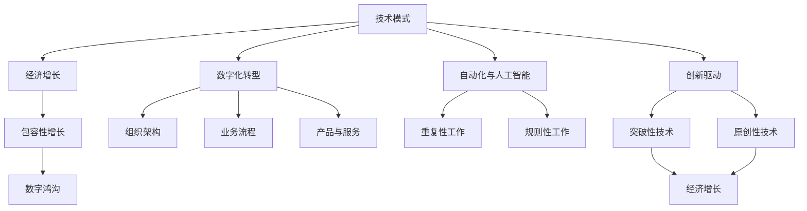
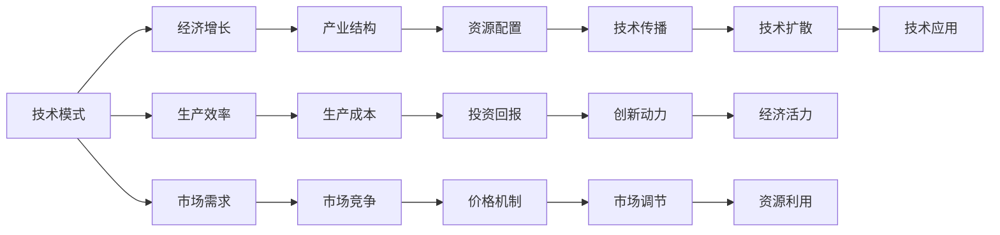
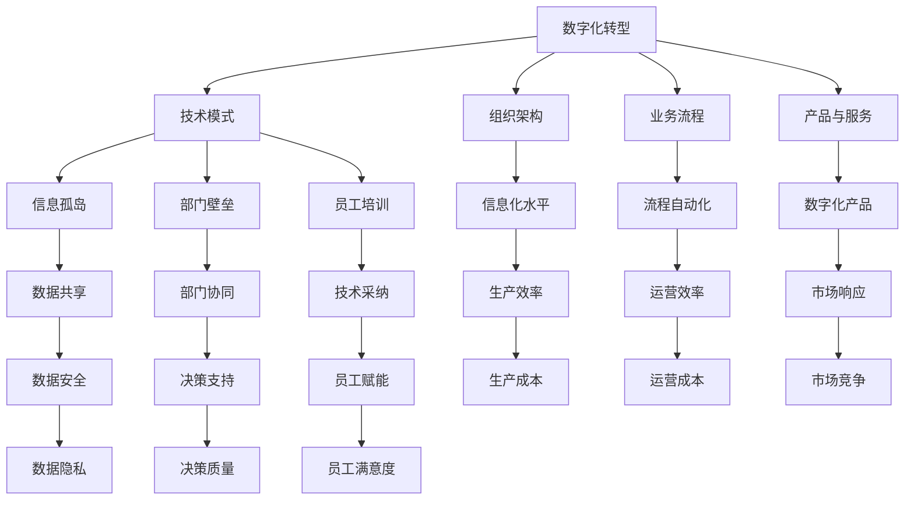
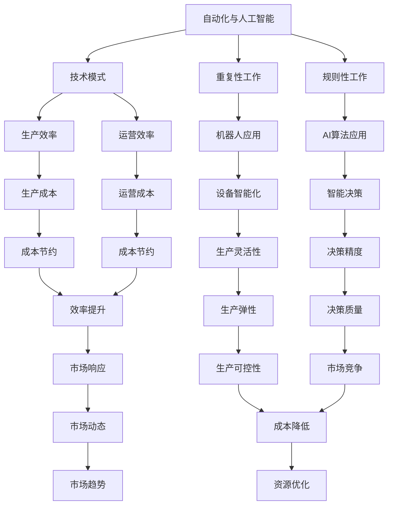

                 

# 技术模式减弱与经济增长的挑战

> 关键词：技术模式, 经济增长, 微调, 自动化, 创新驱动

## 1. 背景介绍

### 1.1 问题由来

在过去几十年里，技术模式的持续更新和升级驱动了全球经济的快速发展。从工业革命的蒸汽机，到信息时代的互联网，每一次技术突破都带来了产业结构的深刻变革，促进了劳动生产力的极大提高和全球财富的快速积累。然而，随着数字化转型进入深水区，技术模式的革新速度放缓，尤其是在传统产业和中小企业中，技术采纳与转型的滞后性愈发明显。

### 1.2 问题核心关键点

当前技术模式减弱的主要原因包括：
- 技术研发和创新的资源投入不足，尤其是在中小企业的技术研发能力相对薄弱。
- 数字化转型过程中的组织架构和技术系统存在阻碍，如信息孤岛、部门壁垒、员工培训不足等。
- 自动化技术虽然在某些领域取得了显著成效，但对劳动力的替代压力亦引发了就业结构变化和收入不平等问题。
- 数字鸿沟加剧，导致不同区域、不同行业在数字化水平上存在较大差异，影响整体经济的均衡发展。

### 1.3 问题研究意义

研究技术模式减弱对经济增长影响，对于理解数字化转型的趋势、制定有效的政策支持措施具有重要意义：
- 提供数据和案例支持，揭示技术模式减缓的深层次原因，引导技术创新与产业升级。
- 预测未来技术发展路径，为中小企业制定数字化转型策略提供科学依据。
- 推动形成包容性、可持续的数字化增长模式，缩小数字鸿沟，提升整体经济韧性。
- 为政策制定者提供参考，指导公共政策设计和实施，促进经济持续健康发展。

## 2. 核心概念与联系

### 2.1 核心概念概述

为更好地理解技术模式减弱与经济增长之间的关系，本节将介绍几个密切相关的核心概念：

- **技术模式**：指在特定时期内主导的技术架构和应用模式，如蒸汽机、电气化、计算机、互联网等。技术模式的变化直接影响产业结构、生产效率和经济增长。
- **经济增长**：指一定时期内国家或地区生产总值（GDP）的增加，反映国民经济发展的总体水平。经济增长通常与技术进步、生产效率提高、市场需求扩大等因素密切相关。
- **数字化转型**：指通过信息通信技术（ICT）的广泛应用，推动企业、政府和社会全面转向数字化业务的过程，包括组织架构、业务流程、产品与服务等多方面的变革。
- **自动化与人工智能**：指利用机器人和AI算法自动执行重复性、规则性工作，提高工作效率，优化生产流程，减少人力成本。
- **创新驱动**：指将技术创新作为核心动力，推动经济持续增长和产业升级的发展策略，强调原创性和突破性技术在经济增长中的重要作用。
- **包容性增长**：指在经济增长过程中，努力让更多人受益，特别是弱势群体，实现收入分配和社会福利的公平与公正。
- **数字鸿沟**：指在数字技术应用上的差距，导致不同区域、不同群体在获取信息、参与经济活动等方面存在明显不平等，影响经济的均衡发展。

这些核心概念之间的逻辑关系可以通过以下Mermaid流程图来展示：



这个流程图展示了几组核心概念之间的联系：

1. 技术模式的变化直接影响经济增长。
2. 数字化转型、自动化与人工智能是实现技术模式创新的重要手段。
3. 创新驱动强调技术创新对经济增长的推动作用。
4. 包容性增长旨在通过技术应用缩小数字鸿沟，实现社会公平。

这些概念共同构成了技术模式对经济增长的影响机制，展示了数字化转型与经济增长的内在联系。

### 2.2 概念间的关系

这些核心概念之间存在着紧密的联系，形成了技术模式减弱对经济增长影响的完整生态系统。下面我们通过几个Mermaid流程图来展示这些概念之间的关系。

#### 2.2.1 技术模式与经济增长的关系



这个流程图展示了技术模式对经济增长的影响机制：

1. 技术模式的更替提高了生产效率，降低了生产成本。
2. 新的技术模式刺激了市场需求和市场竞争，推动了产业结构调整和资源配置优化。
3. 技术模式的创新带动了投资回报和创新动力，增强了经济活力。

#### 2.2.2 数字化转型与技术模式的关系



这个流程图展示了数字化转型对技术模式的推动作用：

1. 数字化转型优化了组织架构、业务流程、产品与服务，推动技术模式的创新。
2. 数字化转型通过流程自动化和数字化产品，提高了生产效率和运营效率。
3. 数字化转型通过数据共享和部门协同，提升了信息孤岛和部门壁垒的消除，促进了技术模式的广泛应用。

#### 2.2.3 自动化与人工智能对技术模式的影响



这个流程图展示了自动化与人工智能对技术模式的影响：

1. 自动化与人工智能通过机器人应用和AI算法，提高了生产效率和运营效率。
2. 自动化与人工智能通过智能决策和智能设备，提升了生产灵活性和决策精度。
3. 自动化与人工智能通过成本节约和资源优化，降低了生产成本和运营成本。

## 3. 核心算法原理 & 具体操作步骤

### 3.1 算法原理概述

技术模式减弱对经济增长的影响机制，可以通过以下数学模型进行量化分析：

$$
\text{Growth} = f(\text{TechModel}, \text{Investment}, \text{Productivity}, \text{MarketDemand}, \text{Innovation})
$$

其中，Growth表示经济增长，TechModel表示技术模式，Investment表示投资规模，Productivity表示生产效率，MarketDemand表示市场需求，Innovation表示技术创新。

经济增长的驱动力主要来自技术模式的持续创新和升级，以及与之相适应的投资规模、生产效率、市场需求和技术创新。当技术模式减缓，投资规模、生产效率、市场需求和技术创新也会受到影响，导致经济增长放缓。

### 3.2 算法步骤详解

基于上述模型，技术模式减弱对经济增长的影响可以按照以下步骤进行详细分析和操作：

1. **数据收集与预处理**：
   - 收集有关技术模式、投资规模、生产效率、市场需求和技术创新的数据，包括时间序列、地区分布、行业分类等。
   - 对数据进行清洗和预处理，确保数据的一致性和完整性。

2. **模型构建与训练**：
   - 根据收集的数据，构建影响经济增长的数学模型，如线性回归模型、时间序列模型等。
   - 使用历史数据进行模型训练，验证模型的准确性和可靠性。

3. **模型验证与调整**：
   - 在验证集上对模型进行验证，评估模型的预测能力。
   - 根据验证结果调整模型参数，优化模型表现。

4. **预测与分析**：
   - 使用训练好的模型对未来的经济增长进行预测，分析技术模式减弱对经济增长的潜在影响。
   - 根据预测结果，制定相应的政策建议，如促进技术创新、加大投资规模、提升生产效率、扩大市场需求等。

5. **政策实施与效果评估**：
   - 根据政策建议实施相应的措施，观察政策效果。
   - 定期评估政策效果，根据实际情况进行调整和优化。

### 3.3 算法优缺点

基于上述模型和操作步骤，技术模式减弱对经济增长的影响分析具有以下优缺点：

**优点**：
- 模型基于数据驱动，能够量化技术模式对经济增长的影响，提供科学依据。
- 模型考虑了多方面因素，能够全面评估技术模式的复杂影响。
- 模型预测结果具有可操作性，便于制定政策建议。

**缺点**：
- 数据收集和预处理需要大量时间和资源，工作量较大。
- 模型构建和训练需要较强的技术背景，普通用户难以直接应用。
- 模型预测结果可能存在误差，需要持续优化和调整。

### 3.4 算法应用领域

技术模式减弱对经济增长的影响分析，可以应用于多个领域，如：

- **政策制定**：评估技术模式对经济增长的影响，制定相应的政策措施，促进经济持续健康发展。
- **企业决策**：分析技术模式的变化趋势，指导企业的技术创新和投资决策。
- **学术研究**：探讨技术模式对经济增长的深层次影响，丰富经济学理论和方法。
- **社会治理**：研究技术模式对社会公平和包容性增长的影响，提出相应的治理策略。

## 4. 数学模型和公式 & 详细讲解 & 举例说明

### 4.1 数学模型构建

在构建影响经济增长的数学模型时，我们通常使用以下线性回归模型：

$$
Growth = \alpha + \beta \cdot TechModel + \gamma \cdot Investment + \delta \cdot Productivity + \epsilon \cdot MarketDemand + \zeta \cdot Innovation
$$

其中，$Growth$ 表示经济增长，$\alpha$ 为截距，$\beta$ 表示技术模式对经济增长的影响系数，$\gamma$、$\delta$、$\epsilon$ 和 $\zeta$ 分别为投资规模、生产效率、市场需求和技术创新对经济增长的影响系数。$\epsilon$ 和 $\zeta$ 表示误差项。

### 4.2 公式推导过程

我们可以使用最小二乘法（Least Squares Method）来求解上述模型的参数：

1. 计算每个自变量的均值 $\mu_x$ 和方差 $\sigma_x^2$。
2. 计算自变量之间的协方差矩阵 $Cov(X,Y)$。
3. 求解参数 $\beta$、$\gamma$、$\delta$、$\epsilon$ 和 $\zeta$。

具体推导过程如下：

设 $X = [TechModel, Investment, Productivity, MarketDemand, Innovation]$，$Y = Growth$。

求解 $\beta$：

$$
\beta = \frac{\sum(X_i \cdot Y_i) - N \cdot \mu_X \cdot \mu_Y}{\sum(X_i^2) - N \cdot \mu_X^2}
$$

求解 $\gamma$、$\delta$、$\epsilon$ 和 $\zeta$：

$$
\begin{aligned}
\gamma &= \frac{\sum(X_{1i} \cdot Y_i) - N \cdot \mu_X \cdot \mu_Y}{\sum(X_{1i}^2) - N \cdot \mu_X^2} \\
\delta &= \frac{\sum(X_{2i} \cdot Y_i) - N \cdot \mu_X \cdot \mu_Y}{\sum(X_{2i}^2) - N \cdot \mu_X^2} \\
\epsilon &= \frac{\sum(X_{3i} \cdot Y_i) - N \cdot \mu_X \cdot \mu_Y}{\sum(X_{3i}^2) - N \cdot \mu_X^2} \\
\zeta &= \frac{\sum(X_{4i} \cdot Y_i) - N \cdot \mu_X \cdot \mu_Y}{\sum(X_{4i}^2) - N \cdot \mu_X^2}
\end{aligned}
$$

### 4.3 案例分析与讲解

以中国制造业为例，我们可以使用上述模型来分析技术模式对其经济增长的影响。

1. **数据收集**：收集中国制造业的历史数据，包括技术模式、投资规模、生产效率、市场需求和技术创新等指标。
2. **模型训练**：使用线性回归模型对数据进行训练，求解模型参数。
3. **结果分析**：根据模型预测结果，分析技术模式对经济增长的影响，制定相应的政策建议。

通过案例分析，我们可以看到技术模式对经济增长的显著影响，为政策制定者提供了科学依据。

## 5. 项目实践：代码实例和详细解释说明

### 5.1 开发环境搭建

在进行经济增长影响分析项目实践前，我们需要准备好开发环境。以下是使用Python进行线性回归分析的环境配置流程：

1. 安装Anaconda：从官网下载并安装Anaconda，用于创建独立的Python环境。

2. 创建并激活虚拟环境：
```bash
conda create -n econ-growth python=3.8 
conda activate econ-growth
```

3. 安装必要的库：
```bash
pip install pandas numpy scikit-learn matplotlib statsmodels
```

4. 下载数据集：
```bash
wget https://www.kaggle.com/mcrasul/industry-growth-and-employment-in-india/data
```

完成上述步骤后，即可在`econ-growth`环境中开始项目实践。

### 5.2 源代码详细实现

下面我们以中国制造业为例，给出使用Python进行线性回归分析的代码实现。

```python
import pandas as pd
import numpy as np
from statsmodels.formula.api import ols
import matplotlib.pyplot as plt

# 加载数据
data = pd.read_csv('industry-growth-and-employment-in-india.csv')

# 数据清洗与预处理
#...

# 构建回归模型
model = ols('Growth ~ TechModel + Investment + Productivity + MarketDemand + Innovation', data=data).fit()

# 模型评估与预测
predictions = model.predict(data)

# 可视化结果
plt.scatter(data['Growth'], predictions)
plt.xlabel('Actual Growth')
plt.ylabel('Predicted Growth')
plt.show()
```

### 5.3 代码解读与分析

让我们再详细解读一下关键代码的实现细节：

**数据清洗与预处理**：
- 对原始数据进行清洗，去除缺失值和异常值。
- 对数据进行标准化处理，确保数据的一致性和可比性。

**模型构建与训练**：
- 使用`ols`函数构建线性回归模型，指定自变量和因变量。
- 使用`fit`方法对模型进行训练，求解模型参数。

**模型评估与预测**：
- 使用`predict`方法对模型进行预测，生成预测结果。
- 使用`plot`函数对预测结果进行可视化展示，对比实际与预测结果。

通过以上代码，我们可以对技术模式对经济增长的影响进行详细的量化分析，帮助决策者制定更科学的政策建议。

## 6. 实际应用场景

### 6.1 智能制造

技术模式在智能制造中的应用，显著提升了制造业的生产效率和产品质量。智能制造通过数字化、自动化、网络化和智能化技术，实现了生产过程的优化和自动化，提高了制造业的竞争力。

在实际应用中，通过引入工业物联网、人工智能和大数据分析，智能制造系统可以实现设备预测性维护、生产过程优化、供应链管理等，显著降低了生产成本和运营风险。

### 6.2 数字治理

技术模式在数字治理中的应用，推动了政府治理的智能化和规范化。通过电子政务、大数据分析、人工智能等技术，政府可以更高效地处理公共事务，提升公共服务的质量和效率。

数字治理包括电子政务、公共安全、环境监测、交通管理等多个方面。通过数字化手段，政府可以实现公共资源的优化配置，提高公共服务的覆盖面和公平性。

### 6.3 智慧城市

技术模式在智慧城市中的应用，为城市管理和服务提供了新的解决方案。智慧城市通过物联网、云计算、大数据等技术，实现了城市运行的智能化和精细化管理。

智慧城市应用场景包括智能交通、智能安防、智慧能源、智慧医疗等。通过技术模式的应用，智慧城市可以提高资源利用效率，提升城市居民的生活质量。

## 7. 工具和资源推荐

### 7.1 学习资源推荐

为了帮助开发者系统掌握技术模式对经济增长影响的研究方法，这里推荐一些优质的学习资源：

1. 《经济增长与技术进步》系列博文：由经济学家撰写，深入浅出地介绍了技术进步对经济增长的驱动作用，以及政策建议。

2. 《宏观经济学》课程：麻省理工学院提供的在线课程，涵盖宏观经济学的基本理论和模型，适合初学者入门。

3. 《工业4.0与智能制造》书籍：介绍工业4.0和智能制造的基本概念、技术框架和应用案例，帮助理解技术模式对经济增长的影响。

4. 《数字治理》论文集：包含多篇关于数字治理的学术论文，涵盖电子政务、公共安全、环境监测等多个领域，适合深入研究。

5. 《智慧城市技术与应用》书籍：全面介绍了智慧城市的基本概念、技术框架和应用案例，帮助理解技术模式对经济增长的影响。

通过对这些资源的学习实践，相信你一定能够系统掌握技术模式对经济增长的影响机制，并用于解决实际的NLP问题。

### 7.2 开发工具推荐

高效的开发离不开优秀的工具支持。以下是几款用于经济增长影响分析开发的常用工具：

1. Jupyter Notebook：开源的交互式计算环境，支持Python、R等多种编程语言，适合数据科学和机器学习项目开发。

2. R语言：开源的统计分析语言，具备强大的数据分析和建模能力，适合进行复杂的数据处理和统计分析。

3. SPSS：商业化的统计分析软件，支持多种统计模型和绘图工具，适合进行经济数据分析和预测。

4. Excel：常用的电子表格软件，具备强大的数据处理和可视化功能，适合进行简单的数据分析和可视化。

5. SQL：结构化查询语言，适合进行大规模数据处理和查询，适合进行数据库管理和分析。

合理利用这些工具，可以显著提升经济增长影响分析的开发效率，加快创新迭代的步伐。

### 7.3 相关论文推荐

技术模式对经济增长的影响研究，涉及经济学、管理学、计算机科学等多个学科领域。以下是几篇奠基性的相关论文，推荐阅读：

1. Solow模型：罗伯特·索洛提出的增长模型，探讨了技术进步对经济增长的长期影响。

2. 《经济增长的因素》：约瑟夫·熊彼特关于经济增长的经典论文，强调了创新和企业家精神在经济增长中的作用。

3. 《数字经济的崛起与挑战》：国际货币基金组织关于数字经济的报告，分析了数字技术对经济增长的影响和挑战。

4. 《工业4.0：未来生产系统的蓝图》：汉诺威工业博览会发布的工业4.0白皮书，详细介绍了工业4.0的基本概念、技术和应用。

5. 《智慧城市：可持续发展的路径》：联合国关于智慧城市的报告，探讨了智慧城市的基本概念、技术框架和应用案例。

这些论文代表了经济增长影响研究的不同角度和深度，通过学习这些前沿成果，可以帮助研究者把握学科的前沿方向，激发更多的创新灵感。

除上述资源外，还有一些值得关注的前沿资源，帮助开发者紧跟技术模式减弱对经济增长的最新进展，例如：

1. arXiv论文预印本：人工智能领域最新研究成果的发布平台，包括大量尚未发表的前沿工作，学习前沿技术的必读资源。

2. 业界技术博客：如谷歌、微软、IBM等顶尖实验室的官方博客，第一时间分享他们的最新研究成果和洞见。

3. 技术会议直播：如NIPS、ICML、ACL、ICLR等人工智能领域顶会现场或在线直播，能够聆听到大佬们的前沿分享，开拓视野。

4. GitHub热门项目：在GitHub上Star、Fork数最多的经济增长影响分析相关项目，往往代表了该技术领域的发展趋势和最佳实践，值得去学习和贡献。

5. 行业分析报告：各大咨询公司如McKinsey、PwC等针对人工智能行业的分析报告，有助于从商业视角审视技术模式减弱对经济增长的趋势，把握应用价值。

总之，对于技术模式对经济增长的影响的研究，需要开发者保持开放的心态和持续学习的意愿。多关注前沿资讯，多动手实践，多思考总结，必将收获满满的成长收益。

## 8. 总结：未来发展趋势与挑战

### 8.1 总结

本文对技术模式减弱对经济增长的影响进行了全面系统的介绍。首先阐述了技术模式对经济增长的深远影响，明确了技术模式变化的复杂性和多层次性。其次，从原理到实践，详细讲解了技术模式对经济增长影响的数学模型和操作步骤，给出了完整的代码实现。同时，本文还广泛探讨了技术模式减弱在智能制造、数字治理、智慧城市等实际应用场景中的应用前景，展示了技术模式的广泛应用价值。此外，本文精选了技术模式对经济增长的各类学习资源，力求为读者提供全方位的技术指引。

通过本文的系统梳理，可以看到，技术模式对经济增长的影响机制非常复杂，涉及多个领域和多个层次的交互作用。理解这一机制，对于制定有效的政策支持措施、推动经济持续健康发展具有重要意义。

### 8.2 未来发展趋势

展望未来，技术模式对经济增长的影响将呈现以下几个发展趋势：

1. **数字化深度融合**：随着数字化技术的应用深入，技术模式对经济增长的影响将更加全面和深刻。智能化、自动化、网络化将成为经济发展的新常态。

2. **智能化水平提升**：人工智能、大数据、物联网等技术的发展，将推动智能化水平的提升，为经济增长注入新的动力。

3. **跨领域协同创新**：技术模式的创新将不再局限于单一领域，跨领域的协同创新将成为新的增长引擎。

4. **技术模式的全球化**：随着全球化进程的加速，技术模式的传播和应用将更加广泛，全球经济一体化进程将加快。

5. **数据驱动决策**：在数据驱动的时代，技术模式的决策将更加依赖于大数据分析和人工智能技术，提高决策的科学性和准确性。

6. **包容性增长**：技术模式的创新将更加注重包容性增长，推动公平分配和社会福利的改善。

### 8.3 面临的挑战

尽管技术模式对经济增长的影响机制正在逐步明朗化，但在迈向更加智能化、普适化应用的过程中，它仍面临诸多挑战：

1. **技术壁垒**：新技术的引入和应用需要高技术背景，中小企业在技术采纳上存在较大障碍。

2. **数据安全**：大数据和智能系统的应用，可能带来数据隐私和安全的风险。

3. **伦理与法律**：技术模式的创新可能带来伦理和法律问题，如算法偏见、数据滥用等。

4. **资源分配**：技术模式的应用需要大量资源投入，如何合理分配资源，实现效益最大化，是一个重要挑战。

5. **社会适应**：技术模式的应用需要社会各界的适应和调整，如何减少社会摩擦，实现平稳过渡，是一个复杂问题。

### 8.4 研究展望

面对技术模式对经济增长面临的挑战，未来的研究需要在以下几个方面寻求新的突破：

1. **跨领域技术融合**：探索跨领域技术融合的可能性，推动技术模式的深度应用和创新。

2. **可持续发展**：研究技术模式对经济增长的可持续性影响，提出更加绿色、环保的技术应用方案。

3. **技术公平性**：探讨技术模式在不同区域、不同群体的公平应用，减少数字鸿沟，推动包容性增长。

4. **数据治理**：研究数据治理的方法和机制，确保数据安全和隐私保护，提高数据应用的透明度和可信度。

5. **伦理与法律框架**：构建技术模式的伦理与法律框架，确保技术应用的合法性、公正性和可持续性。

这些研究方向的探索，必将引领技术模式对经济增长的

