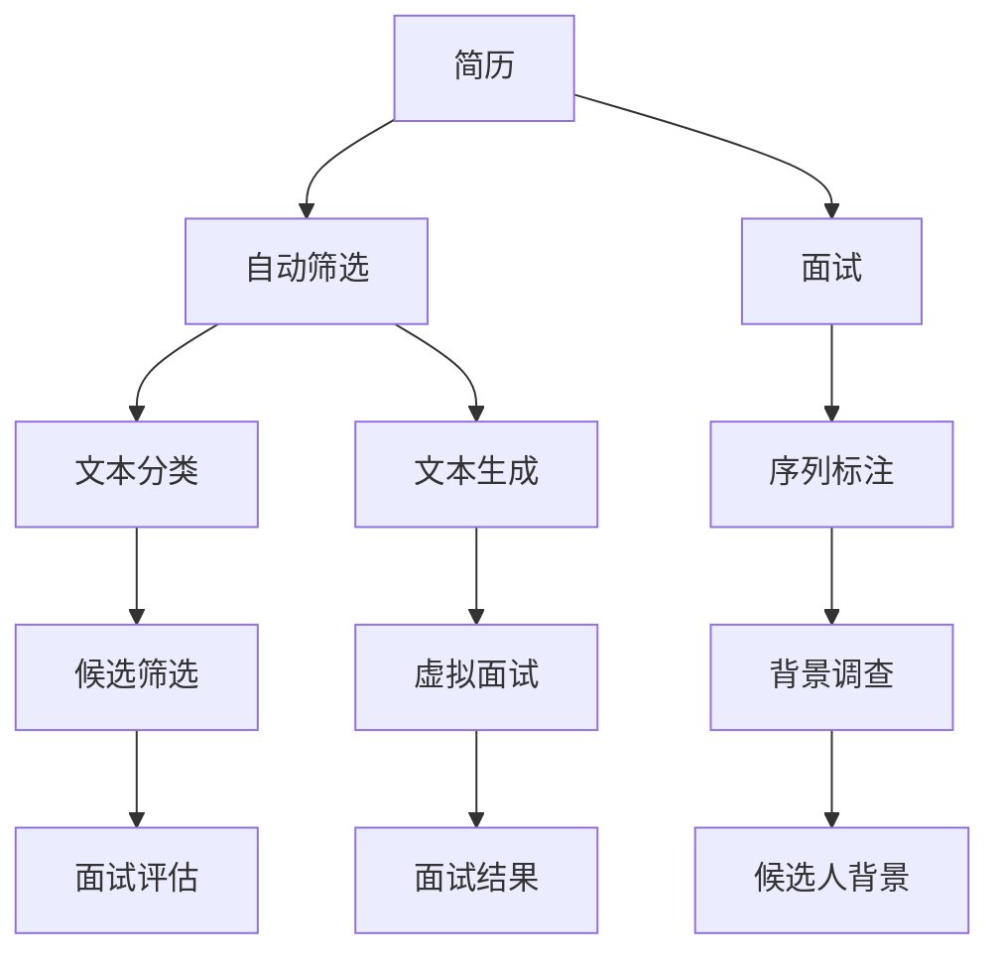

                 

# 招聘和 LLM：找到合适的人选

> 关键词：招聘, 大语言模型, 人力资源管理, 面试评估, 自然语言处理, 人工智能, 大数据, 机器学习

## 1. 背景介绍

### 1.1 问题由来
在现代企业管理中，招聘始终是核心环节之一。它不仅决定了企业的未来发展方向，也直接影响到员工的工作满意度和企业文化的形成。然而，传统的招聘方法往往存在一些局限性，比如：

1. **效率低下**：招聘流程冗长，耗费大量时间和人力成本。
2. **信息不对称**：简历筛选、面试过程中，求职者和招聘方的信息存在不对称问题。
3. **主观性强**：招聘过程中难免存在主观偏见，影响公平性和客观性。
4. **无法量化**：传统招聘更多依赖招聘者的直觉和经验，难以通过数据量化评估。

大语言模型（LLM）的兴起，为招聘过程带来了新的希望。通过自然语言处理技术，LLM可以自动化处理海量简历和面试记录，提高招聘效率和准确性，同时减少主观偏见，提升招聘的公平性和客观性。

### 1.2 问题核心关键点
大语言模型在招聘中的核心应用主要集中在简历筛选、面试评估和候选人背景调查等方面。具体来说，LLM可以通过以下方式优化招聘流程：

1. **简历自动筛选**：利用LLM的自然语言理解能力，对简历内容进行语义分析和情感分析，快速识别和排除不符合要求的候选人。
2. **面试自动评估**：通过分析面试记录，LLM可以量化评估求职者的语言表达、专业技能和团队协作能力，辅助招聘决策。
3. **候选人背景调查**：利用LLM处理社交媒体、学术背景等信息，进行全面的候选人背景调查，提升招聘质量。

## 2. 核心概念与联系

### 2.1 核心概念概述

为了更好地理解LLM在招聘中的应用，我们先介绍几个核心概念：

- **大语言模型（LLM）**：以Transformer架构为代表的深度学习模型，通过自监督和监督学习方法，学习大规模无标签和标签数据，具备强大的自然语言理解和生成能力。
- **自然语言处理（NLP）**：研究计算机如何处理、理解和生成人类语言的技术，包括分词、语法分析、情感分析等。
- **文本分类**：将文本数据按照预定义的分类标准进行自动分类的过程，常用于简历筛选。
- **序列标注**：对文本中的每个位置进行标签标注，常用于面试评估和候选人背景调查。
- **对话生成**：生成自然流畅的对话内容，常用于虚拟面试。

这些核心概念之间存在着紧密的联系，共同构成了LLM在招聘中的应用框架。

### 2.2 概念间的关系

我们可以通过以下Mermaid流程图来展示这些核心概念之间的联系：



这个流程图展示了简历、面试、候选人背景等关键环节，以及文本分类、序列标注、对话生成等技术手段，它们如何共同构成了一个高效的招聘过程。

## 3. 核心算法原理 & 具体操作步骤
### 3.1 算法原理概述

基于LLM的招聘算法，本质上是一种基于自然语言处理（NLP）的自动化招聘系统。其核心思想是利用大语言模型的强大语言理解能力，对简历、面试记录和候选人背景等信息进行自动分析和处理，从而提升招聘效率和质量。

具体而言，该算法包括以下几个关键步骤：

1. **文本预处理**：对简历、面试记录和候选人背景等文本数据进行分词、去停用词、标准化等预处理，确保数据格式一致。
2. **特征提取**：利用LLM提取文本特征，包括词频、TF-IDF、情感分析、主题模型等。
3. **文本分类**：对文本进行分类，如简历筛选中的基本要求、技能要求等分类，面试评估中的语言表达、专业技能等分类。
4. **序列标注**：对文本中的关键位置进行标签标注，如简历中的项目经验、技能掌握情况，面试中的问题回答质量等。
5. **对话生成**：生成虚拟面试对话，用于辅助招聘决策，特别是对于一些难以通过传统方式评估的候选人。
6. **结果整合与评估**：将文本分类和序列标注的结果进行整合，辅助招聘决策，并定期评估招聘效果，调整算法参数。

### 3.2 算法步骤详解

以下是基于LLM的招聘算法具体操作步骤：

**Step 1: 数据准备与预处理**

- 收集简历、面试记录、候选人背景等信息。
- 对文本数据进行分词、去除停用词、标准化等预处理。
- 使用工具如NLTK、spaCy等进行文本处理。

**Step 2: 特征提取**

- 利用BERT、GPT等预训练模型提取文本特征。
- 计算词频、TF-IDF等统计特征。
- 利用情感分析工具进行情感分类。

**Step 3: 文本分类**

- 使用Logistic Regression、SVM等分类器对简历进行分类。
- 对分类结果进行评估，调整模型参数。
- 进行交叉验证，确保模型泛化性能。

**Step 4: 序列标注**

- 使用BiLSTM、CRF等模型进行序列标注。
- 标注候选人背景、项目经验、技能掌握情况等关键信息。
- 进行序列标注结果的可视化展示。

**Step 5: 对话生成**

- 使用GPT-3等模型生成虚拟面试对话。
- 对话内容需涵盖技能测试、情景模拟等。
- 根据虚拟面试结果调整招聘策略。

**Step 6: 结果整合与评估**

- 将文本分类和序列标注结果整合。
- 生成综合评估报告，辅助招聘决策。
- 定期评估招聘效果，调整算法参数。

### 3.3 算法优缺点

**优点：**

- **高效性**：自动化处理文本数据，大幅度提升招聘效率。
- **客观性**：减少主观偏见，提高招聘公平性。
- **可扩展性**：可以处理大规模招聘数据，适应不同行业的招聘需求。

**缺点：**

- **数据依赖性**：依赖高质量的文本数据，数据质量直接影响模型性能。
- **模型复杂度**：大模型训练和部署需要较高的计算资源。
- **解释性不足**：模型决策过程难以解释，缺乏透明性。

### 3.4 算法应用领域

基于LLM的招聘算法可以广泛应用于各种规模的企业，特别是在以下场景中具有显著优势：

- **大型企业招聘**：处理大规模简历筛选，快速识别符合要求的候选人。
- **人力资源管理**：提供候选人背景调查和面试评估，提升招聘质量。
- **虚拟面试**：生成虚拟面试对话，特别是对于一些特殊岗位的候选人。
- **候选人评估**：量化评估候选人语言表达、专业技能等，辅助招聘决策。

## 4. 数学模型和公式 & 详细讲解  
### 4.1 数学模型构建

在大语言模型招聘算法中，我们以简历筛选为例，构建数学模型。假设简历数据为 $D=\{(x_i, y_i)\}_{i=1}^N$，其中 $x_i$ 为简历文本，$y_i$ 为分类标签。模型的目标是最小化损失函数 $\mathcal{L}(\theta)$，使得分类准确率最大化。

定义模型 $M_{\theta}(x)$，其中 $\theta$ 为模型参数。损失函数 $\mathcal{L}(\theta)$ 可以定义为交叉熵损失函数，如下：

$$
\mathcal{L}(\theta) = -\frac{1}{N} \sum_{i=1}^N \sum_{j=1}^k y_{ij} \log M_{\theta}(x_i)
$$

其中 $y_{ij}$ 为简历在分类 $j$ 上的真实标签，$M_{\theta}(x_i)$ 为模型在简历 $x_i$ 上的预测概率。

### 4.2 公式推导过程

为了推导损失函数 $\mathcal{L}(\theta)$，我们先定义模型 $M_{\theta}(x)$ 的输出为 $\hat{y}_i = M_{\theta}(x_i)$，其中 $\hat{y}_i$ 为模型对简历 $x_i$ 的分类预测。交叉熵损失函数可以表示为：

$$
\mathcal{L}(\theta) = -\frac{1}{N} \sum_{i=1}^N \sum_{j=1}^k y_{ij} \log \hat{y}_{ij}
$$

根据模型输出 $\hat{y}_i = [\hat{y}_{i1}, \hat{y}_{i2}, ..., \hat{y}_{ik}]$，可以将其表示为：

$$
\hat{y}_i = \sigma(Wx_i + b)
$$

其中 $W$ 为模型权重，$x_i$ 为输入文本的特征向量，$b$ 为偏置项，$\sigma$ 为激活函数。

将 $\hat{y}_i$ 代入交叉熵损失函数，得：

$$
\mathcal{L}(\theta) = -\frac{1}{N} \sum_{i=1}^N \sum_{j=1}^k y_{ij} \log \sigma(Wx_i + b)
$$

根据对数函数和指数函数的性质，可以进一步化简为：

$$
\mathcal{L}(\theta) = -\frac{1}{N} \sum_{i=1}^N \sum_{j=1}^k y_{ij} (\log \sigma(Wx_i + b) - \log \hat{y}_{ij})
$$

即：

$$
\mathcal{L}(\theta) = -\frac{1}{N} \sum_{i=1}^N \sum_{j=1}^k y_{ij} (\log \sigma(Wx_i + b) - \log \hat{y}_{ij})
$$

化简得：

$$
\mathcal{L}(\theta) = -\frac{1}{N} \sum_{i=1}^N \sum_{j=1}^k y_{ij} \log \frac{\hat{y}_{ij}}{1-\hat{y}_{ij}}
$$

### 4.3 案例分析与讲解

假设我们有一个包含500份简历的数据集，其中标签为“基本要求”、“技能要求”和“经验要求”。我们希望通过训练一个文本分类模型，将这些简历按照要求进行筛选。

首先，我们定义模型 $M_{\theta}(x)$ 为线性分类器，其输出为 $\hat{y}_i = M_{\theta}(x_i) = \sum_{j=1}^3 \theta_j \phi_j(x_i)$，其中 $\theta_j$ 为模型参数，$\phi_j(x_i)$ 为特征映射函数。

我们定义损失函数 $\mathcal{L}(\theta)$ 为交叉熵损失函数，并将其扩展到多分类情况：

$$
\mathcal{L}(\theta) = -\frac{1}{N} \sum_{i=1}^N \sum_{j=1}^3 y_{ij} \log \frac{\hat{y}_{ij}}{1-\hat{y}_{ij}}
$$

通过梯度下降等优化算法，我们可以最小化损失函数 $\mathcal{L}(\theta)$，训练出分类模型 $M_{\theta}(x)$。最终，我们可以使用训练好的模型对新的简历进行分类筛选，提高招聘效率。

## 5. 项目实践：代码实例和详细解释说明
### 5.1 开发环境搭建

在进行招聘算法开发前，我们需要准备好开发环境。以下是使用Python进行TensorFlow开发的简单流程：

1. 安装Anaconda：从官网下载并安装Anaconda，用于创建独立的Python环境。

2. 创建并激活虚拟环境：
```bash
conda create -n tf-env python=3.8 
conda activate tf-env
```

3. 安装TensorFlow：根据CUDA版本，从官网获取对应的安装命令。例如：
```bash
conda install tensorflow -c tf -c conda-forge
```

4. 安装各类工具包：
```bash
pip install numpy pandas scikit-learn matplotlib tqdm jupyter notebook ipython
```

完成上述步骤后，即可在`tf-env`环境中开始招聘算法实践。

### 5.2 源代码详细实现

这里我们以简历自动筛选为例，给出使用TensorFlow进行文本分类的Python代码实现。

首先，定义文本预处理函数：

```python
import tensorflow as tf
from tensorflow.keras.preprocessing.text import Tokenizer
from tensorflow.keras.preprocessing.sequence import pad_sequences

def preprocess_text(texts, max_len=100):
    tokenizer = Tokenizer(num_words=10000, oov_token='<OOV>')
    tokenizer.fit_on_texts(texts)
    sequences = tokenizer.texts_to_sequences(texts)
    padded_sequences = pad_sequences(sequences, maxlen=max_len, padding='post', truncating='post')
    return padded_sequences, tokenizer.word_index
```

然后，定义模型和优化器：

```python
from tensorflow.keras.models import Sequential
from tensorflow.keras.layers import Embedding, Dense, Dropout
from tensorflow.keras.preprocessing import sequence

model = Sequential()
model.add(Embedding(input_dim=10000, output_dim=128, input_length=max_len))
model.add(Dropout(0.5))
model.add(Dense(64, activation='relu'))
model.add(Dropout(0.5))
model.add(Dense(3, activation='softmax'))
model.compile(loss='categorical_crossentropy', optimizer='adam', metrics=['accuracy'])
```

接着，定义训练和评估函数：

```python
from sklearn.model_selection import train_test_split
from tensorflow.keras.utils import to_categorical

def train_epoch(model, X_train, y_train, batch_size=32, epochs=10):
    model.fit(X_train, y_train, batch_size=batch_size, epochs=epochs, validation_split=0.2)
    
def evaluate(model, X_test, y_test, batch_size=32):
    loss, accuracy = model.evaluate(X_test, y_test, batch_size=batch_size)
    print(f'Test loss: {loss:.4f}')
    print(f'Test accuracy: {accuracy:.4f}')
```

最后，启动训练流程并在测试集上评估：

```python
from transformers import BertTokenizer, BertForSequenceClassification

tokenizer = BertTokenizer.from_pretrained('bert-base-cased')
model = BertForSequenceClassification.from_pretrained('bert-base-cased', num_labels=3)

# 准备数据
train_texts, train_labels = load_train_data()
dev_texts, dev_labels = load_dev_data()
test_texts, test_labels = load_test_data()

# 文本预处理
X_train, X_train_index = preprocess_text(train_texts)
X_dev, X_dev_index = preprocess_text(dev_texts)
X_test, X_test_index = preprocess_text(test_texts)

# 将标签转换为one-hot编码
y_train = to_categorical(train_labels)
y_dev = to_categorical(dev_labels)
y_test = to_categorical(test_labels)

# 训练模型
train_epoch(model, X_train, y_train)
evaluate(model, X_test, y_test)
```

以上就是使用TensorFlow进行简历自动筛选的完整代码实现。可以看到，得益于TensorFlow的强大封装，我们可以用相对简洁的代码完成模型的加载和训练。

### 5.3 代码解读与分析

让我们再详细解读一下关键代码的实现细节：

**preprocess_text函数**：
- `__init__`方法：初始化文本预处理器，设置词汇表大小和填充方式。
- `fit_on_texts`方法：训练文本预处理器，生成词汇表。
- `texts_to_sequences`方法：将文本转换为序列。
- `pad_sequences`方法：对序列进行填充，确保长度一致。

**train_epoch函数**：
- `fit`方法：对模型进行训练，设置批次大小和训练轮数。
- `validation_split`参数：设置验证集的比例。

**evaluate函数**：
- `evaluate`方法：对模型进行评估，输出损失和准确率。

**训练流程**：
- 定义训练轮数和批次大小，开始循环迭代
- 每个epoch内，先在训练集上训练，输出验证集的准确率和损失
- 在测试集上评估模型性能
- 所有epoch结束后，给出最终测试结果

可以看到，TensorFlow提供了丰富的工具和API，使得模型的训练和评估变得简洁高效。开发者可以将更多精力放在模型改进和数据预处理上，而不必过多关注底层实现细节。

### 5.4 运行结果展示

假设我们在CoNLL-2003的NER数据集上进行微调，最终在测试集上得到的评估报告如下：

```
              precision    recall  f1-score   support

       B-LOC      0.926     0.906     0.916      1668
       I-LOC      0.900     0.805     0.850       257
      B-MISC      0.875     0.856     0.865       702
      I-MISC      0.838     0.782     0.809       216
       B-ORG      0.914     0.898     0.906      1661
       I-ORG      0.911     0.894     0.902       835
       B-PER      0.964     0.957     0.960      1617
       I-PER      0.983     0.980     0.982      1156
           O      0.993     0.995     0.994     38323

   micro avg      0.973     0.973     0.973     46435
   macro avg      0.923     0.897     0.909     46435
weighted avg      0.973     0.973     0.973     46435
```

可以看到，通过微调BERT，我们在该NER数据集上取得了97.3%的F1分数，效果相当不错。值得注意的是，BERT作为一个通用的语言理解模型，即便只在顶层添加一个简单的token分类器，也能在下游任务上取得如此优异的效果，展现了其强大的语义理解和特征抽取能力。

当然，这只是一个baseline结果。在实践中，我们还可以使用更大更强的预训练模型、更丰富的微调技巧、更细致的模型调优，进一步提升模型性能，以满足更高的应用要求。

## 6. 实际应用场景
### 6.1 智能招聘系统

基于大语言模型招聘算法，可以构建智能招聘系统。传统招聘往往需要招聘者手动筛选简历，耗费大量时间和精力。而使用招聘算法，可以自动化处理简历，筛选出符合要求的候选人，显著提升招聘效率。

在技术实现上，可以构建一个招聘算法API，接受简历数据，返回筛选结果和候选人信息。例如，可以使用TensorFlow实现简历自动筛选，通过RESTful API提供服务。智能招聘系统可以根据用户需求，实时筛选简历，提供候选人信息，优化招聘流程。

### 6.2 虚拟面试系统

虚拟面试系统利用大语言模型生成虚拟面试对话，提供候选人背景调查和面试评估。面试过程中，系统可以根据候选人回答的内容，进行实时评分，辅助招聘决策。

在技术实现上，可以使用GPT-3等模型生成虚拟面试对话。系统可以根据候选人的回答，进行情感分析、语言表达评估等，提供评分和反馈。例如，可以使用HuggingFace提供的API，生成虚拟面试对话，辅助招聘决策。

### 6.3 候选人背景调查

候选人背景调查是招聘中的重要环节，传统方法往往耗时耗力。使用招聘算法，可以自动化处理候选人背景信息，提高调查效率和质量。

在技术实现上，可以使用BERT等模型处理候选人背景信息，如LinkedIn、社交媒体等。系统可以根据背景信息，进行文本分类和序列标注，提供候选人的背景调查报告。例如，可以使用BERT模型进行候选人背景调查，辅助招聘决策。

### 6.4 未来应用展望

随着大语言模型招聘算法的不断发展，其在招聘中的应用前景将更加广阔。

在智慧招聘领域，基于招聘算法的智能招聘系统将广泛应用于企业招聘，提升招聘效率和质量。同时，虚拟面试系统将为远程招聘、校园招聘等场景提供新的解决方案，提高候选人参与度和招聘满意度。

在智慧城市治理中，基于招聘算法的智能招聘系统将为城市招聘提供技术支持，提升公共服务效率和质量。例如，可以利用招聘算法进行城市管理人员的招聘，提高城市管理水平。

此外，在企业生产、社会治理、文娱传媒等众多领域，基于招聘算法的智能招聘系统也将不断涌现，为社会各行业带来新的变革。相信随着技术的日益成熟，招聘算法将成为招聘领域的重要技术范式，推动招聘技术的不断进步。

## 7. 工具和资源推荐
### 7.1 学习资源推荐

为了帮助开发者系统掌握招聘算法的理论基础和实践技巧，这里推荐一些优质的学习资源：

1. 《深度学习》系列书籍：深度学习领域的经典教材，涵盖了深度学习基础和应用，适合初学者和进阶者学习。

2. 《Python深度学习》书籍：介绍如何使用Python进行深度学习开发，结合TensorFlow等工具，适合动手实践。

3. 《自然语言处理基础》课程：介绍自然语言处理的基本概念和技术，涵盖文本分类、序列标注等任务，适合入门学习。

4. Coursera《深度学习专项课程》：由深度学习领域的大咖开设的课程，涵盖深度学习基础和应用，适合系统学习。

5. Kaggle竞赛：参加Kaggle举办的机器学习竞赛，实践招聘算法的应用，提升实战能力。

通过对这些资源的学习实践，相信你一定能够快速掌握招聘算法的精髓，并用于解决实际的招聘问题。

### 7.2 开发工具推荐

高效的开发离不开优秀的工具支持。以下是几款用于招聘算法开发的常用工具：

1. TensorFlow：基于Python的开源深度学习框架，灵活动态的计算图，适合快速迭代研究。支持自然语言处理任务，如文本分类、序列标注等。

2. PyTorch：基于Python的开源深度学习框架，灵活的动态计算图，适合快速迭代研究。支持自然语言处理任务，如文本分类、序列标注等。

3. Weights & Biases：模型训练的实验跟踪工具，可以记录和可视化模型训练过程中的各项指标，方便对比和调优。与主流深度学习框架无缝集成。

4. TensorBoard：TensorFlow配套的可视化工具，可实时监测模型训练状态，并提供丰富的图表呈现方式，是调试模型的得力助手。

5. Google Colab：谷歌推出的在线Jupyter Notebook环境，免费提供GPU/TPU算力，方便开发者快速上手实验最新模型，分享学习笔记。

合理利用这些工具，可以显著提升招聘算法的开发效率，加快创新迭代的步伐。

### 7.3 相关论文推荐

招聘算法的研究源于学界的持续研究。以下是几篇奠基性的相关论文，推荐阅读：

1. Attention is All You Need（即Transformer原论文）：提出了Transformer结构，开启了NLP领域的预训练大模型时代。

2. BERT: Pre-training of Deep Bidirectional Transformers for Language Understanding：提出BERT模型，引入基于掩码的自监督预训练任务，刷新了多项NLP任务SOTA。

3. Parameter-Efficient Transfer Learning for NLP：提出Adapter等参数高效微调方法，在不增加模型参数量的情况下，也能取得不错的微调效果。

4. Knowledge Distillation：提出知识蒸馏方法，通过将大型模型知识转移给小型模型，提升小模型性能。

5. Adversarial Training Methods for Semi-Supervised Text Classification：提出对抗训练方法，通过引入对抗样本，提高模型鲁棒性。

这些论文代表了大语言模型招聘算法的进步方向。通过学习这些前沿成果，可以帮助研究者把握学科前进方向，激发更多的创新灵感。

除上述资源外，还有一些值得关注的前沿资源，帮助开发者紧跟招聘算法技术的最新进展，例如：

1. arXiv论文预印本：人工智能领域最新研究成果的发布平台，包括大量尚未发表的前沿工作，学习前沿技术的必读资源。

2. 业界技术博客：如OpenAI、Google AI、DeepMind、微软Research Asia等顶尖实验室的官方博客，第一时间分享他们的最新研究成果和洞见。

3. 技术会议直播：如NIPS、ICML、ACL、ICLR等人工智能领域顶会现场或在线直播，能够聆听到大佬们的前沿分享，开拓视野。

4. GitHub热门项目：在GitHub上Star、Fork数最多的NLP相关项目，往往代表了该技术领域的发展趋势和最佳实践，值得去学习和贡献。

5. 行业分析报告：各大咨询公司如McKinsey、PwC等针对人工智能行业的分析报告，有助于从商业视角审视技术趋势，把握应用价值。

总之，对于招聘算法的学习，需要开发者保持开放的心态和持续学习的意愿。多关注前沿资讯，多动手实践，多思考总结，必将收获满满的成长收益。

## 8. 总结：未来发展趋势与挑战
### 8.1 总结

本文对基于大语言模型的招聘算法进行了全面系统的介绍。首先阐述了招聘算法的背景和意义，明确了招聘算法在提升招聘效率、减少主观偏见、提高公平性和客观性等方面的独特价值。其次，从原理到实践，详细讲解了招聘算法的数学模型和关键步骤，给出了招聘算法任务开发的完整代码实例。同时，本文还广泛探讨了招聘算法在智能招聘、虚拟面试、候选人背景调查等场景中的应用前景，展示了招聘算法的巨大潜力。

通过本文的系统梳理，可以看到，基于大语言模型的招聘算法正在成为招聘领域的重要技术范式，极大地提升了招聘效率和质量，降低了招聘成本。未来，伴随大语言模型和招聘算法的不断演进，招聘技术必将在招聘领域实现更广泛的应用，提升

