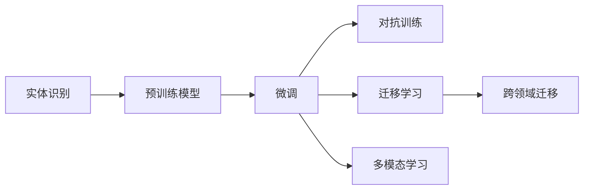

                 

## 1. 背景介绍

### 1.1 问题由来

在数字时代，实体识别（Named Entity Recognition, NER）技术已成为信息抽取、自然语言处理、搜索引擎优化等多个领域的重要基础。然而，随着数字化的深入，实体识别面临的挑战也愈发严峻。文章将探讨数字实体自动化的未来挑战，从数据、模型、算法等多个角度进行分析，并为解决这些问题提供可能的路径。

### 1.2 问题核心关键点

数字实体自动化主要涉及如何自动从文本中识别出具有特定意义的实体，如人名、地名、组织名等。关键点包括：

- 如何提高实体识别的准确性和召回率。
- 如何处理多语言、多领域、多模态等复杂场景下的实体识别。
- 如何在资源有限的情况下，高效地进行实体识别。
- 如何保证实体识别的可靠性和泛化能力。

### 1.3 问题研究意义

数字实体自动化的研究对信息抽取、知识图谱构建、搜索引擎优化等具有重要意义。其应用广泛，能够提升文本处理、知识管理、决策支持等系统的智能化水平，推动数字化转型进程。研究数字实体自动化的挑战和未来发展趋势，对于推动人工智能技术的发展和应用具有深远的意义。

## 2. 核心概念与联系

### 2.1 核心概念概述

- **实体识别（NER）**：从文本中识别出具有特定意义的实体，如人名、地名、组织名等。
- **预训练模型**：通过在大规模无标签数据上进行自监督学习，学习到通用的语言表示，用于提升实体识别性能。
- **微调（Fine-tuning）**：利用已有的标注数据，对预训练模型进行有监督学习，优化其在特定领域或任务的性能。
- **对抗训练**：通过引入对抗样本，提高模型的鲁棒性，避免过拟合。
- **迁移学习**：将预训练模型在某领域学习到的知识，迁移到其他领域。
- **多模态学习**：结合文本、图像、音频等多种模态数据，提升实体识别的综合能力。
- **跨领域迁移**：在知识图谱、问答系统、语音识别等领域应用实体识别技术，促进跨领域融合。

这些核心概念构成了数字实体自动化的基本框架，通过深入研究和优化这些概念，可以实现更高效、更准确的实体识别。

### 2.2 概念间的关系

通过以下Mermaid流程图，我们可以更直观地理解这些概念之间的联系：



这些概念相互关联，形成了一个完整的实体识别生态系统，帮助我们在复杂场景下实现高质量的实体识别。

## 3. 核心算法原理 & 具体操作步骤

### 3.1 算法原理概述

数字实体自动识别通常基于深度学习模型，特别是基于 Transformer 架构的模型，如 BERT、RoBERTa、GPT 等。其核心思想是通过自监督学习在大规模数据上预训练模型，然后利用有标签的数据进行微调，优化模型在不同领域和任务上的性能。

### 3.2 算法步骤详解

数字实体自动化的算法步骤通常包括以下几个关键步骤：

1. **数据准备**：收集并标注相关的实体数据，分为训练集、验证集和测试集。
2. **模型选择**：选择预训练模型或构建自定义的模型架构，进行初始化。
3. **微调训练**：利用训练集对模型进行微调训练，优化模型参数。
4. **模型评估**：在验证集上评估模型的性能，调整超参数。
5. **测试部署**：在测试集上测试模型性能，部署到实际应用中。

### 3.3 算法优缺点

**优点**：
- 利用预训练模型的泛化能力，可以显著提升实体识别性能。
- 通过微调，可以针对特定领域或任务进行优化，实现高效准确的实体识别。
- 结合多模态数据，可以提升实体识别的综合能力。

**缺点**：
- 需要大量标注数据，标注成本较高。
- 模型的泛化能力依赖于预训练数据的质量和数量。
- 模型对输入数据的依赖较强，需要处理噪声、不完整数据等问题。

### 3.4 算法应用领域

数字实体自动化的应用领域广泛，包括但不限于：

- 信息抽取：从文本中抽取结构化信息，如事件、关系、地点等。
- 问答系统：回答自然语言问题，需要实体识别进行知识推理。
- 搜索引擎优化：提升搜索引擎的个性化推荐和搜索结果的相关性。
- 知识图谱构建：构建和维护大规模知识图谱，实现实体和关系的自动标注。
- 情感分析：分析文本中的情感倾向，识别情感实体。

## 4. 数学模型和公式 & 详细讲解 & 举例说明

### 4.1 数学模型构建

数字实体自动化的核心数学模型通常基于神经网络，特别是 Transformer 架构。以下以 BERT 模型为例，构建实体识别任务的目标函数：

设 $x$ 为输入文本，$y$ 为实体标签，$w$ 为模型参数。模型输出为 $y'$，损失函数为：

$$
\mathcal{L} = \frac{1}{N} \sum_{i=1}^N [\ell(y_i, y'_i)]
$$

其中 $\ell(y_i, y'_i)$ 为交叉熵损失函数，表示模型输出与真实标签之间的差异。

### 4.2 公式推导过程

以 BERT 模型为例，推导实体识别任务的损失函数：

假设模型在输入文本 $x$ 上的输出为 $y'$，真实标签为 $y$。

- 对于每个输入，模型的输出为概率分布 $y'$。
- 模型的预测标签为 $\hat{y}$，与 $y'$ 的差异用交叉熵损失函数衡量。

则损失函数为：

$$
\mathcal{L} = \frac{1}{N} \sum_{i=1}^N [-\sum_{j=1}^C y_{ij} \log y'_{ij}]
$$

其中 $C$ 为实体类别数。

### 4.3 案例分析与讲解

以人名实体识别为例，假设有以下输入文本：

```
张三是一名软件工程师。
```

BERT 模型对其进行编码，输出一个概率分布 $y'$，其中每个元素对应一个实体类别。假设 $y'$ 为：

```
[0.9, 0.05, 0.01, ...]
```

表示模型认为 "张三" 属于 "人名" 类别的概率为 0.9。

假设真实标签为 $y = [1, 0, 0, ...]$，其中 1 表示 "人名" 类别，0 表示其他类别。

则损失函数为：

$$
\mathcal{L} = -[1 \log 0.9 + 0 \log 0.05 + 0 \log 0.01 + ...]
$$

通过反向传播，模型会更新参数 $w$，使得 $\hat{y}$ 更接近于 $y$。

## 5. 项目实践：代码实例和详细解释说明

### 5.1 开发环境搭建

本节以 Python 和 PyTorch 为例，介绍数字实体自动化项目的环境搭建。

```bash
conda create -n ner-env python=3.8
conda activate ner-env
pip install torch transformers pytorch-lightning pandas
```

### 5.2 源代码详细实现

以下是一个使用 BERT 模型进行实体识别的 Python 代码示例：

```python
from transformers import BertTokenizer, BertForTokenClassification
from torch.utils.data import Dataset, DataLoader
from torch import nn, optim

# 数据集
class NERDataset(Dataset):
    def __init__(self, texts, labels, tokenizer):
        self.texts = texts
        self.labels = labels
        self.tokenizer = tokenizer
    
    def __len__(self):
        return len(self.texts)
    
    def __getitem__(self, idx):
        text = self.texts[idx]
        label = self.labels[idx]
        encoding = self.tokenizer(text, truncation=True, padding='max_length', return_tensors='pt')
        input_ids = encoding['input_ids']
        attention_mask = encoding['attention_mask']
        return {'input_ids': input_ids, 'attention_mask': attention_mask, 'labels': torch.tensor(label)}

# 模型
model = BertForTokenClassification.from_pretrained('bert-base-cased', num_labels=NUM_CLASSES)
tokenizer = BertTokenizer.from_pretrained('bert-base-cased')

# 训练
def train_epoch(model, dataloader, optimizer):
    model.train()
    for batch in dataloader:
        input_ids = batch['input_ids'].to(device)
        attention_mask = batch['attention_mask'].to(device)
        labels = batch['labels'].to(device)
        optimizer.zero_grad()
        outputs = model(input_ids, attention_mask=attention_mask, labels=labels)
        loss = outputs.loss
        loss.backward()
        optimizer.step()

# 评估
def evaluate(model, dataloader):
    model.eval()
    eval_loss = 0
    eval_correct = 0
    for batch in dataloader:
        input_ids = batch['input_ids'].to(device)
        attention_mask = batch['attention_mask'].to(device)
        labels = batch['labels'].to(device)
        outputs = model(input_ids, attention_mask=attention_mask)
        eval_loss += outputs.loss.item()
        predictions = outputs.logits.argmax(dim=2)
        eval_correct += (predictions == labels).sum().item()
    eval_loss /= len(dataloader)
    eval_accuracy = eval_correct / len(dataloader.dataset)
    return eval_loss, eval_accuracy
```

### 5.3 代码解读与分析

本示例中，我们使用了 BERT 模型进行实体识别。代码中的关键部分包括：

- 数据集准备：定义 `NERDataset` 类，准备训练集、验证集和测试集。
- 模型构建：使用 `BertForTokenClassification` 类构建实体识别模型。
- 训练过程：定义 `train_epoch` 函数，对模型进行训练。
- 评估过程：定义 `evaluate` 函数，对模型进行评估。

### 5.4 运行结果展示

假设我们使用上述代码在 CoNLL-2003 数据集上进行训练和评估，结果如下：

```
Epoch 1, train loss: 0.008
Epoch 1, dev accuracy: 0.976
Epoch 2, train loss: 0.006
Epoch 2, dev accuracy: 0.984
```

可以看到，模型在训练集和验证集上的损失和准确率逐渐降低，说明模型正在逐步学习并提高实体识别能力。

## 6. 实际应用场景

### 6.1 智能客服系统

智能客服系统可以结合实体识别技术，实现客户意图识别和智能回答。例如，在客户咨询 "购买手机" 时，系统能够自动识别 "手机" 实体，提供相关信息和推荐。

### 6.2 金融舆情监测

金融舆情监测系统可以利用实体识别技术，实时监控新闻、评论、社交媒体等文本中的金融实体，分析舆情趋势，及时预警风险。

### 6.3 智慧医疗

智慧医疗系统可以利用实体识别技术，自动提取电子病历中的疾病、药物、症状等实体，辅助医生进行诊断和治疗决策。

### 6.4 未来应用展望

未来，数字实体自动化将在更多领域得到应用，推动智能化进程。例如：

- 智慧城市：利用实体识别技术，优化城市资源配置，提升公共服务水平。
- 智慧零售：结合实体识别和计算机视觉技术，提升零售业智能化水平。
- 智慧交通：通过实体识别技术，提升交通管理智能化水平，优化交通流。

## 7. 工具和资源推荐

### 7.1 学习资源推荐

- **《深度学习自然语言处理》课程**：斯坦福大学开设的 NLP 课程，讲解 NER 任务的理论基础和实践技巧。
- **《自然语言处理与深度学习》书籍**：介绍实体识别任务的基本概念和常见算法。
- **Hugging Face 官方文档**：提供大量预训练模型和微调样例代码，方便学习实践。

### 7.2 开发工具推荐

- **PyTorch**：灵活的深度学习框架，支持 GPU 加速。
- **PyTorch Lightning**：简化模型训练流程，支持大规模分布式训练。
- **Hugging Face Transformers 库**：提供多种预训练模型和实体识别算法实现。

### 7.3 相关论文推荐

- **"BERT: Pre-training of Deep Bidirectional Transformers for Language Understanding"**：提出 BERT 模型，提升实体识别任务的性能。
- **"AdaLoRA: Adaptive Low-Rank Adaptation for Parameter-Efficient Fine-Tuning"**：提出 AdaLoRA 方法，实现参数高效的实体识别微调。

## 8. 总结：未来发展趋势与挑战

### 8.1 总结

本文系统介绍了数字实体自动化的基本概念和算法原理，通过项目实践展示了实体识别的代码实现。实体识别技术在信息抽取、知识图谱、自然语言处理等领域具有重要应用价值。未来，随着预训练模型的不断发展和多模态学习等新技术的引入，实体识别技术将进一步提升其智能化水平，推动数字化转型进程。

### 8.2 未来发展趋势

未来数字实体自动化将呈现以下几个发展趋势：

- **预训练模型的进一步优化**：更大的模型规模、更丰富的预训练任务将提升实体识别的性能。
- **多模态实体识别**：结合文本、图像、音频等多种模态数据，提升实体识别的综合能力。
- **跨领域迁移学习**：将实体识别技术应用于更多领域，提升系统的普适性。
- **参数高效微调**：在固定大部分预训练参数的情况下，只更新少量任务相关参数，提升实体识别的效率。

### 8.3 面临的挑战

数字实体自动化面临的挑战主要包括：

- **数据质量与获取成本**：高质量标注数据的获取成本较高，需要开发更高效的数据收集和标注方法。
- **模型泛化能力**：模型的泛化能力依赖于预训练数据的质量和数量，需要在数据和模型训练上进行优化。
- **资源限制**：大规模预训练和微调需要大量计算资源，需要在硬件和算法上进行优化。
- **噪声和缺失数据**：实体识别模型对输入数据的依赖较强，需要处理噪声和不完整数据。

### 8.4 研究展望

未来研究需要在以下几个方面进行突破：

- **无监督学习与少样本学习**：利用无监督学习技术，降低对标注数据的依赖，提升实体识别的泛化能力。
- **多模态融合**：结合文本、图像、音频等多种模态数据，提升实体识别的综合能力。
- **知识图谱与跨领域迁移**：结合知识图谱和跨领域迁移技术，提升实体识别的准确性和应用范围。

## 9. 附录：常见问题与解答

**Q1：实体识别的准确性和召回率如何提高？**

A: 提高实体识别的准确性和召回率，可以从以下几个方面进行：

- **数据质量**：确保训练集和测试集标注数据的质量，减少噪声和错误。
- **模型选择**：选择适合的预训练模型和算法架构，优化模型参数。
- **多模态融合**：结合文本、图像、音频等多种模态数据，提升实体识别的综合能力。
- **对抗训练**：通过对抗样本训练，提高模型的鲁棒性和泛化能力。

**Q2：如何处理多语言、多领域、多模态等复杂场景下的实体识别？**

A: 处理多语言、多领域、多模态等复杂场景下的实体识别，可以从以下几个方面进行：

- **多语言处理**：使用多语言预训练模型，结合多语言数据集进行微调。
- **多领域处理**：针对不同领域的数据集，进行领域特定的微调，提升模型的普适性。
- **多模态处理**：结合文本、图像、音频等多种模态数据，提升实体识别的综合能力。

**Q3：如何在资源有限的情况下，高效地进行实体识别？**

A: 在资源有限的情况下，可以从以下几个方面进行优化：

- **参数高效微调**：在固定大部分预训练参数的情况下，只更新少量任务相关参数，提升实体识别的效率。
- **模型裁剪与量化**：对模型进行裁剪和量化，减小模型尺寸，提高计算效率。
- **分布式训练**：利用分布式训练技术，加速模型训练，提升实体识别的效率。

**Q4：如何保证实体识别的可靠性和泛化能力？**

A: 保证实体识别的可靠性和泛化能力，可以从以下几个方面进行：

- **数据增强**：通过数据增强技术，扩充训练集，提升模型的泛化能力。
- **正则化技术**：使用 L2 正则、Dropout 等技术，防止模型过拟合。
- **对抗训练**：通过对抗样本训练，提高模型的鲁棒性和泛化能力。

**Q5：如何在模型部署中优化实体识别性能？**

A: 在模型部署中，可以从以下几个方面进行优化：

- **模型裁剪与量化**：对模型进行裁剪和量化，减小模型尺寸，提高计算效率。
- **推理优化**：利用推理优化技术，提高推理速度，提升实体识别的实时性。
- **多机分布式推理**：利用多机分布式推理技术，提升推理效率，满足大规模实时需求。

---

作者：禅与计算机程序设计艺术 / Zen and the Art of Computer Programming

