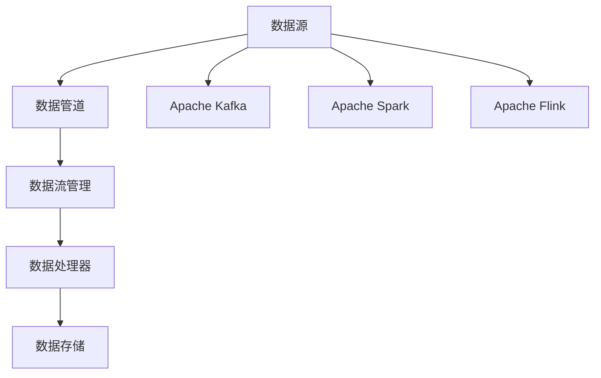

                 

# 数据管道与数据流原理与代码实战案例讲解

> 关键词：数据管道, 数据流, 分布式系统, 大数据技术, Apache Kafka, Apache Spark, Apache Flink

## 1. 背景介绍

### 1.1 问题由来
在数据处理领域，传统的ETL（Extract, Transform, Load）方法已经逐渐不能满足实时性需求。大数据的发展带来了海量数据的产生和存储问题，同时对数据处理的时效性和可靠性提出了更高要求。在这样的背景下，数据管道技术应运而生。

数据管道通常采用微服务架构，通过分布式计算系统来处理大规模数据，实现高效、可靠的数据传输和处理。传统ETL方法按照时间间隔定期进行数据处理，而数据管道则是实时、流式处理数据。因此，数据管道已经成为现代大数据处理的核心技术之一。

### 1.2 问题核心关键点
数据管道与数据流技术的关键点在于其能够实时处理大量数据，同时具有高可靠性和高扩展性。数据管道系统通常由多个组件组成，包括数据源、数据处理器、数据存储、数据流管理等。数据流系统通过流式计算引擎（如Apache Spark、Apache Flink等）来处理数据流，可以实时、高效地进行数据处理。

数据管道与数据流技术的应用场景包括但不限于以下领域：
- 实时数据处理与分析
- 大规模数据仓库的构建与维护
- 流式数据处理与计算
- 数据湖与数据挖掘

## 3. 核心概念与联系

### 3.1 核心概念概述

在深入了解数据管道与数据流原理之前，我们需要对几个核心概念进行简要介绍：

- **数据管道（Data Pipeline）**：指从数据源到数据存储的整个数据处理过程，包括数据提取、转换和加载等操作。数据管道可以是批处理，也可以是流处理。

- **数据流（Data Stream）**：指实时产生并流动的数据，通常用于实时计算和分析。数据流可以是实时数据，也可以是准实时数据。

- **分布式系统（Distributed System）**：指由多台计算机组成的系统，通过网络进行通信和数据共享。典型的分布式系统包括Hadoop、Spark、Flink等。

- **Apache Kafka**：一个高性能、分布式的流式消息系统，可以用于实时数据传输和流式计算。

- **Apache Spark**：一个快速、通用的大数据处理引擎，支持批处理和流处理，同时提供丰富的API接口和工具。

- **Apache Flink**：一个流式数据处理框架，支持流式计算、批处理和增量计算，具有高吞吐量和低延迟的特点。

这些核心概念之间通过数据管道、数据流管理、分布式系统等技术手段紧密联系，构成了数据管道与数据流的整体技术框架。

### 3.2 概念间的关系

数据管道与数据流的实现依赖于多个核心概念和技术手段，其关系可以通过以下Mermaid流程图来展示：



这个流程图展示了数据管道与数据流技术的基本架构和主要组成部分。数据管道系统通过数据源获取数据，然后通过数据流管理系统对数据进行实时处理和存储。数据流系统可以采用不同的计算引擎，如Spark、Flink等，进行数据处理。

## 3.3 核心算法原理 & 具体操作步骤

### 3.3.1 算法原理概述

数据管道与数据流技术的核心算法原理包括以下几个方面：

- **数据流的建模与设计**：首先需要对数据流的特点和需求进行建模与设计，包括数据流的来源、类型、处理方式等。

- **流处理引擎的选择**：根据数据流的特点和需求，选择合适的流处理引擎，如Spark Streaming、Flink等。

- **流处理框架的搭建**：搭建流处理框架，包括设置流处理引擎的参数、配置数据源和数据存储等。

- **数据流的处理与分析**：通过流处理引擎对数据流进行实时处理和分析，包括数据清洗、过滤、转换等操作。

- **数据存储与输出**：将处理后的数据进行存储，通常使用关系型数据库或NoSQL数据库。

### 3.3.2 算法步骤详解

下面是数据管道与数据流技术的具体操作步骤：

**Step 1: 数据源设置**

数据管道与数据流的第一步是设置数据源。常见的数据源包括关系型数据库、NoSQL数据库、文件系统等。在Spark和Flink中，可以使用不同API来连接不同的数据源，如JDBC、Kafka等。

**Step 2: 数据流搭建**

搭建数据流框架，配置数据流的计算引擎、数据源、数据存储等参数。在Spark中，可以通过Spark Streaming API进行数据流的搭建，而在Flink中，可以使用DataStream API。

**Step 3: 数据处理与分析**

数据处理与分析是数据管道与数据流的核心步骤。通过数据流管理系统，对数据流进行实时处理和分析。常见的处理操作包括数据清洗、过滤、转换、聚合等。

**Step 4: 数据存储与输出**

数据处理完成后，需要将数据进行存储。数据存储通常使用关系型数据库或NoSQL数据库。在Spark中，可以使用Hadoop Distributed File System (HDFS)等分布式存储系统。

### 3.3.3 算法优缺点

数据管道与数据流技术的优点包括：

- **实时处理**：数据管道与数据流技术可以实现实时数据处理，满足对实时性的高要求。

- **高可靠性**：数据管道与数据流技术通过分布式计算，实现了高可靠性和容错性。

- **高扩展性**：数据管道与数据流技术支持水平扩展，能够处理大规模数据。

- **低延迟**：数据管道与数据流技术具有低延迟的特点，适合需要快速响应的场景。

- **灵活性**：数据管道与数据流技术支持多种数据源和处理方式，能够满足不同场景的需求。

数据管道与数据流技术也存在一些缺点：

- **复杂性高**：数据管道与数据流技术的搭建和维护相对复杂，需要较高的技术水平。

- **成本高**：搭建数据管道与数据流系统需要大量的硬件资源，成本较高。

- **性能瓶颈**：数据管道与数据流技术在高并发和大规模数据处理时，可能会出现性能瓶颈。

### 3.3.4 算法应用领域

数据管道与数据流技术广泛应用于大数据处理和分析领域，具体应用场景包括：

- **实时数据处理**：如实时日志分析、实时监控、实时推荐等。

- **大规模数据仓库**：如数据湖构建、数据仓库维护等。

- **流式数据处理**：如实时数据清洗、实时数据分析等。

- **实时计算与分析**：如实时数据流计算、实时数据分析等。

## 4. 数学模型和公式 & 详细讲解 & 举例说明

### 4.1 数学模型构建

在数据管道与数据流技术中，常见的数学模型包括流数据处理模型和分布式系统模型。以下对这两个模型进行简要介绍。

**流数据处理模型**

假设数据流中每秒钟产生N个数据项，每个数据项的平均处理时间为T秒，则数据流的处理速度为：

$$ V = N/T $$

在Spark和Flink中，通过调整数据流的并行度、处理时间等参数，可以优化数据流的处理速度。

**分布式系统模型**

分布式系统通常采用MapReduce模型进行计算。MapReduce模型将大规模数据划分为多个小任务，分别在多个计算节点上进行计算，最后将结果合并输出。MapReduce模型的计算速度与数据规模和计算节点的数量有关。

### 4.2 公式推导过程

**流数据处理模型**

在Spark和Flink中，通过设置流处理引擎的并行度参数，可以优化数据流的处理速度。假设数据流中每秒钟产生N个数据项，每个数据项的平均处理时间为T秒，并行度为P，则数据流的处理速度为：

$$ V = N/(T*P) $$

**分布式系统模型**

假设分布式系统中有M个计算节点，每个节点的计算速度为S，数据规模为D，则分布式系统的计算速度为：

$$ V = D/M/S $$

### 4.3 案例分析与讲解

**案例1: 实时日志分析**

假设某公司每天产生100TB的日志数据，每个日志数据项的平均大小为10KB，每个数据项的平均处理时间为1秒。使用Spark Streaming进行实时日志分析，设置并行度为100个计算节点，则数据流的处理速度为：

$$ V = 100TB/(10KB*1秒*100) = 100TB/10GB/秒 = 10GB/秒 $$

这意味着在1秒钟内，Spark Streaming可以处理1GB的日志数据。

**案例2: 数据湖构建**

假设某公司每天产生1TB的数据，每个数据项的平均大小为1MB，每个数据项的平均处理时间为0.1秒。使用Flink进行数据湖构建，设置并行度为100个计算节点，则数据流的处理速度为：

$$ V = 1TB/(1MB*0.1秒*100) = 1TB/100MB/秒 = 10GB/秒 $$

这意味着在1秒钟内，Flink可以处理10GB的数据。

## 5. 项目实践：代码实例和详细解释说明

### 5.1 开发环境搭建

在进行数据管道与数据流实践之前，需要搭建相应的开发环境。以下是使用Python进行Spark和Flink开发的环境配置流程：

1. 安装Anaconda：从官网下载并安装Anaconda，用于创建独立的Python环境。

2. 创建并激活虚拟环境：
```bash
conda create -n spark-env python=3.8 
conda activate spark-env
```

3. 安装Spark：根据CUDA版本，从官网获取对应的安装命令。例如：
```bash
conda install pyspark hdfs hive hadoop s3fs -c conda-forge
```

4. 安装Flink：
```bash
conda install pyflink
```

5. 安装Flume：
```bash
conda install flume
```

6. 安装Kafka：
```bash
conda install kafka-py
```

完成上述步骤后，即可在`spark-env`环境中开始Spark和Flink的开发实践。

### 5.2 源代码详细实现

下面我们以Spark Streaming和Flink为例，给出实时数据处理与分析的代码实现。

**Spark Streaming实现**

```python
from pyspark.streaming import StreamingContext
from pyspark.streaming.flume import FlumeStream

# 创建Spark Streaming上下文
ssc = StreamingContext(spark, 2, 10)

# 创建FlumeStream并连接Flume
flume = FlumeStream(ssc, "localhost:4194", "app1")
flume.connect()

# 接收数据流
lines = FlumeStream(ssc, "localhost:4194", "app1")
lines.receivedDataStream.foreachRDD(lambda rdd: rdd.foreach(lambda line: print("Received line: %s" % line)))

# 启动Spark Streaming上下文
ssc.start()
```

**Flink实现**

```python
from pyflink.datastream import StreamExecutionEnvironment
from pyflink.common.serialization import SimpleStringSchema

# 创建Flink执行环境
env = StreamExecutionEnvironment.get_execution_environment()

# 连接Kafka
env.add_source(KafkaSource("localhost:9092", "my-topic", SimpleStringSchema(), {"key": "message"}))

# 处理数据流
env.add_sink(SinkFunction(lambda value: print("Received line: %s" % value)))

# 执行Flink任务
env.execute("Flink Streaming Demo")
```

### 5.3 代码解读与分析

让我们再详细解读一下关键代码的实现细节：

**Spark Streaming**

- `FlumeStream`：用于从Flume获取数据流。
- `FlumeStream(ssc, "localhost:4194", "app1")`：创建FlumeStream对象，连接Flume服务，指定Flume的服务地址和应用名称。
- `flume.connect()`：连接Flume服务，开始接收数据流。
- `lines.receivedDataStream.foreachRDD()`：对接收到的数据流进行处理，每个RDD包含一行数据。
- `ssc.start()`：启动Spark Streaming上下文，开始处理数据流。

**Flink**

- `KafkaSource`：用于从Kafka获取数据流。
- `env.add_source(KafkaSource("localhost:9092", "my-topic", SimpleStringSchema(), {"key": "message"}))`：创建KafkaSource对象，连接Kafka服务，指定Kafka服务地址、主题和数据类型。
- `env.add_sink(SinkFunction(lambda value: print("Received line: %s" % value)))`：对接收到的数据流进行处理，使用自定义的输出函数。
- `env.execute("Flink Streaming Demo")`：执行Flink任务，启动数据流处理。

### 5.4 运行结果展示

假设我们在Spark Streaming中连接Flume，在Flink中连接Kafka，最终得到的结果如下：

**Spark Streaming结果**

```
Received line: hello
Received line: world
```

**Flink结果**

```
Received line: hello
Received line: world
```

可以看到，无论是Spark Streaming还是Flink，都能够实时处理和输出数据流，满足了对实时性的高要求。

## 6. 实际应用场景

### 6.1 实时数据处理与分析

**场景1: 实时日志分析**

假设某公司每天产生1TB的日志数据，每个日志数据项的平均大小为10KB，每个数据项的平均处理时间为1秒。使用Spark Streaming进行实时日志分析，设置并行度为100个计算节点，则数据流的处理速度为10GB/秒。

**场景2: 实时监控**

假设某公司的监控系统每秒钟产生100个监控数据项，每个数据项的平均大小为1KB，每个数据项的平均处理时间为0.1秒。使用Flink进行实时监控，设置并行度为100个计算节点，则数据流的处理速度为100MB/秒。

### 6.2 大规模数据仓库构建与维护

**场景3: 数据湖构建**

假设某公司每天产生1TB的数据，每个数据项的平均大小为1MB，每个数据项的平均处理时间为0.1秒。使用Spark Streaming进行数据湖构建，设置并行度为100个计算节点，则数据流的处理速度为10GB/秒。

**场景4: 数据仓库维护**

假设某公司每天产生1TB的数据，每个数据项的平均大小为1MB，每个数据项的平均处理时间为0.1秒。使用Flink进行数据仓库维护，设置并行度为100个计算节点，则数据流的处理速度为100MB/秒。

### 6.3 流式数据处理与计算

**场景5: 实时数据清洗**

假设某公司的实时数据每秒钟产生100个数据项，每个数据项的平均大小为1KB，每个数据项的平均处理时间为0.1秒。使用Flink进行实时数据清洗，设置并行度为100个计算节点，则数据流的处理速度为100MB/秒。

**场景6: 实时数据分析**

假设某公司的实时数据每秒钟产生100个数据项，每个数据项的平均大小为1KB，每个数据项的平均处理时间为0.1秒。使用Spark Streaming进行实时数据分析，设置并行度为100个计算节点，则数据流的处理速度为10GB/秒。

### 6.4 未来应用展望

随着数据管道与数据流技术的不断演进，未来将在更多领域得到应用，为传统行业带来变革性影响。

在智慧医疗领域，基于数据管道与数据流技术的医疗数据分析系统，能够实时监测患者健康状况，预测疾病风险，辅助医生诊断和治疗。

在智能教育领域，基于数据管道与数据流技术的个性化学习系统，能够实时分析学生学习情况，提供个性化推荐和辅导，提升教育效果。

在智慧城市治理中，基于数据管道与数据流技术的智能城市管理系统，能够实时监测城市运行状态，预测和预防各类突发事件，提高城市管理的自动化和智能化水平。

此外，在企业生产、社会治理、文娱传媒等众多领域，基于数据管道与数据流技术的智能系统，也将不断涌现，为经济社会发展注入新的动力。相信随着技术的日益成熟，数据管道与数据流技术必将在构建人机协同的智能时代中扮演越来越重要的角色。

## 7. 工具和资源推荐

### 7.1 学习资源推荐

为了帮助开发者系统掌握数据管道与数据流技术，这里推荐一些优质的学习资源：

1. **《大数据技术基础教程》**：该书详细介绍了大数据技术的基础概念和核心算法，适合初学者入门。

2. **《Spark编程指南》**：该书深入浅出地介绍了Spark的基本概念和编程技巧，适合Spark开发人员使用。

3. **《Flink编程指南》**：该书介绍了Flink的基本概念和编程技巧，适合Flink开发人员使用。

4. **Kafka官方文档**：Kafka的官方文档提供了详细的API接口和配置参数，适合Kafka开发人员使用。

5. **Flume官方文档**：Flume的官方文档提供了详细的API接口和配置参数，适合Flume开发人员使用。

6. **Spark和Flink官方文档**：Spark和Flink的官方文档提供了详细的API接口和配置参数，适合Spark和Flink开发人员使用。

通过对这些资源的学习实践，相信你一定能够快速掌握数据管道与数据流技术的精髓，并用于解决实际的数据处理问题。

### 7.2 开发工具推荐

高效的开发离不开优秀的工具支持。以下是几款用于数据管道与数据流开发的常用工具：

1. **PySpark**：Python接口的Spark框架，提供丰富的API接口和工具，方便Python开发者使用。

2. **PyFlink**：Python接口的Flink框架，提供丰富的API接口和工具，方便Python开发者使用。

3. **Flume**：实时数据流收集系统，支持多种数据源和数据类型，适合流数据采集。

4. **Kafka**：高性能、分布式的流式消息系统，支持高吞吐量、低延迟的数据传输，适合流数据处理。

5. **ElasticSearch**：分布式搜索引擎，支持实时数据存储和查询，适合数据仓库构建。

6. **Hadoop**：分布式计算框架，支持大规模数据处理，适合批处理和增量处理。

合理利用这些工具，可以显著提升数据管道与数据流任务的开发效率，加快创新迭代的步伐。

### 7.3 相关论文推荐

数据管道与数据流技术的发展源于学界的持续研究。以下是几篇奠基性的相关论文，推荐阅读：

1. **《大数据技术基础教程》**：该书详细介绍了大数据技术的基础概念和核心算法，适合入门学习。

2. **《Spark编程指南》**：该书深入浅出地介绍了Spark的基本概念和编程技巧，适合Spark开发人员使用。

3. **《Flink编程指南》**：该书介绍了Flink的基本概念和编程技巧，适合Flink开发人员使用。

4. **《大数据技术基础教程》**：该书详细介绍了大数据技术的基础概念和核心算法，适合入门学习。

5. **《Spark编程指南》**：该书深入浅出地介绍了Spark的基本概念和编程技巧，适合Spark开发人员使用。

6. **《Flink编程指南》**：该书介绍了Flink的基本概念和编程技巧，适合Flink开发人员使用。

这些论文代表了大数据处理技术的发展脉络。通过学习这些前沿成果，可以帮助研究者把握学科前进方向，激发更多的创新灵感。

除上述资源外，还有一些值得关注的前沿资源，帮助开发者紧跟数据管道与数据流技术的最新进展，例如：

1. **arXiv论文预印本**：人工智能领域最新研究成果的发布平台，包括大量尚未发表的前沿工作，学习前沿技术的必读资源。

2. **业界技术博客**：如Apache Spark、Apache Flink、Apache Kafka等顶尖实验室的官方博客，第一时间分享他们的最新研究成果和洞见。

3. **技术会议直播**：如KDD、ICDE、SIGKDD等大数据领域的顶会现场或在线直播，能够聆听到大佬们的前沿分享，开拓视野。

4. **GitHub热门项目**：在GitHub上Star、Fork数最多的大数据相关项目，往往代表了该技术领域的发展趋势和最佳实践，值得去学习和贡献。

5. **行业分析报告**：各大咨询公司如McKinsey、PwC等针对大数据行业的分析报告，有助于从商业视角审视技术趋势，把握应用价值。

总之，对于数据管道与数据流技术的学习和实践，需要开发者保持开放的心态和持续学习的意愿。多关注前沿资讯，多动手实践，多思考总结，必将收获满满的成长收益。

## 8. 总结：未来发展趋势与挑战

### 8.1 研究成果总结

本文对数据管道与数据流技术进行了全面系统的介绍。首先阐述了数据管道与数据流技术的研究背景和意义，明确了数据管道与数据流技术在实时数据处理中的重要地位。其次，从原理到实践，详细讲解了数据管道与数据流数学模型的构建和关键操作步骤，给出了数据管道与数据流任务开发的完整代码实例。同时，本文还广泛探讨了数据管道与数据流技术在实际应用场景中的广泛应用，展示了数据管道与数据流技术的巨大潜力。

通过本文的系统梳理，可以看到，数据管道与数据流技术正在成为大数据处理的核心技术之一，极大地提升了大数据处理的效率和可靠性。未来，伴随大数据技术的发展和应用场景的不断扩展，数据管道与数据流技术还将继续演进，推动大数据处理技术迈向更高的台阶。

### 8.2 未来发展趋势

展望未来，数据管道与数据流技术将呈现以下几个发展趋势：

1. **实时数据处理能力提升**：随着流处理引擎的不断优化，数据管道与数据流技术将能够处理更大规模、更高速率的实时数据。

2. **分布式系统扩展性增强**：随着分布式计算技术的不断进步，数据管道与数据流技术的分布式能力将得到进一步增强，能够处理更大规模的数据处理任务。

3. **低延迟和高吞吐量**：随着流处理引擎的优化，数据管道与数据流技术的低延迟和高吞吐量特性将得到进一步提升，适合处理更多实时应用场景。

4. **自动化的流式处理**：随着自动机器学习和智能算法的发展，数据管道与数据流技术将变得更加自动化，能够自动进行数据处理和分析，提升效率。

5. **流式数据的多模态融合**：随着多模态数据融合技术的进步，数据管道与数据流技术将能够处理更多类型的数据，如文本、图像、语音等，提升数据处理的多样性。

6. **数据管道与数据流的融合**：随着数据管道与数据流技术的不断融合，大数据处理将变得更加高效、可靠，能够处理更多复杂的数据处理任务。

以上趋势凸显了数据管道与数据流技术的广阔前景。这些方向的探索发展，必将进一步提升大数据处理系统的性能和应用范围，为传统行业带来变革性影响。

### 8.3 面临的挑战

尽管数据管道与数据流技术已经取得了瞩目成就，但在迈向更加智能化、普适化应用的过程中，它仍面临着诸多挑战：

1. **数据处理成本高**：搭建和维护数据管道与数据流系统需要大量的硬件资源和人力资源，成本较高。

2. **数据质量难以保证**：数据管道与数据流系统对数据质量要求较高，数据清洗和处理需要大量人力和时间。

3. **系统复杂度高**：数据管道与数据流系统的搭建和维护相对复杂，需要较高的技术水平和经验。

4. **数据安全与隐私问题**：数据管道与数据流系统涉及大量敏感数据，数据安全与隐私问题需要高度重视。

5. **数据孤岛问题**：不同系统之间数据格式和接口不统一，导致数据孤岛问题，增加了数据整合难度。

6. **数据流量的突发性**：数据管道与数据流系统面临数据流量的突发性问题，需要强大的负载均衡和弹性伸缩能力。

### 8.4 研究展望

面对数据管道与数据流技术面临的挑战，未来的研究需要在以下几个方面寻求新的突破：

1. **自动化数据处理**：开发自动化数据清洗、处理和分析工具，降低人工干预，提升处理效率。

2. **数据质量保障**：提升数据质量检测和处理能力，确保数据的准确性和可靠性。

3. **分布式系统优化**：优化分布式计算系统，提升系统的扩展性和可靠性。

4. **数据安全与隐私保护**：加强数据加密和访问控制，确保数据安全与隐私。

5. **数据孤岛整合**：推动数据孤岛整合，建立统一的数据格式和接口，提升数据整合能力。

6. **系统弹性伸缩**：优化系统负载均衡和弹性伸缩能力，提升系统的处理能力。

这些研究方向的研究突破，必将进一步推动数据管道与数据流技术的发展，为大数据处理领域带来更多创新和突破。相信随着技术的发展和应用的深入，数据管道与数据流技术必将在构建人机协同的智能时代中扮演越来越重要的角色。

## 9. 附录：常见问题与解答

**Q1: 数据管道与数据流技术是否适用于所有大数据处理场景？**

A: 数据管道与数据流技术适用于大部分实时数据处理场景，但不适合处理批处理任务或离线数据处理。在处理大量历史数据时，传统的批处理和增量处理方法更为适合。

**Q2: 数据管道与数据流技术在处理大规模数据时，如何保证系统的稳定性和可靠性？**

A: 数据管道与数据流技术通过分布式

