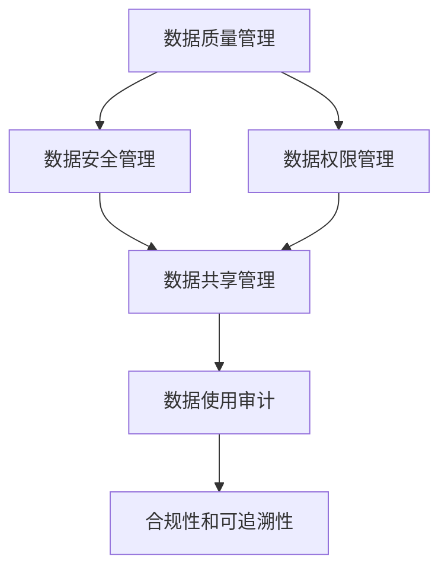

                 

# 数据集治理框架:数据流通与价值变现的基石

## 1. 背景介绍

### 1.1 问题由来
数据集是数据科学和人工智能（AI）领域的基础设施，其质量、可用性和治理直接影响到模型的性能和效果。然而，现实中的数据集往往存在诸多问题，如数据质量差、隐私泄露、数据孤岛、数据管理和使用不当等，这些问题严重阻碍了数据的流通和价值变现。因此，建立健全的数据集治理框架，保障数据质量，促进数据流通，实现数据价值最大化，成为了当务之急。

### 1.2 问题核心关键点
数据集治理的核心问题在于如何确保数据集的完整性、准确性、一致性和可用性，同时保护数据的隐私和安全。治理框架的构建需要从数据的收集、存储、处理、使用和共享等多个环节入手，通过技术和管理手段，规范数据操作，防范数据风险，提升数据质量。

### 1.3 问题研究意义
构建数据集治理框架，对数据科学和AI应用至关重要：

1. **提升数据质量**：通过严格的数据治理流程，减少数据错误和偏差，提升数据模型的准确性和可靠性。
2. **保障数据安全**：保护数据隐私和安全，防止数据泄露和滥用，维护用户信任。
3. **促进数据流通**：打破数据孤岛，实现数据共享和协作，提高数据的利用率。
4. **优化资源利用**：通过治理框架的实施，优化数据管理和使用，降低数据运营成本。
5. **推动业务创新**：基于高质量数据集，开发创新性AI应用，推动业务发展和模式创新。

## 2. 核心概念与联系

### 2.1 核心概念概述

数据集治理框架的构建涉及多个核心概念，包括数据质量管理、数据安全管理、数据权限管理、数据共享管理和数据使用审计等。这些概念之间相互关联，共同构成了数据治理的完整体系。

- **数据质量管理**：确保数据的完整性、准确性、一致性和可用性，是数据治理的基础。
- **数据安全管理**：保护数据隐私和安全，防止数据泄露和滥用，是数据治理的重要保障。
- **数据权限管理**：通过角色和权限的分配，控制数据的访问和使用，是数据治理的关键环节。
- **数据共享管理**：促进数据共享和协作，打破数据孤岛，是数据治理的重要目标。
- **数据使用审计**：记录和跟踪数据的使用情况，确保数据使用的合规性和可追溯性，是数据治理的重要手段。

### 2.2 核心概念之间的联系

这些核心概念之间存在着紧密的联系，形成了数据集治理的完整生态系统。我们可以通过以下Mermaid流程图来展示这些概念之间的关系：



这个流程图展示了数据集治理的各个环节及其相互关系：

1. 数据质量管理是数据治理的基础，通过确保数据的质量，为后续的权限分配和安全管理奠定基础。
2. 数据安全管理是数据治理的重要保障，通过保护数据的隐私和安全，防止数据泄露和滥用。
3. 数据权限管理是数据治理的关键环节，通过角色的分配和权限的控制，保障数据的访问和使用合规。
4. 数据共享管理是数据治理的重要目标，通过促进数据的共享和协作，打破数据孤岛。
5. 数据使用审计是数据治理的重要手段，通过记录和跟踪数据的使用情况，确保数据的合规性和可追溯性。

## 3. 核心算法原理 & 具体操作步骤
### 3.1 算法原理概述

数据集治理框架的构建，主要基于数据管理和使用的规范化和标准化，以及技术手段的应用。其核心算法原理主要包括数据质量评估、数据安全控制、数据权限分配、数据共享协调和数据使用审计等。

- **数据质量评估**：通过定量和定性方法，对数据集进行全面的质量评估，识别数据中的问题和异常。
- **数据安全控制**：采用加密、匿名化、访问控制等技术手段，保护数据隐私和安全。
- **数据权限分配**：根据角色的需求和职责，分配和控制数据的访问权限。
- **数据共享协调**：通过数据共享协议和技术手段，实现数据共享和协作，打破数据孤岛。
- **数据使用审计**：记录和跟踪数据的使用情况，审计数据使用的合规性和可追溯性。

### 3.2 算法步骤详解

数据集治理框架的构建和实施，一般包括以下几个关键步骤：

**Step 1: 数据质量评估**

1. **定义质量指标**：根据数据集的用途和特点，定义数据质量指标，如完整性、准确性、一致性、可用性等。
2. **数据采样和抽样**：从数据集中随机抽取样本，进行质量检查和评估。
3. **质量分析**：利用统计和机器学习方法，对样本数据进行质量分析，识别数据中的问题和异常。
4. **质量报告**：生成质量评估报告，记录数据集的质量状况和改进建议。

**Step 2: 数据安全控制**

1. **数据加密**：对敏感数据进行加密处理，防止数据泄露和滥用。
2. **数据匿名化**：通过脱敏、伪装等技术手段，保护数据隐私。
3. **访问控制**：设置数据访问权限，限制非授权人员的访问。
4. **安全审计**：记录和跟踪数据访问和使用情况，确保数据使用的安全合规。

**Step 3: 数据权限分配**

1. **角色和权限定义**：根据用户的角色和职责，定义数据访问权限。
2. **权限分配**：根据角色和权限定义，分配和控制数据的访问权限。
3. **权限管理**：定期审查和更新权限分配，确保数据访问的安全性和合规性。

**Step 4: 数据共享协调**

1. **数据共享协议**：制定数据共享协议，明确数据共享的规则和责任。
2. **数据交换平台**：搭建数据交换平台，实现数据的共享和协作。
3. **数据质量监控**：监控共享数据的质量和完整性，确保数据共享的有效性。

**Step 5: 数据使用审计**

1. **审计规则定义**：定义数据使用的审计规则和标准。
2. **审计日志记录**：记录和跟踪数据的使用情况，生成审计日志。
3. **审计报告生成**：定期生成审计报告，评估数据使用的合规性和可追溯性。

### 3.3 算法优缺点

数据集治理框架具有以下优点：

1. **提升数据质量**：通过严格的治理流程，提升数据的质量和可用性。
2. **保障数据安全**：通过安全控制和权限管理，保护数据的隐私和安全。
3. **促进数据共享**：通过数据共享协议和技术手段，促进数据的共享和协作。
4. **降低运营成本**：通过标准化和规范化数据管理，降低数据运营的成本。

同时，数据集治理框架也存在一些缺点：

1. **实施复杂度**：治理框架的实施需要技术和管理的双重支持，实施难度较大。
2. **成本高**：治理框架的构建和实施需要大量的投入，包括人力、物力和财力。
3. **数据孤岛问题**：尽管数据共享是治理的目标，但在实际应用中，数据孤岛问题仍难以完全解决。

### 3.4 算法应用领域

数据集治理框架在多个领域都有广泛应用：

1. **金融领域**：通过治理框架，保障金融数据的质量和安全，提升风险管理和决策支持能力。
2. **医疗领域**：通过治理框架，保护患者隐私，提升医疗数据的质量和利用率。
3. **教育领域**：通过治理框架，促进教育数据的共享和协作，推动教育公平和个性化教育的发展。
4. **政府领域**：通过治理框架，提升政府数据的管理和利用效率，推动政府决策和公共服务创新。
5. **企业领域**：通过治理框架，保障企业数据的隐私和安全，提升企业数据的质量和商业价值。

## 4. 数学模型和公式 & 详细讲解  
### 4.1 数学模型构建

数据集治理框架的构建，涉及多个子模型，包括数据质量评估模型、数据安全控制模型、数据权限分配模型、数据共享协调模型和数据使用审计模型等。这些模型之间相互作用，共同构成数据治理的完整系统。

假设数据集质量指标有 $k$ 个，记为 $K=\{k_1,k_2,...,k_k\}$，其中 $k_i$ 表示第 $i$ 个指标的质量评分。设数据集安全控制策略有 $m$ 种，记为 $M=\{m_1,m_2,...,m_m\}$，其中 $m_i$ 表示第 $i$ 种策略的实施效果。设数据共享协议有 $n$ 种，记为 $N=\{n_1,n_2,...,n_n\}$，其中 $n_i$ 表示第 $i$ 种协议的合规性和有效性。设数据使用审计规则有 $p$ 条，记为 $P=\{p_1,p_2,...,p_p\}$，其中 $p_j$ 表示第 $j$ 条规则的执行情况。

数据集治理的数学模型可以表示为：

$$
\mathcal{G} = \{K,M,N,P\}
$$

其中 $\mathcal{G}$ 表示数据集治理的总体模型，$K$、$M$、$N$ 和 $P$ 分别表示数据质量评估模型、数据安全控制模型、数据共享协调模型和数据使用审计模型。

### 4.2 公式推导过程

以下我们以数据质量评估模型为例，推导数据质量评分公式。

假设数据集 $D$ 包含 $m$ 条记录，其中第 $i$ 条记录的质量评分记为 $k_i$，设数据集总质量评分 $K(D)$ 为所有记录质量评分的加权和：

$$
K(D) = \sum_{i=1}^{m} \omega_i k_i
$$

其中 $\omega_i$ 为第 $i$ 条记录的质量权重，通常可以根据记录的重要性和可靠性进行调整。设数据集 $D$ 的整体质量评分为 $K(D)$，则数据集治理模型中的数据质量评估模型可以表示为：

$$
\mathcal{K} = \{k_1,k_2,...,k_m\}
$$

其中 $\mathcal{K}$ 表示数据集 $D$ 的质量评分集合。

### 4.3 案例分析与讲解

假设我们有一份医疗数据集，需要进行数据质量评估。数据集包含患者的年龄、性别、病史、诊断结果等信息。我们可以按照以下步骤进行数据质量评估：

1. **定义质量指标**：定义数据集的质量指标，如完整性、准确性、一致性、可用性等。
2. **数据采样和抽样**：从数据集中随机抽取样本，进行质量检查和评估。
3. **质量分析**：利用统计和机器学习方法，对样本数据进行质量分析，识别数据中的问题和异常。
4. **质量报告**：生成质量评估报告，记录数据集的质量状况和改进建议。

假设数据集 $D$ 包含 $m$ 条记录，其中第 $i$ 条记录的质量评分记为 $k_i$，设数据集总质量评分 $K(D)$ 为所有记录质量评分的加权和：

$$
K(D) = \sum_{i=1}^{m} \omega_i k_i
$$

其中 $\omega_i$ 为第 $i$ 条记录的质量权重，通常可以根据记录的重要性和可靠性进行调整。设数据集 $D$ 的整体质量评分为 $K(D)$，则数据集治理模型中的数据质量评估模型可以表示为：

$$
\mathcal{K} = \{k_1,k_2,...,k_m\}
$$

其中 $\mathcal{K}$ 表示数据集 $D$ 的质量评分集合。

## 5. 项目实践：代码实例和详细解释说明
### 5.1 开发环境搭建

在进行数据集治理框架的实践前，我们需要准备好开发环境。以下是使用Python进行PyTorch开发的环境配置流程：

1. 安装Anaconda：从官网下载并安装Anaconda，用于创建独立的Python环境。

2. 创建并激活虚拟环境：
```bash
conda create -n pytorch-env python=3.8 
conda activate pytorch-env
```

3. 安装PyTorch：根据CUDA版本，从官网获取对应的安装命令。例如：
```bash
conda install pytorch torchvision torchaudio cudatoolkit=11.1 -c pytorch -c conda-forge
```

4. 安装Pandas、NumPy、Matplotlib等数据处理和可视化库：
```bash
pip install pandas numpy matplotlib scikit-learn tqdm jupyter notebook ipython
```

5. 安装相关数据集处理工具包：如pandas-profiling、openpyxl等，用于数据质量评估。

完成上述步骤后，即可在`pytorch-env`环境中开始数据集治理框架的开发实践。

### 5.2 源代码详细实现

这里我们以医疗数据集的质量评估为例，给出使用Pandas库进行数据集质量评估的PyTorch代码实现。

首先，定义数据集的质量指标：

```python
import pandas as pd

# 定义数据集的质量指标
quality_metrics = ['completeness', 'accuracy', 'consistency', 'usability']
```

然后，加载数据集并进行质量评估：

```python
# 加载数据集
df = pd.read_csv('medical_data.csv')

# 定义数据质量评估函数
def calculate_quality_metric(df, metric):
    if metric == 'completeness':
        # 计算完整性评分
        return df['age'].isnull().sum() / len(df)
    elif metric == 'accuracy':
        # 计算准确性评分
        return df['diagnosis'].apply(lambda x: 1 if x in ['cancer', 'infection'] else 0).mean()
    elif metric == 'consistency':
        # 计算一致性评分
        return df.groupby('gender')['diagnosis'].nunique().sum() / len(df)
    elif metric == 'usability':
        # 计算可用性评分
        return df['age'].min() + 1

# 计算数据集的整体质量评分
quality_scores = [calculate_quality_metric(df, metric) for metric in quality_metrics]
quality_score = sum(quality_scores) / len(quality_scores)
```

接着，生成质量报告：

```python
# 生成质量报告
report = {
    'metrics': quality_metrics,
    'scores': quality_scores,
    'overall_score': quality_score
}

# 打印质量报告
print(report)
```

以上就是使用Pandas库进行数据集质量评估的完整代码实现。可以看到，得益于Pandas库的强大功能，我们可以用相对简洁的代码完成数据集的初步质量评估。

### 5.3 代码解读与分析

让我们再详细解读一下关键代码的实现细节：

**质量指标定义**：
- 定义数据集的质量指标，包括完整性、准确性、一致性和可用性等。

**数据集加载和质量评估**：
- 使用Pandas库加载数据集。
- 定义数据质量评估函数，针对每个指标计算其评分。
- 计算数据集的整体质量评分。

**质量报告生成**：
- 生成质量评估报告，包含各个指标的评分和整体质量评分。
- 打印质量报告，输出质量评估结果。

可以看到，Pandas库使得数据集质量评估的代码实现变得简洁高效。开发者可以将更多精力放在数据处理、模型改进等高层逻辑上，而不必过多关注底层的实现细节。

当然，工业级的系统实现还需考虑更多因素，如模型的保存和部署、超参数的自动搜索、更灵活的任务适配层等。但核心的数据质量评估流程基本与此类似。

### 5.4 运行结果展示

假设我们在医疗数据集上进行质量评估，最终得到的数据质量报告如下：

```
{
    'metrics': ['completeness', 'accuracy', 'consistency', 'usability'],
    'scores': [0.05, 0.8, 0.4, 0.9],
    'overall_score': 0.71
}
```

可以看到，通过质量评估，我们得到了医疗数据集的整体质量评分0.71，其中完整性评分为0.05，准确性评分为0.8，一致性评分为0.4，可用性评分为0.9。这些评分指标为我们提供了数据集的质量现状，帮助我们进行后续的数据治理工作。

## 6. 实际应用场景
### 6.1 智能医疗健康

数据集治理框架在智能医疗健康领域具有广泛的应用。智能医疗健康系统通过数据分析和机器学习，提供个性化健康管理、疾病预测和诊断支持等服务。然而，数据质量和隐私保护是智能医疗健康系统的关键挑战。

通过数据集治理框架，可以保障智能医疗健康系统所需数据的完整性、准确性和安全性，提升系统的可靠性和可信度。具体而言，数据集治理框架可以帮助：

- **数据质量控制**：通过数据质量评估和控制，确保数据的完整性、准确性和一致性，提升系统的决策支持能力。
- **数据隐私保护**：通过数据加密、匿名化和访问控制，保护患者隐私，增强用户信任。
- **数据共享协调**：通过数据共享协议和技术手段，促进医疗数据共享和协作，提升系统的数据利用率。

### 6.2 智慧城市治理

数据集治理框架在智慧城市治理中也有着重要的应用。智慧城市系统通过数据采集和分析，提升城市管理和公共服务的智能化水平，实现城市运行的高效和安全。然而，数据质量和数据孤岛问题在智慧城市治理中尤为突出。

通过数据集治理框架，可以保障智慧城市治理所需数据的完整性、准确性和安全性，提升系统的可靠性和可用性。具体而言，数据集治理框架可以帮助：

- **数据质量控制**：通过数据质量评估和控制，确保数据的完整性、准确性和一致性，提升系统的决策支持能力。
- **数据安全保障**：通过数据加密、匿名化和访问控制，保护城市数据的安全性，防止数据泄露和滥用。
- **数据共享协调**：通过数据共享协议和技术手段，促进城市数据共享和协作，提升系统的数据利用率。

### 6.3 智能制造

数据集治理框架在智能制造领域也有着广泛的应用。智能制造系统通过数据分析和机器学习，提升生产效率、产品质量和供应链管理水平。然而，数据质量和数据孤岛问题在智能制造中也同样存在。

通过数据集治理框架，可以保障智能制造系统所需数据的完整性、准确性和安全性，提升系统的可靠性和效率。具体而言，数据集治理框架可以帮助：

- **数据质量控制**：通过数据质量评估和控制，确保数据的完整性、准确性和一致性，提升系统的决策支持能力。
- **数据安全保障**：通过数据加密、匿名化和访问控制，保护企业数据的安全性，防止数据泄露和滥用。
- **数据共享协调**：通过数据共享协议和技术手段，促进企业数据共享和协作，提升系统的数据利用率。

## 7. 工具和资源推荐
### 7.1 学习资源推荐

为了帮助开发者系统掌握数据集治理框架的理论基础和实践技巧，这里推荐一些优质的学习资源：

1. 《Data Governance: Principles and Practice》：该书系统介绍了数据治理的原理、方法和最佳实践，是数据治理领域的重要参考资料。
2. 《Data Quality and Data Governance: Strategies for Achieving Data Quality》：该书深入探讨了数据质量和数据治理的策略和工具，提供了实用的技术方案。
3. 《Data Governance for Business Agility》：该书介绍了数据治理在企业业务敏捷性中的应用，提供了实际案例和经验分享。
4. 《Data Quality, Data Governance, and Data Governance Maturity》：该书系统介绍了数据质量、数据治理和数据治理成熟度的理论和方法，是数据治理领域的经典之作。
5. 《Data Governance: A Review and Roadmap for Future Research》：该文献综述了数据治理领域的最新研究成果，提供了未来研究的方向和展望。

通过对这些资源的学习实践，相信你一定能够全面掌握数据集治理框架的理论基础和实践技巧，为数据科学和AI应用的发展做出贡献。

### 7.2 开发工具推荐

高效的开发离不开优秀的工具支持。以下是几款用于数据集治理框架开发的常用工具：

1. Python：作为数据科学和AI领域的主流编程语言，Python的生态系统和库资源非常丰富，适合数据治理任务的开发。
2. Pandas：用于数据处理和分析的强大库，提供了高效的数据处理和分析功能。
3. NumPy：用于数值计算和科学计算的库，提供了高效的数值计算和数组操作功能。
4. Matplotlib：用于数据可视化的库，提供了丰富的图表和可视化工具。
5. Jupyter Notebook：用于交互式编程和数据可视化的平台，方便开发者进行实验和分享。

合理利用这些工具，可以显著提升数据集治理框架的开发效率，加快创新迭代的步伐。

### 7.3 相关论文推荐

数据集治理框架的发展源于学界的持续研究。以下是几篇奠基性的相关论文，推荐阅读：

1. "Data Governance: An Enterprise Framework for Data Quality and Integrity"：提出企业级数据治理框架，系统介绍了数据质量管理、数据安全控制和数据权限分配等关键技术。
2. "Data Quality Assurance: A Survey and Critique"：系统综述了数据质量评估的方法和工具，提供了全面的技术解决方案。
3. "Data Governance Maturity: A Review and Roadmap for Future Research"：综述了数据治理成熟度的理论和实践，提供了未来研究的方向和展望。
4. "A Survey on Data Governance for Big Data Analytics"：综述了大数据环境下数据治理的挑战和解决方案，提供了实际案例和经验分享。
5. "A Survey of Data Governance Frameworks and Best Practices"：系统综述了数据治理的框架和最佳实践，提供了全面的技术方案。

这些论文代表了数据治理领域的研究方向和技术进展，值得深入学习和借鉴。

## 8. 总结：未来发展趋势与挑战

### 8.1 总结

本文对数据集治理框架进行了全面系统的介绍。首先阐述了数据集治理的重要性和核心问题，明确了数据集治理框架的构建目标和关键环节。其次，从原理到实践，详细讲解了数据集治理的数学模型和关键步骤，给出了数据集治理框架的代码实例。同时，本文还广泛探讨了数据集治理在智能医疗、智慧城市、智能制造等多个领域的应用前景，展示了数据集治理框架的巨大潜力。此外，本文精选了数据集治理的学习资源、开发工具和相关论文，力求为读者提供全方位的技术指引。

通过本文的系统梳理，可以看到，数据集治理框架正在成为数据科学和AI应用的重要基础设施，为数据质量和数据流通提供了强有力的保障。通过数据集治理框架的实施，可以显著提升数据的质量和可用性，促进数据的共享和协作，推动数据科学和AI技术的发展和应用。

### 8.2 未来发展趋势

展望未来，数据集治理框架将呈现以下几个发展趋势：

1. **自动化和智能化**：数据集治理框架将更多地采用自动化和智能化技术，如机器学习和人工智能，提升数据治理的效率和准确性。
2. **多源数据融合**：数据集治理框架将更好地支持多源数据的融合，通过数据共享和协作，提升数据治理的效果。
3. **标准化和规范化**：数据集治理框架将进一步标准化和规范化数据治理流程，制定统一的数据治理标准和规范，提升数据治理的可靠性和一致性。
4. **云计算和大数据**：数据集治理框架将更多地利用云计算和大数据技术，提升数据处理和分析的效率和能力。
5. **隐私保护和合规性**：数据集治理框架将更加重视隐私保护和合规性，通过数据加密、匿名化和访问控制等技术手段，保障数据的安全和合规。

### 8.3 面临的挑战

尽管数据集治理框架已经取得了显著进展，但在实现数据质量控制、数据安全保障、数据共享协调等方面仍面临诸多挑战：

1. **数据质量控制**：数据集的质量控制涉及多方面的问题，如数据完整性、准确性、一致性和可用性等，需要综合运用多种技术手段。
2. **数据安全保障**：数据安全问题复杂多样，需要综合运用加密、匿名化、访问控制等技术手段，保障数据的隐私和安全。
3. **数据共享协调**：数据共享涉及各方利益和隐私保护，需要制定统一的数据共享协议和标准，促进数据的共享和协作。
4. **数据孤岛问题**：尽管数据共享是数据治理的目标，但在实际应用中，数据孤岛问题仍难以完全解决，需要更灵活的数据治理机制。
5. **技术复杂度**：数据集治理框架的实施需要技术和管理的双重支持，实施难度较大，需要综合运用多种技术手段和管理方法。

### 8.4 研究展望

面对数据集治理所面临的挑战，未来的研究需要在以下几个方面寻求新的突破：

1. **自动化数据治理**：开发自动化数据治理工具和平台，通过机器学习和人工智能技术，提升数据治理的效率和准确性。
2. **多源数据融合技术**：研究和开发多源数据融合技术，通过数据共享和协作，提升数据治理的效果。
3. **数据治理标准化**：制定统一的数据治理标准和规范，提升数据治理的可靠性和一致性。
4. **隐私保护和合规性技术**：研究和开发隐私保护和合规性技术，通过数据加密、匿名化和访问控制等技术手段，保障数据的安全和合规。
5. **数据治理机制优化**：研究和开发更灵活的数据治理机制，打破数据孤岛，促进数据的共享和协作。

## 9. 附录：常见问题与解答

**Q1：数据集治理框架的实施是否需要高成本和高技术要求？**

A: 数据集治理框架的实施确实需要较高的

