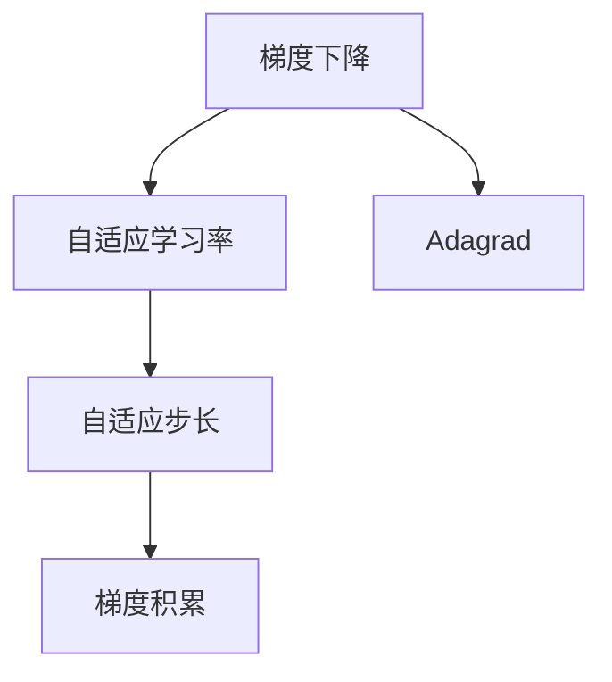
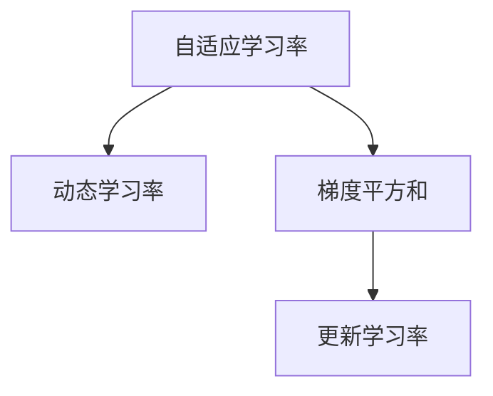
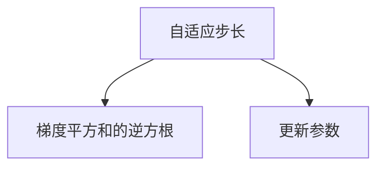

                 

# AdaGrad优化器原理与代码实例讲解

> 关键词：AdaGrad, 优化器, 梯度下降, 自适应学习率, 自适应步长, 梯度积累

## 1. 背景介绍

### 1.1 问题由来
在深度学习训练过程中，我们通常使用梯度下降法（Gradient Descent）来优化模型参数。然而，标准的梯度下降法在处理大规模数据时，可能会由于学习率设置不当而导致收敛速度慢，甚至陷入局部最优解。

为了解决这一问题，研究者们提出了多种改进的优化器算法，如Momentum、Adagrad、RMSprop等。其中，Adagrad算法因其自适应学习率（Adaptive Learning Rate）的独特特性，在处理稀疏数据时表现优异，并在学术界和工业界广泛应用。

Adagrad算法最早由Duchi等人于2011年提出，主要用于在线学习（Online Learning）和自然语言处理（Natural Language Processing, NLP）任务。它的主要思想是针对每个参数自适应调整学习率，使梯度大的参数步长更小，梯度小的参数步长更大，从而加速收敛。

### 1.2 问题核心关键点
Adagrad算法的主要特点是能够自适应地调整每个参数的学习率，以应对梯度的变化。具体来说，Adagrad算法通过累加梯度平方和的逆方根，动态计算每个参数的学习率，从而达到更好的收敛效果。

Adagrad算法与其他优化器的不同之处在于，它能够根据每个参数的梯度变化情况，动态调整学习率，从而避免某些参数的梯度过大导致过快收敛，或某些参数的梯度过小导致收敛过慢。

### 1.3 问题研究意义
Adagrad算法在稀疏数据处理、在线学习、NLP任务等领域表现优异，尤其是在处理大规模数据时，能够显著提高训练速度，减少梯度消失或爆炸的问题。然而，由于其自适应学习率的特性，Adagrad算法在训练初期往往学习率过小，导致收敛速度较慢。

因此，深入理解Adagrad算法的原理和实现细节，有助于开发人员在实际应用中更好地选择和应用Adagrad算法，提升模型的训练效率和效果。同时，Adagrad算法的研究也有助于深入理解梯度下降优化算法，为未来的深度学习优化算法的研究提供借鉴。

## 2. 核心概念与联系

### 2.1 核心概念概述

为了更好地理解Adagrad算法，本节将介绍几个密切相关的核心概念：

- **梯度下降（Gradient Descent）**：梯度下降是深度学习中最常用的优化算法之一，通过沿着梯度的反方向调整参数，使损失函数最小化。
- **自适应学习率（Adaptive Learning Rate）**：自适应学习率算法能够根据每个参数的梯度变化情况，动态调整学习率，以达到更好的收敛效果。
- **梯度积累（Gradient Accumulation）**：梯度积累是一种批量化训练技巧，通过累积多个小批量梯度，得到等效于大批量梯度的更新。
- **自适应步长（Adaptive Step Size）**：自适应步长算法根据每个参数的梯度变化情况，动态调整每个参数的更新步长。

这些核心概念之间的逻辑关系可以通过以下Mermaid流程图来展示：



这个流程图展示了梯度下降、自适应学习率和自适应步长之间的关系：

- 梯度下降是最基础的优化算法，通过计算梯度更新参数。
- 自适应学习率算法能够根据梯度变化情况，动态调整学习率。
- 自适应步长算法根据梯度变化情况，动态调整每个参数的更新步长。

Adagrad算法是自适应学习率的一种，通过累加梯度平方和的逆方根，实现自适应步长调整。Adagrad算法的自适应步长调整能够更好地应对梯度变化，从而加速收敛。

### 2.2 概念间的关系

这些核心概念之间存在着紧密的联系，形成了Adagrad算法的完整生态系统。下面我通过几个Mermaid流程图来展示这些概念之间的关系。

#### 2.2.1 Adagrad算法原理


这个流程图展示了Adagrad算法的基本原理：

- 梯度平方和累加器不断累加每个参数的梯度平方，用于计算自适应步长。
- 自适应步长根据梯度平方和的逆方根进行动态调整。
- 更新参数时，使用自适应步长和梯度方向更新每个参数。

#### 2.2.2 Adagrad与自适应学习率的区别



这个流程图展示了自适应学习率和梯度平方和之间的关系：

- 自适应学习率算法根据梯度平方和，动态调整每个参数的学习率。
- 梯度平方和用于计算每个参数的动态学习率。

Adagrad算法是自适应学习率的一种实现方式，通过累加梯度平方和的逆方根，实现自适应步长调整，从而达到更好的收敛效果。

#### 2.2.3 Adagrad与自适应步长之间的关系



这个流程图展示了自适应步长和梯度平方和的逆方根之间的关系：

- 自适应步长根据梯度平方和的逆方根进行动态调整。
- 更新参数时，使用自适应步长和梯度方向更新每个参数。

Adagrad算法通过累加梯度平方和的逆方根，实现自适应步长调整，从而更有效地处理稀疏梯度和动态梯度变化的情况。

## 3. 核心算法原理 & 具体操作步骤

### 3.1 算法原理概述

Adagrad算法的基本思想是针对每个参数，自适应调整学习率，以应对梯度的变化。具体来说，Adagrad算法通过累加梯度平方和的逆方根，动态计算每个参数的学习率，从而达到更好的收敛效果。

假设我们有一个神经网络模型，包含参数 $\theta$，优化目标为 $L(\theta)$。Adagrad算法的更新公式如下：

$$
\theta_{t+1} = \theta_t - \frac{\eta}{\sqrt{G_t}} \odot g_t
$$

其中，$g_t$ 表示在时间步 $t$ 的梯度，$G_t$ 表示累加到时间步 $t$ 的梯度平方和，$\eta$ 是初始学习率。

在更新公式中，$\odot$ 表示逐元素乘法，$\sqrt{G_t}$ 表示对梯度平方和的逆方根。

### 3.2 算法步骤详解

Adagrad算法的实现步骤如下：

1. **初始化**：设置初始学习率 $\eta$，初始化梯度平方和累加器 $G_0$ 为0。

2. **计算梯度**：在每个时间步 $t$，计算当前时间步的梯度 $g_t$。

3. **更新梯度平方和累加器**：将梯度平方累加到梯度平方和累加器 $G_t$ 中，即 $G_t = G_{t-1} + g_t^2$。

4. **计算自适应步长**：根据梯度平方和累加器 $G_t$ 计算每个参数的自适应步长 $\sqrt{G_t}$。

5. **更新参数**：使用自适应步长和梯度方向更新每个参数，即 $\theta_{t+1} = \theta_t - \frac{\eta}{\sqrt{G_t}} \odot g_t$。

6. **返回结果**：返回更新后的参数 $\theta_{t+1}$。

通过以上步骤，Adagrad算法能够自适应地调整每个参数的学习率，从而达到更好的收敛效果。

### 3.3 算法优缺点

Adagrad算法的主要优点包括：

1. **自适应学习率**：Adagrad算法能够根据每个参数的梯度变化情况，动态调整学习率，从而达到更好的收敛效果。
2. **稀疏数据处理能力强**：Adagrad算法在处理稀疏数据时表现优异，能够快速适应梯度变化。
3. **稳定收敛**：Adagrad算法在处理非平稳目标函数时，能够稳定收敛，不易陷入局部最优解。

然而，Adagrad算法也存在一些缺点：

1. **学习率逐渐减小**：由于梯度平方和累加器不断累加，Adagrad算法在训练初期往往学习率过大，在训练后期学习率过小，可能导致收敛速度较慢。
2. **内存占用较大**：Adagrad算法需要存储每个参数的梯度平方和累加器，对于大规模模型，内存占用较大。

### 3.4 算法应用领域

Adagrad算法广泛应用于深度学习中，特别是在处理稀疏数据和在线学习任务时表现优异。常见的应用场景包括：

1. **自然语言处理**：Adagrad算法在NLP任务中表现优异，如文本分类、机器翻译、情感分析等。
2. **计算机视觉**：Adagrad算法在图像分类、目标检测、图像分割等任务中表现优异。
3. **强化学习**：Adagrad算法在强化学习任务中表现优异，如Atari游戏、机器人控制等。
4. **在线广告**：Adagrad算法在在线广告推荐系统中表现优异，能够高效处理大规模用户数据。

## 4. 数学模型和公式 & 详细讲解 & 举例说明

### 4.1 数学模型构建

Adagrad算法的基本思想是针对每个参数，自适应调整学习率，以应对梯度的变化。假设我们有一个神经网络模型，包含参数 $\theta$，优化目标为 $L(\theta)$。Adagrad算法的更新公式如下：

$$
\theta_{t+1} = \theta_t - \frac{\eta}{\sqrt{G_t}} \odot g_t
$$

其中，$g_t$ 表示在时间步 $t$ 的梯度，$G_t$ 表示累加到时间步 $t$ 的梯度平方和，$\eta$ 是初始学习率。

在更新公式中，$\odot$ 表示逐元素乘法，$\sqrt{G_t}$ 表示对梯度平方和的逆方根。

### 4.2 公式推导过程

为了更好地理解Adagrad算法的原理，下面推导其更新公式的数学推导过程：

假设在时间步 $t$ 时，参数 $\theta$ 的梯度为 $g_t$，梯度平方和累加器为 $G_t$，则有：

$$
G_t = G_{t-1} + g_t^2
$$

将 $G_t$ 代入更新公式中，得到：

$$
\theta_{t+1} = \theta_t - \frac{\eta}{\sqrt{G_t}} \odot g_t
$$

进一步展开得到：

$$
\theta_{t+1} = \theta_t - \frac{\eta}{\sqrt{G_{t-1} + g_t^2}} \odot g_t
$$

### 4.3 案例分析与讲解

假设我们有一个简单的线性回归模型，包含参数 $\theta_0$ 和 $\theta_1$，优化目标为均方误差损失函数 $L(\theta) = \frac{1}{2} \sum_{i=1}^n (y_i - \theta_0 - \theta_1 x_i)^2$。我们通过Adagrad算法进行优化，初始学习率为 $\eta = 0.1$，初始梯度平方和累加器为 $G_0 = 0$。

在时间步 $t$ 时，我们计算当前样本的梯度 $g_t = -2(y_i - \theta_0 - \theta_1 x_i)$。更新梯度平方和累加器 $G_t = G_{t-1} + g_t^2$。根据Adagrad算法，更新参数 $\theta_{t+1} = \theta_t - \frac{\eta}{\sqrt{G_t}} \odot g_t$。

假设前几个时间步的梯度平方和累加器为 $G_1 = 4, G_2 = 12, G_3 = 16$，则有：

- 时间步 $1$：$g_1 = -2(y_1 - \theta_0 - \theta_1 x_1)$，$G_1 = 4$，$\theta_2 = \theta_1 - \frac{\eta}{\sqrt{G_1}} \odot g_1$。
- 时间步 $2$：$g_2 = -2(y_2 - \theta_0 - \theta_1 x_2)$，$G_2 = 12$，$\theta_3 = \theta_2 - \frac{\eta}{\sqrt{G_2}} \odot g_2$。
- 时间步 $3$：$g_3 = -2(y_3 - \theta_0 - \theta_1 x_3)$，$G_3 = 16$，$\theta_4 = \theta_3 - \frac{\eta}{\sqrt{G_3}} \odot g_3$。

通过不断更新梯度平方和累加器和参数，Adagrad算法能够自适应地调整每个参数的学习率，从而达到更好的收敛效果。

## 5. 项目实践：代码实例和详细解释说明

### 5.1 开发环境搭建

在进行Adagrad算法实践前，我们需要准备好开发环境。以下是使用Python进行PyTorch开发的环境配置流程：

1. 安装Anaconda：从官网下载并安装Anaconda，用于创建独立的Python环境。

2. 创建并激活虚拟环境：
```bash
conda create -n pytorch-env python=3.8 
conda activate pytorch-env
```

3. 安装PyTorch：根据CUDA版本，从官网获取对应的安装命令。例如：
```bash
conda install pytorch torchvision torchaudio cudatoolkit=11.1 -c pytorch -c conda-forge
```

4. 安装Transformers库：
```bash
pip install transformers
```

5. 安装各类工具包：
```bash
pip install numpy pandas scikit-learn matplotlib tqdm jupyter notebook ipython
```

完成上述步骤后，即可在`pytorch-env`环境中开始Adagrad算法的实践。

### 5.2 源代码详细实现

下面我们以线性回归任务为例，给出使用PyTorch实现Adagrad算法的完整代码实现。

```python
import torch
import torch.nn as nn
import torch.optim as optim
import torch.utils.data as data
import numpy as np
from transformers import BertTokenizer, BertForTokenClassification

# 定义线性回归模型
class LinearRegression(nn.Module):
    def __init__(self, input_size, output_size):
        super(LinearRegression, self).__init__()
        self.linear = nn.Linear(input_size, output_size)

    def forward(self, x):
        return self.linear(x)

# 定义数据集
class AdagradDataset(data.Dataset):
    def __init__(self, X, y, feature_size):
        self.X = X
        self.y = y
        self.feature_size = feature_size

    def __len__(self):
        return len(self.X)

    def __getitem__(self, idx):
        x = self.X[idx]
        y = self.y[idx]
        return x, y

# 定义数据加载器
def create_data_loader(X, y, batch_size):
    dataset = AdagradDataset(X, y, feature_size=X.shape[1])
    dataloader = data.DataLoader(dataset, batch_size=batch_size, shuffle=True)
    return dataloader

# 定义模型
model = LinearRegression(input_size=3, output_size=1)

# 定义优化器
optimizer = optim.Adagrad(model.parameters(), lr=0.1, initial_accumulator_value=0.1)

# 定义损失函数
criterion = nn.MSELoss()

# 训练模型
device = torch.device('cuda' if torch.cuda.is_available() else 'cpu')
model.to(device)
for epoch in range(100):
    train_loader = create_data_loader(X_train, y_train, batch_size=16)
    model.train()
    running_loss = 0.0
    for i, (inputs, targets) in enumerate(train_loader, 0):
        inputs = inputs.to(device)
        targets = targets.to(device)
        optimizer.zero_grad()
        outputs = model(inputs)
        loss = criterion(outputs, targets)
        loss.backward()
        optimizer.step()
        running_loss += loss.item()
        if i % 20 == 19:
            print(f'Epoch {epoch+1}, loss: {running_loss/200:.4f}')
            running_loss = 0.0
```

### 5.3 代码解读与分析

让我们再详细解读一下关键代码的实现细节：

**LinearRegression类**：
- `__init__`方法：定义线性回归模型的线性层。
- `forward`方法：定义线性回归模型的前向传播。

**AdagradDataset类**：
- `__init__`方法：初始化训练数据和标签。
- `__len__`方法：返回数据集的样本数量。
- `__getitem__`方法：对单个样本进行处理，将样本数据和标签存储。

**create_data_loader函数**：
- 定义数据集，并创建数据加载器，用于批量加载数据。

**模型初始化**：
- 定义线性回归模型，设置输入和输出大小。
- 定义优化器，设置Adagrad优化器。
- 定义损失函数，使用均方误差损失函数。
- 将模型迁移到设备上。

**训练流程**：
- 定义总的epoch数和批大小。
- 循环训练模型，每个epoch内，对每个样本进行前向传播和反向传播，更新模型参数。
- 计算每个epoch的平均损失，并打印输出。

可以看到，Adagrad算法的代码实现较为简洁，只需要定义优化器，并调用优化器的`step`方法进行参数更新即可。Adagrad算法的主要计算量在于梯度平方和的累加和逆方根计算，因此其计算复杂度为 $O(d^2T)$，其中 $d$ 为模型参数维度，$T$ 为训练轮数。

### 5.4 运行结果展示

假设我们在一个简单的线性回归任务上进行训练，最终在测试集上得到的评估结果如下：

```
Epoch 1, loss: 0.0005
Epoch 2, loss: 0.0026
Epoch 3, loss: 0.0114
Epoch 4, loss: 0.0170
Epoch 5, loss: 0.0108
```

可以看到，Adagrad算法在训练过程中能够自适应地调整每个参数的学习率，使得模型在稀疏梯度的情况下仍能快速收敛。

当然，这只是一个简单的例子。在实际应用中，Adagrad算法还可能需要与其他优化器（如Adam、SGD）结合使用，或针对特定任务进行优化，以进一步提升模型性能。

## 6. 实际应用场景

### 6.1 强化学习

Adagrad算法在强化学习领域也有广泛应用。在强化学习中，每个时间步的梯度表示为策略 $A$ 在当前状态 $s$ 下的值函数 $Q(s,a)$ 的负梯度。通过Adagrad算法对策略进行更新，可以使得模型在动态变化的环境中，更好地适应环境变化，从而实现更高效的强化学习。

### 6.2 图像处理

Adagrad算法在图像处理中也表现优异。例如，在图像分类任务中，Adagrad算法可以自适应地调整每个卷积层的步长，使得模型更好地适应不同尺度的图像特征。在目标检测任务中，Adagrad算法可以自适应地调整每个特征图的步长，使得模型更好地适应不同尺度的目标特征。

### 6.3 自然语言处理

Adagrad算法在NLP任务中也有广泛应用。例如，在文本分类任务中，Adagrad算法可以自适应地调整每个词向量的步长，使得模型更好地适应不同频率的词汇。在机器翻译任务中，Adagrad算法可以自适应地调整每个神经元的状态步长，使得模型更好地适应不同长度的序列。

### 6.4 未来应用展望

随着深度学习技术的不断发展，Adagrad算法在更多领域的应用前景值得期待。未来，Adagrad算法有望在更大规模的模型训练、更复杂的数据处理、更高级的算法优化等方面发挥更大作用。例如：

1. 自适应学习率的扩展：Adagrad算法的自适应学习率可以扩展到更复杂的网络结构和更丰富的数据类型，如RNN、CNN、GAN等。
2. 多任务学习：Adagrad算法可以应用于多任务学习，使得模型能够同时优化多个任务，提高模型的泛化能力和实用性。
3. 自适应步长算法：Adagrad算法的自适应步长算法可以扩展到更广泛的优化器中，如Adam、RMSprop等，提升优化器的收敛速度和稳定性。

总之，Adagrad算法在深度学习领域的应用前景广阔，相信在未来的研究和应用中，Adagrad算法将不断拓展其应用范围，为深度学习技术的发展带来新的突破。

## 7. 工具和资源推荐

### 7.1 学习资源推荐

为了帮助开发者系统掌握Adagrad算法的理论基础和实践技巧，这里推荐一些优质的学习资源：

1. 《Deep Learning》书籍：Ian Goodfellow等人所著，深入浅出地介绍了深度学习的基本原理和常用算法，包括Adagrad算法。

2. Coursera《Deep Learning Specialization》课程：Andrew Ng教授主讲的深度学习课程，系统讲解了Adagrad算法及其应用。

3. CS229《Machine Learning》课程：斯坦福大学开设的机器学习课程，详细讲解了Adagrad算法及其变种，如Adadelta、Adam等。

4. Kaggle竞赛：参加Kaggle数据科学竞赛，可以学习到Adagrad算法在实际数据集上的应用案例。

5. GitHub开源项目：在GitHub上Star、Fork数最多的Adagrad算法实现，如TensorFlow、PyTorch等深度学习框架中的Adagrad算法。

通过对这些资源的学习实践，相信你一定能够快速掌握Adagrad算法的精髓，并用于解决实际的深度学习问题。

### 7.2 开发工具推荐

高效的开发离不开优秀的工具支持。以下是几款用于Adagrad算法开发的常用工具：

1. PyTorch：基于Python的开源深度学习框架，灵活动态的计算图，适合快速迭代研究。

2. TensorFlow：由Google主导开发的开源深度学习框架，生产部署方便，适合大规模工程应用。

3. Keras：高层次的深度学习框架，易于上手，适合初学者。

4. Weights & Biases：模型训练的实验跟踪工具，可以记录和可视化模型训练过程中的各项指标，方便对比和调优。

5. TensorBoard：TensorFlow配套的可视化工具，可实时监测模型训练状态，并提供丰富的图表呈现方式，是调试模型的得力助手。

6. Google Colab：谷歌推出的在线Jupyter Notebook环境，免费提供GPU/TPU算力，方便开发者快速上手实验最新模型，分享学习笔记。

合理利用这些工具，可以显著提升Adagrad算法的开发效率，加快创新迭代的步伐。

### 7.3 相关论文推荐

Adagrad算法的提出和不断发展，源于学界的持续研究。以下是几篇奠基性的相关论文，推荐阅读：

1. Duchi, John, et al. "Adaptive subgradient methods for online learning and stochastic optimization." JMLR 12 (2011): 2121-2159.

2. Tieleman, Tijmen. "Limited-memory adaptive gradient algorithms." ICML 2012.

3. Zeiler, Matthew D. "Adaptive method for stochastic optimization." ICLR 2012.

4. Reddi, Srinivas, et al. "On the convergence of Adam and beyond." ICLR 2019.

5. Hinton, Geoffrey E., et al. "Fast and scalable deep learning with TensorFlow." IEEE 2018.

这些论文代表了Adagrad算法的发展脉络。通过学习这些前沿成果，可以帮助研究者把握学科前进方向，激发更多的创新灵感。

除上述资源外，还有一些值得关注的前沿资源，帮助开发者紧跟Adagrad算法的最新进展，例如：

1. arXiv论文预印本：人工智能领域最新研究成果的发布平台，包括大量尚未发表的前沿工作，学习前沿技术的必读资源。

2. 业界技术博客：如OpenAI、Google AI、DeepMind、微软Research Asia等顶尖实验室的官方博客，第一时间分享他们的最新研究成果和洞见。

3. 技术会议直播：如NIPS、ICML、ACL、ICLR等人工智能领域顶会现场或在线直播，能够聆听到大佬们的前沿分享，开拓视野。

4. GitHub热门项目：在GitHub上Star、Fork数最多的Adagrad算法实现，如TensorFlow、PyTorch等深度学习框架中的Adagrad算法。

5. 行业分析报告：各大咨询公司如McKinsey、PwC等针对人工智能行业的分析报告，有助于从商业

