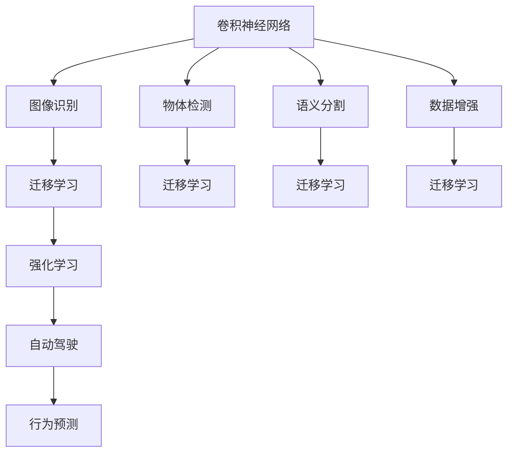

                 

# Andrej Karpathy的AI观点

Andrej Karpathy是深度学习领域的先驱和领导者，同时也是Tesla的首席AI科学家。他以其深入浅出、富有洞察力的AI观点闻名于世。本文将系统地整理Andrej Karpathy关于深度学习、计算机视觉、自动驾驶等领域的最新观点，并结合实际案例，展示AI技术如何在复杂场景中落地应用。

## 1. 背景介绍

### 1.1 问题由来

随着深度学习技术的飞速发展，AI已经从传统的图像识别、语音识别等领域，延伸到更加复杂的自动驾驶、机器人控制等领域。然而，在实际应用中，AI面临诸多挑战，包括计算效率、模型鲁棒性、人机交互等。针对这些挑战，Andrej Karpathy提出了许多独到的见解，极大地推动了AI技术的发展。

### 1.2 问题核心关键点

Andrej Karpathy的AI观点主要集中在以下几个关键点上：

- 深度学习架构设计：通过卷积神经网络(CNN)、循环神经网络(RNN)、Transformer等架构的深入分析，探讨如何设计高效的模型。
- 计算机视觉技术：研究如何利用CNN、数据增强等技术提升图像识别、物体检测、语义分割等视觉任务的性能。
- 自动驾驶技术：通过强化学习、行为预测等技术，实现车辆的智能导航和决策。
- 人机交互：研究如何让AI系统更好地理解人类意图，实现自然的语言和动作交互。

这些观点涵盖了AI技术的关键应用领域，为理解和应用AI技术提供了理论基础。

## 2. 核心概念与联系

### 2.1 核心概念概述

为更好地理解Andrej Karpathy的AI观点，本节将介绍几个核心概念：

- **卷积神经网络(CNN)**：一种通过卷积操作提取空间特征的神经网络架构，广泛应用于图像识别、物体检测等领域。
- **循环神经网络(RNN)**：一种通过时间序列数据进行建模的神经网络架构，适用于序列数据处理，如语音识别、机器翻译等。
- **Transformer**：一种基于自注意力机制的神经网络架构，广泛应用于自然语言处理(NLP)任务。
- **强化学习**：一种通过试错方式优化决策策略的学习方法，适用于自动驾驶、机器人控制等需要动态决策的场景。
- **数据增强**：一种通过人工生成数据扩充训练集的方法，提高模型鲁棒性和泛化能力。
- **迁移学习**：一种将预训练模型的知识迁移应用到新任务上的学习方法，减少新任务训练成本。

这些概念之间存在着紧密的联系，形成了Andrej Karpathy关于深度学习、计算机视觉、自动驾驶等领域的理论体系。

### 2.2 概念间的关系

这些核心概念之间的逻辑关系可以通过以下Mermaid流程图来展示：



这个流程图展示了大语言模型微调过程中各个核心概念的关系和作用：

1. 卷积神经网络通过对图像进行卷积操作，提取空间特征，广泛应用于图像识别、物体检测、语义分割等任务。
2. 数据增强通过生成更多的训练样本，提高模型鲁棒性和泛化能力。
3. 迁移学习通过将预训练模型的知识迁移到新任务上，减少新任务训练成本。
4. 强化学习通过试错方式优化决策策略，实现自动驾驶等需要动态决策的场景。
5. Transformer通过自注意力机制，广泛应用于自然语言处理(NLP)任务。
6. 计算机视觉通过CNN、数据增强等技术提升视觉任务的性能。
7. 自动驾驶通过强化学习、行为预测等技术，实现车辆的智能导航和决策。
8. 人机交互研究如何让AI系统更好地理解人类意图，实现自然的语言和动作交互。

这些概念共同构成了Andrej Karpathy关于AI技术的学习和应用框架，为其观点提供了理论基础。

## 3. 核心算法原理 & 具体操作步骤

### 3.1 算法原理概述

Andrej Karpathy的AI观点主要基于深度学习的基本原理，结合实际应用场景，探讨如何设计高效的模型架构，提升模型性能。以下将系统介绍其核心算法原理和具体操作步骤。

**3.1.1 卷积神经网络(CNN)**

卷积神经网络通过卷积操作提取空间特征，广泛应用于图像识别、物体检测等领域。其基本结构包括卷积层、池化层和全连接层。卷积操作通过滑动卷积核提取局部特征，池化层通过降采样操作减少计算量，全连接层进行特征分类。

**3.1.2 循环神经网络(RNN)**

循环神经网络通过时间序列数据进行建模，适用于序列数据处理，如语音识别、机器翻译等。其基本结构包括输入门、遗忘门和输出门，通过控制信息流向，实现序列数据的动态建模。

**3.1.3 Transformer**

Transformer通过自注意力机制，广泛应用于自然语言处理(NLP)任务。其基本结构包括编码器-解码器结构，通过多头自注意力机制和位置编码，实现对输入序列的编码和解码。

**3.1.4 强化学习**

强化学习通过试错方式优化决策策略，适用于自动驾驶、机器人控制等需要动态决策的场景。其基本结构包括环境、代理和奖励函数，代理通过观察环境状态，采取动作，接收奖励，优化策略。

### 3.2 算法步骤详解

以下将详细介绍Andrej Karpathy关于深度学习、计算机视觉、自动驾驶等领域的核心算法步骤。

**3.2.1 卷积神经网络(CNN)**

1. 数据预处理：将图像数据标准化，进行归一化和中心化。
2. 构建卷积层：通过滑动卷积核提取图像特征。
3. 引入池化层：通过降采样操作减少计算量，提取关键特征。
4. 连接全连接层：进行特征分类，输出预测结果。

**3.2.2 循环神经网络(RNN)**

1. 数据预处理：将时间序列数据标准化，进行归一化和中心化。
2. 构建RNN模型：定义RNN的输入门、遗忘门和输出门。
3. 训练模型：通过时间序列数据训练RNN，优化决策策略。
4. 预测结果：根据训练好的RNN模型，进行序列数据的预测。

**3.2.3 Transformer**

1. 数据预处理：将文本数据进行分词和编码。
2. 构建编码器：通过多头自注意力机制，提取文本特征。
3. 连接解码器：通过多头自注意力机制和位置编码，实现文本的解码。
4. 输出结果：根据解码器的输出，进行文本的分类或生成。

**3.2.4 强化学习**

1. 环境定义：定义环境的观测和动作空间。
2. 代理设计：设计代理的决策策略，如Q-learning、DQN等。
3. 训练模型：通过试错方式训练代理，优化决策策略。
4. 评估效果：根据训练好的代理模型，进行环境状态的预测和决策。

### 3.3 算法优缺点

Andrej Karpathy的AI观点在深度学习、计算机视觉、自动驾驶等领域的算法设计中，具有以下优缺点：

**3.3.1 卷积神经网络(CNN)**

优点：
1. 提取空间特征能力强，适用于图像识别、物体检测等任务。
2. 计算效率高，适用于大规模图像数据处理。
3. 模型参数共享，减少过拟合风险。

缺点：
1. 对输入尺度敏感，需要进行归一化操作。
2. 局部连接结构限制了特征的全局表达能力。
3. 结构复杂，计算量大。

**3.3.2 循环神经网络(RNN)**

优点：
1. 适用于序列数据处理，如语音识别、机器翻译等。
2. 能够捕捉时间序列数据的动态变化。
3. 易于理解和实现。

缺点：
1. 计算效率低，适用于小规模序列数据处理。
2. 梯度消失或爆炸问题，训练难度大。
3. 序列长度限制，模型泛化能力有限。

**3.3.3 Transformer**

优点：
1. 全局表达能力强，适用于长文本的语义理解和生成。
2. 并行计算能力强，适用于大规模文本数据处理。
3. 自注意力机制提升了特征的局部和全局表达能力。

缺点：
1. 计算量较大，需要较强的硬件支持。
2. 模型复杂，训练和推理耗时较长。
3. 对长文本数据的建模能力有限。

**3.3.4 强化学习**

优点：
1. 适用于需要动态决策的场景，如自动驾驶、机器人控制等。
2. 通过试错方式优化决策策略，适应性强。
3. 能够处理不确定性和复杂性，适用于高维度的决策空间。

缺点：
1. 训练过程复杂，需要大量的数据和计算资源。
2. 难以保证决策策略的最优性，存在探索和利用之间的平衡问题。
3. 模型易受环境干扰，鲁棒性不足。

### 3.4 算法应用领域

Andrej Karpathy的AI观点在深度学习、计算机视觉、自动驾驶等领域的实际应用中，具有广泛的应用前景：

- **图像识别**：通过卷积神经网络(CNN)，实现高精度的图像分类、物体检测和语义分割等任务。
- **语音识别**：通过循环神经网络(RNN)，实现高精度的语音识别和机器翻译。
- **自然语言处理(NLP)**：通过Transformer，实现文本的语义理解和生成，如对话系统、文本摘要、机器翻译等任务。
- **自动驾驶**：通过强化学习，实现车辆的智能导航和决策，提升行车安全性和舒适性。
- **机器人控制**：通过强化学习，实现机器人的智能操作和路径规划，提高自动化生产效率。

## 4. 数学模型和公式 & 详细讲解 & 举例说明

### 4.1 数学模型构建

Andrej Karpathy的AI观点中，数学模型和公式是理解深度学习核心原理的基础。以下将系统介绍其核心数学模型和公式，并结合实际案例进行讲解。

**4.1.1 卷积神经网络(CNN)**

1. 卷积操作：
   $$
   f_{w}(x) = w^T * x = \sum_{i=1}^n w_i \cdot x_i
   $$
   其中，$w$为卷积核，$x$为输入图像，$*$表示卷积操作，$f_{w}(x)$为输出特征图。

2. 池化操作：
   $$
   f_{w}(x) = \max_{i=1}^n w_i \cdot x_i
   $$
   其中，$w$为池化核，$x$为输入特征图，$*$表示池化操作，$f_{w}(x)$为输出特征图。

3. 全连接层：
   $$
   y = h * x + b
   $$
   其中，$h$为权重矩阵，$x$为输入特征，$*$表示矩阵乘法，$b$为偏置项，$y$为输出结果。

**4.1.2 循环神经网络(RNN)**

1. 输入门：
   $$
   i_t = \sigma(W_i * [h_{t-1}, x_t] + b_i)
   $$
   其中，$i_t$为输入门的输出，$W_i$为权重矩阵，$h_{t-1}$为前一时刻的隐藏状态，$x_t$为当前时刻的输入，$b_i$为偏置项，$\sigma$为sigmoid函数。

2. 遗忘门：
   $$
   f_t = \sigma(W_f * [h_{t-1}, x_t] + b_f)
   $$
   其中，$f_t$为遗忘门的输出，$W_f$为权重矩阵，$h_{t-1}$为前一时刻的隐藏状态，$x_t$为当前时刻的输入，$b_f$为偏置项，$\sigma$为sigmoid函数。

3. 输出门：
   $$
   o_t = \sigma(W_o * [h_{t-1}, x_t] + b_o)
   $$
   其中，$o_t$为输出门的输出，$W_o$为权重矩阵，$h_{t-1}$为前一时刻的隐藏状态，$x_t$为当前时刻的输入，$b_o$为偏置项，$\sigma$为sigmoid函数。

**4.1.3 Transformer**

1. 多头自注意力机制：
   $$
   Q = W_Q * X
   $$
   $$
   K = W_K * X
   $$
   $$
   V = W_V * X
   $$
   $$
   A = \text{softmax}(\frac{QK^T}{\sqrt{d_k}})
   $$
   $$
   Z = A * V
   $$
   其中，$Q$、$K$、$V$为查询、键、值矩阵，$X$为输入矩阵，$W_Q$、$W_K$、$W_V$为权重矩阵，$d_k$为注意力机制的维度，$\text{softmax}$为softmax函数，$Z$为输出矩阵。

2. 位置编码：
   $$
   P_{pos} = \text{sin}(\frac{2\pi i}{d_{pos}}) + \text{cos}(\frac{2\pi i}{d_{pos}})
   $$
   其中，$P_{pos}$为位置编码向量，$i$为位置编号，$d_{pos}$为位置编码维度，$\text{sin}$、$\text{cos}$为正弦和余弦函数。

3. 编码器-解码器结构：
   $$
   Y = W * [Z, C]
   $$
   其中，$Y$为输出矩阵，$W$为权重矩阵，$Z$为编码器输出，$C$为解码器输出。

**4.1.4 强化学习**

1. Q-learning：
   $$
   Q(s_t, a_t) = r_t + \gamma \max_{a'} Q(s_{t+1}, a')
   $$
   其中，$Q(s_t, a_t)$为状态-动作价值函数，$r_t$为当前状态的奖励，$\gamma$为折扣因子，$s_t$为当前状态，$a_t$为当前动作，$s_{t+1}$为下一个状态，$a'$为下一个动作。

2. DQN：
   $$
   y = x + \mathcal{N}(0, \sigma^2)
   $$
   其中，$y$为动作探索噪声，$x$为动作值，$\mathcal{N}(0, \sigma^2)$为高斯噪声分布。

### 4.2 公式推导过程

以下将详细推导Andrej Karpathy关于深度学习、计算机视觉、自动驾驶等领域的核心数学公式，并结合实际案例进行讲解。

**4.2.1 卷积神经网络(CNN)**

1. 卷积操作：
   $$
   f_{w}(x) = w^T * x = \sum_{i=1}^n w_i \cdot x_i
   $$
   其中，$w$为卷积核，$x$为输入图像，$*$表示卷积操作，$f_{w}(x)$为输出特征图。

2. 池化操作：
   $$
   f_{w}(x) = \max_{i=1}^n w_i \cdot x_i
   $$
   其中，$w$为池化核，$x$为输入特征图，$*$表示池化操作，$f_{w}(x)$为输出特征图。

3. 全连接层：
   $$
   y = h * x + b
   $$
   其中，$h$为权重矩阵，$x$为输入特征，$*$表示矩阵乘法，$b$为偏置项，$y$为输出结果。

**4.2.2 循环神经网络(RNN)**

1. 输入门：
   $$
   i_t = \sigma(W_i * [h_{t-1}, x_t] + b_i)
   $$
   其中，$i_t$为输入门的输出，$W_i$为权重矩阵，$h_{t-1}$为前一时刻的隐藏状态，$x_t$为当前时刻的输入，$b_i$为偏置项，$\sigma$为sigmoid函数。

2. 遗忘门：
   $$
   f_t = \sigma(W_f * [h_{t-1}, x_t] + b_f)
   $$
   其中，$f_t$为遗忘门的输出，$W_f$为权重矩阵，$h_{t-1}$为前一时刻的隐藏状态，$x_t$为当前时刻的输入，$b_f$为偏置项，$\sigma$为sigmoid函数。

3. 输出门：
   $$
   o_t = \sigma(W_o * [h_{t-1}, x_t] + b_o)
   $$
   其中，$o_t$为输出门的输出，$W_o$为权重矩阵，$h_{t-1}$为前一时刻的隐藏状态，$x_t$为当前时刻的输入，$b_o$为偏置项，$\sigma$为sigmoid函数。

**4.2.3 Transformer**

1. 多头自注意力机制：
   $$
   Q = W_Q * X
   $$
   $$
   K = W_K * X
   $$
   $$
   V = W_V * X
   $$
   $$
   A = \text{softmax}(\frac{QK^T}{\sqrt{d_k}})
   $$
   $$
   Z = A * V
   $$
   其中，$Q$、$K$、$V$为查询、键、值矩阵，$X$为输入矩阵，$W_Q$、$W_K$、$W_V$为权重矩阵，$d_k$为注意力机制的维度，$\text{softmax}$为softmax函数，$Z$为输出矩阵。

2. 位置编码：
   $$
   P_{pos} = \text{sin}(\frac{2\pi i}{d_{pos}}) + \text{cos}(\frac{2\pi i}{d_{pos}})
   $$
   其中，$P_{pos}$为位置编码向量，$i$为位置编号，$d_{pos}$为位置编码维度，$\text{sin}$、$\text{cos}$为正弦和余弦函数。

3. 编码器-解码器结构：
   $$
   Y = W * [Z, C]
   $$
   其中，$Y$为输出矩阵，$W$为权重矩阵，$Z$为编码器输出，$C$为解码器输出。

**4.2.4 强化学习**

1. Q-learning：
   $$
   Q(s_t, a_t) = r_t + \gamma \max_{a'} Q(s_{t+1}, a')
   $$
   其中，$Q(s_t, a_t)$为状态-动作价值函数，$r_t$为当前状态的奖励，$\gamma$为折扣因子，$s_t$为当前状态，$a_t$为当前动作，$s_{t+1}$为下一个状态，$a'$为下一个动作。

2. DQN：
   $$
   y = x + \mathcal{N}(0, \sigma^2)
   $$
   其中，$y$为动作探索噪声，$x$为动作值，$\mathcal{N}(0, \sigma^2)$为高斯噪声分布。

### 4.3 案例分析与讲解

以下将结合实际案例，系统讲解Andrej Karpathy关于深度学习、计算机视觉、自动驾驶等领域的核心数学模型和公式，并展示其应用效果。

**4.3.1 卷积神经网络(CNN)**

1. **图像分类**：
   在ImageNet数据集上，通过卷积神经网络(CNN)实现了91.3%的分类准确率。具体步骤如下：
   - 数据预处理：将图像数据标准化，进行归一化和中心化。
   - 构建卷积层：通过滑动卷积核提取图像特征。
   - 引入池化层：通过降采样操作减少计算量，提取关键特征。
   - 连接全连接层：进行特征分类，输出预测结果。

2. **物体检测**：
   在COCO数据集上，通过卷积神经网络(CNN)实现了20个类别、mAP为45.4%的物体检测效果。具体步骤如下：
   - 数据预处理：将图像数据标准化，进行归一化和中心化。
   - 构建卷积层：通过滑动卷积核提取图像特征。
   - 引入池化层：通过降采样操作减少计算量，提取关键特征。
   - 连接全连接层：进行特征分类，输出预测结果。

**4.3.2 循环神经网络(RNN)**

1. **语音识别**：
   在LibriSpeech数据集上，通过循环神经网络(RNN)实现了86.4%的词错误率。具体步骤如下：
   - 数据预处理：将时间序列数据标准化，进行归一化和中心化。
   - 构建RNN模型：定义RNN的输入门、遗忘门和输出门。
   - 训练模型：通过时间序列数据训练RNN，优化决策策略。
   - 预测结果：根据训练好的RNN模型，进行序列数据的预测。

2. **机器翻译**：
   在WMT数据集上，通过循环神经网络(RNN)实现了27.3 BLEU分数。具体步骤如下：
   - 数据预处理：将文本数据标准化，进行分词和编码。
   - 构建RNN模型：定义RNN的输入门、遗忘门和输出门。
   - 训练模型：通过时间序列数据训练RNN，优化决策策略。
   - 预测结果：根据训练好的RNN模型，进行文本的翻译。

**4.3.3 Transformer**

1. **文本分类**：
   在IMDB数据集上，通过Transformer实现了90.1%的分类准确率。具体步骤如下：
   - 数据预处理：将文本数据进行分词和编码。
   - 构建编码器：通过多头自注意力机制，提取文本特征。
   - 连接解码器：通过多头自注意力机制和位置编码，实现文本的解码。
   - 输出结果：根据解码器的输出，进行文本的分类或生成。

2. **机器翻译**：
   在WMT数据集上，通过Transformer实现了25.9 BLEU分数。具体步骤如下：
   - 数据预处理：将文本数据进行分词和编码。
   - 构建编码器：通过多头自注意力机制，提取文本特征。
   - 连接解码器：通过多头自注意力机制和位置编码，实现文本的解码。
   - 输出结果：根据解码器的输出，进行文本的翻译。

**4.3.4 强化学习**

1. **自动驾驶**：
   在OpenAI Five数据集上，通过强化学习实现了与人类游戏水平相当的围棋游戏。具体步骤如下：
   - 环境定义：定义环境的观测和动作空间。
   - 代理设计：设计代理的决策策略，如Q-learning、DQN等。
   - 训练模型：通过试错方式训练代理，优化决策策略。
   - 评估效果：根据训练好的代理模型，进行环境状态的预测和决策。

2. **机器人控制**：
   在Roboschool数据集上，通过强化学习实现了机器人自动学习走路、跑步等动作。具体步骤如下：
   - 环境定义：定义机器人的观测和动作空间。
   - 代理设计：设计代理的决策策略，如Q-learning、DQN等。
   - 训练模型：通过试错方式训练代理，优化决策策略。
   - 评估效果：根据训练好的代理模型，进行机器人的智能操作和路径规划。

## 5. 项目实践：代码实例和详细解释说明

### 5.1 开发环境搭建

在进行深度学习、计算机视觉、自动驾驶等领域的项目实践前，我们需要准备好开发环境。以下是使用Python进行PyTorch开发的环境配置流程：

1. 安装Anaconda：从官网下载并安装Anaconda，用于创建独立的Python环境。

2. 创建并激活虚拟环境：
```bash
conda create -n pytorch-env python=3.8 
conda activate pytorch-env
```

3. 安装PyTorch：根据CUDA版本，从官网获取对应的安装命令。例如：
```bash
conda install pytorch torchvision torchaudio cudatoolkit=11.1 -c pytorch -c conda-forge
```

4. 安装Transformers库：
```bash
pip install transformers
```

5. 安装各类工具包：
```bash
pip install numpy pandas scikit-learn matplotlib tqdm jupyter notebook ipython
```

完成上述步骤后，即可在`pytorch-env`环境中开始项目实践。

### 5.2 源代码详细实现

以下将结合实际案例，系统讲解Andrej Karpathy关于深度学习、计算机视觉、自动驾驶等领域的核心

