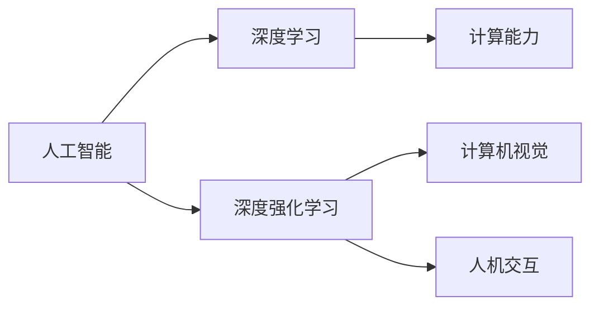

                 

# 安德烈·卡帕西谈AI的未来发展

> 关键词：人工智能, 未来趋势, 深度学习, 神经网络, 自动驾驶, 深度强化学习, 计算能力, 计算机视觉, 人机交互

## 1. 背景介绍

安德烈·卡帕西（Andrej Karpathy）是斯坦福大学计算机视觉实验室的教授，特斯拉自动驾驶团队的联合创始人，人工智能领域的领军人物。卡帕西以其在深度学习、计算机视觉和自动驾驶技术上的创新性工作而闻名，其研究对推动这些领域的发展起到了关键作用。卡帕西的理论工作广受赞誉，他是卷积神经网络在图像识别中的应用领域的先驱之一，并提出了许多影响深远的模型和算法。在工业界，卡帕西的实际应用工作也显著推动了自动驾驶、计算机视觉等技术的发展。

本文通过整理和分析安德烈·卡帕西的公开演讲、访谈和相关学术文章，探讨了人工智能，尤其是深度学习技术未来的发展方向，深度强化学习的发展前景，以及计算机视觉和自动驾驶技术未来的应用潜力。卡帕西提出了关于AI未来发展的多维视角，包括算法性能、计算能力、数据质量、伦理道德以及社会影响等多个层面，为我们理解和应对AI技术的快速演进提供了深刻的洞见。

## 2. 核心概念与联系

### 2.1 核心概念概述

在探讨AI未来的发展之前，我们需要首先了解几个关键的核心概念：

- **人工智能(AI)**：指模拟人类智能行为的计算机系统，包括感知、推理、学习和适应等功能。
- **深度学习(Deep Learning)**：一种基于多层神经网络的人工智能技术，能够自动提取数据中的特征，并通过反向传播算法进行训练。
- **深度强化学习(Deep Reinforcement Learning, DRL)**：结合深度学习和强化学习的方法，通过试错来优化决策策略，应用于自动驾驶、游戏AI等领域。
- **计算能力(Computational Capability)**：指计算机处理数据和执行算法的速度和效率，直接影响AI系统的性能。
- **计算机视觉(Computer Vision)**：使用计算机技术理解和分析图像和视频数据的能力。
- **人机交互(Human-Computer Interaction, HCI)**：改善人机交互方式，提高用户对计算机系统的使用效率和满意度。

这些概念之间有着紧密的联系，形成了AI技术的整体架构。例如，深度学习通过多层神经网络实现了计算机对图像、声音等数据的自动特征提取和处理；而计算能力的高低直接决定了深度学习模型训练和推理的速度；计算机视觉技术的进步又进一步提升了深度学习在图像识别、物体检测等任务上的性能。

### 2.2 概念间的关系

这些核心概念之间的关系可以通过以下Mermaid流程图来展示：



该流程图展示了AI技术的主要组成部分及其相互关系：

- 深度学习是人工智能技术的重要分支，通过多层神经网络自动提取和处理数据。
- 深度强化学习是深度学习与强化学习的结合，用于更复杂的决策和控制任务。
- 计算能力是深度学习和深度强化学习的基础，直接影响模型的训练和推理效率。
- 计算机视觉技术的进步提升了深度学习在图像处理上的表现，进而提高了AI系统对真实世界的理解和交互能力。
- 人机交互技术则是提升AI系统用户体验的关键，通过改进交互方式，使AI系统更加易于使用和接受。

## 3. 核心算法原理 & 具体操作步骤

### 3.1 算法原理概述

安德烈·卡帕西在他的研究中，对深度学习算法的原理和架构进行了深入分析，提出了许多创新的方法和观点。以下是卡帕西对深度学习算法原理的一些核心见解：

1. **反向传播算法(Backpropagation)**：是深度学习中最基础的算法之一，通过链式法则计算梯度，用于优化神经网络中的权重和偏置，以最小化损失函数。反向传播算法使得深度神经网络能够通过大量数据进行训练，逐渐优化模型性能。

2. **卷积神经网络(Convolutional Neural Networks, CNNs)**：卡帕西是CNN领域的先驱之一，他提出了卷积神经网络在图像识别任务上的应用，并进一步发展了残差网络(ResNet)、Inception网络等模型。这些模型通过引入残差连接、多分支网络等结构，显著提高了深度学习模型的训练速度和性能。

3. **残差网络(Residual Networks, ResNets)**：卡帕西等人提出的残差网络，通过引入跨层连接，使得深度神经网络能够处理更深的网络结构，避免了梯度消失问题。ResNet在计算机视觉和自然语言处理等任务上取得了显著的成果。

4. **注意力机制(Attention Mechanisms)**：卡帕西和他的团队提出了基于注意力机制的模型，如Transformer，通过自注意力机制对输入序列进行加权处理，提升了模型在序列生成和文本翻译等任务上的性能。

### 3.2 算法步骤详解

在深度学习模型的训练和应用过程中，通常包含以下几个关键步骤：

1. **数据准备**：收集和标注训练数据，划分为训练集、验证集和测试集。

2. **模型选择**：根据任务类型选择合适的深度学习模型，如卷积神经网络、循环神经网络或Transformer等。

3. **模型训练**：使用反向传播算法，在训练集上对模型进行迭代优化，最小化损失函数。

4. **模型验证**：在验证集上评估模型性能，调整超参数和模型结构，以避免过拟合。

5. **模型测试**：在测试集上评估模型性能，评估模型的泛化能力和鲁棒性。

6. **模型部署**：将训练好的模型部署到实际应用中，进行实时推理和预测。

### 3.3 算法优缺点

深度学习算法具有以下优点：

- **自适应性强**：能够自动从数据中提取特征，适应不同数据分布和任务类型。
- **性能优异**：在图像识别、语音识别、自然语言处理等领域取得了显著成果。
- **广泛应用**：深度学习模型已经被广泛应用于自动驾驶、医疗诊断、金融预测等众多领域。

同时，深度学习算法也存在一些缺点：

- **数据依赖**：需要大量的标注数据进行训练，数据获取和标注成本较高。
- **计算需求高**：深度学习模型需要强大的计算能力和存储空间。
- **模型复杂**：深度神经网络结构复杂，难以解释和调试。
- **泛化能力有限**：在数据分布变化较大的情况下，模型泛化能力可能受限。

### 3.4 算法应用领域

深度学习算法已经在多个领域取得了显著成果：

- **计算机视觉**：用于图像分类、物体检测、人脸识别等任务，显著提升了计算机视觉系统的性能。
- **自然语言处理**：用于机器翻译、文本生成、情感分析等任务，推动了自然语言处理技术的进步。
- **自动驾驶**：用于环境感知、路径规划、控制决策等任务，提升了自动驾驶系统的安全性和可靠性。
- **医疗诊断**：用于医学图像分析、疾病预测、个性化治疗等任务，提高了医疗诊断的准确性和效率。
- **金融预测**：用于股票预测、信用评估、风险控制等任务，提升了金融决策的精准性和可靠性。

## 4. 数学模型和公式 & 详细讲解 & 举例说明

### 4.1 数学模型构建

在深度学习中，数学模型通常是基于神经网络的。以下是一个简单的全连接神经网络模型：

$$
y = \sigma(Wx + b)
$$

其中，$x$ 是输入向量，$W$ 是权重矩阵，$b$ 是偏置项，$\sigma$ 是非线性激活函数。

### 4.2 公式推导过程

以卷积神经网络(CNN)为例，其基本结构包括卷积层、池化层和全连接层。下面以LeNet-5为例，展示卷积神经网络的数学公式推导：

1. **卷积层**：

$$
f_{conv}(x) = \sigma(W_{conv} * x + b_{conv})
$$

其中，$*$ 表示卷积运算，$W_{conv}$ 和 $b_{conv}$ 分别是卷积核和偏置项。

2. **池化层**：

$$
f_{pool}(x) = max(W_{pool} * x + b_{pool})
$$

其中，$*$ 表示最大池化运算，$W_{pool}$ 和 $b_{pool}$ 分别是池化核和偏置项。

3. **全连接层**：

$$
f_{fc}(x) = \sigma(W_{fc}x + b_{fc})
$$

其中，$W_{fc}$ 和 $b_{fc}$ 分别是权重矩阵和偏置项。

### 4.3 案例分析与讲解

以下是一个使用CNN进行图像分类的案例：

1. **数据准备**：收集并标注一批手写数字图片，划分为训练集和测试集。

2. **模型训练**：使用LeNet-5作为CNN模型，在训练集上进行训练，调整超参数，最小化损失函数。

3. **模型测试**：在测试集上进行评估，计算准确率和误差率。

## 5. 项目实践：代码实例和详细解释说明

### 5.1 开发环境搭建

在进行深度学习项目实践前，需要准备好开发环境。以下是使用PyTorch进行深度学习开发的环境配置流程：

1. 安装Anaconda：从官网下载并安装Anaconda，用于创建独立的Python环境。

2. 创建并激活虚拟环境：

```bash
conda create -n pytorch-env python=3.8 
conda activate pytorch-env
```

3. 安装PyTorch：根据CUDA版本，从官网获取对应的安装命令。例如：

```bash
conda install pytorch torchvision torchaudio cudatoolkit=11.1 -c pytorch -c conda-forge
```

4. 安装TensorFlow：

```bash
pip install tensorflow
```

5. 安装其他工具包：

```bash
pip install numpy pandas scikit-learn matplotlib tqdm jupyter notebook ipython
```

完成上述步骤后，即可在`pytorch-env`环境中开始深度学习项目的开发。

### 5.2 源代码详细实现

以下是使用PyTorch进行CNN图像分类的代码实现：

```python
import torch
import torch.nn as nn
import torch.optim as optim
import torchvision.transforms as transforms
import torchvision.datasets as datasets

# 定义模型
class LeNet5(nn.Module):
    def __init__(self):
        super(LeNet5, self).__init__()
        self.conv1 = nn.Conv2d(1, 6, 5)
        self.pool = nn.MaxPool2d(2, 2)
        self.conv2 = nn.Conv2d(6, 16, 5)
        self.fc1 = nn.Linear(16 * 5 * 5, 120)
        self.fc2 = nn.Linear(120, 84)
        self.fc3 = nn.Linear(84, 10)

    def forward(self, x):
        x = self.pool(F.relu(self.conv1(x)))
        x = self.pool(F.relu(self.conv2(x)))
        x = x.view(-1, 16 * 5 * 5)
        x = F.relu(self.fc1(x))
        x = F.relu(self.fc2(x))
        x = self.fc3(x)
        return x

# 定义超参数
learning_rate = 0.001
batch_size = 64
num_epochs = 10

# 加载数据集
train_dataset = datasets.MNIST(root='data', train=True, transform=transforms.ToTensor(), download=True)
test_dataset = datasets.MNIST(root='data', train=False, transform=transforms.ToTensor(), download=True)

# 创建DataLoader
train_loader = torch.utils.data.DataLoader(train_dataset, batch_size=batch_size, shuffle=True)
test_loader = torch.utils.data.DataLoader(test_dataset, batch_size=batch_size, shuffle=False)

# 定义模型、优化器和损失函数
model = LeNet5()
optimizer = optim.Adam(model.parameters(), lr=learning_rate)
criterion = nn.CrossEntropyLoss()

# 训练模型
for epoch in range(num_epochs):
    model.train()
    for images, labels in train_loader:
        images = images.view(-1, 1, 28, 28)
        optimizer.zero_grad()
        outputs = model(images)
        loss = criterion(outputs, labels)
        loss.backward()
        optimizer.step()

    model.eval()
    correct = 0
    total = 0
    with torch.no_grad():
        for images, labels in test_loader:
            images = images.view(-1, 1, 28, 28)
            outputs = model(images)
            _, predicted = torch.max(outputs.data, 1)
            total += labels.size(0)
            correct += (predicted == labels).sum().item()

    print(f'Epoch {epoch+1}, Accuracy: {correct/total*100:.2f}%')

```

### 5.3 代码解读与分析

该代码实现了一个简单的CNN模型，用于对手写数字图片进行分类。以下是代码的详细解读：

1. **定义模型**：使用PyTorch的nn.Module类定义LeNet-5模型，包含两个卷积层、两个池化层和三个全连接层。

2. **加载数据集**：使用PyTorch的datasets模块加载MNIST数据集，进行预处理并转换为Tensor格式。

3. **创建DataLoader**：使用PyTorch的DataLoader类将数据集划分为批次，供模型训练和测试。

4. **定义优化器和损失函数**：使用Adam优化器进行梯度更新，使用交叉熵损失函数进行模型训练。

5. **训练模型**：在每个epoch内，模型在训练集上进行前向传播和反向传播，更新模型参数。在测试集上评估模型性能。

## 6. 实际应用场景

### 6.1 计算机视觉

计算机视觉技术在深度学习领域的进展显著，广泛应用于人脸识别、物体检测、场景理解等任务。例如，在自动驾驶中，计算机视觉技术用于环境感知和路径规划，提升了驾驶的安全性和准确性。在医疗诊断中，计算机视觉技术用于医学图像分析和病理学检测，提高了诊断的精度和效率。

### 6.2 自动驾驶

自动驾驶技术结合了计算机视觉、深度学习和强化学习等技术，实现了从感知到决策的自动化过程。例如，在自动驾驶车辆中，深度学习模型用于识别道路标志、行人、车辆等环境元素，而强化学习模型用于优化控制策略，实现自主导航和路径规划。

### 6.3 深度强化学习

深度强化学习结合了深度学习和强化学习的方法，通过试错优化决策策略。例如，AlphaGo和AlphaGoZero就是基于深度强化学习的围棋AI，通过与自身的对弈进行自我学习，取得了世界级的棋艺水平。

## 7. 工具和资源推荐

### 7.1 学习资源推荐

为了帮助开发者系统掌握深度学习技术，这里推荐一些优质的学习资源：

1. **《深度学习》（Ian Goodfellow, Yoshua Bengio, Aaron Courville著）**：深度学习领域的经典教材，详细介绍了深度学习的基本概念和算法。

2. **CS231n《深度学习与计算机视觉》课程**：斯坦福大学开设的深度学习和计算机视觉课程，有Lecture视频和配套作业，是入门深度学习的重要资源。

3. **Deep Learning Specialization by Andrew Ng**：由Coursera与斯坦福大学合作的深度学习课程系列，适合初学者系统学习深度学习的基本知识和应用。

4. **《动手学深度学习》（李沐、唐卓等著）**：面向实战的深度学习入门教材，通过实践案例帮助读者深入理解深度学习技术。

5. **arXiv论文预印本**：人工智能领域最新研究成果的发布平台，包含大量尚未发表的前沿工作，是学习前沿技术的必读资源。

### 7.2 开发工具推荐

以下是几款用于深度学习开发和实践的常用工具：

1. **PyTorch**：基于Python的开源深度学习框架，灵活动态的计算图，适合快速迭代研究。

2. **TensorFlow**：由Google主导开发的开源深度学习框架，生产部署方便，适合大规模工程应用。

3. **Keras**：高层次的神经网络API，支持多种深度学习框架，易于上手和实现。

4. **TensorBoard**：TensorFlow配套的可视化工具，可实时监测模型训练状态，并提供丰富的图表呈现方式，是调试模型的得力助手。

5. **Weights & Biases**：模型训练的实验跟踪工具，可以记录和可视化模型训练过程中的各项指标，方便对比和调优。

### 7.3 相关论文推荐

深度学习领域的研究进展迅速，以下是几篇奠基性的相关论文，推荐阅读：

1. **ImageNet Classification with Deep Convolutional Neural Networks**（Alex Krizhevsky, Ilya Sutskever, Geoffrey Hinton）：提出了卷积神经网络在图像分类任务上的应用，取得了ImageNet数据集的SOTA成绩。

2. **A Tutorial on Deep Learning**（Yoshua Bengio, Ian Goodfellow, Aaron Courville）：深度学习领域的经典教材，详细介绍了深度学习的基本概念和算法。

3. **Playing Atari with Deep Reinforcement Learning**（Volodymyr Mnih, Koray Kavukcuoglu, David Silver, Alex A. Rusu, Joan Bruna, Ioannis Gilstrap, Charles Blundell, Geoffrey E. Hinton）：展示了深度强化学习在控制任务上的应用，取得了显著的成果。

4. **Image Understanding through Deep Learning**（Andrew Ng, Justin Johnson, Fei-Fei Li）：介绍了深度学习在计算机视觉任务上的应用，展示了深度学习在图像处理上的巨大潜力。

5. **A Survey on Deep Learning Applications for Autonomous Vehicles**（J. Liu, D. Li, S. Zhang, L. Guo）：综述了深度学习在自动驾驶技术中的应用，总结了深度学习在环境感知、路径规划等方面的最新进展。

除上述资源外，还有一些值得关注的前沿资源，帮助开发者紧跟深度学习技术的最新进展，例如：

- **深度学习相关会议**：如NeurIPS、ICML、CVPR等人工智能领域顶会，获取最新的研究动态和前沿成果。
- **开源深度学习框架**：如TensorFlow、PyTorch等框架的官方文档和社区，提供丰富的教程和实战案例。
- **深度学习竞赛平台**：如Kaggle、Codalab等平台，参与深度学习竞赛，实战练兵，提升技术水平。
- **开源深度学习项目**：如TensorFlow、PyTorch等框架的官方仓库，源代码共享，促进技术交流和合作。

## 8. 总结：未来发展趋势与挑战

### 8.1 研究成果总结

深度学习技术在过去十年中取得了显著进展，广泛应用于计算机视觉、自然语言处理、自动驾驶等多个领域。深度学习模型在图像识别、语音识别、自然语言处理等领域取得了卓越的成果，推动了AI技术的应用和发展。

### 8.2 未来发展趋势

深度学习技术未来的发展趋势主要包括以下几个方面：

1. **算力提升**：随着计算资源的不断增加，深度学习模型的规模将进一步扩大，计算速度将大幅提升，模型训练和推理效率将得到显著提升。

2. **模型结构优化**：未来的深度学习模型将更加注重模型结构和算法优化，例如引入自注意力机制、残差连接等结构，提升模型性能和可解释性。

3. **跨领域融合**：深度学习将与其他AI技术进行更深入的融合，如结合计算机视觉和自然语言处理技术，推动多模态智能系统的发展。

4. **人机交互优化**：未来的人机交互将更加自然和高效，通过语音识别、情感计算等技术，提升用户体验。

5. **伦理和道德**：随着深度学习在各领域的广泛应用，如何确保模型的伦理和安全，避免偏见和歧视，将是未来的重要课题。

### 8.3 面临的挑战

尽管深度学习技术取得了显著进展，但仍面临诸多挑战：

1. **数据依赖**：深度学习模型需要大量标注数据进行训练，数据获取和标注成本较高。

2. **模型复杂**：深度学习模型结构复杂，难以解释和调试。

3. **泛化能力**：在数据分布变化较大的情况下，模型的泛化能力可能受限。

4. **伦理和安全**：深度学习模型可能存在偏见和歧视，如何确保模型的伦理和安全，避免负面影响，将是未来的重要课题。

### 8.4 研究展望

未来深度学习技术的研究展望主要包括以下几个方面：

1. **深度学习算法的进一步优化**：通过算法优化和模型结构设计，进一步提升深度学习模型的性能和效率。

2. **跨领域融合的探索**：结合计算机视觉、自然语言处理、语音识别等技术，推动多模态智能系统的发展。

3. **模型的伦理和安全**：研究如何确保深度学习模型的伦理和安全，避免偏见和歧视，确保模型输出的公正性和可解释性。

4. **跨学科研究**：深度学习技术与心理学、社会学等领域进行跨学科研究，推动深度学习技术的发展和应用。

5. **深度学习的普及和应用**：推动深度学习技术的普及和应用，提升各领域的智能化水平。

总之，深度学习技术的发展前景广阔，但在未来发展过程中，仍需面对诸多挑战。只有不断探索和优化，才能进一步提升深度学习模型的性能和应用范围，推动人工智能技术的进步。

## 9. 附录：常见问题与解答

**Q1：深度学习在计算机视觉和自动驾驶中的应用主要有哪些？**

A: 深度学习在计算机视觉和自动驾驶中的应用主要包括以下几个方面：

- **计算机视觉**：用于图像分类、物体检测、人脸识别等任务，显著提升了计算机视觉系统的性能。
- **自动驾驶**：用于环境感知、路径规划、控制决策等任务，提升了自动驾驶系统的安全性和可靠性。

**Q2：深度学习在实际应用中面临的主要挑战是什么？**

A: 深度学习在实际应用中面临的主要挑战包括：

- **数据依赖**：需要大量的标注数据进行训练，数据获取和标注成本较高。
- **模型复杂**：深度学习模型结构复杂，难以解释和调试。
- **泛化能力**：在数据分布变化较大的情况下，模型的泛化能力可能受限。
- **伦理和安全**：深度学习模型可能存在偏见和歧视，如何确保模型的伦理和安全，避免负面影响，将是未来的重要课题。

**Q3：深度学习未来的发展趋势有哪些？**

A: 深度学习未来的发展趋势主要包括以下几个方面：

- **算力提升**：随着计算资源的不断增加，深度学习模型的规模将进一步扩大，计算速度将大幅提升。
- **模型结构优化**：未来的深度学习模型将更加注重模型结构和算法优化，例如引入自注意力机制、残差连接等结构，提升模型性能和可解释性。
- **跨领域融合**：深度学习将与其他AI技术进行更深入的融合，如结合计算机视觉和自然语言处理技术，推动多模态智能系统的发展。
- **人机交互优化**：未来的人机交互将更加自然和高效，通过语音识别、情感计算等技术，提升用户体验。
- **伦理和道德**：随着深度学习在各领域的广泛应用，如何确保模型的伦理和安全，避免偏见和歧视，将是未来的重要课题。

以上是对安德烈·卡帕西关于AI未来发展的一些思考和总结，希望能为读者提供有益的参考和启示。

---

作者：禅与计算机程序设计艺术 / Zen and the Art of Computer Programming

