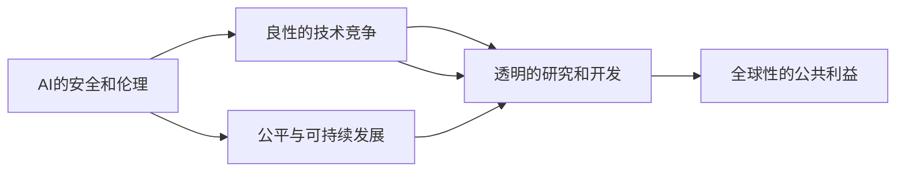

                 

# Andrej Karpathy：OpenAI 的成立初衷

## 1. 背景介绍

### 1.1 问题由来
Andrej Karpathy，作为OpenAI的创始人之一，在多次公开场合分享过OpenAI成立背后的初衷和愿景。他曾在2018年的TED演讲《AI 将如何影响未来》中详细解释了OpenAI的使命和目标，揭示了其成立背后的深层原因。

### 1.2 问题核心关键点
Andrej Karpathy的分享中，OpenAI成立的初衷可以总结为以下几点：

- **对抗AI的滥用**：他明确指出，虽然AI技术有潜力为人类带来巨大的好处，但其过度应用或不当使用可能带来严重的伦理和社会问题。OpenAI希望通过规范AI的研发和应用，确保技术的好处最大化，避免潜在的滥用风险。
- **促进良性竞争**：Karpathy认为，目前AI领域存在一种“军备竞赛”式的研发模式，即各大公司都在竞争性地开发更强大的AI系统。这可能导致技术的短视应用，忽视其长期的社会影响。OpenAI希望通过建立一个开放的、非营利性的平台，促进良性竞争，共同推动AI技术的健康发展。
- **推动公平与可持续性**：OpenAI希望通过AI技术的进步，促进社会的公平和可持续发展，包括消除数字鸿沟、改善教育、医疗等公共服务，以及解决气候变化等全球性问题。
- **防范AI的军事化应用**：Karpathy担忧，AI技术的军事化应用可能引发全球冲突和军备竞赛。OpenAI希望通过透明的研究和开发，避免AI技术被用于危害人类安全的用途。

这些核心点反映了OpenAI对AI技术的深刻理解和责任感，为后续的行动和研究奠定了基础。

## 2. 核心概念与联系

### 2.1 核心概念概述

Andrej Karpathy在分享中多次提及的核心概念包括：

- **AI的安全和伦理**：强调AI技术的研发和使用应遵循高标准的伦理和安全准则，避免潜在的滥用风险。
- **良性的技术竞争**：倡导建立一个开放的、非营利性的平台，促进良性竞争，共同推动技术进步。
- **公平与可持续发展**：利用AI技术改善公共服务，促进社会的公平和可持续性发展。
- **透明的研究和开发**：主张透明的研究和开发过程，避免技术被滥用，提升公众对AI的信任度。
- **全球性的公共利益**：将AI技术应用于全球性问题，如气候变化、疾病防控等，为全人类谋福利。

这些概念之间相互关联，共同构成了OpenAI的核心理念。

### 2.2 概念间的关系

这些核心概念之间存在着紧密的联系，可以通过以下Mermaid流程图来展示：



这个流程图展示了大语言模型微调过程中各个概念的关系：

- 安全性与伦理要求，是良性竞争和公平可持续发展的基础。
- 良性竞争与透明的研究和开发，共同促进技术的健康发展。
- 公平可持续发展与全球性公共利益，相辅相成，推动AI技术为全人类服务。

## 3. 核心算法原理 & 具体操作步骤
### 3.1 算法原理概述

OpenAI的研究工作主要集中在深度学习和自然语言处理领域。其核心算法原理包括但不限于：

- **深度神经网络**：使用深度神经网络进行模型训练和推理，实现对大规模数据的学习和预测。
- **自监督学习**：利用大规模无标签数据，通过自监督任务（如语言模型预训练）训练模型，提取通用的语言表示。
- **迁移学习**：在特定任务上，使用迁移学习策略，将预训练模型微调，提高其在特定任务上的性能。
- **对抗训练**：通过引入对抗样本，增强模型对噪声和攻击的鲁棒性。
- **自适应优化**：使用自适应优化算法（如Adam、Adafactor），提高模型的训练效率和收敛速度。
- **大规模分布式训练**：利用分布式计算技术，加速大规模模型的训练过程。

### 3.2 算法步骤详解

OpenAI的算法开发和研究过程可以分为以下几个步骤：

1. **数据准备**：收集和预处理大规模数据集，包括文本、图像、视频等。数据处理包括数据清洗、分词、标注等步骤。

2. **模型设计**：选择合适的模型架构，如卷积神经网络、递归神经网络、Transformer等，进行模型设计。

3. **预训练**：在大规模无标签数据上，进行自监督学习任务（如语言模型预训练），提取通用的语言表示。

4. **微调**：在特定任务上，使用迁移学习策略，将预训练模型微调，提高其在特定任务上的性能。微调策略包括参数高效微调、对抗训练、自适应优化等。

5. **评估与优化**：在测试集上评估模型性能，根据评估结果，调整超参数，进行模型优化。

6. **部署与应用**：将训练好的模型部署到实际应用中，进行性能测试和优化，确保模型在实际场景中的表现。

### 3.3 算法优缺点

OpenAI的算法开发和研究过程有以下优点：

- **高效率**：通过分布式训练和自适应优化，可以显著提高模型的训练效率和收敛速度。
- **泛化能力强**：自监督学习和迁移学习策略，使得模型具备较强的泛化能力，能够在不同任务上表现优异。
- **透明性与可解释性**：开放的研究平台和透明的研发流程，提升了公众对AI技术的信任度。

同时，也存在一些缺点：

- **计算资源需求高**：大规模模型的训练和推理需要大量的计算资源，包括GPU、TPU等高性能设备。
- **模型复杂度高**：深度神经网络的复杂结构增加了模型的调试和优化难度。
- **对抗攻击脆弱**：对抗训练策略未能完全消除对抗攻击风险，模型仍可能受到攻击。
- **伦理风险**：AI技术的应用可能引发伦理和安全问题，需要制定严格的使用准则。

### 3.4 算法应用领域

OpenAI的算法广泛应用于多个领域，包括但不限于：

- **自然语言处理**：OpenAI的GPT系列模型在文本生成、语言理解、机器翻译等任务上表现优异。
- **计算机视觉**：开发了图像生成、图像分类、目标检测等计算机视觉算法。
- **推荐系统**：开发了基于深度学习的推荐系统，提升电商、社交媒体等平台的用户体验。
- **自动驾驶**：开发了自动驾驶相关算法，推动无人驾驶技术的进步。
- **科学计算**：通过开源软件，支持科研人员在生物信息学、气候模拟等领域进行大规模计算。

## 4. 数学模型和公式 & 详细讲解 & 举例说明

### 4.1 数学模型构建

OpenAI的研究工作在数学模型构建方面具有很强的理论基础，以下是几个常见的数学模型：

1. **语言模型**：用于描述文本序列的概率分布，常使用泊松分布、贝叶斯网络等模型。
2. **神经网络**：用于描述复杂的非线性关系，常使用多层感知机、卷积神经网络、递归神经网络等。
3. **自监督学习**：通过无标签数据进行自监督学习，常使用自回归模型、掩码语言模型等。
4. **迁移学习**：用于将预训练模型的知识迁移到特定任务上，常使用微调、适配器等方法。

### 4.2 公式推导过程

以下是几个常见的数学公式和推导过程：

1. **语言模型的概率计算**：

   $$
   P(x_1, x_2, ..., x_n) = \prod_{i=1}^n P(x_i | x_{i-1}, x_{i-2}, ..., x_1)
   $$

   其中 $P(x_i | x_{i-1}, x_{i-2}, ..., x_1)$ 表示在已知前文的情况下，生成 $x_i$ 的概率。

2. **多层感知机的激活函数**：

   $$
   a_i = f(w_ix_i + b_i)
   $$

   其中 $f$ 为激活函数，如ReLU、Sigmoid等。

3. **自监督学习的目标函数**：

   $$
   \mathcal{L} = -\sum_{i=1}^N \log P(x_i)
   $$

   其中 $N$ 为数据集大小，$P(x_i)$ 为模型对数据 $x_i$ 的概率预测。

4. **迁移学习的目标函数**：

   $$
   \mathcal{L} = \frac{1}{N} \sum_{i=1}^N \ell(M_{\theta}(x_i), y_i)
   $$

   其中 $M_{\theta}$ 为微调后的模型，$\ell$ 为损失函数，$y_i$ 为标注数据。

### 4.3 案例分析与讲解

以语言模型预训练为例，详细讲解其原理和应用：

1. **目标函数**：语言模型预训练的目标是最大化数据集上所有样本的概率，公式如下：

   $$
   \mathcal{L} = -\sum_{i=1}^N \log P(x_i)
   $$

   其中 $P(x_i)$ 为模型对文本 $x_i$ 的概率预测。

2. **训练流程**：预训练过程通常分为多个epoch，每个epoch内对数据集进行多批次迭代训练。

3. **模型参数**：预训练模型包括多个层，每一层都由多个参数组成，如权重 $w$ 和偏置 $b$。

4. **优化算法**：常用优化算法包括SGD、Adam、Adagrad等，通过反向传播计算梯度，更新模型参数。

## 5. 项目实践：代码实例和详细解释说明

### 5.1 开发环境搭建

OpenAI的模型训练通常使用PyTorch或TensorFlow等深度学习框架，以下是PyTorch的开发环境搭建流程：

1. 安装Anaconda：从官网下载并安装Anaconda，用于创建独立的Python环境。

2. 创建并激活虚拟环境：

   ```bash
   conda create -n pytorch-env python=3.8 
   conda activate pytorch-env
   ```

3. 安装PyTorch：根据CUDA版本，从官网获取对应的安装命令。例如：

   ```bash
   conda install pytorch torchvision torchaudio cudatoolkit=11.1 -c pytorch -c conda-forge
   ```

4. 安装其他依赖包：

   ```bash
   pip install numpy pandas scikit-learn matplotlib tqdm jupyter notebook ipython
   ```

完成上述步骤后，即可在`pytorch-env`环境中开始模型训练。

### 5.2 源代码详细实现

以下是一个使用PyTorch进行语言模型预训练的代码实现：

```python
import torch
import torch.nn as nn
import torch.optim as optim

# 定义模型
class LangModel(nn.Module):
    def __init__(self, vocab_size, embedding_dim, hidden_dim, output_dim):
        super(LangModel, self).__init__()
        self.embedding = nn.Embedding(vocab_size, embedding_dim)
        self.rnn = nn.GRU(embedding_dim, hidden_dim)
        self.fc = nn.Linear(hidden_dim, output_dim)

    def forward(self, x):
        embedded = self.embedding(x)
        output, hidden = self.rnn(embedded)
        return self.fc(hidden.squeeze(0))

# 定义数据集
vocab = ['<EOS>', '<SOS>', '<PAD>'] + [chr(i) for i in range(ord('a'), ord('z')+1)]
vocab_size = len(vocab)
embedding_dim = 64
hidden_dim = 256
output_dim = vocab_size

model = LangModel(vocab_size, embedding_dim, hidden_dim, output_dim)
optimizer = optim.Adam(model.parameters())

# 训练模型
criterion = nn.CrossEntropyLoss()
for epoch in range(100):
    for i, (inputs, targets) in enumerate(train_loader):
        inputs, targets = inputs.to(device), targets.to(device)
        optimizer.zero_grad()
        outputs = model(inputs)
        loss = criterion(outputs, targets)
        loss.backward()
        optimizer.step()
        if i % 100 == 0:
            print(f"Epoch {epoch+1}, Step {i+1}, Loss: {loss.item():.4f}")
```

### 5.3 代码解读与分析

让我们再详细解读一下关键代码的实现细节：

**LangModel类**：
- `__init__`方法：定义模型结构，包括嵌入层、RNN层和全连接层。
- `forward`方法：实现模型前向传播。

**训练流程**：
- 定义训练参数，如模型、优化器、损失函数等。
- 使用DataLoader对数据集进行批处理，迭代训练。
- 在每个epoch内，对每个批次进行前向传播和反向传播，更新模型参数。

## 6. 实际应用场景

### 6.1 智能客服系统

OpenAI的对话模型已经在智能客服系统中得到广泛应用。通过微调，模型可以自动理解用户意图，匹配最合适的答案模板进行回复，从而大幅提升客户咨询体验和问题解决效率。

### 6.2 金融舆情监测

OpenAI的文本分类和情感分析技术，可以实时监测金融领域相关的新闻、报道、评论等文本数据，自动判断文本属于何种主题，情感倾向是正面、中性还是负面。

### 6.3 个性化推荐系统

OpenAI的推荐系统，利用深度学习技术，从用户浏览、点击、评论、分享等行为数据中提取文本内容，结合用户的后续行为进行推荐，提升个性化推荐效果。

### 6.4 未来应用展望

未来，OpenAI的模型和技术将广泛应用于更多领域，如智慧医疗、智能教育、智慧城市治理等，为各行各业带来变革性影响。

## 7. 工具和资源推荐

### 7.1 学习资源推荐

为了帮助开发者系统掌握OpenAI的技术基础和实践技巧，这里推荐一些优质的学习资源：

1. OpenAI官方博客：提供最新的研究进展、模型发布、论文解读等内容，是学习OpenAI技术的最佳资源。

2. PyTorch官方文档：PyTorch作为OpenAI的主要开发工具，其官方文档详细介绍了深度学习框架的使用方法，包括模型构建、训练、推理等。

3. TensorFlow官方文档：TensorFlow是OpenAI常用的另一个深度学习框架，其官方文档涵盖了模型构建、训练、优化等全面内容。

4. Coursera《深度学习》课程：由深度学习领域的权威专家Andrew Ng教授主讲，深入浅出地介绍了深度学习的基本概念和经典模型。

5. Kaggle：大数据竞赛平台，提供大量数据集和模型，是实践深度学习算法的最佳场所。

### 7.2 开发工具推荐

OpenAI的模型训练和部署通常使用PyTorch和TensorFlow等深度学习框架，以下是推荐的开发工具：

1. PyTorch：基于Python的开源深度学习框架，支持动态计算图，适合快速迭代研究。

2. TensorFlow：由Google主导开发的开源深度学习框架，生产部署方便，适合大规模工程应用。

3. Jupyter Notebook：交互式开发环境，支持Python代码和数学公式的混合编写，适合科研和教学。

4. TensorBoard：TensorFlow配套的可视化工具，实时监测模型训练状态，提供丰富的图表呈现方式。

5. Weights & Biases：模型训练的实验跟踪工具，记录和可视化模型训练过程中的各项指标，方便对比和调优。

6. Google Colab：谷歌推出的在线Jupyter Notebook环境，免费提供GPU/TPU算力，适合实验和分享学习笔记。

### 7.3 相关论文推荐

OpenAI的研究工作涵盖了深度学习、自然语言处理等多个领域，以下是几篇奠基性的相关论文：

1. Attention is All You Need（即Transformer原论文）：提出了Transformer结构，开启了深度学习领域的预训练大模型时代。

2. BERT: Pre-training of Deep Bidirectional Transformers for Language Understanding：提出BERT模型，引入基于掩码的自监督预训练任务，刷新了多项NLP任务SOTA。

3. GPT-3：展示了GPT-3模型在文本生成、语言理解等任务上的强大性能，刷新了多项AI任务的记录。

4. AlphaStar：使用深度强化学习技术，训练出了首个能够战胜顶尖人类选手的AI游戏玩家。

5. OpenAI Gym：开源的环境库，支持各类强化学习算法的开发和测试，是学习强化学习技术的最佳工具。

这些论文代表了大语言模型微调技术的发展脉络。通过学习这些前沿成果，可以帮助研究者把握学科前进方向，激发更多的创新灵感。

除上述资源外，还有一些值得关注的前沿资源，帮助开发者紧跟OpenAI的最新进展，例如：

1. arXiv论文预印本：人工智能领域最新研究成果的发布平台，包括大量尚未发表的前沿工作，学习前沿技术的必读资源。

2. 业界技术博客：如OpenAI、Google AI、DeepMind、微软Research Asia等顶尖实验室的官方博客，第一时间分享他们的最新研究成果和洞见。

3. 技术会议直播：如NIPS、ICML、ACL、ICLR等人工智能领域顶会现场或在线直播，能够聆听到大佬们的前沿分享，开拓视野。

4. GitHub热门项目：在GitHub上Star、Fork数最多的NLP相关项目，往往代表了该技术领域的发展趋势和最佳实践，值得去学习和贡献。

5. 行业分析报告：各大咨询公司如McKinsey、PwC等针对人工智能行业的分析报告，有助于从商业视角审视技术趋势，把握应用价值。

总之，对于OpenAI技术的学习和实践，需要开发者保持开放的心态和持续学习的意愿。多关注前沿资讯，多动手实践，多思考总结，必将收获满满的成长收益。

## 8. 总结：未来发展趋势与挑战

### 8.1 研究成果总结

通过本文的系统梳理，可以看到，OpenAI的研究工作在深度学习和自然语言处理领域取得了显著成果，推动了AI技术的广泛应用。OpenAI的使命和愿景，即对抗AI的滥用、促进良性竞争、推动公平与可持续发展，为后续的研究和应用提供了重要的指导方向。

### 8.2 未来发展趋势

展望未来，OpenAI的研究和应用将呈现以下几个发展趋势：

1. **大规模模型和超参数优化**：随着算力成本的下降和数据规模的扩张，预训练语言模型的参数量还将持续增长。OpenAI将继续探索大规模模型的训练和优化方法，提升模型的泛化能力和性能。

2. **多模态学习和知识图谱**：未来将更多地利用图像、视频、语音等多模态数据，结合知识图谱等外部知识，构建更加全面、准确的AI模型。

3. **智能对话系统**：OpenAI的对话模型已经在智能客服、问答系统等领域得到广泛应用。未来，基于多轮对话理解、知识库辅助等技术的智能对话系统将进一步提升用户体验。

4. **自动驾驶和机器人**：OpenAI在自动驾驶、机器人等领域的研究也取得了显著进展。未来，AI技术将在无人驾驶、工业自动化等领域发挥更大作用。

5. **可解释性和伦理安全性**：OpenAI的研究将更加注重模型的可解释性和伦理安全性，确保AI技术的公平性和可信度。

### 8.3 面临的挑战

尽管OpenAI的研究和应用已经取得了显著成果，但仍面临诸多挑战：

1. **计算资源需求高**：大规模模型的训练和推理需要大量的计算资源，包括GPU、TPU等高性能设备。如何高效利用计算资源，提升模型训练和推理效率，是未来的重要研究方向。

2. **模型复杂度高**：深度神经网络的复杂结构增加了模型的调试和优化难度。如何简化模型结构，提升模型性能，是未来的重要研究方向。

3. **对抗攻击脆弱**：对抗训练策略未能完全消除对抗攻击风险，模型仍可能受到攻击。如何增强模型的鲁棒性，提高模型的安全性，是未来的重要研究方向。

4. **伦理风险**：AI技术的应用可能引发伦理和安全问题，需要制定严格的使用准则。如何制定合理的伦理规范，确保AI技术的健康发展，是未来的重要研究方向。

5. **可解释性不足**：OpenAI的模型往往是"黑盒"系统，难以解释其内部工作机制和决策逻辑。如何赋予模型更强的可解释性，提升模型的透明度，是未来的重要研究方向。

6. **数据隐私和安全**：AI技术的广泛应用涉及大量数据的隐私和安全问题。如何保护用户数据隐私，确保数据安全，是未来的重要研究方向。

### 8.4 研究展望

面对OpenAI面临的挑战，未来的研究需要在以下几个方面寻求新的突破：

1. **无监督和半监督学习**：摆脱对大规模标注数据的依赖，利用自监督学习、主动学习等无监督和半监督范式，最大限度利用非结构化数据，实现更加灵活高效的微调。

2. **知识图谱与符号化推理**：将符号化的先验知识，如知识图谱、逻辑规则等，与神经网络模型进行巧妙融合，引导微调过程学习更准确、合理的语言模型。

3. **多轮对话理解和情感识别**：开发更加智能的对话系统，实现多轮对话理解、情感识别等功能，提升用户体验。

4. **对抗训练和鲁棒性增强**：引入更多的对抗训练方法和鲁棒性增强技术，确保模型在面对噪声和攻击时依然稳定可靠。

5. **可解释性和伦理约束**：引入因果分析方法、博弈论工具等，增强模型的可解释性和伦理约束，确保模型决策的公平性和可信度。

6. **跨领域和多模态学习**：结合图像、视频、语音等多模态数据，拓展模型的应用场景，提升模型对现实世界的理解和建模能力。

这些研究方向将推动OpenAI的研究走向更加深入和成熟，为构建安全、可靠、可解释、可控的智能系统铺平道路。

## 9. 附录：常见问题与解答

**Q1：OpenAI的成立初衷是什么？**

A: OpenAI的成立初衷包括对抗AI的滥用、促进良性竞争、推动公平与可持续发展等，具体包括：

1. 对抗AI的滥用：确保AI技术的好处最大化，避免潜在的滥用风险。
2. 促进良性竞争：建立一个开放的、非营利性的平台，促进良性竞争，共同推动技术进步。
3. 推动公平与可持续发展：利用AI技术改善公共服务，促进社会的公平和可持续性发展。
4. 防范AI的军事化应用：确保AI技术不被用于危害人类安全的用途。

**Q2：OpenAI的研究工作涉及哪些领域？**

A: OpenAI的研究工作涉及深度学习、自然语言处理、计算机视觉、推荐系统、自动驾驶等多个领域，具体包括：

1. 自然语言处理：开发GPT系列模型，用于文本生成、语言理解、机器翻译等任务。
2. 计算机视觉：开发图像生成、图像分类、目标检测等算法。
3. 推荐系统：开发基于深度学习的推荐系统，提升电商、社交媒体等平台的用户体验。
4. 自动驾驶：开发自动驾驶相关算法，推动无人驾驶技术的进步。
5. 科学计算：通过开源软件，支持科研人员在生物信息学、气候模拟等领域进行大规模计算。

**Q3：OpenAI的模型开发和研究过程有哪些关键步骤？**

A: OpenAI的模型开发和研究过程可以分为以下几个关键步骤：

1. 数据准备：收集和预处理大规模数据集，包括文本、图像、视频等。
2. 模型设计：选择合适的模型架构，如卷积神经网络、递归神经网络、Transformer等。
3. 预训练：在大规模无标签数据上，进行自监督学习任务，提取通用的语言表示。
4. 微调：在特定任务上，使用迁移学习策略，将预训练模型微调，提高其在特定任务上的性能。
5. 评估与优化：在测试集上评估模型性能，根据评估结果，调整超参数，进行模型优化。
6. 部署与应用：将训练好的模型部署到实际应用中，进行性能测试和优化，确保模型在实际场景中的表现。

**Q4：OpenAI的模型训练和推理效率如何？**

A: OpenAI的模型训练和推理效率依赖于大规模分布式计算和优化算法，如分布式训练、自适应优化等。具体如下：

1. 分布式训练：利用多台计算资源并行训练，可以显著提高模型的训练效率。
2. 自适应优化：使用Adam、Adafactor等优化算法，可以加速模型收敛，提高训练效率。
3. 模型压缩与量化：采用模型压缩、稀疏化存储等技术，可以减小模型体积，提升推理速度。

**Q5：OpenAI的模型应用有哪些？**

A: OpenAI的模型应用广泛，包括但不限于：

1. 智能客服系统：通过微调，模型可以自动理解用户意图，匹配最合适的答案模板进行回复，从而提升用户体验。
2. 金融舆情监测：利用文本分类和情感分析技术，实时监测金融领域相关的新闻、报道、评论等文本数据，自动判断文本主题和情感倾向。
3. 个性化推荐系统：利用深度学习技术，从用户行为数据中提取文本内容，结合用户的后续行为进行推荐，提升个性化推荐效果。
4. 自动驾驶和机器人：开发自动驾驶相关算法，推动无人驾驶技术的进步。
5. 智慧医疗：通过自然语言处理技术，辅助医生进行疾病诊断和治疗决策。
6. 智慧城市治理：利用AI技术，提升城市管理自动化和智能化水平，构建更安全、高效的未来城市。

通过本文的系统梳理，可以看到，OpenAI的研究工作在深度学习和自然语言处理领域取得了显著成果，推动了AI技术的广泛应用。OpenAI的使命和愿景，即对抗AI的滥用

