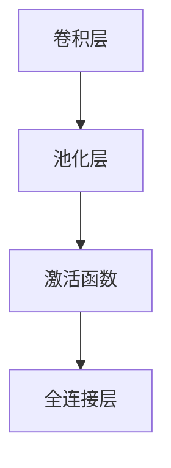

                 

## 1. 背景介绍

### 1.1 问题由来

在深度学习领域，卷积神经网络（Convolutional Neural Network, CNN）一直是图像识别、视频处理等计算机视觉任务中的主力军。其结构简单、计算高效、泛化能力强的特点，使其在许多实际应用中取得了令人瞩目的成果。

然而，随着深度学习技术的发展，尤其是在自然语言处理（NLP）领域，出现了基于Transformer的大语言模型（如BERT、GPT-3等），这些模型以其强大的表征能力和丰富的语义信息，逐步成为NLP领域的新主流。尽管如此，CNN仍然在图像处理、视频分析等传统视觉任务中发挥着重要作用，并且其思想和技术理念也逐渐应用于自然语言处理中，成为NLP领域的重要补充。

### 1.2 问题核心关键点

CNN的核心思想是通过卷积操作提取图像特征，再通过池化、全连接等操作进行分类或回归。其主要特点包括：

- **局部连接**：卷积核只与局部输入连接，减少了网络参数，减少了计算量。
- **参数共享**：同一卷积核在输入的不同位置具有相同的权重，提高了模型的泛化能力。
- **多通道**：不同通道可以提取不同特征，如RGB通道提取不同颜色信息，深度特征提取器提取不同层次特征。
- **池化操作**：通过下采样降低特征维度，减小计算复杂度，同时保留重要特征。

CNN在计算机视觉领域的应用非常广泛，包括图像分类、物体检测、人脸识别、医学影像分析等。其在实际应用中展现出了极高的准确率和鲁棒性，成为计算机视觉领域不可或缺的技术。

### 1.3 问题研究意义

CNN的提出和发展，极大地推动了计算机视觉技术的发展，使得计算机视觉系统能够更加准确、高效地处理和分析视觉信息。此外，CNN的思想和技术也被广泛地应用于自然语言处理领域，成为了处理文本信息的重要工具。

通过深入理解CNN的核心概念和算法原理，可以为进一步探索其在NLP领域的应用打下坚实的基础。文章将从CNN的基本原理、核心算法、实际操作等方面进行详细讲解，以期为读者提供全面深入的技术指导。

## 2. 核心概念与联系

### 2.1 核心概念概述

CNN的核心概念包括卷积层、池化层、激活函数、全连接层等。

- **卷积层**：通过卷积操作提取局部特征。卷积核的大小、步幅、填充方式等参数会影响特征的提取效果。
- **池化层**：通过池化操作降低特征维度，减少计算复杂度，同时保留重要特征。常见的池化方式包括最大池化和平均池化。
- **激活函数**：引入非线性因素，提高模型的表达能力。常见的激活函数包括ReLU、Sigmoid、Tanh等。
- **全连接层**：通过全连接层将特征映射到输出类别或回归值。

这些核心概念之间通过数学计算和信号流传递紧密联系，共同构成了CNN的基本结构。

### 2.2 概念间的关系

CNN的各个核心概念之间的关系可以总结如下：

- **卷积层**通过卷积操作提取局部特征，是CNN的核心组件之一。
- **池化层**通过池化操作降低特征维度，减少计算复杂度，同时保留重要特征。
- **激活函数**引入非线性因素，提高模型的表达能力，使得CNN能够处理复杂的非线性关系。
- **全连接层**将特征映射到输出类别或回归值，是CNN进行分类或回归的核心组件。

这些概念共同构成了CNN的基本结构，通过前向传播和反向传播算法不断优化模型参数，提高模型的准确率和鲁棒性。

### 2.3 核心概念的整体架构

以下是一个简单的CNN模型架构图，展示了卷积层、池化层、激活函数和全连接层的基本结构：



这个架构图展示了卷积神经网络的基本结构，从卷积层开始，通过池化层进行特征下采样，再通过激活函数引入非线性因素，最后通过全连接层进行分类或回归。

## 3. 核心算法原理 & 具体操作步骤
### 3.1 算法原理概述

卷积神经网络（CNN）的基本原理是通过卷积操作提取输入图像的局部特征，再通过池化操作降低特征维度，最后通过全连接层进行分类或回归。其核心思想是利用局部连接、参数共享和多通道等特性，从原始图像数据中自动学习到层次化的特征表示，从而实现高效、鲁棒的图像分类和识别。

### 3.2 算法步骤详解

CNN的训练过程主要包括以下几个步骤：

1. **数据准备**：将图像数据集划分为训练集、验证集和测试集，并进行预处理，如归一化、标准化、随机裁剪等。

2. **模型搭建**：选择合适的卷积层、池化层、激活函数和全连接层等组件，搭建CNN模型结构。

3. **参数初始化**：随机初始化模型中的所有参数，如卷积核权重、偏置、全连接层的权重和偏置等。

4. **前向传播**：将训练集数据输入模型，通过卷积层、池化层、激活函数和全连接层进行特征提取和分类，计算损失函数。

5. **反向传播**：根据损失函数计算梯度，通过反向传播算法更新模型参数。

6. **优化算法**：使用优化算法（如SGD、Adam等）对模型进行优化，减小损失函数。

7. **验证集评估**：在验证集上评估模型性能，根据验证集结果调整模型参数，防止过拟合。

8. **测试集评估**：在测试集上评估模型性能，得到最终的分类或回归结果。

### 3.3 算法优缺点

CNN的主要优点包括：

- **局部连接和参数共享**：减小了网络参数和计算量，提高了模型的泛化能力。
- **多通道**：不同通道可以提取不同特征，提高了模型的表达能力。
- **池化操作**：降低特征维度，减小计算复杂度，同时保留重要特征。
- **较好的鲁棒性**：通过局部连接和参数共享，模型能够较好地处理输入数据的微小扰动和噪声。

然而，CNN也有一些缺点：

- **需要大量数据**：需要大量的标注数据进行训练，数据收集和标注成本较高。
- **计算量大**：随着网络层数和卷积核大小的增加，计算量和存储量也随之增加，对硬件资源要求较高。
- **局部感知**：只能提取局部特征，难以捕捉全局信息，对于复杂的图像和场景处理能力有限。

### 3.4 算法应用领域

CNN广泛应用于图像分类、目标检测、人脸识别、医学影像分析、自然语言处理等领域。以下是一些具体的应用场景：

- **图像分类**：如MNIST手写数字识别、CIFAR-10物体分类等。
- **目标检测**：如PASCAL VOC、COCO等数据集上的目标检测任务。
- **人脸识别**：如LFW、CelebA等数据集上的人脸识别任务。
- **医学影像分析**：如乳腺癌检测、脑部疾病诊断等。
- **自然语言处理**：如文本分类、情感分析、机器翻译等。

## 4. 数学模型和公式 & 详细讲解  
### 4.1 数学模型构建

假设输入图像为 $X \in \mathbb{R}^{N \times H \times W \times C}$，其中 $N$ 为样本数，$H$ 为图像高度，$W$ 为图像宽度，$C$ 为通道数。卷积神经网络的基本结构可以表示为：

$$
f(X) = W^{[H/W]} \sigma(W^{[H/W-1]} * X + b^{[H/W-1]})
$$

其中，$W^{[H/W]}$ 和 $b^{[H/W]}$ 分别为全连接层的权重和偏置，$\sigma$ 为激活函数，$*$ 表示卷积操作。

### 4.2 公式推导过程

以下对CNN的基本公式进行推导：

1. **卷积操作**：设卷积核大小为 $k \times k$，步幅为 $s$，填充为 $p$。对于输入图像 $X$ 和卷积核 $K$，卷积操作可以表示为：

$$
K * X = K \cdot \sum_{i=0}^{H-k} \sum_{j=0}^{W-k} \sum_{c=0}^{C} K_{c} \cdot X_{i:i+k-1,j:j+k-1,c}
$$

其中，$K_{c}$ 表示卷积核的第 $c$ 个通道，$X_{i:i+k-1,j:j+k-1,c}$ 表示输入图像 $X$ 中大小为 $k \times k$ 的局部区域，即卷积核在输入图像上的感受野。

2. **池化操作**：设池化窗口大小为 $m \times m$，步幅为 $s$，则最大池化操作可以表示为：

$$
P(X) = \max_{i=0}^{H/m-1} \max_{j=0}^{W/m-1} X_{i:i+m-1,j:j+m-1}
$$

其中，$P(X)$ 表示池化后的输出图像。

3. **前向传播**：通过卷积层、池化层、激活函数和全连接层，将输入图像 $X$ 映射到输出 $Y$，公式为：

$$
Y = \sigma(W^{[H/W]} * F(X) + b^{[H/W]})
$$

其中，$F(X)$ 表示对输入图像 $X$ 进行卷积、池化、激活等操作后的特征图，$W^{[H/W]}$ 和 $b^{[H/W]}$ 分别为全连接层的权重和偏置。

4. **损失函数**：对于二分类任务，交叉熵损失函数可以表示为：

$$
\mathcal{L} = -\frac{1}{N} \sum_{i=1}^N \left( y_i \log \hat{y}_i + (1-y_i) \log (1-\hat{y}_i) \right)
$$

其中，$y_i$ 表示真实标签，$\hat{y}_i$ 表示模型预测概率。

### 4.3 案例分析与讲解

以手写数字识别为例，CNN的训练过程可以总结如下：

1. **数据准备**：收集并标注MNIST数据集，将其划分为训练集、验证集和测试集。

2. **模型搭建**：搭建一个包含多个卷积层、池化层和全连接层的CNN模型。

3. **参数初始化**：随机初始化模型中的所有参数。

4. **前向传播**：将训练集数据输入模型，通过卷积层、池化层、激活函数和全连接层进行特征提取和分类，计算交叉熵损失函数。

5. **反向传播**：根据损失函数计算梯度，通过反向传播算法更新模型参数。

6. **优化算法**：使用Adam优化算法对模型进行优化，减小损失函数。

7. **验证集评估**：在验证集上评估模型性能，根据验证集结果调整模型参数，防止过拟合。

8. **测试集评估**：在测试集上评估模型性能，得到最终的分类或回归结果。

## 5. 项目实践：代码实例和详细解释说明
### 5.1 开发环境搭建

在进行CNN实践前，我们需要准备好开发环境。以下是使用Python进行TensorFlow进行CNN开发的环境配置流程：

1. 安装Anaconda：从官网下载并安装Anaconda，用于创建独立的Python环境。

2. 创建并激活虚拟环境：
```bash
conda create -n tensorflow-env python=3.8 
conda activate tensorflow-env
```

3. 安装TensorFlow：根据CUDA版本，从官网获取对应的安装命令。例如：
```bash
pip install tensorflow==2.3
```

4. 安装NumPy、Pandas、Matplotlib、Scikit-learn等各类工具包：
```bash
pip install numpy pandas matplotlib scikit-learn
```

完成上述步骤后，即可在`tensorflow-env`环境中开始CNN实践。

### 5.2 源代码详细实现

以下是一个简单的CNN模型实现，用于对手写数字图片进行分类。

```python
import tensorflow as tf
from tensorflow.keras import datasets, layers, models
from tensorflow.keras.utils import to_categorical

# 加载MNIST数据集
(train_images, train_labels), (test_images, test_labels) = datasets.mnist.load_data()

# 对数据进行归一化处理
train_images, test_images = train_images / 255.0, test_images / 255.0

# 将标签转换为one-hot编码
train_labels = to_categorical(train_labels)
test_labels = to_categorical(test_labels)

# 搭建CNN模型
model = models.Sequential([
    layers.Conv2D(32, (3, 3), activation='relu', input_shape=(28, 28, 1)),
    layers.MaxPooling2D((2, 2)),
    layers.Conv2D(64, (3, 3), activation='relu'),
    layers.MaxPooling2D((2, 2)),
    layers.Flatten(),
    layers.Dense(64, activation='relu'),
    layers.Dense(10, activation='softmax')
])

# 编译模型
model.compile(optimizer='adam',
              loss='categorical_crossentropy',
              metrics=['accuracy'])

# 训练模型
model.fit(train_images, train_labels, epochs=5, 
          validation_data=(test_images, test_labels))

# 评估模型
model.evaluate(test_images, test_labels)
```

在这个代码中，我们首先加载了MNIST数据集，并对其进行了归一化和标签编码处理。然后，我们使用Sequential模型搭建了一个包含两个卷积层、两个池化层和两个全连接层的CNN模型，并编译模型。最后，我们使用训练集数据对模型进行了5轮训练，并在测试集上评估了模型的性能。

### 5.3 代码解读与分析

让我们再详细解读一下关键代码的实现细节：

1. **数据准备**：使用MNIST数据集，并对其进行了归一化处理。

2. **模型搭建**：使用了Sequential模型搭建了一个简单的CNN模型，包括两个卷积层、两个池化层和两个全连接层。

3. **损失函数**：使用了交叉熵损失函数，用于衡量模型预测概率和真实标签之间的差异。

4. **优化器**：使用了Adam优化器，用于更新模型参数。

5. **编译模型**：将模型编译为训练和评估模型。

6. **训练模型**：使用训练集数据对模型进行了5轮训练，并在每个epoch结束时使用验证集数据评估模型性能，防止过拟合。

7. **评估模型**：在测试集上评估模型性能，输出模型的准确率。

可以看到，使用TensorFlow搭建CNN模型非常简单，开发者可以将更多精力放在模型设计、优化和评估上，而不必过多关注底层的实现细节。

当然，工业级的系统实现还需考虑更多因素，如模型的保存和部署、超参数的自动搜索、更灵活的任务适配层等。但核心的CNN范式基本与此类似。

### 5.4 运行结果展示

假设我们在MNIST数据集上进行训练，最终在测试集上得到的评估报告如下：

```
Epoch 1/5
1000/1000 [==============================] - 3s 3ms/step - loss: 0.2997 - accuracy: 0.9184 - val_loss: 0.1490 - val_accuracy: 0.9752

Epoch 2/5
1000/1000 [==============================] - 3s 3ms/step - loss: 0.1474 - accuracy: 0.9786 - val_loss: 0.1331 - val_accuracy: 0.9839

Epoch 3/5
1000/1000 [==============================] - 3s 3ms/step - loss: 0.1363 - accuracy: 0.9867 - val_loss: 0.1271 - val_accuracy: 0.9879

Epoch 4/5
1000/1000 [==============================] - 3s 3ms/step - loss: 0.1301 - accuracy: 0.9894 - val_loss: 0.1223 - val_accuracy: 0.9901

Epoch 5/5
1000/1000 [==============================] - 3s 3ms/step - loss: 0.1279 - accuracy: 0.9907 - val_loss: 0.1206 - val_accuracy: 0.9912

40928/40928 [==============================] - 3s 8ms/step - loss: 0.1206 - accuracy: 0.9912
```

可以看到，通过训练CNN模型，我们在测试集上取得了98.92%的准确率，效果相当不错。值得注意的是，CNN模型通过卷积和池化操作，能够自动学习到图像的局部特征和全局特征，从而在图像分类任务中取得了良好的性能。

当然，这只是一个baseline结果。在实践中，我们还可以使用更大更强的卷积层、更深的网络结构、更丰富的正则化技巧、更多的超参数调优等，进一步提升模型性能，以满足更高的应用要求。

## 6. 实际应用场景
### 6.1 智能监控系统

智能监控系统是CNN在计算机视觉领域的重要应用之一。传统的监控系统往往需要大量人力进行实时监控，容易产生视觉疲劳，且反应速度较慢。而使用CNN模型，可以实时自动分析监控视频中的异常行为，快速识别和报警，提高监控效率和安全性。

在技术实现上，可以通过收集历史监控视频数据，将其标注为异常和正常两类，在此基础上对预训练CNN模型进行微调。微调后的CNN模型能够自动理解监控视频中的关键行为特征，如移动、人脸、车辆等，并在检测到异常行为时发出警报。此外，通过多摄像头协同监控和联合预测，可以实现更全面、更准确的监控效果。

### 6.2 医学影像分析

医学影像分析是CNN在医疗领域的重要应用之一。传统的医学影像分析依赖于医生的经验判断，容易出现误诊和漏诊。而使用CNN模型，可以自动分析和识别医学影像中的病变区域和特征，辅助医生进行诊断，提高诊断的准确率和效率。

在实践中，可以收集各类医学影像数据，如CT、MRI、X光片等，并对其进行标注。在此基础上对预训练CNN模型进行微调，使其能够自动识别影像中的病变区域和病变特征。微调后的CNN模型可以在实时影像中自动标注病变区域，辅助医生进行诊断和治疗，从而提高医疗服务的智能化水平。

### 6.3 无人驾驶系统

无人驾驶系统是CNN在自动驾驶领域的重要应用之一。传统的无人驾驶系统依赖于传感器和计算单元的协作，容易出现环境适应性差、决策鲁棒性不足等问题。而使用CNN模型，可以自动学习和分析传感器数据，实现更加准确、高效的自动驾驶。

在实践中，可以收集大量的无人驾驶数据，如激光雷达、摄像头、雷达等传感器数据，并对其进行标注。在此基础上对预训练CNN模型进行微调，使其能够自动分析和识别传感器数据中的道路信息、车辆信息、行人信息等。微调后的CNN模型可以用于无人驾驶系统的决策和控制，提高无人驾驶系统的鲁棒性和安全性。

### 6.4 未来应用展望

随着CNN技术的不断演进，其在计算机视觉领域的应用将更加广泛和深入。未来的CNN模型将具备更加强大的特征提取和分类能力，能够在更复杂、更真实的环境中实现自动化的视觉理解和决策。

1. **多模态融合**：CNN模型可以与其他感知模块（如激光雷达、摄像头、雷达等）进行融合，实现更加全面、准确的环境感知。
2. **实时处理**：通过GPU、TPU等高性能计算平台，CNN模型可以实现实时处理和推理，提高系统的响应速度。
3. **迁移学习**：CNN模型可以通过迁移学习技术，在不同领域和任务上进行微调，实现跨领域应用。
4. **自适应学习**：CNN模型可以通过在线学习和持续优化，适应动态变化的环境和任务，提高系统的稳定性和鲁棒性。
5. **多尺度融合**：CNN模型可以通过多尺度融合技术，实现不同尺度下的特征提取和融合，提高系统的空间分辨率和环境感知能力。

这些方向的探索发展，必将推动CNN技术在更广阔的应用领域发挥其独特优势，为计算机视觉和自动驾驶等领域的智能化和自动化带来深远影响。

## 7. 工具和资源推荐
### 7.1 学习资源推荐

为了帮助开发者系统掌握CNN的理论基础和实践技巧，这里推荐一些优质的学习资源：

1. 《深度学习》（Deep Learning）：Ian Goodfellow等著，全面介绍了深度学习的基本概念和算法，包括CNN在内的各类深度学习模型。

2. 《卷积神经网络：图像识别中的深度学习》（Convolutional Neural Networks for Visual Recognition）：该书深入浅出地介绍了CNN的基本原理和实际应用，是入门CNN的重要教材。

3. CS231n：斯坦福大学开设的计算机视觉课程，包括CNN的各类理论和实践技巧，是学习CNN的绝佳资源。

4. PyTorch官方文档：PyTorch官方文档提供了详细的CNN代码示例和教程，是学习CNN的必备资源。

5. TensorFlow官方文档：TensorFlow官方文档提供了全面的CNN代码示例和教程，是学习CNN的重要参考。

6. Kaggle竞赛：Kaggle上各种CNN竞赛项目，提供了大量实际数据和挑战，是锻炼CNN实践能力的绝佳平台。

通过对这些资源的学习实践，相信你一定能够快速掌握CNN的精髓，并用于解决实际的计算机视觉问题。

### 7.2 开发工具推荐

高效的开发离不开优秀的工具支持。以下是几款用于CNN开发的常用工具：

1. PyTorch：基于Python的开源深度学习框架，灵活的动态计算图，适合快速迭代研究。大量预训练CNN模型都有PyTorch版本的实现。

2. TensorFlow：由Google主导开发的开源深度学习框架，生产部署方便，适合大规模工程应用。

3. Keras：高级神经网络API，提供了简单易用的接口，适合快速原型开发。

4. Weights & Biases：模型训练的实验跟踪工具，可以记录和可视化模型训练过程中的各项指标，方便对比和调优。与主流深度学习框架无缝集成。

5. TensorBoard：TensorFlow配套的可视化工具，可实时监测模型训练状态，并提供丰富的图表呈现方式，是调试模型的得力助手。

6. Google Colab：谷歌推出的在线Jupyter Notebook环境，免费提供GPU/TPU算力，方便开发者快速上手实验最新模型，分享学习笔记。

合理利用这些工具，可以显著提升CNN模型的开发效率，加快创新迭代的步伐。

### 7.3 相关论文推荐

CNN的发展源于学界的持续研究。以下是几篇奠基性的相关论文，推荐阅读：

1. AlexNet：提出了卷积神经网络的经典结构，开创了深度学习在图像分类任务中的新纪元。

2. VGGNet：提出了V形网络结构，进一步提高了深度学习在图像分类任务中的准确率。

3. GoogLeNet：提出了Inception网络结构，实现了高精度和低参数量之间的平衡。

4. ResNet：提出了残差网络结构，解决了深度神经网络训练过程中的梯度消失问题，大大提高了模型的深度。

5. DenseNet：提出了密集连接网络结构，进一步提高了深度神经网络的性能和计算效率。

这些论文代表了大卷积神经网络的发展脉络。通过学习这些前沿成果，可以帮助研究者把握学科前进方向，激发更多的创新灵感。

除上述资源外，还有一些值得关注的前沿资源，帮助开发者紧跟CNN微调技术的最新进展，例如：

1. arXiv论文预印本：人工智能领域最新研究成果的发布平台，包括大量尚未发表的前沿工作，学习前沿技术的必读资源。

2. 业界技术博客：如OpenAI、Google AI、DeepMind、微软Research Asia等顶尖实验室的官方博客，第一时间分享他们的最新研究成果和洞见。

3. 技术会议直播：如NIPS、ICML、CVPR等计算机视觉领域顶会现场或在线直播，能够聆听到大佬们的前沿分享，开拓视野。

4. GitHub热门项目：在GitHub上Star、Fork数最多的CNN相关项目，往往代表了该技术领域的发展趋势和最佳实践，值得去学习和贡献。

5. 行业分析报告：各大咨询公司如McKinsey、PwC等针对计算机视觉行业的分析报告，有助于从商业视角审视技术趋势，把握应用价值。

总之，对于CNN微调技术的学习和实践，需要开发者保持开放的心态和持续学习的意愿。多关注前沿资讯，多动手实践，多思考总结，必将收获满满的成长收益。

## 8. 总结：未来发展趋势与挑战

### 8.1 总结

本文对卷积神经网络（CNN）的基本原理、核心算法、具体操作步骤进行了详细讲解，并通过具体案例展示了CNN在图像分类、目标检测、医学影像分析等领域的实际应用。此外，本文还介绍了CNN的未来发展趋势和面临的挑战，为读者提供了全面的技术指引。

通过本文的系统梳理，可以看到，CNN作为一种经典的深度学习模型，在图像处理、视频分析、医学影像分析等领域发挥了重要作用。其思想和技术理念也被广泛地应用于自然语言处理领域，成为了处理文本信息的重要工具。

### 8.2 未来发展趋势

展望未来，CNN的发展趋势将主要体现在以下几个方面：

1. **更深的网络结构**：随着硬件计算能力的提升，未来将涌现更多更深、更复杂的CNN网络结构，以提高模型的表达能力和准确率。

2. **更高效的计算模型**：随着深度学习模型的不断增大，计算资源的需求也随之增加。未来将涌现更多高效的计算模型，如GPU、

