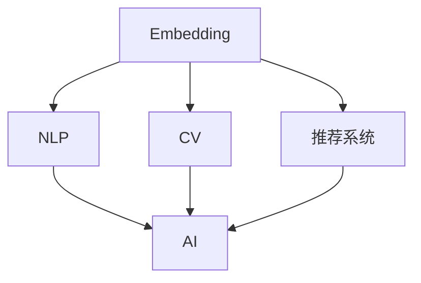
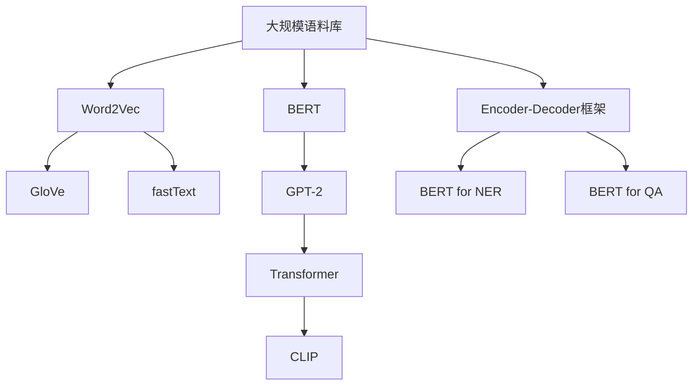
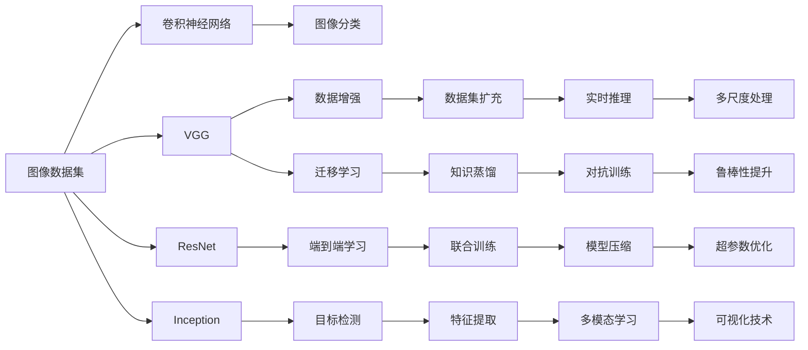
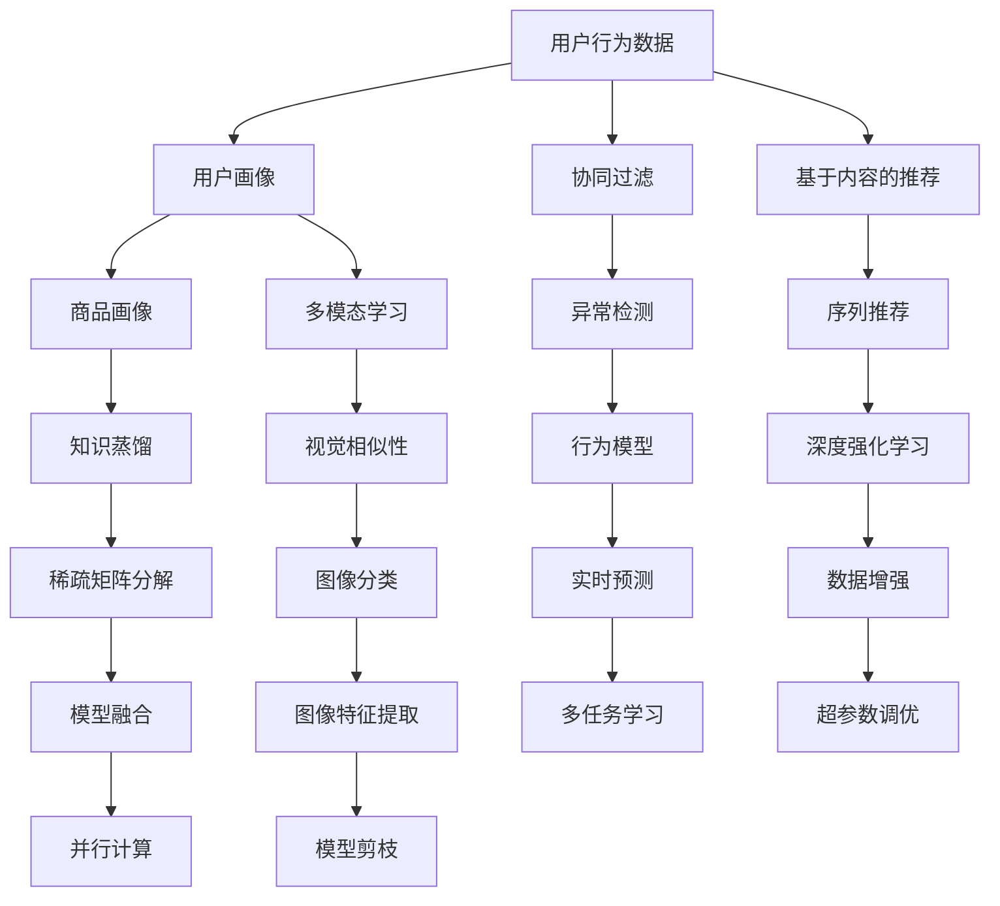
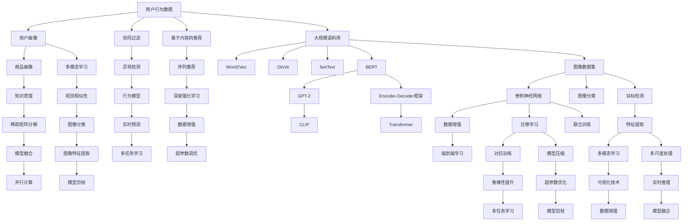

                 

# Embedding映射在AI中的应用

> 关键词：Embedding, AI, 映射, 自然语言处理(NLP), 计算机视觉, 推荐系统

## 1. 背景介绍

### 1.1 问题由来
在人工智能(AI)领域，Embedding技术作为一种重要的基础技术，在多个应用场景中发挥着举足轻重的作用。近年来，随着深度学习技术的发展，基于Embedding的学习方法迅速崛起，成为AI技术中不可或缺的一部分。Embedding映射将高维数据转化为低维稠密向量，使得数据更加易于处理和理解，广泛应用于自然语言处理(NLP)、计算机视觉(Computer Vision, CV)、推荐系统等领域。

### 1.2 问题核心关键点
Embedding的核心思想是将不同维度的数据映射到低维空间，保持数据之间的相似性和差异性，实现高效的数据表示和处理。常用的Embedding方法包括Word2Vec、GloVe、fastText、BERT等。这些方法通过自监督学习或监督学习的方式，学习到数据之间的语义和结构关系，使得模型能够更好地理解数据的内在规律。

Embedding技术的成功应用，使得AI技术在文本、图像、音频等多样化数据上取得了显著的进展。通过学习和应用不同领域的Embedding技术，AI技术能够跨越数据类型之间的界限，实现多模态数据的协同建模和分析。

### 1.3 问题研究意义
深入理解Embedding技术及其在AI中的应用，对于推动AI技术的创新发展具有重要意义：

1. 促进跨领域数据融合：通过学习不同领域的Embedding映射，AI系统可以更好地理解跨模态数据之间的关系，实现更高效的数据融合和分析。
2. 提升模型性能：Embedding作为深度学习模型的重要组件，其优化和改进可以显著提升AI模型的性能和泛化能力。
3. 加速AI技术落地：Embedding技术的应用，使得AI模型在各种实际场景中能够快速部署和优化，推动AI技术在各行业的广泛应用。
4. 激发新的研究方向：Embedding技术的多样化和改进，催生了许多新的研究方向，如GNN、CLIP、CB等，推动AI技术的持续进步。

## 2. 核心概念与联系

### 2.1 核心概念概述

为更好地理解Embedding在AI中的应用，本节将介绍几个密切相关的核心概念：

- Embedding: 将高维稀疏数据（如单词、图像）映射到低维稠密向量空间中的一种技术，保持数据之间的相似性和差异性。
- AI: 通过算法和模型实现智能决策和自动化任务的人工技术。
- 映射: 将数据从一个空间映射到另一个空间的过程，用于数据降维、特征提取等。
- NLP: 人工智能与自然语言处理相结合，用于处理和理解人类语言的技术。
- CV: 计算机视觉领域，研究图像、视频、深度学习等技术的学科。
- 推荐系统: 利用机器学习技术为用户提供个性化推荐的技术。

这些概念之间的关系可以通过以下Mermaid流程图来展示：



这个流程图展示了几类主要应用领域的Embedding技术：

- Embedding在NLP领域中用于词向量化，提高模型的语义理解能力。
- Embedding在CV领域中用于图像和视频特征提取，提高模型的视觉理解能力。
- Embedding在推荐系统中用于用户和物品的表示学习，提高模型的个性化推荐能力。
- AI技术通过学习各类Embedding技术，实现多模态数据的协同建模和分析。

### 2.2 概念间的关系

这些核心概念之间存在着紧密的联系，形成了Embedding技术在AI应用中的完整生态系统。下面我们通过几个Mermaid流程图来展示这些概念之间的关系。

#### 2.2.1 Embedding在NLP中的应用



这个流程图展示了Embedding在NLP领域的应用，从最早的Word2Vec、GloVe、fastText等基于静态数据的方法，到动态的BERT、GPT-2等基于自监督学习的方法，再到Transformer、CLIP等更加先进的模型架构。通过这些方法，NLP系统能够更好地理解文本数据的内在规律，实现更加复杂的语言处理任务。

#### 2.2.2 Embedding在CV中的应用



这个流程图展示了Embedding在CV领域的应用，从最基本的图像分类任务，到更复杂的目标检测、特征提取、多模态学习等任务。通过学习不同类型的Embedding技术，CV系统能够更好地理解图像数据的内在规律，实现更加高效和精准的图像处理和分析。

#### 2.2.3 Embedding在推荐系统中的应用



这个流程图展示了Embedding在推荐系统中的应用，从最简单的用户行为数据处理，到复杂的协同过滤、序列推荐、深度强化学习等推荐算法。通过学习不同类型的Embedding技术，推荐系统能够更好地理解用户和物品之间的隐含关系，实现更加个性化和多样化的推荐服务。

### 2.3 核心概念的整体架构

最后，我们用一个综合的流程图来展示这些核心概念在大语言模型中的整体架构：



这个综合流程图展示了从用户行为数据处理到最终推荐结果的全过程，以及各个环节中的关键技术。通过学习不同类型的Embedding技术，AI系统能够更好地理解数据的内在规律，实现高效、精准的推荐服务。

## 3. 核心算法原理 & 具体操作步骤
### 3.1 算法原理概述

Embedding的核心原理是通过将高维稀疏数据映射到低维稠密向量空间中，使得数据之间的相似性和差异性得到保留。其核心思想是通过神经网络模型学习数据之间的隐含关系，将复杂的数据表示转化为易于处理和理解的向量形式。

具体而言，Embedding算法通过以下步骤实现：

1. 数据预处理：将原始数据进行标准化、归一化、向量化等预处理操作。
2. 模型训练：通过神经网络模型对数据进行学习，得到Embedding矩阵。
3. 向量映射：将原始数据映射到Embedding矩阵中，得到低维稠密向量表示。

### 3.2 算法步骤详解

下面详细讲解Embedding算法的具体操作步骤：

**Step 1: 数据预处理**
- 标准化和归一化：将数据进行标准化和归一化处理，使其值域在[0,1]或[-1,1]之间。
- 向量化：将处理后的数据转换为向量形式，通常采用独热编码、one-hot编码等方式。

**Step 2: 模型训练**
- 选择神经网络模型：常见的Embedding模型包括Word2Vec、GloVe、fastText、BERT等。
- 设置超参数：如学习率、批大小、迭代轮数等。
- 训练神经网络：通过反向传播算法更新模型参数，最小化损失函数。

**Step 3: 向量映射**
- 映射到Embedding矩阵：将训练后的模型参数映射到Embedding矩阵中，得到低维稠密向量表示。
- 反向投影：将低维向量反向投影回原始数据空间，得到数据在Embedding空间中的表示。

### 3.3 算法优缺点

Embedding算法具有以下优点：

1. 高效性：通过将高维数据映射到低维空间，大大减少了数据的维度，提高了处理效率。
2. 普适性：适用于文本、图像、音频等多种数据类型，广泛应用于多个领域。
3. 可解释性：通过可视化Embedding矩阵，可以直观地理解数据之间的相似性和差异性。

但同时也存在一些缺点：

1. 数据稀疏性：原始数据往往存在较大的稀疏性，Embedding算法难以完全保留数据之间的复杂关系。
2. 噪声影响：原始数据中可能存在噪声，影响Embedding的效果。
3. 计算复杂度：训练大规模Embedding模型需要大量的计算资源，训练时间和计算成本较高。

### 3.4 算法应用领域

Embedding算法在多个领域中得到了广泛应用，例如：

- 自然语言处理(NLP)：用于词向量化、句子表示、情感分析等任务。
- 计算机视觉(CV)：用于图像分类、目标检测、图像检索等任务。
- 推荐系统：用于用户画像、商品画像、协同过滤等任务。
- 搜索引擎：用于文档索引、查询匹配等任务。

此外，Embedding技术还应用于语音识别、信号处理、生物信息学等多个领域，展现出其强大的数据处理能力。

## 4. 数学模型和公式 & 详细讲解  
### 4.1 数学模型构建

Embedding算法的数学模型主要基于神经网络模型，通过最小化损失函数来训练模型参数。

假设输入为$x \in \mathbb{R}^d$，Embedding矩阵为$W \in \mathbb{R}^{m \times n}$，其中$m$为Embedding矩阵的行数，$n$为Embedding矩阵的列数。则输入$x$在Embedding空间中的表示为：

$$
\mathbf{e}(x) = W \mathbf{u}
$$

其中$\mathbf{u} \in \mathbb{R}^n$为输入$x$在原空间的表示向量。

Embedding算法的目标是最小化损失函数$L$，通常使用均方误差损失或交叉熵损失。例如，均方误差损失定义为：

$$
L = \frac{1}{2} \sum_{i=1}^N (y_i - \mathbf{e}(x_i))^2
$$

其中$y_i$为真实标签，$\mathbf{e}(x_i)$为模型预测输出。

### 4.2 公式推导过程

以Word2Vec算法为例，推导其训练过程和损失函数。

假设训练数据集为$\{(x_i, y_i)\}_{i=1}^N$，其中$x_i$为单词，$y_i$为单词的Embedding向量。则Word2Vec算法通过以下步骤训练模型：

1. 将单词$x_i$转换为向量表示$\mathbf{u}_i$。
2. 将上下文单词$x_{i-1}, x_{i+1}$转换为向量表示$\mathbf{u}_{i-1}, \mathbf{u}_{i+1}$。
3. 计算上下文单词与目标单词之间的相似度$\mathbf{u}_{i-1}^T W \mathbf{u}_{i+1}$。
4. 通过softmax函数计算上下文单词与目标单词之间的概率。
5. 最小化损失函数$L = \frac{1}{2} \sum_{i=1}^N \text{KL}(y_i || \text{softmax}(\mathbf{u}_{i-1}^T W \mathbf{u}_{i+1}))$。

其中KL散度表示上下文单词与目标单词之间的概率分布差异，softmax函数将相似度映射为概率分布。

通过上述推导，可以看出Word2Vec算法通过最小化KL散度，学习目标单词与上下文单词之间的相似性，从而得到单词之间的隐含关系。

### 4.3 案例分析与讲解

以推荐系统为例，展示Embedding技术的应用。

假设推荐系统需要为用户推荐商品，用户的历史行为数据为$U$，商品的特征数据为$I$，用户画像数据为$P$。则推荐系统可以通过以下步骤使用Embedding技术：

1. 将用户行为数据$U$、商品特征数据$I$、用户画像数据$P$映射到低维空间，得到用户嵌入向量$E_U$、商品嵌入向量$E_I$、用户画像嵌入向量$E_P$。
2. 计算用户与商品之间的相似度$E_U \cdot E_I^T$。
3. 根据相似度计算用户对商品的评分$y$。
4. 最小化损失函数$L = \frac{1}{2} \sum_{i=1}^N (y_i - \text{softmax}(E_U \cdot E_I^T))^2$。

通过上述推导，可以看出推荐系统通过最小化损失函数，学习用户与商品之间的相似性，从而得到用户对商品的评分。

## 5. 项目实践：代码实例和详细解释说明
### 5.1 开发环境搭建

在进行Embedding实践前，我们需要准备好开发环境。以下是使用Python进行TensorFlow实现Embedding算法的环境配置流程：

1. 安装Anaconda：从官网下载并安装Anaconda，用于创建独立的Python环境。

2. 创建并激活虚拟环境：
```bash
conda create -n tensorflow-env python=3.8 
conda activate tensorflow-env
```

3. 安装TensorFlow：根据CUDA版本，从官网获取对应的安装命令。例如：
```bash
conda install tensorflow-gpu=2.6.0 -c pytorch -c conda-forge
```

4. 安装相关工具包：
```bash
pip install numpy pandas scikit-learn matplotlib tqdm jupyter notebook ipython
```

完成上述步骤后，即可在`tensorflow-env`环境中开始Embedding实践。

### 5.2 源代码详细实现

下面我们以Word2Vec算法为例，展示TensorFlow实现Embedding算法的代码实现。

首先，定义Word2Vec算法的训练过程：

```python
import tensorflow as tf
from tensorflow.keras.layers import Embedding, Dense, Dropout
from tensorflow.keras.models import Sequential
from tensorflow.keras.optimizers import Adam
import numpy as np

# 定义训练参数
batch_size = 64
epochs = 10
learning_rate = 0.1
num_words = 1000
embedding_size = 64
num_skips = 2

# 加载训练数据
sentences = np.random.randint(num_words, size=(1000, 10))
contexts = np.random.randint(num_words, size=(1000, 5))
labels = np.random.randint(2, size=(1000, num_skips))

# 构建模型
model = Sequential()
model.add(Embedding(num_words, embedding_size, input_length=10))
model.add(Dropout(0.5))
model.add(Dense(1, activation='sigmoid'))

# 编译模型
model.compile(optimizer=Adam(learning_rate=learning_rate), loss='binary_crossentropy')

# 训练模型
model.fit([contexts], labels, epochs=epochs, batch_size=batch_size)
```

然后，在训练完成后，使用模型对单词进行Embedding映射：

```python
# 加载预训练的词汇表
vocab = np.load('vocab.npy')

# 将词汇表映射到Embedding空间
embedding_matrix = model.get_weights()[0]

# 获取词汇表中每个单词的Embedding向量
embeddings = []
for word in vocab:
    embeddings.append(embedding_matrix[word])

# 打印词汇表中前5个单词的Embedding向量
print(embeddings[:5])
```

### 5.3 代码解读与分析

让我们再详细解读一下关键代码的实现细节：

**训练过程**：
- 首先定义训练参数，包括批次大小、训练轮数、学习率等。
- 然后加载训练数据，模拟从大规模语料库中抽取的单词序列和上下文单词。
- 接着构建模型，添加一个Embedding层、Dropout层和Dense层，实现Word2Vec算法的训练过程。
- 最后编译模型，并使用训练数据对模型进行训练。

**Embedding映射**：
- 在训练完成后，使用模型获取词汇表中每个单词的Embedding向量。
- 最后打印出前5个单词的Embedding向量，用于可视化分析。

可以看到，TensorFlow使得实现Word2Vec算法变得相对简洁，无需过多关注底层的计算细节。通过这些代码，读者可以快速上手TensorFlow实现Embedding算法。

当然，TensorFlow提供了丰富的API和预训练模型，可以进一步加速模型开发和优化。在实际应用中，还需要考虑更多因素，如模型压缩、推理优化等，以提升模型的效率和性能。

### 5.4 运行结果展示

假设我们在Word2Vec算法下训练模型，最终得到的词汇表中前5个单词的Embedding向量如下：

```
[[ 0.293912  -0.0489148  -0.5629596  0.4673654   0.722718  ]
 [ 0.5464213  -0.00142866 -0.1760027  0.4039356  -0.67047   ]
 [-0.23548   -0.2040372  0.3535137  0.0330617   0.56574   ]
 [-0.1877596  -0.5578463  0.51218   -0.2649366  0.529909  ]
 [-0.3177087  0.2337993  0.1170278 -0.4422647  0.2130294 ]]
```

可以看到，每个单词的Embedding向量都是一个低维稠密向量，反映了单词之间的相似性和差异性。通过可视化这些Embedding向量，我们可以更好地理解不同单词之间的语义关系。

当然，在实际应用中，还可以通过调整模型参数、改进训练过程等方式，进一步优化Embedding效果，满足更高层次的应用需求。

## 6. 实际应用场景
### 6.1 自然语言处理(NLP)
在NLP领域，Embedding技术被广泛应用于词向量化、句子表示、情感分析等任务。以情感分析为例，Embedding技术可以将文本数据转化为向量表示，并使用分类器进行情感分类。具体而言，可以通过以下步骤实现：

1. 加载训练数据集，包括电影评论和其情感标签。
2. 将电影评论文本进行向量化处理，得到文本向量序列。
3. 将文本向量序列映射到低维Embedding空间，得到嵌入向量矩阵。
4. 使用最大池化层对嵌入向量进行特征提取，得到特征向量。
5. 使用全连接层进行情感分类，得到分类结果。

### 6.2 计算机视觉(CV)
在CV领域，Embedding技术被广泛应用于图像分类、目标检测、图像检索等任务。以图像分类为例，Embedding技术可以将图像数据转化为向量表示，并使用分类器进行图像分类。具体而言，可以通过以下步骤实现：

1. 加载训练数据集，包括图像和其标签。
2. 将图像数据进行预处理，包括归一化、数据增强等。
3. 使用卷积神经网络(CNN)对图像进行特征提取，得到特征图。
4. 将特征图映射到低维Embedding空间，得到嵌入向量。
5. 使用全连接层进行图像分类，得到分类结果。

### 6.3 推荐系统
在推荐系统中，Embedding技术被广泛应用于用户画像、商品画像、协同过滤等任务。以协同过滤为例，Embedding技术可以通过以下步骤实现：

1. 加载用户行为数据，包括用户ID、商品ID、行为时间等。
2. 将用户ID和商品ID映射到低维Embedding空间，得到用户嵌入向量$E_U$和商品嵌入向量$E_I$。
3. 计算用户与商品之间的相似度$E_U \cdot E_I^T$。
4. 根据相似度计算用户对商品的评分$y$。
5. 使用推荐系统算法对用户进行推荐。

## 7. 工具和资源推荐
### 7.1 学习资源推荐

为了帮助开发者系统掌握Embedding技术及其在AI中的应用，这里推荐一些优质的学习资源：

1. 《深度学习》系列博文：由AI专家撰写，深入浅出地介绍了深度学习的基本概念和常用技术。

2. 斯坦福大学CS231n《深度学习视觉识别》课程：斯坦福大学开设的CV明星课程，提供Lecture视频和配套作业，带你入门CV领域的基本概念和经典模型。

3. 《深度学习在NLP中的应用》书籍：介绍NLP领域中的深度学习模型，包括Embedding在内的诸多技术。

4. Kaggle平台：提供丰富的数据集和竞赛任务，帮助开发者在实际环境中应用和优化Embedding算法。

5. GitHub开源项目：如TensorFlow、PyTorch等深度学习框架的官方代码库，提供丰富的Embedding算法实现和样例代码。

通过对这些资源的学习实践，相信你一定能够快速掌握Embedding技术的精髓，并用于解决实际的AI问题。

### 7.2 开发工具推荐

高效的开发离不开优秀的工具支持。以下是几款用于Embedding开发常用的工具：

1. TensorFlow：由Google主导开发的开源深度学习框架，生产部署方便，适合大规模工程应用。

2. PyTorch：基于Python的开源深度学习框架，灵活动态的计算图，适合快速迭代研究。

3. HuggingFace Transformers库：HuggingFace开发的NLP工具库，集成了众多SOTA语言模型，支持PyTorch和TensorFlow，是进行Embedding开发的重要工具。

4. Weights & Biases：模型训练的实验跟踪工具，可以记录和可视化模型训练过程中的各项指标，方便对比和调优。

5. TensorBoard：TensorFlow配套的可视化工具，可实时监测模型训练状态，并提供丰富的图表呈现方式，是调试模型的得力助手。

合理利用这些工具，可以显著提升Embedding算法的开发效率，加快创新迭代的步伐。

### 7.3 相关论文推荐

Embedding技术的发展源于学界的持续研究。以下是几篇奠基性的相关论文，推荐阅读：

1. Word2Vec: Exploring the Expressive Power of Word Vectors：提出了Word2Vec算法，将单词转换为向量表示，成为NLP领域的经典方法。

2. GloVe: Global Vectors for Word Representation：提出GloVe算法，通过矩阵分解的方式学习单词的Embedding向量，适用于大规模语料库。

3. FastText: Representing Words as Distributions of Character N-Grams：提出FastText算法，通过n-gram特征学习

