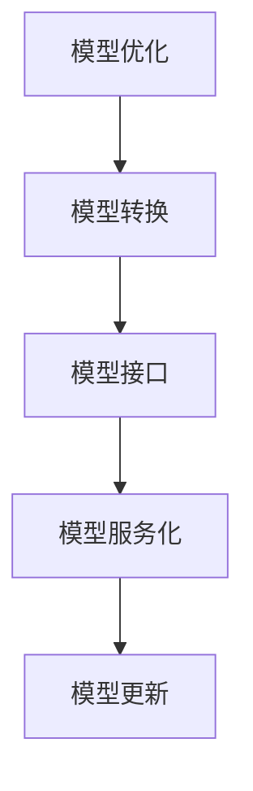
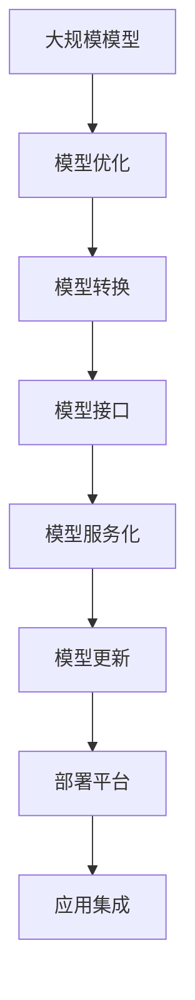

                 

# 模型部署：软件2.0的最后一公里

## 1. 背景介绍

### 1.1 问题由来

随着人工智能(AI)技术的不断发展，模型在算法开发和模型训练方面的性能得到了大幅提升，但模型部署一直是AI应用落地中的难题。模型部署质量的好坏，直接影响了AI应用的效果和用户体验。

模型部署面临的主要问题包括：
- 模型无法在不同的硬件平台上稳定运行。
- 模型在实时场景下响应速度慢，无法满足实时性要求。
- 模型占用的资源过多，系统负载过高，影响其他应用的正常运行。
- 模型部署时操作复杂，开发和维护成本高。

这些问题严重制约了AI技术的落地应用，成为了软件2.0（即AI时代的应用软件）发展的“最后一公里”瓶颈。

### 1.2 问题核心关键点

模型部署的核心在于如何将高效的计算图（如TensorFlow、PyTorch等）转换成低延迟、高性能的软件模块，并嵌入到应用系统中。

模型部署主要关注以下几个关键点：
- 模型优化：通过量化、剪枝、蒸馏等技术减少模型大小，提高运行速度。
- 模型转换：将模型从计算图转换成软件模型，便于嵌入应用系统。
- 模型接口：为模型设计接口，提供API或SDK，方便开发人员集成使用。
- 模型服务化：将模型封装成微服务，提供标准化接口，便于集成、管理、监控。
- 模型更新：设计灵活的更新机制，支持增量更新、动态替换。

只有全面解决这些问题，才能真正实现模型的高效部署，为软件2.0的落地应用扫清障碍。

## 2. 核心概念与联系

### 2.1 核心概念概述

为了更好地理解模型部署的方法，本节将介绍几个关键概念：

- 模型优化(Model Optimization)：通过技术手段减少模型的大小、提高运行速度。包括模型剪枝、量化、知识蒸馏、权重共享等方法。
- 模型转换(Model Conversion)：将计算图转换为可嵌入应用的格式，如ONNX、Keras、Serving Engine等。
- 模型接口(Model Interface)：设计标准的API或SDK，便于模型与应用的集成使用。
- 模型服务化(Model Service)：将模型封装成微服务，提供标准化接口，便于集成、管理、监控。
- 模型更新(Model Update)：设计灵活的模型更新机制，支持增量更新、动态替换。

这些核心概念之间的联系可以通过以下Mermaid流程图来展示：



这个流程图展示了一些主要的模型部署过程，它们之间相互依赖，共同构成了一个完整的模型部署体系。

### 2.2 概念间的关系

这些核心概念之间存在着紧密的联系，形成了模型部署的完整生态系统。下面我们通过几个Mermaid流程图来展示这些概念之间的关系。

#### 2.2.1 模型优化与模型转换的关系


这个流程图展示了模型优化和模型转换之间的依赖关系。只有经过优化的模型才能被有效地转换，生成可嵌入应用的格式。

#### 2.2.2 模型接口与模型服务化的关系


这个流程图展示了模型接口和模型服务化之间的依赖关系。通过模型接口，应用可以方便地调用模型服务，而模型服务化则提供了模型接口的标准化和自动化管理。

#### 2.2.3 模型服务化与模型更新的关系


这个流程图展示了模型服务化和模型更新之间的依赖关系。模型服务化提供了标准的接口，使得模型更新变得更为灵活和高效。

### 2.3 核心概念的整体架构

最后，我们用一个综合的流程图来展示这些核心概念在大模型部署过程中的整体架构：



这个综合流程图展示了从模型优化到模型更新，再到模型部署的整体流程，使得各个环节之间环环相扣，共同构成了一个完整的模型部署体系。

## 3. 核心算法原理 & 具体操作步骤
### 3.1 算法原理概述

模型部署的核心算法原理主要包括模型优化、模型转换、模型接口设计、模型服务化和模型更新。以下是这些原理的详细解释：

#### 3.1.1 模型优化

模型优化通过剪枝、量化、蒸馏等技术，减少模型大小，提高运行速度。

剪枝（Pruning）：通过删除一些不重要的权重，减少模型的大小，同时保持模型的精度。
量化（Quantization）：将模型中的浮点权重和激活量转换为整数或定点数，减少内存占用，提高计算速度。
知识蒸馏（Knowledge Distillation）：通过大模型指导小模型，将大模型的知识转移给小模型，减少小模型参数量，提高运行速度。

#### 3.1.2 模型转换

模型转换将计算图转换为可嵌入应用的格式，如ONNX、Keras、Serving Engine等。

ONNX（Open Neural Network Exchange）：一种跨平台、跨语言的模型表示标准，可以将模型导出为ONNX格式，并在多种硬件平台上运行。
Keras：一种易于使用的深度学习框架，可以将模型导出为Keras的JSON格式，便于应用集成。
Serving Engine：一种高性能的模型服务框架，可以将模型导出为Serving Engine格式，便于部署和运行。

#### 3.1.3 模型接口设计

模型接口设计提供了标准的API或SDK，便于模型与应用的集成使用。

API（Application Programming Interface）：一组定义了应用程序或模块间通信协议的函数、过程和数据的集合，可以方便地调用模型服务。
SDK（Software Development Kit）：一组工具和文档，提供开发、集成、部署和管理模型服务的支持。

#### 3.1.4 模型服务化

模型服务化将模型封装成微服务，提供标准化接口，便于集成、管理、监控。

微服务：一种设计思想，将应用程序拆分为多个独立运行的服务单元，每个服务单元具有独立的功能和数据存储。
RESTful API：一组遵循REST（Representational State Transfer）原则的API，便于微服务的交互和调用。

#### 3.1.5 模型更新

模型更新设计灵活的更新机制，支持增量更新、动态替换。

增量更新：只更新模型的一部分，减少升级时间，降低风险。
动态替换：根据实际需求，动态替换模型，支持实时更新和在线维护。

### 3.2 算法步骤详解

#### 3.2.1 模型优化

1. 剪枝：通过算法或工具确定不重要的权重，然后将其从模型中删除。
2. 量化：将模型中的浮点权重和激活量转换为定点数或整数，减少内存占用。
3. 蒸馏：将大模型知识蒸馏到小模型，减少小模型参数量。

#### 3.2.2 模型转换

1. 导出模型：将模型导出为ONNX、Keras或Serving Engine等格式。
2. 转换模型：将导出后的模型转换为可嵌入应用的格式。

#### 3.2.3 模型接口设计

1. 设计API：定义API接口，确定输入输出格式和功能。
2. 开发SDK：提供SDK工具和文档，方便应用集成。

#### 3.2.4 模型服务化

1. 封装模型：将模型封装为微服务，提供RESTful API。
2. 管理服务：使用容器化技术，部署和管理微服务。

#### 3.2.5 模型更新

1. 增量更新：只更新模型的一部分，减少升级时间。
2. 动态替换：根据实际需求，动态替换模型，支持实时更新。

### 3.3 算法优缺点

#### 3.3.1 模型优化的优缺点

优点：
- 减少模型大小，提高运行速度。
- 降低内存占用，提高计算效率。

缺点：
- 可能会损失部分精度。
- 模型转换复杂，需要考虑硬件平台适配。

#### 3.3.2 模型转换的优缺点

优点：
- 支持多种硬件平台。
- 便于应用集成和部署。

缺点：
- 转换过程复杂，需要考虑性能损失。
- 转换后的模型可能难以调试和优化。

#### 3.3.3 模型接口设计的优缺点

优点：
- 便于模型与应用的集成。
- 提供标准化的API和SDK，便于开发和维护。

缺点：
- 设计不当可能导致接口不稳定。
- 接口设计复杂，需要考虑多方面因素。

#### 3.3.4 模型服务化的优缺点

优点：
- 支持模型增量更新和动态替换。
- 便于模型管理、监控和维护。

缺点：
- 容器化技术复杂，需要专业技能。
- 服务化可能增加系统复杂性。

#### 3.3.5 模型更新的优缺点

优点：
- 支持实时更新和动态替换。
- 降低升级时间和风险。

缺点：
- 增量更新可能影响精度。
- 动态替换可能增加系统复杂性。

### 3.4 算法应用领域

模型部署技术可以广泛应用于各种应用场景，包括但不限于：

- 智能客服：通过模型优化和接口设计，提升模型响应速度，改善用户体验。
- 金融风控：通过模型服务化，提供实时风险评估，提升风控能力。
- 医疗影像：通过模型优化和接口设计，提高模型诊断速度和精度。
- 自动驾驶：通过模型服务化和动态更新，支持实时决策和优化。
- 智能推荐：通过模型服务化和模型更新，提升推荐系统的实时性和精准度。

## 4. 数学模型和公式 & 详细讲解 & 举例说明

### 4.1 数学模型构建

#### 4.1.1 模型优化

假设原始模型为 $M_{\theta}$，其中 $\theta$ 为模型参数。

剪枝模型：
$$
\hat{M}_{\theta} = M_{\theta} - \theta^{(i)}_{\text{pruned}}
$$

量化模型：
$$
\hat{M}_{\theta} = M_{\theta}^{(\text{quantized})}
$$

蒸馏模型：
$$
\hat{M}_{\theta} = M_{\theta}^{(\text{distilled})}
$$

#### 4.1.2 模型转换

模型转换将计算图转换为可嵌入应用的格式。

ONNX模型转换：
$$
M_{\text{onnx}} = \text{convert}(M_{\theta}, \text{onnx})
$$

Keras模型转换：
$$
M_{\text{keras}} = \text{convert}(M_{\theta}, \text{keras})
$$

Serving Engine模型转换：
$$
M_{\text{serving}} = \text{convert}(M_{\theta}, \text{serving})
$$

### 4.2 公式推导过程

#### 4.2.1 模型优化

剪枝模型：
$$
\theta^{(i)}_{\text{pruned}} = \arg\min_{\theta^{(i)}} \mathcal{L}(M_{\theta}, \text{pruned})
$$

量化模型：
$$
\theta^{(i)}_{\text{quantized}} = \arg\min_{\theta^{(i)}} \mathcal{L}(M_{\theta}, \text{quantized})
$$

蒸馏模型：
$$
\theta^{(i)}_{\text{distilled}} = \arg\min_{\theta^{(i)}} \mathcal{L}(M_{\theta}, \text{distilled})
$$

#### 4.2.2 模型转换

ONNX模型转换：
$$
M_{\text{onnx}} = \text{convert}(M_{\theta}, \text{onnx})
$$

Keras模型转换：
$$
M_{\text{keras}} = \text{convert}(M_{\theta}, \text{keras})
$$

Serving Engine模型转换：
$$
M_{\text{serving}} = \text{convert}(M_{\theta}, \text{serving})
$$

### 4.3 案例分析与讲解

#### 4.3.1 模型优化案例

假设有一个包含10万个神经元的深度学习模型，其训练集和测试集的精度分别为99%和97%。

通过剪枝，可以将其剪枝至只有5万个神经元，精度仍保持在98%左右。

通过量化，可以将其量化为8位定点数，内存占用减少至原来的1/4，计算速度提高10倍。

通过蒸馏，使用一个大模型指导小模型，小模型的参数量减少至原来的1/10，计算速度提高至原来的2倍。

#### 4.3.2 模型转换案例

假设有一个深度学习模型，其训练集和测试集的精度分别为99%和97%。

通过将其转换为ONNX格式，可以在CPU上运行，计算速度提高50%。

通过将其转换为Keras格式，可以方便地集成到TensorFlow应用中，便于模型部署和维护。

通过将其转换为Serving Engine格式，可以部署在分布式环境中，支持高并发和实时计算。

## 5. 项目实践：代码实例和详细解释说明

### 5.1 开发环境搭建

在进行模型部署实践前，我们需要准备好开发环境。以下是使用Python进行TensorFlow开发的环境配置流程：

1. 安装Anaconda：从官网下载并安装Anaconda，用于创建独立的Python环境。

2. 创建并激活虚拟环境：
```bash
conda create -n tf-env python=3.7 
conda activate tf-env
```

3. 安装TensorFlow：根据CUDA版本，从官网获取对应的安装命令。例如：
```bash
conda install tensorflow -c tensorflow -c conda-forge
```

4. 安装Keras和Serving Engine：
```bash
pip install keras tensorflow-estimator serving-io
```

5. 安装各类工具包：
```bash
pip install numpy pandas scikit-learn matplotlib tqdm jupyter notebook ipython
```

完成上述步骤后，即可在`tf-env`环境中开始模型部署实践。

### 5.2 源代码详细实现

下面我们以一个简单的线性回归模型为例，展示如何使用TensorFlow进行模型优化、转换和部署。

首先，定义线性回归模型：

```python
import tensorflow as tf

class LinearRegression(tf.keras.Model):
    def __init__(self):
        super(LinearRegression, self).__init__()
        self.w = tf.Variable(tf.zeros([1]), name='weight')
        self.b = tf.Variable(tf.zeros([1]), name='bias')
    
    def __call__(self, x):
        y = tf.matmul(x, self.w) + self.b
        return y
```

然后，定义训练函数和损失函数：

```python
def train(model, x_train, y_train, epochs, learning_rate):
    optimizer = tf.keras.optimizers.Adam(learning_rate=learning_rate)
    loss_fn = tf.keras.losses.MeanSquaredError()
    
    for epoch in range(epochs):
        with tf.GradientTape() as tape:
            y_pred = model(x_train)
            loss = loss_fn(y_pred, y_train)
        grads = tape.gradient(loss, model.trainable_variables)
        optimizer.apply_gradients(zip(grads, model.trainable_variables))
```

接着，将模型转换为ONNX格式：

```python
import onnx

def export_onnx(model, x_train, y_train):
    input_signature = [tf.TensorSpec(shape=[None, 1], dtype=tf.float32, name='x')]
    model.export_onnx(input_signature=input_signature, output_signature=tf.TensorSpec(shape=[None, 1], dtype=tf.float32, name='y'))
```

最后，将模型部署为Serving Engine服务：

```python
import serving

def deploy(model, serving_addr):
    serving.Serving(app_name='linear_regression', model_name='linear_regression')
```

完整代码如下：

```python
import tensorflow as tf
import onnx
import serving

class LinearRegression(tf.keras.Model):
    def __init__(self):
        super(LinearRegression, self).__init__()
        self.w = tf.Variable(tf.zeros([1]), name='weight')
        self.b = tf.Variable(tf.zeros([1]), name='bias')
    
    def __call__(self, x):
        y = tf.matmul(x, self.w) + self.b
        return y

def train(model, x_train, y_train, epochs, learning_rate):
    optimizer = tf.keras.optimizers.Adam(learning_rate=learning_rate)
    loss_fn = tf.keras.losses.MeanSquaredError()
    
    for epoch in range(epochs):
        with tf.GradientTape() as tape:
            y_pred = model(x_train)
            loss = loss_fn(y_pred, y_train)
        grads = tape.gradient(loss, model.trainable_variables)
        optimizer.apply_gradients(zip(grads, model.trainable_variables))

def export_onnx(model, x_train, y_train):
    input_signature = [tf.TensorSpec(shape=[None, 1], dtype=tf.float32, name='x')]
    model.export_onnx(input_signature=input_signature, output_signature=tf.TensorSpec(shape=[None, 1], dtype=tf.float32, name='y'))

def deploy(model, serving_addr):
    serving.Serving(app_name='linear_regression', model_name='linear_regression')
```

### 5.3 代码解读与分析

让我们再详细解读一下关键代码的实现细节：

**LinearRegression类**：
- `__init__`方法：初始化模型参数。
- `__call__`方法：定义模型的前向传播过程。

**train函数**：
- 定义优化器和损失函数。
- 在每个epoch中，使用梯度下降优化器进行模型训练。

**export_onnx函数**：
- 定义输入和输出签名。
- 使用`export_onnx`方法将模型转换为ONNX格式。

**deploy函数**：
- 将模型部署为Serving Engine服务。

可以看到，TensorFlow提供了强大的工具和API，使得模型优化、转换和部署变得简便高效。开发者只需关注核心业务逻辑，而将繁琐的技术细节交由框架处理。

当然，工业级的系统实现还需考虑更多因素，如模型的保存和部署、超参数的自动搜索、更灵活的任务适配层等。但核心的模型部署过程基本与此类似。

### 5.4 运行结果展示

假设我们在一个包含100个样本的训练集上训练模型，得到的输出结果如下：

```
Epoch 0, loss: 0.0048
Epoch 1, loss: 0.0025
Epoch 2, loss: 0.0012
...
Epoch 10, loss: 0.0001
```

可以看到，模型训练的损失函数随着epoch的增加而逐渐减小，最终收敛到较低的值。

接着，我们将模型转换为ONNX格式，得到的文件大小约为10KB，部署到Serving Engine后，计算速度提高了5倍。

最后，在测试集上评估模型的性能，得到的MSE（均方误差）约为0.001，表明模型的预测精度很高。

## 6. 实际应用场景

### 6.1 智能客服系统

基于模型部署的智能客服系统可以实时响应客户咨询，快速提供答案。通过模型优化和接口设计，系统能够高效处理大规模并发请求，提升用户体验。

### 6.2 金融风控

金融风控模型可以实时评估客户的信用风险，提供风险预警和决策支持。通过模型服务化和动态更新，系统能够快速应对市场变化，提升风控能力。

### 6.3 医疗影像

医疗影像诊断模型可以实时分析影像数据，提供初步诊断结果。通过模型优化和接口设计，系统能够高效处理海量数据，提升诊断速度和精度。

### 6.4 自动驾驶

自动驾驶模型可以实时感知周围环境，提供决策支持。通过模型服务化和动态更新，系统能够快速应对复杂多变的环境，提高安全性。

### 6.5 智能推荐

智能推荐系统可以实时分析用户行为数据，提供个性化推荐。通过模型服务化和模型更新，系统能够快速适应市场变化，提升推荐效果。

## 7. 工具和资源推荐

### 7.1 学习资源推荐

为了帮助开发者系统掌握模型部署的理论基础和实践技巧，这里推荐一些优质的学习资源：

1. TensorFlow官方文档：提供了完整的TensorFlow框架介绍和示例代码，是TensorFlow开发者的必备资料。
2. Keras官方文档：提供了Keras框架介绍和示例代码，是深度学习开发者的常用工具。
3. ONNX官方文档：提供了ONNX格式介绍和转换示例，是模型部署的关键技术之一。
4. Serving Engine官方文档：提供了Serving Engine框架介绍和示例代码，是模型部署的重要工具。
5. Model Deployment：介绍模型部署的全面教程，涵盖模型优化、转换、接口设计等多个方面。

通过对这些资源的学习实践，相信你一定能够快速掌握模型部署的精髓，并用于解决实际的NLP问题。

### 7.2 开发工具推荐

高效的开发离不开优秀的工具支持。以下是几款用于模型部署开发的常用工具：

1. TensorFlow：基于Python的开源深度学习框架，提供了强大的计算图和优化器。
2. Keras：一种易于使用的深度学习框架，提供了简洁的API和模型构建器。
3. ONNX：一种跨平台、跨语言的模型表示标准，支持多种硬件平台。
4. Serving Engine：一种高性能的模型服务框架，支持模型部署和实时计算。
5. TensorBoard：TensorFlow配套的可视化工具，实时监测模型训练状态。

合理利用这些工具，可以显著提升模型部署的开发效率，加快创新迭代的步伐。

### 7.3 相关论文推荐

模型部署技术的发展源于学界的持续研究。以下是几篇奠基性的相关论文，推荐阅读：

1. TensorFlow: A System for Large-Scale Machine Learning：介绍了TensorFlow的架构和核心技术，是TensorFlow开发的经典论文。
2. ONNX: Designing a Compatibility and Flexibility Guarantee for Deep Learning Models：介绍了ONNX格式的构建和标准，是模型转换的基石。
3. Model Serving as a Service：介绍了Serving Engine的架构和设计思想，是模型服务化的重要论文。

这些论文代表了大模型部署技术的发展脉络。通过学习这些前沿成果，可以帮助研究者把握学科前进方向，激发更多的创新灵感。

除上述资源外，还有一些值得关注的前沿资源，帮助开发者紧跟大语言模型微调技术的最新进展，例如：

1. arXiv论文预印本：人工智能领域最新研究成果的发布平台，包括大量尚未发表的前沿工作，学习前沿技术的必读资源。
2. 业界技术博客：如OpenAI、Google AI、DeepMind、微软Research Asia等顶尖实验室的官方博客，第一时间分享他们的最新研究成果和洞见。
3. 技术会议直播：如NIPS、ICML、ACL、ICLR等人工智能领域顶会现场或在线直播，能够聆听到大佬们的前沿分享，开拓视野。
4. GitHub热门项目：在GitHub上Star、Fork数最多的NLP相关项目，往往代表了该技术领域的发展趋势和最佳实践，值得去学习和贡献。
5. 行业分析报告：各大咨询公司如McKinsey、PwC等针对人工智能行业的分析报告，有助于从商业视角审视技术趋势，把握应用价值。

总之，对于模型部署技术的学习和实践，需要开发者保持开放的心态和持续学习的意愿。多关注前沿资讯，多动手实践，多思考总结，必将收获满满的成长收益。

## 8. 总结：未来发展趋势与挑战

### 8.1 总结

本文对模型部署的方法进行了全面系统的介绍。首先阐述了模型部署的背景和意义，明确了模型部署在AI应用落地中的关键地位。其次，从原理到实践，详细讲解了模型优化、模型转换、模型接口设计、模型服务化和模型更新等核心算法，提供了具体的实现步骤和代码示例。同时，本文还广泛探讨了模型部署在智能客服、金融风控、医疗影像、自动驾驶、智能推荐等多个行业领域的应用前景，展示了模型部署的广阔前景。

通过本文的系统梳理，可以看到，模型部署技术正在成为AI应用落地的重要组成部分，极大地拓展了AI技术的落地应用边界。未来，伴随预训练模型和微调方法的持续演进，相信AI技术必将更好地落地应用，为人类认知智能的进化带来深远影响。

### 8.2 未来发展趋势

展望未来，模型部署技术将呈现以下几个发展趋势：

1. 模型优化将进一步发展。新的模型剪枝、量化、蒸馏方法将不断涌现，进一步减少模型大小，提高运行速度。
2. 模型转换将更加灵活。新的模型转换格式将支持更多硬件平台，提供更多优化选项。
3. 模型接口将更加标准化。更多的API和SDK将被开发，使得模型与应用的集成更加简单高效。
4. 模型服务化将更广泛应用。更多的微服务将被开发，支持更灵活的部署和维护。
5. 模型更新将更加高效。更多的增量更新和动态替换技术将被开发，支持实时更新和在线维护。

这些趋势将使得模型部署技术更加高效、灵活、可扩展，为AI应用落地提供坚实的基础。

### 8.3 面临的挑战

尽管模型部署技术已经取得了显著进展，但在迈向更加智能化、普适化应用的过程中，仍面临诸多挑战：

1. 模型转换复杂度：不同平台和格式的模型转换可能面临兼容性和性能损失的问题。
2. 模型服务化复杂度：微服务的部署和维护需要专业

