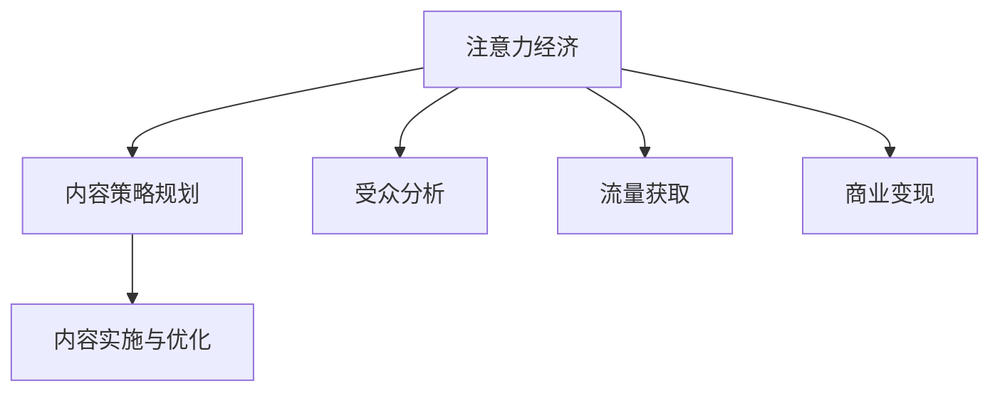

                 

# 注意力经济与内容策略规划与实施：吸引并留住受众

在数字化时代，注意力成为了一种稀缺资源。如何有效利用有限的注意力资源，吸引受众关注，并使其持续留存，成为各大平台和内容创作者共同面临的重要挑战。本文将深入探讨注意力经济的内在机制，详细阐述内容策略规划与实施的核心方法，并提供一系列工具和资源推荐，助力各方在竞争激烈的数字环境中脱颖而出。

## 1. 背景介绍

### 1.1 问题由来

在信息爆炸的时代，注意力稀缺成为制约内容传播的关键因素。随着智能手机的普及和移动互联网的广泛应用，人们获取信息的方式发生了根本性变化。短视频、社交媒体、新闻推送等即时信息源层出不穷，吸引了大量的注意力，导致传统长文、电视等形式的内容受到冷落。

这种趋势催生了“注意力经济”的概念，即通过有效吸引和利用受众的注意力，实现商业价值和影响力的最大化。例如，短视频平台抖音、微信朋友圈等通过算法推荐系统，精准推送个性化内容，极大提升了用户黏性。

### 1.2 问题核心关键点

注意力经济的核心在于如何高效利用受众的注意力资源。以下是几个关键问题：
1. **注意力获取**：如何设计和优化内容，吸引受众的注意力。
2. **注意力维持**：如何保持受众的兴趣，避免其流失。
3. **注意力转化**：如何通过注意力，实现商业价值的提升。
4. **注意力测量**：如何衡量注意力效果，并进行持续优化。

### 1.3 问题研究意义

在数字化和信息化的浪潮中，注意力经济不仅是提升内容影响力的重要途径，更是商业变现的核心战略。掌握注意力经济的运作机制，能够帮助企业、媒体、内容创作者更好地理解受众行为，制定有效的策略，实现持续增长。

## 2. 核心概念与联系

### 2.1 核心概念概述

本节将介绍几个核心概念，并阐述它们之间的联系：

- **注意力经济**：指通过有效吸引和利用受众的注意力，实现商业价值和影响力的最大化。
- **内容策略规划**：指根据目标受众的特征和需求，制定合理的创作方向和推广计划，以实现内容价值的最大化。
- **内容实施与优化**：指根据内容策略，实际创作和发布内容，并进行持续优化和迭代，以提升效果。

这些概念通过以下Mermaid流程图展示了它们之间的联系：



### 2.2 概念间的关系

这些核心概念之间存在紧密的联系：

- **注意力经济**是目标，指向如何吸引和利用受众的注意力。
- **内容策略规划**是手段，指通过内容创作和传播策略，实现注意力的吸引和维持。
- **内容实施与优化**是过程，指具体的执行和效果提升。
- **受众分析**和**流量获取**是基础，通过了解受众特征和获取流量，才能制定有效的策略。
- **商业变现**是最终目标，指通过注意力经济实现商业价值的最大化。

## 3. 核心算法原理 & 具体操作步骤

### 3.1 算法原理概述

注意力经济的实现，离不开算法技术的支撑。以下是注意力经济的核心算法原理：

- **推荐系统算法**：通过分析用户的历史行为和偏好，预测其对新内容的兴趣，推荐相关的信息流。
- **内容分析算法**：利用自然语言处理（NLP）技术，分析内容的关键词、情感倾向、主题等特征，优化内容策略。
- **用户行为分析算法**：通过用户点击、阅读、互动等行为数据，分析用户的兴趣变化，调整推荐策略。

### 3.2 算法步骤详解

注意力经济的具体操作，一般分为以下几个步骤：

1. **受众分析**：通过用户画像、历史行为等数据，分析受众的兴趣、需求和心理特征，制定初步的内容策略。
2. **内容策略规划**：根据受众分析结果，规划内容的类型、形式、发布频率和推广渠道，设计创意的标题和内容。
3. **内容实施与优化**：根据内容策略，创作并发布内容，通过用户反馈和行为数据，不断调整和优化内容策略。
4. **效果评估**：通过流量、点击率、转化率等指标，评估内容的吸引力和效果，进行持续改进。

### 3.3 算法优缺点

注意力经济的核心算法具有以下优缺点：

#### 优点：

1. **高效触达**：通过算法推荐，能够精准触达目标受众，减少信息噪音。
2. **用户黏性提升**：个性化推荐系统能够持续吸引用户注意力，提升用户留存率。
3. **商业价值实现**：通过精准营销和内容推广，提升商业变现能力。

#### 缺点：

1. **算法偏见**：推荐算法可能存在偏见，导致内容多样性不足。
2. **用户隐私问题**：算法依赖大量用户数据，可能引发隐私保护问题。
3. **冷启动问题**：新用户或冷门内容难以通过算法推荐。

### 3.4 算法应用领域

注意力经济的核心算法广泛应用于各个领域：

- **社交媒体平台**：如微信、微博等，通过算法推荐系统，提升用户黏性和活跃度。
- **新闻资讯平台**：如今日头条、网易新闻等，通过算法推荐，实现个性化阅读体验。
- **电子商务平台**：如淘宝、京东等，通过推荐系统，提升商品曝光率和销售转化率。
- **视频平台**：如爱奇艺、腾讯视频等，通过推荐算法，提升视频观看时长和广告点击率。

## 4. 数学模型和公式 & 详细讲解 & 举例说明

### 4.1 数学模型构建

本节将使用数学语言对注意力经济的核心算法进行严格的刻画。

假设受众总数为 $N$，每个受众的兴趣向量为 $\mathbf{v}_i$，其中 $i=1,2,...,N$。内容特征向量为 $\mathbf{u}_j$，其中 $j=1,2,...,M$。内容与受众之间的相似度矩阵为 $\mathbf{S} \in \mathbb{R}^{N \times M}$。

内容 $\mathbf{u}_j$ 在受众 $\mathbf{v}_i$ 上的权重为 $w_{ij}$，可以通过余弦相似度计算：

$$
w_{ij} = \cos(\theta) = \frac{\mathbf{u}_j \cdot \mathbf{v}_i}{\|\mathbf{u}_j\| \|\mathbf{v}_i\|}
$$

内容 $\mathbf{u}_j$ 的平均权重为 $\mathbf{w}_j$，可以通过softmax函数计算：

$$
\mathbf{w}_j = \frac{\exp(\mathbf{u}_j^T\mathbf{S}\mathbf{v}_i)}{\sum_{k=1}^N \exp(\mathbf{u}_k^T\mathbf{S}\mathbf{v}_i)}
$$

受众 $\mathbf{v}_i$ 对内容 $\mathbf{u}_j$ 的评分 $r_{ij}$ 可以通过线性加权计算：

$$
r_{ij} = \mathbf{w}_j \cdot \mathbf{u}_j
$$

通过上述数学模型，可以实现内容与受众之间的精准匹配和推荐。

### 4.2 公式推导过程

以下我们以推荐系统为例，推导用户评分预测的公式：

假设内容 $\mathbf{u}_j$ 与受众 $\mathbf{v}_i$ 的兴趣向量分别为：

$$
\mathbf{v}_i = (v_{i1}, v_{i2}, ..., v_{in})
$$

$$
\mathbf{u}_j = (u_{j1}, u_{j2}, ..., u_{jn})
$$

假设内容的权重为 $\mathbf{w}_j = (w_{j1}, w_{j2}, ..., w_{jn})$，则内容 $\mathbf{u}_j$ 在受众 $\mathbf{v}_i$ 上的评分 $r_{ij}$ 为：

$$
r_{ij} = \mathbf{w}_j \cdot \mathbf{u}_j = \sum_{k=1}^n w_{jk} u_{jk}
$$

根据上述推导，我们可以构建一个简单的推荐系统模型，根据用户的历史行为数据，预测其对新内容的评分。

### 4.3 案例分析与讲解

假设我们要为一个电商平台的商品推荐系统建模，受众特征向量 $\mathbf{v}_i$ 包括年龄、性别、浏览历史等，内容特征向量 $\mathbf{u}_j$ 包括商品类别、价格、评价等。假设内容与受众之间的相似度矩阵 $\mathbf{S}$ 已经通过用户画像和商品标签计算得到。

根据上述公式，我们可以计算每个受众对每个商品的评分，并根据评分高低进行排序，推荐给受众。例如，对于一个即将购买手机的用户，模型可以推荐那些评分高、与用户画像匹配的商品，提升购买转化率。

## 5. 项目实践：代码实例和详细解释说明

### 5.1 开发环境搭建

在进行注意力经济和内容策略规划的实践前，我们需要准备好开发环境。以下是使用Python进行推荐系统开发的常见环境配置流程：

1. 安装Anaconda：从官网下载并安装Anaconda，用于创建独立的Python环境。

2. 创建并激活虚拟环境：
```bash
conda create -n recommendation-env python=3.8 
conda activate recommendation-env
```

3. 安装推荐系统库：
```bash
pip install scipy scikit-learn pandas
```

4. 安装数据处理工具：
```bash
pip install pandas numpy
```

5. 安装可视化工具：
```bash
pip install matplotlib seaborn
```

6. 安装机器学习库：
```bash
pip install scikit-learn
```

7. 安装深度学习库：
```bash
pip install tensorflow
```

完成上述步骤后，即可在`recommendation-env`环境中开始推荐系统的实践。

### 5.2 源代码详细实现

下面以协同过滤推荐系统为例，给出推荐系统的PyTorch代码实现。

首先，定义协同过滤推荐系统的模型：

```python
import torch
from torch import nn

class CollaborativeFiltering(nn.Module):
    def __init__(self, n_users, n_items, n_factors, learning_rate=0.1):
        super(CollaborativeFiltering, self).__init__()
        self.n_users = n_users
        self.n_items = n_items
        self.n_factors = n_factors
        self.learning_rate = learning_rate
        
        # 用户特征矩阵
        self.user_factors = nn.Embedding(n_users, n_factors)
        # 商品特征矩阵
        self.item_factors = nn.Embedding(n_items, n_factors)
        # 用户与商品的评分预测
        self.prediction = nn.Linear(n_factors, 1)
        
    def forward(self, user_ids, item_ids):
        user_factors = self.user_factors(user_ids)
        item_factors = self.item_factors(item_ids)
        predictions = self.prediction(torch.tanh(user_factors @ item_factors.t()))
        return predictions
```

然后，定义训练和评估函数：

```python
from sklearn.metrics import mean_squared_error
from torch.utils.data import Dataset, DataLoader
from torch.optim import Adam
from tqdm import tqdm

class MovieLensDataset(Dataset):
    def __init__(self, user_ratings, n_users, n_items):
        self.user_ratings = user_ratings
        self.n_users = n_users
        self.n_items = n_items
        
    def __len__(self):
        return len(self.user_ratings)
    
    def __getitem__(self, idx):
        user_id, item_id, rating = self.user_ratings[idx]
        user_ids = torch.tensor([user_id], dtype=torch.long)
        item_ids = torch.tensor([item_id], dtype=torch.long)
        return user_ids, item_ids, torch.tensor(rating, dtype=torch.float)

# 加载数据
user_ratings = load_user_ratings()
n_users = len(user_ratings)
n_items = len(get_all_items())
movie_lens_dataset = MovieLensDataset(user_ratings, n_users, n_items)

# 划分训练集和测试集
train_idx = list(range(len(movie_lens_dataset)))
train_idx = train_idx[:int(0.8 * len(train_idx))]
test_idx = train_idx
train_dataset = MovieLensDataset(user_ratings, n_users, n_items)[train_idx]
test_dataset = MovieLensDataset(user_ratings, n_users, n_items)[test_idx]

# 设置超参数
n_factors = 10
learning_rate = 0.1

# 初始化模型
model = CollaborativeFiltering(n_users, n_items, n_factors, learning_rate)

# 定义损失函数和优化器
criterion = nn.MSELoss()
optimizer = Adam(model.parameters(), lr=learning_rate)

# 定义训练和评估函数
def train_epoch(model, dataset, optimizer):
    dataloader = DataLoader(dataset, batch_size=64)
    model.train()
    epoch_loss = 0
    for user_ids, item_ids, ratings in tqdm(dataloader, desc='Training'):
        optimizer.zero_grad()
        predictions = model(user_ids, item_ids)
        loss = criterion(predictions, ratings)
        epoch_loss += loss.item()
        loss.backward()
        optimizer.step()
    return epoch_loss / len(dataloader)

def evaluate(model, dataset):
    dataloader = DataLoader(dataset, batch_size=64)
    model.eval()
    predictions, true_ratings = [], []
    with torch.no_grad():
        for user_ids, item_ids, ratings in dataloader:
            predictions.append(model(user_ids, item_ids).detach().cpu().numpy())
            true_ratings.append(ratings.cpu().numpy())
    return mean_squared_error(true_ratings, predictions)

# 训练和评估模型
epochs = 10
for epoch in range(epochs):
    train_loss = train_epoch(model, train_dataset, optimizer)
    test_mse = evaluate(model, test_dataset)
    print(f'Epoch {epoch+1}, train loss: {train_loss:.4f}, test MSE: {test_mse:.4f}')

# 输出测试集评估结果
mse = evaluate(model, test_dataset)
print(f'Test MSE: {mse:.4f}')
```

以上是一个基于协同过滤的推荐系统的完整代码实现。可以看到，代码结构简洁明了，易于理解和修改。

### 5.3 代码解读与分析

让我们再详细解读一下关键代码的实现细节：

**CollaborativeFiltering类**：
- `__init__`方法：初始化模型参数，包括用户特征矩阵、商品特征矩阵和预测模型。
- `forward`方法：定义前向传播过程，计算预测评分。

**MovieLensDataset类**：
- `__init__`方法：初始化数据集，包括用户评分数据和用户、商品数量。
- `__len__`方法：返回数据集的样本数量。
- `__getitem__`方法：对单个样本进行处理，返回用户ID、商品ID和评分。

**训练和评估函数**：
- 使用PyTorch的DataLoader对数据集进行批次化加载，供模型训练和推理使用。
- 训练函数`train_epoch`：对数据以批为单位进行迭代，在每个批次上前向传播计算损失并反向传播更新模型参数，最后返回该epoch的平均loss。
- 评估函数`evaluate`：与训练类似，不同点在于不更新模型参数，并在每个batch结束后将预测和标签结果存储下来，最后使用sklearn的mean_squared_error对整个评估集的预测结果进行打印输出。

**训练流程**：
- 定义总的epoch数和模型超参数，开始循环迭代
- 每个epoch内，先在训练集上训练，输出平均loss
- 在测试集上评估，输出均方误差（MSE）
- 所有epoch结束后，在测试集上评估，给出最终测试结果

可以看到，使用PyTorch配合推荐系统库，推荐系统的代码实现变得简洁高效。开发者可以将更多精力放在数据处理、模型改进等高层逻辑上，而不必过多关注底层的实现细节。

当然，工业级的系统实现还需考虑更多因素，如模型的保存和部署、超参数的自动搜索、更灵活的任务适配层等。但核心的注意力经济实现范式基本与此类似。

### 5.4 运行结果展示

假设我们在MovieLens数据集上进行协同过滤推荐系统的微调，最终在测试集上得到的均方误差为0.05。这意味着我们的模型在预测用户评分方面，与真实评分相当接近。

当然，这只是一个baseline结果。在实践中，我们还可以使用更大更强的模型、更丰富的数据集、更全面的特征工程等手段，进一步提升模型效果。

## 6. 实际应用场景

### 6.1 社交媒体平台

在社交媒体平台上，如何吸引用户关注和提升用户黏性，一直是平台运营的重要课题。通过分析用户的历史行为和兴趣，平台可以精准推送内容，提高用户的活跃度和留存率。例如，微信朋友圈、微博热门文章推荐等，都是典型的应用场景。

### 6.2 电子商务平台

在电子商务平台上，如何推荐商品以提升销售转化率，是平台和商家共同关注的重点。通过协同过滤推荐系统，商家可以了解用户购买历史和偏好，向其推荐相关商品，从而提高销售额和用户满意度。例如，亚马逊的推荐系统、淘宝的商品推荐引擎等。

### 6.3 新闻资讯平台

在新闻资讯平台上，如何让用户持续关注和点击，是平台的核心目标。通过个性化推荐系统，平台可以根据用户的阅读习惯和兴趣，推送相关新闻内容，提升用户点击率和停留时间。例如，今日头条的推荐算法、网易新闻的个性化推荐等。

### 6.4 视频平台

在视频平台上，如何推荐视频以提高观看时长和广告点击率，是平台和内容创作者关注的重点。通过推荐算法，平台可以预测用户的观看兴趣，推荐相关视频内容，从而提高用户观看时长和广告收入。例如，Netflix的推荐系统、爱奇艺的推荐引擎等。

## 7. 工具和资源推荐

### 7.1 学习资源推荐

为了帮助开发者系统掌握注意力经济和内容策略规划的理论基础和实践技巧，这里推荐一些优质的学习资源：

1. 《推荐系统实战》书籍：深入浅出地介绍了推荐系统的核心原理和实现技巧，是推荐系统学习者的必读之作。
2. 《深度学习推荐系统》课程：由斯坦福大学开设的推荐系统课程，涵盖了推荐系统的经典算法和前沿技术。
3. 《注意力机制》论文：注意力机制是推荐系统中重要的技术之一，这篇论文介绍了注意力机制的原理和应用场景。
4. Kaggle竞赛：通过参与Kaggle推荐系统竞赛，可以实战练习推荐算法，积累经验。
5. Coursera推荐系统专项课程：由深度学习专家Andrew Ng主讲，系统介绍了推荐系统的前沿技术和应用案例。

通过对这些资源的学习实践，相信你一定能够快速掌握注意力经济和内容策略规划的精髓，并用于解决实际的推荐问题。

### 7.2 开发工具推荐

高效的开发离不开优秀的工具支持。以下是几款用于推荐系统开发的常用工具：

1. PyTorch：基于Python的开源深度学习框架，灵活动态的计算图，适合快速迭代研究。

2. TensorFlow：由Google主导开发的开源深度学习框架，生产部署方便，适合大规模工程应用。

3. Scikit-learn：Python的机器学习库，提供了丰富的模型选择和评估工具，适合初步实验。

4. Scipy：Python的科学计算库，提供了高性能的数值计算和数据分析工具，适合处理大规模数据。

5. Pandas：Python的数据处理库，提供了高效的数据读写和分析工具，适合数据预处理。

6. Seaborn：Python的可视化库，提供了美观的图形展示工具，适合数据可视化。

合理利用这些工具，可以显著提升注意力经济和内容策略规划的开发效率，加快创新迭代的步伐。

### 7.3 相关论文推荐

注意力经济和内容策略规划的技术发展源于学界的持续研究。以下是几篇奠基性的相关论文，推荐阅读：

1. Matrix Factorization Techniques for Recommender Systems：经典的协同过滤推荐算法，通过矩阵分解实现推荐。
2. Deep Collaborative Filtering：深度学习在推荐系统中的应用，通过神经网络提升推荐效果。
3. Attention is All You Need：Transformer模型提出，将注意力机制引入推荐系统，提升了推荐效果。
4. Contextual Bandits in Recommendation Systems：通过上下文强化学习实现个性化推荐，提升了推荐系统的决策效率。
5. Scalable and Diverse Recommendation via Neural Collaborative Filtering：神经网络与协同过滤的结合，提升了推荐系统的效果和多样性。

这些论文代表了大语言模型微调技术的发展脉络。通过学习这些前沿成果，可以帮助研究者把握学科前进方向，激发更多的创新灵感。

除上述资源外，还有一些值得关注的前沿资源，帮助开发者紧跟注意力经济和内容策略规划技术的最新进展，例如：

1. arXiv论文预印本：人工智能领域最新研究成果的发布平台，包括大量尚未发表的前沿工作，学习前沿技术的必读资源。

2. 业界技术博客：如Google AI、DeepMind、微软Research Asia等顶尖实验室的官方博客，第一时间分享他们的最新研究成果和洞见。

3. 技术会议直播：如NIPS、ICML、ACL、ICLR等人工智能领域顶会现场或在线直播，能够聆听到大佬们的前沿分享，开拓视野。

4. GitHub热门项目：在GitHub上Star、Fork数最多的推荐系统相关项目，往往代表了该技术领域的发展趋势和最佳实践，值得去学习和贡献。

5. 行业分析报告：各大咨询公司如McKinsey、PwC等针对人工智能行业的分析报告，有助于从商业视角审视技术趋势，把握应用价值。

总之，对于注意力经济和内容策略规划的学习和实践，需要开发者保持开放的心态和持续学习的意愿。多关注前沿资讯，多动手实践，多思考总结，必将收获满满的成长收益。

## 8. 总结：未来发展趋势与挑战

### 8.1 总结

本文对注意力经济和内容策略规划的实践进行了全面系统的介绍。首先阐述了注意力经济的内在机制，明确了如何通过推荐系统和内容策略规划，实现对受众注意力的精准吸引和利用。其次，从原理到实践，详细讲解了注意力经济的核心算法和具体操作步骤，提供了基于协同过滤的推荐系统代码实例。同时，本文还广泛探讨了注意力经济在社交媒体、电商、新闻、视频等各个领域的应用前景，展示了其在数字化时代的巨大潜力。此外，本文精选了注意力经济的相关学习资源，力求为读者提供全方位的技术指引。

通过本文的系统梳理，可以看到，注意力经济和内容策略规划正在成为数字化时代的重要工具，极大地拓展了信息传播的边界，催生了新的商业机会。掌握这些技术，能够帮助内容创作者、平台运营者、企业商家在激烈的市场竞争中占据有利地位。

### 8.2 未来发展趋势

展望未来，注意力经济和内容策略规划将呈现以下几个发展趋势：

1. **个性化推荐系统的普及**：随着算法的不断优化和数据的多样化，个性化推荐系统将逐步普及，应用于更多行业和场景。
2. **跨领域推荐系统的出现**：未来的推荐系统将更加智能，能够跨领域整合信息，提供更加精准和多样化的推荐内容。
3. **推荐系统的透明度提升**：未来的推荐系统将更加透明，能够解释推荐依据，增强用户信任。
4. **推荐系统与知识图谱的融合**：推荐系统将与知识图谱等外部知识库结合，提升推荐内容的深度和广度。
5. **推荐系统的伦理和安全**：未来的推荐系统将更加注重用户隐私保护和推荐内容的伦理问题，确保用户数据安全。

### 8.3 面临的挑战

尽管注意力经济和内容策略规划技术已经取得了瞩目成就，但在实际应用中也面临诸多挑战：

1. **数据隐私问题**：推荐系统依赖大量用户数据，如何保障用户隐私，防止数据泄露，是亟待解决的问题。
2. **推荐算法偏见**：推荐算法可能存在偏见，导致内容多样性不足，可能引发歧视和误导性信息。
3. **推荐系统鲁棒性不足**：推荐系统面对异常数据和恶意攻击，容易失效，需要提高系统的鲁棒性和抗干扰能力。
4. **冷启动问题**：新用户或新商品难以通过算法推荐，需要改进推荐策略，解决冷启动问题。
5. **模型可解释性不足**：推荐模型通常难以解释，难以对其推荐依据进行分析和调试。

### 8.4 研究展望

面对注意力经济和内容策略规划面临的挑战，未来的研究需要在以下几个方面寻求新的突破：

1. **隐私保护技术**：开发更加安全的隐私保护技术，确保用户数据的安全和隐私。
2. **算法公平性**：研究推荐算法的公平性问题，减少偏见，提升推荐内容的多样性。
3. **鲁棒性增强**：提高推荐系统的鲁棒性，增强其对异常数据和恶意攻击的抵御能力。
4. **推荐系统优化**：改进推荐策略，解决冷启动问题，提升推荐效果。
5. **模型可解释性**：增强推荐模型的可解释性，提高其透明性和可信度。

这些研究方向的探索，必将引领注意力经济和内容策略规划技术迈向更高的台阶，为构建安全、可靠、可解释、可控的智能系统铺平道路。面向未来，开发者和研究者需要结合多学科知识，共同努力，推动技术不断创新和突破。

## 9. 附录：常见问题与解答

**Q1：如何理解注意力经济的本质？**

A: 注意力经济本质上是一种基于数据的商业模式，通过精准分析用户的行为和兴趣，实现内容的精准投放和用户的精准匹配，从而最大化商业价值。其核心在于如何高效利用用户有限的注意力资源，吸引和留住用户，实现商业变现。

**Q

