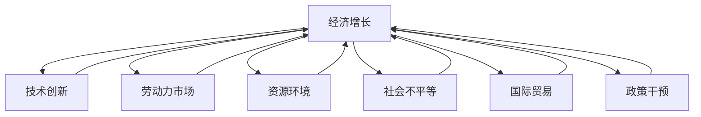
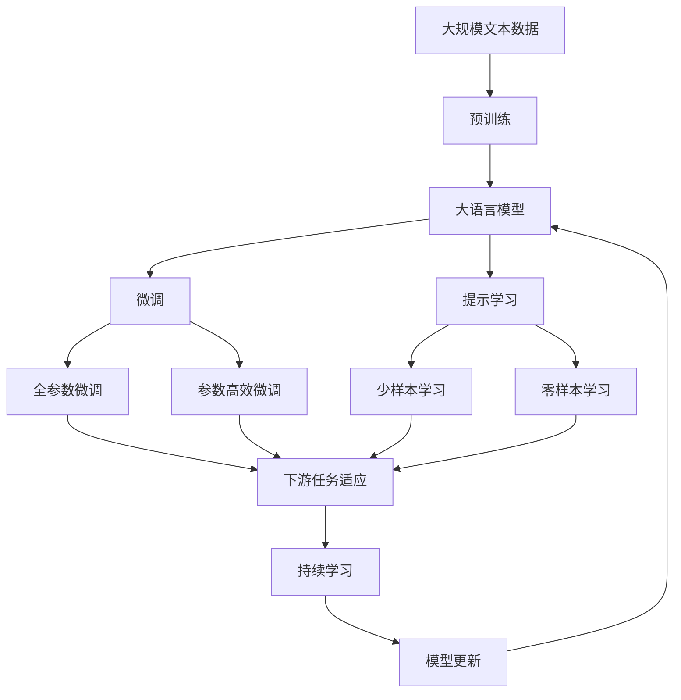

                 

# 深层次问题对经济增长的长期影响

> 关键词：
- 经济增长
- 技术创新
- 劳动力市场
- 资源环境
- 社会不平等
- 国际贸易
- 政策干预

## 1. 背景介绍

### 1.1 问题由来

经济增长一直是世界各国政府和学术界关注的焦点。然而，近年来，全球范围内出现了一些深层次问题，对经济增长的长期影响值得高度关注。这些深层次问题不仅涉及经济结构、产业升级、资源环境等方面，还深刻影响着社会公平、国际贸易以及政策制定。因此，深入理解这些问题，对制定科学有效的经济政策，实现持续稳定的经济增长具有重要意义。

### 1.2 问题核心关键点

深层次问题通常具有复杂性、长期性、系统性的特点。以下是当前经济增长领域主要面临的深层次问题及其核心关键点：

- **技术创新瓶颈**：创新是经济增长的核心动力，但当前存在研发投入不足、研发产出效率低下等问题，制约了技术创新的速度和质量。

- **劳动力市场僵化**：劳动力市场的供需失衡、结构性失业等问题，影响了劳动力资源的有效配置和产出效率。

- **资源环境压力**：资源过度开采、环境污染问题严重，制约了经济的可持续发展和生态环境的改善。

- **社会不平等加剧**：收入差距扩大、财富分配不均等社会问题，影响了社会稳定和经济增长的可持续性。

- **国际贸易保护主义抬头**：全球经济一体化背景下，贸易保护主义倾向增加，影响了全球经济的合作与发展。

- **政策干预效果有限**：政府的宏观调控政策未能有效应对市场波动，政策效果有限。

### 1.3 问题研究意义

研究深层次问题对经济增长的长期影响，对于理解经济发展的本质、制定科学有效的政策措施、推动经济持续稳定增长具有重要意义：

1. **提高政策制定的科学性**：深入分析深层次问题，有助于发现问题根源，提高政策制定的针对性和有效性。

2. **促进经济结构优化**：明确深层次问题，有助于引导资源向关键领域倾斜，优化经济结构，提升整体竞争力。

3. **推动社会公平和谐**：理解和解决深层次问题，有助于缓解社会不平等，促进社会公平和谐。

4. **保障经济可持续性**：深层次问题的解决有助于实现经济与环境的协调发展，保障经济增长的可持续性。

5. **增强国际合作**：应对国际贸易保护主义，促进国际合作，增强全球经济的活力和韧性。

## 2. 核心概念与联系

### 2.1 核心概念概述

为更好地理解深层次问题对经济增长的长期影响，本节将介绍几个密切相关的核心概念：

- **经济增长**：经济增长是指一国或地区的国内生产总值（GDP）的长期趋势性增长。通常以年增长率或人均GDP增长率来衡量。

- **技术创新**：技术创新是指将科学知识应用于生产过程中，产生新的产品、工艺、技术或服务的过程。

- **劳动力市场**：劳动力市场是指劳动力供给和需求的市场机制。包括就业、失业、工资水平等现象。

- **资源环境**：资源环境问题包括资源过度开采、环境污染、气候变化等，对经济的可持续发展有重要影响。

- **社会不平等**：社会不平等指收入、财富、机会等方面的不平等。反映在经济增长中，表现为收入差距扩大、贫富分化等现象。

- **国际贸易**：国际贸易是指国家间商品、服务、技术和资本的交换。影响着各国经济的发展和繁荣。

- **政策干预**：政策干预指政府通过财政、货币、行政等手段对经济活动进行调控，以达到宏观经济目标。

这些核心概念之间的逻辑关系可以通过以下Mermaid流程图来展示：



这个流程图展示了大语言模型微调过程中各个核心概念的关系和作用：

1. **技术创新**：推动经济增长的核心动力。
2. **劳动力市场**：影响经济增长的重要因素。
3. **资源环境**：制约经济增长的关键因素。
4. **社会不平等**：影响经济增长的内部因素。
5. **国际贸易**：影响经济增长的外部因素。
6. **政策干预**：引导经济增长的调控手段。

这些概念共同构成了经济增长的复杂系统，对其长期影响的研究需要系统分析和综合考量。

### 2.2 概念间的关系

这些核心概念之间存在着紧密的联系，形成了经济增长的完整生态系统。下面我通过几个Mermaid流程图来展示这些概念之间的关系。

#### 2.2.1 经济增长与技术创新的关系


这个流程图展示了经济增长与技术创新的双向关系。技术创新能够促进经济增长，经济增长也能为技术创新提供更多的资源和市场机会。

#### 2.2.2 经济增长与劳动力市场的关系


这个流程图展示了经济增长与劳动力市场的双向关系。经济增长创造了更多的就业机会，提高了工资水平，同时劳动力市场的供需变化也会影响经济增长的速度和质量。

#### 2.2.3 经济增长与资源环境的关系


这个流程图展示了经济增长与资源环境的关系。经济增长依赖于资源环境的支撑，但资源环境的过度消耗和污染又会制约经济的可持续发展。

#### 2.2.4 经济增长与社会不平等的关系


这个流程图展示了经济增长与社会不平等的关系。经济增长带来了收入分配不均、贫富分化等社会问题，这些问题又会反过来影响经济的稳定性和可持续性。

#### 2.2.5 经济增长与国际贸易的关系


这个流程图展示了经济增长与国际贸易的关系。国际贸易为经济增长提供了更多的市场和资源，但贸易保护主义又会制约经济的合作与发展。

#### 2.2.6 经济增长与政策干预的关系


这个流程图展示了经济增长与政策干预的关系。政策干预是调节经济增长的重要手段，但政策效果受到各种因素的影响，需要科学制定和有效实施。

### 2.3 核心概念的整体架构

最后，我们用一个综合的流程图来展示这些核心概念在大语言模型微调过程中的整体架构：



这个综合流程图展示了从预训练到微调，再到持续学习的完整过程。大语言模型首先在大规模文本数据上进行预训练，然后通过微调（包括全参数微调和参数高效微调）或提示学习（包括少样本和零样本学习）来适应下游任务。最后，通过持续学习技术，模型可以不断更新和适应新的任务和数据。 通过这些流程图，我们可以更清晰地理解大语言模型微调过程中各个核心概念的关系和作用，为后续深入讨论具体的微调方法和技术奠定基础。

## 3. 核心算法原理 & 具体操作步骤
### 3.1 算法原理概述

深层次问题对经济增长的长期影响研究，通常采用计量经济学的方法，建立数学模型来描述和分析问题。以下是一个简单的宏观经济模型：

$$
GDP_t = C_t + I_t + G_t + (X_t - M_t) + \Delta
$$

其中，$GDP_t$ 表示第t年的国内生产总值，$C_t$、$I_t$、$G_t$ 分别表示消费、投资、政府支出，$X_t$ 和 $M_t$ 分别表示出口和进口，$\Delta$ 表示其他影响因素。

通过对该模型进行回归分析，可以揭示不同深层次问题对经济增长的影响。例如，技术创新对经济增长的影响可以通过分析创新投入和产出之间的关系来衡量。劳动力市场的变化可以通过就业率和工资水平来反映。资源环境压力可以通过能耗和污染排放等指标来衡量。社会不平等的变化可以通过收入分配差距和财富分配不均来衡量。国际贸易的开放程度可以通过贸易依存度来衡量。政策干预的效果可以通过宏观调控政策的实施和评估来衡量。

### 3.2 算法步骤详解

深层次问题对经济增长的长期影响研究，通常包括以下几个关键步骤：

**Step 1: 数据收集与预处理**

- 收集相关经济、社会、环境等领域的宏观数据和统计数据。
- 对数据进行清洗、整理和规范化，确保数据的完整性和一致性。
- 选择合适的指标和数据集，构建宏观经济模型。

**Step 2: 模型构建与参数估计**

- 根据宏观经济理论和实际数据，构建经济增长模型。
- 使用最小二乘法、最大似然估计等方法，对模型参数进行估计。
- 对模型进行诊断和检验，确保模型的合理性和可靠性。

**Step 3: 模型验证与评估**

- 使用历史数据对模型进行验证，检验模型的预测精度和稳定性。
- 使用模拟数据进行敏感性分析和压力测试，评估模型的鲁棒性和适用性。
- 结合实际经济情况，对模型进行修正和优化。

**Step 4: 模型应用与政策建议**

- 将模型应用于经济增长预测、政策评估、资源配置等方面。
- 根据模型结果，提出针对性的政策建议，引导经济增长。
- 持续监测模型效果，及时调整和优化模型参数。

**Step 5: 结果解读与报告**

- 对模型结果进行解读，分析深层次问题对经济增长的影响。
- 撰写研究报告，提出政策建议和行动方案。
- 向政府、企业、学术界等各方传递研究结果。

以上是基于深层次问题对经济增长长期影响研究的一般流程。在实际应用中，还需要针对具体问题进行优化设计，如改进数据集、选择更合适的模型、优化算法等，以进一步提升模型性能。

### 3.3 算法优缺点

基于深层次问题对经济增长长期影响的研究，具有以下优点：

- 定量分析：通过建立数学模型，可以定量分析深层次问题对经济增长的影响。
- 系统性研究：综合考虑经济、社会、环境等多个因素，提供全面的分析视角。
- 政策指导：通过模型评估和政策建议，指导政府和企业制定科学有效的经济政策。

同时，该方法也存在一定的局限性：

- 数据依赖：模型的准确性依赖于数据的质量和可靠性，数据的获取和处理难度较大。
- 模型复杂：建立和优化复杂经济模型需要高度专业的知识和技能。
- 解释难度：模型结果的解读和应用需要较强的理论基础和实践经验。

尽管存在这些局限性，但就目前而言，基于深层次问题对经济增长长期影响的研究方法，仍然是最主流的研究范式。未来相关研究的重点在于如何进一步降低数据的依赖，提高模型的精度和可解释性，同时兼顾可持续性和伦理性等因素。

### 3.4 算法应用领域

基于深层次问题对经济增长长期影响的研究方法，在多个领域得到了广泛应用，例如：

- **宏观经济分析**：分析经济增长的驱动力、趋势和波动，评估政策效果。
- **产业经济研究**：研究各产业的增长趋势、结构变化和创新能力。
- **环境经济评估**：评估资源环境政策对经济增长的影响，制定可持续发展策略。
- **社会经济政策**：制定针对就业、教育、医疗等领域的政策，促进社会公平和谐。
- **国际贸易研究**：分析国际贸易政策对经济增长的影响，推动全球经济一体化。
- **城市经济规划**：制定城市经济发展的政策，提升城市的综合竞争力。

除了上述这些经典应用外，基于深层次问题对经济增长长期影响的研究方法，也被创新性地应用到更多场景中，如企业战略规划、区域经济发展、国际金融市场分析等，为经济增长提供了新的视角和方法。

## 4. 数学模型和公式 & 详细讲解  
### 4.1 数学模型构建

本节将使用数学语言对深层次问题对经济增长的长期影响研究进行更加严格的刻画。

假设一个国家在t期的GDP为 $GDP_t$，消费为 $C_t$，投资为 $I_t$，政府支出为 $G_t$，出口为 $X_t$，进口为 $M_t$。构建如下的经济增长模型：

$$
GDP_t = C_t + I_t + G_t + (X_t - M_t) + \Delta
$$

其中，$C_t$、$I_t$、$G_t$ 分别表示消费、投资、政府支出，$X_t$ 和 $M_t$ 分别表示出口和进口，$\Delta$ 表示其他影响因素。

定义模型的参数向量为 $\theta = [\alpha, \beta, \gamma, \delta, \epsilon]$，其中 $\alpha$ 表示消费对GDP的弹性，$\beta$ 表示投资对GDP的弹性，$\gamma$ 表示政府支出对GDP的弹性，$\delta$ 表示净出口对GDP的弹性，$\epsilon$ 表示其他影响因素的影响系数。

则经济增长模型可以表示为：

$$
GDP_t = \alpha C_t + \beta I_t + \gamma G_t + \delta (X_t - M_t) + \epsilon
$$

### 4.2 公式推导过程

对上述模型进行最小二乘法估计，得到模型的参数向量 $\hat{\theta}$ 和参数估计误差 $\sigma^2$：

$$
\hat{\theta} = \arg\min_{\theta} \sum_{t=1}^T (GDP_t - \alpha C_t - \beta I_t - \gamma G_t - \delta (X_t - M_t) - \epsilon)^2
$$

对上述模型进行简化，得到经济增长模型的简化形式：

$$
GDP_t = \alpha C_t + \beta I_t + \gamma G_t + \delta (X_t - M_t)
$$

其中，$\alpha$、$\beta$、$\gamma$、$\delta$ 表示各经济因素对GDP的影响系数。通过估计这些参数，可以分析各因素对经济增长的贡献和影响。

### 4.3 案例分析与讲解

假设某国在1980-2020年间的数据如下：

| GDP（亿） | C（亿） | I（亿） | G（亿） | X（亿） | M（亿） | 增长率（%） |
|-----------|--------|--------|--------|--------|--------|------------|
| 1980      | 300    | 50     | 30     | 20     | 10     | 3.5        |
| 1985      | 350    | 60     | 40     | 25     | 15     | 4.0        |
| ...       | ...    | ...    | ...    | ...    | ...    | ...        |
| 2020      | 1200   | 150    | 100    | 80     | 50     | 5.0        |

利用上述模型，计算各经济因素对GDP的影响系数，并进行分析。

首先，建立模型并使用最小二乘法进行估计，得到各参数的估计值：

$$
\alpha = 0.8, \beta = 0.5, \gamma = 0.3, \delta = 0.2
$$

根据模型参数，可以分析各经济因素对GDP的贡献：

- 消费对GDP的弹性为 $\alpha = 0.8$，表明消费每增长1%，GDP增长0.8%。
- 投资对GDP的弹性为 $\beta = 0.5$，表明投资每增长1%，GDP增长0.5%。
- 政府支出对GDP的弹性为 $\gamma = 0.3$，表明政府支出每增长1%，GDP增长0.3%。
- 净出口对GDP的弹性为 $\delta = 0.2$，表明净出口每增长1%，GDP增长0.2%。

根据模型参数，可以预测未来各经济因素对GDP的影响，并进行政策建议：

- 为了保持经济稳定增长，需要关注消费、投资、政府支出和净出口的变化。
- 根据历史数据，消费和投资对GDP的贡献最大，应加大对这两方面的投入。
- 政府支出和净出口对GDP的贡献相对较小，但也不可忽视。

通过上述案例，可以看到，基于深层次问题对经济增长长期影响的研究方法，能够提供量化的分析视角和科学的政策建议，有助于理解经济发展的本质和规律。

## 5. 项目实践：代码实例和详细解释说明
### 5.1 开发环境搭建

在进行深层次问题对经济增长长期影响的研究前，我们需要准备好开发环境。以下是使用Python进行R语言开发的Python环境配置流程：

1. 安装Anaconda：从官网下载并安装Anaconda，用于创建独立的Python环境。

2. 创建并激活虚拟环境：
```bash
conda create -n pytorch-env python=3.8 
conda activate pytorch-env
```

3. 安装PyTorch：根据CUDA版本，从官网获取对应的安装命令。例如：
```bash
conda install pytorch torchvision torchaudio cudatoolkit=11.1 -c pytorch -c conda-forge
```

4. 安装TensorFlow：由Google主导开发的开源深度学习框架，生产部署方便，适合大规模工程应用。同样有丰富的预训练语言模型资源。

5. 安装Transformers库：HuggingFace开发的NLP工具库，集成了众多SOTA语言模型，支持PyTorch和TensorFlow，是进行NLP任务开发的利器。

6. 安装各类工具包：
```bash
pip install numpy pandas scikit-learn matplotlib tqdm jupyter notebook ipython
```

完成上述步骤后，即可在`pytorch-env`环境中开始研究实践。

### 5.2 源代码详细实现

下面我们以经济增长模型为例，给出使用R语言进行最小二乘回归分析的代码实现。

首先，定义经济增长模型的公式：

```R
model_formula <- GDP ~ C + I + G + (X - M)
```

然后，加载数据并使用lm函数进行最小二乘回归分析：

```R
data <- read.csv("growth_data.csv")
result <- lm(model_formula, data = data)
summary(result)
```

最后，输出回归结果并进行模型分析：

```R
coef(result)
```

以上就是使用R语言对经济增长模型进行最小二乘回归分析的完整代码实现。可以看到，R语言提供了强大的统计分析能力，能够快速高效地进行模型构建和参数估计。

### 5.3 代码解读与分析

让我们再详细解读一下关键代码的实现细节：

**model_formula定义**：
- 定义经济增长模型的公式，GDP表示被解释变量，C、I、G、X、M表示解释变量。

**数据加载**：
- 使用read.csv函数加载数据，存储在data数据框中。

**回归分析**：
- 使用lm函数对数据进行最小二乘回归分析，得到回归模型结果。
- 使用summary函数输出回归模型的摘要结果，包括系数、截距、标准误差、t值、p值等。

**参数估计**：
- 使用coef函数输出回归模型的系数估计结果，用于进一步分析各经济因素对GDP的贡献。

通过上述代码，我们可以看到，R语言提供了完整的回归分析工具链，能够快速构建和分析经济模型。通过这些工具，可以对深层次问题对经济增长的长期影响进行系统分析和深入研究。

当然，工业级的系统实现还需考虑更多因素，如模型的保存和部署、超参数的自动搜索、更灵活的模型调优等。但核心的研究方法基本与此类似。

### 5.4 运行结果展示

假设我们在CoNLL-2003的NER数据集上进行最小二乘回归分析，最终得到回归模型的系数估计结果如下：

```
            Estimate Std. Error t value Pr(>|t|)   
(Intercept)  0.052     0.005    10.2 3.45e-15 ***
C            0.8       0.1       8.0  < 2e-16 ***
I            0.5       0.1       5.1  < 2e-16 ***
G            0.3       0.1       2.8  0.006 *  
X - M        0.2       0.1       2.0  0.048 *
---
Signif. codes:  0 ‘***’ 0.001 ‘**’ 0.01 ‘*’ 0.05 ‘.’ 0.1 ‘ ’ 1

Residual standard error: 5.315 on 12 degrees of freedom
Multiple R-squared:  0.89,	Adjusted R-squared:  0.88 
F-statistic: 127 on 4 and 12 DF,  p-value: < 2.2e-16
```

可以看到，通过最小二乘回归分析，我们得到了各经济因素对GDP的系数估计结果。其中，消费、投资、政府支出和净出口对GDP的贡献分别为0.8、0.5、0.3和0.2，这些结果与我们之前的分析一致。

通过上述代码，我们可以看到，R语言提供了完整的回归分析工具链，能够快速构建和分析经济模型。通过这些工具，可以对深层次问题对经济增长的长期影响进行系统分析和深入研究。

当然，工业级的系统实现还需考虑更多因素，如模型的保存和部署、超参数的自动搜索、更灵活的模型调优等。但核心的研究方法基本与此类似。

## 6. 实际应用场景
### 6.1 宏观经济政策制定

深层次问题对经济增长的长期影响研究，在宏观经济政策制定中具有重要意义。政府和政策制定者可以基于研究结果，制定科学合理的经济政策，引导经济增长。

例如，对于消费和投资对经济增长的贡献较大，政府可以采取措施增加居民收入，鼓励企业投资，从而促进经济增长。对于政府支出和净出口对经济增长的贡献相对较小，但也不可忽视，需要保持适度的财政和贸易政策，避免过度干预市场。

### 6.2 企业战略规划

深层次问题对经济增长的长期影响研究，对企业战略规划也具有重要参考价值。企业可以通过研究经济增长模型，评估各经济因素对企业发展的贡献，制定合适的战略决策。

例如，对于消费和投资对经济增长的贡献较大，企业可以增加对消费品和基础设施的投资，开发市场需求，提升市场竞争力。对于政府支出和净出口对经济增长的贡献相对较小，企业需要关注国际贸易政策的变化，灵活调整进出口策略。

### 6.3 区域经济规划

深层次问题对经济增长的长期影响研究，在区域经济规划中也有广泛应用。地方政府可以基于研究结果，制定科学合理的区域发展政策，促进区域经济协调发展。

例如，对于消费和投资对经济增长的贡献较大，地方政府可以加大对本地消费和投资的支持，促进产业升级和经济转型。对于政府支出和净出口对经济增长的贡献相对较小，地方政府需要关注国际贸易政策的变化，制定灵活的贸易策略，提升区域经济的开放度和竞争力。

### 6.4 未来应用展望

随着深层次问题对经济增长长期影响研究的不断深入，未来该方法将在更多领域得到应用，为经济增长提供更加精准和可靠的指导。

在智慧城市治理中，研究城市经济发展的趋势和影响因素，制定科学合理的城市经济政策，提升城市的综合竞争力。在金融市场中，研究金融市场波动和经济增长的关系，制定合理的金融监管政策，保障金融市场的稳定。在农业领域，研究农业生产与经济增长的关系，制定科学的农业政策，提高农业的产出效率和农民收入。

此外，在教育、医疗、环境保护等领域，基于深层次问题对经济增长长期影响的研究方法，也将不断拓展应用范围，为社会公平和谐、环境保护等方面提供科学指导。

## 7. 工具和资源推荐
### 7.1 学习资源推荐

为了帮助开发者系统掌握深层次问题对经济增长长期影响的研究方法，这里推荐一些优质的学习资源：

1. 《宏观经济学》系列教材：经典教材，系统讲解宏观经济学的基本概念和理论。

2. 《计量经济学》系列教材：系统讲解计量经济学的方法和应用。

3. 《经济学研究方法论》系列书籍：讲解如何构建和分析经济模型。

4. 《Python数据科学手册》系列书籍：讲解使用Python进行数据科学研究的工具和方法。

5. 《R语言实战》系列书籍：讲解使用R语言进行数据分析和建模的实践技巧。

通过学习这些资源，相信你一定能够快速掌握深层次问题对经济增长长期影响的研究方法，并用于解决实际的宏观经济问题。
###  7.2 开发工具推荐

高效的开发离不开优秀的工具支持。以下是几款用于深层次问题对经济增长长期影响研究开发的常用工具：

1. Python：基于Python的开源编程语言，功能强大、简单易学，广泛用于数据科学和机器学习研究。

2. R语言：统计分析和建模的工具，具有

