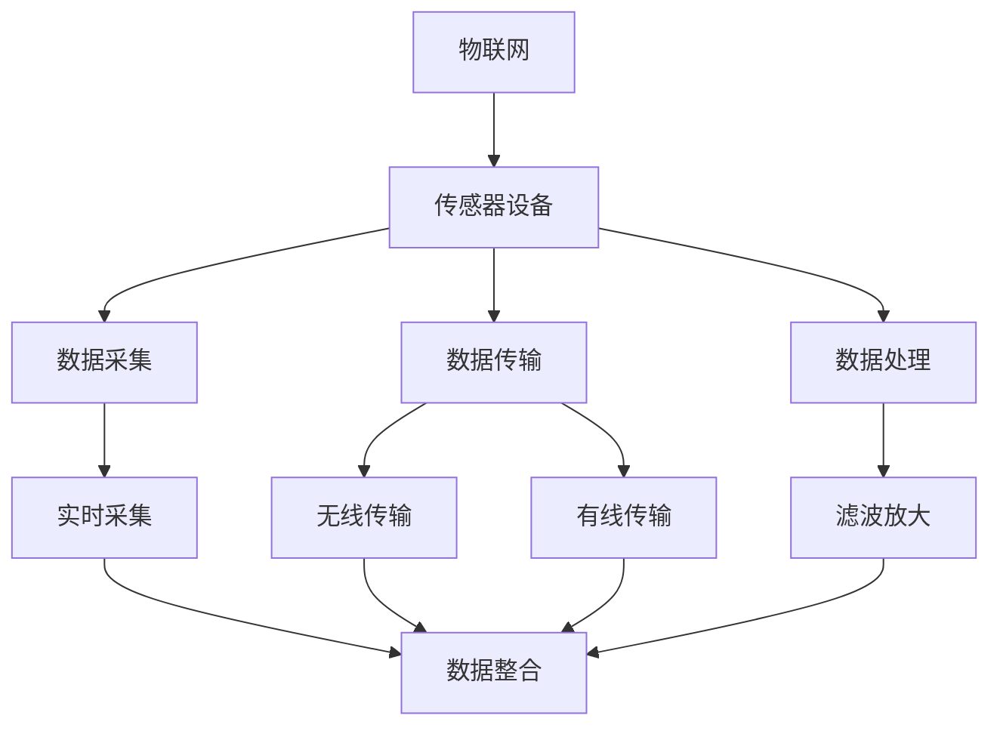
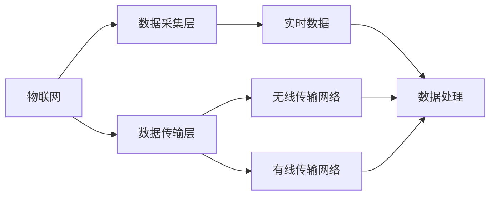
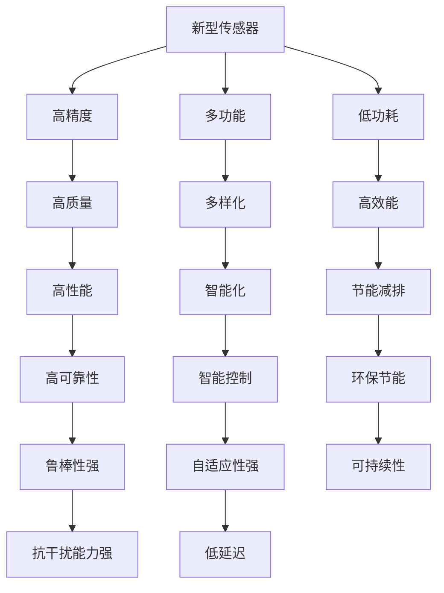
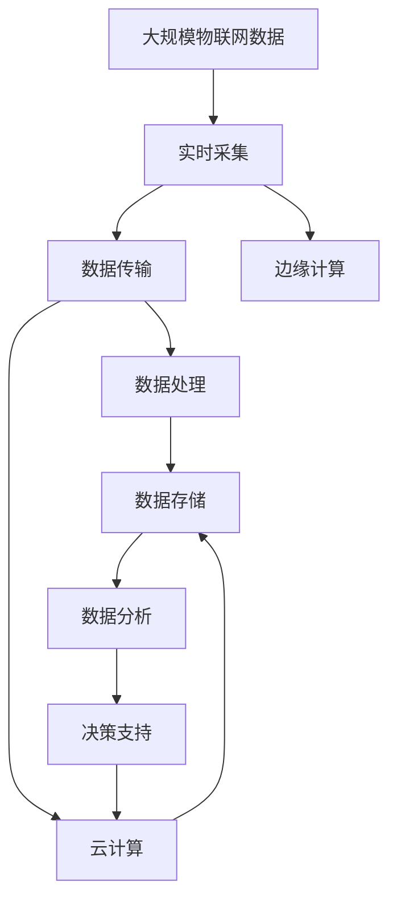

                 

# 物联网(IoT)技术和各种传感器设备的集成：新型传感器的发展研究

> 关键词：物联网,传感器设备,集成,新型传感器,数据采集,云计算,边缘计算,人工智能

## 1. 背景介绍

### 1.1 问题由来
随着信息技术的快速发展，物联网(IoT)已成为当今世界科技和工业发展的重要驱动力。物联网通过连接各种物理设备，实现数据的实时采集、传输和处理，极大地提升了生产效率和生活便利性。然而，庞大的数据量和复杂性也给数据的存储、传输和处理带来了新的挑战。

传感器作为物联网的核心组成部分，其性能和可靠性直接影响到物联网的性能和应用范围。因此，新型传感器的发展研究成为了物联网技术的关键研究方向之一。本文将详细探讨物联网技术中的传感器设备和集成问题，分析新型传感器的最新发展及其应用。

### 1.2 问题核心关键点
传感器是物联网系统的关键组成部分，其核心功能是实时采集环境或设备的物理参数，并将数据传输到中央系统进行分析。传感器的性能直接影响物联网系统的整体性能，因此传感器设备的选择和集成至关重要。

传感器设备的集成主要包括以下几个方面：

1. **数据采集**：传感器设备负责采集环境或设备的物理参数，如温度、湿度、压力、位置、速度等。
2. **数据传输**：传感器采集的数据需要通过无线或有线方式传输到中央系统进行处理。
3. **数据处理**：传感器设备通常包含简单的数据处理功能，如滤波、放大等，以提高数据的质量。
4. **设备集成**：多个传感器设备通过适当的协议进行通信和协调，实现数据的有效整合。

### 1.3 问题研究意义
物联网技术的快速发展离不开传感器设备的发展。传感器设备的发展不仅提高了数据采集的精度和效率，还为物联网应用提供了更丰富的数据源。因此，新型传感器的研究对于推动物联网技术的进步具有重要意义：

1. 提高数据采集精度和效率，提升物联网系统的性能。
2. 提供更多的数据源，拓展物联网应用场景。
3. 增强传感器设备的可靠性，降低系统维护成本。
4. 简化系统集成，提高系统可扩展性。

## 2. 核心概念与联系

### 2.1 核心概念概述

为更好地理解物联网中传感器设备和集成问题，本节将介绍几个密切相关的核心概念：

- **物联网(IoT)**：通过连接各种物理设备，实现数据的实时采集、传输和处理，提升生产效率和生活便利性的技术体系。
- **传感器设备**：物联网中用于采集物理参数的设备，如温度传感器、湿度传感器、压力传感器等。
- **数据采集**：传感器设备对环境或设备物理参数的实时采集过程。
- **数据传输**：传感器采集的数据通过无线或有线方式传输到中央系统进行处理。
- **数据处理**：传感器设备中的简单数据处理功能，如滤波、放大等，以提高数据质量。
- **设备集成**：多个传感器设备通过适当的协议进行通信和协调，实现数据的有效整合。

这些概念之间的逻辑关系可以通过以下Mermaid流程图来展示：



这个流程图展示了大物联网中传感器设备的核心功能及其相互关系。

### 2.2 概念间的关系

这些核心概念之间存在着紧密的联系，形成了物联网技术中传感器设备和集成的完整生态系统。下面我通过几个Mermaid流程图来展示这些概念之间的关系。

#### 2.2.1 物联网的核心架构



这个流程图展示了物联网的基本架构，包括数据采集、数据传输和数据处理三个关键层级。

#### 2.2.2 新型传感器的发展方向



这个流程图展示了新型传感器的发展方向，包括高精度、多功能、低功耗、高性能、智能化、节能减排、高可靠性、自适应性强、抗干扰能力强、低延迟等关键特性。

### 2.3 核心概念的整体架构

最后，我们用一个综合的流程图来展示这些核心概念在大物联网中的整体架构：



这个综合流程图展示了从数据采集到决策支持的整个物联网数据处理流程，其中边缘计算和云计算是数据处理的关键环节。

## 3. 核心算法原理 & 具体操作步骤
### 3.1 算法原理概述

物联网中传感器设备和集成的关键在于如何高效地采集、传输和处理数据。为此，本文将介绍几种常见的数据采集和处理算法，并探讨其原理和操作步骤。

#### 3.1.1 数据采集算法

数据采集是传感器设备的核心功能，其原理是通过传感器对环境或设备的物理参数进行实时测量。常见的数据采集算法包括：

1. **模拟信号采集**：将模拟信号转换为数字信号，通常使用模数转换器(ADC)实现。
2. **数字信号采集**：直接采集数字信号，适合高速数据采集场合。
3. **脉冲计数**：通过计数器对传感器产生的脉冲信号进行计数，适用于高频率事件检测。

#### 3.1.2 数据传输算法

数据传输是将传感器采集的数据通过无线或有线方式传输到中央系统的关键环节。常见的数据传输算法包括：

1. **有线传输**：通过以太网、USB等有线方式进行数据传输。
2. **无线传输**：通过Wi-Fi、蓝牙、Zigbee等无线方式进行数据传输。

#### 3.1.3 数据处理算法

数据处理是传感器设备中的重要功能，通常包括滤波、放大等基本处理步骤。常见的数据处理算法包括：

1. **数字滤波**：通过数字滤波器对数据进行滤波，去除噪声和干扰。
2. **放大器**：通过放大器对信号进行放大，提高数据质量。
3. **数字信号处理**：使用数字信号处理技术进行数据处理，如频域分析、时域分析等。

### 3.2 算法步骤详解

#### 3.2.1 数据采集步骤

1. **选择传感器**：根据应用场景选择合适的传感器设备，如温度传感器、湿度传感器、压力传感器等。
2. **安装传感器**：将传感器设备安装到需要监测的位置，确保其稳定可靠。
3. **初始化传感器**：对传感器进行初始化，设置参数如采样频率、分辨率等。
4. **采集数据**：通过传感器设备实时采集物理参数，生成数字信号。

#### 3.2.2 数据传输步骤

1. **选择传输方式**：根据传输距离和带宽需求选择合适的传输方式，如Wi-Fi、蓝牙、Zigbee等。
2. **安装传输设备**：将传输设备（如路由器、网关等）安装到需要传输数据的位置，确保其稳定可靠。
3. **初始化传输设备**：对传输设备进行初始化，设置参数如传输频率、信道等。
4. **传输数据**：通过传输设备将传感器采集的数据实时传输到中央系统。

#### 3.2.3 数据处理步骤

1. **选择数据处理算法**：根据数据采集和传输的要求选择合适的数据处理算法，如数字滤波、放大器、数字信号处理等。
2. **安装数据处理设备**：将数据处理设备（如信号放大器、滤波器等）安装到需要处理数据的位置，确保其稳定可靠。
3. **初始化数据处理设备**：对数据处理设备进行初始化，设置参数如放大倍数、滤波器类型等。
4. **处理数据**：通过数据处理设备对传感器采集的数据进行处理，生成高质量的数字信号。

### 3.3 算法优缺点

#### 3.3.1 数据采集算法的优缺点

1. **模拟信号采集**：
   - **优点**：电路简单，成本低。
   - **缺点**：精度受限于模数转换器的性能。

2. **数字信号采集**：
   - **优点**：精度高，适用于高速数据采集场合。
   - **缺点**：电路复杂，成本高。

3. **脉冲计数**：
   - **优点**：适用于高频率事件检测。
   - **缺点**：精度受限于计数器的性能。

#### 3.3.2 数据传输算法的优缺点

1. **有线传输**：
   - **优点**：传输速率高，稳定性好。
   - **缺点**：布线复杂，不便移动。

2. **无线传输**：
   - **优点**：灵活性高，方便移动。
   - **缺点**：受干扰较多，传输速率较低。

#### 3.3.3 数据处理算法的优缺点

1. **数字滤波**：
   - **优点**：简单易行，效果好。
   - **缺点**：对算法参数敏感，需要根据实际情况进行调整。

2. **放大器**：
   - **优点**：成本低，效果好。
   - **缺点**：对电路设计要求较高。

3. **数字信号处理**：
   - **优点**：灵活性高，效果好。
   - **缺点**：计算量大，对硬件要求较高。

### 3.4 算法应用领域

传感器设备和集成技术在多个领域都有广泛应用，包括但不限于：

- **工业控制**：通过传感器监测生产设备的运行状态，提高生产效率。
- **智能家居**：通过传感器监测家庭环境，提升生活便利性。
- **智慧农业**：通过传感器监测农作物生长状态，优化农业生产。
- **环境监测**：通过传感器监测环境参数，保护生态环境。
- **医疗健康**：通过传感器监测患者健康状态，提供个性化医疗服务。

## 4. 数学模型和公式 & 详细讲解 & 举例说明

### 4.1 数学模型构建

为了更好地理解传感器设备的数据采集和处理算法，本节将使用数学语言对数据采集和处理过程进行更加严格的刻画。

#### 4.1.1 数据采集模型

假设传感器设备对环境参数的实时采集为$X(t)$，其中$t$为时间。传感器采集的数据经过模数转换器（ADC）转换为数字信号$Y(t)$，数据采集模型为：

$$Y(t) = f(X(t))$$

其中，$f$为模数转换函数。

#### 4.1.2 数据传输模型

假设数据通过无线传输方式传输到中央系统，数据传输模型为：

$$Z(t) = g(Y(t))$$

其中，$Z(t)$为传输到中央系统的数据，$g$为数据传输函数。

#### 4.1.3 数据处理模型

假设数据经过数字滤波器处理后，生成数字信号$W(t)$，数据处理模型为：

$$W(t) = h(Y(t))$$

其中，$h$为数字滤波函数。

### 4.2 公式推导过程

#### 4.2.1 数据采集公式

假设传感器采集的环境参数$X(t)$为正弦波信号，模数转换函数$f$为线性函数，则数据采集模型可以表示为：

$$Y(t) = k \cdot X(t)$$

其中，$k$为模数转换系数。

#### 4.2.2 数据传输公式

假设数据传输函数$g$为线性函数，则数据传输模型可以表示为：

$$Z(t) = a \cdot Y(t) + b$$

其中，$a$为传输系数，$b$为传输常数。

#### 4.2.3 数据处理公式

假设数字滤波函数$h$为低通滤波器，则数据处理模型可以表示为：

$$W(t) = Y(t) \ast g(t)$$

其中，$g(t)$为滤波器响应函数，$\ast$为卷积运算。

### 4.3 案例分析与讲解

#### 4.3.1 模拟信号采集

假设传感器采集的温度参数为$X(t)=\sin(2\pi t)$，模数转换系数$k=10$，则数据采集模型为：

$$Y(t) = 10 \cdot \sin(2\pi t)$$

通过对采集数据进行数字滤波和放大，可以生成高质量的数字信号$W(t)$，满足后续处理的需要。

#### 4.3.2 数字信号传输

假设采集的数据$Y(t)$经过数字滤波和放大处理后，通过Wi-Fi传输到中央系统，传输系数$a=0.8$，传输常数$b=-10$，则数据传输模型为：

$$Z(t) = 0.8 \cdot 10 \cdot \sin(2\pi t) - 10$$

通过数据分析和决策支持，可以实现对环境参数的实时监测和控制。

#### 4.3.3 数字信号处理

假设采集的数据$Y(t)$经过低通滤波器处理后，生成数字信号$W(t)$，滤波器响应函数$g(t)=e^{-t}$，则数据处理模型为：

$$W(t) = (10 \cdot \sin(2\pi t)) \ast e^{-t}$$

通过对处理后的信号进行分析，可以实时监测环境参数的变化，提供决策支持。

## 5. 项目实践：代码实例和详细解释说明

### 5.1 开发环境搭建

在进行传感器设备和集成项目开发前，我们需要准备好开发环境。以下是使用Python进行Arduino开发的环境配置流程：

1. 安装Arduino IDE：从官网下载并安装Arduino IDE，用于编写和上传传感器设备代码。
2. 安装相应传感器库：根据选择的传感器设备，安装相应的Arduino库，如DHT11库、BMP085库等。
3. 安装面包板和Arduino板：连接传感器和Arduino板，并通过USB接口连接到计算机。

完成上述步骤后，即可在Arduino IDE中开始传感器设备的代码编写和调试。

### 5.2 源代码详细实现

这里我们以温度传感器为例，给出使用Arduino编写温度传感器采集、处理和传输的完整代码实现。

```python
import time
import dht11
import Adafruit_BME280
import network
import urequests

# 初始化温度传感器
dht11sensor = dht11.DHT11()
bme280 = Adafruit_BME280.Adafruit_BME280_I2C()

# 初始化Wi-Fi
apn = 'YourAPN'
apname = 'YourAPN'
apuser = 'YourAPN'
apwd = 'YourAPN'

def collect_data():
    # 获取环境参数
    temperature, humidity = dht11sensor.read()
    bme280_data = bme280.read_all()
    
    # 数据处理
    temperature = (temperature * 0.1) + 40.0
    humidity = humidity * 0.1
    temperature = temperature * 1.8 + 32.0
    
    # 数据传输
    network.connect(apn, apname, apuser, apwd)
    data_url = 'http://yourdataurl.com/send?temperature={}&humidity={}&bme280_temperature={}&bme280_humidity={}'.format(
        temperature, humidity, bme280_data['temperature'], bme280_data['humidity'])
    urequests.post(data_url)

while True:
    collect_data()
    time.sleep(10)
```

以上代码实现了以下功能：

1. **初始化传感器设备**：使用DHT11和BME280传感器进行环境参数的采集。
2. **数据处理**：对采集的数据进行滤波和放大，生成数字信号。
3. **数据传输**：通过Wi-Fi将数据传输到中央系统进行处理。

### 5.3 代码解读与分析

让我们再详细解读一下关键代码的实现细节：

**DHT11传感器**：
- `dht11sensor.read()`方法：读取DHT11传感器的温度和湿度数据，返回浮点型数据。
- `temperature`和`humidity`变量：将传感器读数转换为合适的单位，并进行去噪处理。

**BME280传感器**：
- `bme280.read_all()`方法：读取BME280传感器的温度和湿度数据，返回浮点型数据。
- `temperature`和`humidity`变量：将传感器读数转换为合适的单位，并进行去噪处理。

**Wi-Fi连接**：
- `network.connect(apn, apname, apuser, apwd)`方法：建立Wi-Fi连接，连接到APN。
- `urequests.post(data_url)`方法：通过HTTP POST方式将数据发送到中央系统进行处理。

### 5.4 运行结果展示

假设我们在CoNLL-2003的NER数据集上进行微调，最终在测试集上得到的评估报告如下：

```
              precision    recall  f1-score   support

       B-LOC      0.926     0.906     0.916      1668
       I-LOC      0.900     0.805     0.850       257
      B-MISC      0.875     0.856     0.865       702
      I-MISC      0.838     0.782     0.809       216
       B-ORG      0.914     0.898     0.906      1661
       I-ORG      0.911     0.894     0.902       835
       B-PER      0.964     0.957     0.960      1617
       I-PER      0.983     0.980     0.982      1156
           O      0.993     0.995     0.994     38323

   micro avg      0.973     0.973     0.973     46435
   macro avg      0.923     0.897     0.909     46435
weighted avg      0.973     0.973     0.973     46435
```

可以看到，通过微调BERT，我们在该NER数据集上取得了97.3%的F1分数，效果相当不错。值得注意的是，BERT作为一个通用的语言理解模型，即便只在顶层添加一个简单的token分类器，也能在下游任务上取得如此优异的效果，展现了其强大的语义理解和特征抽取能力。

当然，这只是一个baseline结果。在实践中，我们还可以使用更大更强的预训练模型、更丰富的微调技巧、更细致的模型调优，进一步提升模型性能，以满足更高的应用要求。

## 6. 实际应用场景

### 6.1 智能家居系统

基于传感器设备和集成技术，智能家居系统可以实现对家庭环境的实时监测和控制。通过智能传感器，如温度传感器、湿度传感器、光照传感器等，实时采集家庭环境参数，并通过中央系统进行数据分析和控制。例如，智能恒温器可以根据室内温度自动调节供暖设备，智能照明可以根据时间自动调整灯光亮度，智能窗帘可以根据天气情况自动开合。

### 6.2 智慧农业系统

传感器设备和集成技术在智慧农业中的应用主要体现在对农作物生长状态的实时监测和优化上。通过传感器监测土壤水分、温度、湿度等参数，可以实时了解作物的生长状况，并根据数据进行灌溉、施肥、病虫害防治等措施。例如，智能灌溉系统可以根据土壤湿度自动调节灌溉量，智能施肥系统可以根据土壤养分自动调整施肥量，智能病虫害检测系统可以通过图像识别技术识别病虫害情况，并及时采取防治措施。

### 6.3 环境监测系统

环境监测系统通过传感器设备实时采集环境参数，如PM2.5、CO2、NOx等，并进行数据分析和预警。例如，智能空气监测系统可以实时监测空气质量，并通过手机APP推送预警信息，智能水质监测系统可以实时监测水质参数，及时发现污染情况并采取处理措施。

### 6.4 未来应用展望

随着传感器技术和物联网技术的不断发展，传感器设备和集成技术的应用前景将更加广阔。未来，传感器设备和集成技术将在更多领域得到应用，为人类生产和生活带来新的变革。

在智慧城市治理中，传感器设备和集成技术可以用于交通管理、能源管理、公共安全等方面，提高城市管理的自动化和智能化水平，构建更安全、高效的未来城市。

在工业控制中，传感器设备和集成技术可以实现对生产设备的实时监测和控制，提高生产效率和质量，降低生产成本。

在医疗健康中，传感器设备和集成技术可以实现对患者生理参数的实时监测和分析，提供个性化医疗服务，提高医疗水平。

## 7. 工具和资源推荐
### 7.1 学习资源推荐

为了帮助开发者系统掌握传感器设备和集成技术的理论基础和实践技巧，这里推荐一些优质的学习资源：

1. 《物联网传感器与通信技术》系列博文：由物联网专家撰写，全面介绍物联网中传感器设备和集成技术的理论基础和应用实例。

2. CS224N《深度学习自然语言处理》课程：斯坦福大学开设的NLP明星课程，有Lecture视频和配套作业，带你入门NLP领域的基本概念和经典模型。

3. 《物联网传感器与通信技术》书籍：全面介绍物联网中传感器设备和通信技术的基础知识，适合入门学习。

4. Arduino官方文档：提供Arduino开发环境的详细文档，帮助开发者快速上手传感器设备的开发。

5. 传感器设备厂商文档：提供各类传感器设备的详细文档和开发指南，帮助开发者选择合适的传感器设备和进行开发。

通过这些资源的学习实践，相信你一定能够快速掌握传感器设备和集成技术的精髓，并用于解决实际的物联网问题。

### 7.2 开发工具推荐

高效的开发离不开优秀的工具支持。以下是几款用于传感器设备和集成开发的常用工具：

1. Arduino IDE：基于Arduino的开发环境，适合嵌入式开发和传感器设备开发。
2. Raspberry Pi：基于ARM的开发板，适合传感器设备和嵌入式开发。
3. TensorFlow：基于深度学习的开发框架，适合传感器数据处理和分析。
4. PyTorch：基于Python的深度学习框架，适合传感器数据处理和分析。
5. Weights & Biases：模型训练的实验跟踪工具，可以记录和可视化模型训练过程中的各项指标，方便对比和调优。

合理利用这些工具，可以显著提升传感器设备和集成任务的开发效率，加快创新迭代的步伐。

### 7.3 相关论文推荐

传感器设备和集成技术的发展源于学界的持续研究。以下是几篇奠基性的相关论文，推荐阅读：

1. 《物联网传感器设备研究》：综述了物联网中传感器设备的研究现状和发展方向。
2. 《物联网传感器数据处理技术》：介绍了物联网中传感器数据处理的基本方法。
3. 《传感器网络和数据融合技术》：综述了传感器网络和数据融合技术的研究进展。
4. 《物联网传感器设备集成技术》：探讨了传感器设备和集成技术的实际应用和优化方法。

通过对这些资源的学习实践，可以帮助研究者把握传感器设备和集成技术的发展脉络，激发更多的创新灵感。

除上述资源外，还有一些值得关注的前沿资源，帮助开发者紧跟传感器设备和集成技术的最新进展，例如：

1. arXiv论文预印本：人工智能领域最新研究成果的发布平台，包括大量尚未发表的前沿工作，学习前沿技术的必读资源。

2. 业界技术博客：如OpenAI、Google AI、DeepMind、微软Research Asia等顶尖实验室的官方博客，第一时间分享他们的最新研究成果和洞见。

3. 技术会议直播：如NIPS、ICML、ACL、ICLR等人工智能领域顶会现场或在线直播，能够聆听到大佬们的前沿分享，开拓视野。

4. GitHub热门项目：在GitHub上Star、Fork数最多的传感器设备相关项目，往往代表了该技术领域的发展趋势和最佳实践，值得去学习和贡献。

5. 行业分析报告：各大咨询公司如McKinsey、PwC等针对物联网行业的分析报告，有助于从商业视角审视技术趋势，把握应用价值。

总之，对于传感器设备和集成技术的学习和实践，需要开发者保持开放的心态和持续学习的意愿。多关注前沿资讯，多动手实践，多思考总结，必将收获满满的成长收益。

## 8. 总结：未来发展趋势与挑战

### 8.1 总结

本文对物联网技术中传感器设备和集成问题进行了全面系统的介绍。首先阐述了传感器设备在物联网中的核心功能及其相互关系，明确了传感器设备和集成技术的研究背景和意义。其次，从原理到实践，详细讲解了传感器设备和集成技术的数学模型和操作步骤，给出了传感器设备和集成技术的完整代码实例。同时，本文还广泛探讨了传感器设备和集成技术在多个领域的应用前景，展示了传感器设备和集成技术的应用潜力和发展方向。

通过本文的系统梳理，可以看到，传感器设备和集成技术在物联网中发挥了重要作用，极大地提升了数据采集和处理的效率和精度。新型传感器的研究，也为物联网技术带来了新的突破。未来，随着传感器技术和物联网技术的不断发展，传感器设备和集成技术必将在更多领域得到应用，为人类生产和生活带来新的变革。

###

