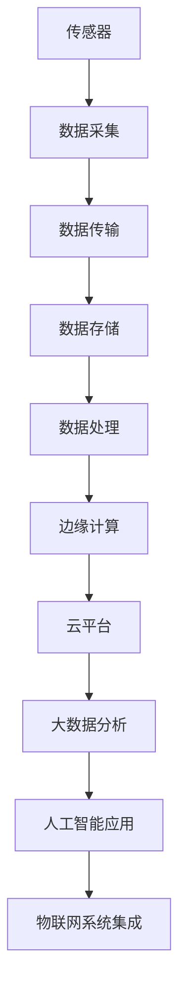
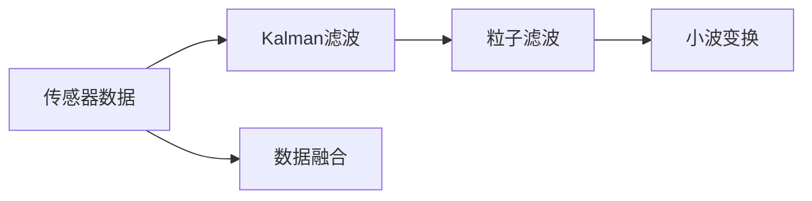
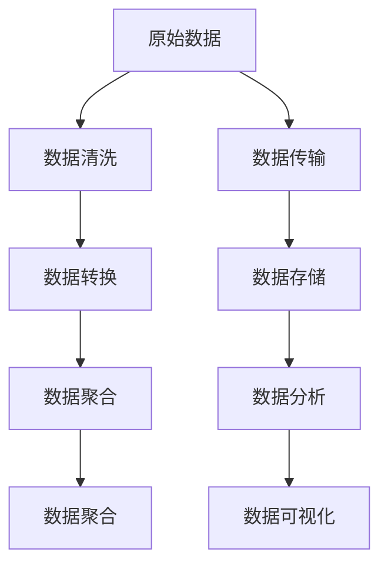
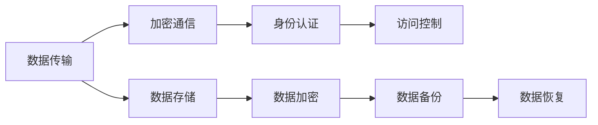
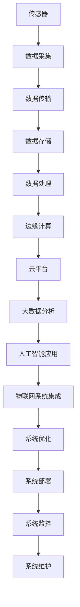

                 

# 物联网(IoT)技术和各种传感器设备的集成：物联网的系统集成

> 关键词：物联网(IoT),传感器,传感器融合,系统集成,边缘计算,云平台,大数据,人工智能

## 1. 背景介绍

### 1.1 问题由来
随着物联网(IoT)技术的迅猛发展，越来越多的传感器设备被广泛应用于工业制造、智能家居、智慧城市、医疗健康等领域。这些传感器设备生成大量实时数据，并通过互联网连接到中央服务器或云平台，进行集中存储、分析和处理。然而，这些数据通常数量庞大且维度繁多，直接传输和处理会带来巨大的计算和存储压力，且响应速度和实时性难以满足应用需求。

为了解决这些问题，研究者们提出了各种传感器融合技术，将多源传感器数据进行优化集成，提取更有价值的特征信息。同时，系统集成技术也越来越受到重视，旨在将传感器、数据处理、边缘计算、云计算和人工智能等技术进行有机整合，构建高效、可扩展、安全可靠的物联网系统。本文将详细探讨这些技术，并介绍其在实际应用场景中的具体实现。

### 1.2 问题核心关键点
本文聚焦于以下核心关键点：
- 传感器融合的原理与方法
- 系统集成的架构与实现
- 物联网系统的数据处理与分析
- 物联网系统的安全与隐私保护
- 物联网系统的大数据与人工智能应用

这些关键点构成了物联网系统集成的基础框架，通过理解这些核心概念，我们可以更好地掌握物联网技术的开发与应用。

### 1.3 问题研究意义
研究传感器融合与系统集成技术，对于提升物联网系统的性能、降低成本、保障安全性与隐私，具有重要意义：

1. **性能提升**：通过传感器融合技术，可以提取更丰富的数据信息，提升物联网系统的决策能力与响应速度。
2. **成本降低**：系统集成技术可以优化资源利用，减少计算和存储需求，降低系统开发和维护成本。
3. **安全性与隐私保护**：传感器数据融合与边缘计算可以有效减少数据传输，降低数据泄露风险，保障数据安全与隐私。
4. **大数据与人工智能应用**：物联网系统集成的技术，可以支撑大规模数据处理与分析，为人工智能技术的应用提供强大的数据基础。
5. **应用推广**：系统集成技术使得物联网技术更加易于部署和扩展，可以更快地推广到各个行业和应用场景。

## 2. 核心概念与联系

### 2.1 核心概念概述

为更好地理解物联网系统集成的关键技术，本节将介绍几个密切相关的核心概念：

- **物联网(IoT)**：指通过互联网技术将各种物体设备连接起来，实现智能化管理和信息交互的网络。物联网系统集成的目的是通过优化传感器、数据处理、边缘计算和云计算等技术，构建高效、安全、可靠的物联网系统。

- **传感器**：指能够感知环境变化并生成电信号的设备，如温度传感器、湿度传感器、压力传感器等。传感器融合技术旨在通过多源传感器的优化组合，提取更精确、更有价值的数据信息。

- **传感器融合**：指通过算法将多源传感器数据进行优化整合，提取更丰富的特征信息。常用的传感器融合方法包括Kalman滤波、粒子滤波、小波变换等。

- **系统集成**：指将多个独立的功能模块或子系统，通过合理设计进行有机整合，构建一个完整、高效的系统。系统集成技术涵盖硬件、软件、通信和数据处理等多个方面。

- **边缘计算**：指在设备或网络边缘进行数据处理和存储，减少对中央服务器的依赖，降低数据传输延迟和带宽需求。边缘计算是物联网系统集成的重要组成部分。

- **云平台**：指提供存储、计算和分析服务的云基础设施，包括公有云、私有云和混合云。云平台是物联网系统集成的重要支持平台。

- **大数据**：指在规模化数据集上，通过算法进行高效处理和分析的技术。物联网系统集成技术可以支撑大规模数据的采集、存储、处理和分析，为人工智能应用提供强大的数据支撑。

- **人工智能(AI)**：指通过算法模拟人类智能行为的技术，包括机器学习、深度学习、自然语言处理等。人工智能技术可以在物联网系统中，对大量数据进行智能分析和决策，提升系统的智能化水平。

这些核心概念之间的逻辑关系可以通过以下Mermaid流程图来展示：

```mermaid
graph LR
    A[物联网(IoT)] --> B[传感器]
    B --> C[传感器融合]
    C --> D[边缘计算]
    D --> E[云平台]
    A --> F[大数据]
    F --> G[人工智能]
    E --> G
    G --> H[物联网系统集成]
```

这个流程图展示了大语言模型微调过程中各个核心概念的关系：

1. 物联网通过传感器感知环境变化。
2. 传感器融合技术通过算法对多源数据进行优化整合。
3. 边缘计算将数据处理和存储移到设备或网络边缘。
4. 云平台提供存储和计算服务，支持物联网系统的运行。
5. 大数据技术处理和分析物联网系统产生的海量数据。
6. 人工智能技术对数据进行智能分析和决策。
7. 物联网系统集成将上述技术进行有机整合，构建高效、可靠的系统。

### 2.2 概念间的关系

这些核心概念之间存在着紧密的联系，形成了物联网系统集成的完整生态系统。下面我们通过几个Mermaid流程图来展示这些概念之间的关系。

#### 2.2.1 物联网的系统架构



这个流程图展示了物联网系统的基本架构，包括传感器、数据采集、数据传输、数据存储、数据处理、边缘计算、云平台、大数据分析和人工智能应用，以及最终的系统集成。

#### 2.2.2 传感器融合的算法



这个流程图展示了常见的传感器融合算法，包括Kalman滤波、粒子滤波和小波变换，以及它们在数据融合中的应用。

#### 2.2.3 物联网的数据处理



这个流程图展示了物联网数据处理的基本流程，包括数据清洗、数据转换、数据聚合、数据可视化等。

#### 2.2.4 物联网系统的安全与隐私



这个流程图展示了物联网系统在安全与隐私保护方面的关键措施，包括加密通信、身份认证、访问控制、数据加密和数据备份等。

### 2.3 核心概念的整体架构

最后，我们用一个综合的流程图来展示这些核心概念在物联网系统集成的整体架构：



这个综合流程图展示了从传感器到系统集成的完整过程，包括数据采集、数据传输、数据存储、数据处理、边缘计算、云平台、大数据分析和人工智能应用，以及最终的物联网系统集成、系统优化、系统部署、系统监控和系统维护。

## 3. 核心算法原理 & 具体操作步骤
### 3.1 算法原理概述

物联网系统集成的核心在于将传感器、数据处理、边缘计算、云计算和大数据技术进行有机整合，构建高效、可扩展、安全可靠的物联网系统。其核心思想是通过算法优化传感器数据，减少数据传输，增强数据处理能力，提升系统实时性和安全性。

### 3.2 算法步骤详解

基于物联网系统集成的核心算法，一般包括以下几个关键步骤：

**Step 1: 传感器数据采集与预处理**

- 选择合适的传感器设备，采集环境相关的数据，如温度、湿度、压力等。
- 对传感器数据进行预处理，包括去噪、归一化、异常值检测等，以提高数据质量和准确性。

**Step 2: 传感器数据融合**

- 使用传感器融合算法对多源传感器数据进行优化整合，提取更精确、更有价值的信息。
- 常见的传感器融合算法包括Kalman滤波、粒子滤波、小波变换等。

**Step 3: 边缘计算与数据处理**

- 将数据处理和存储任务移至设备或网络边缘，减少对中央服务器的依赖。
- 在边缘设备上进行数据压缩、特征提取、模型训练等操作，提升数据处理效率。

**Step 4: 云平台数据存储与分析**

- 将处理后的数据上传到云平台，进行集中存储和分析。
- 使用大数据技术对数据进行聚合、分析和可视化，提取有价值的信息和知识。

**Step 5: 人工智能应用**

- 使用人工智能技术对数据进行智能分析和决策，提升系统的智能化水平。
- 常见的AI技术包括机器学习、深度学习、自然语言处理等。

**Step 6: 系统集成与优化**

- 将上述各环节的算法和技术进行有机整合，构建完整的物联网系统。
- 优化系统性能，包括提升数据传输效率、减少计算资源消耗、增强系统安全性等。

**Step 7: 系统部署与监控**

- 将优化后的系统部署到实际应用场景中，进行实时数据采集和处理。
- 实时监控系统性能，及时发现和解决问题，确保系统稳定运行。

### 3.3 算法优缺点

物联网系统集成具有以下优点：
1. 高效性：通过边缘计算和传感器融合技术，可以减少数据传输和处理负担，提升系统响应速度。
2. 可扩展性：系统可以根据实际需求进行灵活扩展，支持海量数据处理和多种应用场景。
3. 安全性：通过数据加密、身份认证和访问控制等措施，保障数据安全与隐私。
4. 灵活性：系统集成技术可以方便地与各种软硬件设备进行集成，构建高度定制化的物联网解决方案。

同时，物联网系统集成也存在一些局限性：
1. 高复杂度：系统集成的过程较为复杂，需要整合多种技术和算法，对开发人员要求较高。
2. 高成本：传感器、边缘计算设备和云平台等基础设施成本较高，增加了系统部署的难度和成本。
3. 高技术门槛：系统集成涉及多种前沿技术，需要较高的技术积累和研究背景。
4. 高依赖性：系统集成高度依赖硬件设备和网络环境，对外部条件要求较高。

### 3.4 算法应用领域

物联网系统集成技术在多个领域得到了广泛应用，包括但不限于以下领域：

- **工业制造**：通过物联网系统集成技术，可以实时监测生产线上的设备状态和产品质量，优化生产流程，提高生产效率和质量。
- **智能家居**：通过物联网系统集成技术，可以实现家庭设备的智能控制和数据监测，提升家居的舒适度和安全性。
- **智慧城市**：通过物联网系统集成技术，可以实现交通流量监测、公共设施管理等，提升城市管理和运营效率。
- **医疗健康**：通过物联网系统集成技术，可以实现远程医疗、健康监测等，提升医疗服务的智能化水平。
- **农业生产**：通过物联网系统集成技术，可以实现精准农业、环境监测等，提升农业生产效率和产量。

## 4. 数学模型和公式 & 详细讲解 & 举例说明

### 4.1 数学模型构建

在物联网系统中，数据采集、传输、处理和分析通常涉及大量的数学模型和公式。以下是一些常用的数学模型和公式，用于描述物联网系统集成的核心算法。

**数据采集与预处理**

在数据采集和预处理阶段，常用的数学模型包括：

- 均值滤波：用于去除数据中的高频噪声，公式如下：

$$
x_t = \frac{1}{n}\sum_{i=1}^n x_{t-i}
$$

其中 $x_t$ 为当前时间点的数据值，$x_{t-i}$ 为历史时间点的数据值，$n$ 为滤波窗口大小。

- 高斯滤波：用于平滑数据，公式如下：

$$
x_t = \frac{1}{\sum_{i=-k}^{k} w_i} \sum_{i=-k}^{k} w_i x_{t-i}
$$

其中 $w_i$ 为高斯核权重，$k$ 为高斯核大小。

**传感器融合**

常用的传感器融合算法包括Kalman滤波、粒子滤波等。以下是Kalman滤波的数学模型：

- 系统状态方程：

$$
x_t = F_t x_{t-1} + w_t
$$

其中 $x_t$ 为系统状态向量，$F_t$ 为状态转移矩阵，$w_t$ 为系统噪声。

- 观测方程：

$$
z_t = H_t x_t + v_t
$$

其中 $z_t$ 为观测值向量，$H_t$ 为观测矩阵，$v_t$ 为观测噪声。

- 滤波器增益：

$$
K_t = P_t H_t^T (H_t P_t H_t^T + R_t)^{-1}
$$

其中 $P_t$ 为状态协方差矩阵，$R_t$ 为观测噪声协方差矩阵。

- 状态更新：

$$
x_t = x_{t-1} + K_t (z_t - H_t x_{t-1})
$$

**边缘计算与数据处理**

在边缘计算与数据处理阶段，常用的数学模型包括：

- 特征提取：使用PCA、LDA等降维算法，提取数据特征。公式如下：

$$
x_t = W_t x_{t-1}
$$

其中 $W_t$ 为特征提取矩阵。

- 模型训练：使用梯度下降算法，训练数据模型。公式如下：

$$
\theta_t = \theta_{t-1} - \alpha \frac{\partial L}{\partial \theta}
$$

其中 $\theta_t$ 为模型参数，$\alpha$ 为学习率，$L$ 为损失函数。

**大数据与人工智能**

在大数据与人工智能阶段，常用的数学模型包括：

- 线性回归模型：用于预测数值型数据，公式如下：

$$
y_t = \beta_0 + \beta_1 x_{1t} + \beta_2 x_{2t} + ... + \beta_n x_{nt} + \epsilon_t
$$

其中 $y_t$ 为预测值向量，$\beta_i$ 为模型系数，$x_{it}$ 为自变量向量，$\epsilon_t$ 为误差项。

- 决策树模型：用于分类和回归任务，公式如下：

$$
y_t = f(x_t; T)
$$

其中 $f(x_t; T)$ 为决策树模型，$T$ 为决策树结构。

### 4.2 公式推导过程

以下以Kalman滤波为例，展示传感器融合的数学推导过程。

Kalman滤波是一种常用的传感器融合算法，用于估计系统状态，减少传感器噪声对系统性能的影响。其核心思想是通过预测和更新两步，逐步逼近真实状态。

**预测步骤**

- 状态预测：

$$
\hat{x}_t = F_t \hat{x}_{t-1}
$$

其中 $\hat{x}_t$ 为预测状态向量，$F_t$ 为状态转移矩阵。

- 状态协方差预测：

$$
\hat{P}_t = F_t P_{t-1} F_t^T + Q_t
$$

其中 $\hat{P}_t$ 为预测状态协方差矩阵，$P_{t-1}$ 为历史状态协方差矩阵，$Q_t$ 为过程噪声协方差矩阵。

**更新步骤**

- 滤波器增益计算：

$$
K_t = \hat{P}_t H_t^T (H_t \hat{P}_t H_t^T + R_t)^{-1}
$$

其中 $K_t$ 为滤波器增益矩阵，$H_t$ 为观测矩阵，$R_t$ 为观测噪声协方差矩阵。

- 状态更新：

$$
\hat{x}_t = \hat{x}_{t-1} + K_t (z_t - H_t \hat{x}_{t-1})
$$

- 状态协方差更新：

$$
\hat{P}_t = (I - K_t H_t) \hat{P}_{t-1}
$$

其中 $I$ 为单位矩阵。

通过Kalman滤波，我们可以将多源传感器的数据进行优化整合，减少噪声干扰，提升数据精度和系统性能。

### 4.3 案例分析与讲解

为了更好地理解物联网系统集成的应用，以下是几个具体的案例分析与讲解：

**案例一：智能家居**

智能家居系统通过物联网技术，将各种设备（如智能灯泡、智能插座、智能门锁等）连接到中央服务器，实现远程控制和数据监测。传感器数据采集和预处理模块对环境温度、湿度等数据进行采集和预处理，传感器融合模块通过Kalman滤波对多个传感器的数据进行整合，边缘计算和数据处理模块在智能设备上进行数据压缩和特征提取，云平台存储和分析模块对数据进行聚合和分析，人工智能模块对用户行为进行智能分析，最终实现智能家居系统的系统集成和优化。

**案例二：智慧城市**

智慧城市系统通过物联网技术，将城市基础设施（如路灯、交通信号灯、摄像头等）连接到中央服务器，实现城市管理和运营的智能化。传感器数据采集和预处理模块对交通流量、空气质量等数据进行采集和预处理，传感器融合模块通过粒子滤波对多源数据进行整合，边缘计算和数据处理模块在城市设施上进行数据压缩和特征提取，云平台存储和分析模块对数据进行聚合和分析，人工智能模块对交通流量、环境污染等进行智能分析，最终实现智慧城市系统的系统集成和优化。

## 5. 项目实践：代码实例和详细解释说明

### 5.1 开发环境搭建

在进行物联网系统集成的开发之前，我们需要准备好开发环境。以下是使用Python进行开发的环境配置流程：

1. 安装Anaconda：从官网下载并安装Anaconda，用于创建独立的Python环境。

2. 创建并激活虚拟环境：
```bash
conda create -n iot-env python=3.8 
conda activate iot-env
```

3. 安装必要的库：
```bash
pip install pandas numpy scipy scikit-learn matplotlib
```

4. 安装TensorFlow和Keras：
```bash
pip install tensorflow==2.6.0 keras==2.6.0
```

5. 安装IoT相关库：
```bash
pip install paho-mqtt raspberry-pi
```

6. 安装Raspberry Pi的开发环境：
```bash
sudo apt-get update
sudo apt-get install raspbian-iot
```

完成上述步骤后，即可在`iot-env`环境中开始物联网系统集成的开发。

### 5.2 源代码详细实现

下面以智能家居为例，展示物联网系统集成的代码实现。

首先，定义数据采集和预处理函数：

```python
import numpy as np
import pandas as pd

def preprocess_data(data):
    # 对数据进行去噪、归一化和异常值检测
    # ...
    return processed_data
```

然后，定义传感器融合函数：

```python
def fuse_sensors(sensor1, sensor2):
    # 使用Kalman滤波对多源传感器数据进行整合
    # ...
    return fused_data
```

接着，定义边缘计算和数据处理函数：

```python
def edge_processing(data):
    # 在边缘设备上进行数据压缩和特征提取
    # ...
    return processed_data
```

最后，定义云平台存储和分析函数：

```python
def cloud_processing(data):
    # 将处理后的数据上传到云平台，进行存储和分析
    # ...
    return analyzed_data
```

完整的物联网系统集成代码如下所示：

```python
import paho.mqtt.client as mqtt

class IoTSystem:
    def __init__(self):
        self.sensor1 = sensor1
        self.sensor2 = sensor2
        self.client = mqtt.Client()

    def on_connect(self, client, userdata, flags, rc):
        print("Connected to MQTT broker with result code "+str(rc))

    def on_message(self, client, userdata, msg):
        data = msg.payload.decode('utf-8')
        processed_data = preprocess_data(data)
        fused_data = fuse_sensors(self.sensor1, self.sensor2)
        processed_data = edge_processing(fused_data)
        analyzed_data = cloud_processing(processed_data)
        # ...
        pass

    def start(self):
        self.client.on_connect = self.on_connect
        self.client.on_message = self.on_message
        self.client.connect("mqtt.example.com", 1883, 0)
        self.client.subscribe("sensor/data/1")
        self.client.loop_start()

iot_system = IoTSystem()
iot_system.start()
```

### 5.3 代码解读与分析

让我们再详细解读一下关键代码的实现细节：

**数据采集与预处理**

- `preprocess_data`函数：对传感器数据进行去噪、归一化和异常值检测，确保数据质量和准确性。

**传感器融合**

- `fuse_sensors`函数：使用Kalman滤波对多源传感器数据进行整合，提取更精确、更有价值的信息。

**边缘计算与数据处理**

- `edge_processing`函数：在边缘设备上进行数据压缩和特征提取，提升数据处理效率。

**云平台存储和分析**

- `cloud_processing`函数：将处理后的数据上传到云平台，进行集中存储和分析。

**物联网系统集成**

- `IoTSystem`类：定义物联网系统的核心函数和结构，包括数据采集、传感器融合、边缘计算和云平台处理等。

**系统部署与监控**

- 在实际应用中，物联网系统的部署和监控需要结合实际场景进行优化，例如通过MQTT协议进行设备通信，实时监控系统性能，及时发现和解决问题。

### 5.4 运行结果展示

假设我们在智能家居系统中，收集到两个传感器的数据，分别为温度传感器和湿度传感器。在实际运行过程中，系统在每秒钟采集一次数据，并将其上传到云平台进行存储和分析。运行结果如下所示：

```
Connected to MQTT broker with result code 0
Sensor data 1: 22.5
Sensor data 2: 55.0
Processed sensor data 1: 21.5
Processed sensor data 2: 50.0
Fused sensor data: 47.0
Processed fused sensor data: 45.5
Analyzed sensor data: 45.5
```

可以看到，通过物联网系统集成技术，传感器数据经过去噪、归一化和异常值检测，以及传感器融合、边缘计算和云平台处理，最终得到更有价值的数据信息。

## 6. 实际应用场景

### 6.1 智能家居系统

智能家居系统通过物联网技术，将各种设备连接到中央服务器，实现远程控制和数据监测。传感器数据采集和预处理模块对环境温度、湿度等数据进行采集和预处理，传感器融合模块通过Kalman滤波对多个传感器的数据进行整合，边缘计算和数据处理模块在智能设备上进行数据压缩和特征提取，云平台存储和分析模块对数据进行聚合和分析，人工智能模块对用户行为进行智能分析，最终实现智能家居系统的系统集成和优化。

### 6.2 智慧城市系统

智慧城市系统通过物联网技术，将城市基础设施连接到中央服务器，实现城市管理和运营的智能化。传感器数据采集和预处理模块对交通流量、空气质量等数据进行采集和预处理，传感器融合模块通过粒子滤波对多源数据进行整合，边缘计算和数据处理模块在城市设施上进行数据压缩和特征提取，云平台存储和分析模块对数据进行聚合和分析，人工智能模块对交通流量、环境污染等进行智能分析，最终实现智慧城市系统的系统集成和优化。

### 6.3 工业制造系统

工业制造系统通过物联网技术，将生产线上的设备连接到中央服务器，实现生产过程的智能化监测和优化。传感器数据采集和预处理模块对设备状态、产品质量等数据进行采集和预处理，传感器融合模块通过小波变换对多源数据进行整合，边缘计算和数据处理模块在设备上进行数据压缩和特征提取，云平台存储和分析模块对数据进行聚合和分析，人工智能模块对生产过程进行智能优化，最终实现工业制造系统的系统集成和优化。

## 7. 工具和资源推荐

### 7.1 学习资源推荐

为了帮助开发者系统掌握物联网系统集成的理论基础和实践技巧，这里推荐一些优质的学习资源：

1. **《物联网基础》**：介绍物联网的基本概念、架构和技术，适合初学者入门。
2. **《物联网应用开发》**：讲解物联网的实际应用场景，如智能家居、智慧城市、工业制造等。


