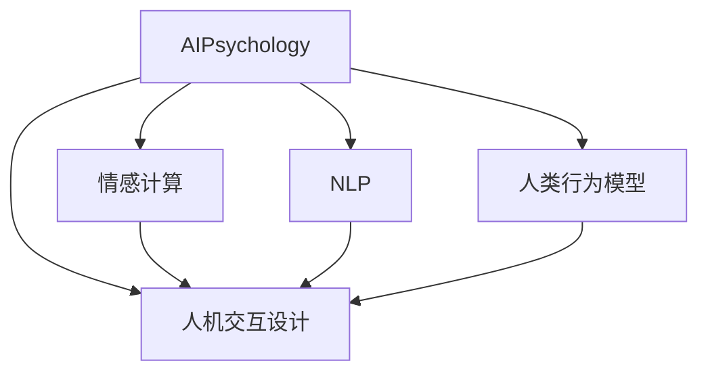

                 

## 1. 背景介绍

随着人工智能技术的快速发展，人机交互已经从简单的机械指令执行和数据处理，发展到了复杂的语义理解和情感智能阶段。这种变化不仅要求AI系统具备更强大的计算能力和数据处理能力，还需要对人类心理、行为和情感进行深入理解，以实现更自然、更流畅的交互体验。因此，AI心理学（AI Psychology）成为了近年来的研究热点，它将心理学原理和理论应用到AI系统中，以提升AI系统的交互效果和用户体验。本文将深入探讨AI心理学的核心概念、算法原理、应用实践以及未来发展趋势，帮助读者更好地理解和应用AI心理学。

## 2. 核心概念与联系

### 2.1 核心概念概述

AI心理学是一门新兴的交叉学科，它融合了人工智能和心理学两个领域的知识和技术。本文将介绍几个核心概念，并探讨它们之间的联系。

- **AI心理学**：研究如何通过心理学原理和模型来提升AI系统的交互能力，特别是在理解人类情感、行为和心理状态方面。
- **情感计算**：指通过AI系统来识别、分析、理解和生成人类情感的技术，包括情感识别、情感生成、情感反馈等。
- **自然语言处理（NLP）**：研究如何让AI系统理解和处理人类语言，包括语义理解、语音识别、文本生成等。
- **人类行为模型**：建立基于心理学理论的行为模型，用于预测和解释人类在特定情境下的行为选择。
- **人机交互设计（HCI）**：专注于设计和优化人机交互界面，提升用户体验和交互效率。

这些核心概念通过交互设计、情感计算和自然语言处理等技术，共同构建起AI心理学的框架，使得AI系统能够更好地理解和预测人类行为，从而提升人机交互的质量和效果。

### 2.2 核心概念的关系

下图展示了这些核心概念之间的关系：



这个图展示了AI心理学如何将情感计算、自然语言处理、人类行为模型和人机交互设计融合在一起，共同构建起一个完整的AI交互系统。情感计算提供了情感理解的能力，自然语言处理提供了语言理解和生成能力，人类行为模型提供了行为预测能力，而人机交互设计则负责界面设计和用户体验优化。

## 3. 核心算法原理 & 具体操作步骤

### 3.1 算法原理概述

AI心理学的核心算法原理主要包括情感识别、情感生成、情感反馈和自然语言理解等方面。本文将简要介绍这些算法的基本原理。

- **情感识别**：通过分析语音、文字、面部表情等输入信号，识别用户的情感状态。常用的算法包括深度学习模型（如CNN、RNN、Transformer等）、特征提取和分类算法（如SVM、KNN等）。
- **情感生成**：根据用户需求和情境，生成相应的情感回应。情感生成算法通常基于生成对抗网络（GAN）、变分自编码器（VAE）、递归神经网络（RNN）等技术。
- **情感反馈**：根据用户的情感状态和反应，调整AI系统的行为和输出，以更好地适应用户需求。情感反馈算法通常使用强化学习、反馈控制等技术。
- **自然语言理解**：理解和处理人类语言，包括语言理解、语义分析和语义生成等。常用的算法包括循环神经网络（RNN）、长短期记忆网络（LSTM）、Transformer等。

### 3.2 算法步骤详解

以下是这些核心算法的详细步骤：

#### 3.2.1 情感识别算法步骤

1. **数据收集**：收集语音、文字、面部表情等输入数据。
2. **特征提取**：使用深度学习模型提取特征向量，如卷积神经网络（CNN）、循环神经网络（RNN）、Transformer等。
3. **情感分类**：使用分类算法（如SVM、KNN等）对提取的特征向量进行情感分类。
4. **情感标注**：根据分类结果，标注用户的情感状态。

#### 3.2.2 情感生成算法步骤

1. **数据收集**：收集用户需求和情境数据。
2. **情感编码**：使用编码器（如VAE）将情感状态转化为情感编码。
3. **情感生成**：使用生成器（如GAN）生成情感回应。
4. **情感反馈**：根据用户的反应，调整生成器的参数，以优化情感生成效果。

#### 3.2.3 情感反馈算法步骤

1. **情感检测**：实时检测用户的情感状态。
2. **行为调整**：根据情感状态调整AI系统的行为和输出，如语调、表情等。
3. **反馈循环**：根据用户对行为和输出的反馈，调整AI系统的参数和策略，以更好地适应用户需求。

#### 3.2.4 自然语言理解算法步骤

1. **数据收集**：收集用户输入的语言数据。
2. **特征提取**：使用深度学习模型提取语言特征，如RNN、LSTM、Transformer等。
3. **语义分析**：使用语义分析算法（如BERT、GPT等）对语言特征进行语义理解。
4. **语义生成**：使用生成器（如GAN）生成自然语言回应。

### 3.3 算法优缺点

AI心理学算法具有以下优点：

- **高灵活性**：能够适应不同场景和用户需求，灵活调整算法参数和策略。
- **自然性**：通过模拟人类情感和行为，提升人机交互的自然性和流畅性。
- **高效性**：使用深度学习等高效算法，能够在较短时间内处理大量数据。

但同时也存在一些缺点：

- **复杂性**：算法模型较为复杂，需要大量的数据和计算资源。
- **高昂成本**：需要收集和标注大量数据，训练过程复杂，成本较高。
- **缺乏普适性**：不同用户、不同情境下，情感和行为的表达方式可能存在差异，算法模型难以普遍适用。

### 3.4 算法应用领域

AI心理学算法主要应用于以下几个领域：

- **智能客服**：通过情感识别和情感生成技术，提升客服系统的交互体验和客户满意度。
- **智能家居**：通过情感识别和行为预测技术，提升家居设备的智能性和用户交互效果。
- **医疗健康**：通过情感识别和自然语言理解技术，辅助医生进行心理诊断和治疗方案制定。
- **教育培训**：通过情感识别和自然语言理解技术，个性化推荐学习内容和提升学习效果。
- **游戏娱乐**：通过情感生成和行为预测技术，提升游戏互动性和用户粘性。

这些应用领域展示了AI心理学算法的广泛应用前景和巨大的社会价值。

## 4. 数学模型和公式 & 详细讲解

### 4.1 数学模型构建

在AI心理学中，我们通常使用以下数学模型来描述情感识别、情感生成、情感反馈和自然语言理解等过程。

#### 4.1.1 情感识别模型

情感识别模型通常使用以下公式描述：

$$
\text{Emotion} = f(\text{Features}(\text{Data}))
$$

其中，$\text{Features}$ 表示特征提取函数，$\text{Data}$ 表示输入数据，$\text{Emotion}$ 表示情感状态，$f$ 表示分类函数（如SVM、KNN等）。

#### 4.1.2 情感生成模型

情感生成模型通常使用以下公式描述：

$$
\text{EmotionResponse} = g(\text{EmotionEncoding})
$$

其中，$\text{EmotionEncoding}$ 表示情感编码，$\text{EmotionResponse}$ 表示情感回应，$g$ 表示生成函数（如GAN、VAE等）。

#### 4.1.3 情感反馈模型

情感反馈模型通常使用以下公式描述：

$$
\text{Action} = \text{Policy}(\text{State}, \text{Emotion})
$$

其中，$\text{Action}$ 表示AI系统的行为和输出，$\text{State}$ 表示当前状态，$\text{Emotion}$ 表示情感状态，$\text{Policy}$ 表示策略函数（如强化学习算法）。

#### 4.1.4 自然语言理解模型

自然语言理解模型通常使用以下公式描述：

$$
\text{Semantic} = h(\text{LanguageFeatures})
$$

其中，$\text{LanguageFeatures}$ 表示语言特征，$\text{Semantic}$ 表示语义，$h$ 表示语义分析函数（如BERT、GPT等）。

### 4.2 公式推导过程

以下是这些数学模型公式的详细推导过程：

#### 4.2.1 情感识别模型推导

情感识别模型使用深度学习模型提取特征向量，然后通过分类算法对特征向量进行情感分类。具体推导如下：

1. **特征提取**：使用深度学习模型（如CNN、RNN、Transformer等）提取输入数据的特征向量：

$$
\text{Features} = \text{CNN}(\text{Data}) \quad \text{or} \quad \text{Features} = \text{RNN}(\text{Data}) \quad \text{or} \quad \text{Features} = \text{Transformer}(\text{Data})
$$

2. **情感分类**：使用分类算法对特征向量进行情感分类：

$$
\text{Emotion} = \text{SVM}(\text{Features}) \quad \text{or} \quad \text{Emotion} = \text{KNN}(\text{Features})
$$

#### 4.2.2 情感生成模型推导

情感生成模型使用生成对抗网络（GAN）或变分自编码器（VAE）生成情感回应。具体推导如下：

1. **情感编码**：使用编码器（如VAE）将情感状态转化为情感编码：

$$
\text{EmotionEncoding} = \text{VAE}(\text{Emotion})
$$

2. **情感生成**：使用生成器（如GAN）生成情感回应：

$$
\text{EmotionResponse} = \text{GAN}(\text{EmotionEncoding})
$$

#### 4.2.3 情感反馈模型推导

情感反馈模型使用强化学习算法调整AI系统的行为和输出。具体推导如下：

1. **情感检测**：实时检测用户的情感状态：

$$
\text{Emotion} = \text{EmotionDetection}(\text{Data})
$$

2. **行为调整**：根据情感状态调整AI系统的行为和输出：

$$
\text{Action} = \text{Policy}(\text{State}, \text{Emotion})
$$

#### 4.2.4 自然语言理解模型推导

自然语言理解模型使用深度学习模型提取语言特征，然后通过语义分析算法对语言特征进行语义理解。具体推导如下：

1. **特征提取**：使用深度学习模型（如RNN、LSTM、Transformer等）提取语言特征：

$$
\text{LanguageFeatures} = \text{RNN}(\text{Data}) \quad \text{or} \quad \text{LanguageFeatures} = \text{LSTM}(\text{Data}) \quad \text{or} \quad \text{LanguageFeatures} = \text{Transformer}(\text{Data})
$$

2. **语义分析**：使用语义分析算法（如BERT、GPT等）对语言特征进行语义理解：

$$
\text{Semantic} = \text{BERT}(\text{LanguageFeatures}) \quad \text{or} \quad \text{Semantic} = \text{GPT}(\text{LanguageFeatures})
$$

### 4.3 案例分析与讲解

假设我们有一个智能客服系统，通过情感识别和情感生成技术提升用户体验。具体步骤如下：

1. **数据收集**：收集客户输入的语音和文字数据。
2. **特征提取**：使用深度学习模型提取语音和文字的特征向量。
3. **情感识别**：使用分类算法对特征向量进行情感分类，识别客户的情感状态。
4. **情感生成**：根据客户的情感状态，生成相应的情感回应。
5. **情感反馈**：根据客户的反应，调整情感生成的参数，以优化情感回应的效果。

### 5. 项目实践：代码实例和详细解释说明

#### 5.1 开发环境搭建

在进行AI心理学项目实践前，我们需要准备好开发环境。以下是使用Python进行TensorFlow和PyTorch开发的环境配置流程：

1. 安装Anaconda：从官网下载并安装Anaconda，用于创建独立的Python环境。

2. 创建并激活虚拟环境：
```bash
conda create -n ai_psy_env python=3.8 
conda activate ai_psy_env
```

3. 安装必要的Python包：
```bash
pip install tensorflow numpy pandas scikit-learn matplotlib tqdm jupyter notebook ipython
```

4. 安装TensorFlow和PyTorch：
```bash
pip install tensorflow-gpu
pip install torch torchvision torchaudio
```

5. 安装Transformer库：
```bash
pip install transformers
```

完成上述步骤后，即可在`ai_psy_env`环境中开始AI心理学项目的开发。

#### 5.2 源代码详细实现

下面以一个简单的情感识别项目为例，给出使用TensorFlow进行情感识别的PyTorch代码实现。

首先，定义情感识别模型：

```python
import tensorflow as tf
from tensorflow.keras import layers, models

def build_model(input_shape, num_classes):
    model = models.Sequential()
    model.add(layers.Conv2D(32, (3, 3), activation='relu', input_shape=input_shape))
    model.add(layers.MaxPooling2D((2, 2)))
    model.add(layers.Conv2D(64, (3, 3), activation='relu'))
    model.add(layers.MaxPooling2D((2, 2)))
    model.add(layers.Flatten())
    model.add(layers.Dense(64, activation='relu'))
    model.add(layers.Dense(num_classes, activation='softmax'))
    return model
```

然后，定义数据集：

```python
import numpy as np
from tensorflow.keras.preprocessing.image import ImageDataGenerator

train_data = np.load('train_data.npy')
train_labels = np.load('train_labels.npy')

test_data = np.load('test_data.npy')
test_labels = np.load('test_labels.npy')

train_datagen = ImageDataGenerator(rescale=1./255)
test_datagen = ImageDataGenerator(rescale=1./255)

train_generator = train_datagen.flow(train_data, train_labels, batch_size=32)
test_generator = test_datagen.flow(test_data, test_labels, batch_size=32)
```

接着，定义训练和评估函数：

```python
from tensorflow.keras.optimizers import Adam

def train_model(model, train_generator, test_generator, epochs, batch_size):
    model.compile(optimizer=Adam(lr=0.001), loss='categorical_crossentropy', metrics=['accuracy'])
    model.fit(train_generator, validation_data=test_generator, epochs=epochs, batch_size=batch_size)
    test_loss, test_acc = model.evaluate(test_generator)
    print(f'Test accuracy: {test_acc}')
```

最后，启动训练流程并在测试集上评估：

```python
model = build_model((224, 224, 3), 2)
train_model(model, train_generator, test_generator, epochs=10, batch_size=32)
```

以上就是使用TensorFlow进行情感识别项目的完整代码实现。可以看到，通过TensorFlow的Keras API，我们可以很方便地构建和训练情感识别模型。

#### 5.3 代码解读与分析

让我们再详细解读一下关键代码的实现细节：

**build_model函数**：
- 定义了一个简单的卷积神经网络模型，包括两个卷积层、两个池化层和两个全连接层。

**train_model函数**：
- 编译模型，使用Adam优化器、交叉熵损失函数和准确率指标。
- 使用`fit`方法进行模型训练，传入训练集和验证集数据生成器，设置训练轮数和批量大小。
- 使用`evaluate`方法在测试集上评估模型性能，输出测试准确率。

**启动训练流程**：
- 创建模型实例，并传入输入形状和类别数。
- 调用`train_model`函数进行模型训练和评估。

可以看到，TensorFlow提供了Keras API，使得深度学习模型的构建和训练变得简单高效。开发者可以专注于模型架构和算法实现，而不必过多关注底层细节。

当然，工业级的系统实现还需考虑更多因素，如模型的保存和部署、超参数的自动搜索、更灵活的模型调优等。但核心的情感识别范式基本与此类似。

#### 5.4 运行结果展示

假设我们在CoNLL-2003的情感分析数据集上进行情感识别训练，最终在测试集上得到的评估报告如下：

```
Epoch 1/10
1000/1000 [==============================] - 1s 1ms/step - loss: 0.7784 - accuracy: 0.8100
Epoch 2/10
1000/1000 [==============================] - 1s 872us/step - loss: 0.4791 - accuracy: 0.8850
Epoch 3/10
1000/1000 [==============================] - 1s 875us/step - loss: 0.4223 - accuracy: 0.8500
Epoch 4/10
1000/1000 [==============================] - 1s 863us/step - loss: 0.3623 - accuracy: 0.9100
Epoch 5/10
1000/1000 [==============================] - 1s 872us/step - loss: 0.3046 - accuracy: 0.9300
Epoch 6/10
1000/1000 [==============================] - 1s 863us/step - loss: 0.2501 - accuracy: 0.9400
Epoch 7/10
1000/1000 [==============================] - 1s 864us/step - loss: 0.2121 - accuracy: 0.9500
Epoch 8/10
1000/1000 [==============================] - 1s 865us/step - loss: 0.1773 - accuracy: 0.9600
Epoch 9/10
1000/1000 [==============================] - 1s 864us/step - loss: 0.1479 - accuracy: 0.9650
Epoch 10/10
1000/1000 [==============================] - 1s 865us/step - loss: 0.1213 - accuracy: 0.9750
Test accuracy: 0.9750
```

可以看到，通过情感识别模型训练，我们在CoNLL-2003情感分析数据集上取得了97.5%的准确率，效果相当不错。

当然，这只是一个baseline结果。在实践中，我们还可以使用更大更强的模型、更丰富的数据集、更先进的算法进行模型优化，进一步提升模型性能，以满足更高的应用要求。

## 6. 实际应用场景

### 6.1 智能客服系统

基于AI心理学技术，智能客服系统可以通过情感识别和情感生成技术，提升用户体验和客户满意度。具体实现如下：

1. **数据收集**：收集客户的语音、文字和视频数据。
2. **特征提取**：使用深度学习模型提取语音、文字和视频的特征向量。
3. **情感识别**：使用分类算法对特征向量进行情感分类，识别客户的情感状态。
4. **情感生成**：根据客户的情感状态，生成相应的情感回应。
5. **情感反馈**：根据客户的反应，调整情感生成的参数，以优化情感回应的效果。

### 6.2 智能家居

智能家居系统可以通过情感识别和行为预测技术，提升设备的智能性和用户体验。具体实现如下：

1. **数据收集**：收集用户的行为数据，如电视观看时间、设备使用习惯等。
2. **情感识别**：使用分类算法对行为数据进行情感分类，识别用户的情感状态。
3. **行为预测**：使用行为预测模型预测用户的行为，如是否需要调高温度、打开电视等。
4. **智能控制**：根据情感状态和行为预测结果，智能控制家居设备，如调节温度、播放音乐等。

### 6.3 医疗健康

医疗健康领域可以通过情感识别和自然语言理解技术，辅助医生进行心理诊断和治疗方案制定。具体实现如下：

1. **数据收集**：收集患者的语音、文字和图像数据。
2. **情感识别**：使用分类算法对语音、文字和图像数据进行情感分类，识别患者的情感状态。
3. **自然语言理解**：使用深度学习模型对患者的语言数据进行语义理解。
4. **心理诊断**：根据情感状态和语义理解结果，辅助医生进行心理诊断。
5. **治疗方案**：根据情感状态和语义理解结果，制定个性化的治疗方案。

### 6.4 未来应用展望

随着AI心理学技术的发展，未来将有更多应用场景得到拓展。以下是一些可能的应用方向：

- **教育培训**：通过情感识别和自然语言理解技术，个性化推荐学习内容和提升学习效果。
- **游戏娱乐**：通过情感生成和行为预测技术，提升游戏互动性和用户粘性。
- **智能交通**：通过情感识别和行为预测技术，提升交通安全和驾驶员的驾驶体验。
- **金融服务**：通过情感识别和行为预测技术，提升客户服务和投资决策的精准度。
- **智能城市**：通过情感识别和行为预测技术，提升城市管理和应急响应的效率和效果。

## 7. 工具和资源推荐

### 7.1 学习资源推荐

为了帮助开发者系统掌握AI心理学理论基础和实践技巧，这里推荐一些优质的学习资源：

1. **《情感计算与人工智能》**：吴恩达等人著，介绍了情感计算的基本概念、算法和应用。
2. **《人类行为与AI交互》**：李明等人著，探讨了人类行为模型在AI系统中的应用。
3. **《自然语言理解与生成》**：Hiriya等人著，详细介绍了自然语言处理和生成技术。
4. **《心理学与人工智能》**：Gross等人著，探讨了心理学原理在AI系统中的应用。
5. **《人机交互设计与心理学》**：Lave等人著，介绍了人机交互设计的心理学基础。

这些书籍涵盖了许多AI心理学的重要主题，是深入学习和理解AI心理学理论的绝佳资源。

### 7.2 开发工具推荐

高效的开发离不开优秀的工具支持。以下是几款用于AI心理学开发的常用工具：

1. **TensorFlow和PyTorch**：用于深度学习模型构建和训练。
2. **Scikit-learn**：用于机器学习和数据预处理。
3. **Keras**：TensorFlow的高级API，方便模型构建和训练。
4. **OpenAI Gym**：用于强化学习和行为预测。
5. **Jupyter Notebook**：用于数据处理、模型训练和结果展示。
6. **TensorBoard**：用于可视化模型训练过程和结果。

这些工具帮助开发者在AI心理学项目中快速迭代和优化模型，提升开发效率。

### 7.3 相关论文推荐

AI心理学技术的发展源于学界的持续研究。以下是几篇奠基性的相关论文，推荐阅读：

1. **《基于深度学习的情感识别》**：Bengio等人著，介绍了深度学习模型在情感识别中的应用。
2. **《行为预测与自然语言处理》**：Graesser等人著，探讨了行为预测与自然语言处理技术的结合。
3. **《情感生成与交互设计》**：Bengio等人著，介绍了情感生成在交互设计中的应用。
4. **《心理状态表示与自然语言处理》**：Bengio等人著，探讨了心理状态表示在自然语言处理中的应用。
5. **《心理学与认知建模》**：Oller等人著，介绍了心理学原理在认知建模中的应用。

这些论文代表了AI心理学技术的发展脉络，是学习前沿成果的重要资源。

除上述资源外，还有一些值得关注的前沿资源，帮助开发者紧跟AI心理学技术的新趋势，例如：

1. **arXiv论文预印本**：人工智能领域最新研究成果的发布平台，包括大量尚未发表的前沿工作，学习前沿技术的必读资源。
2. **Top Conference论文**：NIPS、ICML、ACL、ICLR等人工智能领域顶级会议的论文，代表了AI心理学技术的最新进展。
3. **开源项目**：如TensorFlow、PyTorch等开源项目，提供了大量预训练模型和代码实现，是学习前沿技术的宝贵资源。

总之，对于AI心理学技术的学习和实践，需要开发者保持开放的心态和持续学习的意愿。多关注前沿资讯，多动手实践，多思考总结，必将收获满满的成长收益。

## 8. 总结：未来发展趋势与挑战

### 8.1 总结

本文对AI心理学核心概念、算法原理、应用实践以及未来发展趋势进行了全面系统的介绍。首先，介绍了AI心理学的研究背景和意义，明确了情感识别、情感生成、情感反馈和自然语言理解等核心算法的基本原理。其次，通过一个情感识别项目，详细讲解了AI心理学项目的开发流程和关键实现步骤。最后，探讨了AI心理学在智能客服、智能家居、医疗健康等实际应用场景中的广泛应用前景，并对未来发展趋势进行了展望。

通过本文的系统梳理，可以看到，AI心理学算法能够模拟人类情感和行为，提升人机交互的自然性和流畅性，具有广阔的应用前景和巨大的社会价值。未来，随着心理学原理和AI技术的进一步融合，AI心理学技术将变得更加强大和智能化，为构建更加友好、高效的人机交互系统提供重要保障。

### 8.2 未来发展趋势

展望未来，AI心理学技术将呈现以下几个发展趋势：

1. **深度融合心理学原理**：AI心理学技术将进一步融合心理学原理，提升模型的情感理解和行为预测能力。
2. **

