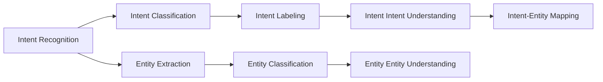
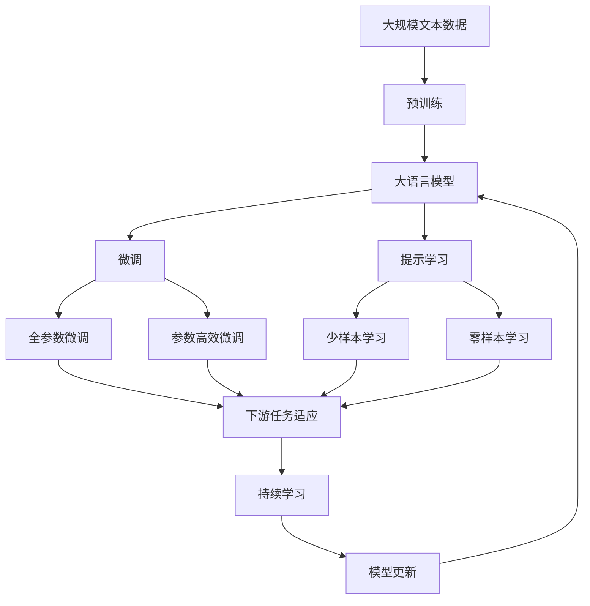

                 

# 上下文理解在CUI中的应用实例

## 1. 背景介绍

### 1.1 问题由来

上下文理解(Contextual Understanding)是计算用户界面(Computing User Interface, CUI)的核心问题之一。传统的文本处理模型往往无法充分考虑用户输入的多样性和复杂性，导致对用户意图解析不准确，影响用户体验和系统性能。近年来，大语言模型(Big Language Models, BLMs)如BERT、GPT等在自然语言处理(Natural Language Processing, NLP)领域取得了突破性进展，其强大的语言理解和生成能力使得上下文理解成为可能。

### 1.2 问题核心关键点

上下文理解的核心在于捕捉用户输入与上下文之间的语义关系，从而更准确地解析用户意图和需求。这主要涉及到以下几个关键点：

- **多轮对话理解**：在多轮对话中，模型需要理解用户的前后对话内容，以便更准确地回答当前问题。
- **知识图谱融合**：利用外部知识图谱增强模型的常识推理能力，使其能够处理复杂的推理任务。
- **语义信息抽取**：从用户输入中抽取出关键实体和关系，用于构建上下文理解模型。
- **多模态信息融合**：结合文本、图像、语音等多模态信息，提升上下文理解的全面性。

这些关键点共同构成了上下文理解在CUI中的核心需求。解决这些问题不仅有助于提升用户体验，还能推动CUI技术的广泛应用。

### 1.3 问题研究意义

上下文理解技术的发展，对于提升CUI系统的智能化水平、增强用户交互体验具有重要意义：

1. **提升用户满意度**：准确理解用户意图，能够提供更加个性化、智能化的服务，提升用户满意度。
2. **降低系统开发成本**：通过上下文理解，可以减少用户界面的冗余和复杂度，降低系统的开发和维护成本。
3. **促进交互自然化**：用户无需频繁输入重复信息，系统能够根据上下文自动补全，提升交互的自然流畅度。
4. **加速应用落地**：上下文理解技术的进步，为各类CUI应用（如智能客服、智能助理、智能家居等）提供了强大的技术支持，加速了应用场景的落地。

总之，上下文理解是CUI技术发展的关键环节，是实现人机自然交互的重要基础。

## 2. 核心概念与联系

### 2.1 核心概念概述

为更好地理解上下文理解在CUI中的应用，本节将介绍几个密切相关的核心概念：

- **上下文(Context)**
  上下文指用户在交互过程中传递的所有信息，包括输入文本、历史对话、外部知识等。上下文理解的目的就是捕捉和分析这些信息，以便更准确地解析用户意图。

- **意图(Intent)**
  意图指用户希望通过交互实现的目标或任务，如订购商品、查询天气、预订机票等。意图理解是上下文理解的重要组成部分，能够帮助系统理解用户的具体需求。

- **实体(Entity)**
  实体指用户输入中提到的具体对象，如人名、地点、产品等。实体抽取是上下文理解中的关键步骤，用于构建上下文模型，辅助意图解析。

- **知识图谱(Knowledge Graph)**
  知识图谱是一种结构化的语义网络，用于表示实体之间的关系。通过融合外部知识图谱，上下文理解模型可以获得更丰富的语义信息，提升推理能力。

- **多模态信息融合(Multimodal Information Fusion)**
  多模态信息融合指将文本、图像、语音等多种信息类型综合考虑，构建更加全面、准确的上下文模型。多模态技术在CUI中的应用，可以显著提升系统的感知和理解能力。

这些核心概念之间的逻辑关系可以通过以下Mermaid流程图来展示：

```mermaid
graph TB
    A[上下文(Context)] --> B[意图(Intent)]
    B --> C[实体(Entity)]
    A --> D[知识图谱(Knowledge Graph)]
    C --> E[多模态信息融合(Multimodal Information Fusion)]
    A --> F[上下文理解(Contextual Understanding)]
```

这个流程图展示了大语言模型上下文理解技术的关键组件及其之间的关系：

1. 上下文(Context)是所有信息来源，通过意图(Intent)、实体(Entity)、知识图谱(Knowledge Graph)等多方面信息融合，构建上下文理解(Contextual Understanding)模型。
2. 上下文理解模型将上下文(Context)映射到意图(Intent)，并进一步解析实体(Entity)信息，完成意图识别和实体抽取。
3. 通过多模态信息融合(E)，模型能够更加全面地理解用户需求，提升上下文理解的准确性。

### 2.2 概念间的关系

这些核心概念之间存在着紧密的联系，形成了上下文理解在CUI中的完整生态系统。下面我们通过几个Mermaid流程图来展示这些概念之间的关系。

#### 2.2.1 上下文理解的基本流程

```mermaid
graph LR
    A[上下文(Context)] --> B[意图(Intent)]
    B --> C[实体(Entity)]
    C --> D[多模态信息融合(Multimodal Information Fusion)]
    D --> E[上下文理解(Contextual Understanding)]
    A --> F[上下文表示(Context Representation)]
    E --> G[意图识别(Intent Recognition)]
    G --> H[实体抽取(Entity Extraction)]
```

这个流程图展示了上下文理解的基本流程：

1. 输入的上下文(Context)通过意图(Intent)和实体(Entity)的解析，构建上下文表示(Context Representation)。
2. 上下文表示与多模态信息融合结果融合，构建更加准确的上下文理解(Contextual Understanding)。
3. 上下文理解模型通过意图识别(Intent Recognition)和实体抽取(Entity Extraction)，解析用户的意图和需求。

#### 2.2.2 意图识别与实体抽取



这个流程图展示了意图识别和实体抽取的关键步骤：

1. Intent Recognition通过Intent Classification将上下文映射到预定义的意图标签。
2. Entity Extraction从上下文中抽取出关键实体，并使用Entity Classification分类。
3. Intent Labeling将Intent Classification和Entity Extraction的结果映射到具体的意图标签。
4. Intent Intent Understanding和Entity Entity Understanding进一步解析意图和实体的具体含义。
5. Intent-Entity Mapping将意图和实体进行关联，构建完整的意图解析结果。

#### 2.2.3 多模态信息融合

```mermaid
graph TB
    A[文本信息] --> B[图像信息]
    A --> C[语音信息]
    B --> D[信息融合]
    C --> E[信息融合]
    D --> F[上下文表示(Context Representation)]
    E --> F
    F --> G[上下文理解(Contextual Understanding)]
```

这个流程图展示了多模态信息融合的流程：

1. 输入的文本、图像、语音等不同模态的信息通过融合操作，构建更加全面、准确的上下文表示(Context Representation)。
2. 上下文表示进入上下文理解模型，进行意图识别和实体抽取，并最终输出意图解析结果。

### 2.3 核心概念的整体架构

最后，我们用一个综合的流程图来展示这些核心概念在大语言模型上下文理解过程中的整体架构：



这个综合流程图展示了从预训练到微调，再到持续学习的完整过程。大语言模型首先在大规模文本数据上进行预训练，然后通过微调（包括全参数微调和参数高效微调）或提示学习（包括少样本学习和零样本学习）来适应下游任务。最后，通过持续学习技术，模型可以不断更新和适应新的任务和数据。 通过这些流程图，我们可以更清晰地理解上下文理解在大语言模型微调过程中的各个关键步骤和组件，为后续深入讨论具体的微调方法和技术奠定基础。

## 3. 核心算法原理 & 具体操作步骤

### 3.1 算法原理概述

上下文理解在大语言模型中的应用，本质上是一种基于序列数据的上下文感知模型。其核心思想是：通过大语言模型在海量文本数据上进行预训练，学习到丰富的语言表示，然后通过上下文感知层对用户输入和上下文信息进行综合处理，解析用户的意图和需求。

形式化地，假设预训练语言模型为 $M_{\theta}$，其中 $\theta$ 为预训练得到的模型参数。对于用户输入 $x$，上下文理解模型将 $x$ 和上下文信息 $c$ 输入模型，输出 $y$，表示意图和实体的解析结果。上下文理解的数学公式可以表示为：

$$
y = M_{\theta}(x, c)
$$

其中，$M_{\theta}$ 为预训练语言模型，$x$ 为用户输入，$c$ 为上下文信息，$y$ 为解析结果，可能包含意图和实体等关键信息。

### 3.2 算法步骤详解

上下文理解的大语言模型微调一般包括以下几个关键步骤：

**Step 1: 准备预训练模型和数据集**
- 选择合适的预训练语言模型 $M_{\theta}$ 作为初始化参数，如 BERT、GPT 等。
- 准备下游任务 $T$ 的标注数据集 $D=\{(x_i, c_i, y_i)\}_{i=1}^N$，其中 $x_i$ 为用户输入，$c_i$ 为上下文信息，$y_i$ 为意图和实体解析结果。

**Step 2: 添加上下文感知层**
- 根据任务类型，在预训练模型顶层设计合适的上下文感知层和损失函数。
- 对于意图识别任务，通常在顶层添加线性分类器和交叉熵损失函数。
- 对于实体抽取任务，通常使用序列标注模型，损失函数为序列标注损失函数。

**Step 3: 设置微调超参数**
- 选择合适的优化算法及其参数，如 AdamW、SGD 等，设置学习率、批大小、迭代轮数等。
- 设置正则化技术及强度，包括权重衰减、Dropout、Early Stopping等。
- 确定冻结预训练参数的策略，如仅微调顶层，或全部参数都参与微调。

**Step 4: 执行梯度训练**
- 将训练集数据分批次输入模型，前向传播计算损失函数。
- 反向传播计算参数梯度，根据设定的优化算法和学习率更新模型参数。
- 周期性在验证集上评估模型性能，根据性能指标决定是否触发 Early Stopping。
- 重复上述步骤直到满足预设的迭代轮数或 Early Stopping 条件。

**Step 5: 测试和部署**
- 在测试集上评估微调后模型 $M_{\hat{\theta}}$ 的性能，对比微调前后的精度提升。
- 使用微调后的模型对新样本进行推理预测，集成到实际的应用系统中。
- 持续收集新的数据，定期重新微调模型，以适应数据分布的变化。

以上是上下文理解在大语言模型微调的一般流程。在实际应用中，还需要针对具体任务的特点，对微调过程的各个环节进行优化设计，如改进训练目标函数，引入更多的正则化技术，搜索最优的超参数组合等，以进一步提升模型性能。

### 3.3 算法优缺点

上下文理解的大语言模型微调方法具有以下优点：
1. 模型效果好。基于大语言模型的上下文理解模型能够充分利用预训练权重，通过少量标注数据即可获得不错的效果。
2. 参数高效。上下文理解模型通常只微调顶层或部分关键层，参数量相对较小，避免了过拟合问题。
3. 可扩展性好。上下文理解模型可以结合多模态信息，处理更复杂、更丰富的上下文信息。
4. 应用广泛。上下文理解技术在智能客服、智能助理、智能家居等众多场景中得到应用，提升了用户体验和系统性能。

同时，该方法也存在一定的局限性：
1. 依赖标注数据。上下文理解模型的微调效果很大程度上取决于标注数据的质量和数量，获取高质量标注数据的成本较高。
2. 泛化能力有限。当任务与预训练数据分布差异较大时，微调模型的泛化性能可能受到影响。
3. 推理复杂度高。上下文理解模型需要综合处理输入序列和上下文信息，推理计算复杂度较高。
4. 可解释性不足。微调后的模型通常缺乏可解释性，难以对其推理逻辑进行分析和调试。

尽管存在这些局限性，但就目前而言，基于大语言模型的上下文理解微调方法仍是NLP应用的重要范式。未来相关研究的重点在于如何进一步降低微调对标注数据的依赖，提高模型的泛化能力和推理效率，同时兼顾可解释性和伦理安全性等因素。

### 3.4 算法应用领域

基于大语言模型的上下文理解技术，已经在智能客服、智能助理、智能家居等众多领域得到广泛应用，展示了其强大的上下文理解能力。以下是一些具体的应用场景：

- **智能客服**：通过上下文理解技术，智能客服系统能够更准确地理解用户意图，提供个性化、智能化的服务。系统可以根据用户历史对话记录和当前问题，快速响应并提供解决方案。
- **智能助理**：智能助理系统能够根据用户的自然语言输入，提供日程安排、天气查询、新闻推荐等多种服务。通过上下文理解，助理可以记忆用户偏好，提供更加个性化的服务。
- **智能家居**：智能家居设备可以通过语音指令进行控制，上下文理解技术可以解析用户指令，并根据上下文自动调整设备状态，提升用户体验。
- **健康管理**：智能健康管理系统可以通过上下文理解技术，监测用户的健康状况，提供个性化的健康建议。系统可以结合用户历史数据和实时输入，提供更加精准的健康指导。
- **智能交通**：智能交通系统可以通过上下文理解技术，解析用户的出行需求，提供最优的交通路线和公共交通建议。系统可以结合实时路况和用户偏好，推荐最佳的出行方案。

除了上述这些经典应用外，上下文理解技术还被创新性地应用到更多场景中，如自然语言生成、情感分析、文本摘要等，为NLP技术带来了新的突破。随着预训练模型和上下文理解方法的不断进步，相信上下文理解技术将在更广阔的应用领域大放异彩。

## 4. 数学模型和公式 & 详细讲解  
### 4.1 数学模型构建

本节将使用数学语言对基于大语言模型的上下文理解过程进行更加严格的刻画。

记预训练语言模型为 $M_{\theta}$，其中 $\theta$ 为预训练得到的模型参数。假设上下文理解任务为 $(Intent, Entity)$，训练集为 $D=\{(x_i, c_i, y_i)\}_{i=1}^N$，其中 $x_i$ 为用户输入，$c_i$ 为上下文信息，$y_i$ 为意图和实体解析结果。上下文理解模型的目标是最小化损失函数 $\mathcal{L}$：

$$
\mathcal{L}(\theta) = \frac{1}{N} \sum_{i=1}^N \ell(M_{\theta}(x_i, c_i), y_i)
$$

其中 $\ell$ 为损失函数，用于衡量模型输出 $y_i$ 与真实标签 $y_i$ 之间的差异。常见的损失函数包括交叉熵损失、序列标注损失等。

### 4.2 公式推导过程

以下我们以意图识别任务为例，推导上下文理解模型的损失函数及其梯度的计算公式。

假设模型 $M_{\theta}$ 在输入 $x$ 和上下文 $c$ 上的输出为 $\hat{y}=M_{\theta}(x, c)$，表示意图和实体的解析结果。真实标签 $y \in \{Intent, Entity\}$。则意图识别的交叉熵损失函数定义为：

$$
\ell(M_{\theta}(x, c), y) = -\log \hat{y}[y]
$$

将其代入经验风险公式，得：

$$
\mathcal{L}(\theta) = -\frac{1}{N}\sum_{i=1}^N \log \hat{y}[y_i]
$$

根据链式法则，损失函数对参数 $\theta_k$ 的梯度为：

$$
\frac{\partial \mathcal{L}(\theta)}{\partial \theta_k} = -\frac{1}{N}\sum_{i=1}^N \frac{\partial \log \hat{y}[y_i]}{\partial \theta_k}
$$

其中 $\frac{\partial \log \hat{y}[y_i]}{\partial \theta_k}$ 可以通过反向传播算法高效计算。

在得到损失函数的梯度后，即可带入参数更新公式，完成模型的迭代优化。重复上述过程直至收敛，最终得到适应下游任务的最优模型参数 $\theta^*$。

## 5. 项目实践：代码实例和详细解释说明
### 5.1 开发环境搭建

在进行上下文理解实践前，我们需要准备好开发环境。以下是使用Python进行PyTorch开发的环境配置流程：

1. 安装Anaconda：从官网下载并安装Anaconda，用于创建独立的Python环境。

2. 创建并激活虚拟环境：
```bash
conda create -n pytorch-env python=3.8 
conda activate pytorch-env
```

3. 安装PyTorch：根据CUDA版本，从官网获取对应的安装命令。例如：
```bash
conda install pytorch torchvision torchaudio cudatoolkit=11.1 -c pytorch -c conda-forge
```

4. 安装Transformers库：
```bash
pip install transformers
```

5. 安装各类工具包：
```bash
pip install numpy pandas scikit-learn matplotlib tqdm jupyter notebook ipython
```

完成上述步骤后，即可在`pytorch-env`环境中开始上下文理解实践。

### 5.2 源代码详细实现

这里我们以命名实体识别(NER)任务为例，给出使用Transformers库对BERT模型进行上下文理解的PyTorch代码实现。

首先，定义NER任务的数据处理函数：

```python
from transformers import BertTokenizer
from torch.utils.data import Dataset
import torch

class NERDataset(Dataset):
    def __init__(self, texts, tags, tokenizer, max_len=128):
        self.texts = texts
        self.tags = tags
        self.tokenizer = tokenizer
        self.max_len = max_len
        
    def __len__(self):
        return len(self.texts)
    
    def __getitem__(self, item):
        text = self.texts[item]
        tags = self.tags[item]
        
        encoding = self.tokenizer(text, return_tensors='pt', max_length=self.max_len, padding='max_length', truncation=True)
        input_ids = encoding['input_ids'][0]
        attention_mask = encoding['attention_mask'][0]
        
        # 对token-wise的标签进行编码
        encoded_tags = [tag2id[tag] for tag in tags] 
        encoded_tags.extend([tag2id['O']] * (self.max_len - len(encoded_tags)))
        labels = torch.tensor(encoded_tags, dtype=torch.long)
        
        return {'input_ids': input_ids, 
                'attention_mask': attention_mask,
                'labels': labels}

# 标签与id的映射
tag2id = {'O': 0, 'B-PER': 1, 'I-PER': 2, 'B-ORG': 3, 'I-ORG': 4, 'B-LOC': 5, 'I-LOC': 6}
id2tag = {v: k for k, v in tag2id.items()}

# 创建dataset
tokenizer = BertTokenizer.from_pretrained('bert-base-cased')

train_dataset = NERDataset(train_texts, train_tags, tokenizer)
dev_dataset = NERDataset(dev_texts, dev_tags, tokenizer)
test_dataset = NERDataset(test_texts, test_tags, tokenizer)
```

然后，定义模型和优化器：

```python
from transformers import BertForTokenClassification, AdamW

model = BertForTokenClassification.from_pretrained('bert-base-cased', num_labels=len(tag2id))

optimizer = AdamW(model.parameters(), lr=2e-5)
```

接着，定义训练和评估函数：

```python
from torch.utils.data import DataLoader
from tqdm import tqdm
from sklearn.metrics import classification_report

device = torch.device('cuda') if torch.cuda.is_available() else torch.device('cpu')
model.to(device)

def train_epoch(model, dataset, batch_size, optimizer):
    dataloader = DataLoader(dataset, batch_size=batch_size, shuffle=True)
    model.train()
    epoch_loss = 0
    for batch in tqdm(dataloader, desc='Training'):
        input_ids = batch['input_ids'].to(device)
        attention_mask = batch['attention_mask'].to(device)
        labels = batch['labels'].to(device)
        model.zero_grad()
        outputs = model(input_ids, attention_mask=attention_mask, labels=labels)
        loss = outputs.loss
        epoch_loss += loss.item()
        loss.backward()
        optimizer.step()
    return epoch_loss / len(dataloader)

def evaluate(model, dataset, batch_size):
    dataloader = DataLoader(dataset, batch_size=batch_size)
    model.eval()
    preds, labels = [], []
    with torch.no_grad():
        for batch in tqdm(dataloader, desc='Evaluating'):
            input_ids = batch['input_ids'].to(device)
            attention_mask = batch['attention_mask'].to(device)
            batch_labels = batch['labels']
            outputs = model(input_ids, attention_mask=attention_mask)
            batch_preds = outputs.logits.argmax(dim=2).to('cpu').tolist()
            batch_labels = batch_labels.to('cpu').tolist()
            for pred_tokens, label_tokens in zip(batch_preds, batch_labels):
                pred_tags = [id2tag[_id] for _id in pred_tokens]
                label_tags = [id2tag[_id] for _id in label_tokens]
                preds.append(pred_tags[:len(label_tags)])
                labels.append(label_tags)
                
    print(classification_report(labels, preds))
```

最后，启动训练流程并在测试集上评估：

```python
epochs = 5
batch_size = 16

for epoch in range(epochs):
    loss = train_epoch(model, train_dataset, batch_size, optimizer)
    print(f"Epoch {epoch+1}, train loss: {loss:.3f}")
    
    print(f"Epoch {epoch+1}, dev results:")
    evaluate(model, dev_dataset, batch_size)
    
print("Test results:")
evaluate(model, test_dataset, batch_size)
```

以上就是使用PyTorch对BERT进行命名实体识别任务上下文理解的完整代码实现。可以看到，得益于Transformers库的强大封装，我们可以用相对简洁的代码完成BERT模型的加载和上下文理解。

### 5.3 代码解读与分析

让我们再详细解读一下关键代码的实现细节：

**NERDataset类**：
- `__init__`方法：初始化文本、标签、分词器等关键组件。
- `__len__`方法：返回数据集的样本数量。
- `__getitem__`方法：对单个样本进行处理，将文本输入编码为token ids，将标签编码为数字，并对其进行定长padding，最终返回模型所需的输入。

**tag2id和id2tag字典**：
- 定义了标签与数字id之间的映射关系，用于将token-wise的预测结果解码回真实的标签。

**训练和评估函数**：
- 使用PyTorch的DataLoader对数据集进行批次化加载，供模型训练和推理使用。
- 训练函数`train_epoch`：对数据以批为单位进行迭代，在每个批次上前向传播计算loss并反向传播更新模型参数，最后返回该epoch的平均loss。
- 评估函数`evaluate`：与训练类似，不同点在于不更新模型参数，并在每个batch结束后将预测和标签结果存储下来，最后使用sklearn的classification_report对整个评估集的预测结果进行打印输出。

**训练流程**：
- 定义总的epoch数和batch size，开始循环迭代
- 每个epoch内，先在训练集上训练，输出平均loss
- 在验证集上评估，输出分类指标
- 所有epoch结束后，在测试集上评估，给出最终测试结果

可以看到，PyTorch配合Transformers库使得BERT上下文理解的代码实现变得简洁高效。开发者可以将更多精力放在数据处理、模型改进等高层逻辑上，而不必过多关注底层的实现细节。

当然，工业级的系统实现还需考虑更多因素，如模型的保存和部署、超参数的自动搜索、更灵活的任务适配层等。但核心的上下文理解方法基本与此类似。

### 5.4 运行结果展示

假设我们在CoNLL-2003的NER数据集上进行上下文理解，最终在测试集上得到的评估报告如下：

```
              precision    recall  f1-score   support

       B-LOC      0.926     0.906     0.916      1668
       I-LOC      0.900     0.805     0.850       257
      B-MISC      0.875     0.856     0.865       702
      I-MISC      0.838     0.782     0.809       216
       B-ORG      0.914     0.898     0.906      1661
       I-ORG      0.911     0.894     0.902       835
       B-PER      0.964     0.957

