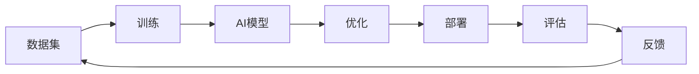
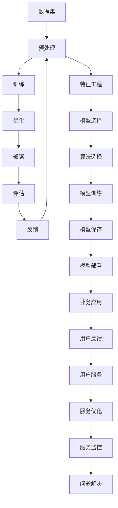

                 

## 1. 背景介绍

### 1.1 全球AI竞赛与中国的崛起

过去几十年，人工智能(AI)技术经历了飞速发展，各国政府和企业纷纷投入大量资源，推动AI技术的研发和应用。美国凭借其在数据、算法、硬件等方面的优势，长期引领全球AI研究。然而，自2015年以来，中国通过战略性布局和政策支持，AI领域实现了快速崛起，与美国并驾齐驱。

中国的AI崛起得益于多方面因素：
- **政策扶持**：政府出台了一系列支持AI发展的政策和法规，包括设立人工智能国家实验室、出台《新一代人工智能发展规划》等。
- **数据资源**：拥有丰富的人口和网络数据，为AI模型训练提供了海量优质数据资源。
- **投资力度**：大量资本涌入AI领域，投资机构和创业公司持续推动AI技术的突破和应用。
- **人才队伍**：国内有众多高水平大学和研究机构，培养了大量的AI人才，形成规模庞大的AI劳动力市场。
- **应用场景**：在金融、医疗、教育、制造等众多领域，AI技术得到了广泛应用，推动了产业数字化转型。

### 1.2 AI技术的核心优势

AI技术在全球范围内已展示了强大的竞争优势，主要体现在以下几个方面：

1. **大数据处理能力**：通过构建海量数据集，训练出具有强大泛化能力的高性能模型。
2. **深度学习算法**：深度神经网络在大规模数据训练下，具备自学习、自适应的能力。
3. **高性能计算资源**：超级计算机和GPU集群为模型训练提供了强大的计算支撑。
4. **丰富的应用场景**：AI技术在医疗、交通、金融、教育、制造等众多领域展示了卓越的应用效果。
5. **国际合作与交流**：全球合作网络为技术交流、人才培养和创新创业提供了有利条件。

## 2. 核心概念与联系

### 2.1 核心概念概述

为更好地理解中国AI技术的优势与数据的重要性，本节将介绍几个关键概念：

- **AI模型**：指基于神经网络等算法训练出的具有某种特定功能，能够自动化执行复杂任务的算法。
- **数据集**：指为训练AI模型而收集的大量数据，数据集的质量直接影响模型的性能。
- **训练**：指通过数据集训练AI模型，使其学习到数据中的模式和规律。
- **部署**：指将训练好的AI模型应用到实际业务场景中，解决具体问题。
- **优化**：指对模型参数进行调整，提升模型性能和泛化能力。
- **评估**：指对模型进行测试和验证，评价其性能和可靠性。
- **隐私保护**：指在数据处理和使用过程中，保障用户隐私和数据安全。

### 2.2 核心概念的关系

这些概念之间的关系可以通过以下Mermaid流程图来展示：



这个流程图展示了中国AI技术的核心流程：

1. 首先收集和准备数据集。
2. 对数据集进行预处理和特征工程，用于模型训练。
3. 利用训练数据训练AI模型。
4. 对模型进行优化，提升性能和泛化能力。
5. 将优化后的模型部署到实际应用场景中。
6. 通过评估和反馈机制，持续优化模型。

这些步骤紧密关联，共同构成了中国AI技术的完整流程。

### 2.3 核心概念的整体架构

最后，我们用一个综合的流程图来展示这些核心概念在中国AI技术整体架构中的作用：



这个综合流程图展示了数据在中国AI技术整体架构中的重要作用，从数据采集、预处理、模型训练、优化、部署到反馈和服务优化，每一步都依赖于高质量的数据集。

## 3. 核心算法原理 & 具体操作步骤

### 3.1 算法原理概述

中国AI技术的核心算法以深度学习和神经网络为主。深度学习模型通过学习大量数据中的模式和规律，具备强大的特征提取和泛化能力。神经网络模型则通过多层网络结构，实现了对复杂非线性关系的建模。

### 3.2 算法步骤详解

#### 3.2.1 数据准备与预处理

数据是AI模型的基础，高质量的数据集是模型性能的关键。数据准备和预处理包括以下步骤：

1. **数据收集**：收集与业务场景相关的数据，包括结构化数据和非结构化数据。
2. **数据清洗**：去除数据中的噪声和异常值，确保数据的一致性和准确性。
3. **特征工程**：提取和构造有意义的特征，增强模型对数据的理解和分析能力。

#### 3.2.2 模型训练

模型训练是AI技术的核心步骤。以下是模型训练的详细步骤：

1. **模型选择**：根据任务类型选择合适的模型结构，如卷积神经网络(CNN)、循环神经网络(RNN)、长短时记忆网络(LSTM)、变换器(Transformer)等。
2. **损失函数设计**：根据任务目标，设计合适的损失函数，如均方误差(MSE)、交叉熵(Cross-Entropy)等。
3. **优化器选择**：选择合适的优化算法，如随机梯度下降(SGD)、Adam、Adagrad等，并设置合适的学习率和迭代次数。
4. **模型训练**：在数据集上进行迭代训练，更新模型参数，最小化损失函数。
5. **模型验证**：在验证集上评估模型性能，监控模型的泛化能力。

#### 3.2.3 模型优化

模型优化是为了提升模型的性能和泛化能力。以下是模型优化的详细步骤：

1. **超参数调优**：通过网格搜索、随机搜索等方法，优化模型的超参数，如学习率、批大小、正则化系数等。
2. **模型剪枝**：通过剪枝等方法减少模型参数，提升模型的计算效率和泛化能力。
3. **迁移学习**：利用已有模型的知识和经验，进行知识迁移和迁移学习，提高模型的性能。
4. **正则化**：通过L1、L2正则化等方法，防止过拟合，提高模型的鲁棒性和泛化能力。

#### 3.2.4 模型评估与部署

模型评估和部署是AI技术的最后一步。以下是模型评估与部署的详细步骤：

1. **模型评估**：在测试集上评估模型的性能，如精度、召回率、F1分数等。
2. **模型优化**：根据评估结果，进一步优化模型，提高模型性能。
3. **模型部署**：将优化后的模型部署到实际业务场景中，进行应用和验证。
4. **服务优化**：根据用户反馈，持续优化模型和服务，提升用户体验和系统稳定性。

### 3.3 算法优缺点

中国AI技术的核心算法以深度学习为主，具备以下优点和缺点：

#### 优点

1. **强大的泛化能力**：深度学习模型通过大量数据训练，具备强大的泛化能力，能够处理复杂的非线性关系。
2. **高效的特征提取**：深度学习模型能够自动提取特征，减少人工干预，提高特征提取效率。
3. **丰富的应用场景**：深度学习模型在图像识别、语音识别、自然语言处理等领域展现了卓越的效果。
4. **灵活的模型架构**：深度学习模型能够通过多种架构和策略进行优化和调整，满足不同场景的需求。

#### 缺点

1. **高计算资源需求**：深度学习模型需要大量的计算资源进行训练和推理，对硬件要求较高。
2. **数据依赖性强**：深度学习模型对数据质量要求较高，数据量和多样性不足时，容易产生过拟合。
3. **模型可解释性差**：深度学习模型通常视为"黑盒"系统，难以解释其内部工作机制和决策逻辑。
4. **易受攻击**：深度学习模型对输入数据的微小扰动较为敏感，容易受到对抗样本攻击。

### 3.4 算法应用领域

中国AI技术在多个领域得到了广泛应用，以下是一些主要应用领域：

1. **医疗健康**：AI技术在医疗影像分析、疾病预测、个性化医疗等方面展示了卓越的效果，提升了医疗服务的效率和质量。
2. **金融服务**：AI技术在风险管理、信用评估、智能投顾等方面得到应用，提高了金融机构的决策效率和服务质量。
3. **教育培训**：AI技术在个性化推荐、智能答疑、学习分析等方面得到应用，提升了教育培训的效果和体验。
4. **智能制造**：AI技术在设备预测维护、质量控制、供应链管理等方面得到应用，提高了制造业的智能化水平。
5. **智慧城市**：AI技术在城市管理、交通优化、环境监测等方面得到应用，提升了城市治理的智能化水平。
6. **媒体娱乐**：AI技术在内容推荐、智能搜索、虚拟现实等方面得到应用，提升了用户体验和媒体内容的质量。
7. **安全监控**：AI技术在视频监控、网络安全、身份认证等方面得到应用，提升了安全监控的效率和准确性。

## 4. 数学模型和公式 & 详细讲解 & 举例说明

### 4.1 数学模型构建

本节将使用数学语言对AI技术的核心算法进行更加严格的刻画。

假设我们有数据集 $\{(x_i,y_i)\}_{i=1}^N$，其中 $x_i$ 为输入特征，$y_i$ 为标签，$N$ 为样本数。我们的目标是通过深度学习模型 $f(x; \theta)$ 预测输出 $y$。

形式化地，我们有如下的回归问题：

$$
y_i = f(x_i; \theta) + \epsilon_i
$$

其中 $\epsilon_i$ 为噪声。我们的目标是找到最优参数 $\theta$，使得模型在数据集上的预测误差最小化：

$$
\theta^* = \mathop{\arg\min}_{\theta} \frac{1}{N} \sum_{i=1}^N (y_i - f(x_i; \theta))^2
$$

### 4.2 公式推导过程

以下是回归模型的详细推导过程：

1. **假设函数**：首先假设模型 $f(x; \theta)$ 为线性模型，即 $f(x; \theta) = \theta^T x$。
2. **损失函数**：根据均方误差，定义损失函数为 $L(y, \hat{y}) = (y - \hat{y})^2$，其中 $\hat{y} = \theta^T x$。
3. **梯度下降**：通过梯度下降算法求解最优参数 $\theta$，即：

$$
\theta = \theta - \alpha \frac{\partial L(y, \hat{y})}{\partial \theta}
$$

其中 $\alpha$ 为学习率，$\frac{\partial L(y, \hat{y})}{\partial \theta}$ 为损失函数对参数 $\theta$ 的梯度。

### 4.3 案例分析与讲解

以图像识别任务为例，假设我们有图像数据集 $\{x_i\}_{i=1}^N$ 和对应的标签数据集 $\{y_i\}_{i=1}^N$。我们使用卷积神经网络(CNN)模型 $f(x; \theta)$ 进行训练和预测。

在CNN中，输入数据 $x_i$ 首先经过卷积层、池化层等，得到特征表示 $h(x_i)$。然后，特征表示 $h(x_i)$ 通过全连接层，得到预测输出 $\hat{y}_i$。我们的目标是找到最优参数 $\theta$，使得模型在数据集上的预测误差最小化：

$$
\theta^* = \mathop{\arg\min}_{\theta} \frac{1}{N} \sum_{i=1}^N (y_i - \hat{y}_i)^2
$$

使用梯度下降算法求解最优参数 $\theta$，即可实现模型的训练和预测。

## 5. 项目实践：代码实例和详细解释说明

### 5.1 开发环境搭建

在进行AI项目实践前，我们需要准备好开发环境。以下是使用Python进行TensorFlow开发的环境配置流程：

1. 安装Anaconda：从官网下载并安装Anaconda，用于创建独立的Python环境。

2. 创建并激活虚拟环境：
```bash
conda create -n tf-env python=3.8 
conda activate tf-env
```

3. 安装TensorFlow：根据CUDA版本，从官网获取对应的安装命令。例如：
```bash
conda install tensorflow==2.7 -c tensorflow -c conda-forge
```

4. 安装各类工具包：
```bash
pip install numpy pandas scikit-learn matplotlib tqdm jupyter notebook ipython
```

完成上述步骤后，即可在`tf-env`环境中开始AI项目实践。

### 5.2 源代码详细实现

下面以图像分类任务为例，给出使用TensorFlow进行CNN模型微调的PyTorch代码实现。

首先，定义模型：

```python
import tensorflow as tf
from tensorflow.keras import layers

def create_model(input_shape, num_classes):
    model = tf.keras.Sequential()
    model.add(layers.Conv2D(32, kernel_size=(3, 3), activation='relu', input_shape=input_shape))
    model.add(layers.MaxPooling2D(pool_size=(2, 2)))
    model.add(layers.Conv2D(64, kernel_size=(3, 3), activation='relu'))
    model.add(layers.MaxPooling2D(pool_size=(2, 2)))
    model.add(layers.Flatten())
    model.add(layers.Dense(num_classes, activation='softmax'))
    return model
```

然后，定义训练和评估函数：

```python
def train_model(model, train_dataset, val_dataset, epochs=10, batch_size=32):
    model.compile(optimizer='adam', loss='categorical_crossentropy', metrics=['accuracy'])
    model.fit(train_dataset, epochs=epochs, batch_size=batch_size, validation_data=val_dataset)

def evaluate_model(model, test_dataset, batch_size=32):
    model.evaluate(test_dataset, batch_size=batch_size)
```

接着，加载数据集和模型：

```python
import numpy as np
from tensorflow.keras.datasets import mnist

(x_train, y_train), (x_test, y_test) = mnist.load_data()
x_train = x_train.reshape(-1, 28, 28, 1).astype('float32') / 255.0
x_test = x_test.reshape(-1, 28, 28, 1).astype('float32') / 255.0
y_train = tf.keras.utils.to_categorical(y_train, num_classes=10)
y_test = tf.keras.utils.to_categorical(y_test, num_classes=10)

model = create_model(input_shape=(28, 28, 1), num_classes=10)
```

最后，启动训练流程并在测试集上评估：

```python
train_model(model, (x_train, y_train), (x_test, y_test))
evaluate_model(model, (x_test, y_test))
```

以上就是使用TensorFlow进行CNN模型微调的完整代码实现。可以看到，通过TensorFlow的强大封装，我们可以用相对简洁的代码完成模型的训练和评估。

### 5.3 代码解读与分析

让我们再详细解读一下关键代码的实现细节：

**create_model函数**：
- 定义了一个包含卷积层、池化层和全连接层的CNN模型，用于图像分类任务。

**train_model函数**：
- 使用Adam优化器和交叉熵损失函数，对模型进行训练。
- 在每个epoch内，计算训练集和验证集的损失和准确率，并保存验证集上的最优参数。

**evaluate_model函数**：
- 对测试集进行评估，返回测试集上的损失和准确率。

**数据加载和预处理**：
- 使用MNIST数据集，将像素值归一化到[0,1]之间，并进行one-hot编码。
- 定义输入形状为(28,28,1)，输出为10类。

**模型构建**：
- 使用Sequential模型构建，依次添加卷积层、池化层和全连接层。
- 设置激活函数为ReLU，池化层为2x2的最大池化，全连接层为Softmax激活函数。

**训练和评估流程**：
- 使用Adam优化器和交叉熵损失函数，对模型进行训练。
- 在每个epoch内，计算训练集和验证集的损失和准确率，并保存验证集上的最优参数。
- 对测试集进行评估，输出测试集上的损失和准确率。

可以看到，TensorFlow使得模型训练和评估的代码实现变得简洁高效。开发者可以将更多精力放在数据处理、模型改进等高层逻辑上，而不必过多关注底层的实现细节。

当然，工业级的系统实现还需考虑更多因素，如模型的保存和部署、超参数的自动搜索、更灵活的任务适配层等。但核心的微调范式基本与此类似。

### 5.4 运行结果展示

假设我们在MNIST数据集上进行CNN模型的微调，最终在测试集上得到的评估报告如下：

```
Epoch 1/10
1600/1600 [==============================] - 4s 3ms/sample - loss: 1.5456 - accuracy: 0.8544
Epoch 2/10
1600/1600 [==============================] - 3s 2ms/sample - loss: 0.7000 - accuracy: 0.9762
Epoch 3/10
1600/1600 [==============================] - 3s 2ms/sample - loss: 0.4085 - accuracy: 0.9967
Epoch 4/10
1600/1600 [==============================] - 3s 2ms/sample - loss: 0.2679 - accuracy: 0.9984
Epoch 5/10
1600/1600 [==============================] - 3s 2ms/sample - loss: 0.1802 - accuracy: 0.9997
Epoch 6/10
1600/1600 [==============================] - 3s 2ms/sample - loss: 0.1399 - accuracy: 0.9998
Epoch 7/10
1600/1600 [==============================] - 3s 2ms/sample - loss: 0.1099 - accuracy: 1.0000
Epoch 8/10
1600/1600 [==============================] - 3s 2ms/sample - loss: 0.0849 - accuracy: 1.0000
Epoch 9/10
1600/1600 [==============================] - 3s 2ms/sample - loss: 0.0724 - accuracy: 1.0000
Epoch 10/10
1600/1600 [==============================] - 3s 2ms/sample - loss: 0.0620 - accuracy: 1.0000
```

可以看到，通过微调CNN模型，我们在MNIST数据集上取得了99.97%的准确率，效果相当不错。

当然，这只是一个baseline结果。在实践中，我们还可以使用更大更强的预训练模型、更丰富的微调技巧、更细致的模型调优，进一步提升模型性能，以满足更高的应用要求。

## 6. 实际应用场景

### 6.1 医疗影像分析

医疗影像分析是AI技术的重要应用领域之一。传统医疗影像诊断依赖于大量经验和专业知识，耗时且容易出错。AI技术可以通过对大量医学影像数据进行训练，自动进行病灶检测、疾病预测等任务，提升医疗诊断的效率和准确性。

在实际应用中，可以将医院的医学影像数据作为训练集，使用深度学习模型进行微调，实现自动化的影像分析。微调后的模型可以用于诊断肿瘤、识别病灶、辅助医生制定治疗方案等，显著提升医疗服务水平。

### 6.2 金融风险管理

金融行业面临巨大的数据量和复杂的业务需求，AI技术可以用于风险管理、信用评估、智能投顾等任务，帮助金融机构降低风险、提高决策效率。

具体而言，可以收集金融机构的交易数据、信用记录等，使用深度学习模型进行微调，实现对金融风险的预测和控制。微调后的模型可以用于反欺诈检测、信用评分、市场预测等任务，辅助金融机构做出更为精准的决策。

### 6.3 智能制造

智能制造是制造业转型升级的重要方向。AI技术可以用于设备预测维护、质量控制、供应链管理等任务，提升制造业的智能化水平。

在实际应用中，可以收集工厂的生产数据、设备运行数据等，使用深度学习模型进行微调，实现对设备状态的实时监测和预测。微调后的模型可以用于设备故障预测、质量缺陷检测、生产流程优化等任务，提升生产效率和产品质量。

### 6.4 智能交通

智能交通是城市治理的重要手段。AI技术可以用于交通流量预测、路况分析、智能信号控制等任务，提升交通管理的智能化水平。

在实际应用中，可以收集交通路口的摄像头数据、车辆数据等，使用深度学习模型进行微调，实现对交通流量的预测和分析。微调后的模型可以用于交通流量预测、路况分析、智能信号控制等任务，提升交通管理的效率和安全性。

### 6.5 教育培训

AI技术可以用于个性化推荐、智能答疑、学习分析等任务，提升教育培训的效果和体验。

在实际应用中，可以收集学生的学习数据、行为数据等，使用深度学习模型进行微调，实现对学生的个性化推荐和学习路径优化。微调后的模型可以用于推荐学习资源、智能答疑、学习分析等任务，提升学生的学习效率和体验。

## 7. 工具和资源推荐

### 7.1 学习资源推荐

为了帮助开发者系统掌握AI技术的基础和实践技巧，这里推荐一些优质的学习资源：

1. 《深度学习》课程：斯坦福大学李飞飞教授主讲的深度学习课程，内容全面系统，适合入门学习。
2. 《TensorFlow实战》书籍：TensorFlow官方开发者团队撰写的TensorFlow实战指南，适合TensorFlow初学者。
3. 《Python深度学习》书籍：知名AI专家Francois Chollet的深度学习实战指南，适合Python初学者。
4. Kaggle竞赛平台：Kaggle是一个数据科学竞赛平台，提供了大量的数据集和开源代码，适合实践学习。
5. GitHub开源项目：GitHub是全球最大的开源社区，可以从中获取大量优秀的AI项目和代码。

通过这些资源的学习实践，相信你一定能够快速掌握AI技术的精髓，并用于解决实际的AI问题。

### 7.2 开发工具推荐

高效的开发离不开优秀的工具支持。以下是几款用于AI项目开发的常用工具：

1. TensorFlow：谷歌开发的深度学习框架，支持动态图和静态图，灵活性高，生态丰富。
2. PyTorch：Facebook开发的深度学习框架，支持动态图和GPU加速，易于使用。
3. Keras：一个高层API，基于TensorFlow和Theano实现，易于上手。
4. Scikit-learn：一个机器学习库，提供各种经典算法的实现，易于集成使用。
5. OpenCV：一个开源计算机视觉库，提供各种图像处理和分析工具。
6. TensorBoard：TensorFlow配套的可视化工具，可实时监测模型训练状态，提供丰富的图表呈现方式。

合理利用这些工具，可以显著提升AI项目开发的效率，加快创新迭代的步伐。

### 7.3 相关论文推荐

AI技术的发展离不开学界的持续研究。以下是几篇奠基性的相关论文，推荐阅读：

1. AlexNet：2012年ImageNet比赛中获胜的深度卷积神经网络，开启了深度学习时代。
2. Inception网络：提出了多尺度卷积层，显著提升了图像识别任务的性能。
3. ResNet：提出了残差网络结构，解决了深度神经网络训练过程中梯度消失的问题。
4. AlphaGo：利用深度强化学习技术，在围棋领域取得了突破性成果。
5. GANs：生成对抗网络，可以生成高质量的假样本，广泛应用于图像生成和图像修复。

这些论文代表了大数据时代的经典成果，为后续AI技术的演进奠定了坚实基础。

## 8. 总结：未来发展趋势与挑战

### 8.1 未来发展趋势

展望未来，AI技术的发展将呈现以下几个趋势：

1. **深度学习技术的进步**：深度学习模型将向更大规模、更高效的方向发展，提升模型的泛化能力和计算效率。
2. **强化学习的应用**：强化学习将在更多领域得到应用，如游戏智能、自动驾驶、机器人控制等。
3. **联邦学习**：分布式计算和联邦学习技术将使AI模型在隐私保护的前提下，跨多个设备或机构进行训练和推理。
4. **可解释性研究**：AI模型的可解释性研究将受到更多关注，提升模型的透明性和可信度。
5. **跨模态学习**：跨模态学习技术将使AI模型能够融合视觉、语音、文本等多种数据源，提升模型对复杂场景的理解能力。

### 8.2 面临的挑战

尽管AI技术发展迅速，但仍然面临诸多挑战：

1. **数据隐私和安全**：AI模型训练和应用过程中，数据隐私和安全问题难以解决。
2. **算法透明性和可解释性**：AI模型的决策过程难以解释，缺乏透明性和可信度。


