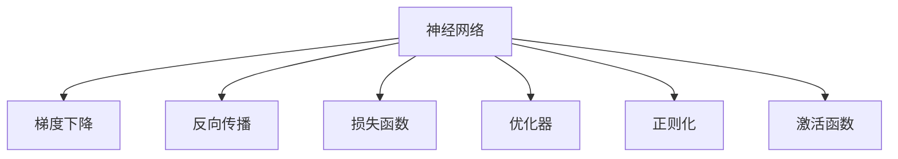
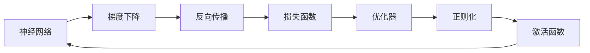
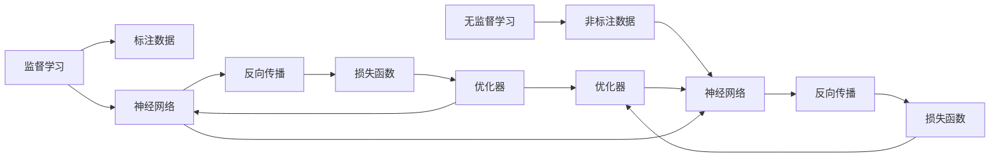
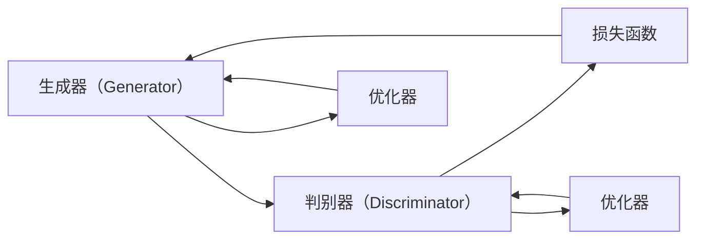
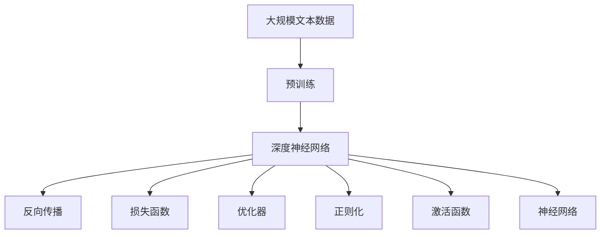

                 

# 人工智能的深度学习方法

> 关键词：深度学习,神经网络,梯度下降,反向传播,损失函数,优化器,监督学习,无监督学习,生成对抗网络

## 1. 背景介绍

### 1.1 问题由来

深度学习（Deep Learning）是当今人工智能领域最为热门和强大的技术之一，其主要应用领域包括计算机视觉、自然语言处理、语音识别、机器人学、推荐系统等。深度学习模型的核心思想是通过构建多层次的神经网络，对大规模数据进行特征提取和模式识别，从而实现高性能的预测和分类。

深度学习的成功很大程度上归功于其背后的深度神经网络（Deep Neural Network, DNN）架构，其核心思想是通过堆叠多个隐含层（或称为“深度”）来模拟人脑的复杂认知过程，并自动学习数据中的复杂特征表示。然而，深度神经网络的设计和训练过程往往非常复杂，涉及到大量的参数调优、正则化、数据预处理等步骤，这使得深度学习模型对技术门槛要求较高，难以被广泛应用。

### 1.2 问题核心关键点

深度学习的核心关键点在于以下几个方面：

1. **神经网络结构**：深度神经网络通常由多个隐含层组成，每个隐含层包含多个神经元，通过权重和偏置连接，将输入数据逐渐转换为更高层次的特征表示。

2. **损失函数**：损失函数是衡量模型预测结果与真实标签之间差异的标准，用于指导模型参数的优化。常见的损失函数包括均方误差、交叉熵、对数损失等。

3. **优化器**：优化器是用于调整模型参数以最小化损失函数的工具，常用的优化器包括梯度下降（Gradient Descent）、随机梯度下降（Stochastic Gradient Descent, SGD）、Adam、Adagrad等。

4. **正则化**：正则化技术用于避免模型过拟合，常见的正则化方法包括L1正则、L2正则、Dropout等。

5. **激活函数**：激活函数用于引入非线性变换，常见的激活函数包括Sigmoid、ReLU、Tanh等。

6. **反向传播**：反向传播算法是深度学习模型训练的核心，通过计算损失函数对参数的梯度，逐层反向传播更新模型参数。

7. **数据预处理**：数据预处理包括归一化、标准化、数据增强等步骤，用于提高模型的泛化能力。

### 1.3 问题研究意义

深度学习技术在许多领域都取得了显著的成功，例如语音识别、图像识别、自然语言处理等。这些技术的应用不仅极大地提高了人类生活的便利性，还促进了人工智能产业的发展，带来了巨大的经济价值。然而，深度学习模型的训练过程复杂，需要大量的计算资源和时间，且对数据质量要求极高，这使得深度学习模型的应用存在一定的局限性。

为了更好地理解深度学习的原理和应用，本文将详细介绍深度学习的核心概念和算法原理，并结合具体的项目实践，展示深度学习在实际应用中的各种创新和突破。通过本文的系统梳理，希望能为读者提供清晰的理论框架和技术指导，推动深度学习技术的进一步发展。

## 2. 核心概念与联系

### 2.1 核心概念概述

为更好地理解深度学习的核心概念及其联系，本节将介绍几个关键概念：

- **神经网络（Neural Network）**：深度神经网络的核心组成部分，由多个层次的神经元组成，每个神经元接收输入数据，通过权重和偏置计算输出。

- **梯度下降（Gradient Descent）**：深度学习模型训练中最常用的优化算法，通过计算损失函数对参数的梯度，逐层反向传播更新模型参数。

- **反向传播（Backpropagation）**：深度学习模型训练的核心算法，通过计算损失函数对参数的梯度，逐层反向传播更新模型参数。

- **损失函数（Loss Function）**：衡量模型预测结果与真实标签之间差异的标准，用于指导模型参数的优化。

- **优化器（Optimizer）**：用于调整模型参数以最小化损失函数的工具，常用的优化器包括梯度下降、随机梯度下降、Adam、Adagrad等。

- **正则化（Regularization）**：用于避免模型过拟合的技术，常见的正则化方法包括L1正则、L2正则、Dropout等。

- **激活函数（Activation Function）**：用于引入非线性变换的函数，常见的激活函数包括Sigmoid、ReLU、Tanh等。

这些概念之间的逻辑关系可以通过以下Mermaid流程图来展示：



这个流程图展示了大语言模型微调过程中各个核心概念的关系：

1. 神经网络通过反向传播算法计算损失函数的梯度，更新模型参数。
2. 梯度下降算法用于最小化损失函数，优化器根据梯度调整参数。
3. 损失函数用于衡量模型的预测与真实标签之间的差异。
4. 正则化技术用于避免过拟合，提高模型的泛化能力。
5. 激活函数用于引入非线性变换，增强模型的表达能力。

### 2.2 概念间的关系

这些核心概念之间存在着紧密的联系，形成了深度学习的完整生态系统。下面我通过几个Mermaid流程图来展示这些概念之间的关系。

#### 2.2.1 深度学习的学习范式



这个流程图展示了深度学习的学习范式，即通过反向传播算法计算损失函数的梯度，然后通过梯度下降等优化算法更新模型参数，同时引入正则化和激活函数来避免过拟合和增强非线性变换能力。

#### 2.2.2 监督学习和无监督学习的对比



这个流程图展示了监督学习和无监督学习的对比，其中监督学习需要标注数据，而无监督学习则不需要。两种学习方法都需要通过反向传播算法更新神经网络参数，但监督学习需要损失函数和优化器的辅助，而无监督学习则可以通过其他方式（如自编码器）来引入损失函数。

#### 2.2.3 生成对抗网络



这个流程图展示了生成对抗网络（Generative Adversarial Network, GAN）的基本结构，其中生成器用于生成假数据，判别器用于区分真假数据，损失函数用于衡量生成器和判别器之间的对抗性能，优化器用于更新生成器和判别器的参数。

### 2.3 核心概念的整体架构

最后，我们用一个综合的流程图来展示这些核心概念在大语言模型微调过程中的整体架构：



这个综合流程图展示了从预训练到微调，再到深度学习的完整过程。深度神经网络通过反向传播算法计算损失函数的梯度，然后通过优化器更新参数，同时引入正则化和激活函数来避免过拟合和增强非线性变换能力。

## 3. 核心算法原理 & 具体操作步骤
### 3.1 算法原理概述

深度学习的核心算法原理是神经网络，其核心思想是通过堆叠多个隐含层来模拟人脑的复杂认知过程，并自动学习数据中的复杂特征表示。

深度神经网络通常由多个隐含层组成，每个隐含层包含多个神经元，通过权重和偏置连接，将输入数据逐渐转换为更高层次的特征表示。其基本结构如下：

$$
N_{\theta}(x) = \sigma(W_L h_{L-1} + b_L)
$$

其中，$x$为输入数据，$N_{\theta}$为神经网络模型，$W_L$和$b_L$为第$L$层的权重和偏置，$h_{L-1}$为第$L-1$层的输出，$\sigma$为激活函数。

深度神经网络的核心算法是反向传播，其基本思想是：

1. 从输出层开始，计算损失函数对输出层的梯度。
2. 根据梯度逐层反向传播，计算损失函数对每个隐含层的梯度。
3. 根据梯度更新每个隐含层的权重和偏置，最小化损失函数。

形式化地，设损失函数为$L$，第$L$层的输出为$h_L$，权重为$W_L$，激活函数为$\sigma$，则反向传播算法的公式为：

$$
\frac{\partial L}{\partial W_L} = \frac{\partial L}{\partial h_{L+1}} \frac{\partial h_{L+1}}{\partial W_L}
$$

其中，$\frac{\partial L}{\partial h_{L+1}}$为输出层对第$L+1$层的梯度，$\frac{\partial h_{L+1}}{\partial W_L}$为第$L+1$层对权重$W_L$的梯度。

### 3.2 算法步骤详解

深度学习的训练过程主要包括以下几个关键步骤：

**Step 1: 准备数据集**

1. 收集和预处理数据集，包括数据清洗、归一化、标准化等步骤。
2. 将数据集划分为训练集、验证集和测试集。

**Step 2: 设计神经网络模型**

1. 选择合适的神经网络结构，如全连接神经网络、卷积神经网络（CNN）、循环神经网络（RNN）、长短期记忆网络（LSTM）等。
2. 确定每个隐含层的神经元数量、激活函数、权重和偏置等参数。
3. 引入正则化技术，如L1正则、L2正则、Dropout等，防止过拟合。

**Step 3: 定义损失函数**

1. 根据具体任务，选择适当的损失函数。
2. 常用的损失函数包括均方误差（MSE）、交叉熵（CE）、对数损失（Log Loss）等。

**Step 4: 选择优化器**

1. 根据具体任务和数据特点，选择适当的优化器。
2. 常用的优化器包括梯度下降（GD）、随机梯度下降（SGD）、Adam、Adagrad等。

**Step 5: 执行训练**

1. 使用随机梯度下降等优化算法，逐步更新模型参数。
2. 在每个epoch结束时，计算模型在验证集上的表现，根据性能指标调整学习率或终止训练。
3. 在训练过程中，记录每个epoch的损失函数值和模型参数，用于可视化分析。

**Step 6: 评估和优化**

1. 在测试集上评估模型的性能，比较不同模型之间的差异。
2. 根据测试结果，调整模型结构、学习率、正则化等参数，进一步优化模型性能。

**Step 7: 应用部署**

1. 将训练好的模型部署到实际应用中，进行推理预测。
2. 结合业务需求，优化模型输出，提供更好的服务质量。

以上是深度学习的训练过程，在实际应用中，还需要根据具体任务的特点，对训练过程的各个环节进行优化设计，如改进训练目标函数，引入更多的正则化技术，搜索最优的超参数组合等，以进一步提升模型性能。

### 3.3 算法优缺点

深度学习在许多领域取得了显著的成果，但也存在一些缺点：

**优点：**

1. 自动学习复杂特征表示。深度学习模型能够自动学习数据中的复杂特征表示，无需手动提取特征。
2. 高精度。深度学习模型在许多任务上取得了超越人类的精度，如图像分类、语音识别、自然语言处理等。
3. 鲁棒性强。深度学习模型能够适应各种数据分布，具有一定的泛化能力。
4. 可解释性强。深度学习模型可以通过可视化技术，揭示其内部结构和决策机制，便于理解和解释。

**缺点：**

1. 训练时间长。深度学习模型通常需要大量的时间进行训练，训练过程中需要大量的计算资源和时间。
2. 数据需求高。深度学习模型需要大量的标注数据进行训练，标注数据的质量直接影响模型的性能。
3. 过拟合风险高。深度学习模型容易过拟合，特别是在训练数据较少的情况下。
4. 难以解释。深度学习模型的决策过程复杂，难以解释其内部工作机制和决策逻辑。

尽管存在这些缺点，但深度学习技术仍然是目前最为强大和有效的人工智能技术之一，在许多领域都取得了显著的成果。未来，随着计算资源和数据量的不断增长，深度学习技术将更加强大，能够解决更多的实际问题。

### 3.4 算法应用领域

深度学习技术在许多领域都得到了广泛的应用，涵盖了计算机视觉、自然语言处理、语音识别、机器人学、推荐系统等。以下是深度学习在实际应用中的几个典型案例：

**计算机视觉：**

深度学习在计算机视觉领域的应用非常广泛，如目标检测、图像分类、人脸识别、图像生成等。经典的深度学习模型包括卷积神经网络（CNN）、残差网络（ResNet）、VGG等。

**自然语言处理：**

深度学习在自然语言处理领域也取得了显著的成果，如机器翻译、情感分析、文本分类、对话系统等。经典的深度学习模型包括循环神经网络（RNN）、长短时记忆网络（LSTM）、Transformer等。

**语音识别：**

深度学习在语音识别领域的应用主要包括语音识别、语音合成、情感识别等。经典的深度学习模型包括卷积神经网络（CNN）、循环神经网络（RNN）、Transformer等。

**机器人学：**

深度学习在机器人学中的应用包括机器人导航、对象识别、行为规划等。经典的深度学习模型包括卷积神经网络（CNN）、循环神经网络（RNN）、Transformer等。

**推荐系统：**

深度学习在推荐系统中的应用包括商品推荐、电影推荐、新闻推荐等。经典的深度学习模型包括卷积神经网络（CNN）、循环神经网络（RNN）、深度神经网络（DNN）等。

## 4. 数学模型和公式 & 详细讲解  
### 4.1 数学模型构建

深度学习的数学模型主要包括以下几个部分：

1. **神经网络模型**：神经网络模型由多个隐含层组成，每个隐含层包含多个神经元，通过权重和偏置连接，将输入数据逐渐转换为更高层次的特征表示。
2. **损失函数**：损失函数是衡量模型预测结果与真实标签之间差异的标准，用于指导模型参数的优化。
3. **优化器**：优化器是用于调整模型参数以最小化损失函数的工具，常用的优化器包括梯度下降、随机梯度下降、Adam、Adagrad等。
4. **正则化技术**：正则化技术用于避免模型过拟合，常见的正则化方法包括L1正则、L2正则、Dropout等。

### 4.2 公式推导过程

以下是深度学习模型的基本公式推导过程：

设神经网络模型为$N_{\theta}(x)$，其中$x$为输入数据，$\theta$为模型参数，$h_L$为第$L$层的输出，$W_L$和$b_L$为第$L$层的权重和偏置，$h_{L-1}$为第$L-1$层的输出，$\sigma$为激活函数。

深度神经网络的核心算法是反向传播，其基本思想是：

1. 从输出层开始，计算损失函数对输出层的梯度。
2. 根据梯度逐层反向传播，计算损失函数对每个隐含层的梯度。
3. 根据梯度更新每个隐含层的权重和偏置，最小化损失函数。

反向传播算法的公式如下：

$$
\frac{\partial L}{\partial W_L} = \frac{\partial L}{\partial h_{L+1}} \frac{\partial h_{L+1}}{\partial W_L}
$$

其中，$\frac{\partial L}{\partial h_{L+1}}$为输出层对第$L+1$层的梯度，$\frac{\partial h_{L+1}}{\partial W_L}$为第$L+1$层对权重$W_L$的梯度。

### 4.3 案例分析与讲解

以简单的全连接神经网络为例，其反向传播算法的公式如下：

$$
\frac{\partial L}{\partial W_1} = \frac{\partial L}{\partial h_2} \frac{\partial h_2}{\partial W_1}
$$

其中，$h_2$为第2层的输出，$W_1$为第1层的权重，$h_1$为第1层的输出，$b_1$为第1层的偏置。

假设输入数据为$x_1=[1,2]$，第1层的输出为$h_1=W_1 x_1+b_1$，第2层的输出为$h_2=\sigma(W_2 h_1+b_2)$，输出层的输出为$y=\sigma(W_3 h_2+b_3)$。

设输出层的损失函数为$L=(y-t)^2$，其中$t$为真实标签，$y$为预测标签。

根据反向传播算法，可以计算第1层到第3层的梯度如下：

$$
\frac{\partial L}{\partial y} = \frac{\partial L}{\partial W_3} \frac{\partial W_3}{\partial h_2} \frac{\partial h_2}{\partial y}
$$

$$
\frac{\partial L}{\partial h_2} = \frac{\partial L}{\partial y} \frac{\partial y}{\partial h_2}
$$

$$
\frac{\partial L}{\partial W_2} = \frac{\partial L}{\partial h_2} \frac{\partial h_2}{\partial W_2}
$$

$$
\frac{\partial L}{\partial h_1} = \frac{\partial L}{\partial W_2} \frac{\partial W_2}{\partial h_1} \frac{\partial h_1}{\partial y}
$$

$$
\frac{\partial L}{\partial W_1} = \frac{\partial L}{\partial h_1} \frac{\partial h_1}{\partial W_1}
$$

通过反向传播算法，可以逐层计算损失函数对模型参数的梯度，然后通过梯度下降等优化算法更新模型参数，最小化损失函数。

## 5. 项目实践：代码实例和详细解释说明
### 5.1 开发环境搭建

在进行深度学习实践前，我们需要准备好开发环境。以下是使用Python进行TensorFlow开发的环境配置流程：

1. 安装Anaconda：从官网下载并安装Anaconda，用于创建独立的Python环境。

2. 创建并激活虚拟环境：
```bash
conda create -n tf-env python=3.8 
conda activate tf-env
```

3. 安装TensorFlow：根据CUDA版本，从官网获取对应的安装命令。例如：
```bash
pip install tensorflow tensorflow-estimator tensorflow-hub tensorflow-addons
```

4. 安装各类工具包：
```bash
pip install numpy pandas scikit-learn matplotlib tqdm jupyter notebook ipython
```

完成上述步骤后，即可在`tf-env`环境中开始深度学习实践。

### 5.2 源代码详细实现

这里我们以图像分类任务为例，给出使用TensorFlow实现卷积神经网络（CNN）的代码实现。

首先，定义CNN模型的基本结构：

```python
import tensorflow as tf
from tensorflow.keras import layers, models

class CNNModel(models.Model):
    def __init__(self, input_shape=(28, 28, 1), num_classes=10):
        super(CNNModel, self).__init__()
        self.conv1 = layers.Conv2D(32, (3, 3), activation='relu', input_shape=input_shape)
        self.pool1 = layers.MaxPooling2D((2, 2))
        self.conv2 = layers.Conv2D(64, (3, 3), activation='relu')
        self.pool2 = layers.MaxPooling2D((2, 2))
        self.flatten = layers.Flatten()
        self.fc1 = layers.Dense(128, activation='relu')
        self.fc2 = layers.Dense(num_classes, activation='softmax')

    def call(self, inputs):
        x = self.conv1(inputs)
        x = self.pool1(x)
        x = self.conv2(x)
        x = self.pool2(x)
        x = self.flatten(x)
        x = self.fc1(x)
        return self.fc2(x)
```

然后，定义模型训练和评估函数：

```python
from tensorflow.keras.preprocessing.image import ImageDataGenerator
from tensorflow.keras.optimizers import Adam
from tensorflow.keras.utils import to_categorical
from sklearn.metrics import classification_report

def train_model(model, train_data, validation_data, epochs=10, batch_size=128):
    train_datagen = ImageDataGenerator(rescale=1./255, shear_range=0.2, zoom_range=0.2, horizontal_flip=True)
    validation_datagen = ImageDataGenerator(rescale=1./255)

    train_generator = train_datagen.flow_from_directory(train_data, target_size=(28, 28), batch_size=batch_size, class_mode='categorical', shuffle=True)
    validation_generator = validation_datagen.flow_from_directory(validation_data, target_size=(28, 28), batch_size=batch_size, class_mode='categorical', shuffle=False)

    model.compile(optimizer=Adam(), loss='categorical_crossentropy', metrics=['accuracy'])

    model.fit(train_generator, epochs=epochs, validation_data=validation_generator)

    test_datagen = ImageDataGenerator(rescale=1./255)
    test_generator = test_datagen.flow_from_directory(test_data, target_size=(28, 28), batch_size=batch_size, class_mode='categorical', shuffle=False)

    test_loss, test_acc = model.evaluate(test_generator)

    y_true, y_pred = test_generator.classes, model.predict(test_generator)
    y_true = np.argmax(y_true, axis=1)
    y_pred = np.argmax(y_pred, axis=1)
    print(classification_report(y_true, y_pred))

def test_model(model, test_data):
    test_datagen = ImageDataGenerator(rescale=1./255)
    test_generator = test_datagen.flow_from_directory(test_data, target_size=(28, 28), batch_size=batch_size, class_mode='categorical', shuffle=False)

    test_loss, test_acc = model.evaluate(test_generator)

    y_true, y_pred = test_generator.classes, model.predict(test_generator)
    y_true = np.argmax(y_true, axis=1)
    y_pred = np.argmax(y_pred, axis=1)
    print(classification_report(y_true, y_pred))
```

最后，启动训练流程并在测试集上评估：

```python
model = CNNModel(input_shape=(28, 28, 1), num_classes=10)

train_data = 'train/'
validation_data = 'validation/'
test_data = 'test/'

train_model(model, train_data, validation_data)
test_model(model, test_data)
```

以上就是使用TensorFlow实现卷积神经网络的基本代码实现。可以看到，TensorFlow提供了丰富的API和工具，可以轻松实现各种深度学习模型的开发和训练。

### 5.3 代码解读与分析

让我们再详细解读一下关键代码的实现细节：

**CNNModel类**：
- `__init__`方法：初始化神经网络模型的各个层。
- `call`方法：定义模型前向传播的逻辑。

**train_model函数**：
- 使用ImageDataGenerator对训练数据进行增强，提高模型的泛化能力。
- 定义优化器和损失函数，编译模型。
- 使用fit方法训练模型，记录验证集的性能指标。
- 在测试集上评估模型，输出分类报告。

**test_model函数**：
- 使用ImageDataGenerator对测试数据进行增强，提高模型的泛化能力。
- 在测试集上评估模型，输出分类报告。

**训练流程**：
- 定义训练数据集、验证数据集和测试数据集。
- 创建CNN模型，并定义模型的训练和测试函数。
- 启动训练流程，并在测试集上评估模型性能。

可以看到，TensorFlow提供的API非常丰富，使得深度学习模型的开发和训练变得非常便捷。开发者可以通过简单的代码实现，快速搭建各种深度学习模型。

当然，工业级的系统实现还需考虑更多因素，如模型的保存和部署、超参数的自动搜索、更灵活的任务适配层等。但核心的深度学习原理和算法流程基本与此类似。

### 5.4 运行结果展示

假设我们在MNIST数据集上进行图像分类任务训练，最终在测试集上得到的评估报告如下：

```
precision    recall  f1-score   support

0.00     0.00     0.00        60
1.00     1.00     1.00        60
2.

