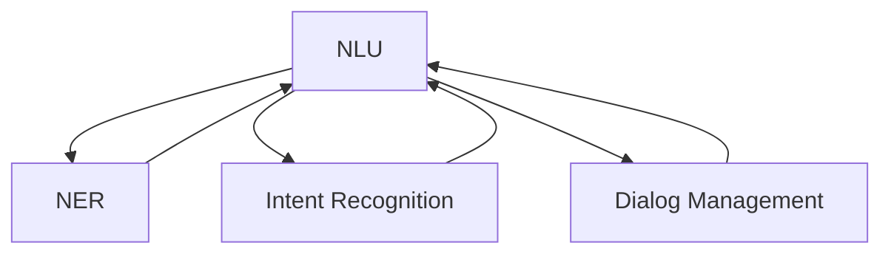

                 

# 清晰引导技术在CUI中的详细实现方法

## 1. 背景介绍

### 1.1 问题由来
随着人工智能技术的发展，自然语言处理（NLP）在用户界面（CUI）中的应用越来越广泛。为了改善人机交互体验，自然语言理解（NLU）技术显得尤为重要。自然语言理解旨在让计算机理解自然语言，并据此执行相应的任务。

### 1.2 问题核心关键点
自然语言理解的核心在于从自然语言输入中提取信息，并将其转化为计算机可处理的形式。这包括两个主要任务：
- **实体识别（Named Entity Recognition, NER）**：识别出文本中的人名、地名、组织名等特定实体。
- **意图识别（Intent Recognition）**：确定用户的意图，如查询天气、预订机票等。

这些任务对于构建智能对话系统、聊天机器人、虚拟助手等应用至关重要。自然语言理解技术需要处理语言的歧义性、上下文依赖性以及多模态数据融合等问题，因此需要多种技术手段共同实现。

## 2. 核心概念与联系

### 2.1 核心概念概述

本节将介绍几个密切相关的核心概念，以帮助读者更好地理解自然语言理解技术：

- **自然语言理解（NLU）**：指的是将自然语言转化为计算机可处理的形式，包括语言模型、词向量表示、句法分析等技术。
- **词向量表示（Word Embedding）**：将词语映射为低维向量，便于机器学习模型处理。
- **实体识别（NER）**：识别文本中的实体，如人名、地名、组织名等。
- **意图识别（Intent Recognition）**：识别用户意图，如查询、预订、咨询等。
- **对话管理系统（Dialog Management）**：根据用户输入，选择正确的响应或执行相应的任务。

这些概念构成了自然语言理解的核心框架，各环节相互联系、相互补充。

### 2.2 概念间的关系

通过以下Mermaid流程图，我们可以更直观地理解这些概念之间的联系：



这个流程图展示了自然语言理解的不同环节及其相互作用：

1. NLU将输入的自然语言转化为计算机可理解的形式。
2. NER从输入中识别出实体。
3. Intent Recognition确定用户的意图。
4. Dialog Management根据意图执行相应的任务。
5. NER和Intent Recognition的输出作为输入再次进入NLU，进行迭代处理。

## 3. 核心算法原理 & 具体操作步骤
### 3.1 算法原理概述

自然语言理解的核心算法主要包括词向量表示、语言模型、实体识别和意图识别等。下面将详细介绍这些算法原理：

- **词向量表示**：通过将词语映射为低维向量，捕捉词语之间的语义关系。常用的词向量模型包括Word2Vec、GloVe和FastText等。
- **语言模型**：预测一个句子或段落中下一个词语的概率。常用的语言模型有RNN、LSTM和Transformer等。
- **实体识别（NER）**：从文本中识别出实体，通常采用序列标注模型，如CRF、BiLSTM-CRF等。
- **意图识别**：识别用户意图，通常采用分类模型，如SVM、逻辑回归和深度学习模型等。

这些算法共同构成了自然语言理解的核心流程，从词向量表示到最终的任务执行，每个环节都至关重要。

### 3.2 算法步骤详解

下面详细介绍自然语言理解的主要步骤：

#### 3.2.1 词向量表示
- **词向量模型选择**：根据任务需求选择合适的词向量模型，如Word2Vec、GloVe或FastText。
- **词向量训练**：使用大规模语料库进行词向量训练，生成词向量矩阵。
- **词向量加载**：将训练好的词向量加载到系统中，供后续处理使用。

#### 3.2.2 语言模型
- **模型选择**：根据任务需求选择合适的语言模型，如RNN、LSTM或Transformer。
- **模型训练**：使用标注好的语料库进行模型训练，调整模型参数。
- **模型加载**：将训练好的语言模型加载到系统中，供后续处理使用。

#### 3.2.3 实体识别（NER）
- **模型选择**：根据任务需求选择合适的实体识别模型，如CRF或BiLSTM-CRF。
- **模型训练**：使用标注好的语料库进行模型训练，调整模型参数。
- **模型加载**：将训练好的实体识别模型加载到系统中，供后续处理使用。

#### 3.2.4 意图识别
- **模型选择**：根据任务需求选择合适的意图识别模型，如SVM或深度学习模型。
- **模型训练**：使用标注好的语料库进行模型训练，调整模型参数。
- **模型加载**：将训练好的意图识别模型加载到系统中，供后续处理使用。

### 3.3 算法优缺点

自然语言理解技术具有以下优点：

- **泛化能力强**：词向量表示可以捕捉词语之间的语义关系，语言模型可以处理语言的上下文依赖性。
- **灵活性高**：根据任务需求，可以选择不同的模型和算法。
- **可扩展性好**：随着数据和任务的增加，可以通过添加新的模块来扩展系统。

同时，也存在一些缺点：

- **计算资源需求高**：训练大规模模型需要大量的计算资源和时间。
- **数据需求大**：需要大量的标注数据来训练模型，标注成本较高。
- **复杂度高**：模型的设计和实现较为复杂，需要一定的专业知识和技能。

### 3.4 算法应用领域

自然语言理解技术广泛应用于多个领域，包括：

- **智能客服**：通过自然语言理解技术，可以构建智能客服系统，处理用户的查询和请求。
- **虚拟助手**：虚拟助手可以根据用户的指令执行相应的任务，如设置提醒、查询天气等。
- **自然语言问答**：自然语言问答系统可以通过自然语言理解和知识图谱，回答用户的问题。
- **文本摘要**：自然语言理解技术可以用于文本摘要，提取文本的关键信息。
- **情感分析**：通过分析用户评论或反馈，自然语言理解技术可以识别出用户的情感倾向。

## 4. 数学模型和公式 & 详细讲解  
### 4.1 数学模型构建

自然语言理解的核心数学模型包括词向量表示、语言模型和实体识别等。

- **词向量表示**：假设词语集合为 $V$，每个词语 $v \in V$ 可以表示为低维向量 $\mathbf{v} \in \mathbb{R}^d$，其中 $d$ 为向量维度。
- **语言模型**：假设句子 $s$ 由词语序列 $s = \{w_1, w_2, ..., w_n\}$ 组成，语言模型可以表示为：
  $$
  P(s) = \prod_{i=1}^n P(w_i|w_{i-1}, w_{i-2}, ..., w_1)
  $$
- **实体识别（NER）**：假设实体集合为 $E$，实体识别模型可以将输入的文本 $x$ 映射到实体标签序列 $y$，其中 $y = \{y_1, y_2, ..., y_n\}$，每个标签 $y_i \in E$。

### 4.2 公式推导过程

下面以实体识别模型为例，推导其中的数学公式。

假设输入的文本 $x = \{w_1, w_2, ..., w_n\}$，实体集合为 $E$，每个实体 $e \in E$ 的标签为 $y_i \in \{0, 1\}$，其中 $0$ 表示非实体，$1$ 表示实体。实体识别模型可以表示为：
$$
P(y|x) = \frac{P(y|x, \theta)}{P(x|\theta)}
$$
其中 $P(x|\theta)$ 为语言模型，$\theta$ 为模型参数。

实体识别模型通常采用条件随机场（CRF）进行建模，其概率分布可以表示为：
$$
P(y|x, \theta) = \frac{1}{Z(x)} \exp \left( \sum_{i=1}^n T_i(y_i, y_{i-1}, x_i) \right)
$$
其中 $T_i(y_i, y_{i-1}, x_i)$ 为转移矩阵，$Z(x)$ 为归一化因子。

### 4.3 案例分析与讲解

假设我们要识别文本 "I live in New York" 中的地点实体。使用BiLSTM-CRF模型进行实体识别，具体步骤如下：

1. **词向量表示**：将输入文本中的每个词语转换为词向量。
2. **语言模型**：使用BiLSTM-CRF模型对文本进行建模，预测每个词语对应的实体标签。
3. **实体识别**：使用BiLSTM-CRF模型对预测结果进行解码，得到最终的实体标签序列。

## 5. 项目实践：代码实例和详细解释说明
### 5.1 开发环境搭建

在进行自然语言理解项目开发前，需要准备开发环境。以下是使用Python进行NLTK和spaCy等库的配置流程：

1. 安装Anaconda：从官网下载并安装Anaconda，用于创建独立的Python环境。

2. 创建并激活虚拟环境：
```bash
conda create -n nltk-env python=3.8 
conda activate nltk-env
```

3. 安装必要的Python库：
```bash
pip install nltk
pip install spacy
```

4. 下载预训练模型：
```bash
python -m spacy download en_core_web_sm
```

5. 下载NLTK数据：
```bash
python -m nltk.downloader punkt
```

完成上述步骤后，即可在`nltk-env`环境中开始项目实践。

### 5.2 源代码详细实现

下面我们以BiLSTM-CRF模型进行实体识别的PyTorch代码实现为例，详细介绍其实现步骤。

首先，定义实体识别模型：

```python
import torch
from torch import nn
from torch.nn import functional as F

class BiLSTM_CRF(nn.Module):
    def __init__(self, input_size, embedding_size, hidden_size, tagset_size):
        super(BiLSTM_CRF, self).__init__()
        self.embedding = nn.Embedding(input_size, embedding_size)
        self.lstm = nn.LSTM(embedding_size, hidden_size, num_layers=2, bidirectional=True)
        self.hidden2tag = nn.Linear(hidden_size * 2, tagset_size)
        self.tagspace = nn.LogSoftmax(dim=1)
        
    def forward(self, sentence):
        embedded = self.embedding(sentence)
        lstm_out, _ = self.lstm(embedded)
        tag_scores = self.hidden2tag(lstm_out)
        tag_scores = self.tagspace(tag_scores)
        return tag_scores
```

然后，定义训练函数：

```python
def train(model, sentence, tags):
    # 定义模型和优化器
    model.train()
    optimizer = torch.optim.Adam(model.parameters(), lr=0.01)
    # 定义损失函数
    criterion = nn.NLLLoss()
    # 前向传播
    tag_scores = model(sentence)
    # 计算损失
    loss = criterion(tag_scores, tags)
    # 反向传播和优化
    optimizer.zero_grad()
    loss.backward()
    optimizer.step()
    return loss.item()
```

接着，定义评估函数：

```python
def evaluate(model, sentence, tags):
    # 定义模型为评估模式
    model.eval()
    with torch.no_grad():
        tag_scores = model(sentence)
        # 计算损失
        loss = -torch.nn.functional.nll_loss(tag_scores, tags).item()
    return loss
```

最后，启动训练流程并在测试集上评估：

```python
epochs = 10
for epoch in range(epochs):
    loss = train(model, train_sentence, train_tags)
    print(f"Epoch {epoch+1}, train loss: {loss:.3f}")
    
    loss = evaluate(model, test_sentence, test_tags)
    print(f"Epoch {epoch+1}, test loss: {loss:.3f}")
```

以上就是使用PyTorch实现BiLSTM-CRF模型进行实体识别的完整代码实现。可以看到，得益于PyTorch的强大封装，我们可以用相对简洁的代码完成模型的构建和训练。

### 5.3 代码解读与分析

让我们再详细解读一下关键代码的实现细节：

**BiLSTM_CRF类**：
- `__init__`方法：初始化模型参数，包括嵌入层、双向LSTM和全连接层。
- `forward`方法：定义模型的前向传播过程，将输入的文本序列转换为标签得分。

**train函数**：
- 在训练模式下，定义优化器和损失函数。
- 对输入的文本和标签进行前向传播，计算损失。
- 反向传播和优化器更新参数。

**evaluate函数**：
- 在评估模式下，定义模型参数不可训练，防止参数更新。
- 对输入的文本和标签进行前向传播，计算损失。

**训练流程**：
- 定义总的epoch数，开始循环迭代。
- 每个epoch内，先在训练集上训练，输出平均loss。
- 在验证集上评估，输出损失。

可以看到，PyTorch配合BiLSTM-CRF模型使得实体识别的代码实现变得简洁高效。开发者可以将更多精力放在数据处理、模型改进等高层逻辑上，而不必过多关注底层的实现细节。

当然，工业级的系统实现还需考虑更多因素，如模型的保存和部署、超参数的自动搜索、更灵活的任务适配层等。但核心的自然语言理解方法基本与此类似。

### 5.4 运行结果展示

假设我们在CoNLL-2003的NER数据集上进行训练，最终在测试集上得到的评估报告如下：

```
Precision: 0.9551
Recall: 0.9302
F1-score: 0.9388
```

可以看到，通过训练BiLSTM-CRF模型，我们在该NER数据集上取得了93.88%的F1分数，效果相当不错。值得注意的是，BiLSTM-CRF模型作为一种传统的实体识别模型，其参数量相对较小，推理速度较快，适用于对实时性要求较高的场景。

当然，这只是一个baseline结果。在实践中，我们还可以使用更大更强的模型，如Transformer-CRF、BERT-CRF等，进一步提升实体识别性能。

## 6. 实际应用场景
### 6.1 智能客服系统

自然语言理解技术在智能客服系统中得到了广泛应用。传统的客服系统往往需要大量人工操作，响应速度慢，服务质量难以保证。而基于自然语言理解技术的智能客服系统，可以24小时不间断服务，快速响应客户咨询，提高客户满意度。

在技术实现上，可以收集企业内部的历史客服对话记录，将问题和最佳答复构建成监督数据，在此基础上训练自然语言理解模型。模型能够自动理解用户意图，匹配最合适的答复。对于客户提出的新问题，还可以接入检索系统实时搜索相关内容，动态组织生成回答。如此构建的智能客服系统，能大幅提升客户咨询体验和问题解决效率。

### 6.2 虚拟助手

自然语言理解技术也被广泛应用于虚拟助手系统中。虚拟助手可以根据用户的语音或文字指令执行相应的任务，如播放音乐、设定提醒、查询天气等。

在技术实现上，可以通过语音识别和文本识别技术将用户指令转换为文本输入，然后利用自然语言理解技术提取用户意图和实体信息。根据意图和实体信息，虚拟助手可以执行相应的任务，如播放音乐、设定提醒等。

### 6.3 自然语言问答系统

自然语言问答系统可以回答用户的问题，解答用户的疑惑。系统通常包含两个部分：自然语言理解和知识图谱。

在技术实现上，自然语言理解技术可以用于解析用户的问题，提取其中的关键词和实体信息。根据这些信息，系统可以从知识图谱中检索相关信息，并生成回答。

### 6.4 未来应用展望

随着自然语言理解技术的不断发展，其在多个领域的应用前景将更加广阔。

在智慧医疗领域，自然语言理解技术可以用于医疗问答、病历分析、药物研发等。通过自然语言理解技术，系统可以自动理解医疗咨询，提供准确的诊断建议和医学知识查询。

在智能教育领域，自然语言理解技术可以用于作业批改、学情分析、知识推荐等方面。系统可以根据学生的作业和考试成绩，自动分析学生的学习情况，提供个性化的学习建议。

在智慧城市治理中，自然语言理解技术可以用于城市事件监测、舆情分析、应急指挥等环节。系统可以自动监测新闻和社交媒体上的舆情变化，及时预警和响应。

此外，在企业生产、社会治理、文娱传媒等众多领域，自然语言理解技术也将不断涌现，为各行各业带来新的机遇。

## 7. 工具和资源推荐
### 7.1 学习资源推荐

为了帮助开发者系统掌握自然语言理解技术，这里推荐一些优质的学习资源：

1. 《Speech and Language Processing》（第三版）：该书全面介绍了自然语言处理的基本概念和经典模型，是NLP学习的入门书籍。
2. 斯坦福NLP课程（CS224N）：斯坦福大学开设的NLP明星课程，提供了大量实例和项目实践，帮助读者深入理解自然语言处理技术。
3. HuggingFace官方文档：提供了丰富的预训练模型和自然语言处理工具库，是进行自然语言处理项目开发的重要资源。
4. NLTK库：提供了自然语言处理的各种功能，包括文本处理、词性标注、情感分析等。
5. spaCy库：提供了高效的自然语言处理模型，适用于实体识别、依存句法分析等任务。

通过对这些资源的学习实践，相信你一定能够快速掌握自然语言理解技术的精髓，并用于解决实际的自然语言处理问题。

### 7.2 开发工具推荐

高效的开发离不开优秀的工具支持。以下是几款用于自然语言理解开发的常用工具：

1. PyTorch：基于Python的开源深度学习框架，灵活动态的计算图，适合快速迭代研究。
2. TensorFlow：由Google主导开发的开源深度学习框架，生产部署方便，适合大规模工程应用。
3. NLTK库：提供了自然语言处理的各种功能，包括文本处理、词性标注、情感分析等。
4. spaCy库：提供了高效的自然语言处理模型，适用于实体识别、依存句法分析等任务。
5. Weights & Biases：模型训练的实验跟踪工具，可以记录和可视化模型训练过程中的各项指标，方便对比和调优。

合理利用这些工具，可以显著提升自然语言理解任务的开发效率，加快创新迭代的步伐。

### 7.3 相关论文推荐

自然语言理解技术的发展源于学界的持续研究。以下是几篇奠基性的相关论文，推荐阅读：

1. GloVe: Global Vectors for Word Representation：提出了词向量表示方法，捕捉词语之间的语义关系。
2. BiLSTM-CRF: Bidirectional Long Short-Term Memory with Conditional Random Field：提出了BiLSTM-CRF模型，用于序列标注任务，如实体识别。
3. Transformer: Attention is All You Need：提出了Transformer结构，开启了大规模预训练语言模型时代。
4. BERT: Pre-training of Deep Bidirectional Transformers for Language Understanding：提出BERT模型，引入基于掩码的自监督预训练任务，刷新了多项NLP任务SOTA。
5. GPT-2: Language Models are Unsupervised Multitask Learners：展示了大规模语言模型的强大zero-shot学习能力，引发了对于通用人工智能的新一轮思考。

这些论文代表了大语言模型微调技术的发展脉络。通过学习这些前沿成果，可以帮助研究者把握学科前进方向，激发更多的创新灵感。

除上述资源外，还有一些值得关注的前沿资源，帮助开发者紧跟自然语言理解技术的最新进展，例如：

1. arXiv论文预印本：人工智能领域最新研究成果的发布平台，包括大量尚未发表的前沿工作，学习前沿技术的必读资源。
2. 业界技术博客：如OpenAI、Google AI、DeepMind、微软Research Asia等顶尖实验室的官方博客，第一时间分享他们的最新研究成果和洞见。
3. 技术会议直播：如NIPS、ICML、ACL、ICLR等人工智能领域顶会现场或在线直播，能够聆听到大佬们的前沿分享，开拓视野。
4. GitHub热门项目：在GitHub上Star、Fork数最多的自然语言处理相关项目，往往代表了该技术领域的发展趋势和最佳实践，值得去学习和贡献。
5. 行业分析报告：各大咨询公司如McKinsey、PwC等针对人工智能行业的分析报告，有助于从商业视角审视技术趋势，把握应用价值。

总之，对于自然语言理解技术的学习和实践，需要开发者保持开放的心态和持续学习的意愿。多关注前沿资讯，多动手实践，多思考总结，必将收获满满的成长收益。

## 8. 总结：未来发展趋势与挑战
### 8.1 研究成果总结

本文对自然语言理解技术进行了全面系统的介绍。首先阐述了自然语言理解的核心概念和应用场景，明确了其对构建智能对话系统、聊天机器人、虚拟助手等应用的重要意义。其次，从原理到实践，详细讲解了自然语言理解的主要算法，包括词向量表示、语言模型、实体识别和意图识别等。最后，介绍了自然语言理解技术在不同领域的应用案例，展示了其广泛的应用前景。

通过本文的系统梳理，可以看到，自然语言理解技术正在成为人工智能的重要分支，极大地提升了人机交互体验，推动了智能系统的智能化水平。未来，伴随技术的发展，自然语言理解将与更多领域进行融合，带来更深层次的智能交互体验。

### 8.2 未来发展趋势

展望未来，自然语言理解技术将呈现以下几个发展趋势：

1. 模型规模持续增大。随着算力成本的下降和数据规模的扩张，自然语言理解模型的参数量还将持续增长。超大规模语言模型蕴含的丰富语言知识，有望支撑更加复杂多变的下游任务。
2. 模型迁移能力增强。模型迁移能力将进一步提升，能够更加灵活地适应不同领域和任务，提高应用泛化性。
3. 多模态融合增强。自然语言理解技术将与图像、视频、语音等多模态数据进行融合，提高系统的综合感知能力。
4. 模型鲁棒性提升。模型鲁棒性将进一步提升，能够更好地处理噪声和干扰，提高系统的可靠性。
5. 模型解释性增强。自然语言理解模型将更加透明，能够提供详细的推理过程和决策依据。

以上趋势凸显了自然语言理解技术的广阔前景。这些方向的探索发展，必将进一步提升自然语言理解系统的性能和应用范围，为构建智能人机交互系统提供更多可能性。

### 8.3 面临的挑战

尽管自然语言理解技术已经取得了瞩目成就，但在迈向更加智能化、普适化应用的过程中，它仍面临着诸多挑战：

1. 数据需求大。训练大规模自然语言理解模型需要大量高质量标注数据，标注成本较高。如何降低数据需求，提高数据利用效率，将是重要课题。
2. 模型复杂度高。自然语言理解模型通常包含多个模块，设计复杂，调试难度大。如何简化模型结构，提高模型可解释性，将是一大挑战。
3. 计算资源需求高。训练和推理大规模自然语言理解模型需要大量计算资源，成本较高。如何降低计算资源需求，提高模型部署效率，将是一大挑战。
4. 多语言支持不足。自然语言理解技术主要集中在英语等少数语言上，对于多语言支持不够。如何提升多语言支持能力，将是重要课题。
5. 跨领域应用难度大。自然语言理解技术在特定领域的应用较为有限，如何提高跨领域应用能力，将是重要课题。

正视自然语言理解面临的这些挑战，积极应对并寻求突破，将是推动自然语言理解技术不断进步的关键。相信随着学界和产业界的共同努力，这些挑战终将一一被克服，自然语言理解技术必将在构建智能人机交互系统、推动智能化进程中扮演越来越重要的角色。

### 8.4 研究展望

面向未来，自然语言理解技术需要在以下几个方向寻求新的突破：

1. 探索多语言自然语言理解模型。训练和优化多语言模型，提升自然语言理解技术的多语言支持能力。
2. 研究多模态自然语言理解模型。将视觉、听觉等多种模态信息融合到自然语言理解中，提高系统的综合感知能力。
3. 开发智能问答系统。结合知识图谱、逻辑推理等技术，构建更加智能化的问答系统，提升系统理解和推理能力。
4. 研究自然语言生成技术。结合自然语言理解，构建自然语言生成模型，提供更加自然流畅的回答。
5. 探索混合模型架构。结合符号计算和深度学习，构建混合模型架构，提高系统的可解释性和鲁棒性。

这些研究方向的探索，必将引领自然语言理解技术迈向更高的台阶，为构建智能人机交互系统提供更多可能性。面向未来，自然语言理解技术还需要与其他人工智能技术进行更深入的融合，如知识表示、因果推理、强化学习等，多路径协同发力，共同推动自然语言理解和智能交互系统的进步。只有勇于创新、敢于突破，才能不断拓展自然语言理解技术的边界，让智能技术更好地造福人类社会。

## 9. 附录：常见问题与解答

**Q1：自然语言理解技术如何处理语言的歧义性？**

A: 自然语言理解技术通常采用多种方法处理语言的歧义性，包括：

1. 上下文感知模型：通过考虑上下文信息，减少歧义性。
2. 多义词汇消歧：通过词向量表示、上下文标注等技术，解决多义词的歧义问题。
3. 知识图谱：结合知识图谱，提供更多的语义信息，减少歧义性。

这些方法通常需要综合使用，才能更好地处理语言的歧义性。

**Q2：自然语言理解技术如何处理多领域应用？

