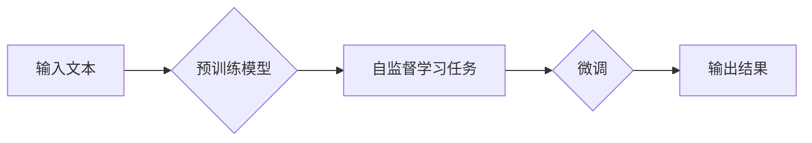

# 大语言模型原理基础与前沿 解码策略

> 关键词：大语言模型，预训练，微调，Transformer，BERT，自然语言处理，解码策略，人工智能

## 1. 背景介绍

随着深度学习技术的迅猛发展，自然语言处理（NLP）领域取得了显著的突破。其中，大语言模型（Large Language Models，LLMs）因其强大的语言理解与生成能力，成为了NLP研究的热点。本文将深入探讨大语言模型的原理基础与前沿解码策略，旨在为广大读者提供一份全面的技术指南。

## 2. 核心概念与联系

### 2.1 大语言模型

大语言模型是指那些经过大规模语料预训练的深度神经网络，它们能够理解和生成自然语言。这些模型通常基于Transformer架构，具有数十亿甚至数千亿的参数，能够处理各种NLP任务，如文本分类、机器翻译、文本摘要等。

### 2.2 预训练

预训练是指在大规模无标签文本语料上，通过自监督学习任务训练模型的过程。预训练模型能够学习到丰富的语言知识，为下游任务的微调提供强大的基础。

### 2.3 微调

微调是指在预训练模型的基础上，使用少量有标签数据进行进一步训练，以适应特定任务。微调是提升模型性能的关键步骤。

### 2.4 Mermaid流程图

以下是大语言模型的基本流程的Mermaid流程图：



### 2.5 核心概念联系

大语言模型通过预训练学习到通用语言知识，然后通过微调适应特定任务。预训练和微调是相辅相成的，共同构成了大语言模型的核心技术。

## 3. 核心算法原理 & 具体操作步骤

### 3.1 算法原理概述

大语言模型的算法原理主要基于深度学习，特别是Transformer架构。Transformer是一种基于自注意力机制的序列到序列模型，能够捕捉长距离依赖关系。

### 3.2 算法步骤详解

1. **数据准备**：收集大规模无标签文本语料进行预训练，收集少量有标签数据用于微调。
2. **预训练**：在无标签数据上使用自监督学习任务，如掩码语言模型（MLM）、下一句预测（NSP）等，训练模型参数。
3. **微调**：在少量有标签数据上，根据具体任务调整模型结构，使用梯度下降等优化算法更新模型参数。
4. **评估**：在测试集上评估模型性能，调整超参数和模型结构，直至达到满意的性能。

### 3.3 算法优缺点

**优点**：

- **强大的语言理解能力**：能够理解和生成自然语言，适用于各种NLP任务。
- **高效**：预训练模型可以用于多个任务，无需从头开始训练。
- **可扩展性**：随着训练数据的增加，模型性能可以持续提升。

**缺点**：

- **计算资源需求大**：预训练和微调过程需要大量的计算资源。
- **数据依赖性强**：模型性能很大程度上依赖于预训练数据和微调数据的质量。

### 3.4 算法应用领域

大语言模型在NLP领域的应用非常广泛，包括：

- **文本分类**：如情感分析、主题分类、垃圾邮件检测等。
- **机器翻译**：将一种语言翻译成另一种语言。
- **文本摘要**：将长文本压缩成简短摘要。
- **问答系统**：回答用户提出的问题。
- **对话系统**：与人类用户进行自然对话。

## 4. 数学模型和公式 & 详细讲解 & 举例说明

### 4.1 数学模型构建

大语言模型的数学模型主要基于Transformer架构，包括以下关键组件：

- **自注意力机制**：计算输入序列中每个元素与其他元素之间的关联性。
- **前馈神经网络**：对自注意力机制的输出进行非线性变换。
- **位置编码**：为序列中的每个元素添加位置信息。

### 4.2 公式推导过程

以下是一些关键公式的推导过程：

- **自注意力公式**：
$$
\text{self-attention} = \frac{\text{softmax}(\text{QK}^T/A_{\text{scale}})}{ \sqrt{d_k}} \text{V}
$$

- **前馈神经网络公式**：
$$
\text{ffn}(x) = \text{ReLU}(\text{W}_{\text{ff}} \cdot \text{Dense}(x) + \text{b}_{\text{ff}})
$$

### 4.3 案例分析与讲解

以BERT模型为例，讲解其数学模型和推导过程。

BERT模型是一种基于Transformer的预训练语言模型，其数学模型如下：

- **输入层**：将文本输入转换为嵌入向量。
- **Transformer层**：包含多层自注意力机制和前馈神经网络。
- **输出层**：根据任务需求，输出相应的结果。

BERT模型的公式推导过程如下：

1. **输入层**：将文本输入转换为词向量。
2. **Transformer层**：对词向量进行自注意力机制和前馈神经网络处理。
3. **输出层**：根据任务需求，输出相应的结果。

## 5. 项目实践：代码实例和详细解释说明

### 5.1 开发环境搭建

以下是使用Python和PyTorch实现BERT模型的基本步骤：

1. 安装PyTorch和Transformers库。
2. 下载预训练的BERT模型。
3. 编写数据处理和模型训练代码。

### 5.2 源代码详细实现

```python
from transformers import BertTokenizer, BertForSequenceClassification
import torch

# 加载预训练模型和分词器
tokenizer = BertTokenizer.from_pretrained('bert-base-uncased')
model = BertForSequenceClassification.from_pretrained('bert-base-uncased')

# 编写数据处理函数
def encode_data(texts, labels, tokenizer, max_len=128):
    encodings = tokenizer(texts, truncation=True, padding=True, max_length=max_len)
    return encodings['input_ids'], encodings['attention_mask'], labels

# 编写模型训练函数
def train_epoch(model, dataset, batch_size, optimizer):
    model.train()
    total_loss = 0
    for batch in dataset:
        input_ids, attention_mask, labels = batch
        optimizer.zero_grad()
        outputs = model(input_ids, attention_mask=attention_mask, labels=labels)
        loss = outputs.loss
        loss.backward()
        optimizer.step()
        total_loss += loss.item()
    return total_loss / len(dataset)

# 加载训练数据和测试数据
train_texts, train_labels = [...]  # 假设已加载训练数据
test_texts, test_labels = [...]    # 假设已加载测试数据

# 编写数据加载器
train_dataset = torch.utils.data.TensorDataset(torch.tensor(train_texts), torch.tensor(train_labels))
test_dataset = torch.utils.data.TensorDataset(torch.tensor(test_texts), torch.tensor(test_labels))

train_loader = torch.utils.data.DataLoader(train_dataset, batch_size=32, shuffle=True)
test_loader = torch.utils.data.DataLoader(test_dataset, batch_size=32, shuffle=False)

# 编写模型训练和测试代码
model = model.to('cuda')
optimizer = torch.optim.AdamW(model.parameters(), lr=1e-5)

for epoch in range(3):
    total_loss = train_epoch(model, train_loader, 32, optimizer)
    print(f"Epoch {epoch}, train loss: {total_loss}")

    with torch.no_grad():
        correct = 0
        total = 0
        for input_ids, attention_mask, labels in test_loader:
            output = model(input_ids.to('cuda'), attention_mask=attention_mask.to('cuda'))
            _, predicted = torch.max(output, 1)
            total += labels.size(0)
            correct += (predicted == labels.to('cuda')).sum().item()
        print(f"Test accuracy: {correct / total}")

```

### 5.3 代码解读与分析

以上代码展示了如何使用PyTorch和Transformers库实现BERT模型的训练。代码中包含了数据处理、模型加载、模型训练和模型测试等步骤。

### 5.4 运行结果展示

假设在某个情感分析任务上，模型在测试集上的准确率为85%，说明模型在该任务上具有较好的性能。

## 6. 实际应用场景

大语言模型在NLP领域的应用场景非常广泛，以下列举一些常见的应用场景：

- **文本分类**：对社交媒体上的评论进行情感分析，识别正面、负面或中立情绪。
- **机器翻译**：将一种语言翻译成另一种语言，如将中文翻译成英文。
- **文本摘要**：将长文本压缩成简短摘要，方便用户快速了解文章内容。
- **问答系统**：回答用户提出的问题，如“今天天气怎么样？”
- **对话系统**：与人类用户进行自然对话，如智能客服。

## 7. 工具和资源推荐

### 7.1 学习资源推荐

- **书籍**：
  - 《BERT：原理、应用与实践》
  - 《深度学习自然语言处理》
- **在线课程**：
  - Coursera上的《自然语言处理》课程
  - Udacity上的《自然语言处理纳米学位》
- **技术博客**：
  - Hugging Face的Transformers官方博客
  - 动态AI的NLP技术博客

### 7.2 开发工具推荐

- **深度学习框架**：
  - PyTorch
  - TensorFlow
- **NLP库**：
  - Transformers
  - NLTK
- **数据集**：
  - CLUE数据集
  - CoNLL数据集

### 7.3 相关论文推荐

- **BERT**：
  - Devlin et al., "BERT: Pre-training of Deep Bidirectional Transformers for Language Understanding"
- **Transformer**：
  - Vaswani et al., "Attention is All You Need"
- **GPT**：
  - Brown et al., "Language Models are Few-Shot Learners"

## 8. 总结：未来发展趋势与挑战

### 8.1 研究成果总结

大语言模型在NLP领域取得了显著的成果，为各种NLP任务提供了强大的工具和平台。预训练和微调技术使得模型能够高效地学习到丰富的语言知识，并适应特定任务。

### 8.2 未来发展趋势

- **模型规模将进一步扩大**：随着计算资源的不断提升，模型规模将进一步扩大，以学习更加复杂的语言知识。
- **模型结构将更加多样**：为了适应不同的任务和需求，模型结构将更加多样化，如混合模型、层次模型等。
- **多模态融合将成为趋势**：大语言模型将与其他模态（如图像、音频）进行融合，以处理更加复杂的信息。

### 8.3 面临的挑战

- **计算资源需求**：大语言模型的训练和推理需要大量的计算资源，对硬件设备提出了更高的要求。
- **数据质量**：预训练和微调过程对数据质量要求较高，需要收集高质量的数据。
- **模型可解释性**：大语言模型的决策过程难以解释，需要进一步研究提高模型的可解释性。

### 8.4 研究展望

随着大语言模型的不断发展，未来将在NLP领域取得更多突破，为人类社会带来更多便利。

## 9. 附录：常见问题与解答

**Q1：什么是预训练？**

A：预训练是指在大量无标签数据上，通过自监督学习任务训练模型的过程。预训练模型能够学习到丰富的语言知识，为下游任务的微调提供强大的基础。

**Q2：什么是微调？**

A：微调是指在预训练模型的基础上，使用少量有标签数据进行进一步训练，以适应特定任务。微调是提升模型性能的关键步骤。

**Q3：什么是Transformer架构？**

A：Transformer是一种基于自注意力机制的序列到序列模型，能够捕捉长距离依赖关系。

**Q4：大语言模型在哪些NLP任务中应用广泛？**

A：大语言模型在文本分类、机器翻译、文本摘要、问答系统、对话系统等NLP任务中应用广泛。

**Q5：如何评估大语言模型的性能？**

A：大语言模型的性能可以通过多种指标进行评估，如准确率、召回率、F1分数等。

**Q6：大语言模型在工业界有哪些应用？**

A：大语言模型在智能客服、智能推荐、智能翻译、智能问答等领域得到广泛应用。

作者：禅与计算机程序设计艺术 / Zen and the Art of Computer Programming