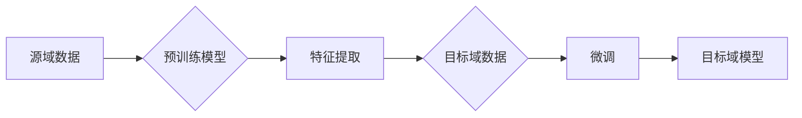

> 迁移学习, 模型迁移, 预训练, 特征提取, 自监督学习, 少样本学习, 多任务学习, 深度学习

# 迁移学习 (Transfer Learning) 原理与代码实例讲解

## 1. 背景介绍

迁移学习（Transfer Learning，TL）是深度学习领域的一个重要研究方向，它允许模型在源域学习到的知识被迁移到目标域，从而在目标域上提高模型的性能。在现实世界中，迁移学习广泛应用于计算机视觉、自然语言处理、语音识别等领域，尤其是在数据稀缺或标注困难的场景中，迁移学习展现出其独特的优势。

### 1.1 问题的由来

在传统的机器学习任务中，模型通常需要在大量的标注数据上进行训练。然而，获取大量标注数据往往成本高昂，且在实际应用中，有些领域的数据可能难以获取或标注。因此，如何利用有限的标注数据，使模型在新的任务上也能取得良好的性能，成为了研究的热点问题。

### 1.2 研究现状

迁移学习的研究主要集中在以下几个方面：

- **预训练模型**：通过在大量的无标签数据上预训练模型，使模型学习到通用的特征表示。
- **特征提取**：从预训练模型中提取有用的特征，用于新的任务。
- **自监督学习**：在无标签数据上训练模型，使其学习到有用的特征表示。
- **少样本学习**：在少量样本上训练模型，使其在新的任务上也能取得良好的性能。
- **多任务学习**：同时学习多个相关任务，利用多个任务之间的相关性提高模型性能。

### 1.3 研究意义

迁移学习的研究具有重要的理论意义和应用价值：

- **降低数据获取成本**：通过迁移学习，可以利用少量标注数据或无标签数据训练模型，从而降低数据获取成本。
- **提高模型性能**：迁移学习可以使模型在新的任务上取得更好的性能，尤其是在数据稀缺的情况下。
- **促进模型泛化**：迁移学习可以使模型学习到更通用的特征表示，从而提高模型的泛化能力。

## 2. 核心概念与联系

### 2.1 核心概念原理和架构的 Mermaid 流程图



### 2.2 核心概念

- **源域（Source Domain）**：具有大量标注数据的领域。
- **目标域（Target Domain）**：具有少量标注数据的领域。
- **预训练模型（Pre-trained Model）**：在源域数据上预训练得到的模型。
- **特征提取（Feature Extraction）**：从预训练模型中提取有用的特征。
- **微调（Fine-tuning）**：在目标域数据上对预训练模型进行微调。
- **目标域模型（Target Domain Model）**：在目标域上微调得到的模型。

## 3. 核心算法原理 & 具体操作步骤

### 3.1 算法原理概述

迁移学习的基本原理是将源域学习到的知识迁移到目标域，从而提高模型在目标域上的性能。具体来说，就是利用预训练模型在源域上学习到的特征表示，在目标域上进行微调，使模型在目标域上也能取得良好的性能。

### 3.2 算法步骤详解

迁移学习的基本步骤如下：

1. 在源域数据上预训练一个模型。
2. 在目标域数据上对预训练模型进行微调。
3. 使用微调后的模型在目标域上进行预测。

### 3.3 算法优缺点

#### 优点

- **提高模型性能**：在目标域上，迁移学习可以使模型取得更好的性能。
- **降低数据获取成本**：迁移学习可以利用少量标注数据或无标签数据训练模型。
- **提高模型泛化能力**：迁移学习可以使模型学习到更通用的特征表示，从而提高模型的泛化能力。

#### 缺点

- **模型泛化能力受限**：迁移学习的效果取决于源域和目标域之间的相似程度。
- **模型可解释性差**：迁移学习模型的可解释性通常较差。

### 3.4 算法应用领域

迁移学习在以下领域有广泛的应用：

- **计算机视觉**：图像分类、目标检测、图像分割等。
- **自然语言处理**：文本分类、机器翻译、情感分析等。
- **语音识别**：语音识别、说话人识别等。

## 4. 数学模型和公式 & 详细讲解 & 举例说明

### 4.1 数学模型构建

假设我们有源域数据集 $D_S$ 和目标域数据集 $D_T$，源域模型 $M_S$ 和目标域模型 $M_T$。迁移学习的基本思想是将 $M_S$ 的知识迁移到 $M_T$ 上。

### 4.2 公式推导过程

为了将 $M_S$ 的知识迁移到 $M_T$ 上，我们需要计算两个模型在源域和目标域上的损失函数，并找到使两个损失函数最小化的参数。

假设源域损失函数为 $L_S(M_S, D_S)$，目标域损失函数为 $L_T(M_T, D_T)$，则迁移学习的目标是最小化以下公式：

$$
L(\theta_S, \theta_T) = \lambda L_S(M_S, D_S) + (1-\lambda) L_T(M_T, D_T)
$$

其中，$\lambda$ 是权重系数，用于平衡源域和目标域的损失。

### 4.3 案例分析与讲解

以下是一个简单的图像分类迁移学习的例子。

假设我们有源域数据集 $D_S$ 和目标域数据集 $D_T$，源域模型 $M_S$ 是一个在 ImageNet 上预训练的卷积神经网络，目标域模型 $M_T$ 是一个在新的图像分类任务上微调的模型。

首先，在 $D_S$ 上预训练 $M_S$，得到预训练参数 $\theta_S$。

然后，在 $D_T$ 上对 $M_S$ 进行微调，得到目标域模型 $M_T$ 和参数 $\theta_T$。

最后，在 $D_T$ 上使用 $M_T$ 进行预测。

## 5. 项目实践：代码实例和详细解释说明

### 5.1 开发环境搭建

为了进行迁移学习实践，我们需要以下开发环境：

- Python 3.6+
- PyTorch 1.5+
- torchvision 0.9+
- scikit-learn 0.24+

### 5.2 源代码详细实现

以下是一个使用 PyTorch 实现的图像分类迁移学习的例子。

```python
import torch
import torchvision
import torchvision.transforms as transforms
from torch.utils.data import DataLoader
from torch import nn, optim
from torch.nn import functional as F

# 加载预训练模型
model = torchvision.models.resnet18(pretrained=True)

# 定义目标域模型
class TargetDomainModel(nn.Module):
    def __init__(self):
        super(TargetDomainModel, self).__init__()
        self.fc = nn.Linear(512, 10)  # 假设有10个类别

    def forward(self, x):
        x = model(x)
        x = self.fc(x)
        return x

# 加载数据集
transform = transforms.Compose([
    transforms.Resize((224, 224)),
    transforms.ToTensor(),
])

train_dataset = torchvision.datasets.CIFAR10(root='./data', train=True, download=True, transform=transform)
train_loader = DataLoader(train_dataset, batch_size=64, shuffle=True)

# 初始化目标域模型
target_model = TargetDomainModel().to(device)

# 设置优化器
optimizer = optim.SGD(target_model.parameters(), lr=0.01, momentum=0.9)

# 训练目标域模型
for epoch in range(10):
    target_model.train()
    running_loss = 0.0
    for images, labels in train_loader:
        images, labels = images.to(device), labels.to(device)

        optimizer.zero_grad()
        outputs = target_model(images)
        loss = F.cross_entropy(outputs, labels)
        loss.backward()
        optimizer.step()

        running_loss += loss.item()
    print(f"Epoch {epoch+1}, Loss: {running_loss/len(train_loader)}")
```

### 5.3 代码解读与分析

- 加载预训练模型：使用 torchvision.models.resnet18 预训练模型作为源域模型。
- 定义目标域模型：定义一个线性层，将源域模型的输出转换为目标域的类别数量。
- 加载数据集：使用 torchvision.datasets.CIFAR10 加载 CIFAR-10 数据集。
- 初始化目标域模型：将预训练模型的特征提取部分保持不变，只在顶部添加一个线性层进行分类。
- 设置优化器：使用 SGD 优化器进行训练。
- 训练目标域模型：在训练数据上迭代地更新目标域模型的参数。

### 5.4 运行结果展示

运行以上代码后，我们可以在控制台看到训练过程中的损失值变化。最后，我们可以使用测试集评估目标域模型的性能。

## 6. 实际应用场景

迁移学习在以下实际应用场景中取得了显著成效：

- **图像分类**：使用 ImageNet 预训练的卷积神经网络对新的图像分类任务进行微调。
- **目标检测**：使用 Faster R-CNN 预训练模型对新的目标检测任务进行微调。
- **图像分割**：使用 U-Net 预训练模型对新的图像分割任务进行微调。
- **自然语言处理**：使用预训练的语言模型对新的文本分类、机器翻译、情感分析等任务进行微调。
- **语音识别**：使用预训练的语音模型对新的语音识别任务进行微调。

## 7. 工具和资源推荐

### 7.1 学习资源推荐

- 《深度学习》（Goodfellow et al.）: 深度学习领域的经典教材，介绍了深度学习的基本概念、算法和框架。
- 《动手学深度学习》（Zhang et al.）: 介绍了深度学习的基本概念、算法和框架，并提供了大量的代码示例。
- 《动手学深度学习：基于PyTorch》（Wang et al.）: 基于PyTorch的深度学习教程，适合初学者快速上手。

### 7.2 开发工具推荐

- PyTorch: 基于Python的开源深度学习框架，适合快速开发深度学习应用。
- TensorFlow: 由Google开发的深度学习框架，适合生产部署。
- Keras: 基于Python的开源深度学习库，提供丰富的API和预训练模型。

### 7.3 相关论文推荐

- "A Study on Transfer Learning from Pretrained Deep Neural Networks" (Yosinski et al., 2014)
- "Deep Learning with Few Shots" (Noroozi & Farhadi, 2016)
- "Unsupervised Learning of Visual Representations by Solving Jigsaw Puzzles" (Hu et al., 2016)

## 8. 总结：未来发展趋势与挑战

### 8.1 研究成果总结

迁移学习作为深度学习领域的一个重要研究方向，取得了显著的成果。目前，迁移学习已经广泛应用于计算机视觉、自然语言处理、语音识别等领域，并在许多任务上取得了优异的性能。

### 8.2 未来发展趋势

- **多模态迁移学习**：结合多种模态数据，如文本、图像、音频等，提高模型的泛化能力。
- **少样本学习**：在少量样本上训练模型，使其在新的任务上也能取得良好的性能。
- **无监督迁移学习**：在无标签数据上训练模型，使其在新的任务上也能取得良好的性能。

### 8.3 面临的挑战

- **模型泛化能力**：迁移学习的效果取决于源域和目标域之间的相似程度，如何提高模型的泛化能力是一个重要的挑战。
- **模型可解释性**：迁移学习模型的可解释性通常较差，如何提高模型的可解释性是一个重要的挑战。
- **数据获取成本**：如何降低数据获取成本，使得迁移学习在更多领域得到应用，是一个重要的挑战。

### 8.4 研究展望

随着深度学习技术的不断发展，迁移学习将在更多领域得到应用，并取得更大的突破。未来，迁移学习的研究将重点关注以下方向：

- **更有效的预训练模型**：设计更有效的预训练模型，使其在更多领域具有更好的迁移能力。
- **更有效的迁移学习算法**：设计更有效的迁移学习算法，使模型在新的任务上取得更好的性能。
- **更有效的数据获取方法**：设计更有效的数据获取方法，降低数据获取成本，使得迁移学习在更多领域得到应用。

## 9. 附录：常见问题与解答

**Q1：什么是迁移学习？**

A：迁移学习是指将源域学习到的知识迁移到目标域，从而提高模型在目标域上的性能。

**Q2：迁移学习有哪些优点？**

A：迁移学习的主要优点包括提高模型性能、降低数据获取成本和提高模型泛化能力。

**Q3：迁移学习有哪些缺点？**

A：迁移学习的主要缺点包括模型泛化能力受限和模型可解释性差。

**Q4：迁移学习有哪些应用场景？**

A：迁移学习在计算机视觉、自然语言处理、语音识别等领域有广泛的应用。

**Q5：如何进行迁移学习？**

A：进行迁移学习的基本步骤包括在源域数据上预训练模型、在目标域数据上对预训练模型进行微调以及在目标域上进行预测。

作者：禅与计算机程序设计艺术 / Zen and the Art of Computer Programming