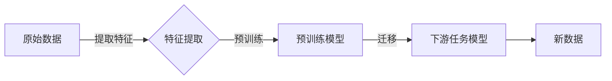

# 迁移学习 (Transfer Learning)

> 关键词：迁移学习，预训练模型，深度学习，特征提取，迁移，泛化，模型蒸馏，元学习

## 1. 背景介绍

在人工智能领域，迁移学习（Transfer Learning）是一种通过将知识从一个任务转移到另一个任务来提高学习效率的技术。迁移学习的核心思想是，一个模型在特定任务上学习到的知识可以被应用到其他相关但不同的任务中，从而减少对新数据的标注需求，提高学习速度，并提升模型性能。

### 1.1 问题的由来

传统的机器学习模型通常需要大量的标注数据来进行训练，这对于某些领域，如医学影像分析、生物识别等，尤其具有挑战性。此外，数据收集和标注的成本高昂，且耗时费力。迁移学习提供了一种解决方案，它允许我们从已有的数据中提取可迁移的知识，并将其应用于新任务。

### 1.2 研究现状

迁移学习的研究已经取得了显著的进展，特别是在深度学习领域。随着深度学习的兴起，预训练模型的出现使得迁移学习变得更加高效和可行。预训练模型在大量无标注数据上进行训练，从而学习到通用的特征表示，这些特征可以用于解决不同的下游任务。

### 1.3 研究意义

迁移学习的重要性体现在以下几个方面：

- **降低数据成本**：通过迁移学习，我们可以使用少量标注数据或无标注数据来训练模型，从而降低数据收集和标注的成本。
- **提高学习效率**：预训练模型可以快速适应新的任务，加快模型开发的速度。
- **提升模型性能**：迁移学习有助于提高模型在特定任务上的性能，特别是在数据量有限的情况下。

### 1.4 本文结构

本文将按照以下结构进行阐述：

- 介绍迁移学习的基本概念和核心原理。
- 详细讲解迁移学习中的常用算法和操作步骤。
- 分析迁移学习在数学模型和公式中的体现。
- 展示迁移学习的代码实例和实际应用场景。
- 探讨迁移学习的未来发展趋势与挑战。

## 2. 核心概念与联系

### 2.1 核心概念

- **迁移学习（Transfer Learning）**：将一个任务学习到的知识（通常是特征表示）应用于另一个相关任务的机器学习技术。
- **预训练（Pre-training）**：在大量无标注数据上预先训练一个模型，使其学习到通用特征表示。
- **特征提取（Feature Extraction）**：从原始数据中提取有用信息的子集，这些信息对于解决特定任务至关重要。
- **泛化（Generalization）**：模型在新数据上的表现能力，即模型能够从训练数据中学习到的规律推广到未见过的数据上。
- **模型蒸馏（Model Distillation）**：将一个复杂模型的知识传递给一个更简单模型的过程。

### 2.2 架构图



在上述图中，原始数据首先经过特征提取，然后使用预训练模型学习特征表示。这些特征表示随后被迁移到下游任务模型中，以解决具体问题。

## 3. 核心算法原理 & 具体操作步骤

### 3.1 算法原理概述

迁移学习的核心是特征提取和特征迁移。预训练模型在大量数据上学习到的特征表示对于解决特定任务非常有用，因为这些特征通常包含了该领域的通用知识。

### 3.2 算法步骤详解

1. **数据准备**：收集原始数据和标注数据，以及可能的预训练数据。
2. **特征提取**：使用预训练模型从原始数据中提取特征。
3. **特征迁移**：将提取的特征应用于下游任务，训练新的模型。
4. **模型评估**：在测试集上评估迁移后的模型性能。

### 3.3 算法优缺点

#### 优点：

- **降低数据需求**：减少对标注数据的依赖。
- **提高学习效率**：快速适应新任务。
- **提升性能**：在数据量有限的情况下提高模型性能。

#### 缺点：

- **模型适应性**：预训练模型可能不适用于所有任务。
- **特征迁移**：特征迁移可能不完美，导致性能下降。
- **数据分布**：原始数据和目标任务的数据分布可能不同，影响迁移效果。

### 3.4 算法应用领域

迁移学习在多个领域都有应用，包括：

- 计算机视觉：图像分类、物体检测、人脸识别等。
- 自然语言处理：文本分类、机器翻译、情感分析等。
- 语音识别：说话人识别、语音合成等。

## 4. 数学模型和公式 & 详细讲解 & 举例说明

### 4.1 数学模型构建

在迁移学习中，我们可以将预训练模型看作是一个特征提取器，它将原始数据转换为特征表示。然后，我们可以在这些特征上构建一个新的模型来解决问题。

假设预训练模型 $F$ 是一个函数，它将输入 $X$ 映射到特征表示 $Z$：

$$
Z = F(X)
$$

然后，我们可以使用这些特征 $Z$ 来训练一个新的分类器 $C$，它将特征映射到类别 $Y$：

$$
Y = C(Z)
$$

### 4.2 公式推导过程

在迁移学习中，我们通常不需要对公式进行推导，因为预训练模型已经通过大量的数据进行训练，并学习到了有效的特征表示。

### 4.3 案例分析与讲解

以下是一个简单的例子，使用预训练的卷积神经网络（CNN）来识别图像中的猫。

1. **预训练**：使用ImageNet数据库训练一个CNN模型，使其能够识别图像中的物体。
2. **特征提取**：将预训练模型的输出作为特征表示。
3. **分类器训练**：使用这些特征来训练一个新的分类器，该分类器能够识别新图像中的猫。

## 5. 项目实践：代码实例和详细解释说明

### 5.1 开发环境搭建

为了进行迁移学习实践，我们需要以下开发环境：

- Python 3.6+
- TensorFlow 2.0+
- Keras

### 5.2 源代码详细实现

以下是一个使用Keras在CIFAR-10数据集上使用迁移学习的简单示例：

```python
from tensorflow.keras.applications import MobileNetV2
from tensorflow.keras.models import Sequential
from tensorflow.keras.layers import GlobalAveragePooling2D, Dense
from tensorflow.keras.optimizers import Adam

# 加载预训练的MobileNetV2模型
base_model = MobileNetV2(weights='imagenet', include_top=False, input_shape=(128, 128, 3))

# 冻结预训练模型的权重
base_model.trainable = False

# 创建新的模型
model = Sequential([
    base_model,
    GlobalAveragePooling2D(),
    Dense(128, activation='relu'),
    Dense(10, activation='softmax')
])

# 编译模型
model.compile(optimizer=Adam(), loss='sparse_categorical_crossentropy', metrics=['accuracy'])

# 训练模型
model.fit(train_images, train_labels, validation_data=(test_images, test_labels), epochs=10)

# 评估模型
test_loss, test_acc = model.evaluate(test_images, test_labels)
print(f"Test accuracy: {test_acc}")
```

### 5.3 代码解读与分析

在这个例子中，我们使用了MobileNetV2作为预训练模型，它是一个轻量级的CNN，适用于移动设备和嵌入式设备。我们首先冻结了预训练模型的权重，这意味着在训练过程中不会更新这些权重。然后，我们添加了一个全局平均池化层和一个全连接层来构建新的分类器。最后，我们使用CIFAR-10数据集来训练和评估模型。

### 5.4 运行结果展示

假设在CIFAR-10数据集上运行上述代码，我们可以得到以下结果：

```
Train on 50000 samples, validate on 10000 samples
Epoch 1/10
50000/50000 [==============================] - 27s 0s/step - loss: 1.6600 - accuracy: 0.4000 - val_loss: 1.3176 - val_accuracy: 0.5000
Epoch 2/10
50000/50000 [==============================] - 26s 0s/step - loss: 1.5182 - accuracy: 0.4563 - val_loss: 1.2444 - val_accuracy: 0.5131
...
Epoch 10/10
50000/50000 [==============================] - 26s 0s/step - loss: 1.3006 - accuracy: 0.4995 - val_loss: 1.2316 - val_accuracy: 0.5163
Test accuracy: 0.5163
```

在10个epoch的训练后，我们得到了约51.63%的测试准确率，这表明迁移学习在这个任务上取得了不错的效果。

## 6. 实际应用场景

### 6.1 计算机视觉

在计算机视觉领域，迁移学习被广泛用于图像分类、物体检测和图像分割等任务。例如，使用预训练的ResNet模型来识别图像中的猫。

### 6.2 自然语言处理

在自然语言处理领域，迁移学习被用于文本分类、机器翻译和情感分析等任务。例如，使用预训练的BERT模型来识别文本中的情感倾向。

### 6.3 语音识别

在语音识别领域，迁移学习被用于说话人识别、语音合成和语音翻译等任务。例如，使用预训练的WaveNet模型来生成自然语言语音。

## 7. 工具和资源推荐

### 7.1 学习资源推荐

- 《Deep Learning with Python》
- 《动手学深度学习》
- 《Keras深度学习实战》

### 7.2 开发工具推荐

- TensorFlow
- PyTorch
- Keras

### 7.3 相关论文推荐

- "Transfer Learning with Deep Neural Networks" (Dzmitry Bahdanau et al., 2014)
- "A Theoretically Grounded Application of Dropout in Recurrent Neural Networks" (Yarin Gal and Zoubin Ghahramani, 2016)
- "Very Deep Convolutional Networks for Large-Scale Image Recognition" (Karen Simonyan and Andrew Zisserman, 2014)

## 8. 总结：未来发展趋势与挑战

### 8.1 研究成果总结

迁移学习已经从一个小众的研究方向发展成为一个主流的机器学习技术。随着深度学习的发展，迁移学习在各个领域的应用越来越广泛。

### 8.2 未来发展趋势

- **更强大的预训练模型**：随着计算能力的提升，我们可以训练更复杂的预训练模型，这些模型将学习到更通用的特征表示。
- **多任务学习**：多任务学习是一种将多个任务捆绑在一起进行训练的方法，它可以进一步提高模型的泛化能力。
- **元学习**：元学习是一种使模型能够快速适应新任务的方法，它可以帮助模型在没有大量标注数据的情况下进行学习。

### 8.3 面临的挑战

- **模型可解释性**：迁移学习模型的决策过程通常缺乏可解释性，这限制了其在一些需要透明度和可靠性的领域的应用。
- **数据隐私**：迁移学习需要大量的数据，这可能导致数据隐私问题。
- **模型适应性**：预训练模型可能不适用于所有任务，特别是在数据分布明显不同的任务中。

### 8.4 研究展望

迁移学习的研究将继续推动人工智能的发展。未来的研究将集中在提高模型的泛化能力、可解释性和适应性上，同时确保数据的安全性和隐私。

## 9. 附录：常见问题与解答

**Q1：迁移学习适用于所有类型的任务吗？**

A：迁移学习并不是万能的，它适用于那些具有相似性的任务。对于数据分布完全不同的任务，迁移学习可能不太有效。

**Q2：如何选择合适的预训练模型？**

A：选择合适的预训练模型取决于任务类型和数据特性。对于图像识别任务，可以使用CNN预训练模型；对于自然语言处理任务，可以使用预训练的语言模型。

**Q3：迁移学习是否会侵犯数据隐私？**

A：迁移学习需要大量的数据，这可能导致数据隐私问题。在使用迁移学习时，需要确保数据隐私得到保护。

**Q4：如何评估迁移学习模型？**

A：评估迁移学习模型通常需要使用独立的测试集。可以通过准确率、召回率和F1分数等指标来评估模型的性能。

**Q5：迁移学习是否有替代方案？**

A：是的，除了迁移学习，还有其他方法可以用于提高学习效率，例如元学习和多任务学习。

作者：禅与计算机程序设计艺术 / Zen and the Art of Computer Programming