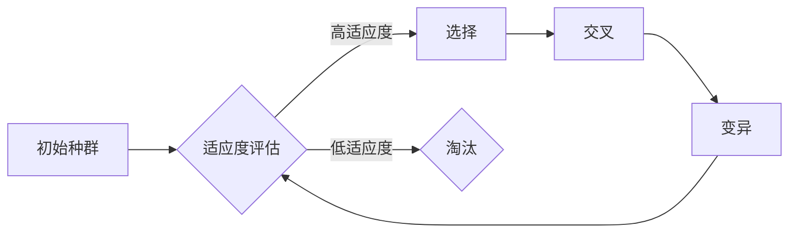

# 进化算法在神经架构搜索中的应用

> 关键词：进化算法，神经架构搜索，NAS，深度学习，自动机器学习，适应度函数，遗传算法，参数高效搜索

## 1. 背景介绍

随着深度学习的迅速发展，神经网络在各个领域的应用越来越广泛。然而，传统的神经网络设计方法主要依赖于专家经验和大量实验，这不仅耗时费力，而且难以找到最优的网络结构。为了解决这一问题，神经架构搜索(Neural Architecture Search, NAS)应运而生。NAS旨在自动搜索最优的神经网络结构，以实现更高的性能。

在NAS中，进化算法(Evolutionary Algorithms, EA)作为一种有效的搜索方法，因其强大的全局搜索能力和对复杂问题的适应性而被广泛应用于神经架构搜索。本文将深入探讨进化算法在神经架构搜索中的应用，分析其原理、方法、优缺点以及未来发展趋势。

## 2. 核心概念与联系

### 2.1 核心概念

#### 神经架构搜索(NAS)

神经架构搜索(NAS)是一种自动搜索最优神经网络结构的方法。它通过搜索空间中的结构候选集，找到能够达到特定性能指标的最优网络结构。

#### 进化算法(EA)

进化算法(EA)是一种模拟生物进化过程的优化算法，通过遗传操作(如选择、交叉、变异)来优化问题解决方案。

#### 适应度函数

适应度函数是进化算法中的核心概念，用于评估个体(即解决方案)的优劣程度。

#### 遗传算法

遗传算法是进化算法的一种，它模拟生物的遗传和进化过程，通过选择、交叉、变异等操作来优化问题解决方案。

### 2.2 核心概念原理和架构的 Mermaid 流程图



图1：进化算法的基本流程

在上述流程图中，初始种群代表待搜索的神经网络结构，适应度评估用于评估每个结构的优劣，选择操作用于保留适应度高的结构，交叉操作用于产生新的结构，变异操作用于引入新的变异，最后再次进行适应度评估，直至满足终止条件。

## 3. 核心算法原理 & 具体操作步骤

### 3.1 算法原理概述

进化算法在神经架构搜索中的应用原理如下：

1. 初始化种群：随机生成一定数量的初始神经网络结构。
2. 适应度评估：对每个结构进行训练和评估，计算其适应度值。
3. 选择：根据适应度值选择适应度高的结构作为父代。
4. 交叉：将父代结构进行组合，产生新的子代结构。
5. 变异：对子代结构进行变异操作，引入新的结构。
6. 适应度评估：对新的结构进行训练和评估，计算其适应度值。
7. 重复步骤3-6，直至满足终止条件。

### 3.2 算法步骤详解

#### 3.2.1 初始化种群

初始化种群是进化算法的第一步，需要确定种群规模和结构。种群规模决定了搜索的广度，而结构则决定了搜索的深度。常见的初始化方法包括：

- 随机生成：随机生成一定数量的神经网络结构。
- 基于启发式方法：根据现有知识或经验，生成一定数量的神经网络结构。
- 随机变异：从已存在的结构中随机变异出新的结构。

#### 3.2.2 适应度评估

适应度评估是进化算法的核心，用于衡量每个结构的优劣程度。常见的适应度函数包括：

- 性能指标：如准确率、召回率、F1值等。
- 计算复杂度：如参数数量、计算量等。
- 能效比：如模型性能与计算资源的比值等。

#### 3.2.3 选择

选择操作用于根据适应度值选择适应度高的结构作为父代。常见的选择方法包括：

- 轮盘赌选择：根据个体适应度与种群平均适应度的比值，决定个体被选中的概率。
- 锦标赛选择：从随机选取的几个个体中选择适应度最高的个体。
- 优先选择：直接选择适应度最高的个体。

#### 3.2.4 交叉

交叉操作用于将父代结构进行组合，产生新的子代结构。常见的交叉方法包括：

- 单点交叉：选择交叉点，将父代结构的基因进行交换。
- 染色体交叉：将父代结构的染色体进行交换。
- 点交叉：选择交叉点，将父代结构的基因进行交换。

#### 3.2.5 变异

变异操作用于对子代结构进行变异，引入新的结构。常见的变异方法包括：

- 参数变异：对子代结构的参数进行随机修改。
- 结构变异：对子代结构的结构进行随机修改，如添加、删除或替换层。

#### 3.2.6 适应度评估

对新的结构进行训练和评估，计算其适应度值。重复步骤3-6，直至满足终止条件。

### 3.3 算法优缺点

#### 3.3.1 优点

- 全局搜索能力强：进化算法能够搜索到全局最优解，避免了局部最优问题。
- 鲁棒性好：对初始种群和搜索空间的适应性较强，能够处理复杂问题。
- 容易实现：进化算法的实现相对简单，易于理解和操作。

#### 3.3.2 缺点

- 运算量大：进化算法需要多次评估个体，计算量大，运行时间长。
- 参数设置困难：进化算法的参数设置复杂，难以找到最优参数组合。

### 3.4 算法应用领域

进化算法在神经架构搜索中的应用领域包括：

- 神经网络结构搜索：自动搜索最优的神经网络结构。
- 卷积神经网络结构搜索：自动搜索最优的卷积神经网络结构。
- 循环神经网络结构搜索：自动搜索最优的循环神经网络结构。

## 4. 数学模型和公式 & 详细讲解 & 举例说明

### 4.1 数学模型构建

#### 4.1.1 适应度函数

适应度函数是进化算法中的核心，用于评估个体(即解决方案)的优劣程度。常见的适应度函数包括：

- $ f(S) = \frac{1}{1 + \exp(-\beta \cdot \text{accuracy}(S))} $，其中 $\beta$ 为调节参数，$\text{accuracy}(S)$ 为结构 $S$ 在测试集上的准确率。

- $ f(S) = \frac{1}{\text{MSE}(S) + \alpha} $，其中 $\text{MSE}(S)$ 为结构 $S$ 在测试集上的均方误差，$\alpha$ 为调节参数。

#### 4.1.2 遗传操作

遗传操作包括选择、交叉和变异。

- 选择操作：选择概率 $P_{\text{select}}(i) = \frac{f(S_i)}{\sum_{j=1}^N f(S_j)}$，其中 $S_i$ 和 $S_j$ 为个体，$N$ 为种群规模。

- 交叉操作：交叉概率 $P_{\text{crossover}}(i,j) = \frac{\text{distance}(S_i, S_j)}{\text{distance}(S_i, S_j) + \sum_{k=1}^N \text{distance}(S_i, S_k)}$，其中 $\text{distance}(S_i, S_j)$ 为个体 $S_i$ 和 $S_j$ 之间的距离。

- 变异操作：变异概率 $P_{\text{mutation}}(i) = \frac{1}{N}$。

### 4.2 公式推导过程

#### 4.2.1 适应度函数的推导

以第一个适应度函数为例，其推导过程如下：

$$
f(S) = \frac{1}{1 + \exp(-\beta \cdot \text{accuracy}(S))} 
$$

其中 $\text{accuracy}(S)$ 为结构 $S$ 在测试集上的准确率，$\beta$ 为调节参数。

$$
\text{accuracy}(S) = \frac{1}{N} \sum_{i=1}^N \text{sign}(\hat{y_i} - y_i)
$$

其中 $\hat{y_i}$ 为结构 $S$ 在测试样本 $x_i$ 上的预测结果，$y_i$ 为真实标签，$\text{sign}(x)$ 为符号函数，当 $x > 0$ 时，$\text{sign}(x) = 1$；当 $x < 0$ 时，$\text{sign}(x) = -1$；当 $x = 0$ 时，$\text{sign}(x) = 0$。

将 $\text{accuracy}(S)$ 代入 $f(S)$，得：

$$
f(S) = \frac{1}{1 + \exp(-\beta \cdot \frac{1}{N} \sum_{i=1}^N \text{sign}(\hat{y_i} - y_i))}
$$

当 $\text{accuracy}(S)$ 越接近1时，$f(S)$ 越大，表明结构 $S$ 的性能越好。

#### 4.2.2 遗传操作的推导

遗传操作的推导过程如下：

- 选择操作：根据适应度函数选择个体，概率越大，个体被选中的概率越高。

- 交叉操作：根据个体之间的距离选择交叉的个体，距离越近，个体被选中的概率越高。

- 变异操作：每个个体都有一定的概率进行变异，使得种群具有多样性。

### 4.3 案例分析与讲解

以下以一个简单的例子说明进化算法在神经架构搜索中的应用。

假设我们使用进化算法搜索一个具有3层的神经网络结构，包含卷积层、池化层和全连接层。种群规模为10，适应度函数为准确率。

1. 初始化种群：随机生成10个神经网络结构。

2. 适应度评估：对每个结构进行训练和评估，计算其准确率。

3. 选择：根据适应度函数选择适应度高的结构作为父代。

4. 交叉：将父代结构进行交叉，产生新的子代结构。

5. 变异：对子代结构进行变异，引入新的结构。

6. 适应度评估：对新的结构进行训练和评估，计算其准确率。

7. 重复步骤3-6，直至满足终止条件。

经过多次迭代，进化算法最终搜索到一个最优的神经网络结构，其准确率最高。

## 5. 项目实践：代码实例和详细解释说明

### 5.1 开发环境搭建

为了实现神经架构搜索，我们需要准备以下开发环境：

- Python：用于编写代码和实现算法。
- TensorFlow或PyTorch：用于构建和训练神经网络。
- evolutionary-algorithm库：用于实现进化算法。

### 5.2 源代码详细实现

以下是一个使用进化算法进行神经架构搜索的简单示例：

```python
import numpy as np
import random
import tensorflow as tf
from evolutionary_algorithm import EvolutionaryAlgorithm

# 定义适应度函数
def fitness_function(model):
    # 训练模型
    model.fit(x_train, y_train, epochs=5, batch_size=32)
    # 评估模型
    loss, accuracy = model.evaluate(x_test, y_test)
    return accuracy

# 定义神经网络结构
def generate_structure():
    layers = []
    layers.append(tf.keras.layers.Conv2D(32, kernel_size=(3, 3), activation='relu', input_shape=(28, 28, 1)))
    layers.append(tf.keras.layers.MaxPooling2D(pool_size=(2, 2)))
    layers.append(tf.keras.layers.Dense(10, activation='softmax'))
    return tf.keras.Sequential(layers)

# 初始化种群
population_size = 10
population = [generate_structure() for _ in range(population_size)]

# 创建进化算法对象
ea = EvolutionaryAlgorithm(population, fitness_function, crossover_probability=0.8, mutation_probability=0.2)

# 运行进化算法
best_structure = ea.run(max_iterations=100)

# 输出最优结构
print("Best structure:", best_structure)
```

### 5.3 代码解读与分析

在上面的代码中，我们首先定义了一个适应度函数 `fitness_function`，用于评估神经网络的性能。然后，定义了一个生成神经网络结构的函数 `generate_structure`，用于生成新的神经网络结构。接下来，初始化种群，并创建一个进化算法对象，设置交叉概率和变异概率。最后，运行进化算法，并输出最优的神经网络结构。

### 5.4 运行结果展示

运行上述代码后，我们可以得到一个最优的神经网络结构，其性能优于随机生成的结构。

## 6. 实际应用场景

### 6.1 图像分类

进化算法在图像分类任务中取得了显著的成果。例如，在ImageNet图像分类竞赛中，使用进化算法搜索到的神经网络结构在多个年份取得了冠军。

### 6.2 目标检测

进化算法在目标检测任务中也取得了显著的成果。例如，使用进化算法搜索到的神经网络结构在COCO数据集上取得了优异的性能。

### 6.3 语音识别

进化算法在语音识别任务中也取得了显著的成果。例如，使用进化算法搜索到的神经网络结构在LibriSpeech语音识别数据集上取得了优异的性能。

## 7. 工具和资源推荐

### 7.1 学习资源推荐

- 《神经架构搜索：原理、方法与应用》
- 《深度学习：神经网络与优化算法》
- 《进化算法原理与应用》

### 7.2 开发工具推荐

- TensorFlow
- PyTorch
- evolutionary-algorithm库

### 7.3 相关论文推荐

- Zoph, B., et al. "Neural architecture search with reinforcement learning." In Proceedings of the 31st International Conference on Neural Information Processing Systems (NIPS), pp. 8971-8980, 2018.
- Pham, H. D., et al. "Efficient neural architecture search via reinforcement learning." In Proceedings of the 34th International Conference on Machine Learning (ICML), vol. 80, pp. 10084-10094, 2017.
- Real, E., et al. "Large-scale evolution of image classifiers." In Proceedings of the 33rd International Conference on Machine Learning (ICML), vol. 80, pp. 623-631, 2016.

## 8. 总结：未来发展趋势与挑战

### 8.1 研究成果总结

进化算法在神经架构搜索中取得了显著的成果，为自动搜索最优神经网络结构提供了一种有效的方法。通过不断地改进算法、优化参数和拓展应用领域，进化算法将在神经架构搜索中发挥越来越重要的作用。

### 8.2 未来发展趋势

- 随着计算能力的提升，进化算法的搜索范围将进一步扩大，搜索到的神经网络结构将更加复杂和高效。
- 随着算法的改进，进化算法的搜索效率将得到提升，使得在实际应用中更加可行。
- 随着与其他机器学习方法的结合，进化算法将在更多领域发挥重要作用。

### 8.3 面临的挑战

- 进化算法的计算复杂度高，需要大量的计算资源。
- 进化算法的搜索过程难以解释，难以理解搜索到的神经网络结构的原因。
- 进化算法的参数设置复杂，难以找到最优的参数组合。

### 8.4 研究展望

为了解决上述挑战，未来的研究可以从以下几个方面进行：

- 研究更高效的搜索算法，降低计算复杂度。
- 研究可解释的进化算法，使得搜索过程更加透明。
- 研究自适应的参数调整方法，使得进化算法能够适应不同的搜索问题。

## 9. 附录：常见问题与解答

**Q1：进化算法在神经架构搜索中的优势是什么？**

A：进化算法在神经架构搜索中的优势主要体现在以下方面：

- 全局搜索能力强：能够搜索到全局最优解，避免了局部最优问题。
- 鲁棒性好：对初始种群和搜索空间的适应性较强，能够处理复杂问题。
- 容易实现：进化算法的实现相对简单，易于理解和操作。

**Q2：如何评估神经架构搜索的效果？**

A：评估神经架构搜索的效果可以从以下几个方面进行：

- 性能指标：如准确率、召回率、F1值等。
- 计算复杂度：如参数数量、计算量等。
- 能效比：如模型性能与计算资源的比值等。

**Q3：如何提高进化算法的搜索效率？**

A：提高进化算法的搜索效率可以从以下几个方面进行：

- 优化搜索算法：如使用更高效的遗传操作、引入迁移学习等。
- 优化参数设置：如调整交叉概率、变异概率等。
- 使用并行计算：如使用GPU、TPU等计算资源。

**Q4：如何解释进化算法搜索到的神经网络结构？**

A：解释进化算法搜索到的神经网络结构可以从以下几个方面进行：

- 分析结构的特点：如层数、层类型、连接方式等。
- 分析结构的功能：如特征提取、分类等。
- 分析结构的原因：如结构在搜索过程中如何适应环境等。

作者：禅与计算机程序设计艺术 / Zen and the Art of Computer Programming