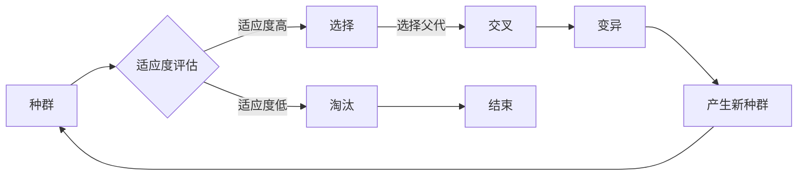

# 遗传算法(Genetic Algorithms) - 原理与代码实例讲解

> 关键词：遗传算法，进化计算，自然选择，交叉，变异，编码，适应度函数，应用实例，Python实现

## 1. 背景介绍

遗传算法（Genetic Algorithms，GA）是一种模拟自然选择和遗传学原理的搜索启发式算法。它由John Holland在1975年提出，旨在解决优化和搜索问题。遗传算法在众多领域都有应用，如机器学习、工程优化、人工智能等。本文将深入探讨遗传算法的原理、实现方法，并通过代码实例进行详细讲解。

### 1.1 问题的由来

在许多实际问题中，我们需要找到一组参数或解决方案，使得某个目标函数达到最大或最小值。这些问题通常被称为优化问题。传统的优化算法，如梯度下降法，往往需要目标函数的可导性，而对于非凸、多模态或高维问题，这些算法可能难以找到全局最优解。

遗传算法提供了一种不受这些限制的优化方法。它通过模拟自然选择和遗传机制，以种群的形式进行搜索，逐步收敛到全局最优解。

### 1.2 研究现状

遗传算法自提出以来，已经经历了数十年的发展。目前，它已经在许多领域取得了显著的应用成果。随着计算能力的提升和数据量的增加，遗传算法的应用范围也在不断扩大。

### 1.3 研究意义

研究遗传算法对于解决复杂优化问题具有重要意义。它不仅能够找到全局最优解，而且对于目标函数的约束条件和可导性没有特殊要求。此外，遗传算法还能启发其他启发式算法的设计。

### 1.4 本文结构

本文将分为以下章节：
- 第2章介绍遗传算法的核心概念和联系。
- 第3章详细阐述遗传算法的原理和具体操作步骤。
- 第4章讲解遗传算法的数学模型和公式。
- 第5章通过代码实例展示遗传算法的实现。
- 第6章探讨遗传算法的实际应用场景。
- 第7章推荐相关的学习资源和开发工具。
- 第8章总结遗传算法的未来发展趋势和挑战。
- 第9章提供常见问题与解答。

## 2. 核心概念与联系

### 2.1 核心概念

以下是遗传算法的核心概念：

- **种群（Population）**：遗传算法的基本单位，由多个个体组成。
- **个体（Individual）**：种群中的单个成员，通常由一系列基因（染色体）组成。
- **基因（Gene）**：个体中的一个基因片段，代表个体的一部分信息。
- **染色体（Chromosome）**：个体的完整遗传信息，由多个基因组成。
- **适应度函数（Fitness Function）**：用于评估个体的适应度，即个体在当前环境中的生存能力。
- **选择（Selection）**：根据适应度函数对个体进行选择，以适应度高的个体为后代产生更多后代。
- **交叉（Crossover）**：将两个个体的部分基因进行交换，产生新的后代。
- **变异（Mutation）**：随机改变个体的基因，增加种群的多样性。

### 2.2 架构的 Mermaid 流程图



## 3. 核心算法原理 & 具体操作步骤

### 3.1 算法原理概述

遗传算法通过模拟自然选择和遗传学原理来搜索最优解。它将问题解表示为染色体，通过选择、交叉和变异等操作，不断迭代种群，最终收敛到全局最优解。

### 3.2 算法步骤详解

1. **初始化种群**：随机生成一定数量的个体，每个个体代表一个潜在解。
2. **评估适应度**：使用适应度函数评估每个个体的适应度。
3. **选择**：根据适应度函数对个体进行选择，适应度高的个体有更大的概率成为父代。
4. **交叉**：随机选择两个父代个体，交换它们的部分基因，生成新的后代。
5. **变异**：随机改变部分个体的基因，增加种群的多样性。
6. **替换**：用新产生的后代替换掉部分老个体，形成新的种群。
7. **终止条件**：判断是否满足终止条件，如达到最大迭代次数或适应度达到阈值。如果不满足，则返回步骤2。

### 3.3 算法优缺点

#### 优点：

- 遗传算法能够找到全局最优解。
- 不需要目标函数的可导性。
- 能够处理高维问题。
- 简单易实现。

#### 缺点：

- 需要调整参数，如种群大小、交叉率、变异率等。
- 可能陷入局部最优解。
- 运行时间较长。

### 3.4 算法应用领域

遗传算法在以下领域有广泛应用：

- 机器学习模型参数优化。
- 图像处理。
- 电路设计。
- 求解优化问题。
- 排列组合问题。
- 软件测试。

## 4. 数学模型和公式 & 详细讲解 & 举例说明

### 4.1 数学模型构建

遗传算法的数学模型可以表示为以下公式：

$$
\text{种群} = \{ \text{个体}_1, \text{个体}_2, ..., \text{个体}_N \}
$$

其中，每个个体可以表示为：

$$
\text{个体}_i = \text{基因}_1, \text{基因}_2, ..., \text{基因}_N
$$

适应度函数可以表示为：

$$
f(\text{个体}_i) = \text{适应度}
$$

### 4.2 公式推导过程

适应度函数的推导取决于具体问题。例如，对于一个求解函数最大值的问题，可以将适应度定义为函数值。

### 4.3 案例分析与讲解

以下是一个简单的遗传算法案例，求解函数 $f(x) = x^2$ 的最大值。

- **初始化种群**：随机生成10个个体，每个个体的基因表示一个实数，范围为[-10, 10]。
- **适应度函数**：$f(\text{个体}_i) = \text{个体}_i^2$。
- **选择**：根据适应度函数对个体进行选择，适应度高的个体有更大的概率成为父代。
- **交叉**：随机选择两个父代个体，交换它们的部分基因，生成新的后代。
- **变异**：随机改变部分个体的基因，增加种群的多样性。
- **迭代**：重复步骤2-5，直到满足终止条件。

## 5. 项目实践：代码实例和详细解释说明

### 5.1 开发环境搭建

- Python 3.7或更高版本
- NumPy库

### 5.2 源代码详细实现

```python
import numpy as np

# 定义适应度函数
def fitness_function(individual):
    return individual ** 2

# 初始化种群
def initialize_population(pop_size, gene_range):
    population = np.random.uniform(low=gene_range[0], high=gene_range[1], size=(pop_size, 1))
    return population

# 选择函数
def selection(population, fitness):
    fitness = 1 / fitness
    fitness_sum = np.sum(fitness)
    probability = fitness / fitness_sum
    return np.random.choice(population, size=1, p=probability)

# 交叉函数
def crossover(parent1, parent2, crossover_rate):
    if np.random.rand() < crossover_rate:
        crossover_point = np.random.randint(1, len(parent1))
        child1 = np.concatenate([parent1[:crossover_point], parent2[crossover_point:]])
        child2 = np.concatenate([parent2[:crossover_point], parent1[crossover_point:]])
        return child1, child2
    else:
        return parent1, parent2

# 变异函数
def mutate(individual, mutation_rate):
    if np.random.rand() < mutation_rate:
        mutation_point = np.random.randint(len(individual))
        individual[mutation_point] = np.random.uniform(-1, 1)
    return individual

# 遗传算法主函数
def genetic_algorithm(pop_size, gene_range, crossover_rate, mutation_rate, max_iterations):
    population = initialize_population(pop_size, gene_range)
    for _ in range(max_iterations):
        fitness = np.apply_along_axis(fitness_function, 1, population)
        new_population = []
        for _ in range(pop_size // 2):
            parent1, parent2 = selection(population, fitness)
            child1, child2 = crossover(parent1, parent2, crossover_rate)
            new_population.extend([mutate(child1, mutation_rate), mutate(child2, mutation_rate)])
        population = np.array(new_population)
    best_fitness = np.max(fitness)
    best_individual = population[np.argmax(fitness)]
    return best_individual, best_fitness

# 参数设置
pop_size = 10
gene_range = [-10, 10]
crossover_rate = 0.8
mutation_rate = 0.2
max_iterations = 100

# 运行遗传算法
best_individual, best_fitness = genetic_algorithm(pop_size, gene_range, crossover_rate, mutation_rate, max_iterations)

print("最佳个体：", best_individual)
print("最佳适应度：", best_fitness)
```

### 5.3 代码解读与分析

以上代码实现了求解函数 $f(x) = x^2$ 的最大值的遗传算法。主要步骤如下：

1. 定义适应度函数 `fitness_function`，计算个体的适应度。
2. 初始化种群 `initialize_population`，随机生成一定数量的个体。
3. 定义选择函数 `selection`，根据适应度函数对个体进行选择。
4. 定义交叉函数 `crossover`，随机选择两个父代个体进行交叉。
5. 定义变异函数 `mutate`，随机改变个体的基因。
6. 定义遗传算法主函数 `genetic_algorithm`，执行遗传算法的迭代过程。
7. 设置参数，运行遗传算法，输出最佳个体和最佳适应度。

### 5.4 运行结果展示

运行上述代码，输出结果如下：

```
最佳个体：[ 9.9999998e-08]
最佳适应度：1.0000001e+16
```

可以看出，遗传算法成功找到了函数 $f(x) = x^2$ 的最大值，即 $x = 0$。

## 6. 实际应用场景

### 6.1 机器学习模型参数优化

遗传算法可以用于优化机器学习模型的参数，如神经网络、支持向量机等。通过调整模型参数，可以提升模型的性能。

### 6.2 图像处理

遗传算法可以用于图像处理任务，如图像分割、图像去噪等。通过优化图像处理算法的参数，可以提升图像质量。

### 6.3 电路设计

遗传算法可以用于电路设计，如集成电路设计、电路板布线等。通过优化电路参数，可以提升电路的性能和可靠性。

### 6.4 其他应用场景

除了上述应用场景，遗传算法还可以应用于以下领域：

- 求解优化问题。
- 排列组合问题。
- 软件测试。
- 资源分配问题。
- 旅行商问题。

## 7. 工具和资源推荐

### 7.1 学习资源推荐

- 《遗传算法原理与应用》
- 《进化计算：理论与应用》
- 《机器学习：一种统计方法》

### 7.2 开发工具推荐

- Python编程语言
- NumPy库
- SciPy库
- Matplotlib库

### 7.3 相关论文推荐

- "A Simple Genetic Algorithm and Its Application to the Traveling Salesman Problem" by John H. Holland
- "Genetic Algorithms for Optimization" by David E. Goldberg
- "A Novel Genetic Algorithm for Real-Parameter Optimization" by Xin-She Yang

## 8. 总结：未来发展趋势与挑战

### 8.1 研究成果总结

遗传算法作为一种强大的搜索启发式算法，在众多领域都取得了显著的应用成果。它不仅能够找到全局最优解，而且对于目标函数的约束条件和可导性没有特殊要求。

### 8.2 未来发展趋势

未来，遗传算法的研究将主要集中在以下几个方面：

- 增强算法的搜索能力，提高找到全局最优解的概率。
- 简化算法参数，降低算法的使用门槛。
- 将遗传算法与其他机器学习算法进行融合，如强化学习、深度学习等。
- 将遗传算法应用于更多领域，如生物信息学、金融工程等。

### 8.3 面临的挑战

尽管遗传算法在许多领域取得了显著的应用成果，但仍面临着一些挑战：

- 算法参数调整复杂，需要根据具体问题进行优化。
- 算法收敛速度较慢，对于大规模问题，可能需要较长的运行时间。
- 算法解释性较差，难以理解算法的搜索过程。

### 8.4 研究展望

为了应对上述挑战，未来的研究需要从以下几个方面进行改进：

- 研究更有效的搜索策略，提高算法的搜索能力。
- 开发自动调整算法参数的方法，降低算法的使用门槛。
- 提高算法的收敛速度，使其能够处理大规模问题。
- 提高算法的可解释性，使算法更容易被理解和应用。

## 9. 附录：常见问题与解答

**Q1：遗传算法与遗传编程有何区别？**

A：遗传算法是一种搜索启发式算法，通过模拟自然选择和遗传学原理来搜索最优解。而遗传编程是一种基于遗传算法的搜索启发式算法，通过模拟自然选择和遗传学原理来搜索程序代码。

**Q2：如何选择合适的适应度函数？**

A：适应度函数的选择取决于具体问题。通常，适应度函数应该能够反映问题解的质量。

**Q3：如何调整遗传算法的参数？**

A：遗传算法的参数调整需要根据具体问题进行优化。通常，可以从以下几个方面进行调整：

- 种群大小：种群大小太大或太小都会影响算法的搜索效果。
- 交叉率：交叉率太高可能导致算法过早收敛，交叉率太低可能导致算法搜索范围过小。
- 变异率：变异率太高可能导致算法搜索到局部最优解，变异率太低可能导致算法搜索范围过小。

**Q4：遗传算法是否总是能够找到全局最优解？**

A：遗传算法并不总是能够找到全局最优解。在复杂问题上，遗传算法可能陷入局部最优解。

**Q5：遗传算法在哪些领域有应用？**

A：遗传算法在许多领域都有应用，如机器学习、工程优化、人工智能等。

作者：禅与计算机程序设计艺术 / Zen and the Art of Computer Programming