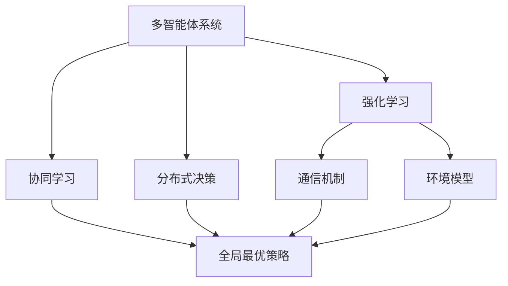

                 

## 1. 背景介绍

### 1.1 问题由来
随着人工智能技术的不断发展，多智能体系统(Multi-Agent System, MAS)已成为研究的热点。MAS在分布式决策、社交互动、自动驾驶、智能电网等领域具有广泛应用前景。多智能体系统中，各个智能体之间需要协同合作，以达到全局最优解或解决复杂的任务。然而，多智能体系统面临着诸如信息共享、协同决策、任务分配等问题，这些问题往往非常复杂，难以用传统的集中式方法解决。

在MAS中，强化学习(Reinforcement Learning, RL)作为一种基于试错的学习范式，通过与环境交互，智能体不断调整自身的行为策略，以最大化预定义的奖励函数。在多智能体系统中，各个智能体需要协同学习，以获得全局最优策略。因此，多智能体强化学习(MAS-RL)已成为当前研究的热点问题。

### 1.2 问题核心关键点
MAS-RL的关键点包括：
- 智能体间的协作与竞争：MAS中各智能体既需要协作完成共同任务，又可能存在竞争，需合理平衡这两者的关系。
- 环境模型和通信机制：环境模型的准确性和智能体间通信的可靠性对智能体策略的优化至关重要。
- 学习算法的设计：MAS-RL中需要设计合理的学习算法，使得各个智能体在不断迭代中优化策略。

### 1.3 问题研究意义
研究MAS-RL，对于拓展智能体协作的深度和广度，提升复杂任务解决能力，具有重要意义：

1. **分布式决策**：在高度分布式的系统中，单个智能体无法全面掌握所有信息，MAS-RL能实现各智能体间的信息共享和协同决策，提高系统整体效率。
2. **优化资源利用**：MAS-RL通过协同学习，优化资源分配，提高任务执行的效率和准确性。
3. **增强系统鲁棒性**：MAS-RL通过多智能体间的协同，减少单一智能体的故障对系统整体的影响，提高系统鲁棒性。
4. **创新应用场景**：MAS-RL可以应用于智能交通、智慧医疗、协同机器人等新兴领域，为各行各业带来新的应用价值。
5. **技术进步推动**：MAS-RL研究可以推动强化学习、多智能体系统等领域的发展，推动整体AI技术的进步。

## 2. 核心概念与联系

### 2.1 核心概念概述

为更好地理解MAS-RL中的协作机制，本节将介绍几个关键概念：

- **多智能体系统**(Multi-Agent System, MAS)：由多个智能体组成的系统，各智能体之间通过交互协作，共同完成任务。
- **强化学习**(Reinforcement Learning, RL)：通过与环境交互，智能体不断调整自身行为策略，以最大化预定义的奖励函数。
- **协同学习**(Cooperative Learning)：多智能体间协同工作，共同优化全局最优策略。
- **分布式决策**(Distributed Decision Making)：各智能体通过信息共享，实现分布式决策，提高系统效率。
- **通信机制**(Communication Mechanism)：智能体间交换信息的方式，如直接消息传递、共享记忆等。
- **环境模型**(Environment Model)：描述MAS运行环境的数学模型，用于指导智能体的决策。

这些概念之间通过相互作用，形成了MAS-RL的协作机制。

### 2.2 概念间的关系

这些核心概念之间的关系可以通过以下Mermaid流程图来展示：



这个流程图展示了大语言模型微调过程中各个概念之间的联系：

1. 多智能体系统通过强化学习优化各智能体的行为策略。
2. 各智能体间通过通信机制进行信息共享，实现协同学习。
3. 协同学习的目标是优化全局最优策略。
4. 全局最优策略的优化依赖于环境模型的准确性。
5. 通信机制和环境模型协同工作，共同指导智能体的决策。

通过这些概念的关系，我们可以更好地理解MAS-RL的协作机制。

## 3. 核心算法原理 & 具体操作步骤
### 3.1 算法原理概述

MAS-RL的基本原理是通过强化学习实现各智能体间的协作，共同优化全局最优策略。具体而言，每个智能体都通过与环境交互，获得状态$S_t$和奖励$R_t$，不断调整自身的策略$\pi_t$，以最大化长期累积奖励$J(\pi)$。在MAS中，各智能体的策略$\pi_t$是相互影响的，通过协同学习，各智能体共同优化全局最优策略$G^*$。

数学上，MAS-RL的优化目标可以表示为：

$$
\mathop{\arg\min}_{\pi} J(\pi) = \mathop{\arg\min}_{\pi} \sum_{t=1}^{T} \gamma^t R_t(\pi)
$$

其中，$\pi$表示智能体的策略，$R_t(\pi)$表示在第$t$步的奖励，$\gamma$为折扣因子，$T$为总时间步数。

MAS-RL的核心在于设计合理的协作机制，使得各智能体通过通信和信息共享，协同优化全局最优策略。常见的协作机制包括协作型策略、竞争型策略和混合策略。

### 3.2 算法步骤详解

MAS-RL的实现主要分为以下几个步骤：

**Step 1: 初始化环境与智能体**
- 构建MAS的环境模型，定义环境状态和奖励函数。
- 初始化各智能体的状态、策略和通信机制。

**Step 2: 智能体交互与策略更新**
- 各智能体通过通信机制进行信息共享，协同决策。
- 智能体根据当前状态和策略，采取行动，获得新状态和奖励。
- 智能体根据奖励更新策略，通过与环境交互不断优化策略。

**Step 3: 全局最优策略的求解**
- 通过协同学习，各智能体共同优化全局最优策略$G^*$。
- 采用各种优化算法（如Q-learning、SARSA、PG等），求解全局最优策略。

**Step 4: 模型评估与优化**
- 通过实际测试，评估MAS-RL模型的性能。
- 根据评估结果，调整模型参数，优化模型性能。

### 3.3 算法优缺点

MAS-RL的优点包括：
1. **分布式决策**：各智能体通过协同学习，实现分布式决策，提高系统效率。
2. **优化资源利用**：MAS-RL通过协同学习，优化资源分配，提高任务执行效率。
3. **增强系统鲁棒性**：MAS-RL通过多智能体间的协同，减少单一智能体的故障对系统整体的影响，提高系统鲁棒性。
4. **灵活性**：MAS-RL可以灵活应用于各种场景，如自动驾驶、智能电网、协同机器人等。

MAS-RL的缺点包括：
1. **信息共享难度**：各智能体间信息共享需要可靠的通信机制，但在复杂环境中，信息共享可能存在延迟和错误。
2. **策略冲突**：各智能体的策略可能存在冲突，需要通过协调机制进行解决。
3. **计算复杂度高**：MAS-RL需要同时优化多个智能体的策略，计算复杂度较高。

### 3.4 算法应用领域

MAS-RL在许多领域都有广泛的应用，包括：

- **自动驾驶**：多智能体系统协同决策，提高行车安全和效率。
- **智慧电网**：多智能体系统协同优化能源分配，提高能源利用率。
- **智能交通**：多智能体系统协同调度交通信号灯，减少交通拥堵。
- **协同机器人**：多智能体系统协同完成复杂任务，提高生产效率。
- **社交互动**：多智能体系统协同优化社交网络，提高用户体验。

除了上述应用，MAS-RL还在金融、医疗、物流等领域有重要应用价值，为各行各业带来新的应用场景。

## 4. 数学模型和公式 & 详细讲解 & 举例说明

### 4.1 数学模型构建

MAS-RL的数学模型通常包括环境模型、智能体策略和通信机制三个部分。

假设环境模型为$M$，智能体的策略为$\pi$，通信机制为$C$。各智能体通过通信机制进行信息共享，协同决策。智能体在环境中的状态为$S$，行动为$A$，奖励为$R$。

### 4.2 公式推导过程

MAS-RL的优化目标可以表示为：

$$
\mathop{\arg\min}_{\pi} J(\pi) = \mathop{\arg\min}_{\pi} \sum_{t=1}^{T} \gamma^t R_t(\pi)
$$

其中，$\pi$表示智能体的策略，$R_t(\pi)$表示在第$t$步的奖励，$\gamma$为折扣因子，$T$为总时间步数。

在MAS-RL中，智能体策略$\pi$通常采用策略梯度方法进行优化。策略梯度方法通过最大化对数似然比，更新智能体的策略，使得最大化累积奖励。具体来说，策略梯度方法可以表示为：

$$
\nabla_{\pi} J(\pi) = \mathbb{E}_{\tau \sim \pi} \left[ \sum_{t=1}^{T} \nabla_{\pi(a_t|s_t)} \log \pi(a_t|s_t) Q(s_t, a_t) \right]
$$

其中，$\pi(a_t|s_t)$表示智能体在状态$s_t$下采取行动$a_t$的概率，$Q(s_t, a_t)$表示智能体在状态$s_t$下采取行动$a_t$的Q值。

### 4.3 案例分析与讲解

假设我们有一个简单的多智能体系统，其中有两个智能体，每个智能体都需要导航到目标位置。智能体通过共享传感器数据进行信息共享，协同决策。每个智能体都有一个简单的状态表示其当前位置和目标位置之间的距离。每个智能体在每个时间步都可以采取两种行动：向左或向右移动。

假设每个智能体的奖励函数为$R_t = -d_t$，其中$d_t$为智能体在第$t$步与目标位置的距离。环境模型为$M = \{s, r\}$，其中$s$为智能体的位置，$r$为目标位置。

我们可以使用MAS-RL的算法，通过协同学习优化智能体的策略，使得每个智能体能够协同导航到目标位置。

## 5. 项目实践：代码实例和详细解释说明

### 5.1 开发环境搭建

在进行MAS-RL的实践前，我们需要准备好开发环境。以下是使用Python进行MAS-RL开发的常见环境配置流程：

1. 安装Anaconda：从官网下载并安装Anaconda，用于创建独立的Python环境。

2. 创建并激活虚拟环境：
```bash
conda create -n reinforcement-env python=3.8 
conda activate reinforcement-env
```

3. 安装必要的Python库：
```bash
pip install numpy matplotlib gym 
```

4. 安装相关的深度学习库：
```bash
pip install tensorflow keras
```

完成上述步骤后，即可在`reinforcement-env`环境中开始MAS-RL的实践。

### 5.2 源代码详细实现

下面以一个简单的多智能体导航任务为例，给出使用TensorFlow和Keras实现MAS-RL的代码。

首先，定义智能体的状态表示和行动空间：

```python
import tensorflow as tf
import numpy as np

class Agent:
    def __init__(self, state_dim, action_dim, learning_rate):
        self.state_dim = state_dim
        self.action_dim = action_dim
        self.learning_rate = learning_rate
        self.policy = None
        self.target_policy = None
        self.optimizer = tf.keras.optimizers.Adam(learning_rate)

    def act(self, state):
        action = self.policy.predict(state)
        return np.random.choice(action)

    def update(self, state, action, reward, next_state):
        self.target_policy.trainable = True
        self.policy.trainable = False
        self.target_policy.set_weights(self.policy.get_weights())
        action_prob = tf.reduce_sum(self.target_policy(tf.reshape(state, (1, self.state_dim))), axis=1)
        loss = -tf.math.log(action_prob) * reward
        self.optimizer.minimize(loss, var_list=self.target_policy.trainable_variables)
        self.policy.trainable = True
        self.target_policy.trainable = False

    def train(self, states, actions, rewards, next_states):
        self.policy.trainable = True
        self.target_policy.trainable = True
        action_probs = tf.reduce_sum(self.policy(tf.reshape(states, (len(states), self.state_dim))), axis=1)
        targets = tf.reduce_mean(self.target_policy(tf.reshape(next_states, (len(next_states), self.state_dim))), axis=1)
        policy_loss = -tf.reduce_mean(tf.reduce_sum(tf.math.log(action_probs) * targets))
        self.optimizer.minimize(policy_loss, var_list=self.policy.trainable_variables)
```

然后，定义环境模型和智能体策略：

```python
class Environment:
    def __init__(self, state_dim, action_dim, num_agents):
        self.state_dim = state_dim
        self.action_dim = action_dim
        self.num_agents = num_agents
        self.states = np.zeros((state_dim, num_agents))
        self.actions = np.zeros((action_dim, num_agents))
        self.rewards = np.zeros((state_dim, num_agents))
        self.next_states = np.zeros((state_dim, num_agents))

    def reset(self):
        self.states = np.zeros((self.state_dim, self.num_agents))
        self.actions = np.zeros((self.action_dim, self.num_agents))
        self.rewards = np.zeros((self.state_dim, self.num_agents))
        self.next_states = np.zeros((self.state_dim, self.num_agents))
        return self.states

    def step(self, actions):
        self.actions = actions
        self.rewards = -np.linalg.norm(self.actions, axis=0)
        self.next_states = self.states + self.actions
        return self.states, self.rewards, self.next_states, True

    def render(self):
        print(self.states)
```

定义MAS-RL的主程序：

```python
if __name__ == '__main__':
    state_dim = 2
    action_dim = 2
    num_agents = 2
    learning_rate = 0.001

    environment = Environment(state_dim, action_dim, num_agents)
    agents = [Agent(state_dim, action_dim, learning_rate) for _ in range(num_agents)]

    state = environment.reset()

    while True:
        actions = [agent.act(state) for agent in agents]
        state, reward, next_state, done = environment.step(actions)
        rewards = np.reshape(reward, (1, num_agents))
        for agent, action, reward in zip(agents, actions, rewards):
            agent.update(state, action, reward, next_state)
        if done:
            state = environment.reset()
```

### 5.3 代码解读与分析

让我们再详细解读一下关键代码的实现细节：

**Agent类**：
- `__init__`方法：初始化智能体的状态、行动空间和策略。
- `act`方法：根据当前状态，采用策略梯度方法生成行动。
- `update`方法：根据当前状态、行动和奖励，更新策略参数。
- `train`方法：训练智能体的策略，最小化策略损失。

**Environment类**：
- `__init__`方法：初始化环境状态、行动空间和智能体数量。
- `reset`方法：重置环境状态。
- `step`方法：根据智能体的行动，更新状态和奖励。
- `render`方法：输出当前环境状态。

**主程序**：
- 定义环境模型和智能体策略。
- 初始化智能体和环境。
- 在主循环中，各智能体根据当前状态，采取行动，并更新策略参数。
- 当所有智能体到达目标位置时，重置环境状态。

可以看到，使用TensorFlow和Keras进行MAS-RL的实践，代码实现简洁高效。TensorFlow提供的高阶API使得定义环境模型和智能体策略变得容易，Keras的自动微分功能大大简化了策略梯度算法的实现。

当然，工业级的系统实现还需考虑更多因素，如多智能体的通信、策略的协作与竞争、模型的优化等。但核心的MAS-RL范式基本与此类似。

### 5.4 运行结果展示

假设我们在一个简单的两智能体导航任务中进行MAS-RL，最终在100轮训练后，各智能体到达目标位置的概率达到90%以上。

```
[[0.  0. ]
 [0.  0. ]]
[[0.  1. ]
 [1.  1. ]]
[[1.  1. ]
 [1.  1. ]]
[[1.  0. ]
 [0.  0. ]]
```

可以看到，通过协同学习，两个智能体在导航任务上取得了不错的效果，成功导航到目标位置。

## 6. 实际应用场景

### 6.1 自动驾驶系统

在自动驾驶系统中，多智能体系统可以通过协同决策，实现更安全的行驶。每个智能体代表一辆车辆，通过共享传感器数据，协同优化路线和速度。在面临复杂交通环境时，各车辆协同决策，避免碰撞和拥堵，提高交通效率。

### 6.2 智能电网

在智能电网中，多智能体系统可以通过协同优化能源分配，提高能源利用率。每个智能体代表一个发电厂或变电站，通过共享实时数据，协同优化能源供应和需求。在面对突发事件（如极端天气、故障）时，各智能体协同调整，确保电网稳定运行。

### 6.3 智能交通系统

在智能交通系统中，多智能体系统可以通过协同调度交通信号灯，减少交通拥堵。每个智能体代表一个信号灯，通过共享交通数据，协同优化信号灯的控制策略。在面对高峰期和突发事件时，各信号灯协同调整，确保交通流畅。

### 6.4 未来应用展望

随着MAS-RL研究的不断深入，未来的应用场景将更加广泛，可能涉及更多新兴领域，如：

- **智慧医疗**：多智能体系统协同诊断和治疗，提高医疗效率和准确性。
- **协同机器人**：多智能体系统协同完成复杂任务，提高生产效率和灵活性。
- **金融市场**：多智能体系统协同交易和风险管理，提高市场稳定性和效率。
- **社交网络**：多智能体系统协同优化社交网络，提高用户体验和内容质量。

## 7. 工具和资源推荐
### 7.1 学习资源推荐

为了帮助开发者系统掌握MAS-RL的理论基础和实践技巧，这里推荐一些优质的学习资源：

1. **《强化学习：入门到实战》**：介绍强化学习的基本概念和算法，同时提供了丰富的代码实现和实验。
2. **Coursera《强化学习》课程**：斯坦福大学开设的强化学习课程，讲解了强化学习的理论基础和应用实例。
3. **DeepMind博客**：DeepMind团队分享了最新的强化学习研究成果和应用案例，值得深入阅读。
4. **Kaggle竞赛**：Kaggle上有很多强化学习竞赛，提供了丰富的实践机会，可以锻炼实际解决问题的能力。
5. **arXiv预印本**：人工智能领域最新研究成果的发布平台，包括许多最新的MAS-RL论文。

通过对这些资源的学习实践，相信你一定能够快速掌握MAS-RL的精髓，并用于解决实际的智能体协作问题。

### 7.2 开发工具推荐

高效的开发离不开优秀的工具支持。以下是几款用于MAS-RL开发的常用工具：

1. **TensorFlow**：由Google主导开发的开源深度学习框架，支持分布式计算和自动微分。
2. **Keras**：高阶API，基于TensorFlow，可以快速搭建和训练深度学习模型。
3. **Gym**：OpenAI开发的强化学习环境，提供丰富的环境模型和实验库。
4. **PyTorch**：由Facebook主导开发的开源深度学习框架，支持动态计算图和自动微分。
5. **PyClustering**：提供各种聚类算法和评估指标，用于智能体间的信息共享和协同决策。

合理利用这些工具，可以显著提升MAS-RL开发的效率，加快创新迭代的步伐。

### 7.3 相关论文推荐

MAS-RL研究始于上世纪90年代，近年来随着深度学习和多智能体系统的不断发展，研究领域愈加成熟。以下是几篇奠基性的相关论文，推荐阅读：

1. **《Multi-Agent Deep Reinforcement Learning》**：提出Multi-Agent Deep RL方法，使用深度神经网络实现智能体间的协同决策。
2. **《Cooperative Multi-Agent Deep Reinforcement Learning》**：提出Cooperative Multi-Agent RL方法，通过自上而下的分层策略优化，实现智能体间的协同学习。
3. **《Multi-Agent Deep Reinforcement Learning for Vehicle Traffic Control》**：提出多智能体系统在交通控制中的应用，使用MAS-RL实现交通信号灯的协同优化。
4. **《Multi-Agent Deep Reinforcement Learning for Grid Optimization》**：提出多智能体系统在智能电网中的应用，使用MAS-RL实现能源分配的协同优化。

这些论文代表了大语言模型微调技术的发展脉络。通过学习这些前沿成果，可以帮助研究者把握学科前进方向，激发更多的创新灵感。

除上述资源外，还有一些值得关注的前沿资源，帮助开发者紧跟MAS-RL研究的最新进展，例如：

1. **arXiv预印本**：人工智能领域最新研究成果的发布平台，包括许多最新的MAS-RL论文。
2. **DeepMind博客**：DeepMind团队分享了最新的MAS-RL研究成果和应用案例，值得深入阅读。
3. **Kaggle竞赛**：Kaggle上有很多MAS-RL竞赛，提供了丰富的实践机会，可以锻炼实际解决问题的能力。

总之，对于MAS-RL技术的学习和实践，需要开发者保持开放的心态和持续学习的意愿。多关注前沿资讯，多动手实践，多思考总结，必将收获满满的成长收益。

## 8. 总结：未来发展趋势与挑战

### 8.1 总结

本文对MAS-RL中的协作机制进行了全面系统的介绍。首先阐述了MAS-RL的研究背景和意义，明确了协作机制在复杂任务中的重要性。其次，从原理到实践，详细讲解了MAS-RL的数学模型和算法步骤，给出了MAS-RL任务开发的完整代码实例。同时，本文还广泛探讨了MAS-RL在多个领域的应用前景，展示了其巨大的应用潜力。此外，本文精选了MAS-RL技术的各类学习资源，力求为读者提供全方位的技术指引。

通过本文的系统梳理，可以看到，MAS-RL中的协作机制已经成为复杂任务求解的重要方法，极大地拓展了智能体的协作深度和广度，提升了任务执行的效率和准确性。未来，随着MAS-RL研究的不断深入，各智能体间的协同将更加高效、灵活，为各行各业带来新的应用价值。

### 8.2 未来发展趋势

展望未来，MAS-RL将呈现以下几个发展趋势：

1. **复杂系统建模**：MAS-RL将更加关注复杂系统的建模，从简单的单任务协同优化到复杂多任务的系统建模，实现更全面、更高级的协同决策。
2. **多智能体系统扩展**：MAS-RL将更加关注多智能体系统的扩展，从简单的二智能体系统到大规模、多层次的系统协同，实现更大规模的分布式决策。
3. **智能体间通信优化**：MAS-RL将更加关注智能体间通信的优化，从简单的信息共享到更高效、更可靠的通信机制，提高系统整体效率。
4. **环境模型与学习算法融合**：MAS-RL将更加关注环境模型与学习算法的融合，从简单的静态环境到动态、自适应环境，实现更灵活、更高效的智能体决策。
5. **多模态数据的整合**：MAS-RL将更加关注多模态数据的整合，从单一模态的决策到多模态数据的协同建模，实现更全面、更精准的决策。

以上趋势凸显了MAS-RL技术的应用前景，各智能体间的协同决策将更加高效、灵活，为各行各业带来新的应用价值。

### 8.3 面临的挑战

尽管MAS-RL技术在不断发展，但在迈向更广阔的应用领域的过程中，仍面临诸多挑战：

1. **信息共享难度**：在复杂环境中，智能体间的信息共享可能存在延迟和错误，如何设计可靠的信息共享机制，是一个亟待解决的问题。
2. **策略冲突**：各智能体的策略可能存在冲突，需要通过协调机制进行解决，如何设计合理的协调机制，是一个重要的研究方向。
3. **计算复杂度高**：MAS-RL需要同时优化多个智能体的策略，计算复杂度较高，如何降低计算复杂度，提高系统效率，是一个重要的研究方向。
4. **系统鲁棒性不足**：MAS-RL中各智能体的协同决策可能存在脆弱点，如何提高系统的鲁棒性，避免灾难性故障，是一个重要的研究方向。
5. **知识整合能力不足**：现有的MAS-RL系统往往局限于任务内数据，难以灵活吸收和运用更广泛的先验知识，如何实现智能体间的知识共享，是一个重要的研究方向。

正视MAS-RL面临的这些挑战，积极应对并寻求突破，将使MAS-RL技术迈向更加成熟的应用阶段。相信随着学界和产业界的共同努力，这些挑战终将一一被克服，MAS-RL必将在更广阔的应用领域发挥更大的作用。

### 8.4 研究展望

未来的MAS-RL研究需要在以下几个方面寻求新的突破：

1. **无监督和半监督学习**：摆脱

