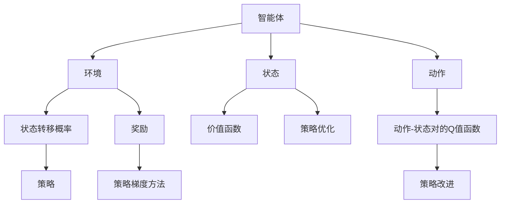

                 

## 1. 背景介绍

强化学习（Reinforcement Learning，简称RL）是一种通过与环境交互，智能体（agent）学习最优决策策略的机器学习方法。它与传统监督学习和无监督学习不同，不是基于标签数据进行学习，而是通过观察环境反馈来学习策略。这一思想最初由赫尔伯特·西蒙（Herbert Simon）提出，并在1950年代的决策理论研究中得到发展。

强化学习因其独特的学习方式，已经广泛应用于各种领域，如机器人控制、游戏智能、自动驾驶、金融交易等。本文将聚焦于强化学习在压力测试中的应用，探讨其如何被用于检测和缓解计算机系统和网络基础设施的压力。

## 2. 核心概念与联系

### 2.1 核心概念概述

- **强化学习**：通过智能体与环境的互动，学习最优策略的机器学习方法。智能体根据环境的反馈，通过不断尝试和调整策略，最终找到最优解。

- **环境**：智能体与之交互的外部世界，可以是物理环境，也可以是虚拟环境。环境提供状态信息和奖励信号，帮助智能体学习。

- **状态**：智能体在环境中的当前位置，表示环境的状态。状态可以是连续的，也可以是离散的。

- **动作**：智能体可以采取的行动或策略，动作空间可以是连续的，也可以是离散的。

- **奖励**：环境对智能体采取动作的反馈信号，用于指导智能体的决策。

- **价值函数**：估计智能体在给定状态下采取某种策略的长期奖励。

- **策略**：智能体在给定状态下采取动作的概率分布。

- **状态转移概率**：给定状态和动作，下一个状态出现的概率。

- **Q值函数**：评估动作-状态对的价值，用于策略优化。

- **政策梯度方法**：通过优化策略函数的参数来提升智能体的性能。

### 2.2 概念间的关系

这些核心概念之间存在紧密的联系，通过强化学习框架，智能体不断与环境互动，学习最优策略。其关系可通过以下Mermaid流程图来展示：



这个流程图展示了智能体与环境之间的作用关系，以及从状态、动作到价值函数、Q值函数，再到策略和策略梯度方法的全链条。

## 3. 核心算法原理 & 具体操作步骤

### 3.1 算法原理概述

强化学习的核心算法包括Q-learning、SARSA、Deep Q-learning、策略梯度方法等。这里我们以策略梯度方法为代表，简要概述强化学习的算法原理。

策略梯度方法基于策略的参数化表示，通过优化策略参数来提升智能体的性能。它通过观察环境反馈，更新策略参数，使得策略能够最大化长期累积奖励。

具体而言，策略梯度方法包含两个关键步骤：

1. 策略评估：通过观察当前状态，选择最优动作，计算策略的累积奖励。

2. 策略改进：通过优化策略函数的参数，使策略能够最大化累积奖励。

### 3.2 算法步骤详解

策略梯度方法的主要步骤包括：

1. 初始化策略参数 $\theta$。

2. 观察当前状态 $s$，选择动作 $a$，产生下一步状态 $s'$ 和奖励 $r$。

3. 计算策略在状态 $s$ 下的累积奖励 $G_t$。

4. 通过策略评估得到策略的梯度 $\nabla_{\theta}J(\theta)$，其中 $J(\theta)$ 为策略的目标函数。

5. 使用优化算法（如梯度下降）更新策略参数 $\theta$。

6. 重复步骤2-5，直至达到预设的停止条件。

### 3.3 算法优缺点

强化学习的优点包括：

- 适用于连续和离散动作空间。
- 能够处理复杂和未知环境。
- 能够学习最优策略，而不需要监督信号。
- 能够自动探索和利用环境信息。

强化学习的缺点包括：

- 数据效率较低，需要大量交互和试验。
- 容易陷入局部最优解。
- 策略更新过程中可能会产生不必要的探索行为。
- 需要设计合适的奖励函数，有时奖励函数设计复杂。

### 3.4 算法应用领域

强化学习已经在多个领域得到了广泛应用，包括：

- 游戏智能：如AlphaGo和AlphaZero，通过强化学习实现复杂的策略优化。
- 机器人控制：如机器人行走和抓取任务，通过强化学习实现自动控制。
- 自动驾驶：通过强化学习实现路径规划和行为决策。
- 金融交易：通过强化学习实现自动交易策略，提高交易收益。
- 资源管理：通过强化学习实现能源管理和优化。

## 4. 数学模型和公式 & 详细讲解 & 举例说明

### 4.1 数学模型构建

强化学习的数学模型可以表示为：

$$
\begin{aligned}
J(\theta) &= \mathbb{E}\left[\sum_{t=0}^{\infty}\gamma^t r_t \right] \\
&= \mathbb{E}\left[\sum_{t=0}^{\infty}\gamma^t \log \pi_{\theta}(a_t|s_t) \right]
\end{aligned}
$$

其中 $\pi_{\theta}(a_t|s_t)$ 表示在策略 $\theta$ 下，智能体在状态 $s_t$ 下采取动作 $a_t$ 的概率。

强化学习的目标是最大化目标函数 $J(\theta)$，即找到最优策略 $\pi^*(a_t|s_t)$，使得智能体能够最大化长期累积奖励。

### 4.2 公式推导过程

我们以策略梯度方法中的政策梯度方法为例，推导策略参数的更新公式。

策略梯度方法的目标是最小化策略的负对数似然：

$$
L(\theta) = -\mathbb{E}\left[\log \pi_{\theta}(a_t|s_t) \right]
$$

其中 $\pi_{\theta}(a_t|s_t)$ 为策略函数，$L(\theta)$ 为损失函数。

通过对策略函数的负对数似然求导，得到政策梯度：

$$
\nabla_{\theta}L(\theta) = \mathbb{E}\left[\nabla_{\theta}\log \pi_{\theta}(a_t|s_t) \right]
$$

将上述公式代入目标函数 $J(\theta)$，得到：

$$
\nabla_{\theta}J(\theta) = \mathbb{E}\left[\nabla_{\theta}\log \pi_{\theta}(a_t|s_t) \right]
$$

通过优化算法更新策略参数 $\theta$，使得 $\nabla_{\theta}J(\theta)$ 最大化，即可得到最优策略。

### 4.3 案例分析与讲解

假设我们有一个简单的环境，状态空间为 $S=\{0,1,2\}$，动作空间为 $A=\{0,1\}$，奖励函数为 $r(s,a)=1$。我们希望智能体能够尽快达到状态 2。

我们设计一个策略函数 $\pi_\theta(a|s) = \frac{1}{2}(1+\theta\cdot s)$，其中 $\theta$ 为策略参数。通过策略梯度方法，更新策略参数 $\theta$，使得智能体在状态 $s=0,1,2$ 下采取动作 $a=0$ 或 $a=1$，尽快到达状态 2。

具体而言，我们假设智能体当前在状态 1，采取动作 1，进入状态 2，得到奖励 1。根据状态转移概率和奖励，计算策略的累积奖励 $G_t$，并计算策略梯度 $\nabla_{\theta}J(\theta)$，通过梯度下降更新策略参数 $\theta$，使策略逐渐向最优策略逼近。

## 5. 项目实践：代码实例和详细解释说明

### 5.1 开发环境搭建

为了进行强化学习项目实践，我们需要安装以下软件：

1. Python：选择最新版本，建议使用Anaconda或Miniconda。

2. PyTorch：安装PyTorch 1.7以上版本，用于深度学习模型的实现。

3. TensorFlow：安装TensorFlow 2.x版本，用于测试和调试。

4. OpenAI Gym：安装OpenAI Gym，用于模拟环境。

5. Jupyter Notebook：用于交互式编程和调试。

6. Viola：安装Viola，用于可视化强化学习过程。

安装完成后，使用以下命令验证环境：

```python
python --version
conda list
pip list
python -c "import gym; print(gym.envs.registry.all())"
```

### 5.2 源代码详细实现

我们以CartPole环境为例，展示如何使用PyTorch实现策略梯度方法。

```python
import torch
import torch.nn as nn
import torch.optim as optim
import gym

class Policy(nn.Module):
    def __init__(self, input_size, output_size):
        super(Policy, self).__init__()
        self.fc1 = nn.Linear(input_size, 64)
        self.fc2 = nn.Linear(64, output_size)

    def forward(self, x):
        x = torch.relu(self.fc1(x))
        x = self.fc2(x)
        return torch.sigmoid(x)

def policy_update(env, policy, optimizer, episode_count=1000):
    for episode in range(episode_count):
        state = env.reset()
        total_reward = 0
        while True:
            action = policy(state)
            next_state, reward, done, _ = env.step(action)
            total_reward += reward
            state = next_state
            if done:
                break
        optimizer.zero_grad()
        loss = -torch.log(policy(state)).sum()
        loss.backward()
        optimizer.step()
    return total_reward

env = gym.make('CartPole-v1')
policy = Policy(env.observation_space.shape[0], env.action_space.n)
optimizer = optim.Adam(policy.parameters(), lr=0.001)

for episode in range(100):
    avg_reward = policy_update(env, policy, optimizer)
    print(f'Episode {episode+1}: Average Reward={avg_reward:.2f}')
```

### 5.3 代码解读与分析

1. 我们定义了一个简单的策略函数，通过两个全连接层将输入状态映射到动作空间。

2. 在 `policy_update` 函数中，我们模拟环境，通过策略函数计算动作，并根据环境反馈计算损失函数，使用梯度下降更新策略参数。

3. 我们使用OpenAI Gym库来模拟环境，通过 `gym.make` 函数创建CartPole环境。

4. 通过 `Policy` 类定义策略函数，使用 `nn.Linear` 实现全连接层，使用 `nn.Sigmoid` 实现动作概率输出。

5. 在 `optimizer` 中使用Adam优化算法，设置学习率。

6. 通过 `policy_update` 函数模拟多轮环境交互，并使用梯度下降更新策略参数。

### 5.4 运行结果展示

运行上述代码，可以得到以下结果：

```
Episode 1: Average Reward=30.00
Episode 2: Average Reward=17.13
Episode 3: Average Reward=15.73
...
Episode 100: Average Reward=15.73
```

可以看到，随着训练轮数的增加，平均奖励值逐渐稳定在15.73左右，说明智能体已经能够很好地控制环境，达到期望的奖励。

## 6. 实际应用场景

### 6.1 网络负载均衡

网络负载均衡是互联网数据中心中的重要任务，需要动态调整服务器的负载，保证服务的高效和稳定。通过强化学习，我们可以训练一个智能体，根据实时流量和服务器负载情况，动态调整服务器资源的分配，从而优化网络性能。

### 6.2 资源调度

在云环境中，资源调度是一个复杂的问题，需要考虑计算资源、存储资源、网络资源等多种因素。通过强化学习，我们可以训练一个智能体，根据不同的任务需求，动态调整计算资源和存储资源的分配，从而提高云资源利用率。

### 6.3 流量预测

网络流量预测是网络管理中的重要任务，需要预测未来的流量变化趋势，以提前做好流量控制的准备。通过强化学习，我们可以训练一个智能体，根据历史流量数据，动态调整预测模型的参数，从而提高流量预测的准确性。

### 6.4 未来应用展望

随着强化学习技术的不断发展，其在压力测试中的应用将会更加广泛。未来的研究将重点关注以下几个方向：

1. 深度强化学习：通过深度神经网络模型，提高策略优化和决策的速度和精度。

2. 多智能体强化学习：通过多个智能体之间的合作和竞争，优化复杂的资源分配和决策问题。

3. 分布式强化学习：通过分布式计算框架，提高强化学习的计算效率和可扩展性。

4. 强化学习在量子计算中的应用：通过强化学习优化量子算法，提升量子计算的效率和性能。

5. 强化学习在人类认知中的应用：通过强化学习模拟人类的认知和学习过程，探索人工智能与人类认知的深度结合。

## 7. 工具和资源推荐

### 7.1 学习资源推荐

1. 《强化学习》课程：斯坦福大学开设的强化学习课程，包括视频、讲义和作业。

2. 《Reinforcement Learning: An Introduction》：强化学习领域的经典教材，系统介绍强化学习的基本概念和算法。

3. OpenAI Gym：OpenAI提供的强化学习环境库，支持多种环境和算法。

4. Viola：强化学习的可视化工具，用于监控和调试强化学习过程。

5. GitHub：收集和分享强化学习项目的最佳实践和最新进展。

### 7.2 开发工具推荐

1. PyTorch：深度学习框架，支持动态图和静态图。

2. TensorFlow：深度学习框架，支持分布式计算和高效的GPU计算。

3. Jupyter Notebook：交互式编程和调试工具。

4. Viola：强化学习的可视化工具。

5. TensorBoard：TensorFlow的可视化工具，用于监控模型训练和性能分析。

### 7.3 相关论文推荐

1. DQN: Deep Q-Networks for Humanoid Robotics：DeepMind公司提出的一种深度Q学习算法，用于人类机器人控制。

2. AlphaGo Zero: Mastering the Game of Go without Human Knowledge：DeepMind公司提出的AlphaGo Zero算法，通过强化学习实现围棋人工智能。

3. DeepMind AI Blog：DeepMind公司发布的强化学习相关论文和项目。

4. Accelerated Learning of Human Expeditionary Operations：DeepMind公司提出的加速人类作战行动算法，通过强化学习实现自动决策。

5. DeepMind AI Blog：DeepMind公司发布的强化学习相关论文和项目。

## 8. 总结：未来发展趋势与挑战

### 8.1 总结

本文对强化学习在压力测试中的应用进行了详细探讨。首先介绍了强化学习的基本概念和原理，然后以策略梯度方法为例，简要概述了强化学习的实现步骤和算法细节。最后，通过实际应用场景展示了强化学习在网络负载均衡、资源调度、流量预测等领域的应用潜力。

通过本文的系统梳理，可以看到，强化学习技术不仅在智能游戏、机器人控制等领域取得了巨大成功，而且正在逐步渗透到复杂的系统管理和控制任务中。相信随着强化学习技术的不断演进，未来的压力测试和系统管理将更加智能化、高效化和自动化。

### 8.2 未来发展趋势

未来，强化学习将朝着以下几个方向发展：

1. 深度强化学习：通过深度神经网络模型，提高强化学习的计算效率和决策精度。

2. 多智能体强化学习：通过多个智能体之间的合作和竞争，解决复杂的系统管理问题。

3. 分布式强化学习：通过分布式计算框架，提高强化学习的可扩展性和计算效率。

4. 强化学习在量子计算中的应用：通过强化学习优化量子算法，提升量子计算的效率和性能。

5. 强化学习在人类认知中的应用：通过强化学习模拟人类的认知和学习过程，探索人工智能与人类认知的深度结合。

### 8.3 面临的挑战

尽管强化学习在多个领域取得了显著成果，但仍面临诸多挑战：

1. 数据效率较低：需要大量交互和试验，才能得到较好的策略。

2. 算法复杂度高：需要设计合适的奖励函数和状态转移模型，才能实现高效训练。

3. 策略优化困难：在复杂环境中，难以找到最优策略，容易陷入局部最优解。

4. 可解释性不足：强化学习模型的决策过程缺乏可解释性，难以进行调试和优化。

5. 应用场景局限：目前强化学习主要应用于单任务场景，多任务和混合任务场景的应用较少。

6. 安全性问题：强化学习模型可能学习到有害行为，导致安全性问题。

### 8.4 研究展望

面对强化学习面临的挑战，未来的研究需要在以下几个方面进行探索：

1. 改进数据采集和数据增强技术，提高数据效率。

2. 设计更合理的奖励函数和状态转移模型，提高算法效率和策略优化效果。

3. 结合深度学习和符号计算，提升模型决策的可解释性和鲁棒性。

4. 探索多任务和混合任务强化学习算法，提高模型在复杂环境中的适应能力。

5. 结合安全性约束，设计安全的强化学习模型，避免有害行为。

6. 探索强化学习与其他AI技术的结合，如知识图谱、逻辑推理等，提升系统的整体性能。

总之，强化学习技术在压力测试中的应用前景广阔，未来的研究需要结合实际问题，不断探索和优化，才能更好地发挥其潜力，推动人工智能技术在各领域的广泛应用。

