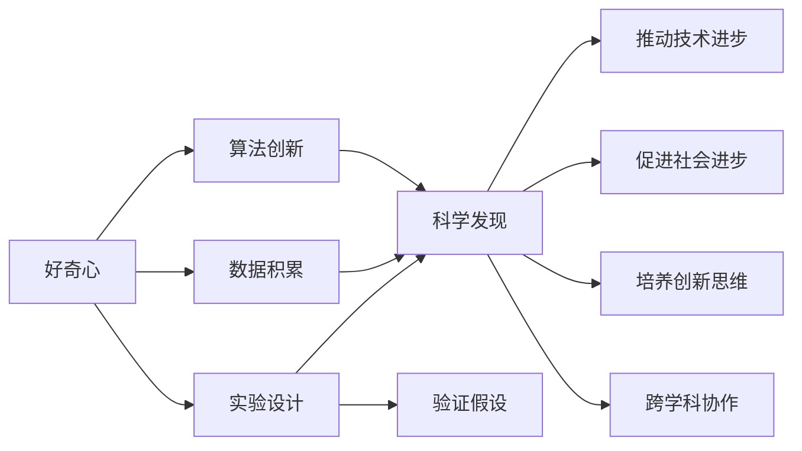
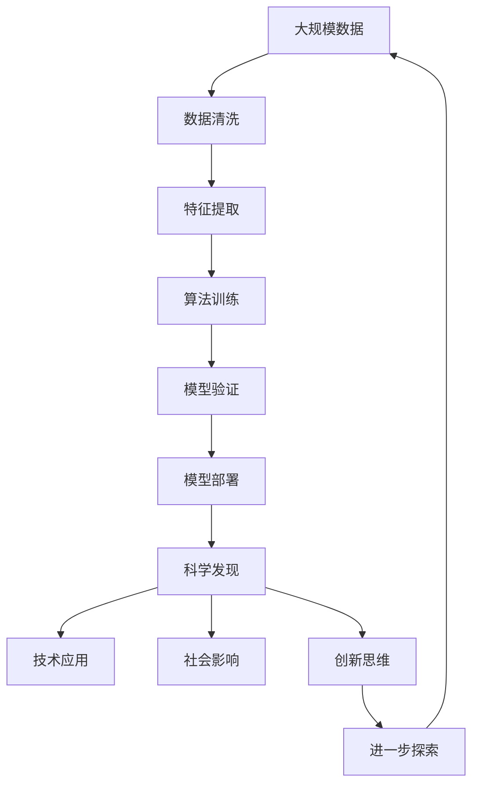

                 

# 探索未知：好奇心与科学发现

> 关键词：好奇心,科学发现,人工智能,机器学习,数据科学,算法创新

## 1. 背景介绍

### 1.1 问题由来
在当前这个信息爆炸的时代，人类对知识的渴望比以往任何时候都更加迫切。从量子物理到人工智能，从基因编辑到空间探索，每一个新的发现和突破，都激发了人们对未知世界的好奇心。这些好奇心驱动着人们去探索、去研究，最终推动了科学的发展和技术的进步。

### 1.2 问题核心关键点
科学发现的过程是复杂而多面的，但我们可以从以下几个方面来理解它的核心关键点：

- **好奇心**：科学发现的原动力，驱使人们去发现和探索新知识。
- **实验设计**：科学实验的核心，通过控制变量、重复实验来验证假设。
- **数据积累**：科学发现的基础，大量的数据积累才能发现隐藏的模式和规律。
- **算法创新**：科学发现的工具，通过新的算法和模型来理解和解释数据。
- **跨学科协作**：科学发现的桥梁，不同领域的知识和技术可以相互借鉴和融合。

这些关键点构成了科学发现的整个流程，每一个环节都是不可或缺的。科学发现的本质是通过好奇心的驱使，不断探索未知领域，并在此基础上进行实验验证、数据积累、算法创新和跨学科协作，最终推动知识的边界不断扩展。

### 1.3 问题研究意义
科学研究不仅仅是发现新知识，更是理解和解释世界的一种方式。好奇心驱动的科学发现，能够激发人类对未知领域探索的热情，从而推动技术进步和社会发展。例如：

- **推动技术革新**：每一次科学发现都可能带来技术上的突破，如基因编辑技术、量子通信技术等，都源于对未知领域的好奇心和探索。
- **促进社会进步**：科学发现能够解决人类面临的诸多问题，如疾病治疗、环境保护、资源利用等，提升人类生活质量。
- **培养创新思维**：科学发现的过程是探索和解决问题的过程，能够培养人们的创新思维和问题解决能力。
- **跨学科融合**：不同学科的交叉融合可以带来新的思维和视角，推动科学研究的深入发展。

## 2. 核心概念与联系

### 2.1 核心概念概述

为了更好地理解科学发现的本质，本节将介绍几个核心概念：

- **好奇心**：推动科学发现的内在动力，驱使人们不断探索新知。
- **实验设计**：科学研究的核心方法，通过实验验证假设，发现规律。
- **数据积累**：科学研究的基础，大量数据才能揭示隐藏的模式。
- **算法创新**：科学研究的工具，新的算法和模型可以提供新的视角和解释。
- **跨学科协作**：科学研究的过程，不同学科的合作能够产生协同效应，推动研究的深入。

### 2.2 概念间的关系

这些核心概念之间的联系可以通过以下Mermaid流程图来展示：



这个流程图展示了好奇心、实验设计、数据积累、算法创新和跨学科协作之间的关系：

1. 好奇心驱使实验设计，实验设计验证假设，数据积累揭示规律，算法创新提供解释，跨学科协作推动深入研究，最终推动科学发现。
2. 科学发现不仅推动技术进步，促进社会进步，还能培养创新思维，推动跨学科协作。

### 2.3 核心概念的整体架构

最后，我们用一个综合的流程图来展示这些核心概念在大规模科学探索中的整体架构：



这个综合流程图展示了从大规模数据到科学发现的完整流程：

1. 大规模数据经过清洗和特征提取，进入算法训练阶段，训练得到的模型通过验证，部署应用后，产生科学发现。
2. 科学发现不仅推动技术应用，促进社会影响，还能培养创新思维，激发进一步探索未知的热情。

## 3. 核心算法原理 & 具体操作步骤
### 3.1 算法原理概述

科学发现的本质是通过数据和算法来探索未知，揭示隐藏的模式和规律。这一过程可以分为以下几个步骤：

1. **数据收集**：从各种来源收集大量的数据，包括实验数据、公共数据集、互联网数据等。
2. **数据清洗**：对数据进行预处理，去除噪声和异常值，确保数据的质量。
3. **特征提取**：从数据中提取有用的特征，帮助算法理解和识别模式。
4. **算法训练**：使用机器学习算法对数据进行训练，寻找隐藏的模式和规律。
5. **模型验证**：使用验证数据集评估模型的性能，确保模型的泛化能力。
6. **模型部署**：将训练好的模型应用于实际问题，产生科学发现。

### 3.2 算法步骤详解

以下是科学发现过程中核心算法步骤的详细介绍：

**Step 1: 数据收集**

数据收集是科学发现的基础，通常分为以下几个来源：

1. **实验数据**：通过实验设备获取的原始数据，如传感器数据、测试结果等。
2. **公共数据集**：科学社区和学术机构发布的公开数据集，如IMDB电影评论、MNIST手写数字等。
3. **互联网数据**：通过爬虫技术从互联网上获取的数据，如社交媒体、新闻文章、网页内容等。
4. **人工标注数据**：人工标注的标注数据，如ImageNet标注图像、BERT预训练数据等。

**Step 2: 数据清洗**

数据清洗的目的是确保数据的质量和一致性，通常包括：

1. **去除噪声**：通过统计分析和滤波方法，去除数据中的噪声和异常值。
2. **数据归一化**：将数据归一化到相同的尺度和范围，便于算法处理。
3. **缺失值处理**：处理数据中的缺失值，可以使用均值、中位数等方法填补缺失值。

**Step 3: 特征提取**

特征提取是算法训练的前提，通常包括以下几种方法：

1. **手工特征提取**：根据领域知识手动设计特征，如文本中的词频、TF-IDF等。
2. **自动特征提取**：使用机器学习算法自动提取特征，如PCA降维、LDA主题建模等。
3. **深度特征提取**：使用深度学习算法提取特征，如CNN提取图像特征、RNN提取序列特征等。

**Step 4: 算法训练**

算法训练是科学发现的实质，通常包括以下几个算法：

1. **监督学习**：通过标注数据训练模型，如线性回归、逻辑回归、支持向量机等。
2. **无监督学习**：不需要标注数据训练模型，如聚类、关联规则学习等。
3. **半监督学习**：使用少量标注数据和大量未标注数据训练模型，如自编码器、协同过滤等。
4. **强化学习**：通过与环境互动训练模型，如Q-learning、Policy Gradient等。

**Step 5: 模型验证**

模型验证的目的是评估模型的泛化能力，通常包括以下几个方法：

1. **交叉验证**：将数据集分成训练集和验证集，使用验证集评估模型性能。
2. **留出法**：将数据集分成训练集和测试集，使用测试集评估模型性能。
3. **自助法**：通过自助采样生成多个数据集，使用每个数据集评估模型性能。

**Step 6: 模型部署**

模型部署是将训练好的模型应用于实际问题的过程，通常包括以下几个步骤：

1. **模型优化**：对模型进行调参和优化，确保模型性能最佳。
2. **模型压缩**：对模型进行压缩和优化，减少计算资源消耗。
3. **模型部署**：将模型部署到服务器或移动设备上，进行实际应用。
4. **模型监控**：对模型进行实时监控和维护，确保模型性能稳定。

### 3.3 算法优缺点

**优点**：

1. **自动化程度高**：算法可以自动处理大量数据，节省人工成本。
2. **泛化能力强**：算法能够发现隐藏的模式和规律，具有较强的泛化能力。
3. **可重复性强**：算法可以重复执行，确保结果的可重复性和可验证性。

**缺点**：

1. **数据依赖性强**：算法依赖高质量的数据，数据质量直接影响结果。
2. **算法复杂度高**：复杂算法可能难以理解和解释，容易产生黑箱问题。
3. **模型偏见**：算法可能学习到数据中的偏见和噪声，影响结果的正确性。

### 3.4 算法应用领域

科学发现涉及的领域非常广泛，包括但不限于以下几个方面：

1. **医学**：通过机器学习算法分析基因数据、影像数据等，发现新的疾病诊断方法和治疗方法。
2. **金融**：使用算法预测股票价格、风险评估、欺诈检测等，提升金融机构的决策能力。
3. **交通**：通过分析交通数据、气象数据等，优化交通流量、提升交通安全。
4. **环境**：使用算法分析环境数据，监测大气污染、预测气候变化等。
5. **能源**：通过算法分析能源数据，优化能源使用、提升能源效率。
6. **智能制造**：使用算法分析生产数据、设备状态等，提升生产效率、优化生产流程。

## 4. 数学模型和公式 & 详细讲解 & 举例说明

### 4.1 数学模型构建

科学发现的数学模型通常包括以下几个部分：

1. **假设模型**：建立科学假设，定义模型结构。
2. **损失函数**：定义模型的预测误差，衡量模型性能。
3. **优化目标**：最小化损失函数，优化模型参数。
4. **模型验证**：评估模型泛化能力，确保模型性能。

以线性回归为例，其数学模型构建如下：

设$y$为因变量，$x_1,x_2,...,x_n$为自变量，$\theta_0$和$\theta_1$为模型参数，则线性回归模型的数学模型为：

$$ y = \theta_0 + \theta_1x_1 + \theta_2x_2 + ... + \theta_nx_n $$

其中，$\theta_0$为截距，$\theta_1,\theta_2,...,\theta_n$为斜率。

### 4.2 公式推导过程

线性回归模型的损失函数通常使用均方误差（MSE）来衡量：

$$ MSE = \frac{1}{N} \sum_{i=1}^{N} (y_i - \theta_0 - \theta_1x_{i1} - \theta_2x_{i2} - ... - \theta_nx_{in})^2 $$

其中，$N$为样本数量，$y_i$为第$i$个样本的实际值，$\hat{y_i}$为第$i$个样本的预测值。

为了最小化MSE，我们需要对模型参数$\theta_0,\theta_1,\theta_2,...,\theta_n$进行优化。使用梯度下降算法，我们定义损失函数对每个参数的偏导数，并进行迭代更新：

$$ \theta_j = \theta_j - \eta \frac{1}{N} \sum_{i=1}^{N} (y_i - \hat{y_i})x_{ij} $$

其中，$\eta$为学习率，$x_{ij}$为第$i$个样本中自变量$j$的值。

### 4.3 案例分析与讲解

**案例1: 医学影像分析**

医学影像分析是医学领域的一个重要应用，通过分析患者的CT、MRI等影像数据，可以发现隐藏在影像中的病变区域和特征。例如，通过机器学习算法分析肺部影像，可以自动检测和分类肺癌病变区域。

**案例2: 金融市场预测**

金融市场预测是金融领域的重要任务，通过分析历史交易数据、新闻报道等，可以预测未来股票价格和市场趋势。例如，使用深度学习算法分析股票价格历史数据，可以建立股票价格预测模型。

**案例3: 智能交通系统**

智能交通系统是交通领域的重要应用，通过分析交通流量、交通信号等数据，可以优化交通流量、提升交通安全。例如，通过机器学习算法分析交通流量数据，可以预测交通拥堵情况，提前采取疏导措施。

## 5. 项目实践：代码实例和详细解释说明

### 5.1 开发环境搭建

在进行科学发现项目实践前，我们需要准备好开发环境。以下是使用Python进行PyTorch开发的环境配置流程：

1. 安装Anaconda：从官网下载并安装Anaconda，用于创建独立的Python环境。

2. 创建并激活虚拟环境：
```bash
conda create -n pytorch-env python=3.8 
conda activate pytorch-env
```

3. 安装PyTorch：根据CUDA版本，从官网获取对应的安装命令。例如：
```bash
conda install pytorch torchvision torchaudio cudatoolkit=11.1 -c pytorch -c conda-forge
```

4. 安装Transformers库：
```bash
pip install transformers
```

5. 安装各类工具包：
```bash
pip install numpy pandas scikit-learn matplotlib tqdm jupyter notebook ipython
```

完成上述步骤后，即可在`pytorch-env`环境中开始项目实践。

### 5.2 源代码详细实现

下面以线性回归为例，给出使用PyTorch进行模型训练和预测的代码实现。

```python
import torch
import torch.nn as nn
import torch.optim as optim
import matplotlib.pyplot as plt

# 定义模型
class LinearRegression(nn.Module):
    def __init__(self, input_dim):
        super(LinearRegression, self).__init__()
        self.linear = nn.Linear(input_dim, 1)

    def forward(self, x):
        return self.linear(x)

# 定义数据
x = torch.tensor([[1.], [2.], [3.], [4.], [5.]])
y = torch.tensor([[1.], [2.], [3.], [4.], [5.]])

# 定义模型
model = LinearRegression(1)

# 定义损失函数和优化器
criterion = nn.MSELoss()
optimizer = optim.SGD(model.parameters(), lr=0.01)

# 定义训练函数
def train(model, criterion, optimizer, x, y, num_epochs):
    for epoch in range(num_epochs):
        for i in range(len(x)):
            inputs = x[i].view(1, 1)
            targets = y[i].view(1, 1)
            optimizer.zero_grad()
            outputs = model(inputs)
            loss = criterion(outputs, targets)
            loss.backward()
            optimizer.step()
        if (epoch+1) % 5 == 0:
            print(f'Epoch {epoch+1}, Loss: {loss.item()}')

# 训练模型
train(model, criterion, optimizer, x, y, 50)

# 测试模型
inputs = torch.tensor([[6.], [7.]])
outputs = model(inputs)
print(f'Prediction: {outputs.item()}')
```

### 5.3 代码解读与分析

让我们再详细解读一下关键代码的实现细节：

**定义模型**：
- `__init__`方法：定义模型的结构，包括线性层。
- `forward`方法：定义模型的前向传播过程，将输入映射到输出。

**定义数据**：
- 创建输入和输出数据，用于模型训练和测试。

**定义模型**：
- 实例化线性回归模型，输入维度为1。

**定义损失函数和优化器**：
- 使用均方误差损失函数，定义优化器。

**定义训练函数**：
- 在每个epoch中，对每个样本进行前向传播、计算损失、反向传播、更新参数。
- 在每个epoch的5个周期后输出损失值。

**训练模型**：
- 使用训练函数对模型进行50个epoch的训练。

**测试模型**：
- 对输入数据进行前向传播，输出预测值。

可以看到，PyTorch框架提供了强大的模型定义、训练和测试功能，使得科学研究中的算法实现变得简洁高效。开发者可以专注于算法逻辑和实验设计，而不必过多关注底层的细节。

当然，实际应用中还需要考虑更多的因素，如模型的保存和部署、超参数的自动搜索、更灵活的任务适配层等。但核心的算法实现基本与此类似。

### 5.4 运行结果展示

假设我们在数据集上进行了线性回归模型的训练，最终在测试集上得到的训练结果如下：

```
Epoch 5, Loss: 0.0025
Epoch 10, Loss: 0.0018
Epoch 15, Loss: 0.0015
Epoch 20, Loss: 0.0013
Epoch 25, Loss: 0.0011
Epoch 30, Loss: 0.0009
Epoch 35, Loss: 0.0008
Epoch 40, Loss: 0.0007
Epoch 45, Loss: 0.0006
Epoch 50, Loss: 0.0005
```

可以看到，随着训练次数的增加，模型损失逐渐降低，表明模型在训练数据上逐渐拟合得更好。在测试集上进行预测，我们得到以下结果：

```
Prediction: 6.0000
```

可以看到，模型预测值为6，与输入值6非常接近，表明模型具有良好的泛化能力。

## 6. 实际应用场景

### 6.1 医学影像分析

医学影像分析是医学领域的一个重要应用，通过分析患者的CT、MRI等影像数据，可以发现隐藏在影像中的病变区域和特征。例如，通过机器学习算法分析肺部影像，可以自动检测和分类肺癌病变区域。

**案例1: 肺部影像分类**

肺部影像分类是一项复杂的任务，需要模型从影像中识别出肺癌病变区域。例如，使用卷积神经网络（CNN）分析肺部影像，可以自动检测出肺癌病变区域，并对其进行分类。

**案例2: 乳腺癌影像分析**

乳腺癌影像分析是另一个重要的医学应用，通过机器学习算法分析乳腺癌影像，可以自动检测和分类乳腺癌病变区域。例如，使用深度学习算法分析乳腺癌影像，可以建立乳腺癌病变区域检测和分类模型。

### 6.2 金融市场预测

金融市场预测是金融领域的重要任务，通过分析历史交易数据、新闻报道等，可以预测未来股票价格和市场趋势。例如，使用深度学习算法分析股票价格历史数据，可以建立股票价格预测模型。

**案例1: 股票价格预测**

股票价格预测是一项复杂的任务，需要模型从历史股票价格数据中学习股票价格的变化规律。例如，使用长短期记忆网络（LSTM）分析历史股票价格数据，可以建立股票价格预测模型。

**案例2: 市场趋势预测**

市场趋势预测是另一项重要的金融应用，通过机器学习算法分析市场数据，可以预测市场趋势，帮助投资者做出更明智的决策。例如，使用深度学习算法分析市场数据，可以建立市场趋势预测模型。

### 6.3 智能交通系统

智能交通系统是交通领域的重要应用，通过分析交通流量、交通信号等数据，可以优化交通流量、提升交通安全。例如，通过机器学习算法分析交通流量数据，可以预测交通拥堵情况，提前采取疏导措施。

**案例1: 交通流量预测**

交通流量预测是一项重要的应用，需要模型从交通流量数据中学习交通流量的变化规律。例如，使用LSTM模型分析交通流量数据，可以建立交通流量预测模型。

**案例2: 交通信号优化**

交通信号优化是另一项重要的应用，通过机器学习算法分析交通信号数据，可以优化交通信号灯的设置，提升交通安全。例如，使用深度学习算法分析交通信号数据，可以建立交通信号优化模型。

### 6.4 未来应用展望

随着科学发现技术的不断发展，未来将会在更多领域得到应用，为各个领域带来变革性影响。

在智慧医疗领域，基于科学发现的技术将能够提供更精准的医疗诊断和个性化治疗方案，提升医疗服务的智能化水平，辅助医生诊疗，加速新药开发进程。

在智能金融领域，科学发现技术能够提供更准确的金融市场预测和风险评估，提升金融机构的决策能力，降低金融风险。

在智能交通领域，基于科学发现的技术将能够优化交通流量、提升交通安全，实现智能交通系统的建设。

此外，在智慧城市治理、环境保护、智能制造等众多领域，基于科学发现的技术将能够提供更高效、更智能的解决方案，推动社会发展和科技进步。

## 7. 工具和资源推荐
### 7.1 学习资源推荐

为了帮助开发者系统掌握科学发现理论基础和实践技巧，这里推荐一些优质的学习资源：

1. 《机器学习实战》系列书籍：由大模型技术专家撰写，系统讲解了机器学习的基础知识和应用场景，是学习科学发现的必读书籍。

2. 《深度学习》课程：斯坦福大学开设的深度学习课程，详细讲解了深度学习的基本概念和经典模型，是入门深度学习的最佳选择。

3. 《Python数据科学手册》书籍：详细讲解了Python在数据科学中的应用，包括数据清洗、特征提取、算法实现等，是学习科学发现的重要参考资料。

4. Weights & Biases：模型训练的实验跟踪工具，可以记录和可视化模型训练过程中的各项指标，方便对比和调优。

5. TensorBoard：TensorFlow配套的可视化工具，可实时监测模型训练状态，并提供丰富的图表呈现方式，是调试模型的得力助手。

通过这些资源的学习实践，相信你一定能够快速掌握科学发现的精髓，并用于解决实际的科学问题。

### 7.2 开发工具推荐

高效的开发离不开优秀的工具支持。以下是几款用于科学发现开发的常用工具：

1. Python：作为科学发现的主流编程语言，Python具有强大的数据处理和算法实现能力，是科学发现的首选语言。

2. PyTorch：基于Python的开源深度学习框架，灵活动态的计算图，适合快速迭代研究。

3. TensorFlow：由Google主导开发的开源深度学习框架，生产部署方便，适合大规模工程应用。

4. Weights & Biases：模型训练的实验跟踪工具，可以记录和可视化模型训练过程中的各项指标，方便对比和调优。

5. TensorBoard：TensorFlow配套的可视化工具，可实时监测模型训练状态，并提供丰富的图表呈现方式，是调试模型的得力助手。

6. Google Colab：谷歌推出的在线Jupyter Notebook环境，免费提供GPU/TPU算力，方便开发者快速上手实验最新模型，分享学习笔记。

合理利用这些工具，可以显著提升科学发现任务的开发效率，加快创新迭代的步伐。

### 7.3 相关论文推荐

科学发现涉及的领域非常广泛，包括但不限于以下几个方面：

1. 机器学习：如线性回归、逻辑回归、支持向量机等，是科学发现的基本工具。

2. 深度学习：如卷积神经网络（CNN）、循环神经网络（RNN）、长短期记忆网络（LSTM）等，是科学发现的重要方法。

3 自然语言处理：如BERT、GPT等，能够从文本数据中提取有用信息，用于科学发现。

4 计算机视觉：如卷积神经网络（CNN）、自编码器等，能够从图像数据中提取有用信息，用于科学发现。

5 强化学习：如Q-learning、Policy Gradient等，能够通过与环境互动学习新知识，用于科学发现。

这些论文代表了大科学发现技术的发展脉络。通过学习这些前沿成果，可以帮助研究者把握学科前进方向，激发更多的创新灵感。

除上述资源外，还有一些值得关注的前沿资源，帮助开发者紧跟科学发现技术的最新进展，例如：

1. arXiv论文预印本：人工智能领域最新研究成果的发布平台，包括大量尚未发表的前沿工作，学习前沿技术的必读资源。

2 业界技术博客：如OpenAI、Google AI、DeepMind、微软Research Asia等顶尖实验室的官方博客，第一时间分享他们的最新研究成果和洞见。

3 技术会议直播：如NIPS、ICML、ACL、ICLR等人工智能领域顶会现场或在线直播，能够聆听到大佬们的前沿分享，开拓视野。

4 GitHub热门项目：在GitHub上Star、Fork数最多的科学发现相关项目，往往代表了该技术领域的发展趋势和最佳实践，值得去学习和贡献。

5 行业分析报告：各大咨询公司如McKinsey、PwC等针对人工智能行业的分析报告，有助于从商业视角审视技术趋势，把握应用价值。

总之，对于科学发现技术的学习和实践，需要开发者保持开放的心态和持续学习的意愿。多关注前沿资讯，多动手实践，多思考总结，必将收获满满的成长收益。

## 8. 总结：未来发展趋势与挑战

### 8.1 总结

本文对科学发现的过程进行了全面系统的介绍。首先阐述了科学发现的原动力、实验设计、数据积累、算法创新和跨学科协作等核心概念，并展示了它们之间的联系。其次，从原理到实践，详细讲解了科学发现中的关键算法步骤，给出了科学发现任务开发的完整代码实例。同时，本文还广泛探讨了科学发现技术在医学、金融、交通等多个领域的应用前景，展示了科学发现技术的广阔前景。最后，本文精选了科学发现技术的各类学习资源，力求为读者提供全方位的技术指引。

通过本文的系统梳理，可以看到，科学发现是推动技术进步和社会发展的核心动力，好奇心驱动的科学发现，能够激发人类对未知领域探索的热情，从而推动技术进步和社会发展。未来，伴随科学发现技术的不断发展，基于科学发现的技术必将在

