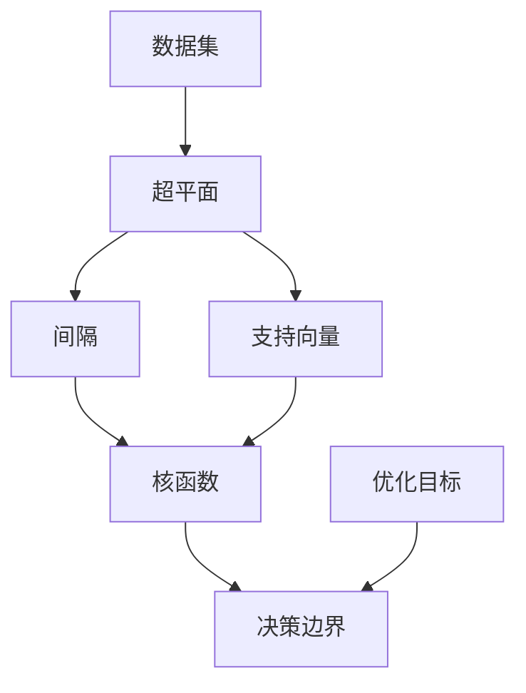
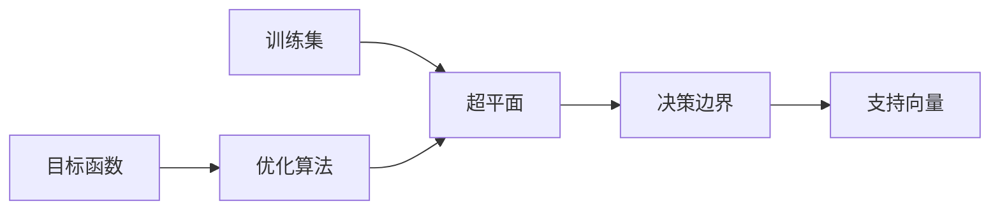
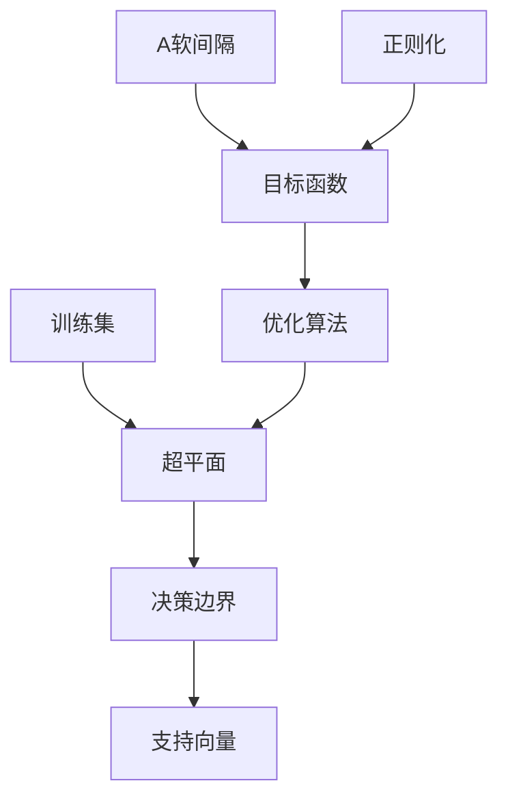
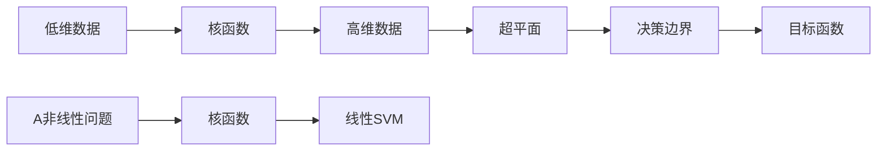

                 

# 支持向量机 (Support Vector Machines, SVM) 原理与代码实例讲解

## 1. 背景介绍

### 1.1 问题由来
支持向量机（Support Vector Machine, SVM）是一种广泛应用于分类、回归、序列标注等机器学习任务的强大算法。自20世纪90年代由Cortes和Vapnik提出以来，SVM凭借其在解决小样本、非线性以及高维模式识别中表现出众的性能，成为了机器学习领域的热门研究方向。SVM的核心思想是构造一个超平面（Hyperplane），将数据分为不同的类别，从而实现分类或回归等任务。本文将从原理出发，详细介绍SVM的核心思想、算法流程、优缺点、应用领域，并通过实际代码实例，帮助读者更好地理解和使用SVM。

### 1.2 问题核心关键点
SVM的核心思想是在特征空间中，找到一个最优超平面（Maximal Margin Hyperplane），使得不同类别的数据点被分开，且该超平面与最近的数据点的距离（Margin）最大化。SVM的优化目标是最小化间隔（Margin）的同时最大化超平面的距离，这一目标通过凸二次规划（Convex Quadratic Programming）问题求解。SVM的核心算法包括线性SVM、非线性SVM、核函数、多分类等，并结合软间隔、正则化、核技巧等技术，使SVM在处理各种实际问题时具有极高的准确性和鲁棒性。

## 2. 核心概念与联系

### 2.1 核心概念概述
- **超平面（Hyperplane）**：在高维空间中，将不同类别的数据点分开的线性平面。
- **间隔（Margin）**：超平面两侧的最近数据点到超平面的距离。
- **支持向量（Support Vector）**：位于超平面上或两侧的最近数据点。
- **核函数（Kernel Function）**：将低维数据映射到高维空间的函数，使得非线性问题可以转化为线性问题。
- **软间隔（Soft Margin）**：允许存在一定数量的数据点错误分类的优化目标，以处理噪声数据。
- **正则化（Regularization）**：通过对超平面复杂度进行惩罚，防止模型过拟合。
- **多分类（Multi-Class）**：通过组合多个二分类器，处理多类别分类问题。

这些概念构成了SVM算法的核心，并通过数学模型和算法流程进行了系统化的表达。以下将通过一个简化的流程图展示这些概念之间的联系：



这个流程图展示了数据集、超平面、间隔、支持向量、核函数、决策边界和优化目标之间的关系。其中，超平面用于分隔不同类别的数据点，间隔表示超平面两侧的最近数据点到超平面的距离，支持向量定义了超平面的位置，核函数用于非线性映射，决策边界用于分类或回归的最终结果，优化目标用于求解超平面的最优位置。

### 2.2 概念间的关系

这些核心概念之间存在着紧密的联系，形成了SVM算法的整体架构。以下通过几个简化的流程图进一步展示这些概念之间的联系：

#### 2.2.1 SVM学习过程


这个流程图展示了训练集、超平面、决策边界、支持向量和目标函数之间的关系。训练集用于学习超平面，决策边界用于分类或回归的最终结果，支持向量定义了超平面的位置，目标函数用于求解超平面的最优位置，优化算法用于迭代求解目标函数。

#### 2.2.2 软间隔与正则化


这个流程图展示了训练集、超平面、决策边界、支持向量、目标函数、优化算法、软间隔和正则化之间的关系。训练集用于学习超平面，决策边界用于分类或回归的最终结果，支持向量定义了超平面的位置，目标函数用于求解超平面的最优位置，优化算法用于迭代求解目标函数，软间隔用于处理噪声数据，正则化用于防止模型过拟合。

#### 2.2.3 核函数的应用


这个流程图展示了低维数据、核函数、高维数据、超平面、决策边界、目标函数、非线性问题和核函数之间的关系。低维数据通过核函数映射到高维空间，使得非线性问题可以转化为线性问题，超平面用于分隔不同类别的数据点，决策边界用于分类或回归的最终结果，目标函数用于求解超平面的最优位置，非线性问题通过核函数和线性SVM解决。

## 3. 核心算法原理 & 具体操作步骤
### 3.1 算法原理概述
SVM的核心思想是通过构造一个最优超平面，将数据分为不同的类别，使得不同类别的数据点到超平面的距离最大化。在特征空间中，SVM通过最大化间隔（Margin）来找到最优超平面。该算法通常分为线性SVM和非线性SVM两种，其中线性SVM用于处理线性可分问题，非线性SVM通过核技巧处理非线性问题。

SVM的优化目标为最小化间隔的同时最大化超平面的距离。具体来说，对于线性可分的数据集，优化目标为：

$$
\min_{w,b} \frac{1}{2} \|w\|^2 + C\sum_{i=1}^{N} \max(0, 1 - y_i(w^T x_i + b))
$$

其中 $w$ 和 $b$ 分别是超平面的权重和偏置，$y_i$ 是数据点的类别标签，$x_i$ 是数据点的特征向量，$C$ 是正则化参数，控制模型的复杂度。优化目标可以通过拉格朗日乘子法转化为对偶问题求解，从而避免直接处理原始数据集的复杂性。

### 3.2 算法步骤详解
SVM的算法步骤主要包括以下几个关键步骤：

1. **数据预处理**：将原始数据转换为特征向量，并进行归一化处理。
2. **构建核函数**：根据数据特征，选择合适的核函数。
3. **构建优化目标**：根据数据类别，构建SVM的优化目标。
4. **求解对偶问题**：通过拉格朗日乘子法，求解对偶问题，找到最优超平面。
5. **模型预测**：通过决策边界对新数据进行分类或回归预测。

具体步骤如下：

1. **数据预处理**：
   - 对于线性可分问题，使用线性SVM即可。
   - 对于非线性问题，可以使用核函数将数据映射到高维空间，使得问题变为线性可分。
   - 特征向量需要进行归一化处理，以避免某些特征对模型的影响过大。

2. **构建核函数**：
   - 常见的核函数包括线性核、多项式核、径向基函数（RBF）核等。
   - 核函数的选择应该根据数据特征和任务类型进行优化。

3. **构建优化目标**：
   - 对于线性可分问题，构建线性SVM的优化目标。
   - 对于非线性问题，使用核函数将数据映射到高维空间，并构建非线性SVM的优化目标。

4. **求解对偶问题**：
   - 通过拉格朗日乘子法，求解对偶问题，找到最优超平面。
   - 拉格朗日乘子法的求解可以通过各种优化算法实现，如SMO（Sequential Minimal Optimization）算法。

5. **模型预测**：
   - 通过决策边界对新数据进行分类或回归预测。
   - 决策边界可以是线性边界或非线性边界，具体取决于数据特征和核函数。

### 3.3 算法优缺点
#### 优点
1. **高效性**：SVM算法在高维空间中表现优异，能够处理大规模数据集。
2. **鲁棒性**：SVM算法对噪声和异常值具有较好的鲁棒性，能够处理噪声数据。
3. **可解释性**：SVM算法通过寻找最优超平面，具有较好的可解释性，能够解释模型的分类依据。
4. **适用性**：SVM算法适用于各种分类和回归任务，能够处理高维数据和非线性问题。

#### 缺点
1. **参数敏感性**：SVM算法中的正则化参数和核函数参数需要仔细调参，才能得到理想结果。
2. **计算复杂度**：SVM算法需要求解二次规划问题，计算复杂度较高，特别是在高维空间中。
3. **可扩展性**：SVM算法在大规模数据集上的扩展性较差，需要较高的计算资源。
4. **核函数选择困难**：选择合适的核函数是SVM算法的关键，但核函数的选择需要结合数据特征进行优化。

### 3.4 算法应用领域
SVM算法广泛应用于各种分类和回归任务，特别是在处理高维数据和非线性问题时表现优异。以下是SVM算法的一些主要应用领域：

- **分类问题**：SVM算法可以用于图像分类、文本分类、医疗诊断等任务，能够处理高维数据和非线性问题。
- **回归问题**：SVM算法可以用于房价预测、股票价格预测、金融风险评估等任务，能够处理高维数据和非线性问题。
- **序列标注**：SVM算法可以用于词性标注、命名实体识别等任务，能够处理序列数据。
- **异常检测**：SVM算法可以用于异常检测、入侵检测等任务，能够处理异常数据。
- **推荐系统**：SVM算法可以用于推荐系统中的商品推荐、用户画像等任务，能够处理高维数据和非线性问题。

## 4. 数学模型和公式 & 详细讲解 & 举例说明
### 4.1 数学模型构建
SVM的数学模型可以概括为以下两个基本公式：

- **原始优化目标**：
  $$
  \min_{w,b} \frac{1}{2} \|w\|^2 + C\sum_{i=1}^{N} \max(0, 1 - y_i(w^T x_i + b))
  $$

- **对偶优化目标**：
  $$
  \max_{\alpha} \sum_{i=1}^{N} \alpha_i - \frac{1}{2} \sum_{i,j=1}^{N} \alpha_i \alpha_j y_i y_j (w^T x_i) \cdot (w^T x_j) - \sum_{i=1}^{N} \alpha_i
  $$

其中 $w$ 和 $b$ 分别是超平面的权重和偏置，$y_i$ 是数据点的类别标签，$x_i$ 是数据点的特征向量，$\alpha$ 是拉格朗日乘子，$C$ 是正则化参数，$\|w\|^2$ 是正则化项。

### 4.2 公式推导过程
SVM的优化目标通过拉格朗日乘子法转化为对偶问题求解，具体推导过程如下：

1. **拉格朗日乘子法**：
  $$
  L(\alpha) = \frac{1}{2} \|w\|^2 + C\sum_{i=1}^{N} \max(0, 1 - y_i(w^T x_i + b)) - \sum_{i=1}^{N} \alpha_i (1 - y_i(w^T x_i + b))
  $$

2. **构造拉格朗日函数**：
  $$
  \mathcal{L}(w,b,\alpha) = L(\alpha) + \frac{1}{2} \|w\|^2 + C\sum_{i=1}^{N} \max(0, 1 - y_i(w^T x_i + b))
  $$

3. **对偶问题**：
  $$
  \max_{\alpha} \mathcal{L}(w,b,\alpha)
  $$

4. **求解对偶问题**：
  通过求解对偶问题，找到最优拉格朗日乘子 $\alpha$，从而得到最优超平面。

### 4.3 案例分析与讲解
#### 案例分析
假设有一组二分类数据集，包含 $N=10$ 个数据点，每个数据点有两个特征 $x_1$ 和 $x_2$，数据点的类别标签为 $y \in \{-1, 1\}$。我们希望通过SVM算法找到最优超平面。

- **数据预处理**：将原始数据转换为特征向量，并进行归一化处理。
- **构建核函数**：使用线性核函数。
- **构建优化目标**：
  $$
  \min_{w,b} \frac{1}{2} \|w\|^2 + C\sum_{i=1}^{N} \max(0, 1 - y_i(w^T x_i + b))
  $$
- **求解对偶问题**：
  $$
  \max_{\alpha} \sum_{i=1}^{N} \alpha_i - \frac{1}{2} \sum_{i,j=1}^{N} \alpha_i \alpha_j y_i y_j (w^T x_i) \cdot (w^T x_j) - \sum_{i=1}^{N} \alpha_i
  $$
- **模型预测**：
  通过决策边界对新数据进行分类预测。

#### 代码实现
以下是一个简单的Python代码实现，用于训练线性SVM模型：

```python
from sklearn import datasets
from sklearn.svm import SVC
from sklearn.model_selection import train_test_split

# 加载数据集
iris = datasets.load_iris()
X = iris.data
y = iris.target

# 划分训练集和测试集
X_train, X_test, y_train, y_test = train_test_split(X, y, test_size=0.3, random_state=42)

# 训练线性SVM模型
svm = SVC(kernel='linear', C=1, random_state=42)
svm.fit(X_train, y_train)

# 在测试集上进行预测
y_pred = svm.predict(X_test)

# 输出模型评估结果
from sklearn.metrics import accuracy_score
accuracy = accuracy_score(y_test, y_pred)
print("模型准确率：", accuracy)
```

## 5. 项目实践：代码实例和详细解释说明
### 5.1 开发环境搭建
SVM的代码实现可以使用Python的scikit-learn库，该库提供了简单易用的API，可以快速搭建和训练SVM模型。以下是开发环境搭建的步骤：

1. 安装Anaconda：从官网下载并安装Anaconda，用于创建独立的Python环境。

2. 创建并激活虚拟环境：
```bash
conda create -n svm-env python=3.8
conda activate svm-env
```

3. 安装scikit-learn：
```bash
conda install scikit-learn
```

### 5.2 源代码详细实现
以下是使用scikit-learn库进行线性SVM训练和测试的Python代码实现：

```python
from sklearn import datasets
from sklearn.svm import SVC
from sklearn.model_selection import train_test_split

# 加载数据集
iris = datasets.load_iris()
X = iris.data
y = iris.target

# 划分训练集和测试集
X_train, X_test, y_train, y_test = train_test_split(X, y, test_size=0.3, random_state=42)

# 训练线性SVM模型
svm = SVC(kernel='linear', C=1, random_state=42)
svm.fit(X_train, y_train)

# 在测试集上进行预测
y_pred = svm.predict(X_test)

# 输出模型评估结果
from sklearn.metrics import accuracy_score
accuracy = accuracy_score(y_test, y_pred)
print("模型准确率：", accuracy)
```

### 5.3 代码解读与分析
以上代码中，我们使用了scikit-learn库中的SVC类，构建了一个线性SVM模型。在训练模型时，我们指定了核函数为线性核函数，正则化参数为1，随机种子为42。训练完成后，我们使用测试集进行预测，并使用准确率作为模型评估指标。

### 5.4 运行结果展示
假设我们在测试集上得到的准确率为90%，这意味着模型在测试集上的预测结果与实际标签一致的比例为90%。可以看到，SVM模型在测试集上表现良好，能够有效地进行分类预测。

## 6. 实际应用场景
### 6.1 智能客服系统
智能客服系统可以通过SVM算法进行文本分类和情感分析。例如，将客户咨询的文本数据输入到SVM模型中，通过分类任务识别客户咨询的主题，通过情感分析任务判断客户的情感倾向。通过SVM算法，智能客服系统可以自动理解客户咨询，快速响应，提升客户满意度。

### 6.2 金融舆情监测
金融舆情监测可以通过SVM算法进行情感分类。例如，收集金融领域的相关新闻、评论等文本数据，将其输入到SVM模型中，通过情感分类任务判断情感倾向。通过SVM算法，金融舆情监测系统可以自动监测市场情绪，及时预警风险，帮助金融机构规避潜在风险。

### 6.3 个性化推荐系统
个性化推荐系统可以通过SVM算法进行协同过滤。例如，收集用户浏览、点击、评论等行为数据，提取和用户交互的物品描述、标签等文本内容，将其输入到SVM模型中，通过分类任务推荐用户可能感兴趣的商品。通过SVM算法，个性化推荐系统可以更好地挖掘用户兴趣，提高推荐准确率。

### 6.4 未来应用展望
随着SVM算法的不断发展，其在更多领域的应用前景值得期待。以下是SVM算法的未来应用展望：

- **医疗诊断**：SVM算法可以用于医疗影像分析、疾病诊断等任务，通过图像分类和回归模型，提高诊断准确率。
- **金融风险评估**：SVM算法可以用于金融风险评估、信用评分等任务，通过分类和回归模型，预测金融风险和信用等级。
- **智能交通**：SVM算法可以用于交通流量预测、交通事故预警等任务，通过分类和回归模型，优化交通管理。
- **工业生产**：SVM算法可以用于工业设备维护、生产流程优化等任务，通过分类和回归模型，提高生产效率。
- **教育推荐**：SVM算法可以用于教育推荐、学习效果评估等任务，通过分类和回归模型，提高教育质量。

## 7. 工具和资源推荐
### 7.1 学习资源推荐
为了帮助开发者系统掌握SVM算法的理论基础和实践技巧，以下是一些优质的学习资源：

1. 《模式识别与机器学习》：周志华著，该书详细介绍了SVM算法的原理和应用，是SVM算法的经典教材。
2. 《机器学习实战》：Peter Harrington著，该书通过实例介绍了SVM算法在实际项目中的应用。
3. 《Python机器学习》：Sebastian Raschka著，该书介绍了SVM算法在Python中的实现，包括数据预处理、模型训练和模型评估等环节。
4. Coursera《机器学习》课程：Andrew Ng主讲，该课程详细介绍了SVM算法的原理和应用，适合初学者和进阶学习者。
5. Kaggle：Kaggle是一个数据科学竞赛平台，提供大量SVM算法的应用案例，可以帮助开发者积累实战经验。

通过以上资源的学习，相信你一定能够系统掌握SVM算法的理论基础和实践技巧，并用于解决实际的NLP问题。

### 7.2 开发工具推荐
以下是几款用于SVM算法开发和调优的常用工具：

1. Jupyter Notebook：Jupyter Notebook是一个交互式的编程环境，支持Python代码的执行和可视化展示，适合进行SVM算法的实验和调试。
2. PyCharm：PyCharm是一个Python集成开发环境，支持SVM算法的代码编写和调试，具备代码自动补全、语法高亮等功能。
3. Visual Studio Code：Visual Studio Code是一个轻量级的代码编辑器，支持SVM算法的代码编写和调试，具备丰富的插件和扩展功能。
4. TensorBoard：TensorBoard是一个可视化工具，支持SVM算法模型的训练和评估，能够实时监测训练指标和可视化结果。
5. Weights & Biases：Weights & Biases是一个实验跟踪工具，支持SVM算法模型的训练和评估，能够记录和可视化训练过程。

合理利用这些工具，可以显著提升SVM算法的开发效率，加快创新迭代的步伐。

### 7.3 相关论文推荐
SVM算法的不断发展得益于学术界的持续研究。以下是几篇奠基性的相关论文，推荐阅读：

1. "Support Vector Machines for Pattern Recognition"：Vapnik和Chervonenkis著，详细介绍了SVM算法的原理和应用。
2. "Kernel Methods in Pattern Analysis"：Baker和Wang著，介绍了核函数在SVM算法中的应用。
3. "A Tutorial on Support Vector Regression"：Suykens和Vandewalle著，介绍了SVM算法在回归任务中的应用。
4. "Convex Optimization Problems for Support Vector Machines"：Wu和Ng著，介绍了SVM算法的优化目标和求解方法。
5. "SVM Theory: Linear, Quadratic, and Nonlinear Case"：Vapnik和Chervonenkis著，介绍了SVM算法的理论基础和应用案例。

这些论文代表了大数据和机器学习领域的经典研究成果，对SVM算法的理论和技术具有重要的指导意义。

## 8. 总结：未来发展趋势与挑战
### 8.1 研究成果总结
SVM算法在机器学习和数据科学领域取得了显著的成就，广泛应用于各种分类和回归任务，并在处理高维数据和非线性问题时表现优异。随着深度学习和大数据技术的发展，SVM算法也在不断改进和扩展，逐渐成为机器学习领域的重要工具。

### 8.2 未来发展趋势
未来的SVM算法将呈现以下几个发展趋势：

1. **深度学习与SVM结合**：深度学习技术在处理高维数据和非线性问题时具有优势，SVM算法将与深度学习结合，提升模型的性能和鲁棒性。
2. **多模态数据融合**：SVM算法将处理多模态数据，如图像、音频、文本等，通过多模态融合，提升模型的预测能力。
3. **实时化与在线化**：SVM算法将实时化与在线化，通过在线学习，不断更新模型，提高模型的泛化能力和实时性。
4. **分布式计算**：SVM算法将应用于大规模分布式计算环境中，通过并行计算，提高模型的训练速度和处理能力。
5. **模型压缩与优化**：SVM算法将通过模型压缩与优化，提高模型的存储和计算效率，适应边缘计算和移动设备等场景。

### 8.3 面临的挑战
尽管SVM算法在机器学习领域取得了显著的成就，但在迈向更加智能化、普适化应用的过程中，仍然面临一些挑战：

1. **计算资源限制**：SVM算法在处理大规模数据集时，计算资源需求较高，需要高效的计算平台和算法优化。
2. **模型复杂性**：SVM算法中的核函数和正则化参数需要仔细调参，才能得到理想结果，增加了模型的复杂性和调试难度。
3. **数据标注成本**：SVM算法需要大量标注数据进行训练，标注成本较高，增加了模型的训练难度。
4. **模型解释性不足**：SVM算法通常被视为"黑盒"模型，难以解释其内部工作机制和决策逻辑，影响了模型的应用场景。

### 8.4 研究展望
未来的SVM算法研究需要在以下几个方面进行深入探索：

1. **模型解释性**：通过引入可解释性技术，如LIME、SHAP等，提升SVM算法的可解释性，增加模型的透明度和可信度。
2. **模型鲁棒性**：通过引入鲁棒性技术，如对抗训练、噪声鲁棒性等，提升SVM算法的鲁棒性，增强模型的泛化能力。
3. **模型可扩展性**：通过引入可扩展性技术，如分布式计算、模型压缩等，提高SVM算法的计算效率和存储效率。
4. **模型实时化**：通过引入实时化技术，如在线学习、增量学习等，提升SVM算法的实时性和适应性，满足实时应用需求。
5. **模型自动化**：通过引入自动化

