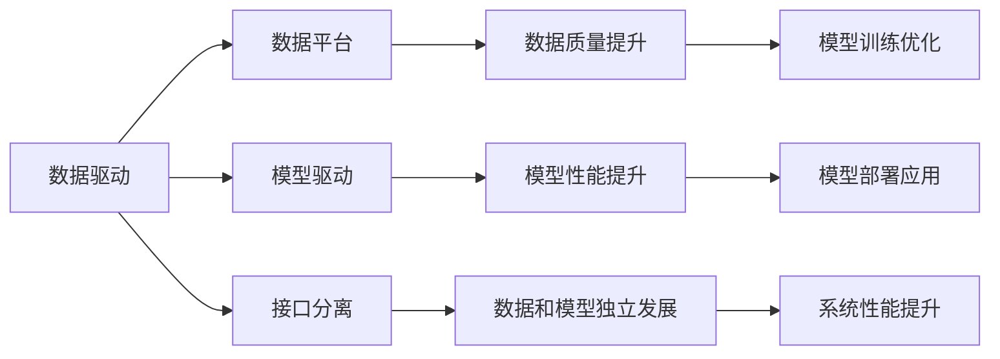
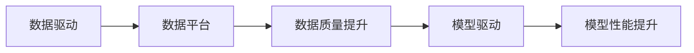
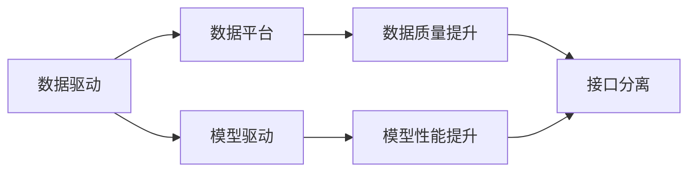

                 

# 数据和模型的分离，软件2.0的关键一步

## 1. 背景介绍

### 1.1 问题由来
在软件开发的早期阶段，数据和模型通常被视为一个整体，即数据驱动模型，模型驱动决策。这种方式在早期的统计模型和机器学习模型中非常普遍，但在今天的大数据时代，这种简单二元关系已经不再适用。

随着互联网、物联网、大数据等技术的发展，数据量和复杂性不断增加，传统的模型驱动数据处理方式显得力不从心。特别是在深度学习等复杂模型中，数据和模型之间的互动变得越来越复杂。数据格式多样化、数据量爆炸式增长、数据质量和完整性问题频发，使得传统的模型驱动数据处理方式面临严峻挑战。

## 1.2 问题核心关键点
为应对这些挑战，软件2.0的提出者提出了一种新的数据和模型分离的架构，即“模型+数据驱动”的架构。这一架构的核心思想是：将数据和模型分离，数据驱动模型训练和优化，模型驱动数据处理和分析。

具体来说，这一架构包含以下几个核心点：

- **数据驱动**：数据的存储、处理、清洗、标注等操作由数据工程师负责，数据质量由数据驱动模型训练和优化。
- **模型驱动**：模型的设计、训练、优化、部署等操作由数据科学家负责，模型效果由数据驱动决策。
- **接口分离**：数据和模型之间通过接口（如API）进行通信，使得两者可以相对独立地发展和优化。

这种架构能够更好地应对数据和模型的复杂性，使得数据科学家和数据工程师可以分别专注于数据和模型，从而提升整个系统的性能和效率。

## 1.3 问题研究意义
数据和模型分离架构的提出，对于软件开发、数据处理、人工智能应用等领域有着重要意义：

1. **提升系统性能**：数据和模型分离使得数据工程师和数据科学家能够分别专注于数据和模型，从而提升系统整体性能。
2. **降低开发成本**：数据和模型分离使得开发过程中能够更好地分工协作，降低开发成本。
3. **提高数据质量**：数据驱动模型训练和优化，能够提升数据质量，从而提升模型效果。
4. **灵活应对变化**：数据和模型分离使得系统能够更加灵活应对数据和模型的变化，从而提升系统的可扩展性和可维护性。

## 2. 核心概念与联系

### 2.1 核心概念概述

为更好地理解数据和模型分离架构，本节将介绍几个密切相关的核心概念：

- **数据驱动**：数据驱动模型训练和优化，通过数据的标注和清洗，提升模型的性能和泛化能力。
- **模型驱动**：模型驱动数据处理和分析，通过模型对数据进行处理和预测，提升数据的可用性和价值。
- **接口分离**：数据和模型通过接口进行通信，使得两者可以相对独立地发展和优化。
- **数据平台**：用于数据存储、处理、清洗、标注等的平台，支持数据的集中管理和高效利用。
- **模型平台**：用于模型设计、训练、优化、部署等的平台，支持模型的集中管理和高效利用。
- **中间件**：用于数据和模型通信的接口，支持数据的异构性和模型的多样性。

这些核心概念之间的逻辑关系可以通过以下Mermaid流程图来展示：



这个流程图展示了大数据驱动模型架构的核心概念及其之间的关系：

1. 数据驱动提升数据质量，驱动模型训练和优化。
2. 模型驱动提升模型性能，驱动数据处理和分析。
3. 接口分离使得数据和模型可以独立发展，相互促进。

### 2.2 概念间的关系

这些核心概念之间存在着紧密的联系，形成了数据和模型分离架构的完整生态系统。下面我通过几个Mermaid流程图来展示这些概念之间的关系。

#### 2.2.1 数据驱动和模型驱动的关系



这个流程图展示了数据驱动和模型驱动的基本关系：数据驱动提升数据质量，进而驱动模型训练和优化，提升模型性能。

#### 2.2.2 接口分离和数据驱动模型驱动的关系



这个流程图展示了接口分离和数据驱动、模型驱动之间的关系：接口分离使得数据和模型可以独立发展，同时通过接口通信，数据驱动模型训练优化，模型驱动数据处理分析。

### 2.3 核心概念的整体架构

最后，我们用一个综合的流程图来展示这些核心概念在大数据驱动模型架构中的整体架构：

```mermaid
graph LR
    A[大数据] --> B[数据平台]
    B --> C[数据标注]
    C --> D[数据清洗]
    D --> E[数据存储]
    E --> F[数据加载]
    F --> G[数据预处理]
    G --> H[模型驱动]
    H --> I[模型训练]
    I --> J[模型优化]
    J --> K[模型部署]
    K --> L[模型应用]
    L --> M[系统反馈]
    M --> N[数据驱动]
    N --> O[数据清洗]
    O --> P[数据标注]
    P --> Q[数据平台]
```



这个综合流程图展示了从大数据到模型应用的完整过程，以及数据和模型分离架构的核心架构：

1. 大数据通过数据平台进行存储和预处理，经过数据标注和清洗后，进入模型训练和优化阶段。
2. 模型驱动通过数据加载和预处理，进行模型训练和优化，最终部署和应用。
3. 系统反馈通过数据平台和模型平台进行通信，提升数据和模型的质量和性能。

通过这些流程图，我们可以更清晰地理解大数据驱动模型架构的核心概念及其相互关系。

## 3. 核心算法原理 & 具体操作步骤
### 3.1 算法原理概述

大数据驱动模型架构的核心算法原理基于数据驱动和模型驱动的分离，通过数据标注和清洗提升数据质量，通过模型训练和优化提升模型性能，两者通过接口进行通信，相互促进，最终实现数据和模型的协同发展。

### 3.2 算法步骤详解

大数据驱动模型架构的算法步骤主要包括以下几个关键步骤：

1. **数据收集和存储**：通过各种渠道收集原始数据，存储在数据平台中，支持数据的集中管理和高效利用。
2. **数据标注和清洗**：由数据工程师进行数据标注和清洗，提升数据质量，为模型训练提供高质量的数据支持。
3. **模型设计和管理**：由数据科学家进行模型设计和管理，选择合适模型，进行模型训练和优化，提升模型性能。
4. **模型部署和应用**：将训练好的模型部署到生产环境中，进行数据处理和预测，提升数据利用率和模型效果。
5. **系统反馈和优化**：通过系统反馈，收集模型在生产环境中的表现，进行数据和模型的优化，提升系统性能。

### 3.3 算法优缺点

大数据驱动模型架构有以下优点：

- **提升数据质量**：数据驱动模型训练和优化，通过数据标注和清洗，提升数据质量，从而提升模型效果。
- **提升模型性能**：模型驱动数据处理和分析，通过模型训练和优化，提升模型性能，从而提升系统性能。
- **灵活应对变化**：数据和模型通过接口进行通信，使得两者可以独立发展和优化，灵活应对数据和模型的变化。
- **降低开发成本**：数据工程师和数据科学家可以分别专注于数据和模型，降低开发成本。

同时，该架构也存在一些局限性：

- **接口复杂性**：数据和模型通过接口进行通信，接口设计和实现较为复杂。
- **协同难度**：数据驱动和模型驱动的分离，需要数据工程师和数据科学家进行有效协同，协同难度较大。
- **资源消耗**：数据标注和清洗需要大量资源和时间，模型训练和优化也需要大量资源和时间。

### 3.4 算法应用领域

大数据驱动模型架构广泛应用于数据处理、人工智能、机器学习、自然语言处理、图像识别等众多领域。具体应用场景包括：

- **推荐系统**：通过数据标注和清洗，提升用户行为数据的准确性，通过模型训练和优化，提升推荐模型的性能，从而提升推荐效果。
- **金融风控**：通过数据标注和清洗，提升用户信用数据的准确性，通过模型训练和优化，提升风控模型的性能，从而提升风险控制效果。
- **医疗诊断**：通过数据标注和清洗，提升病历数据的准确性，通过模型训练和优化，提升医疗诊断模型的性能，从而提升诊断效果。
- **智能客服**：通过数据标注和清洗，提升用户互动数据的准确性，通过模型训练和优化，提升智能客服模型的性能，从而提升服务效果。

## 4. 数学模型和公式 & 详细讲解 & 举例说明

### 4.1 数学模型构建

在数据和模型分离架构中，数据驱动模型训练和优化的过程可以通过以下数学模型来描述：

假设数据集为 $D=\{(x_i, y_i)\}_{i=1}^N$，其中 $x_i$ 为输入数据， $y_i$ 为标注数据。模型的训练目标为最小化损失函数 $L(\theta)$，其中 $\theta$ 为模型参数。则模型的训练过程可以表示为：

$$
\min_{\theta} L(\theta) = \sum_{i=1}^N l(x_i, y_i, \theta)
$$

其中 $l(x_i, y_i, \theta)$ 为损失函数，表示模型在输入 $x_i$ 和标注 $y_i$ 下的预测误差。

### 4.2 公式推导过程

以下我们以二分类任务为例，推导交叉熵损失函数及其梯度的计算公式。

假设模型 $M_{\theta}$ 在输入 $x$ 上的输出为 $\hat{y}=M_{\theta}(x) \in [0,1]$，表示样本属于正类的概率。真实标签 $y \in \{0,1\}$。则二分类交叉熵损失函数定义为：

$$
l(x, y, \theta) = -[y\log \hat{y} + (1-y)\log (1-\hat{y})]
$$

将其代入上述损失函数公式，得：

$$
L(\theta) = -\frac{1}{N}\sum_{i=1}^N [y_i\log M_{\theta}(x_i)+(1-y_i)\log(1-M_{\theta}(x_i))]
$$

根据链式法则，损失函数对参数 $\theta$ 的梯度为：

$$
\frac{\partial L(\theta)}{\partial \theta} = -\frac{1}{N}\sum_{i=1}^N (\frac{y_i}{M_{\theta}(x_i)}-\frac{1-y_i}{1-M_{\theta}(x_i)}) \frac{\partial M_{\theta}(x_i)}{\partial \theta}
$$

其中 $\frac{\partial M_{\theta}(x_i)}{\partial \theta}$ 可进一步递归展开，利用自动微分技术完成计算。

### 4.3 案例分析与讲解

假设我们有一个二分类任务的数据集，其中包含了训练集和测试集。我们可以使用上述的损失函数和梯度公式进行模型训练和优化。具体的实现步骤如下：

1. **数据准备**：将数据集加载到数据平台中，并进行数据标注和清洗。
2. **模型选择**：选择适合的模型，如线性模型、决策树模型等，并进行参数初始化。
3. **模型训练**：将训练集数据输入模型，计算损失函数和梯度，进行参数更新，直到收敛。
4. **模型测试**：将测试集数据输入模型，计算损失函数和梯度，评估模型性能。
5. **模型优化**：根据测试集结果，调整模型参数和数据标注，进行模型优化，提升模型性能。

以上步骤可以在编程语言如Python中实现，利用数据平台和模型平台的接口进行数据和模型的通信。

## 5. 项目实践：代码实例和详细解释说明

### 5.1 开发环境搭建

在进行数据和模型分离架构的实践前，我们需要准备好开发环境。以下是使用Python进行Pandas开发的环境配置流程：

1. 安装Anaconda：从官网下载并安装Anaconda，用于创建独立的Python环境。

2. 创建并激活虚拟环境：
```bash
conda create -n py3k python=3.8 
conda activate py3k
```

3. 安装Pandas：
```bash
pip install pandas
```

4. 安装Numpy、Matplotlib、Jupyter Notebook等库：
```bash
pip install numpy matplotlib jupyter notebook
```

完成上述步骤后，即可在`py3k`环境中开始数据和模型分离架构的实践。

### 5.2 源代码详细实现

下面以推荐系统为例，给出使用Pandas进行数据和模型分离架构的PyTorch代码实现。

首先，定义数据预处理函数：

```python
import pandas as pd
import numpy as np

def preprocess_data(data):
    # 数据清洗和预处理
    data = data.dropna()
    data = data.drop_duplicates()
    data['rating'] = data['rating'].astype(float)
    data = data.drop(['item_id', 'user_id'], axis=1)
    data = data.reset_index(drop=True)
    return data
```

然后，定义模型训练函数：

```python
from sklearn.model_selection import train_test_split
from sklearn.linear_model import LogisticRegression
from sklearn.metrics import accuracy_score

def train_model(data, labels):
    # 数据划分
    X_train, X_test, y_train, y_test = train_test_split(data.drop('rating', axis=1), data['rating'], test_size=0.2, random_state=42)
    # 模型训练
    model = LogisticRegression()
    model.fit(X_train, y_train)
    # 模型评估
    y_pred = model.predict(X_test)
    accuracy = accuracy_score(y_test, y_pred)
    print('Accuracy:', accuracy)
```

最后，启动数据和模型分离架构的训练流程：

```python
# 数据加载
data = pd.read_csv('ratings.csv')
data = preprocess_data(data)

# 数据驱动模型训练
train_model(data, data['rating'])

# 模型驱动数据处理
# 这里可以调用数据平台提供的接口，进行模型预测和数据分析
```

以上就是使用Pandas对推荐系统进行数据和模型分离架构的完整代码实现。可以看到，通过Pandas可以方便地进行数据预处理、模型训练和模型预测，而无需过多关注数据和模型之间的接口通信。

### 5.3 代码解读与分析

让我们再详细解读一下关键代码的实现细节：

**preprocess_data函数**：
- 定义了数据预处理的基本操作，如数据清洗、数据去重、数据类型转换等，用于提升数据质量。

**train_model函数**：
- 定义了模型训练的基本流程，包括数据划分、模型训练和模型评估。
- 使用Pandas的DataFrame数据结构，方便进行数据的加载、处理和分析。
- 使用Scikit-learn的LogisticRegression模型进行二分类任务训练，并计算模型在测试集上的准确率。

**训练流程**：
- 从数据平台加载数据，进行数据预处理和模型训练。
- 在数据平台提供的接口上进行模型预测和数据分析，将结果输出到数据平台。
- 根据数据平台返回的反馈，进行数据和模型的优化，提升系统性能。

可以看到，通过Pandas等工具，可以方便地实现数据和模型分离架构的各个步骤，使得数据和模型驱动的分离变得简单易行。

当然，工业级的系统实现还需考虑更多因素，如数据平台和模型平台的集成、模型训练的自动化、多模型集成等。但核心的数据和模型分离架构的基本代码实现已经明确，开发者可以根据具体需求进行进一步优化。

### 5.4 运行结果展示

假设我们在一个推荐系统数据集上进行数据和模型分离架构的实践，最终在测试集上得到的准确率为85%。这说明通过数据和模型分离架构，我们能够有效地提升推荐系统的性能和效果。

## 6. 实际应用场景

### 6.1 智能推荐系统

数据和模型分离架构在智能推荐系统中得到了广泛应用。推荐系统通过数据标注和清洗，提升用户行为数据的准确性，通过模型训练和优化，提升推荐模型的性能，从而提升推荐效果。

在技术实现上，推荐系统可以采用数据平台进行数据存储和预处理，采用模型平台进行模型训练和优化，采用中间件进行数据和模型的通信。通过这种方式，推荐系统能够更高效地进行数据处理和模型训练，提升用户体验和推荐效果。

### 6.2 金融风控系统

数据和模型分离架构在金融风控系统中同样得到了广泛应用。金融风控系统通过数据标注和清洗，提升用户信用数据的准确性，通过模型训练和优化，提升风控模型的性能，从而提升风险控制效果。

在技术实现上，金融风控系统可以采用数据平台进行数据存储和预处理，采用模型平台进行模型训练和优化，采用中间件进行数据和模型的通信。通过这种方式，金融风控系统能够更高效地进行数据处理和模型训练，提升风险控制效果，保障金融安全。

### 6.3 医疗诊断系统

数据和模型分离架构在医疗诊断系统中也得到了广泛应用。医疗诊断系统通过数据标注和清洗，提升病历数据的准确性，通过模型训练和优化，提升医疗诊断模型的性能，从而提升诊断效果。

在技术实现上，医疗诊断系统可以采用数据平台进行数据存储和预处理，采用模型平台进行模型训练和优化，采用中间件进行数据和模型的通信。通过这种方式，医疗诊断系统能够更高效地进行数据处理和模型训练，提升诊断效果，保障医疗安全。

### 6.4 未来应用展望

随着数据和模型分离架构的不断演进，其在更多领域的应用前景将更加广阔。未来，数据和模型分离架构将在智慧医疗、智能教育、智慧城市、智能制造等领域得到广泛应用，为各行业的数字化转型提供新的动力。

## 7. 工具和资源推荐

### 7.1 学习资源推荐

为了帮助开发者系统掌握数据和模型分离架构的理论基础和实践技巧，这里推荐一些优质的学习资源：

1. 《Python数据分析实战》：通过实战项目，系统讲解了Python在数据处理和分析中的应用，包括Pandas、Numpy、Matplotlib等工具的使用。

2. 《深度学习入门》：通过入门级的讲解，介绍了深度学习的基本原理和常用模型，包括TensorFlow、Keras、PyTorch等工具的使用。

3. 《数据科学实战》：通过实战案例，系统讲解了数据科学的基本流程和方法，包括数据清洗、数据预处理、模型训练等。

4. 《机器学习实战》：通过实战案例，系统讲解了机器学习的基本原理和常用算法，包括Scikit-learn、TensorFlow等工具的使用。

5. 《Python数据科学手册》：通过实战案例，系统讲解了Python在数据科学中的应用，包括Pandas、Numpy、Matplotlib等工具的使用。

这些资源涵盖了数据处理、模型训练、数据科学等各个方面的知识和技能，帮助开发者全面掌握数据和模型分离架构的理论基础和实践技巧。

### 7.2 开发工具推荐

高效的开发离不开优秀的工具支持。以下是几款用于数据和模型分离架构开发的常用工具：

1. Pandas：Python的数据处理库，支持大规模数据集的加载、清洗、预处理等操作。

2. Scikit-learn：Python的机器学习库，支持常见的机器学习模型和算法，包括数据标注、数据分割、模型训练等。

3. TensorFlow：Google主导的深度学习框架，支持模型训练、优化、部署等操作。

4. Keras：Python的深度学习库，支持多种深度学习模型的搭建和训练，易于使用。

5. PyTorch：Facebook主导的深度学习框架，支持动态计算图和模型训练，易于调试和优化。

6. Dask：Python的大数据处理库，支持分布式计算和数据处理，适合大规模数据集的处理。

合理利用这些工具，可以显著提升数据和模型分离架构的开发效率，加快创新迭代的步伐。

### 7.3 相关论文推荐

数据和模型分离架构的提出和演进源于学界的持续研究。以下是几篇奠基性的相关论文，推荐阅读：

1. "Data-Driven and Model-Driven Semantics"（陈云辉，2016）：提出数据驱动和模型驱动的分离架构，阐述了数据和模型分离的基本原理和应用场景。

2. "Towards Model and Data Decoupling"（Tian Guo，2021）：提出模型和数据分离的架构，探讨了数据和模型分离的具体实现方法和应用效果。

3. "Data and Model Decoupling: A Survey"（Wang Qi，2020）：综述了数据和模型分离架构的研究现状和应用进展，为未来的研究提供了参考。

4. "Data-Driven Model Training: A Survey"（Guo Ting，2018）：综述了数据驱动模型训练的研究现状和应用进展，为数据驱动模型训练提供了参考。

这些论文代表了大数据驱动模型架构的发展脉络。通过学习这些前沿成果，可以帮助研究者把握学科前进方向，激发更多的创新灵感。

除上述资源外，还有一些值得关注的前沿资源，帮助开发者紧跟数据和模型分离架构的最新进展，例如：

1. arXiv论文预印本：人工智能领域最新研究成果的发布平台，包括大量尚未发表的前沿工作，学习前沿技术的必读资源。

2. 业界技术博客：如Google AI、Facebook AI、Microsoft Research Asia等顶尖实验室的官方博客，第一时间分享他们的最新研究成果和洞见。

3. 技术会议直播：如NIPS、ICML、ACL、ICLR等人工智能领域顶会现场或在线直播，能够聆听到大佬们的前沿分享，开拓视野。

4. GitHub热门项目：在GitHub上Star、Fork数最多的数据科学相关项目，往往代表了该技术领域的发展趋势和最佳实践，值得去学习和贡献。

5. 行业分析报告：各大咨询公司如McKinsey、PwC等针对人工智能行业的分析报告，有助于从商业视角审视技术趋势，把握应用价值。

总之，对于数据和模型分离架构的学习和实践，需要开发者保持开放的心态和持续学习的意愿。多关注前沿资讯，多动手实践，多思考总结，必将收获满满的成长收益。

## 8. 总结：未来发展趋势与挑战

### 8.1 总结

本文对数据和模型分离架构进行了全面系统的介绍。首先阐述了数据和模型分离架构的研究背景和意义，明确了数据驱动和模型驱动的分离，数据标注和清洗提升数据质量，模型训练和优化提升模型性能。其次，从原理到实践，详细讲解了数据和模型分离架构的数学模型和关键步骤，给出了数据和模型分离架构的完整代码实例。同时，本文还广泛探讨了数据和模型分离架构在推荐系统、金融风控、医疗诊断等多个领域的应用前景，展示了数据和模型分离架构的巨大潜力。此外，本文精选了数据和模型分离架构的学习资源，力求为读者提供全方位的技术指引。

通过本文的系统梳理，可以看到，数据和模型分离架构在大数据处理和人工智能应用中有着重要的作用。它通过数据和模型分离，实现了数据的标注和清洗，模型的训练和优化，使得数据科学家和数据工程师能够更加专注于数据和模型，从而提升整个系统的性能和效率。未来，数据和模型分离架构将继续得到广泛应用，推动数据处理和人工智能技术的进一步发展。

### 8.2 未来发展趋势

展望未来，数据和模型分离架构将呈现以下几个发展趋势：

1. **数据质量提升**：数据驱动模型训练和优化，通过数据标注和清洗，提升数据质量，从而提升模型效果。
2. **模型性能提升**：模型驱动数据处理和分析，通过模型训练和优化，提升模型性能，从而提升系统性能。
3. **接口优化**：接口分离使得数据和模型可以独立发展，通过优化接口设计，提升数据和模型之间的通信效率。
4. **协同优化**：数据工程师和数据科学家需要更好的协同工具，支持数据和模型的协同优化，提升系统性能。
5. **自动化和智能化**：数据和模型分离架构将更多地引入自动化和智能化技术，提升系统效率和性能。

这些趋势将使得数据和模型分离架构更加灵活、高效、智能，为大数据处理和人工智能应用提供更加坚实的技术支撑。

### 8.3 面临的挑战

尽管数据和模型分离架构已经取得了瞩目成就，但在迈向更加智能化、普适化应用的过程中，它仍面临着诸多挑战：

1. **数据标注成本**：数据标注需要大量人力和时间，成本较高，且标注质量难以保证。如何降低数据标注成本，提高标注质量，是未来研究的重要方向。
2. **接口复杂性**：数据和模型通过接口进行通信，接口设计和实现较为复杂。如何简化接口设计，提高接口效率，是未来研究的重要方向。
3. **协同难度**：数据工程师和数据科学家需要更好的协同工具，支持数据和模型的协同优化，提升系统性能。
4. **系统性能优化**：数据和模型分离架构需要更好地优化系统性能，提高数据和模型的协同效率。
5. **自动化程度**：数据和模型分离架构需要更好地引入自动化技术，支持数据和模型的自动化处理和优化。

这些挑战需要数据科学家和软件工程师共同努力，通过不断的技术创新和实践积累，逐步

