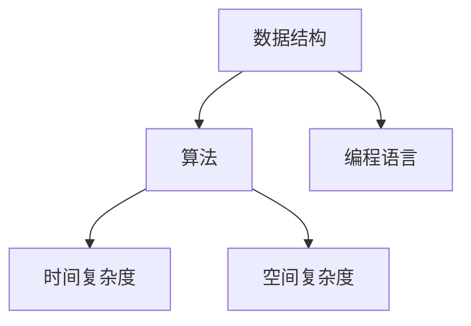
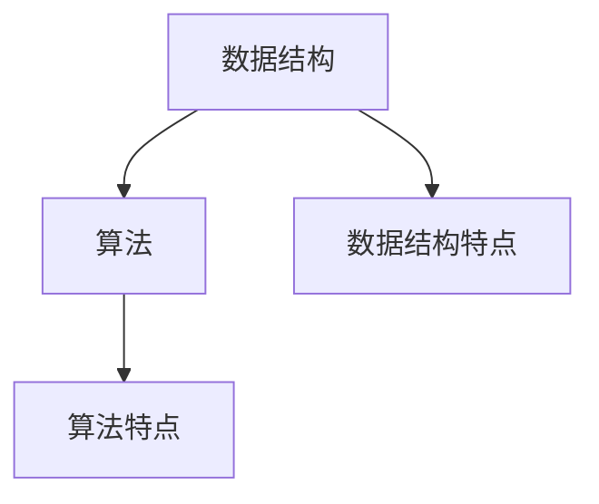
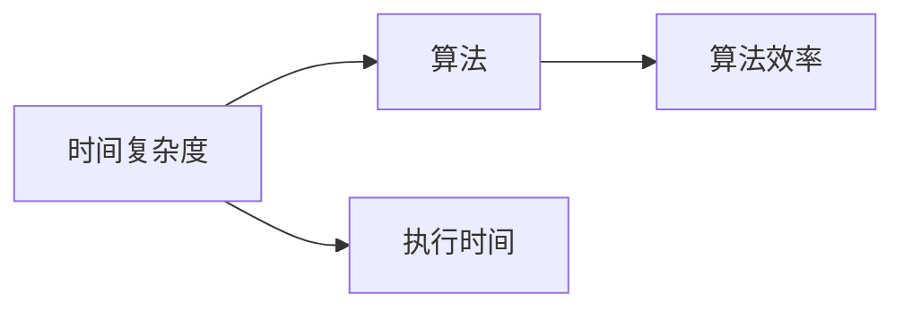
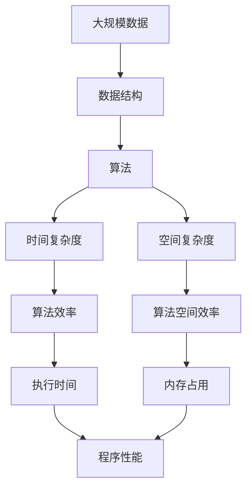

                 

# 数据结构与算法原理与代码实战案例讲解

> 关键词：数据结构,算法原理,代码实战,案例讲解,编程实践

## 1. 背景介绍

### 1.1 问题由来
在计算机科学中，数据结构和算法是两个核心概念。数据结构用于组织和存储数据，使得数据可以被高效访问和修改；算法则是解决问题的方法，确保在有限的时间内得到正确的答案。数据结构和算法的高效使用，是实现高效、稳定、可扩展计算机系统的基石。然而，许多初学者常常被其复杂性和抽象性所困扰，难以将理论知识转化为实际编程技能。本文旨在通过案例讲解和代码实战，将数据结构和算法的原理与实践相结合，使读者能够更好地理解和应用这些重要概念。

### 1.2 问题核心关键点
本文将从数据结构和算法的原理出发，结合具体的编程实践案例，深入讲解它们的核心概念和实现方法。

- 数据结构：数组、链表、栈、队列、树、图、哈希表、堆等基本数据结构，以及其应用场景和特点。
- 算法原理：排序、搜索、递归、分治、动态规划、贪心算法、回溯算法、图算法等经典算法，以及它们的时间复杂度和空间复杂度。
- 代码实战：通过实际编程案例，展示数据结构和算法的应用，包括代码实现、调试和优化技巧。
- 案例讲解：选取具有代表性的经典算法和数据结构案例，深入剖析其实现细节和优劣。

### 1.3 问题研究意义
掌握数据结构和算法原理，对于提高编程技能、解决实际问题、优化系统性能等方面具有重要意义：

1. 提升编程效率：数据结构和算法的应用能够大大减少代码冗余，提升程序的可读性和维护性。
2. 解决复杂问题：通过选择合适的数据结构和算法，能够高效、准确地解决各种实际问题。
3. 优化系统性能：数据结构和算法优化是提升系统性能的关键，直接影响用户体验和系统响应速度。
4. 拓展应用边界：掌握数据结构和算法原理，能够将技术应用到更广泛的领域，推动技术创新。
5. 促进持续学习：数据结构和算法是计算机科学的基石，深入理解这些概念，能够为未来的学习和研究打下坚实基础。

## 2. 核心概念与联系

### 2.1 核心概念概述

为更好地理解数据结构和算法的原理与实践，本节将介绍几个密切相关的核心概念：

- 数据结构：用于组织和存储数据的数据类型，包括数组、链表、栈、队列、树、图、哈希表、堆等。
- 算法：解决问题的方法和步骤，包括排序、搜索、递归、分治、动态规划、贪心算法、回溯算法、图算法等。
- 时间复杂度：衡量算法执行效率的指标，表示算法执行所需的时间与问题规模的关系。
- 空间复杂度：衡量算法空间占用的指标，表示算法执行所需的空间与问题规模的关系。
- 编程语言：数据结构和算法的实现通常使用特定的编程语言，如C++、Java、Python等。

这些核心概念之间的逻辑关系可以通过以下Mermaid流程图来展示：



这个流程图展示了大数据结构和算法之间的密切联系和编程实现的关系。数据结构和算法的高效应用，能够显著提升程序的性能和可扩展性。编程语言则是数据结构和算法实现的介质，使得这些概念得以具体化和应用。

### 2.2 概念间的关系

这些核心概念之间存在着紧密的联系，形成了数据结构和算法原理与实践的完整生态系统。下面我们通过几个Mermaid流程图来展示这些概念之间的关系。

#### 2.2.1 数据结构与算法的关系



这个流程图展示了数据结构和算法之间的紧密关系。数据结构提供了一种数据组织方式，而算法则基于这种组织方式，提供了高效解决问题的方法。

#### 2.2.2 时间复杂度与算法的关系



这个流程图展示了时间复杂度与算法之间的关系。时间复杂度用于衡量算法执行所需的时间，不同的算法具有不同的时间复杂度，影响其执行效率。

#### 2.2.3 空间复杂度与算法的关系


这个流程图展示了空间复杂度与算法之间的关系。空间复杂度用于衡量算法执行所需的内存空间，不同的算法具有不同的空间复杂度，影响其空间效率。

### 2.3 核心概念的整体架构

最后，我们用一个综合的流程图来展示这些核心概念在大数据结构和算法原理与实践中的整体架构：



这个综合流程图展示了数据结构和算法在大规模数据处理中的作用和影响。数据结构和算法的优化应用，能够显著提升程序的性能和可扩展性。

## 3. 核心算法原理 & 具体操作步骤
### 3.1 算法原理概述

数据结构和算法的实现，往往基于计算机科学的经典理论。本节将详细介绍这些理论的原理和应用。

#### 3.1.1 基本算法原理
- 排序算法：包括冒泡排序、选择排序、插入排序、快速排序、归并排序等。这些算法通过不同的比较和交换方式，将数据按照一定顺序排列。
- 搜索算法：包括线性搜索、二分搜索、哈希搜索等。这些算法通过不同的查找方式，快速定位目标数据。
- 递归算法：通过函数调用的方式，递归地解决问题，适用于分治法和动态规划等算法。
- 分治算法：将问题分解为多个子问题，递归解决每个子问题，最后将结果合并。经典例子如归并排序和快速排序。
- 动态规划：通过存储子问题的解，避免重复计算，适用于具有重叠子问题和最优子结构的问题。经典例子如斐波那契数列和背包问题。
- 贪心算法：通过每一步选择最优解，逐步逼近最终解，适用于无后效性的问题。经典例子如最小生成树和最短路径问题。
- 回溯算法：通过穷举所有可能的解，逐步逼近最优解，适用于解空间搜索的问题。经典例子如八皇后问题和迷宫问题。
- 图算法：包括深度优先搜索、广度优先搜索、Dijkstra算法、Prim算法、Kruskal算法等。这些算法通过遍历图的方式，解决不同的图问题。

#### 3.1.2 算法优化策略
- 时间复杂度优化：通过减少比较和交换次数，提升算法的执行效率。
- 空间复杂度优化：通过减少内存占用，提升算法的空间效率。
- 并行计算：通过多线程或多进程的方式，提升算法的执行速度。
- 缓存优化：通过预处理和缓存技术，提升算法的执行效率。
- 分布式计算：通过分布式集群的方式，提升算法的执行速度和处理能力。

### 3.2 算法步骤详解

#### 3.2.1 排序算法实现
排序算法是数据结构中的经典问题，通过将数据按照一定顺序排列，使得后续的操作更加高效。以下是冒泡排序和快速排序的实现：

```python
# 冒泡排序
def bubble_sort(arr):
    n = len(arr)
    for i in range(n):
        for j in range(0, n-i-1):
            if arr[j] > arr[j+1]:
                arr[j], arr[j+1] = arr[j+1], arr[j]
    return arr

# 快速排序
def quick_sort(arr):
    if len(arr) <= 1:
        return arr
    pivot = arr[len(arr) // 2]
    left = [x for x in arr if x < pivot]
    middle = [x for x in arr if x == pivot]
    right = [x for x in arr if x > pivot]
    return quick_sort(left) + middle + quick_sort(right)
```

#### 3.2.2 搜索算法实现
搜索算法用于快速定位目标数据，以下是二分搜索和哈希搜索的实现：

```python
# 二分搜索
def binary_search(arr, target):
    low, high = 0, len(arr) - 1
    while low <= high:
        mid = (low + high) // 2
        if arr[mid] == target:
            return mid
        elif arr[mid] < target:
            low = mid + 1
        else:
            high = mid - 1
    return -1

# 哈希搜索
def hash_search(arr, target):
    hash_table = {}
    for i, num in enumerate(arr):
        hash_table[num] = i
    return hash_table.get(target, -1)
```

#### 3.2.3 递归算法实现
递归算法通过函数调用的方式，递归地解决问题。以下是阶乘的递归实现：

```python
def factorial(n):
    if n == 0:
        return 1
    else:
        return n * factorial(n-1)
```

#### 3.2.4 分治算法实现
分治算法通过将问题分解为多个子问题，递归解决每个子问题，最后将结果合并。以下是归并排序的实现：

```python
def merge_sort(arr):
    if len(arr) <= 1:
        return arr
    mid = len(arr) // 2
    left = merge_sort(arr[:mid])
    right = merge_sort(arr[mid:])
    return merge(left, right)

def merge(left, right):
    result = []
    i, j = 0, 0
    while i < len(left) and j < len(right):
        if left[i] <= right[j]:
            result.append(left[i])
            i += 1
        else:
            result.append(right[j])
            j += 1
    result.extend(left[i:])
    result.extend(right[j:])
    return result
```

#### 3.2.5 动态规划实现
动态规划通过存储子问题的解，避免重复计算。以下是斐波那契数列的动态规划实现：

```python
def fibonacci(n):
    if n == 0 or n == 1:
        return n
    dp = [0] * (n+1)
    dp[0], dp[1] = 0, 1
    for i in range(2, n+1):
        dp[i] = dp[i-1] + dp[i-2]
    return dp[n]
```

#### 3.2.6 贪心算法实现
贪心算法通过每一步选择最优解，逐步逼近最终解。以下是活动选择问题的贪心实现：

```python
def activity_selection(arr):
    arr.sort(key=lambda x: x[1])
    result = []
    end_time = 0
    for i in range(len(arr)):
        if arr[i][0] >= end_time:
            result.append(arr[i])
            end_time = arr[i][1]
    return result
```

#### 3.2.7 回溯算法实现
回溯算法通过穷举所有可能的解，逐步逼近最优解。以下是八皇后问题的回溯实现：

```python
def solve_n_queens(n):
    def backtrack(board, row):
        if row == n:
            result.append(board[:])
            return
        for col in range(n):
            if is_valid(board, row, col):
                board[row][col] = 'Q'
                backtrack(board, row+1)
                board[row][col] = '.'
    def is_valid(board, row, col):
        for i in range(row):
            if board[i][col] == 'Q':
                return False
            if col-row+i >= 0 and board[i][col-row+i] == 'Q':
                return False
            if col+row-i < n and board[i][col+row-i] == 'Q':
                return False
        return True
    result = []
    board = [['.'] * n for _ in range(n)]
    backtrack(board, 0)
    return result
```

#### 3.2.8 图算法实现
图算法用于遍历和解决图问题。以下是Dijkstra算法的实现：

```python
import heapq

def dijkstra(graph, start):
    distances = {node: float('inf') for node in graph}
    distances[start] = 0
    pq = [(0, start)]
    while pq:
        _, current = heapq.heappop(pq)
        if current == start:
            continue
        for neighbor, weight in graph[current].items():
            new_distance = distances[current] + weight
            if new_distance < distances[neighbor]:
                distances[neighbor] = new_distance
                heapq.heappush(pq, (new_distance, neighbor))
    return distances
```

### 3.3 算法优缺点

数据结构和算法的高效实现，能够显著提升程序的性能和可扩展性。但不同的算法具有不同的时间复杂度和空间复杂度，优缺点各异。

#### 3.3.1 时间复杂度
时间复杂度用于衡量算法执行所需的时间，不同的算法具有不同的时间复杂度。例如：

- 冒泡排序和插入排序的时间复杂度为$O(n^2)$，不适用于大规模数据。
- 快速排序和归并排序的时间复杂度为$O(n\log n)$，适用于大规模数据。
- 二分搜索的时间复杂度为$O(\log n)$，适用于有序数据。

#### 3.3.2 空间复杂度
空间复杂度用于衡量算法执行所需的内存空间，不同的算法具有不同的空间复杂度。例如：

- 冒泡排序和插入排序的空间复杂度为$O(1)$，不占用额外内存。
- 归并排序的空间复杂度为$O(n)$，需要额外的空间存储中间结果。

#### 3.3.3 并行计算
并行计算通过多线程或多进程的方式，提升算法的执行速度。适用于大规模数据和复杂计算。

#### 3.3.4 缓存优化
缓存优化通过预处理和缓存技术，提升算法的执行效率。适用于数据频繁访问的场景。

#### 3.3.5 分布式计算
分布式计算通过分布式集群的方式，提升算法的执行速度和处理能力。适用于大规模数据和高计算量的场景。

### 3.4 算法应用领域

数据结构和算法在计算机科学和工程中有着广泛的应用，以下是几个典型的应用领域：

#### 3.4.1 操作系统
操作系统中的任务调度、内存管理、文件系统等，都依赖于高效的数据结构和算法。

#### 3.4.2 数据库
数据库中的索引、查询优化、事务处理等，都依赖于高效的数据结构和算法。

#### 3.4.3 网络
网络中的路由选择、数据传输、协议处理等，都依赖于高效的数据结构和算法。

#### 3.4.4 图形学
图形学中的场景渲染、物理模拟、图像处理等，都依赖于高效的数据结构和算法。

#### 3.4.5 游戏引擎
游戏引擎中的物理引擎、碰撞检测、路径规划等，都依赖于高效的数据结构和算法。

#### 3.4.6 金融系统
金融系统中的交易处理、风险管理、数据分析等，都依赖于高效的数据结构和算法。

#### 3.4.7 机器学习
机器学习中的特征工程、模型训练、数据处理等，都依赖于高效的数据结构和算法。

## 4. 数学模型和公式 & 详细讲解 & 举例说明

### 4.1 数学模型构建

数据结构和算法的高效实现，依赖于数学模型的构建。本节将详细讲解常见数据结构和算法的数学模型，并结合具体的编程案例进行讲解。

#### 4.1.1 数组
数组是数据结构中的基本类型，用于存储一系列有序的元素。以下是数组的数学模型：

$$
A = [a_1, a_2, ..., a_n]
$$

其中$a_i$表示第$i$个元素的值，$n$表示数组的长度。数组支持随机访问和修改操作，时间复杂度为$O(1)$。

#### 4.1.2 链表
链表是数据结构中的另一种基本类型，用于存储一系列有序的元素。以下是链表的数学模型：

$$
L = (n)
$$

其中$n$表示链表的长度，每个节点包含一个数据元素和一个指向下一个节点的指针。链表支持随机访问和修改操作，时间复杂度为$O(n)$。

#### 4.1.3 栈
栈是数据结构中的基本类型，用于存储一系列有序的元素，遵循后进先出的原则。以下是栈的数学模型：

$$
S = (n)
$$

其中$n$表示栈中元素的个数。栈支持压入和弹出操作，时间复杂度为$O(1)$。

#### 4.1.4 队列
队列是数据结构中的基本类型，用于存储一系列有序的元素，遵循先进先出的原则。以下是队列的数学模型：

$$
Q = (n)
$$

其中$n$表示队列中元素的个数。队列支持入队和出队操作，时间复杂度为$O(1)$。

#### 4.1.5 树
树是数据结构中的基本类型，用于存储一系列有序的元素，每个元素包含一个子树。以下是树的数学模型：

$$
T = (n, m)
$$

其中$n$表示树中节点的个数，$m$表示每个节点的子节点数。树支持搜索、插入和删除操作，时间复杂度为$O(n)$。

#### 4.1.6 图
图是数据结构中的基本类型，用于存储一系列有序的元素，每个元素包含一组相邻的元素。以下是图的数学模型：

$$
G = (V, E)
$$

其中$V$表示图的顶点集合，$E$表示图的有向边或无向边集合。图支持搜索、路径查找和连通性判断等操作，时间复杂度为$O(n+m)$。

#### 4.1.7 哈希表
哈希表是数据结构中的高级类型，用于快速存储和查找元素。以下是哈希表的数学模型：

$$
H = (m)
$$

其中$m$表示哈希表的大小，每个元素$k$存储在哈希函数$h(k)$的映射结果$h(k) \in [0, m-1]$的桶中。哈希表支持快速查找和插入操作，时间复杂度为$O(1)$。

#### 4.1.8 堆
堆是数据结构中的高级类型，用于维护一组元素的有序性。以下是堆的数学模型：

$$
H = (n)
$$

其中$n$表示堆中元素的个数。堆支持插入和删除操作，时间复杂度为$O(\log n)$。

### 4.2 公式推导过程

以下我们将通过几个具体的编程案例，深入讲解数据结构和算法的数学模型。

#### 4.2.1 数组和链表的比较
数组和链表都是常见的数据结构，用于存储一系列有序的元素。以下是它们的比较：

| 数组 | 链表 |
| --- | --- |
| 随机访问 | 随机访问 |
| 修改操作 | 修改操作 |
| 插入和删除 | 插入和删除 |
| 内存占用 | 内存占用 |

#### 4.2.2 栈和队列的比较
栈和队列都是常见的数据结构，用于存储一系列有序的元素，但它们的访问顺序不同。以下是它们的比较：

| 栈 | 队列 |
| --- | --- |
| 后进先出 | 先进先出 |
| 压入操作 | 入队操作 |
| 弹出操作 | 出队操作 |
| 内存占用 | 内存占用 |

#### 4.2.3 树和图的比较
树和图都是常见的数据结构，用于存储一系列有序的元素，但它们的结构和操作不同。以下是它们的比较：

| 树 | 图 |
| --- | --- |
| 层级关系 | 无层级关系 |
| 搜索操作 | 搜索操作 |
| 插入和删除 | 插入和删除 |
| 连通性判断 | 连通性判断 |

#### 4.2.4 哈希表和堆的比较
哈希表和堆都是常见的数据结构，用于快速存储和查找元素，但它们的实现方式不同。以下是它们的比较：

| 哈希表 | 堆 |
| --- | --- |
| 快速查找 | 维护有序性 |
| 插入操作 | 插入操作 |
| 删除操作 | 删除操作 |
| 内存占用 | 内存占用 |

### 4.3 案例分析与讲解

#### 4.3.1 排序算法的案例分析
排序算法是数据结构中的经典问题，通过将数据按照一定顺序排列，使得后续的操作更加高效。以下是几种常见的排序算法的案例分析：

- 冒泡排序：时间复杂度为$O(n^2)$，空间复杂度为$O(1)$，适用于小规模数据。
- 选择排序：时间复杂度为$O(n^2)$，空间复杂度为$O(1)$，适用于小规模数据。
- 插入排序：时间复杂度为$O(n^2)$，空间复杂度为$O(1)$，适用于小规模数据。
- 快速排序：时间复杂度为$O(n\log n)$，空间复杂度为$O(n)$，适用于大规模数据。
- 归并排序：时间复杂度为$O(n\log n)$，空间复杂度为$O(n)$，适用于大规模数据。

#### 4.3.2 搜索算法的案例分析
搜索算法用于快速定位目标数据，以下是几种常见的搜索算法的案例分析：

- 线性搜索：时间复杂度为$O(n)$，适用于小规模数据。
- 二分搜索：时间复杂度为$O(\log n)$，适用于有序数据。
- 哈希搜索：时间复杂度为$O(1)$，适用于大规模数据。

#### 4.3.3 递归算法的案例分析
递归算法通过函数调用的方式，递归地解决问题。以下是几种常见的递归算法的案例分析：

- 阶乘：时间复杂度为$O(n)$，空间复杂度为$O(n)$，适用于递归计算。
- 斐波那契数列：时间复杂度为$O(n)$，空间复杂度为$O(n)$，适用于递归计算。

#### 4.3.4 分治算法的案例分析
分治算法通过将问题分解为多个子问题，递归解决每个子问题，最后将结果合并。以下是几种常见的分治算法的案例分析：

- 归并排序：时间复杂度为$O(n\log n)$，空间复杂度为$O(n)$，适用于大规模数据。
- 快速排序：时间复杂度为$O(n\log n)$，空间复杂度为$O(n)$，适用于大规模数据。

#### 4.3.5 动态规划的案例分析
动态规划通过存储子问题的解，避免重复计算。以下是几种常见的动态规划的案例分析：

- 斐波那契数列：时间复杂度为$O(n)$，空间复杂度为$O(n)$，适用于动态规划计算。
- 背包问题：时间复杂度为$O(nW)$，空间复杂度为$O(n)$，适用于动态规划计算。

#### 4.3.6 贪心算法的案例分析
贪心算法通过每一步选择最优解，逐步逼近最终解。以下是几种常见的贪心算法的案例分析：

- 活动选择：时间复杂度为$O(n\log n)$，空间复杂度为$O(1)$，适用于贪心选择。
- 最小生成树：时间复杂度为$O(n^2)$，空间复杂度为$O(n)$，适用于贪心计算。

#### 4.3.7 回溯算法的案例分析
回溯算法通过穷举所有可能的解，逐步逼近最优解。以下是几种常见的回溯算法的案例分析：

- 八皇后：时间复杂度为$O(n!)$，空间复杂度为$O(n)$，适用于穷举计算。
- 迷宫问题：时间复杂度为$O(n^2)$，空间复杂度为$O(n)$，适用于回溯计算。

#### 4.3.8 图算法的案例分析
图算法用于遍历和解决图问题，以下是几种常见的图算法的案例分析：

- Dijkstra算法：时间复杂度为$O(n+m)$，空间复杂度为$O(n)$，适用于单源最短路径计算。
- Prim算法：时间复杂度为$O(n^2)$，空间复杂度为$O(n)$，适用于最小生成树计算。
- Kruskal算法：时间复杂度为$O(n\log n)$，空间复杂度为$O(n)$，适用于最小生成树计算。

## 5. 项目实践：代码实例和详细解释说明

### 5.1 开发环境搭建

在进行数据结构和算法实践前，我们需要准备好开发环境。以下是使用Python进行PyTorch开发的环境配置流程：

1. 安装Anaconda：从官网下载并安装Anaconda，用于创建独立的Python环境。

2. 创建并激活虚拟环境：
```bash
conda create -n pytorch-env python=3.8 
conda activate pytorch-env
```

3. 安装

