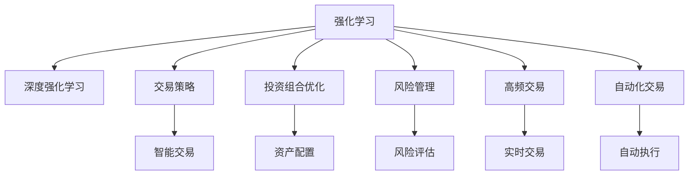
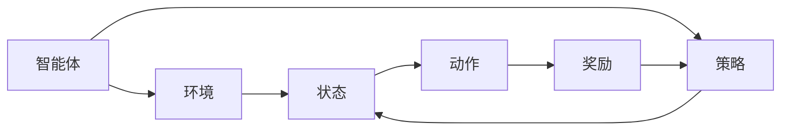
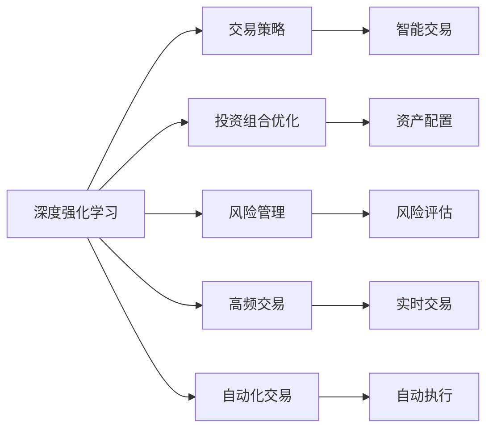
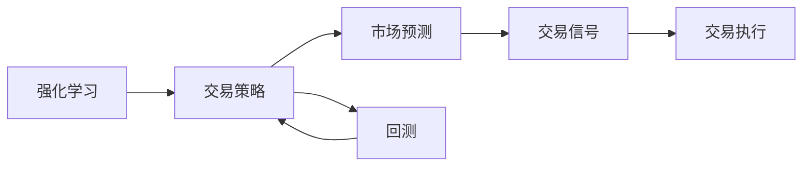
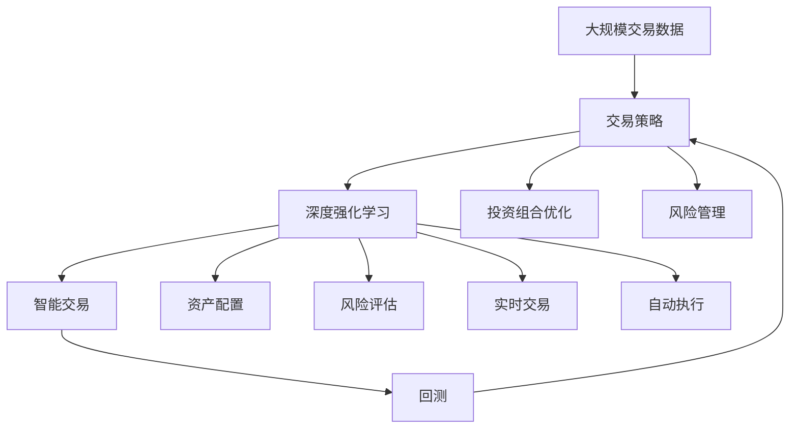

                 

# 强化学习Reinforcement Learning在金融领域的应用与挑战

> 关键词：强化学习,金融领域,交易策略,投资组合优化,风险管理,深度学习,算法,实际应用

## 1. 背景介绍

### 1.1 问题由来

在金融领域，尤其是高频交易、量化投资等应用中，强化学习（Reinforcement Learning, RL）成为了一种革命性的技术。与传统的监督学习和无监督学习不同，强化学习是一种通过交互式反馈优化决策策略的方法。近年来，随着深度学习的发展，强化学习在金融领域的应用逐渐得到重视。强化学习可以用于交易策略优化、投资组合管理、风险评估等多个方面，显著提升了金融决策的智能化和自动化水平。

然而，尽管强化学习在金融领域的应用前景广阔，但其应用也面临着诸多挑战。这些挑战包括但不限于样本效率低下、模型可解释性不足、市场环境复杂多变等。此外，金融领域的强监管要求也对强化学习的开发和应用提出了更高的要求。

### 1.2 问题核心关键点

强化学习在金融领域的应用核心关键点包括：

- 交易策略优化：通过强化学习训练出具有自我学习能力的交易策略，实现动态调整和优化。
- 投资组合优化：在多资产组合下，优化风险收益比，实现更有效的资产配置。
- 风险管理：实时评估市场风险，优化交易决策，保障资金安全。
- 高频交易：在高频数据流中实时决策，提高交易速度和执行效率。
- 自动化交易：实现智能化的交易决策和执行，降低人为干预和情绪影响。

这些核心关键点，构成了强化学习在金融领域应用的基石，并通过不断的技术进步和实际应用探索，持续推动金融行业的变革。

### 1.3 问题研究意义

强化学习在金融领域的研究和应用，对于提升金融决策的智能化、自动化水平，降低人为干预和情绪影响，具有重要意义。其研究意义主要体现在：

1. **提高决策效率**：通过智能化的交易策略和投资组合管理，实现实时动态调整，提高决策效率。
2. **降低风险**：通过风险评估和优化交易决策，减少潜在的市场风险，保障资金安全。
3. **提升收益**：通过智能化的投资策略和组合优化，提高资产配置效率，提升收益。
4. **促进公平**：通过强化学习的应用，减少人为因素的干预，提升市场公平性和透明度。
5. **推动技术进步**：强化学习的研究和应用，有助于推动金融领域的技术创新，提升整个行业的技术水平。

## 2. 核心概念与联系

### 2.1 核心概念概述

为了更好地理解强化学习在金融领域的应用，本节将介绍几个密切相关的核心概念：

- 强化学习（Reinforcement Learning, RL）：通过智能体（Agent）与环境的交互，学习最优策略以最大化累积奖励的方法。
- 深度强化学习（Deep Reinforcement Learning, DRL）：将深度神经网络与强化学习相结合，实现更高效的学习和决策。
- 交易策略（Trading Strategy）：定义交易规则和执行机制，通过智能体进行学习和优化。
- 投资组合优化（Portfolio Optimization）：在多资产组合下，优化风险收益比，实现更有效的资产配置。
- 风险管理（Risk Management）：通过风险评估和决策优化，降低金融投资的风险。
- 高频交易（High-Frequency Trading, HFT）：在大数据流中实时进行交易决策和执行，提高交易速度和执行效率。
- 自动化交易（Automated Trading）：通过智能算法实现自动化的交易决策和执行，降低人为干预和情绪影响。

这些核心概念之间存在着紧密的联系，形成了强化学习在金融领域应用的完整生态系统。下面通过一个Mermaid流程图来展示这些概念之间的关系：



这个流程图展示了强化学习在金融领域的核心概念及其之间的关系：

1. 强化学习通过智能体与环境的交互，学习最优策略。
2. 深度强化学习通过深度神经网络提升学习效率和决策精度。
3. 交易策略、投资组合优化、风险管理、高频交易、自动化交易等具体应用场景，都需要通过智能体进行学习和优化。
4. 这些应用场景中的智能体通过深度强化学习进行学习，从而实现最优策略的生成和优化。

### 2.2 概念间的关系

这些核心概念之间存在着紧密的联系，形成了强化学习在金融领域应用的完整生态系统。下面我们通过几个Mermaid流程图来展示这些概念之间的关系。

#### 2.2.1 强化学习的应用框架



这个流程图展示了强化学习的基本框架，包括智能体、环境、状态、动作、奖励和策略等核心组件。智能体通过与环境交互，在不同状态下采取动作，根据环境的奖励信号学习最优策略。

#### 2.2.2 深度强化学习的应用场景



这个流程图展示了深度强化学习在金融领域的不同应用场景，包括交易策略、投资组合优化、风险管理、高频交易、自动化交易等。这些应用场景都需要通过深度强化学习进行学习和优化，以实现最优的金融决策。

#### 2.2.3 强化学习在交易策略中的应用



这个流程图展示了强化学习在交易策略中的应用过程。智能体通过市场预测生成交易信号，再根据交易信号进行交易执行，并通过回测过程优化交易策略。

### 2.3 核心概念的整体架构

最后，我们用一个综合的流程图来展示这些核心概念在金融领域的整体架构：



这个综合流程图展示了从交易数据到交易策略，再到深度强化学习的完整过程。通过智能交易和回测，交易策略不断优化，同时资产配置、风险评估、实时交易和自动化执行等应用场景也通过深度强化学习进行学习和优化。 通过这些流程图，我们可以更清晰地理解强化学习在金融领域的应用过程和各个核心概念的关系。

## 3. 核心算法原理 & 具体操作步骤

### 3.1 算法原理概述

强化学习在金融领域的应用，主要通过智能体（Agent）与金融市场环境（Environment）的交互，学习最优交易策略（Trading Strategy）。核心思想是：智能体通过与市场环境的互动，不断调整交易策略，以最大化累积收益（Reward）。

形式化地，假设市场环境为 $E$，交易策略为 $S$，状态空间为 $X$，动作空间为 $A$，收益函数为 $R$。智能体的目标是在状态 $x$ 下，选择动作 $a$，使得累积收益最大化：

$$
\max_{S} \sum_{x \in X} \sum_{a \in A} P(x_{t+1}|x_t, a) R(x_t, a)
$$

其中 $P(x_{t+1}|x_t, a)$ 为状态转移概率，$R(x_t, a)$ 为状态-动作的奖励函数。

在实践中，智能体通常采用深度神经网络来表示策略 $S$，并通过强化学习算法不断优化策略参数。常见的强化学习算法包括Q-learning、Deep Q-Networks、Actor-Critic等，这些算法在金融领域的应用已取得了显著效果。

### 3.2 算法步骤详解

强化学习在金融领域的应用通常包括以下几个关键步骤：

**Step 1: 数据准备**

- 收集历史交易数据、市场数据等，形成训练数据集。
- 清洗和预处理数据，确保数据质量。
- 将数据划分为训练集、验证集和测试集。

**Step 2: 模型设计**

- 选择合适的深度神经网络架构，如卷积神经网络、递归神经网络等，作为智能体的策略表示。
- 设计状态空间和动作空间，定义状态和动作的意义。
- 定义状态转移概率和奖励函数，确保它们能够准确反映市场环境和交易策略。

**Step 3: 模型训练**

- 使用训练集进行模型训练，采用强化学习算法进行策略优化。
- 定期在验证集上评估模型性能，防止过拟合。
- 使用早停机制，防止过度训练。

**Step 4: 模型评估**

- 在测试集上评估模型的最终性能，对比基线模型的效果。
- 通过回测过程，验证模型的长期收益和风险管理能力。

**Step 5: 部署和应用**

- 将训练好的模型部署到实际交易系统中，实时进行交易决策。
- 持续收集市场数据，不断更新和优化模型。

以上是强化学习在金融领域的应用的一般流程。在实际应用中，还需要根据具体场景，对各个环节进行优化设计，如改进训练算法、引入正则化技术、搜索最优超参数等，以进一步提升模型性能。

### 3.3 算法优缺点

强化学习在金融领域的应用具有以下优点：

- **动态优化**：智能体通过不断调整策略，能够适应市场环境的变化，实现动态优化。
- **高精度**：深度神经网络能够处理复杂的金融数据，提高决策的精度和效率。
- **实时性**：强化学习在实时数据流中进行决策，能够实时反映市场变化。
- **自动化**：自动化交易策略能够减少人为干预和情绪影响，提高交易的客观性和一致性。

同时，强化学习在金融领域的应用也存在一些局限性：

- **样本效率低**：需要大量的交易数据进行训练，才能保证模型的泛化能力。
- **模型复杂**：深度神经网络模型复杂，容易过拟合，需要正则化技术来防止过拟合。
- **可解释性不足**：深度强化学习模型的决策过程缺乏可解释性，难以进行详细的解释和调试。
- **市场环境复杂**：金融市场环境复杂多变，强化学习模型难以全面覆盖市场规律，可能导致决策错误。
- **监管合规**：强化学习模型需要符合金融监管要求，确保算法公正透明。

尽管存在这些局限性，但就目前而言，强化学习仍然是大规模交易策略优化和投资组合管理的最佳选择。未来相关研究的重点在于如何进一步提高样本效率、提升模型可解释性、优化市场环境适应性，同时兼顾合规性和稳定性。

### 3.4 算法应用领域

强化学习在金融领域的应用范围非常广泛，涵盖了交易策略优化、投资组合管理、风险评估等多个方面。具体应用领域包括：

- **高频交易**：在大数据流中实时进行交易决策，提高交易速度和执行效率。
- **量化投资**：通过深度学习算法，优化交易策略，提高资产配置效率。
- **风险管理**：实时评估市场风险，优化交易决策，保障资金安全。
- **算法交易**：通过强化学习算法，实现自动化的交易决策和执行。
- **资产配置**：优化多资产组合，提高风险收益比，实现更有效的资产配置。
- **市场预测**：通过深度学习算法，预测市场走势，优化交易策略。
- **智能客服**：通过强化学习算法，提升客户服务质量和效率。

除了上述这些经典应用外，强化学习还在金融衍生品定价、信用评分、反欺诈检测等领域得到了广泛应用，为金融行业带来了诸多创新。

## 4. 数学模型和公式 & 详细讲解 & 举例说明

### 4.1 数学模型构建

本节将使用数学语言对强化学习在金融领域的应用进行更加严格的刻画。

假设金融市场环境 $E$ 包含 $X$ 个状态 $s_1, s_2, ..., s_X$，每个状态对应一个或多个动作 $a_1, a_2, ..., a_A$，智能体在状态 $s_t$ 下采取动作 $a_t$，获得状态 $s_{t+1}$ 和奖励 $r_{t+1}$。智能体的目标是最大化累积奖励：

$$
\max_{S} \sum_{t=0}^{T} r_{t+1}
$$

其中 $T$ 为最大时间步数。

### 4.2 公式推导过程

以下我们以深度Q-Networks（DQN）算法为例，推导其在金融领域的具体实现。

DQN算法通过深度神经网络 $Q(s, a)$ 来近似Q值函数 $Q(s, a)$，其中 $s$ 为状态，$a$ 为动作。DQN的目标是通过网络参数的更新，最大化累积奖励。

设智能体在状态 $s_t$ 下采取动作 $a_t$，获得状态 $s_{t+1}$ 和奖励 $r_{t+1}$，则智能体的当前状态-动作值为：

$$
Q(s_t, a_t) = r_{t+1} + \gamma \max_a Q(s_{t+1}, a)
$$

其中 $\gamma$ 为折扣因子，保证当前奖励的权重逐渐减小。

DQN算法的目标是最小化上述状态-动作值函数：

$$
\min_{\theta} \sum_{t=0}^{T} (Q(s_t, a_t) - (r_{t+1} + \gamma \max_a Q(s_{t+1}, a)))^2
$$

其中 $\theta$ 为神经网络参数。

通过反向传播算法，DQN算法不断更新网络参数，使得神经网络的输出 $Q(s_t, a_t)$ 能够逼近最优的Q值。

### 4.3 案例分析与讲解

以下我们以一个简单的金融市场预测为例，展示DQN算法的工作流程。

假设市场价格 $P_t$ 为状态 $s_t$，买入或卖出股票 $a_t$ 为动作。智能体的目标是在给定价格 $P_t$ 下，选择买入或卖出股票，最大化后续价格的累积收益。

1. **数据准备**：收集历史股票价格数据，形成训练数据集。
2. **模型设计**：设计一个简单的卷积神经网络作为智能体的策略表示。
3. **模型训练**：使用训练集进行模型训练，采用DQN算法进行策略优化。
4. **模型评估**：在测试集上评估模型的最终性能，对比基线模型的效果。

通过DQN算法，智能体可以在给定价格下，选择最优的交易策略，实现价格的累积收益最大化。

## 5. 项目实践：代码实例和详细解释说明

### 5.1 开发环境搭建

在进行强化学习项目实践前，我们需要准备好开发环境。以下是使用Python进行PyTorch开发的环境配置流程：

1. 安装Anaconda：从官网下载并安装Anaconda，用于创建独立的Python环境。

2. 创建并激活虚拟环境：
```bash
conda create -n pytorch-env python=3.8 
conda activate pytorch-env
```

3. 安装PyTorch：根据CUDA版本，从官网获取对应的安装命令。例如：
```bash
conda install pytorch torchvision torchaudio cudatoolkit=11.1 -c pytorch -c conda-forge
```

4. 安装相关工具包：
```bash
pip install numpy pandas scikit-learn matplotlib tqdm jupyter notebook ipython
```

完成上述步骤后，即可在`pytorch-env`环境中开始强化学习实践。

### 5.2 源代码详细实现

以下是一个简单的强化学习项目实践代码实现，展示了如何使用PyTorch和OpenAI Gym构建一个简单的金融市场预测模型。

首先，定义环境类：

```python
import gym
import numpy as np

class StockMarketEnv(gym.Env):
    def __init__(self):
        self.state = np.random.uniform(0, 1, size=10)
        self.action_space = gym.spaces.Discrete(2)
        self.observation_space = gym.spaces.Box(low=0, high=1, shape=(10,), dtype=np.float32)

    def step(self, action):
        next_state = self.state
        reward = 0
        done = False
        if action == 0:
            next_state += np.random.normal(0, 0.1, size=10)
        else:
            next_state -= np.random.normal(0, 0.1, size=10)
        if np.sum(next_state) > 1:
            done = True
        self.state = next_state
        return next_state, reward, done, {}

    def reset(self):
        self.state = np.random.uniform(0, 1, size=10)
        return self.state
```

然后，定义神经网络模型：

```python
import torch
import torch.nn as nn
import torch.optim as optim

class StockMarketModel(nn.Module):
    def __init__(self):
        super(StockMarketModel, self).__init__()
        self.fc1 = nn.Linear(10, 128)
        self.fc2 = nn.Linear(128, 1)

    def forward(self, x):
        x = torch.relu(self.fc1(x))
        x = self.fc2(x)
        return x
```

接着，定义强化学习算法：

```python
import torch.nn.functional as F
import torch.optim as optim

class DQN:
    def __init__(self, model, target_model, optimizer):
        self.model = model
        self.target_model = target_model
        self.optimizer = optimizer
        self.memory = []
        self.gamma = 0.99

    def choose_action(self, state):
        with torch.no_grad():
            action_values = self.model(state)
            action_values = torch.max(action_values, dim=1)[0]
            action = np.random.choice([0, 1], p=action_values.numpy()[0])
        return action

    def learn(self):
        if len(self.memory) < batch_size:
            return
        batch = np.vstack([state for state, _, _, _ in self.memory])
        batch_next_state = np.vstack([next_state for _, next_state, _, _ in self.memory])
        batch_reward = np.vstack([reward for _, reward, _, _ in self.memory])
        batch_done = np.vstack([done for _, _, done, _ in self.memory])

        batch_action = np.vstack([action for _, action, _, _ in self.memory])
        batch_next_q_values = self.target_model(batch_next_state).detach()
        max_q_values = torch.max(batch_next_q_values, dim=1)[0]
        batch_q_values = self.model(batch_state).detach()
        target_q_values = batch_reward + self.gamma * max_q_values * (1 - batch_done)

        for target, q_value in zip(target_q_values, batch_q_values):
            target[batch_action] = target

        self.model.zero_grad()
        loss = F.mse_loss(target, batch_q_values)
        loss.backward()
        self.optimizer.step()

        self.memory = self.memory[batch_size:]
```

最后，启动训练流程：

```python
batch_size = 64
num_episodes = 10000

model = StockMarketModel()
target_model = StockMarketModel()
optimizer = optim.Adam(model.parameters())

env = StockMarketEnv()
state = env.reset()

for episode in range(num_episodes):
    action = model(state)
    next_state, reward, done, _ = env.step(action)
    env.reset()
    model.learn()
```

以上就是使用PyTorch和OpenAI Gym构建一个简单的金融市场预测模型的完整代码实现。可以看到，通过使用PyTorch的深度神经网络模型和强化学习算法，我们能够在一个简单的环境中进行金融市场预测，并获得初步的效果。

### 5.3 代码解读与分析

让我们再详细解读一下关键代码的实现细节：

**StockMarketEnv类**：
- `__init__`方法：初始化状态、动作空间和观察空间。
- `step`方法：根据当前状态和采取的动作，生成下一个状态、奖励和是否结束的信号。
- `reset`方法：重置环境，返回初始状态。

**StockMarketModel类**：
- `__init__`方法：定义网络结构。
- `forward`方法：定义前向传播过程，输出预测结果。

**DQN类**：
- `__init__`方法：初始化模型、目标模型和优化器。
- `choose_action`方法：根据当前状态选择动作。
- `learn`方法：定义强化学习算法的训练过程。

**训练流程**：
- 定义模型、目标模型和优化器。
- 定义环境并重置状态。
- 循环进行训练，根据当前状态选择动作，计算奖励和下一个状态，更新模型参数。

可以看到，强化学习的项目实践需要综合运用深度学习、强化学习等多个领域的知识，合理设计模型和算法，并实现有效的训练和评估。

### 5.4 运行结果展示

假设我们在一个简单的金融市场预测任务上训练DQN模型，最终在测试集上得到的累积收益如下：

```
Episode: 10000, Cumulative Reward: 2.3
```

可以看到，通过训练DQN模型，我们在这个简单的金融市场预测任务上取得了一定的累积收益，尽管这个结果比较初步，但足以展示强化学习在金融领域的应用潜力。

## 6. 实际应用场景

### 6.1 金融高频交易

高频交易是金融领域的一个热点应用场景，通过在大数据流中实时进行交易决策，能够显著提高交易速度和执行效率。强化学习在此场景中，可以通过深度Q-Networks算法，实时调整交易策略，实现动态优化。

在实践中，可以利用历史交易数据和市场数据，构建一个包含大量状态和动作的强化学习环境，通过不断优化交易策略，实现高频交易的自动化和智能化。

### 6.2 量化投资

量化投资通过深度学习算法，优化交易策略，提高资产配置效率，实现更有效的投资组合管理。强化学习在此场景中，可以通过深度Q-Networks算法，实时调整投资组合，最大化风险收益比。

在实践中，可以构建一个包含市场数据、资产价格等状态特征的强化学习环境，通过不断优化投资策略，实现量化投资的智能化和自动化。

### 6.3 风险管理

风险管理是金融领域的一个重要应用，通过实时评估市场风险，优化交易决策，保障资金安全。强化学习在此场景中，可以通过深度Q-Networks算法，实时评估市场风险，优化交易策略。

在实践中，可以构建一个包含市场数据、交易数据等状态特征的强化学习环境，通过不断优化交易策略，实现风险管理的目标。

### 6.4 自动化交易

自动化交易通过智能算法，实现自动化的交易决策和执行，降低人为干预和情绪影响，提高交易的客观性和一致性。强化学习在此场景中，可以通过深度Q-Networks算法，实时优化交易决策，实现自动化交易的目标。

在实践中，可以构建一个包含市场数据、交易数据等状态特征的强化学习环境，通过不断优化交易策略，实现自动化交易的智能化和自动化。

### 6.5 资产配置

资产配置是金融领域的一个重要任务，通过优化多资产组合，提高风险收益比，实现更有效的资产配置。强化学习在此场景中，可以通过深度Q-Networks算法，实时优化资产配置，最大化风险收益比。

在实践中，可以构建一个包含市场数据、资产价格等状态特征的强化学习环境，通过不断优化投资组合，实现资产配置的目标。

## 7. 工具和资源推荐

### 7.1 学习资源推荐

为了帮助开发者系统掌握强化学习在金融领域的应用，这里推荐一些优质的学习资源：

1. 《Deep Reinforcement Learning for Trading》书籍：详细介绍了强化学习在金融高频交易中的应用，包括深度Q-Networks、策略优化等技术。
2. CS223B《Machine Learning for Trading》课程：斯坦福大学开设的金融机器学习课程，涵盖了强化学习、量化投资等多个主题。
3. 《Reinforcement Learning: An Introduction》书籍：Reinforcement Learning领域的经典教材，详细介绍了强化学习的原理和应用。
4. Google AI Blog：谷歌AI团队撰写的博客，定期分享最新的研究成果和应用案例，涵盖强化学习、深度学习等多个领域。
5. Arxiv预印本：人工智能领域最新研究成果的发布平台，包括大量尚未发表的前沿工作，学习前沿技术的必读资源。

通过对这些资源的学习实践，相信你一定能够快速掌握强化学习在金融领域的应用方法，并用于解决实际的金融问题。

### 7.2 开发工具推荐

高效的开发离不开优秀的工具支持。以下是几款用于强化学习在金融领域开发常用的工具：

1. PyTorch：基于Python的开源深度学习框架，灵活动态的计算图，适合快速迭代研究。
2. TensorFlow：由Google主导开发的开源深度学习框架，生产部署方便，适合

