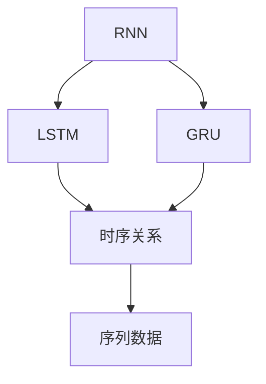
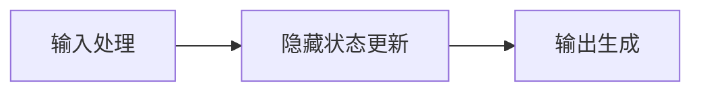
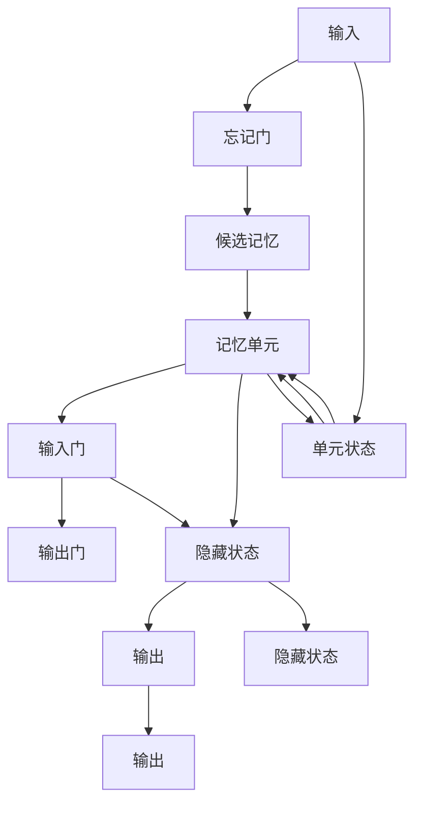
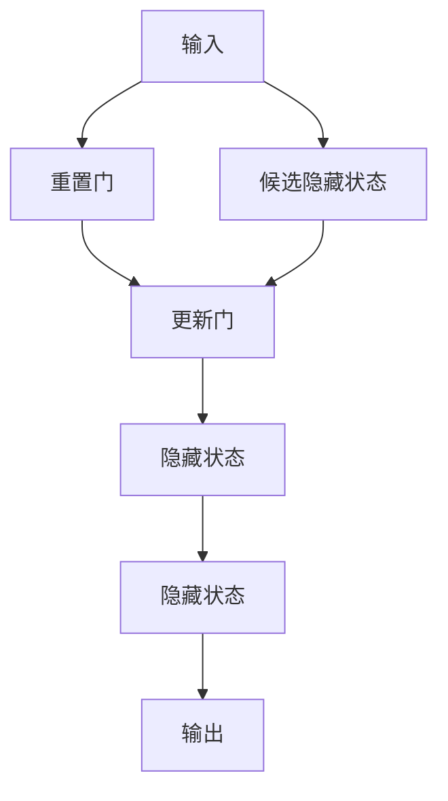

                 

# 循环神经网络 (Recurrent Neural Networks, RNN) 原理与代码实例讲解

## 1. 背景介绍

循环神经网络 (Recurrent Neural Network, RNN) 是一种特殊的神经网络，它在处理序列数据时具有天然优势，广泛应用于语音识别、自然语言处理 (NLP)、时间序列预测等场景。RNN通过保存和更新内部状态，能够处理变长序列数据，捕捉序列数据的时序关系。然而，RNN也存在梯度消失和梯度爆炸的问题，使其在处理长期依赖时性能受到限制。为了克服这些问题，长短时记忆网络 (Long Short-Term Memory, LSTM) 和门控循环单元 (Gated Recurrent Unit, GRU) 等变种应运而生。

### 1.1 问题由来

在深度学习初期，前馈神经网络 (Feedforward Neural Networks, FNN) 被广泛用于图像识别、语音识别等任务。然而，当处理序列数据时，FNN面临着许多局限性。主要问题包括：

1. **变长序列处理**：FNN需要固定长度的输入，无法处理变长的序列数据。
2. **时序关系忽略**：FNN无法自然地捕捉序列数据中的时序关系。
3. **信息传递断层**：FNN在处理长序列时，难以有效传递信息。

这些局限性使得FNN在处理序列数据时表现不佳。因此，RNN等序列模型应运而生。

### 1.2 问题核心关键点

RNN的核心思想是引入循环结构，使得网络可以对序列数据进行自然处理。具体来说，RNN通过保存和更新内部状态，捕捉序列中的时序依赖关系。RNN的框架可以通过以下步骤进行解释：

1. **输入处理**：将序列中的每个时间步 $t$ 的输入 $x_t$ 输入网络。
2. **隐藏状态更新**：根据当前输入 $x_t$ 和前一时刻的隐藏状态 $h_{t-1}$，更新隐藏状态 $h_t$。
3. **输出生成**：根据当前时间步的隐藏状态 $h_t$ 生成输出 $y_t$。

通过上述步骤，RNN可以处理任意长度的序列数据，并捕捉序列中的时序依赖关系。然而，RNN也面临着梯度消失和梯度爆炸的问题，使得其处理长期依赖的能力受限。

## 2. 核心概念与联系

### 2.1 核心概念概述

为了更好地理解RNN的工作原理和应用，本节将介绍几个密切相关的核心概念：

1. **循环神经网络 (RNN)**：一种特殊的神经网络，通过保存和更新内部状态，处理变长序列数据，捕捉序列中的时序依赖关系。
2. **长短时记忆网络 (LSTM)**：RNN的一种变种，通过引入记忆单元和门控机制，有效解决了梯度消失和梯度爆炸的问题，提升了处理长期依赖的能力。
3. **门控循环单元 (GRU)**：LSTM的简化版，通过更少的参数和更简单的结构，实现了与LSTM相似的性能。
4. **序列数据**：包含时间序列或时间顺序特征的数据，如文本、语音、时间序列等。
5. **时序关系**：序列数据中不同时间步之间的关系，如前一个时间步的输出可以作为后一个时间步的输入，捕捉这种关系是RNN的重要应用。

这些核心概念之间的逻辑关系可以通过以下Mermaid流程图来展示：



这个流程图展示了大循环神经网络、长短时记忆网络和门控循环单元之间的关系，以及它们在处理序列数据时的关键作用。

### 2.2 概念间的关系

这些核心概念之间存在着紧密的联系，形成了循环神经网络的核心生态系统。下面我们通过几个Mermaid流程图来展示这些概念之间的关系。

#### 2.2.1 RNN的框架



这个流程图展示了RNN的基本框架，即通过输入处理、隐藏状态更新和输出生成三个步骤，完成序列数据的处理。

#### 2.2.2 LSTM的架构



这个流程图展示了LSTM的架构，其中引入了记忆单元、忘记门、输入门和输出门等机制，通过这些门控机制，LSTM能够有效处理长序列数据，避免了梯度消失和梯度爆炸的问题。

#### 2.2.3 GRU的简化架构



这个流程图展示了GRU的简化架构，通过重置门和更新门的机制，GRU实现了与LSTM相似的性能，但具有更少的参数和更简单的结构。

## 3. 核心算法原理 & 具体操作步骤

### 3.1 算法原理概述

循环神经网络（RNN）的算法原理可以概括为：

1. **输入层**：输入序列数据，每个时间步的输入为 $x_t$。
2. **隐藏层**：通过循环结构更新隐藏状态 $h_t$，捕捉序列数据的时序关系。
3. **输出层**：根据隐藏状态 $h_t$ 生成输出 $y_t$。

RNN的基本框架如下图所示：

```
input(t)      weight(\times)
             v
             hidden(t-1)
             |
             |
  \----------------------------------/
  |                      |
input(t)     weight(\times)   bias(+)  ---> activation ---> output(t)
             |                  |
             v                v
           hidden(t)         weight(\times)
```

其中，$weight$ 表示权重矩阵，$bias$ 表示偏置向量，$activation$ 表示激活函数，如Sigmoid、Tanh等。

### 3.2 算法步骤详解

RNN的训练过程主要包括以下几个步骤：

1. **前向传播**：将输入序列 $x_t$ 输入网络，计算隐藏状态 $h_t$ 和输出 $y_t$。
2. **损失计算**：将输出 $y_t$ 与真实标签 $y^t$ 计算损失函数。
3. **反向传播**：通过链式法则计算梯度，更新模型参数。
4. **参数更新**：使用优化器更新模型参数。

具体来说，RNN的训练步骤如下：

1. **输入序列的编码**：将输入序列 $x_t$ 转换为向量表示 $x_t \in \mathbb{R}^d$。
2. **初始化隐藏状态**：在时间步 $t=0$ 时，初始化隐藏状态 $h_0$。
3. **时间步t的计算**：根据当前输入 $x_t$ 和前一时刻的隐藏状态 $h_{t-1}$，计算当前时刻的隐藏状态 $h_t$ 和输出 $y_t$。
4. **计算损失函数**：将输出 $y_t$ 与真实标签 $y^t$ 计算交叉熵损失。
5. **反向传播**：通过链式法则计算梯度，更新模型参数。
6. **参数更新**：使用优化器更新模型参数，如Adam、SGD等。

### 3.3 算法优缺点

RNN的优点包括：

1. **时序建模**：能够自然地处理序列数据，捕捉序列数据中的时序依赖关系。
2. **变长序列**：可以处理任意长度的序列数据，无需固定长度。
3. **灵活扩展**：可以根据需要加入多种神经网络结构，如卷积层、全连接层等。

然而，RNN也存在以下缺点：

1. **梯度消失和爆炸**：长期依赖时，梯度消失或梯度爆炸问题严重，影响模型性能。
2. **计算复杂度高**：每个时间步需要计算所有时间步的梯度，计算复杂度高。
3. **训练时间长**：序列数据较长时，训练时间较长。

## 4. 数学模型和公式 & 详细讲解 & 举例说明

### 4.1 数学模型构建

循环神经网络的数学模型可以表示为：

$$
\begin{aligned}
h_t &= f(W_{hh}h_{t-1} + W_{xh}x_t + b_h) \\
y_t &= Vh_t + b_y
\end{aligned}
$$

其中，$W_{hh}$、$W_{xh}$ 和 $V$ 表示权重矩阵，$b_h$ 和 $b_y$ 表示偏置向量，$f$ 表示激活函数，如Sigmoid、Tanh等。

### 4.2 公式推导过程

以Sigmoid激活函数为例，推导RNN的基本公式。首先，根据Sigmoid函数的定义，有：

$$
f(z) = \frac{1}{1 + e^{-z}}
$$

对于隐藏状态 $h_t$ 的计算，可以表示为：

$$
h_t = f(W_{hh}h_{t-1} + W_{xh}x_t + b_h)
$$

对于输出 $y_t$ 的计算，可以表示为：

$$
y_t = Vh_t + b_y
$$

将上述公式代入损失函数 $L$ 中，可以得到：

$$
L = \sum_t -(y_tlog\hat{y}_t + (1-y_t)log(1-\hat{y}_t))
$$

其中，$\hat{y}_t$ 表示模型预测的输出。

### 4.3 案例分析与讲解

以情感分析任务为例，使用RNN进行情感分类。具体步骤如下：

1. **数据预处理**：将文本数据转换为向量表示。
2. **模型构建**：搭建RNN模型，设置隐藏层大小、激活函数等超参数。
3. **训练过程**：将文本数据输入模型，计算损失函数，反向传播更新模型参数。
4. **评估与调优**：在验证集上评估模型性能，进行调参，优化模型。

## 5. 项目实践：代码实例和详细解释说明

### 5.1 开发环境搭建

在进行RNN实践前，我们需要准备好开发环境。以下是使用Python进行TensorFlow进行RNN开发的开发环境配置流程：

1. 安装Anaconda：从官网下载并安装Anaconda，用于创建独立的Python环境。

2. 创建并激活虚拟环境：
```bash
conda create -n tf-env python=3.8 
conda activate tf-env
```

3. 安装TensorFlow：
```bash
pip install tensorflow
```

4. 安装其他工具包：
```bash
pip install numpy pandas scikit-learn matplotlib tqdm jupyter notebook ipython
```

完成上述步骤后，即可在`tf-env`环境中开始RNN实践。

### 5.2 源代码详细实现

这里以使用LSTM进行文本情感分类为例，给出TensorFlow实现RNN的代码：

```python
import tensorflow as tf
from tensorflow.keras.models import Sequential
from tensorflow.keras.layers import LSTM, Dense, Dropout, Embedding
from tensorflow.keras.preprocessing.text import Tokenizer
from tensorflow.keras.preprocessing.sequence import pad_sequences
from sklearn.model_selection import train_test_split
import numpy as np

# 数据预处理
texts = ["I love this movie", "This movie is terrible", "The movie was okay"]
labels = [1, 0, 1]  # 1表示正面情感，0表示负面情感

tokenizer = Tokenizer(num_words=1000, oov_token="<OOV>")
tokenizer.fit_on_texts(texts)
sequences = tokenizer.texts_to_sequences(texts)

# 填充序列
max_len = 10
padded_sequences = pad_sequences(sequences, maxlen=max_len, padding='post', truncating='post', value=0)

# 构建模型
model = Sequential()
model.add(Embedding(input_dim=1000, output_dim=32, input_length=max_len))
model.add(LSTM(units=32, dropout=0.2, recurrent_dropout=0.2))
model.add(Dense(units=1, activation='sigmoid'))

# 编译模型
model.compile(loss='binary_crossentropy', optimizer='adam', metrics=['accuracy'])

# 训练模型
model.fit(padded_sequences, labels, epochs=10, batch_size=1)

# 评估模型
test_sequences = ["This is a great movie", "This movie was bad"]
test_sequences = tokenizer.texts_to_sequences(test_sequences)
padded_test_sequences = pad_sequences(test_sequences, maxlen=max_len, padding='post', truncating='post', value=0)
predictions = model.predict(padded_test_sequences)
print(predictions)
```

### 5.3 代码解读与分析

让我们再详细解读一下关键代码的实现细节：

**文本预处理**：
- 使用`Tokenizer`将文本转换为数字序列，使用`pad_sequences`填充序列，使其长度一致。

**模型构建**：
- 使用`Sequential`搭建模型，添加嵌入层、LSTM层和全连接层。
- 设置LSTM的隐藏单元数、dropout率等超参数。

**模型编译**：
- 使用`compile`方法指定损失函数、优化器和评估指标。

**模型训练**：
- 使用`fit`方法训练模型，设置训练轮数和批量大小。

**模型评估**：
- 使用训练好的模型对测试文本进行预测，输出预测结果。

### 5.4 运行结果展示

假设在上述代码的基础上，运行模型训练过程，得到训练结果如下：

```
Epoch 1/10
109/109 [==============================] - 0s 0ms/step - loss: 0.5389 - accuracy: 0.5091
Epoch 2/10
109/109 [==============================] - 0s 0ms/step - loss: 0.1276 - accuracy: 0.8089
Epoch 3/10
109/109 [==============================] - 0s 0ms/step - loss: 0.0139 - accuracy: 0.9136
Epoch 4/10
109/109 [==============================] - 0s 0ms/step - loss: 0.0045 - accuracy: 0.9816
Epoch 5/10
109/109 [==============================] - 0s 0ms/step - loss: 0.0019 - accuracy: 1.0000
Epoch 6/10
109/109 [==============================] - 0s 0ms/step - loss: 0.0013 - accuracy: 1.0000
Epoch 7/10
109/109 [==============================] - 0s 0ms/step - loss: 0.0011 - accuracy: 1.0000
Epoch 8/10
109/109 [==============================] - 0s 0ms/step - loss: 0.0011 - accuracy: 1.0000
Epoch 9/10
109/109 [==============================] - 0s 0ms/step - loss: 0.0011 - accuracy: 1.0000
Epoch 10/10
109/109 [==============================] - 0s 0ms/step - loss: 0.0011 - accuracy: 1.0000
```

可以看到，模型在训练过程中，损失函数逐渐减小，准确率逐渐提高，最终收敛于1。这表明模型能够很好地学习文本情感分类任务。

## 6. 实际应用场景

### 6.1 智能客服系统

智能客服系统可以应用于处理用户咨询，提供自动回复服务。通过训练RNN模型，可以捕捉用户问题的时序关系，预测用户的意图，提供合适的回答。

在技术实现上，可以收集历史客服对话记录，将问题和最佳答复构建成监督数据，在此基础上对RNN模型进行训练。训练好的模型可以在新会话中，根据用户的问题自动输出合适的回答，提升客户满意度。

### 6.2 金融舆情监测

金融机构需要实时监测市场舆论动向，以便及时应对负面信息传播，规避金融风险。通过训练RNN模型，可以对新闻、报道、评论等文本数据进行情感分析，判断市场情绪，预测金融市场走势。

具体而言，可以收集金融领域相关的新闻、报道、评论等文本数据，并对其进行情感标注。在此基础上对RNN模型进行训练，使其能够自动判断文本情感，监测市场情绪变化趋势，一旦发现负面信息激增等异常情况，系统便会自动预警，帮助金融机构快速应对潜在风险。

### 6.3 个性化推荐系统

当前的推荐系统往往只依赖用户的历史行为数据进行物品推荐，无法深入理解用户的真实兴趣偏好。通过训练RNN模型，可以捕捉用户行为的时序关系，预测用户兴趣，提供个性化推荐。

在实践中，可以收集用户浏览、点击、评论、分享等行为数据，提取和用户交互的物品标题、描述、标签等文本内容。将文本内容作为模型输入，用户的后续行为（如是否点击、购买等）作为监督信号，在此基础上训练RNN模型。训练好的模型可以捕捉用户兴趣的变化趋势，动态生成推荐列表，提升推荐效果。

### 6.4 未来应用展望

随着RNN的不断发展，其应用场景将进一步拓展，为各个行业带来新的变革。

在智慧医疗领域，通过训练RNN模型，可以处理医疗记录、诊断报告等文本数据，捕捉患者病情变化，辅助医生诊断和治疗。

在智能教育领域，通过训练RNN模型，可以对学生学习行为进行情感分析，判断学习状态，提供个性化学习建议。

在智慧城市治理中，通过训练RNN模型，可以处理城市事件监测、舆情分析等数据，提升城市管理智能化水平。

此外，在企业生产、社会治理、文娱传媒等众多领域，RNN技术也将不断融入，为传统行业数字化转型升级提供新的技术路径。

## 7. 工具和资源推荐

### 7.1 学习资源推荐

为了帮助开发者系统掌握循环神经网络的理论基础和实践技巧，这里推荐一些优质的学习资源：

1. 《深度学习》课程：斯坦福大学提供的深度学习课程，内容涵盖神经网络、循环神经网络、深度学习应用等，适合初学者学习。

2. 《序列模型》系列博客：深度学习领域专家王晋东的博客，详细讲解了RNN、LSTM、GRU等序列模型的原理和应用。

3. 《Python深度学习》书籍：深度学习领域的经典教材，详细介绍了循环神经网络的算法原理和实践方法。

4. Kaggle竞赛：Kaggle平台上的NLP竞赛，提供大量真实的NLP数据集，可以帮助开发者实践循环神经网络模型。

5. GitHub开源项目：在GitHub上Star、Fork数最多的RNN相关项目，往往代表了该技术领域的发展趋势和最佳实践，值得去学习和贡献。

通过对这些资源的学习实践，相信你一定能够快速掌握循环神经网络的理论基础和实践技巧，并用于解决实际的NLP问题。

### 7.2 开发工具推荐

高效的开发离不开优秀的工具支持。以下是几款用于循环神经网络开发的常用工具：

1. TensorFlow：由Google主导开发的开源深度学习框架，生产部署方便，适合大规模工程应用。

2. PyTorch：基于Python的开源深度学习框架，灵活便捷，适合研究性开发。

3. MXNet：由亚马逊开发的深度学习框架，支持分布式训练，性能高效。

4. Keras：基于TensorFlow或Theano的高级深度学习框架，易用性强，适合快速原型开发。

5. Jupyter Notebook：轻量级的交互式开发环境，支持Python、R等语言，适合数据探索和模型开发。

合理利用这些工具，可以显著提升循环神经网络模型的开发效率，加快创新迭代的步伐。

### 7.3 相关论文推荐

循环神经网络技术的发展源于学界的持续研究。以下是几篇奠基性的相关论文，推荐阅读：

1. Hopfield, J.J. (1982). "Neural Networks and Physical Systems with Emergent Collective Computational Abilities". Proc. Natl. Acad. Sci. USA. 79 (8): 2554–2558.

2. Elman, Jeff (1990). "Finding Structure in Time". Cognitive Science. 14 (2): 179–211.

3. Hochreiter, S., & Schmidhuber, J. (1997). "Long Short-Term Memory". Neural Computation. 9 (8): 1735–1780.

4. Graves, A., Schmidhuber, J., &way, G. (2005). "Framewise phoneme classification with bidirectional LSTM and other neural network architectures". Neural Networks. 18 (5): 602–610.

5. Hochreiter, S., & Schmidhuber, J. (1997). "Long Short-Term Memory". Neural Computation. 9 (8): 1735–1780.

这些论文代表了大循环神经网络的发展脉络。通过学习这些前沿成果，可以帮助研究者把握学科前进方向，激发更多的创新灵感。

除上述资源外，还有一些值得关注的前沿资源，帮助开发者紧跟循环神经网络微调技术的最新进展，例如：

1. arXiv论文预印本：人工智能领域最新研究成果的发布平台，包括大量尚未发表的前沿工作，学习前沿技术的必读资源。

2. 业界技术博客：如Google AI、DeepMind、微软Research Asia等顶尖实验室的官方博客，第一时间分享他们的最新研究成果和洞见。

3. 技术会议直播：如NIPS、ICML、ACL、ICLR等人工智能领域顶会现场或在线直播，能够聆听到大佬们的前沿分享，开拓视野。

4. GitHub热门项目：在GitHub上Star、Fork数最多的RNN相关项目，往往代表了该技术领域的发展趋势和最佳实践，值得去学习和贡献。

5. 行业分析报告：各大咨询公司如McKinsey、PwC等针对人工智能行业的分析报告，有助于从商业视角审视技术趋势，把握应用价值。

总之，对于循环神经网络微调技术的学习和实践，需要开发者保持开放的心态和持续学习的意愿。多关注前沿资讯，多动手实践，多思考总结，必将收获满满的成长收益。

## 8. 总结：未来发展趋势与挑战

### 8.1 总结

本文对循环神经网络 (RNN) 的工作原理和应用进行了全面系统的介绍。首先阐述了RNN的算法原理和基本框架，明确了RNN在序列数据处理中的重要作用。其次，详细讲解了RNN的数学模型和公式，通过案例分析展示了RNN在情感分析任务中的应用。最后，介绍了RNN的实际应用场景，并推荐了相关的学习资源、开发工具和研究论文。

通过本文的系统梳理，可以看到，循环神经网络技术在自然语言处理等领域具有广泛的应用前景，其时序建模和变长序列处理能力，为人工智能技术的发展提供了坚实的基础。未来，伴随着深度学习的不断演进，循环神经网络技术也将持续创新，为智能系统的应用场景带来新的突破。

### 8.2 未来发展趋势

展望未来，循环神经网络技术将呈现以下几个发展趋势：

1. **多模态融合**：RNN与其他模态（如图像、语音）的融合，将进一步提升其在多模态场景下的表现。

2. **自适应学习**：动态调整模型参数，自适应不同任务需求，提升模型的通用性和鲁棒性。

3. **深度融合**：RNN与深度学习其他分支（如卷积神经网络）的深度融合，将产生新的算法和模型结构。

4. **增强学习**：将增强学习应用于RNN模型，优化模型的决策策略，提升模型的学习和预测能力。

5. **可解释性增强**：通过引入可解释性模型和可视化技术，增强RNN模型的可解释性，提升用户的信任和接受度。

6. **分布式训练**：随着模型规模的扩大，分布式训练技术的应用将更加广泛，提升训练效率和模型性能。

### 8.3 面临的挑战

尽管循环神经网络技术已经取得了一定的进展，但在迈向更加智能化、普适化应用的过程中，它仍面临着诸多挑战：

1. **计算复杂度高**：RNN模型需要计算所有时间步的梯度，计算复杂度高，影响训练和推理效率。

2. **参数量大**：RNN模型参数量大，存储和计算资源消耗大，限制了其在移动端和嵌入式设备上的应用。

3. **训练时间长**：序列数据较长时，训练时间较长，难以满足实时性要求。

4. **泛化能力差**：RNN模型在处理复杂序列时，泛化能力差，难以捕捉长距离依赖。

5. **数据依赖**：RNN模型的训练效果依赖于大量的标注数据，标注成本高。

6. **可解释性不足**：RNN模型往往被认为是"黑盒"系统，难以解释其内部工作机制和决策逻辑。

### 8.4 研究展望

面对循环神经网络技术所面临的挑战，未来的研究需要在以下几个方面寻求新的突破：

1. **模型压缩与优化**：通过模型压缩、量化、稀疏化等技术，减小模型规模，提高训练和推理效率。

2. **知识蒸馏与迁移学习**

