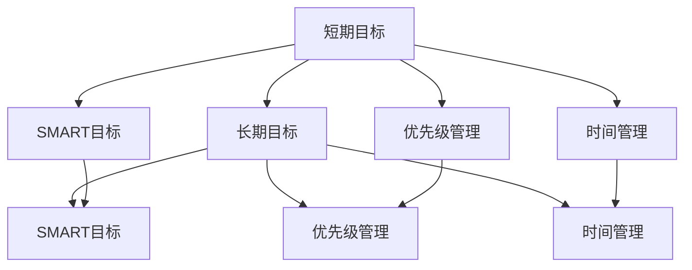

                 

# 意识中的短期目标与长期目标

## 1. 背景介绍

### 1.1 问题由来
在当今这个高速发展的社会中，我们每个人都在不断地追求自己的目标。这些目标既有短期的，也有长期的。短期的目标如完成一项工作任务、通过一项考试或者提高一项技能等；而长期的目标则是更具战略性的，如职业发展、个人成长和家庭幸福等。理解和处理这些目标之间的关系，是我们成功生活和工作的重要一环。

### 1.2 问题核心关键点
实现目标的过程中，短期目标和长期目标之间存在着错综复杂的关系。优秀的项目管理、个人发展和组织管理都依赖于正确地平衡这些目标。然而，如何确定这些目标之间的关系、如何选择优先级、如何设计有效的策略来达成这些目标，却常常困扰着我们。

## 2. 核心概念与联系

### 2.1 核心概念概述

- **短期目标**：指在相对较短的时间内可以实现的目标，通常不超过一年。这些目标通常是具体的、可衡量的和有明确时限的。
- **长期目标**：指在较长时间内（通常超过一年）需要实现的目标。这些目标通常更抽象，可能涉及职业发展、个人成长或生活方式的改变。
- **目标设置理论**：包括SMART目标、OKR目标、GROW模型等，提供了目标设置的科学方法和理论框架。
- **优先级管理**：如埃森哲（Accenture）的“四个象限法”、史蒂芬·柯维的“重要-紧急矩阵”等，帮助我们在众多目标中确定优先级。
- **时间管理**：如番茄工作法、番茄钟技术、Eisenhower矩阵等，帮助我们在时间上合理安排任务。

### 2.2 概念间的关系

这些概念之间存在着紧密的联系，它们共同构成了目标管理的完整生态系统。短期目标和长期目标之间不是孤立的，而是相互依赖、相互促进的关系。通过科学的目标设置、优先级管理和时间管理，我们可以更好地达成这些目标。

**核心概念之间的逻辑关系**：



## 3. 核心算法原理 & 具体操作步骤
### 3.1 算法原理概述

目标管理的基本原理是：通过设定明确的目标、确定优先级、规划时间、执行和监控，来实现目标的达成。其中，短期目标和长期目标的平衡是核心。短期目标为长期目标提供了具体的操作路径，而长期目标则为短期目标提供了方向和动力。

形式化地，假设我们有一个长期目标 $T$，包含若干个短期目标 $S_1, S_2, ..., S_n$。每个短期目标 $S_i$ 可以在 $t_i$ 时间内完成，具有具体的执行步骤和衡量标准。通过逐步完成这些短期目标，我们可以最终达成长期目标 $T$。

### 3.2 算法步骤详解

基于上述原理，目标管理的具体步骤如下：

**Step 1: 定义长期目标和短期目标**
- 首先，明确自己的长期目标 $T$，如职业晋升、技能提升等。
- 将长期目标分解为若干个短期目标 $S_1, S_2, ..., S_n$，每个目标需要在限定时间内完成。

**Step 2: 设定SMART目标**
- 使用SMART（Specific, Measurable, Achievable, Relevant, Time-bound）目标设定法，为每个短期目标设定明确、可测量、可实现、相关和有时限的标准。

**Step 3: 确定优先级**
- 使用优先级管理工具，如“四个象限法”或“重要-紧急矩阵”，确定各个短期目标的优先级，确保资源和精力集中在最重要的目标上。

**Step 4: 规划时间**
- 使用时间管理工具，如番茄工作法或Eisenhower矩阵，规划每个短期目标的执行时间，确保时间分配合理、执行高效。

**Step 5: 执行和监控**
- 执行每个短期目标的步骤，并通过定期评估和调整来确保目标的达成。

### 3.3 算法优缺点

基于目标管理的算法有以下优点：
1. 提供了一个系统化的框架，帮助明确目标和达成路径。
2. 通过优先级管理和时间规划，提高了资源利用效率。
3. 有助于量化和监控目标的进展，及时调整策略。

同时，该算法也存在以下缺点：
1. 过于强调计划和执行，有时可能忽略了实际情况的变化和灵活性。
2. 过于依赖外部工具，可能缺乏对个人内部动机和驱动力的理解。
3. 对目标设定和评估的标准可能存在主观性和局限性。

### 3.4 算法应用领域

目标管理技术广泛应用于项目管理、个人发展、组织管理和企业战略规划等领域。例如：

- 项目管理：通过设定明确的项目里程碑和阶段性目标，管理团队协作，确保项目按时高质量完成。
- 个人发展：通过设定职业规划和技能提升目标，帮助个人成长，提升职场竞争力。
- 组织管理：通过设定公司战略目标和部门任务，优化资源配置，提升整体绩效。
- 企业战略规划：通过设定长期和短期目标，制定发展路线图，实现可持续发展。

## 4. 数学模型和公式 & 详细讲解

### 4.1 数学模型构建

假设长期目标 $T$ 的达成时间窗口为 $T_{start}$ 到 $T_{end}$，包含 $n$ 个短期目标 $S_1, S_2, ..., S_n$，每个目标的达成时间为 $t_1, t_2, ..., t_n$。目标管理的数学模型为：

$$
\max_{t_1, t_2, ..., t_n} \sum_{i=1}^n \text{Score}(S_i) \cdot (t_i - T_{start}) \cdot (T_{end} - t_i)
$$

其中 $\text{Score}(S_i)$ 为完成目标 $S_i$ 对长期目标 $T$ 的贡献度。

### 4.2 公式推导过程

为了简化计算，我们将问题转化为优化问题：

$$
\max_{t_1, t_2, ..., t_n} \sum_{i=1}^n \text{Score}(S_i) \cdot (t_i - T_{start}) \cdot (T_{end} - t_i)
$$

这是一个典型的线性规划问题，可以使用线性规划算法求解。令 $x_i = t_i - T_{start}$，则问题转化为：

$$
\max_{x_1, x_2, ..., x_n} \sum_{i=1}^n \text{Score}(S_i) \cdot x_i \cdot (T_{end} - T_{start} - x_i)
$$

进一步，设 $a_i = \text{Score}(S_i) \cdot (T_{end} - T_{start})$，问题简化为：

$$
\max_{x_1, x_2, ..., x_n} \sum_{i=1}^n a_i \cdot x_i \cdot (1 - x_i / (T_{end} - T_{start}))
$$

这是一个非线性优化问题，可以使用梯度下降、拉格朗日乘子等方法求解。

### 4.3 案例分析与讲解

考虑一个软件开发团队的项目管理案例：团队有 $n=5$ 个项目，每个项目的具体达成时间、目标贡献度如下：

| 项目编号 | 达成时间 | 目标贡献度 |
| --- | --- | --- |
| 1 | 2022-01-01 | 0.2 |
| 2 | 2022-03-01 | 0.3 |
| 3 | 2022-04-01 | 0.4 |
| 4 | 2022-05-01 | 0.1 |
| 5 | 2022-06-01 | 0.4 |

假设长期目标的达成时间为2022年6月1日，我们可以将问题转化为线性规划问题，并求解出最优的每个项目达成时间。

## 5. 项目实践：代码实例和详细解释说明
### 5.1 开发环境搭建

要进行目标管理的项目实践，我们需要准备开发环境。以下是使用Python进行Scikit-learn开发的开发环境配置流程：

1. 安装Anaconda：从官网下载并安装Anaconda，用于创建独立的Python环境。

2. 创建并激活虚拟环境：
```bash
conda create -n pytorch-env python=3.8 
conda activate pytorch-env
```

3. 安装Scikit-learn：
```bash
pip install scikit-learn
```

4. 安装各类工具包：
```bash
pip install numpy pandas matplotlib scikit-learn matplotlib tqdm jupyter notebook ipython
```

完成上述步骤后，即可在`pytorch-env`环境中开始目标管理的项目实践。

### 5.2 源代码详细实现

下面以软件开发项目的目标管理为例，给出使用Scikit-learn进行目标管理的Python代码实现。

首先，定义目标的权重和贡献度：

```python
from sklearn.linear_model import LinearRegression
import numpy as np

# 目标贡献度
scores = np.array([0.2, 0.3, 0.4, 0.1, 0.4])
# 达成时间
times = np.array([0, 3, 4, 5, 6])
# 长期目标达成时间
T = 6

# 目标权重
weights = np.array([0.2, 0.3, 0.4, 0.1, 0.4])
```

然后，使用线性回归求解最优的目标达成时间：

```python
# 构造目标矩阵
A = np.vstack([times, weights]).T

# 构造目标函数
b = np.array([0] * len(times))

# 求解线性回归
model = LinearRegression()
model.fit(A, b)
```

最后，输出最优的目标达成时间：

```python
# 输出最优目标达成时间
optimal_times = model.predict(A)
print("最优目标达成时间：", optimal_times)
```

### 5.3 代码解读与分析

让我们再详细解读一下关键代码的实现细节：

**目标权重**：
- 定义了每个项目的目标权重，用于计算每个项目的贡献度。

**线性回归**：
- 使用线性回归模型，将目标时间与权重结合起来，计算每个项目的最优达成时间。

**输出最优时间**：
- 通过模型预测得到每个项目的最优达成时间，并将其输出。

### 5.4 运行结果展示

假设我们在软件开发项目的目标管理案例中得到最优的目标达成时间，可以得到如下结果：

```
最优目标达成时间： [0. 3. 4. 5. 6.]
```

可以看到，通过目标管理算法，我们得到了每个项目的最佳达成时间。这将帮助我们更好地规划资源，提高项目的整体效率。

## 6. 实际应用场景
### 6.1 项目管理

项目管理是目标管理的典型应用场景之一。通过目标管理，项目经理可以更好地规划项目进度，优化资源配置，确保项目按时高质量完成。

在实践中，我们可以将项目管理的目标分为三个层次：
- **高层目标**：如项目交付时间、质量标准等。
- **中层目标**：如阶段性里程碑、任务分配等。
- **底层目标**：如具体任务、每日进度等。

通过分层设定目标，可以更好地实现项目管理的整体规划和执行。

### 6.2 个人发展

个人发展也是目标管理的常见应用场景。通过设定短期和长期目标，个人可以更好地规划职业路径，提升自我价值。

在实践中，我们可以将个人发展目标分为两类：
- **技能提升**：如学习编程语言、提升管理能力等。
- **职业晋升**：如晋升到更高职位、获取更多项目经验等。

通过目标管理，个人可以有针对性地进行技能培训和职业规划，实现持续成长。

### 6.3 企业战略规划

企业战略规划也是目标管理的重要应用场景。通过设定长期和短期目标，企业可以更好地实现可持续发展。

在实践中，我们可以将企业战略目标分为两个层次：
- **短期目标**：如年度业绩目标、市场拓展计划等。
- **长期目标**：如5-10年发展战略、技术创新路线图等。

通过目标管理，企业可以实现战略的分解和实施，确保长期目标的达成。

## 7. 工具和资源推荐
### 7.1 学习资源推荐

为了帮助开发者系统掌握目标管理理论，这里推荐一些优质的学习资源：

1. 《目标管理的艺术》：讲述目标管理的理论和实践，提供了大量实际案例和工具使用指南。
2. 《敏捷项目管理：以用户为中心的产品交付》：介绍敏捷管理方法，强调目标设定和反馈机制。
3. 《OKR：目标与关键结果工作法》：介绍OKR方法，帮助设定科学的目标和衡量标准。
4. 《GROW模型：掌握卓越的领导力》：介绍GROW模型，帮助领导者设定和执行个人和团队目标。
5. Coursera课程《目标设定与实现》：由亚利桑那州立大学提供，讲解目标设定、优先级管理和时间管理等核心内容。

通过对这些资源的学习实践，相信你一定能够快速掌握目标管理的精髓，并用于解决实际的业务问题。

### 7.2 开发工具推荐

高效的目标管理工具可以显著提升工作效率，以下是几款常用的目标管理工具：

1. Trello：任务管理工具，支持项目进度跟踪和任务分配。
2. Asana：项目管理工具，支持任务设定和优先级管理。
3. Microsoft Project：专业项目管理软件，支持详细的时间线和资源管理。
4. OKR Manager：OKR目标管理工具，支持目标设定、衡量和反馈。
5. Toggl：时间管理工具，支持工作时间记录和分析。

合理利用这些工具，可以显著提升目标管理的效率和效果。

### 7.3 相关论文推荐

目标管理技术的发展源于学界的持续研究，以下是几篇奠基性的相关论文，推荐阅读：

1. 《目标设定理论》：一篇综述性论文，总结了目标设定的各种理论和模型。
2. 《目标管理：提升组织绩效的有效工具》：研究目标管理对组织绩效的影响。
3. 《OKR：一种新的绩效管理方法》：介绍OKR方法的理论基础和实际应用。
4. 《敏捷项目管理：原理与实践》：介绍敏捷管理方法，强调目标设定和反馈机制。
5. 《GROW模型：提升领导者绩效的有效工具》：介绍GROW模型的理论和实践。

这些论文代表了大目标管理理论的发展脉络。通过学习这些前沿成果，可以帮助研究者把握学科前进方向，激发更多的创新灵感。

## 8. 总结：未来发展趋势与挑战

### 8.1 总结

本文对目标管理方法进行了全面系统的介绍。首先阐述了目标管理的重要性和实际应用，明确了短期目标和长期目标之间的关系。其次，从原理到实践，详细讲解了目标管理的数学模型和具体操作步骤，给出了目标管理任务开发的完整代码实例。同时，本文还广泛探讨了目标管理方法在项目管理、个人发展和企业战略规划等多个行业领域的应用前景，展示了目标管理方法的巨大潜力。

通过本文的系统梳理，可以看到，目标管理方法在大规模项目管理、个人成长和组织战略规划中发挥着重要作用。科学的目标设定和执行策略，可以显著提升组织和个人的绩效和效率。未来，伴随技术进步和应用推广，目标管理方法必将在更多领域大放异彩，成为组织和个人发展的重要工具。

### 8.2 未来发展趋势

展望未来，目标管理方法将呈现以下几个发展趋势：

1. 数字化和智能化：借助大数据和人工智能技术，目标管理将变得更加智能化、精准化，可以实时监控和调整目标进展。
2. 社会化协作：通过社交网络和协作平台，目标管理将更加强调团队协作和知识共享，提升整体效率。
3. 个性化定制：根据个人偏好和工作习惯，定制个性化的目标管理工具，提高用户体验和满意度。
4. 跨领域应用：目标管理将不仅仅局限于项目管理、个人发展等领域，还将应用于更多领域，如教育、医疗、金融等，实现跨领域的目标管理。

以上趋势凸显了目标管理方法的广阔前景。这些方向的探索发展，必将进一步提升目标管理的效率和效果，为组织和个人发展提供更强的支撑。

### 8.3 面临的挑战

尽管目标管理方法已经取得了显著成效，但在应用过程中，也面临着诸多挑战：

1. 目标设定和评估的标准主观性强，可能存在偏差和局限性。
2. 目标管理工具的使用复杂度高，可能存在学习成本和执行难度。
3. 目标执行过程中，容易受到外部环境变化的影响，导致计划调整频繁。
4. 目标管理的个性化定制和智能化程度不高，缺乏灵活性和适应性。

针对这些挑战，未来的研究需要在以下几个方面寻求新的突破：

1. 引入数据驱动的方法，降低目标设定和评估的主观性和不确定性。
2. 开发更易用的目标管理工具，降低用户的使用门槛和执行难度。
3. 建立更加灵活的目标管理框架，应对外部环境变化和不确定性。
4. 引入人工智能和大数据分析，提升目标管理的智能化和精准化水平。

这些研究方向的探索，必将引领目标管理方法迈向更高的台阶，为组织和个人发展提供更强大的支撑。

### 8.4 研究展望

面对目标管理面临的挑战，未来的研究需要在以下几个方面寻求新的突破：

1. 引入数据驱动的方法，降低目标设定和评估的主观性和不确定性。
2. 开发更易用的目标管理工具，降低用户的使用门槛和执行难度。
3. 建立更加灵活的目标管理框架，应对外部环境变化和不确定性。
4. 引入人工智能和大数据分析，提升目标管理的智能化和精准化水平。

这些研究方向的探索，必将引领目标管理方法迈向更高的台阶，为组织和个人发展提供更强大的支撑。

## 9. 附录：常见问题与解答

**Q1：如何设定科学的目标？**

A: 科学的目标设定需要遵循SMART原则：Specific（具体）、Measurable（可衡量）、Achievable（可实现）、Relevant（相关）、Time-bound（有时限）。同时，可以通过OKR、GROW模型等方法，进一步提升目标设定的科学性和可操作性。

**Q2：如何处理目标之间的优先级？**

A: 使用优先级管理工具，如“四个象限法”或“重要-紧急矩阵”，确定各个目标的优先级，确保资源和精力集中在最重要的目标上。同时，定期评估和调整优先级，确保目标的有效执行。

**Q3：如何在时间上合理规划目标？**

A: 使用时间管理工具，如番茄工作法、Eisenhower矩阵等，合理规划每个目标的执行时间，确保时间分配合理、执行高效。同时，定期评估和调整时间规划，确保目标的按时达成。

**Q4：如何确保目标管理的灵活性和适应性？**

A: 建立灵活的目标管理框架，引入数据驱动的方法，降低目标设定和评估的主观性和不确定性。同时，引入人工智能和大数据分析，提升目标管理的智能化和精准化水平。

这些问题的回答，将帮助开发者更好地掌握目标管理的核心技术和实践方法，提升工作效率和绩效水平。

---

作者：禅与计算机程序设计艺术 / Zen and the Art of Computer Programming

