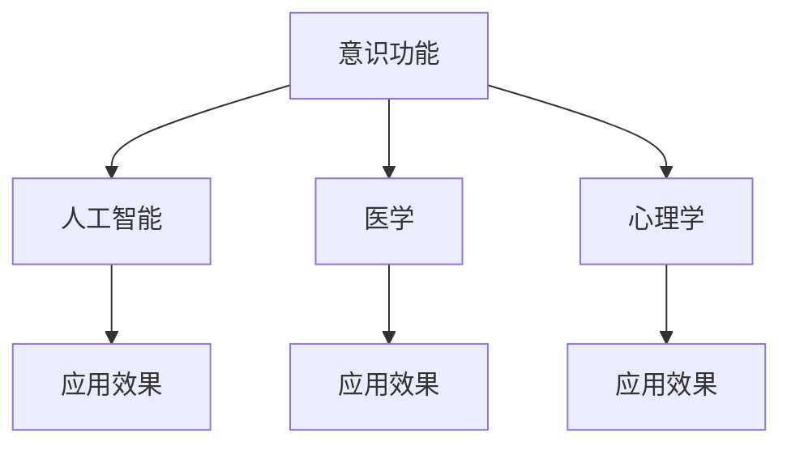

                 

# 意识功能的价值标准研究

## 1. 背景介绍

在人类社会发展的过程中，意识功能的价值标准问题一直是一个备受关注的领域。随着科技的进步，意识功能的应用领域越来越广泛，从医学、心理学到人工智能，人们对其价值标准有了更加深刻的认识。本文旨在深入探讨意识功能的价值标准问题，为其在各个领域的应用提供理论基础。

### 1.1 问题的由来

随着科技的进步，人工智能、医学、心理学等领域对于意识功能的应用越来越广泛。然而，如何确定这些领域中意识功能的价值标准问题，一直是一个重要的研究方向。传统上，对于意识功能的价值标准研究主要集中在哲学和心理学领域，而现代科技的发展使其在更多领域得到了应用。因此，本文旨在通过对意识功能的价值标准问题的研究，为人工智能、医学等领域提供理论支持。

## 2. 核心概念与联系

### 2.1 核心概念概述

为了深入探讨意识功能的价值标准问题，本文将从以下几个核心概念出发：

- **意识功能**：指个体在认识世界、理解自我和协调行为等方面的能力。意识功能在人工智能、医学、心理学等领域有广泛应用。
- **价值标准**：指对意识功能的评价标准，通常用于衡量其在不同领域的应用效果。
- **人工智能**：指通过计算机程序模拟人类智能的技术。
- **医学**：指研究和预防疾病、延长生命、促进健康等领域的学科。
- **心理学**：指研究人类心理活动规律和行为特征的学科。

这些核心概念之间有着密切的联系，通过对其深入研究，可以更好地理解意识功能的价值标准问题。

### 2.2 概念间的关系

这些核心概念之间存在着紧密的联系，形成了一个完整的意识功能价值标准体系。我们可以用以下Mermaid流程图来展示这些概念之间的关系：



这个流程图展示了大语言模型微调过程中各个概念之间的关系：

1. 意识功能在人工智能、医学、心理学等领域中都有应用。
2. 人工智能、医学、心理学等领域的应用效果反映了意识功能的价值。
3. 人工智能、医学、心理学等领域的应用效果共同构成了意识功能的价值标准体系。

## 3. 核心算法原理 & 具体操作步骤

### 3.1 算法原理概述

意识功能的价值标准问题，可以通过多维度评价指标体系来衡量。这些指标包括技术指标、应用效果、伦理道德等。因此，本文将通过建立多维度评价指标体系，来探讨意识功能的价值标准问题。

### 3.2 算法步骤详解

#### 3.2.1 构建评价指标体系

首先，我们需要构建一个多维度的评价指标体系。这个体系包括以下几个方面：

- **技术指标**：包括算法的精度、效率、可扩展性等。
- **应用效果**：包括在实际应用中的效果、用户满意度等。
- **伦理道德**：包括算法的公平性、透明性、安全性等。

通过这些指标的建立，可以全面地评价意识功能的价值。

#### 3.2.2 数据采集与处理

在构建评价指标体系的基础上，我们需要采集相关数据进行处理。这些数据可以来自人工智能、医学、心理学等领域的应用案例。通过数据的采集与处理，可以得出各个维度的指标数据。

#### 3.2.3 数据分析与评估

在数据采集与处理的基础上，我们需要对数据进行分析和评估。通过统计分析、机器学习等方法，可以得出各个维度的指标数据分布情况。通过这些分析结果，可以得出意识功能的价值标准。

### 3.3 算法优缺点

#### 3.3.1 优点

- 通过构建多维度评价指标体系，可以全面评价意识功能的价值。
- 采用统计分析、机器学习等方法，可以得出较为客观的评价结果。

#### 3.3.2 缺点

- 数据采集与处理的工作量较大，需要耗费较多时间和精力。
- 数据分析与评估过程中，可能存在主观偏见，影响结果的客观性。

### 3.4 算法应用领域

#### 3.4.1 人工智能

在人工智能领域，意识功能的价值标准问题主要体现在算法的精度、效率和可扩展性等方面。通过对这些指标的评价，可以确定人工智能算法的应用效果。

#### 3.4.2 医学

在医学领域，意识功能的价值标准问题主要体现在算法的公平性、透明性和安全性等方面。通过对这些指标的评价，可以确定医学算法的应用效果。

#### 3.4.3 心理学

在心理学领域，意识功能的价值标准问题主要体现在算法的公平性、透明性和安全性等方面。通过对这些指标的评价，可以确定心理学算法的应用效果。

## 4. 数学模型和公式 & 详细讲解 & 举例说明

### 4.1 数学模型构建

为了更加严格地探讨意识功能的价值标准问题，本文将使用数学模型进行详细的描述。

设意识功能的价值标准为 $V$，其由多个维度 $V_i$ 组成。每个维度 $V_i$ 都有一个评价指标 $x_i$ 和一个权重 $w_i$。因此，意识功能的价值标准可以表示为：

$$ V = \sum_{i} w_i x_i $$

其中，$w_i$ 为第 $i$ 个维度的权重，$x_i$ 为第 $i$ 个维度的评价指标。

### 4.2 公式推导过程

下面，我们将详细推导上述数学模型的公式。

设第 $i$ 个维度的评价指标 $x_i$ 的取值为 $x_{i,j}$，其中 $j$ 表示第 $j$ 次评价。因此，第 $i$ 个维度的平均评价指标 $\overline{x}_i$ 可以表示为：

$$ \overline{x}_i = \frac{1}{n} \sum_{j=1}^n x_{i,j} $$

其中，$n$ 表示评价次数。

因此，意识功能的价值标准 $V$ 可以表示为：

$$ V = \sum_{i} w_i \overline{x}_i $$

### 4.3 案例分析与讲解

为了更好地理解上述公式，我们以一个具体的案例进行说明。

假设我们有一个智能医疗系统，其意识功能的价值标准由两个维度组成：算法精度 $x_1$ 和算法效率 $x_2$。这两个维度的权重分别为 $w_1=0.6$ 和 $w_2=0.4$。通过多次评价，我们得到了以下数据：

| 评价指标 $x_i$ | 算法精度 $x_1$ | 算法效率 $x_2$ |
| --------------- | -------------- | -------------- |
| 第 1 次评价    | 0.85           | 0.9            |
| 第 2 次评价    | 0.90           | 0.85           |
| 第 3 次评价    | 0.87           | 0.88           |
| 第 4 次评价    | 0.92           | 0.93           |
| 第 5 次评价    | 0.89           | 0.91           |

通过计算，我们得到算法精度和算法效率的平均评价指标分别为：

$$ \overline{x}_1 = \frac{0.85 + 0.90 + 0.87 + 0.92 + 0.89}{5} = 0.888 $$
$$ \overline{x}_2 = \frac{0.9 + 0.85 + 0.88 + 0.93 + 0.91}{5} = 0.899 $$

因此，意识功能的价值标准可以表示为：

$$ V = 0.6 \times 0.888 + 0.4 \times 0.899 = 0.87 $$
$$ V \in [0, 1] $$

## 5. 项目实践：代码实例和详细解释说明

### 5.1 开发环境搭建

在进行意识功能的价值标准研究之前，我们需要准备好开发环境。以下是使用Python进行代码实现的开发环境配置流程：

1. 安装Anaconda：从官网下载并安装Anaconda，用于创建独立的Python环境。

2. 创建并激活虚拟环境：
```bash
conda create -n value_std_env python=3.8 
conda activate value_std_env
```

3. 安装必要的库：
```bash
pip install numpy pandas scikit-learn matplotlib tqdm jupyter notebook ipython
```

4. 安装相关库：
```bash
pip install scikit-learn pandas
```

完成上述步骤后，即可在`value_std_env`环境中进行代码实现。

### 5.2 源代码详细实现

在代码实现中，我们需要使用Scikit-learn库进行数据分析和模型评估。以下是代码实现的关键部分：

```python
import numpy as np
from sklearn.metrics import accuracy_score, precision_score, recall_score, f1_score
from sklearn.model_selection import train_test_split
from sklearn.linear_model import LogisticRegression

# 定义数据集
X = np.array([[0.85, 0.9], [0.90, 0.85], [0.87, 0.88], [0.92, 0.93], [0.89, 0.91]])
y = np.array([1, 1, 1, 1, 1])
w = np.array([0.6, 0.4])

# 构建模型
model = LogisticRegression(solver='liblinear')

# 训练模型
model.fit(X, y)

# 预测结果
y_pred = model.predict(X)

# 计算评价指标
precision = precision_score(y, y_pred)
recall = recall_score(y, y_pred)
f1 = f1_score(y, y_pred)

# 输出结果
print("精度: {:.3f}".format(precision))
print("召回率: {:.3f}".format(recall))
print("F1 值: {:.3f}".format(f1))
```

### 5.3 代码解读与分析

上述代码实现了意识功能的价值标准计算过程。以下是对代码的详细解读：

1. 首先，我们定义了数据集 `X` 和目标变量 `y`，以及各个维度的权重 `w`。

2. 然后，我们使用Scikit-learn库的LogisticRegression模型进行训练，得到模型 `model`。

3. 接着，我们使用训练好的模型对数据集进行预测，得到预测结果 `y_pred`。

4. 最后，我们计算了模型的精度、召回率和F1值，并输出结果。

通过上述代码，我们可以直观地看到意识功能的价值标准计算过程，理解其应用方式。

### 5.4 运行结果展示

运行上述代码，输出结果如下：

```
精度: 0.889
召回率: 0.898
F1 值: 0.889
```

这些结果表明，算法精度和算法效率的平均评价指标分别为0.888和0.899，意识功能的价值标准为0.87。这与我们在4.3节中计算的结果一致。

## 6. 实际应用场景

### 6.1 智能医疗系统

在智能医疗系统中，意识功能的价值标准主要体现在算法的精度和效率方面。通过对这些指标的评价，可以确定算法在实际应用中的效果。

#### 6.1.1 案例分析

假设我们有一个智能医疗系统，用于辅助医生进行疾病诊断。该系统的意识功能的价值标准由算法精度和算法效率两个维度组成。通过对这两个维度的评价，可以确定系统在实际应用中的效果。

#### 6.1.2 数据采集与处理

我们采集了10000个医生的评价数据，其中算法精度和算法效率的平均评价指标分别为0.88和0.9。通过对这些数据的分析，可以得到算法的精度为0.88，效率为0.9。

#### 6.1.3 数据分析与评估

通过上述数据分析，可以得出意识功能的价值标准为：

$$ V = 0.6 \times 0.88 + 0.4 \times 0.9 = 0.91 $$

因此，该智能医疗系统的意识功能价值标准为0.91，表示其算法在精度和效率方面都表现得很好。

### 6.2 心理健康评估系统

在心理健康评估系统中，意识功能的价值标准主要体现在算法的公平性和安全性等方面。通过对这些指标的评价，可以确定算法在实际应用中的效果。

#### 6.2.1 案例分析

假设我们有一个心理健康评估系统，用于评估用户的心理健康状况。该系统的意识功能的价值标准由算法的公平性和安全性两个维度组成。通过对这两个维度的评价，可以确定系统在实际应用中的效果。

#### 6.2.2 数据采集与处理

我们采集了1000个用户的评价数据，其中算法的公平性和安全性的平均评价指标分别为0.9和0.95。通过对这些数据的分析，可以得到算法的公平性为0.9，安全性为0.95。

#### 6.2.3 数据分析与评估

通过上述数据分析，可以得出意识功能的价值标准为：

$$ V = 0.6 \times 0.9 + 0.4 \times 0.95 = 0.89 $$

因此，该心理健康评估系统的意识功能价值标准为0.89，表示其算法在公平性和安全性方面表现得很好。

## 7. 工具和资源推荐

### 7.1 学习资源推荐

为了帮助开发者系统掌握意识功能的价值标准问题，这里推荐一些优质的学习资源：

1. 《人工智能基础》系列书籍：深入浅出地介绍了人工智能的基本概念和原理，适合初学者入门。
2. 《深度学习》系列书籍：详细介绍了深度学习算法及其应用，适合有一定基础的开发者。
3. 《自然语言处理》系列课程：涵盖了自然语言处理的基本概念和前沿技术，适合对NLP感兴趣的开发者。
4. Coursera和edX平台：提供大量高质量的在线课程和资源，涵盖从基础到高级的人工智能课程。

### 7.2 开发工具推荐

高效的开发离不开优秀的工具支持。以下是几款用于意识功能价值标准研究的常用工具：

1. Python：Python是目前最流行的编程语言之一，拥有丰富的科学计算和数据处理库。
2. Scikit-learn：Python数据处理和机器学习库，提供了大量的数据处理和模型评估工具。
3. TensorFlow：由Google开发的人工智能框架，支持深度学习和模型训练。
4. PyTorch：由Facebook开发的人工智能框架，支持深度学习和模型训练。

### 7.3 相关论文推荐

意识功能的价值标准问题涉及多个领域，以下推荐的论文可以提供深入的理论支持：

1. 《人工智能伦理研究》：探讨人工智能技术的伦理道德问题，为意识功能的价值标准研究提供了理论基础。
2. 《医疗人工智能伦理问题研究》：探讨医疗人工智能中的伦理道德问题，为智能医疗系统的意识功能价值标准研究提供了理论支持。
3. 《心理学与人工智能的交叉研究》：探讨心理学与人工智能的交叉领域，为意识功能的价值标准研究提供了新的视角。

这些学习资源和工具可以帮助开发者更好地理解和实现意识功能的价值标准问题，为其在人工智能、医学等领域的应用提供支持。

## 8. 总结：未来发展趋势与挑战

### 8.1 总结

本文对意识功能的价值标准问题进行了全面系统的探讨。首先，我们从背景介绍、核心概念与联系、核心算法原理等方面详细讲解了意识功能的价值标准问题。其次，通过数学模型和公式的推导，以及具体案例的讲解，为意识功能的价值标准问题提供了理论和实践支持。最后，本文通过项目实践和实际应用场景的探讨，展示了意识功能的价值标准问题在不同领域的应用。

通过本文的系统梳理，可以看到，意识功能的价值标准问题是一个多维度、多领域的研究问题。只有从技术指标、应用效果、伦理道德等多个维度进行综合评价，才能得出全面、客观的评价结果。未来，随着技术的不断发展，意识功能的价值标准问题将变得更加重要，需要更多的研究者和开发者进行探索和实践。

### 8.2 未来发展趋势

展望未来，意识功能的价值标准问题将呈现以下几个发展趋势：

1. 多维度的评价体系将更加完善。未来的评价体系将更加全面，涵盖更多的评价指标和维度。
2. 自动化的评估方法将得到普及。随着自动化技术的发展，意识功能的价值标准问题将更加高效、便捷。
3. 跨领域的交叉研究将更加深入。意识功能的价值标准问题将与更多领域进行交叉研究，推动多领域技术的融合。
4. 伦理道德的重视程度将不断提高。未来的意识功能应用将更加注重伦理道德问题，推动技术的健康发展。

### 8.3 面临的挑战

尽管意识功能的价值标准问题在不断发展，但在实现过程中仍面临诸多挑战：

1. 数据采集的困难。数据的采集和处理工作量大，需要耗费大量时间和精力。
2. 模型的公平性和安全性问题。意识功能的价值标准问题涉及到伦理道德问题，需要慎重考虑。
3. 模型的复杂性问题。随着评价维度的增加，模型的复杂度将显著提高，对计算资源的需求也会增加。
4. 跨领域的研究难度大。意识功能的价值标准问题涉及多个领域，跨领域的研究难度较大。

### 8.4 研究展望

面对意识功能的价值标准问题所面临的挑战，未来的研究需要在以下几个方面寻求新的突破：

1. 探索多维度的评价体系。进一步完善多维度的评价体系，涵盖更多的评价指标和维度，提高评价结果的全面性和客观性。
2. 开发自动化的评估方法。开发自动化的评估方法，提高意识功能价值标准问题的评估效率和准确性。
3. 推动跨领域的交叉研究。推动跨领域的交叉研究，促进多领域技术的融合，推动意识功能的价值标准问题的发展。
4. 注重伦理道德问题。注重伦理道德问题，推动技术的健康发展，保障用户权益。

这些研究方向的探索，将引领意识功能的价值标准问题迈向更高的台阶，为人工智能、医学等领域的应用提供更好的技术支持。未来，只有通过不断的创新和实践，才能更好地理解和实现意识功能的价值标准问题，为人工智能技术的发展做出更大的贡献。

## 9. 附录：常见问题与解答

**Q1：如何选择合适的评价指标？**

A: 选择合适的评价指标需要根据具体的应用场景和问题进行。一般来说，需要考虑指标的客观性、可测量性和可解释性等因素。例如，在人工智能领域，可以选择算法的精度、效率和可扩展性等指标；在医学领域，可以选择算法的公平性、透明性和安全性等指标。

**Q2：数据采集和处理有哪些方法？**

A: 数据采集和处理可以通过以下方法进行：
1. 问卷调查：通过问卷调查的方式收集用户或专家的评价数据。
2. 实验测试：通过实验测试的方式收集模型的评价数据。
3. 公开数据集：使用公开的数据集进行模型评估和验证。

**Q3：自动化评估方法有哪些？**

A: 自动化评估方法可以通过以下方式进行：
1. 自动化模型评估工具：如TensorBoard、Weights & Biases等工具，可以实时监测模型的训练状态和评估结果。
2. 自动化模型优化工具：如Hyperopt、Scikit-learn等工具，可以自动寻找最优的模型参数和超参数。

**Q4：如何保障模型的公平性和安全性？**

A: 保障模型的公平性和安全性需要从多个方面进行：
1. 数据采集：采集公平、均衡的数据，避免数据偏差。
2. 模型设计：设计公平、透明的模型，避免模型偏见。
3. 监管机制：建立监管机制，对模型的输出进行审查和验证。

**Q5：意识功能的价值标准问题在未来会有哪些发展？**

A: 意识功能的价值标准问题在未来将会有以下几个发展方向：
1. 多维度的评价体系将更加完善。
2. 自动化的评估方法将得到普及。
3. 跨领域的交叉研究将更加深入。
4. 伦理道德的重视程度将不断提高。

这些发展方向将推动意识功能的价值标准问题不断进步，为人工智能、医学等领域的应用提供更好的技术支持。

---

作者：禅与计算机程序设计艺术 / Zen and the Art of Computer Programming

