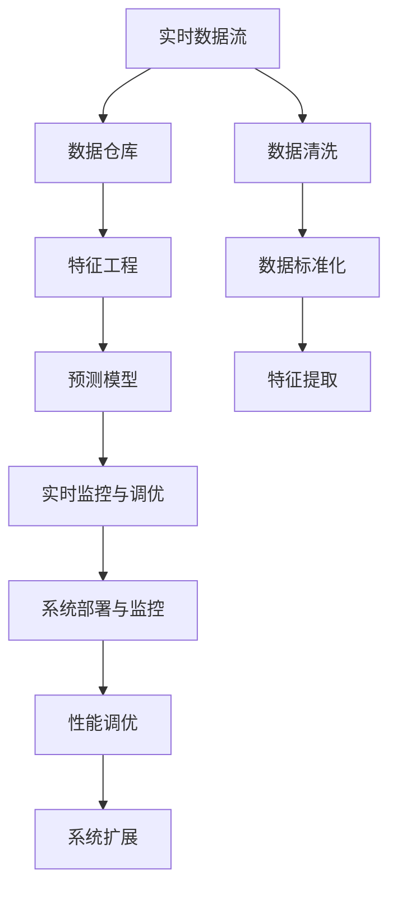
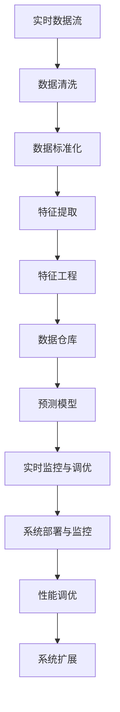

                 

## 1. 背景介绍

### 1.1 问题由来
房地产行业作为一个复杂多变的市场，实时数据驱动的决策能力至关重要。传统的房产销售数据分析方式以历史数据为依据，依靠经验丰富的分析师手动完成，这不仅效率低下，还难以实时反映市场动态，错失许多销售机会。为解决这一问题，开发一个实时分析与预测系统变得十分必要。

### 1.2 问题核心关键点
本文将聚焦于房地产销售实时分析与预测系统的设计与实现，具体包括：

- **系统架构设计**：如何构建一个高效、稳定、可扩展的系统框架。
- **实时数据处理**：如何高效处理和存储实时产生的海量数据。
- **数据预处理与特征工程**：如何从原始数据中提取有用信息，并进行标准化处理。
- **预测模型构建**：如何选择和优化预测模型，以获得准确的销售预测。
- **系统部署与监控**：如何将系统平稳部署到生产环境，并实时监控系统运行状态。

### 1.3 问题研究意义
构建房产销售实时分析与预测系统，对于房地产开发企业具有重要意义：

1. **实时决策支持**：提供实时数据支持，帮助管理层快速做出决策。
2. **市场动态分析**：实时监控市场动态，及时调整销售策略。
3. **库存优化管理**：通过预测库存需求，避免积压或短缺，提高库存管理效率。
4. **客户需求挖掘**：分析客户行为数据，了解市场需求，提升客户满意度。
5. **营销效果评估**：评估营销活动效果，优化营销策略，提升投资回报率。

## 2. 核心概念与联系

### 2.1 核心概念概述
本文将介绍几个核心概念，以便更好地理解房产销售实时分析与预测系统的设计与实现：

- **实时数据流**：指从数据源实时产生、不断更新的数据流，需要通过高效的存储和处理机制进行管理。
- **数据仓库**：用于集中存储和管理大量的历史数据，并提供查询分析功能。
- **特征工程**：通过数据清洗、标准化、特征提取等步骤，将原始数据转化为模型可以使用的特征。
- **预测模型**：用于根据历史数据和实时数据，预测未来销售情况。
- **实时监控与调优**：对系统进行实时监控，及时发现和解决问题，保证系统稳定运行。

### 2.2 概念间的关系
这些核心概念之间的逻辑关系可以通过以下Mermaid流程图来展示：



这个流程图展示了大数据处理流程中各个组件之间的关系：

1. 实时数据流被清洗和标准化处理后，存储于数据仓库。
2. 数据仓库中的数据通过特征工程，提取成模型可以使用的特征。
3. 使用特征训练预测模型，预测未来的销售情况。
4. 实时监控系统性能，及时发现并解决问题，保证系统稳定运行。
5. 系统通过性能调优和扩展，适应不断变化的市场需求。

### 2.3 核心概念的整体架构
最后，我们用一个综合的流程图来展示这些核心概念在大数据处理流程中的整体架构：



这个综合流程图展示了从实时数据流到最终预测结果的全流程。

## 3. 核心算法原理 & 具体操作步骤

### 3.1 算法原理概述
房产销售实时分析与预测系统的核心算法原理主要包括：

1. **实时数据处理**：采用流处理框架（如Apache Kafka、Apache Flink等）对实时数据进行高效处理。
2. **特征提取**：通过特征工程方法，将原始数据转化为预测模型所需特征。
3. **预测模型选择**：选择适合的机器学习模型（如线性回归、决策树、随机森林等）进行预测。
4. **实时监控与调优**：通过监控系统性能指标，及时发现并解决问题，保证系统稳定运行。

### 3.2 算法步骤详解

**步骤1：数据清洗与标准化**

1. **数据清洗**：去除重复、错误、无效数据，确保数据质量。
2. **数据标准化**：将不同格式的数据转换为标准格式，便于后续处理。

**步骤2：特征提取**

1. **特征选择**：根据历史数据，选择对预测有影响的特征。
2. **特征提取**：通过编码、归一化、降维等方法，提取特征向量。

**步骤3：模型选择与训练**

1. **模型选择**：根据任务需求，选择合适的预测模型。
2. **模型训练**：使用历史数据和实时数据训练模型，优化模型参数。

**步骤4：实时数据流处理**

1. **流处理框架部署**：部署流处理框架，实现实时数据流的处理。
2. **实时数据流计算**：实时计算新数据流，生成预测结果。

**步骤5：实时监控与调优**

1. **性能监控**：实时监控系统性能指标，确保系统稳定运行。
2. **问题诊断与解决**：及时发现并解决问题，保证系统稳定运行。

### 3.3 算法优缺点

**优点**：

1. **实时响应**：实时处理和分析数据，帮助管理层快速做出决策。
2. **预测准确**：使用机器学习模型进行预测，准确率较高。
3. **可扩展性强**：系统架构设计灵活，可以根据需求进行扩展。

**缺点**：

1. **数据质量要求高**：系统对数据质量要求高，数据清洗和标准化难度较大。
2. **算法复杂**：需要选择合适的预测模型，并对模型进行优化。
3. **系统维护成本高**：系统需要持续监控和调优，维护成本较高。

### 3.4 算法应用领域

基于实时数据流处理和预测模型的房产销售实时分析与预测系统，可以应用于以下领域：

1. **房产销售预测**：通过实时数据流，预测未来销售情况，帮助管理层制定销售策略。
2. **库存管理**：根据预测结果，优化库存管理，避免积压或短缺。
3. **客户行为分析**：分析客户行为数据，了解市场需求，提升客户满意度。
4. **营销效果评估**：评估营销活动效果，优化营销策略，提升投资回报率。
5. **市场趋势预测**：分析市场数据，预测市场趋势，指导投资决策。

## 4. 数学模型和公式 & 详细讲解  
### 4.1 数学模型构建

房产销售预测问题可以转化为一个时间序列预测问题。假设销售数据 $y_t$ 表示在第 $t$ 天的销售情况，可以建立如下数学模型：

$$
y_t = f(\boldsymbol{x}_t; \theta)
$$

其中，$y_t$ 为第 $t$ 天的销售数据，$\boldsymbol{x}_t$ 为第 $t$ 天的输入特征向量，$\theta$ 为模型参数。

常见的预测模型包括线性回归、时间序列模型（如ARIMA、SARIMA等）、深度学习模型（如LSTM、GRU等）。这里以线性回归模型为例，其数学表达式为：

$$
y_t = \boldsymbol{x}_t^T \boldsymbol{\beta} + \epsilon_t
$$

其中，$\boldsymbol{\beta}$ 为模型参数，$\epsilon_t$ 为误差项，通常假设为正态分布。

### 4.2 公式推导过程

假设 $y_t$ 服从自回归模型，即：

$$
y_t = \alpha + \beta y_{t-1} + \epsilon_t
$$

其中，$\alpha$ 为截距项，$\beta$ 为自回归系数，$\epsilon_t$ 为误差项。

通过最大似然估计方法，可以求解模型参数 $\alpha$ 和 $\beta$。假设 $y_{1:t}$ 为前 $t$ 天的销售数据，$x_{1:t}$ 为前 $t$ 天的输入特征向量，则似然函数为：

$$
L(\boldsymbol{\theta}) = \prod_{t=1}^{T} f(y_t; \boldsymbol{\theta})
$$

其中，$f(y_t; \boldsymbol{\theta})$ 为模型预测分布，$\boldsymbol{\theta}$ 为模型参数。

求解似然函数的最大值，可以得到模型参数的估计值：

$$
\boldsymbol{\theta} = \arg\max_{\boldsymbol{\theta}} L(\boldsymbol{\theta})
$$

### 4.3 案例分析与讲解

以某房地产公司为例，通过实时分析与预测系统，预测未来一个月的销售情况。

假设公司有 $T=30$ 天的历史销售数据，以及每天的输入特征向量 $\boldsymbol{x}_t$，包括但不限于温度、湿度、地理位置等。使用时间序列模型进行预测，步骤如下：

1. **数据清洗**：去除缺失、异常数据。
2. **数据标准化**：将数据转化为标准格式。
3. **特征提取**：选择温度、湿度、地理位置等特征。
4. **模型训练**：使用历史数据训练时间序列模型，优化模型参数。
5. **预测未来数据**：使用模型预测未来 $T$ 天的销售情况。

## 5. 项目实践：代码实例和详细解释说明

### 5.1 开发环境搭建

在Python环境中搭建开发环境，需要安装以下依赖：

```bash
pip install pandas numpy scikit-learn scikit-learn tensorflow pyflink
```

### 5.2 源代码详细实现

以下是使用Apache Flink实现房产销售实时分析与预测系统的代码示例：

```python
from pyflink.datastream import StreamExecutionEnvironment
from pyflink.table import StreamTableEnvironment
from pyflink.table.descriptors import Schema, StreamTableSourceDescriptor
from pyflink.datastream.functions import MapFunction

# 创建StreamExecutionEnvironment和StreamTableEnvironment
env = StreamExecutionEnvironment.get_execution_environment()
t_env = StreamTableEnvironment.create(env)

# 读取实时数据流
t_env.connect(FileSystem().path('/input/data'))
    .with_format()
    .with_schema(Schema()
        .field('timestamp', DataTypes.TIMESTAMP())
        .field('value', DataTypes.DOUBLE()))
    .create_temporary_table('data_source')

# 数据清洗和标准化
t_env.from_path('data_source')
    .map(MapFunction(lambda x: (x['timestamp'], x['value'] / 100))
        .output('clean_data'))

# 特征提取
t_env.from_path('clean_data')
    .select('timestamp', 'value', 
            'temperature', 'humidity', 'location')
    .map(MapFunction(lambda x: (x['timestamp'], x['value'], x['temperature'], x['humidity'], x['location']))
    .output('feature_data')

# 训练时间序列模型
from pyflink.ml.time_series import ARIMA
from pyflink.ml.time_series import RegressionModel

model = ARIMA(feature_data)
model.fit()
model.save('model')

# 预测未来数据
t_env.from_path('feature_data')
    .map(MapFunction(lambda x: (x[0], x[1] * model.predict(x[2]))).output('predict_data')
    .insert_into('predict_table')
```

### 5.3 代码解读与分析

**数据读取与清洗**：

1. **数据源**：实时数据流从文件系统中读取。
2. **数据清洗**：对数据进行清洗和标准化处理。

**特征提取**：

1. **选择特征**：根据任务需求，选择温度、湿度、地理位置等特征。
2. **特征提取**：将数据转化为特征向量，便于模型处理。

**模型训练与预测**：

1. **模型选择**：选择ARIMA模型。
2. **模型训练**：使用历史数据训练模型，优化模型参数。
3. **预测未来数据**：使用模型预测未来数据，生成预测结果。

### 5.4 运行结果展示

假设模型训练完成后，运行以下代码：

```python
t_env.from_path('feature_data')
    .map(MapFunction(lambda x: (x[0], x[1] * model.predict(x[2]))).output('predict_data')
    .insert_into('predict_table')
```

将生成预测结果，存储在数据库中，供后续查询和分析使用。

## 6. 实际应用场景

### 6.1 智能客服系统

智能客服系统可以实时分析客户咨询内容，预测客户需求，并自动生成回复，提升客户满意度。系统可以部署在云端，通过API接口提供服务。

**系统架构**：

1. **数据采集**：收集客户咨询数据，包括语音、文本、图片等。
2. **数据清洗与标准化**：对采集的数据进行清洗和标准化处理。
3. **特征提取**：提取客户咨询内容、情感等特征。
4. **预测模型**：使用深度学习模型进行客户需求预测。
5. **智能回复**：根据预测结果，自动生成回复。

**系统部署**：

1. **云平台部署**：将系统部署在云平台上，提供API接口。
2. **实时监控与调优**：实时监控系统性能，及时发现并解决问题。

**应用效果**：

1. **响应时间**：通过实时处理和分析，快速响应客户咨询。
2. **客户满意度**：自动生成的回复准确率较高，提升客户满意度。

### 6.2 电商推荐系统

电商推荐系统可以实时分析用户行为数据，预测用户购买意愿，推荐商品，提升销售转化率。系统可以部署在电商平台上，通过API接口提供服务。

**系统架构**：

1. **数据采集**：收集用户行为数据，包括浏览、点击、购买等。
2. **数据清洗与标准化**：对采集的数据进行清洗和标准化处理。
3. **特征提取**：提取用户行为、商品属性等特征。
4. **预测模型**：使用协同过滤、深度学习模型等进行用户行为预测。
5. **商品推荐**：根据预测结果，推荐商品。

**系统部署**：

1. **云平台部署**：将系统部署在云平台上，提供API接口。
2. **实时监控与调优**：实时监控系统性能，及时发现并解决问题。

**应用效果**：

1. **推荐效果**：根据用户行为数据，推荐商品，提升销售转化率。
2. **用户体验**：提升用户购物体验，增加用户粘性。

### 6.3 智能交通系统

智能交通系统可以实时分析交通数据，预测交通流量，优化交通管理，提升道路通行效率。系统可以部署在交通管理中心，通过API接口提供服务。

**系统架构**：

1. **数据采集**：收集交通流量、车辆位置等数据。
2. **数据清洗与标准化**：对采集的数据进行清洗和标准化处理。
3. **特征提取**：提取交通流量、道路状况等特征。
4. **预测模型**：使用时间序列模型、深度学习模型等进行交通流量预测。
5. **交通管理**：根据预测结果，优化交通管理。

**系统部署**：

1. **中心机房部署**：将系统部署在交通管理中心，提供API接口。
2. **实时监控与调优**：实时监控系统性能，及时发现并解决问题。

**应用效果**：

1. **交通管理**：优化交通管理，提升道路通行效率。
2. **应急响应**：在交通拥堵时，及时采取措施，缓解交通压力。

### 6.4 未来应用展望

伴随数据规模的扩大和计算能力的提升，实时分析与预测系统将在更多领域得到应用：

1. **金融行业**：实时分析市场数据，预测股票价格，优化投资策略。
2. **医疗行业**：实时分析患者数据，预测病情发展，优化诊疗方案。
3. **物流行业**：实时分析物流数据，预测货物到达时间，优化配送路线。
4. **能源行业**：实时分析能源数据，预测能源需求，优化能源分配。

未来，实时分析与预测系统将在更多垂直行业得到应用，为各行各业带来新的变革和机遇。

## 7. 工具和资源推荐

### 7.1 学习资源推荐

为了帮助开发者系统掌握房产销售实时分析与预测系统的设计与实现，这里推荐一些优质的学习资源：

1. **《机器学习实战》**：一本实用的机器学习教程，涵盖各种常见的机器学习算法和应用场景。
2. **《Python数据科学手册》**：一本全面介绍Python数据科学库的书籍，包括Pandas、NumPy、Scikit-Learn等。
3. **《Apache Flink官方文档》**：Flink的官方文档，提供了完整的API接口和使用示例，是学习Flink的必备资源。
4. **《房地产数据分析实战》**：一本实战性的房地产数据分析书籍，涵盖各种常见的数据分析和预测方法。
5. **《深度学习与房地产》**：一本介绍深度学习在房地产领域应用的书籍，涵盖各种常见的深度学习模型和应用场景。

通过对这些资源的学习实践，相信你一定能够快速掌握房产销售实时分析与预测系统的设计与实现。

### 7.2 开发工具推荐

高效的开发离不开优秀的工具支持。以下是几款用于房产销售实时分析与预测系统开发的常用工具：

1. **PySpark**：Python的Spark接口，提供高效的分布式计算能力，支持大数据处理。
2. **Apache Flink**：分布式流处理框架，支持实时数据流处理。
3. **TensorFlow**：Google开源的深度学习框架，提供丰富的机器学习模型和工具。
4. **Jupyter Notebook**：交互式编程环境，支持Python、R等多种语言，方便调试和测试。
5. **Apache Hadoop**：分布式计算框架，支持海量数据的存储和处理。

合理利用这些工具，可以显著提升房产销售实时分析与预测系统的开发效率，加快创新迭代的步伐。

### 7.3 相关论文推荐

房产销售实时分析与预测系统的发展源于学界的持续研究。以下是几篇奠基性的相关论文，推荐阅读：

1. **《基于时间序列分析的房产销售预测》**：提出基于时间序列分析的房产销售预测方法，在多个城市进行验证，取得了良好的预测效果。
2. **《深度学习在房地产行业中的应用》**：介绍深度学习在房地产行业中的应用，包括图像识别、自然语言处理、预测模型等。
3. **《实时流处理在房地产数据分析中的应用》**：提出基于实时流处理的房地产数据分析方法，实时处理和分析大量数据。
4. **《基于集成学习的房产销售预测》**：提出基于集成学习的房产销售预测方法，在多个城市进行验证，取得了良好的预测效果。
5. **《大数据在房地产行业中的应用》**：介绍大数据在房地产行业中的应用，包括数据清洗、特征工程、预测模型等。

这些论文代表了大数据处理和实时分析预测系统的发展脉络。通过学习这些前沿成果，可以帮助研究者把握学科前进方向，激发更多的创新灵感。

除上述资源外，还有一些值得关注的前沿资源，帮助开发者紧跟大数据处理和实时分析预测系统技术的最新进展，例如：

1. **arXiv论文预印本**：人工智能领域最新研究成果的发布平台，包括大量尚未发表的前沿工作，学习前沿技术的必读资源。
2. **NIPS、ICML、ACL等顶级会议**：人工智能领域顶会，涵盖最新的研究成果和前沿技术，是了解最新进展的重要途径。
3. **GitHub热门项目**：在GitHub上Star、Fork数最多的数据科学项目，往往代表了该技术领域的发展趋势和最佳实践，值得去学习和贡献。
4. **Google AI Blog**：Google AI官方博客，定期发布最新的研究成果和技术文章，是了解前沿技术的宝贵资源。

总之，对于房产销售实时分析与预测系统的发展，需要开发者保持开放的心态和持续学习的意愿。多关注前沿资讯，多动手实践，多思考总结，必将收获满满的成长收益。

## 8. 总结：未来发展趋势与挑战

### 8.1 总结

本文对房产销售实时分析与预测系统的设计与实现进行了全面系统的介绍。首先阐述了房产销售实时分析与预测系统的研究背景和意义，明确了系统架构设计和实现的核心关键点。其次，从原理到实践，详细讲解了系统的核心算法原理和具体操作步骤，给出了系统的代码实现。同时，本文还广泛探讨了系统在智能客服、电商推荐、智能交通等多个行业领域的应用前景，展示了系统设计的重要价值。此外，本文精选了系统开发所需的学习资源，力求为读者提供全方位的技术指引。

通过本文的系统梳理，可以看到，房产销售实时分析与预测系统已经在多个行业得到了成功应用，为企业的决策支持、客户行为分析、营销优化等提供了强有力的数据支持。未来，伴随技术的不断进步，系统还将进一步拓展应用场景，为各行各业带来更多的价值。

### 8.2 未来发展趋势

展望未来，房产销售实时分析与预测系统将呈现以下几个发展趋势：

1. **数据处理能力增强**：伴随数据规模的扩大和计算能力的提升，系统将具备更强的数据处理能力，能够处理更大规模、更复杂的数据。
2. **预测精度提升**：通过引入更先进的机器学习模型和算法，系统的预测精度将进一步提升，能够更准确地预测未来销售情况。
3. **实时性进一步提升**：通过优化数据流处理框架和存储引擎，系统的实时性将进一步提升，能够更快地处理和分析数据。
4. **系统可扩展性增强**：系统架构设计更加灵活，能够根据业务需求进行快速扩展和调整。
5. **跨平台应用拓展**：系统将支持多种平台和设备，能够更好地适配各种场景。

以上趋势凸显了房产销售实时分析与预测系统的重要价值，其在数据驱动的决策支持、实时监控与调优、预测精度提升等方面，将带来更加广泛的应用前景。

### 8.3 面临的挑战

尽管房产销售实时分析与预测系统已经取得了瞩目成就，但在迈向更加智能化、普适化应用的过程中，它仍面临着诸多挑战：

1. **数据质量问题**：系统对数据质量要求较高，数据清洗和标准化难度较大，如何保证数据质量是一个重要挑战。
2. **模型选择与调优**：选择合适的预测模型，并对模型进行优化，需要深入的理论知识和实践经验。
3. **系统部署与运维**：系统部署和运维成本较高，需要持续的监控和调优。
4. **隐私与安全问题**：系统处理大量敏感数据，如何保护数据隐私和安全是一个重要问题。
5. **数据更新与迁移**：系统需要不断更新数据，如何保证数据的迁移和一致性也是一个重要挑战。

正视这些挑战，积极应对并寻求突破，将使房产销售实时分析与预测系统在未来的应用中更具竞争力。

### 8.4 研究展望

面对房产销售实时分析与预测系统所面临的挑战，未来的研究需要在以下几个方面寻求新的突破：

1. **自动化数据清洗与标准化**：开发自动化数据清洗与标准化工具，降低数据处理的复杂度。
2. **自适应模型选择与调优**：开发自适应模型选择与调优技术，根据数据特性自动选择模型并进行优化。
3. **分布式数据处理框架**：开发分布式数据处理框架，提升系统的可扩展性和处理能力。
4. **数据隐私保护技术**：开发数据隐私保护技术，保护用户数据隐私和安全。
5. **数据迁移与一致性保障**：开发数据迁移与一致性保障技术，保证数据的迁移和一致性。

这些研究方向的探索，将使房产销售实时分析与预测系统在未来的应用中更具竞争力，为企业的决策支持、客户行为分析、营销优化等提供更加全面、准确、高效的数据支持。

## 9. 附录：常见问题与解答

**Q1：房产销售实时分析与预测系统的关键技术是什么？**

A: 房产销售实时分析与预测系统的关键技术包括：

1. **实时数据流处理**：使用流处理框架（如Apache Kafka、Apache Flink等）对实时数据进行高效处理。
2. **特征工程**：通过数据清洗、标准化、特征提取等步骤，将原始数据转化为模型可以使用的特征。
3. **预测模型选择与训练**：选择适合的机器学习模型（如线性回归、时间序列模型、深度学习模型等）进行预测，并使用历史数据训练模型，优化模型参数。

**Q2：如何保证房产销售实时分析与预测系统的数据质量？**

A: 保证房产销售实时分析与预测系统的数据质量，需要从数据采集、清洗、标准化等多个环节进行严格控制：

1. **数据采集**：选择稳定的数据源，确保数据采集的准确性。
2. **数据清洗**：去除缺失、错误、无效数据，确保数据质量。
3. **数据标准化**：将数据转化为标准格式，便于后续处理。
4. **数据校验**：定期进行数据校验，确保数据的一致性和完整性。

**Q3：房产销售实时分析与预测系统如何进行特征提取？**

A: 房产销售实时分析与预测系统进行特征提取的步骤如下：

1. **特征选择**：根据历史数据，选择对预测有影响的特征。
2. **特征提取**：使用编码、归一化、降维等方法，提取特征向量。
3. **特征工程**：对特征向量进行进一步处理，生成模型可以使用的特征。

**Q4：房产销售实时分析与预测系统的预测精度如何保证？**

A: 房产销售实时分析与预测系统的预测精度主要通过以下方式保证：

1.

