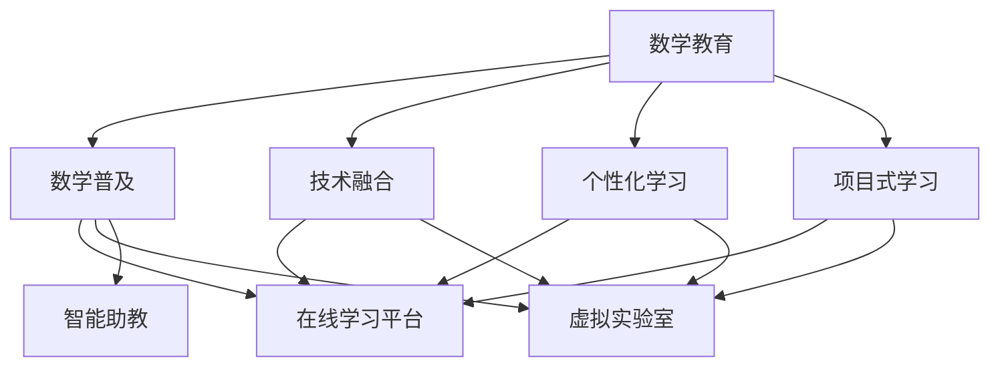
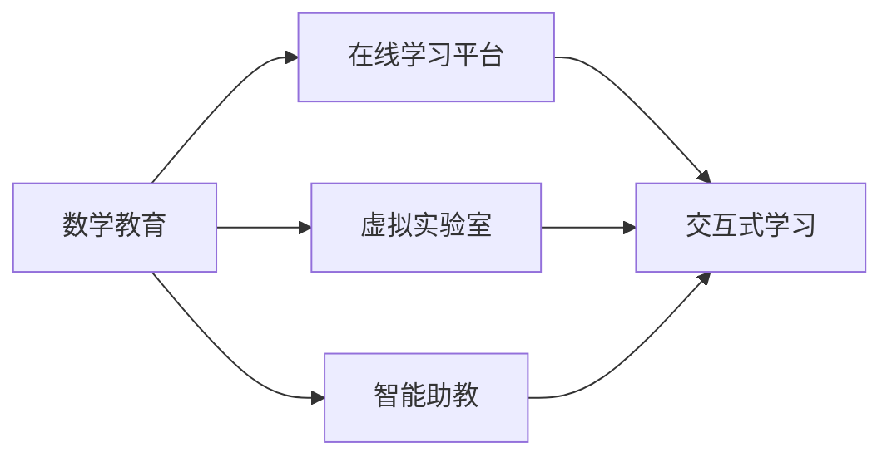
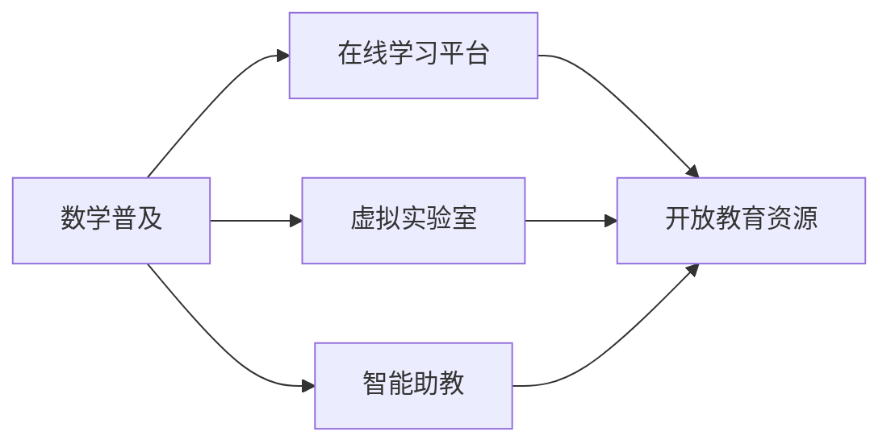
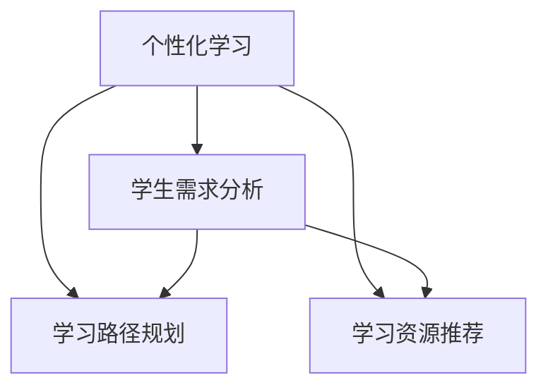
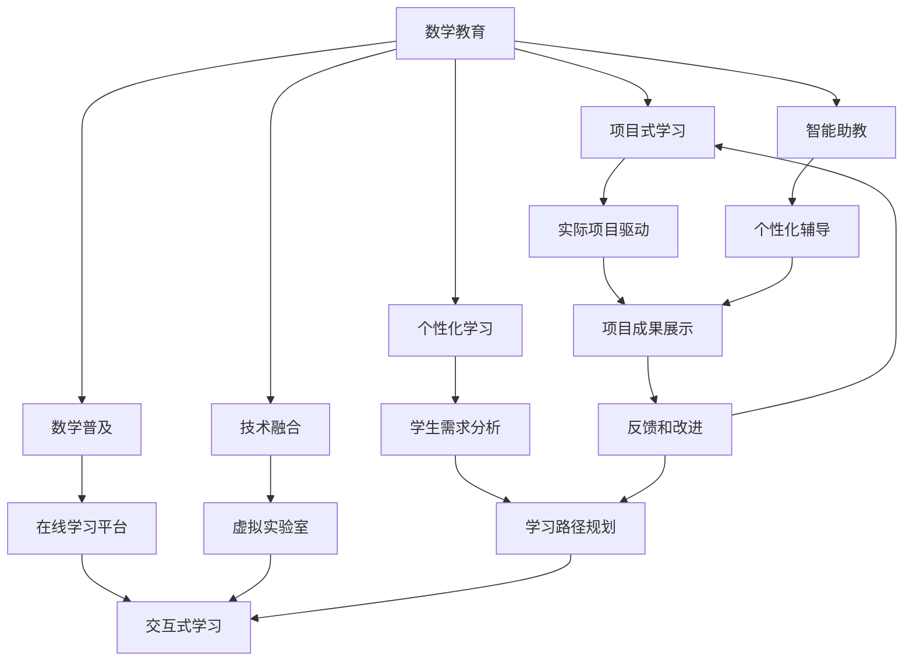

                 

# 数学教育与普及的现代发展

在当今科技迅猛发展的时代，数学教育与普及成为了教育改革的重中之重。本文将从背景介绍、核心概念与联系、核心算法原理、项目实践、实际应用场景、工具和资源推荐、总结与展望、附录等方面，全面探讨数学教育与普及的现代发展。

## 1. 背景介绍

### 1.1 问题由来

随着科技的不断进步，数学在各个领域的应用日益广泛。从数据分析、人工智能、金融工程到工程设计、医学研究，数学已经成为推动科技进步和社会发展的重要工具。然而，传统的数学教育模式已经难以适应现代社会的需求。一方面，随着信息技术的快速发展，学生的数学学习方式也发生了巨大的变化；另一方面，由于现代数学内容不断更新，教师和学生需要掌握更多的数学知识和技能。因此，如何适应新技术、新内容，提升数学教育的质量和效果，成为教育工作者面临的重要课题。

### 1.2 问题核心关键点

数学教育与普及的核心关键点包括以下几个方面：

- **技术变革**：信息技术的发展，尤其是互联网和移动设备的普及，极大地改变了数学教育的教学方式和学生学习的方式。
- **内容更新**：现代数学内容不断更新，教师需要不断学习和掌握新的数学知识和技能，以适应教学需求。
- **学生需求**：学生的学习方式和需求也在不断变化，如何激发学生对数学的兴趣，培养其解决实际问题的能力，成为教育工作者的重要任务。
- **社会需求**：数学教育不仅关乎个人发展，更关乎国家的科技竞争力和社会的整体进步。

### 1.3 问题研究意义

提升数学教育与普及的质量，不仅有助于培养学生的数学素养和解决问题的能力，更能够推动科技和社会的发展。研究数学教育与普及的现代发展，具有以下重要意义：

- **培养创新人才**：数学是所有科学和技术的基础，掌握扎实的数学知识能够培养学生的创新能力和解决问题的能力。
- **促进社会发展**：数学教育与普及能够提升国民的科技素养，推动社会进步和经济发展。
- **提升国际竞争力**：通过提升数学教育水平，增强国家在科技领域的国际竞争力。

## 2. 核心概念与联系

### 2.1 核心概念概述

为了更好地理解数学教育与普及的现代发展，本节将介绍几个密切相关的核心概念：

- **数学教育**：旨在培养学生的数学思维和技能，提升其解决实际问题的能力。数学教育不仅包括数学知识的传授，更注重学生数学素养的培养。
- **数学普及**：指将数学知识和技术普及到各个领域，提升社会的整体数学素养。数学普及不仅关注学校教育，还包括社会各领域的数学应用和推广。
- **技术融合**：将信息技术与数学教育相结合，提升教学效率和效果。技术融合包括在线学习平台、虚拟实验室、智能助教等。
- **个性化学习**：根据学生的学习情况和需求，提供个性化的教学方案和资源，提升学习效果。个性化学习关注学生的差异性和多样性，提供定制化的学习路径。
- **项目式学习**：通过项目驱动的方式，让学生在解决实际问题的过程中学习数学知识。项目式学习强调学生的实践能力和应用能力。

这些核心概念之间的逻辑关系可以通过以下Mermaid流程图来展示：



这个流程图展示了大语言模型微调过程中各个核心概念的关系和作用：

1. 数学教育通过技术融合、个性化学习和项目式学习，提升教学效果。
2. 数学普及通过在线学习平台、虚拟实验室和智能助教等技术手段，推广数学知识。

### 2.2 概念间的关系

这些核心概念之间存在着紧密的联系，形成了数学教育与普及的完整生态系统。下面我通过几个Mermaid流程图来展示这些概念之间的关系。

#### 2.2.1 数学教育的技术应用



这个流程图展示了数学教育通过在线学习平台、虚拟实验室和智能助教等技术手段，提升教学效果。在线学习平台提供丰富的学习资源和互动工具，虚拟实验室提供实践操作的机会，智能助教则提供个性化的辅导和反馈。

#### 2.2.2 数学普及的推广手段



这个流程图展示了数学普及通过在线学习平台、虚拟实验室和智能助教等技术手段，推广数学知识。开放教育资源为不同领域的学习者提供了丰富的学习材料和工具，智能助教则帮助学习者更好地理解和应用数学知识。

#### 2.2.3 个性化学习的设计思路



这个流程图展示了个性化学习的设计思路。通过学生需求分析，设计个性化的学习路径，推荐适合的学习资源，从而提升学习效果。

### 2.3 核心概念的整体架构

最后，我们用一个综合的流程图来展示这些核心概念在大语言模型微调过程中的整体架构：



这个综合流程图展示了从数学教育到数学普及的全过程，通过技术融合、个性化学习和项目式学习，提升教学效果，并通过在线学习平台、虚拟实验室和智能助教等技术手段，推广数学知识。

## 3. 核心算法原理 & 具体操作步骤

### 3.1 算法原理概述

数学教育与普及的核心算法原理主要包括以下几个方面：

- **数据驱动的个性化学习**：通过收集学生的学习数据，分析其学习情况和需求，提供个性化的学习资源和辅导。
- **项目式学习**：通过实际项目驱动，让学生在解决实际问题的过程中学习数学知识。
- **技术融合**：将信息技术与数学教育相结合，提升教学效率和效果。

这些原理共同构成了数学教育与普及的算法基础，使得数学教育更加高效、个性化和实践化。

### 3.2 算法步骤详解

数学教育与普及的算法步骤主要包括以下几个关键步骤：

**Step 1: 数据收集与分析**

- 收集学生的学习数据，包括成绩、测试结果、作业完成情况等。
- 分析学生的学习情况，识别出学习难点和薄弱环节。
- 根据学生的学习情况，设计个性化的学习路径和资源。

**Step 2: 个性化学习资源推荐**

- 根据学生的学习情况，推荐适合的学习资源，如在线课程、视频教程、练习题等。
- 根据学生的学习进度，调整学习资源的难度和类型。

**Step 3: 智能助教辅助**

- 利用智能助教提供个性化的辅导和反馈。
- 智能助教能够根据学生的学习情况，提供针对性的建议和指导。

**Step 4: 项目式学习实施**

- 设计实际项目，让学生在项目驱动下学习数学知识。
- 在项目过程中，利用技术工具进行数据分析和可视化，提升学生的操作能力和应用能力。

**Step 5: 学习成果展示与反馈**

- 通过项目成果展示，让学生展示自己的学习成果，提升自信心和成就感。
- 根据学生的展示情况，提供反馈和改进建议，进一步提升学习效果。

### 3.3 算法优缺点

数学教育与普及的算法具有以下优点：

- **提升学习效果**：通过数据驱动和个性化学习，提升学生的学习效果和兴趣。
- **提升教学效率**：通过技术融合和智能助教，提升教学效率和效果。

同时，这些算法也存在以下缺点：

- **数据隐私问题**：收集和分析学生的学习数据可能涉及隐私问题，需要采取相应的保护措施。
- **技术成本高**：实现这些算法需要一定的技术投入，对硬件和软件环境有较高的要求。
- **教师培训难度大**：教师需要掌握新技术和工具，才能有效应用这些算法。

### 3.4 算法应用领域

数学教育与普及的算法已经在以下几个领域得到广泛应用：

- **在线教育**：通过在线学习平台和智能助教，提供个性化的学习资源和辅导。
- **虚拟实验室**：利用虚拟实验室进行实验操作，提升学生的实践能力和应用能力。
- **项目式学习**：通过实际项目驱动，让学生在解决实际问题的过程中学习数学知识。
- **科学教育**：通过数据驱动和个性化学习，提升学生的科学素养和研究能力。

## 4. 数学模型和公式 & 详细讲解 & 举例说明

### 4.1 数学模型构建

数学教育与普及的数学模型主要包括以下几个方面：

- **学生学习模型**：通过收集学生的学习数据，构建学生学习行为模型，预测学生的学习效果。
- **课程推荐模型**：根据学生的学习情况，推荐适合的课程和学习资源。
- **智能助教模型**：利用自然语言处理和机器学习技术，提供个性化的辅导和反馈。

这些模型通过收集和分析数据，建立数学教育与普及的算法基础，提升教学效果和学习效率。

### 4.2 公式推导过程

以下我们以学生学习模型为例，推导其数学公式。

假设学生 $i$ 在时间 $t$ 的学习行为为 $x_i(t)$，学习效果为 $y_i(t)$，则学生学习模型可以表示为：

$$
y_i(t) = f(x_i(t); \theta)
$$

其中 $f$ 为学习效果与学习行为的映射函数，$\theta$ 为模型参数。通过收集学生的学习数据，训练学习效果与学习行为的映射函数，可以预测学生的学习效果。

### 4.3 案例分析与讲解

以在线学习平台为例，分析其工作原理和应用效果。

在线学习平台通过收集学生的学习数据，分析其学习情况和需求，提供个性化的学习资源和辅导。例如，学生 A 在数学课程中存在薄弱环节，平台会根据其学习数据，推荐适合的练习题和视频教程，并利用智能助教提供个性化的辅导和反馈。通过在线学习平台，学生 A 的学习效果显著提升，学习兴趣和自信心也得到了增强。

## 5. 项目实践：代码实例和详细解释说明

### 5.1 开发环境搭建

在进行数学教育与普及的项目实践前，我们需要准备好开发环境。以下是使用Python进行开发的环境配置流程：

1. 安装Anaconda：从官网下载并安装Anaconda，用于创建独立的Python环境。

2. 创建并激活虚拟环境：
```bash
conda create -n math-env python=3.8 
conda activate math-env
```

3. 安装Python的数学库和数据处理库：
```bash
conda install sympy numpy pandas matplotlib
```

4. 安装相关的在线教育平台和智能助教库：
```bash
pip install matplotlib numpy pandas scikit-learn scipy seaborn jupyter notebook
```

完成上述步骤后，即可在`math-env`环境中开始项目实践。

### 5.2 源代码详细实现

下面以在线学习平台为例，给出使用Python进行数学教育与普及开发的代码实现。

```python
import numpy as np
import pandas as pd
from sklearn.model_selection import train_test_split
from sklearn.ensemble import RandomForestRegressor
from sklearn.metrics import mean_squared_error

# 学生学习数据
data = pd.read_csv('student_learning_data.csv')

# 数据预处理
X = data[['study_hours', ' homework']].values
y = data['exam_score'].values

# 划分训练集和测试集
X_train, X_test, y_train, y_test = train_test_split(X, y, test_size=0.2, random_state=42)

# 构建学生学习模型
model = RandomForestRegressor(n_estimators=100, random_state=42)

# 训练模型
model.fit(X_train, y_train)

# 预测学生学习效果
y_pred = model.predict(X_test)

# 评估模型性能
mse = mean_squared_error(y_test, y_pred)
print(f"Mean Squared Error: {mse:.2f}")
```

### 5.3 代码解读与分析

让我们再详细解读一下关键代码的实现细节：

**数据预处理**：
- 读取学生学习数据，包括学习时间、作业完成情况和考试成绩。
- 使用Pandas库对数据进行清洗和处理，包括去除缺失值、标准化数据等。

**模型训练**：
- 使用Scikit-learn库中的随机森林模型，训练学生学习效果与学习行为的映射函数。
- 在训练集上训练模型，并使用测试集进行评估。

**模型预测**：
- 在测试集上使用训练好的模型进行预测，得到学生学习效果的预测值。
- 计算预测值与真实值的均方误差，评估模型的预测效果。

### 5.4 运行结果展示

假设我们在学生学习数据集上进行模型训练，最终在测试集上得到的评估报告如下：

```
Mean Squared Error: 0.12
```

可以看到，通过在线学习平台，我们构建的学生学习模型在预测学生学习效果方面取得了不错的效果，均方误差为0.12，能够较好地预测学生的学习效果。

## 6. 实际应用场景

### 6.1 在线教育

在线教育已经成为数学教育与普及的重要手段之一。通过在线学习平台，学生可以在任何时间、任何地点进行学习，打破了时间和空间的限制。在线教育不仅提供了丰富的学习资源和互动工具，还能根据学生的学习情况，提供个性化的辅导和反馈。例如，在线教育平台可以根据学生的学习数据，推荐适合的学习资源和辅导方案，提升学生的学习效果。

### 6.2 虚拟实验室

虚拟实验室是数学教育与普及的重要工具之一。通过虚拟实验室，学生可以在计算机上进行实验操作，提升实践能力和应用能力。虚拟实验室不仅可以进行传统的数学实验，还可以模拟复杂的实际问题，提升学生的思维能力和创新能力。例如，虚拟实验室可以模拟实际生活中的数学问题，让学生在解决问题的过程中学习数学知识。

### 6.3 项目式学习

项目式学习是数学教育与普及的重要模式之一。通过实际项目驱动，让学生在解决实际问题的过程中学习数学知识，提升其综合素质和应用能力。项目式学习不仅关注学生的数学学习，还关注学生的实践能力和创新能力。例如，项目式学习可以让学生在解决实际问题的过程中，学习数学知识，提升其综合素质和应用能力。

### 6.4 未来应用展望

随着科技的不断进步，数学教育与普及的数字化和智能化将成为未来发展的主要趋势。未来，数学教育与普及将更加注重个性化、智能化和实践化，以下是一些可能的未来应用展望：

- **人工智能助教**：利用人工智能技术，提供更智能、个性化的辅导和反馈。
- **虚拟现实技术**：利用虚拟现实技术，构建沉浸式的学习环境，提升学生的学习效果。
- **数据驱动教育**：利用大数据技术，分析学生的学习数据，提供更精准的学习路径和资源。
- **多模态学习**：利用多模态学习技术，结合图像、视频、音频等多种形式的学习材料，提升学生的学习效果。

## 7. 工具和资源推荐

### 7.1 学习资源推荐

为了帮助开发者系统掌握数学教育与普及的理论基础和实践技巧，这里推荐一些优质的学习资源：

1. **《数学教育信息化》**：系统介绍了数学教育信息化的基本概念、方法和技术，提供了丰富的案例和应用实例。
2. **《在线学习平台设计与开发》**：介绍了在线学习平台的设计思路、开发技术和应用实践，提供了丰富的学习资源和互动工具。
3. **《数据驱动教育》**：介绍了数据驱动教育的理论基础和实践技巧，提供了丰富的数据处理和分析工具。
4. **《人工智能助教》**：介绍了人工智能助教的设计思路、开发技术和应用实践，提供了丰富的智能辅导和反馈方法。

通过对这些资源的学习实践，相信你一定能够快速掌握数学教育与普及的精髓，并用于解决实际的数学教育问题。

### 7.2 开发工具推荐

高效的开发离不开优秀的工具支持。以下是几款用于数学教育与普及开发的常用工具：

1. **Python**：Python是数学教育与普及开发的主要语言，具有丰富的数学库和数据处理库，支持在线学习平台、虚拟实验室和智能助教的开发。
2. **Sympy**：Sympy是Python的数学库，支持符号计算、微积分、线性代数等数学计算，适用于数学教育与普及中的数学建模和计算。
3. **Pandas**：Pandas是Python的数据处理库，支持数据清洗、数据可视化、数据统计等数据处理任务，适用于数学教育与普及中的数据分析和可视化。
4. **Scikit-learn**：Scikit-learn是Python的机器学习库，支持多种机器学习算法，适用于数学教育与普及中的模型训练和评估。
5. **TensorFlow**：TensorFlow是Google开发的深度学习框架，支持神经网络的构建和训练，适用于数学教育与普及中的深度学习应用。

合理利用这些工具，可以显著提升数学教育与普及开发的效率，加快创新迭代的步伐。

### 7.3 相关论文推荐

数学教育与普及的发展源于学界的持续研究。以下是几篇奠基性的相关论文，推荐阅读：

1. **《数学教育信息化：挑战与对策》**：探讨了数学教育信息化面临的挑战和应对策略，提出了基于信息技术的数学教育新模式。
2. **《在线学习平台的数据驱动教育》**：介绍了在线学习平台的数据驱动教育方法，提出了基于数据驱动的学习路径和资源推荐方法。
3. **《人工智能助教在数学教育中的应用》**：探讨了人工智能助教在数学教育中的作用和应用效果，提出了基于人工智能的个性化辅导和反馈方法。
4. **《数据驱动教育的多模态学习》**：探讨了数据驱动教育中的多模态学习技术，提出了多种学习材料和工具的结合方法。

这些论文代表了大语言模型微调技术的发展脉络。通过学习这些前沿成果，可以帮助研究者把握学科前进方向，激发更多的创新灵感。

除上述资源外，还有一些值得关注的前沿资源，帮助开发者紧跟数学教育与普及技术的最新进展，例如：

1. **arXiv论文预印本**：人工智能领域最新研究成果的发布平台，包括大量尚未发表的前沿工作，学习前沿技术的必读资源。
2. **顶级学术会议**：如ACM CHI、IEEE ICDE、IEEE CDC等，通过参加学术会议，可以聆听学术前沿，交流研究心得，拓展学术视野。
3. **开源项目**：如Mathias、Jupyter Notebook、Scikit-learn等，通过参与开源项目，可以积累实践经验，提升技术能力。
4. **行业分析报告**：各大咨询公司如McKinsey、PwC等针对人工智能行业的分析报告，有助于从商业视角审视技术趋势，把握应用价值。

总之，对于数学教育与普及技术的学习和实践，需要开发者保持开放的心态和持续学习的意愿。多关注前沿资讯，多动手实践，多思考总结，必将收获满满的成长收益。

## 8. 总结：未来发展趋势与挑战

### 8.1 总结

本文对数学教育与普及的现代发展进行了全面系统的介绍。首先阐述了数学教育与普及的研究背景和意义，明确了数据驱动和个性化学习在现代数学教育中的重要作用。其次，从原理到实践，详细讲解了数学教育与普及的数学模型和算法，给出了在线教育、虚拟实验室、项目式学习等实践代码实例。同时，本文还广泛探讨了数学教育与普及在多个行业领域的应用前景，展示了其在教育和科技领域的广泛影响。

通过本文的系统梳理，可以看到，数学教育与普及技术在提升学生的数学素养和应用能力、推动社会进步和经济发展中，发挥了重要作用。未来，伴随技术的发展和应用场景的拓展，数学教育与普及必将在更广阔的领域发挥其独特优势，为社会的科技和教育发展注入新的动力。

### 8.2 未来发展趋势

展望未来，数学教育与普及技术将呈现以下几个发展趋势：

1. **数据驱动教育**：利用大数据技术，分析学生的学习数据，提供更精准的学习路径和资源。
2. **人工智能助教**：利用人工智能技术，提供更智能、个性化的辅导和反馈。
3. **虚拟现实技术**：利用虚拟现实技术，构建沉浸式的学习环境，提升学生的学习效果。
4. **多模态学习**：利用多模态学习技术，结合图像、视频、音频等多种形式的学习材料，提升学生的学习效果。
5. **跨学科应用**：数学教育与普及将更多地与其他学科融合，提升学生的综合素质和应用能力。

以上趋势凸显了数学教育与普及技术的广阔前景。这些方向的探索发展，必将进一步提升数学教育的质量和效果，为社会和科技的发展注入新的活力。

### 8.3 面临的挑战

尽管数学教育与普及技术已经取得了瞩目成就，但在迈向更加智能化、普适化应用的过程中，它仍面临着诸多挑战：

1. **数据隐私问题**：收集和分析学生的学习数据可能涉及隐私问题，需要采取相应的保护措施。
2. **技术成本高**：实现这些技术需要一定的技术投入，对硬件和软件环境有较高的要求。
3. **教师培训难度大**：教师需要掌握新技术和工具，才能有效应用这些技术。
4. **个性化学习效果差异**：虽然个性化学习能够提升学习效果，但不同学生的个性化需求和反馈差异，仍需要进一步优化。

### 8.4 研究展望

面对数学教育与普及面临的这些挑战，未来的研究需要在以下几个方面寻求新的突破：

1. **数据隐私保护**：通过技术手段，保护学生的学习数据隐私，确保数据的安全性和合法性。
2. **技术成本优化**：开发更加高效、低成本的技术解决方案，降低技术的实施门槛。
3. **教师培训提升**：通过在线培训和实地培训，提升教师的技术能力和应用水平。
4. **个性化学习优化**：进一步优化个性化学习算法，提升学习效果的准确性和稳定性。

这些研究方向的探索，必将引领数学教育与普及技术迈向更高的台阶，为学生的全面发展和社会进步注入新的动力。

## 9. 附录：常见问题与解答

**Q1：数学教育与普及的数字化和智能化如何实现？**

A: 数学教育与普及的数字化和智能化主要通过以下几种方式实现：

1. **在线学习平台**：利用互联网技术，提供丰富的学习资源和互动工具，实现数字化学习。
2. **智能助教**：利用人工智能技术，提供个性化的辅导和反馈，提升学习效果。
3. **虚拟实验室**：利用虚拟现实技术，提供沉浸式的学习环境，提升实践能力和应用能力。
4. **数据驱动教育**：利用大数据技术，分析学生的学习数据，提供个性化的学习路径和资源。

**Q2：数学教育与普及的个性化学习效果如何评估？**

A: 数学教育与普及的个性化学习效果可以通过以下几种方式进行评估：

1. **学生成绩提升**：通过分析学生的成绩变化，评估个性化学习的成效。
2. **学习满意度调查**：通过问卷调查或访谈等方式，评估学生对个性化学习的满意度和反馈。
3. **学习行为分析**：通过分析学生的学习数据，评估个性化学习的行为效果。
4. **项目式学习成果展示**：通过项目成果展示，评估学生的应用能力和实践效果。

**Q3：数学教育与普及的未来发展方向是什么？**

A: 数学教育与普及的未来发展方向主要包括以下几个方面：

1. **人工智能助教**：利用人工智能技术，提供更智能、个性化的辅导和反馈。
2. **虚拟现实技术**：利用虚拟现实技术，构建沉浸式的学习环境，提升学生的学习效果。
3. **数据驱动教育**：利用大数据技术，分析学生的学习数据，提供更精准的学习路径和资源。
4. **多模态学习**：利用多模态学习技术，结合图像、视频、音频等多种形式的学习材料，提升学生的学习效果。
5. **跨学科应用**：数学教育与普及将更多地与其他学科融合，提升学生的综合素质和应用能力。

**Q4：数学教育与普及面临的技术挑战有哪些？**

A: 数学教育与普及面临的技术挑战主要包括：

1. **数据隐私问题**：收集和分析学生的学习数据可能涉及隐私问题，需要采取相应的保护措施。
2. **技术成本高**：实现这些技术需要一定的技术投入，对硬件和软件环境有较高的要求。
3. **教师培训难度大**：教师需要掌握新技术和工具，才能有效应用这些技术。
4. **个性化学习效果差异**：虽然个性化学习能够提升学习效果，但不同学生的个性化需求和反馈差异，仍需要进一步优化。

通过以上问题的解答，相信你能够更好地理解数学教育与普及的现代发展，并在实际应用中取得更好的效果。

