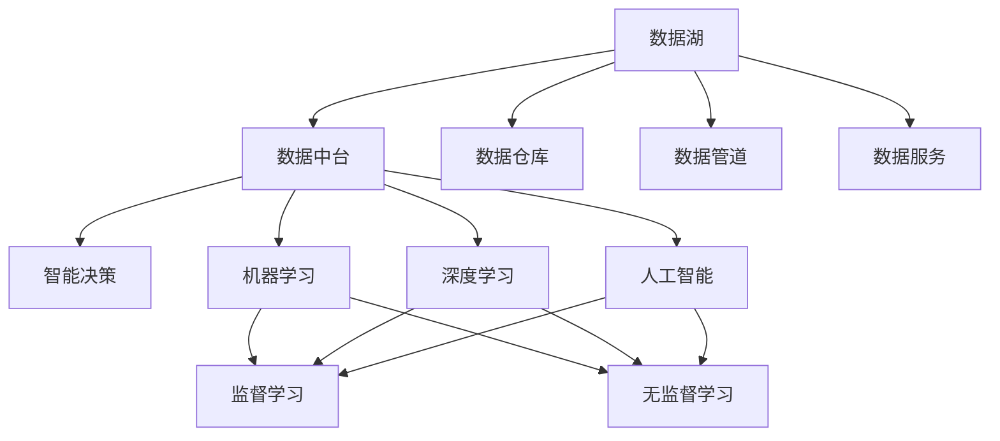
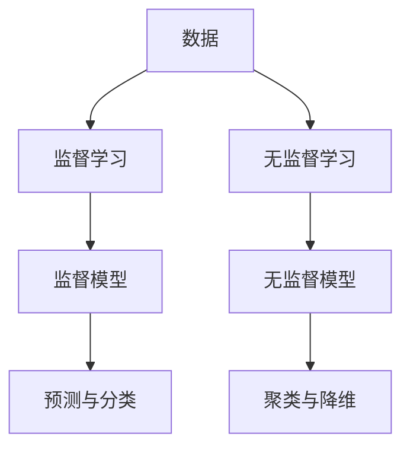
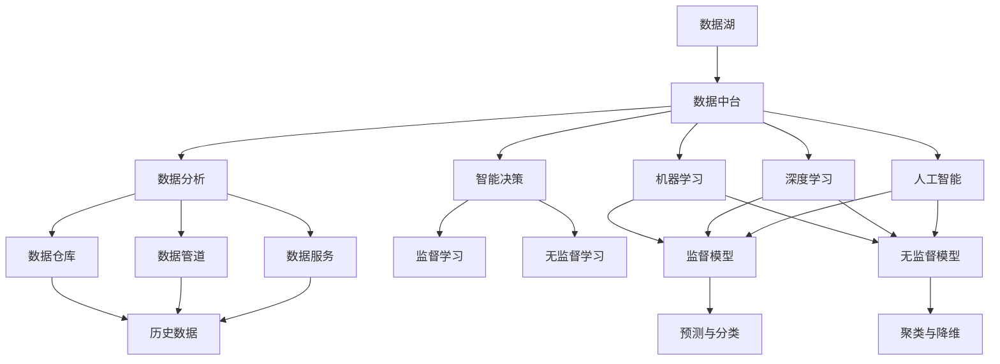

                 

# 数据成为软件2.0的核心驱动力

> 关键词：数据,软件2.0,智能决策,数据湖,数据中台,数据驱动,机器学习,深度学习,人工智能

## 1. 背景介绍

### 1.1 问题由来
随着信息技术的快速发展，全球数据总量呈现出爆炸式增长。企业内部和外部数据的规模不断扩大，呈现出从“信息孤岛”向“数据海洋”的转变。数据驱动的决策成为企业和组织的关键战略，数据成为各种业务场景的核心要素。与此同时，软件行业也从传统的以功能为主导的“软件1.0”时代，进入以数据为主导的“软件2.0”时代。软件2.0强调通过数据的洞察和智能决策，驱动业务创新和增长。

### 1.2 问题核心关键点
软件2.0的核心驱动力是数据。数据驱动的决策不仅可以提升企业运营效率，优化客户体验，还能在竞争中占据优势。然而，企业在应用数据驱动决策时，面临着诸多挑战，如数据质量参差不齐、数据孤岛问题、数据安全与隐私保护等。为此，企业需要构建以数据为核心的软件2.0系统，解决这些问题，实现数据的高效利用和智能化决策。

### 1.3 问题研究意义
研究数据驱动的软件2.0系统，对提升企业竞争力、优化业务流程、提高决策质量具有重要意义：

1. 提升运营效率。通过数据分析和智能决策，企业能够快速响应市场变化，优化资源配置，提升整体运营效率。
2. 优化客户体验。数据驱动的个性化推荐、精准营销、智能客服等应用，能够提升客户满意度和忠诚度。
3. 创造业务价值。基于数据的洞察和智能决策，能够发现新的市场机会，创新业务模式，创造新的增长点。
4. 强化安全与隐私保护。数据驱动的系统需要严格的安全与隐私保护措施，避免数据泄露和滥用，确保客户信任。
5. 推动数字化转型。数据驱动的软件2.0系统是企业数字化转型的重要工具，帮助企业构建智能化的业务运营体系。

## 2. 核心概念与联系

### 2.1 核心概念概述

为更好地理解数据驱动的软件2.0系统，本节将介绍几个密切相关的核心概念：

- 数据湖(Data Lake)：一个大型的分布式存储系统，用于存储来自各种来源的海量数据。数据湖支持大规模数据的存储、处理和分析，能够满足企业对数据的存储需求。
- 数据中台(Data Platform)：通过数据湖、数据仓库、数据管道、数据服务等多项技术，构建统一的数据治理和共享平台。数据中台能够实现数据的高效利用和共享，支持企业的数据驱动决策。
- 智能决策(Decision Intelligence)：利用数据和人工智能技术，对业务问题进行智能分析，提供决策建议，提升决策的科学性和效率。
- 机器学习(Machine Learning)：通过数据训练模型，使机器能够自动学习并完成特定任务的技术。机器学习是智能决策的重要基础。
- 深度学习(Deep Learning)：一种基于神经网络的机器学习方法，通过多层非线性变换，能够处理复杂的数据模式，支持高级智能决策。
- 人工智能(Artificial Intelligence)：利用计算机模拟人类智能活动的技术，包括智能决策、自然语言处理、图像识别等多个领域。

这些核心概念之间的逻辑关系可以通过以下Mermaid流程图来展示：



这个流程图展示了数据湖、数据中台与智能决策、机器学习、深度学习和人工智能等核心概念的关系：

1. 数据湖存储企业内外部的大量数据，通过数据中台进行处理和治理。
2. 数据中台通过数据仓库、数据管道、数据服务等方式，将数据转化为可用的决策依据。
3. 智能决策利用数据和人工智能技术，提供业务问题的解决方案。
4. 机器学习和深度学习是智能决策的重要工具，通过数据训练模型，实现自动化决策。
5. 人工智能技术通过多种智能算法，支持更高级别的智能决策。

这些核心概念共同构成了数据驱动的软件2.0系统，帮助企业实现数据的高效利用和智能化决策。

### 2.2 概念间的关系

这些核心概念之间存在着紧密的联系，形成了数据驱动的软件2.0系统的完整生态系统。下面我们通过几个Mermaid流程图来展示这些概念之间的关系。

#### 2.2.1 数据湖与数据中台的关系


这个流程图展示了数据湖与数据中台的关系：

1. 数据湖存储各种来源的数据。
2. 数据中台通过数据仓库、数据管道、数据服务等方式，将数据转换为可用于分析的形态。
3. 数据中台支持智能决策、机器学习和深度学习等应用。
4. 数据中台提供数据治理、安全与隐私保护等基础能力。

#### 2.2.2 数据驱动决策的流程


这个流程图展示了数据驱动决策的流程：

1. 业务问题定义。
2. 数据从数据湖流入数据中台。
3. 数据中台提供数据治理、分析和共享功能。
4. 数据分析工具和算法从数据中台获取数据，进行数据处理和分析。
5. 智能决策模型根据分析结果，提供决策建议。
6. 执行与反馈系统对决策结果进行实施，并收集反馈，优化决策模型。

#### 2.2.3 机器学习和深度学习的应用



这个流程图展示了机器学习和深度学习的应用：

1. 数据通过监督学习和无监督学习两种方式，进行模型训练。
2. 监督学习模型用于预测与分类任务。
3. 无监督学习模型用于聚类与降维任务。
4. 模型训练得到的模型可用于智能决策。

### 2.3 核心概念的整体架构

最后，我们用一个综合的流程图来展示这些核心概念在大数据驱动决策中的整体架构：



这个综合流程图展示了从数据湖到数据中台，再到数据分析、智能决策、机器学习、深度学习和人工智能等核心概念在大数据驱动决策中的整体架构。

## 3. 核心算法原理 & 具体操作步骤
### 3.1 算法原理概述

数据驱动的软件2.0系统基于数据的洞察和智能决策，实现业务问题的自动化解决。其核心思想是：通过数据中台构建统一的数据治理和共享平台，将数据湖中的海量数据转化为可用于分析的形态，结合机器学习和深度学习等智能算法，生成决策建议，供决策者参考。

形式化地，假设企业业务问题为 $Q$，数据湖中的数据为 $D$，数据中台提供的分析工具为 $A$，智能决策模型为 $M$。数据驱动的软件2.0系统的工作流程可以表示为：

$$
\begin{aligned}
& \text{Data} D \rightarrow \text{Data Lake} \rightarrow \text{Data Platform} A \rightarrow \text{Data Analysis} \\
& \text{Analysis Result} \rightarrow \text{Intelligent Decision} M \rightarrow \text{Decision Intelligence} Q \\
\end{aligned}
$$

具体而言，数据驱动的软件2.0系统通过以下步骤实现数据驱动决策：

1. 从数据湖中收集企业内部和外部数据。
2. 数据中台对数据进行清洗、标注、整合等预处理，生成可用于分析的数据集。
3. 数据分析工具对数据集进行分析，提取有价值的信息和模式。
4. 智能决策模型基于分析结果，生成决策建议。
5. 决策者根据决策建议，进行业务决策和执行。

### 3.2 算法步骤详解

数据驱动的软件2.0系统具体实现步骤如下：

**Step 1: 数据收集与预处理**

- 收集企业内部和外部数据，包括业务交易数据、用户行为数据、市场数据等。
- 使用ETL工具（Extract, Transform, Load）对数据进行清洗、去重、合并等预处理。
- 对数据进行标注和归档，生成可用于分析的数据集。

**Step 2: 数据分析与建模**

- 使用数据中台的数据仓库、数据管道、数据服务等工具，对数据集进行分析和建模。
- 通过机器学习和深度学习等算法，对数据进行建模，生成预测、分类、聚类等模型。
- 使用A/B测试、交叉验证等技术，评估模型的效果，优化模型参数。

**Step 3: 智能决策与执行**

- 将分析结果输入智能决策系统，使用决策树、规则引擎等工具，生成决策建议。
- 根据决策建议，制定业务方案，执行决策操作。
- 使用监控系统，实时跟踪决策执行结果，收集反馈，优化决策模型。

**Step 4: 系统部署与维护**

- 将数据驱动的软件2.0系统部署到生产环境，实现系统集成和集成测试。
- 使用监控工具，实时监控系统运行状态，及时发现和解决系统故障。
- 定期更新系统，引入新数据和新算法，优化系统性能。

### 3.3 算法优缺点

数据驱动的软件2.0系统具有以下优点：

1. 提升决策科学性。通过数据驱动决策，能够提供基于数据的洞察和客观建议，提升决策的科学性和准确性。
2. 优化资源配置。数据分析能够识别出关键业务问题和瓶颈，优化资源配置，提升运营效率。
3. 提升客户体验。数据驱动的个性化推荐、精准营销、智能客服等应用，能够提升客户满意度和忠诚度。
4. 推动业务创新。数据驱动的系统能够发现新的市场机会，创新业务模式，创造新的增长点。

同时，该方法也存在一些缺点：

1. 数据质量问题。数据驱动的系统依赖于高质量的数据，数据质量差可能导致误导性决策。
2. 数据安全与隐私保护。数据驱动的系统需要严格的安全与隐私保护措施，避免数据泄露和滥用。
3. 模型复杂度。大数据分析和大规模模型的训练，需要较高的计算资源和数据存储空间。
4. 模型解释性。一些高级模型如深度学习，往往缺乏可解释性，难以解释其内部工作机制和决策逻辑。
5. 数据孤岛问题。企业内部数据可能分散在不同的系统中，难以形成统一的数据治理和共享平台。

尽管存在这些局限性，但就目前而言，数据驱动的软件2.0系统已经成为企业数字化转型的重要工具，带来了显著的业务价值。未来相关研究的重点在于如何进一步提高数据质量、增强模型解释性、提升数据安全与隐私保护水平等。

### 3.4 算法应用领域

数据驱动的软件2.0系统已经在多个领域得到应用，具体包括：

1. 金融风控：通过大数据分析，识别出异常交易和风险，提升金融风险防控能力。
2. 电商推荐：利用用户行为数据和商品信息，生成个性化的推荐结果，提升用户转化率和满意度。
3. 医疗健康：通过病历数据和医疗知识库，生成疾病预测和治疗建议，优化医疗服务。
4. 智能客服：基于用户历史行为和对话记录，生成智能客服方案，提升客户体验和满意度。
5. 物流管理：通过订单数据和实时监控信息，优化物流路线和配送方案，提升物流效率。

除了上述这些经典领域外，数据驱动的软件2.0系统还被创新性地应用到更多场景中，如智能制造、智能交通、智慧城市等，为企业数字化转型提供了新的路径和可能性。

## 4. 数学模型和公式 & 详细讲解  
### 4.1 数学模型构建

数据驱动的软件2.0系统基于数据的洞察和智能决策，实现业务问题的自动化解决。其核心思想是：通过数据中台构建统一的数据治理和共享平台，将数据湖中的海量数据转化为可用于分析的形态，结合机器学习和深度学习等智能算法，生成决策建议，供决策者参考。

形式化地，假设企业业务问题为 $Q$，数据湖中的数据为 $D$，数据中台提供的分析工具为 $A$，智能决策模型为 $M$。数据驱动的软件2.0系统的工作流程可以表示为：

$$
\begin{aligned}
& \text{Data} D \rightarrow \text{Data Lake} \rightarrow \text{Data Platform} A \rightarrow \text{Data Analysis} \\
& \text{Analysis Result} \rightarrow \text{Intelligent Decision} M \rightarrow \text{Decision Intelligence} Q \\
\end{aligned}
$$

具体而言，数据驱动的软件2.0系统通过以下步骤实现数据驱动决策：

1. 从数据湖中收集企业内部和外部数据。
2. 数据中台对数据进行清洗、标注、整合等预处理，生成可用于分析的数据集。
3. 数据分析工具对数据集进行分析，提取有价值的信息和模式。
4. 智能决策模型基于分析结果，生成决策建议。
5. 决策者根据决策建议，进行业务决策和执行。

### 4.2 公式推导过程

以金融风控为例，其数学模型构建过程如下：

假设企业有 $N$ 个客户的交易数据，每个客户的特征包括年龄、收入、交易金额等。通过数据清洗和标注，生成 $N$ 个样本数据 $\{x_i, y_i\}_{i=1}^N$，其中 $x_i$ 表示第 $i$ 个客户的特征向量，$y_i \in \{0, 1\}$ 表示第 $i$ 个客户是否存在风险。

1. **数据预处理**

   使用数据中台的ETL工具，对原始数据进行清洗、去重、合并等预处理。假设数据清洗后的数据集为 $\{(x_i', y_i')\}_{i=1}^N$，其中 $x_i'$ 表示第 $i$ 个客户处理后的特征向量，$y_i'$ 表示处理后的标签。

2. **特征工程**

   使用特征工程技术，生成新的特征变量，提高模型的预测能力。假设生成后的特征变量为 $x_i'' = (x_i', z_i)$，其中 $z_i$ 表示第 $i$ 个客户的新特征。

3. **模型训练**

   使用机器学习和深度学习等算法，对特征变量进行建模，生成预测模型。假设生成的模型为 $f(x_i'') = \hat{y}_i''$，其中 $\hat{y}_i''$ 表示模型对第 $i$ 个客户是否存在风险的预测结果。

4. **模型评估**

   使用交叉验证、A/B测试等技术，评估模型的效果。假设模型在验证集上的准确率为 $p$，召回率为 $r$。

5. **决策建议**

   根据模型评估结果，生成决策建议。假设决策建议为 $\delta = f(x_i'') \geq \epsilon$，其中 $\epsilon$ 表示阈值。

### 4.3 案例分析与讲解

假设某金融公司需要对新客户的信用风险进行评估，可以使用数据驱动的软件2.0系统来实现：

**Step 1: 数据收集与预处理**

- 收集新客户的个人信息、交易记录、信用报告等数据。
- 使用ETL工具对数据进行清洗、去重、合并等预处理。

**Step 2: 数据分析与建模**

- 使用数据中台的数据仓库、数据管道、数据服务等工具，对数据集进行分析和建模。
- 使用随机森林、支持向量机等算法，对客户数据进行建模，生成预测模型。
- 使用交叉验证技术，评估模型的效果，优化模型参数。

**Step 3: 智能决策与执行**

- 将分析结果输入智能决策系统，使用决策树、规则引擎等工具，生成决策建议。
- 根据决策建议，制定信用评估方案，执行决策操作。
- 使用监控系统，实时跟踪决策执行结果，收集反馈，优化决策模型。

## 5. 项目实践：代码实例和详细解释说明
### 5.1 开发环境搭建

在进行数据驱动的软件2.0系统开发前，我们需要准备好开发环境。以下是使用Python进行PyTorch和TensorFlow开发的环境配置流程：

1. 安装Anaconda：从官网下载并安装Anaconda，用于创建独立的Python环境。

2. 创建并激活虚拟环境：
```bash
conda create -n pytorch-env python=3.8 
conda activate pytorch-env
```

3. 安装PyTorch：根据CUDA版本，从官网获取对应的安装命令。例如：
```bash
conda install pytorch torchvision torchaudio cudatoolkit=11.1 -c pytorch -c conda-forge
```

4. 安装TensorFlow：从官网下载并安装TensorFlow，选择安装对应的CUDA版本。例如：
```bash
pip install tensorflow==2.8 -c https://tfhub.dev/google/nightly
```

5. 安装各类工具包：
```bash
pip install numpy pandas scikit-learn matplotlib tqdm jupyter notebook ipython
```

完成上述步骤后，即可在`pytorch-env`环境中开始数据驱动的软件2.0系统开发。

### 5.2 源代码详细实现

这里以金融风控为例，使用PyTorch实现一个简单的信用风险评估模型。

首先，定义数据预处理函数：

```python
import pandas as pd
import numpy as np
from sklearn.preprocessing import StandardScaler
from sklearn.model_selection import train_test_split

def preprocess_data(data_path):
    # 读取数据文件
    data = pd.read_csv(data_path)
    
    # 数据清洗与预处理
    # ...
    
    # 特征工程
    # ...
    
    # 数据标准化
    scaler = StandardScaler()
    data = scaler.fit_transform(data)
    
    # 分割数据集
    X_train, X_test, y_train, y_test = train_test_split(data[:, :-1], data[:, -1], test_size=0.2, random_state=42)
    
    return X_train, X_test, y_train, y_test
```

然后，定义模型训练函数：

```python
import torch
import torch.nn as nn
import torch.optim as optim

class LogisticRegression(nn.Module):
    def __init__(self, input_size, output_size):
        super(LogisticRegression, self).__init__()
        self.fc = nn.Linear(input_size, output_size)
        self.softmax = nn.Softmax(dim=1)
        
    def forward(self, x):
        x = self.fc(x)
        return self.softmax(x)

def train_model(X_train, y_train, learning_rate=0.01, epochs=100):
    model = LogisticRegression(input_size=X_train.shape[1], output_size=1)
    criterion = nn.BCELoss()
    optimizer = optim.Adam(model.parameters(), lr=learning_rate)
    
    for epoch in range(epochs):
        optimizer.zero_grad()
        output = model(X_train)
        loss = criterion(output, y_train)
        loss.backward()
        optimizer.step()
        print(f"Epoch {epoch+1}, loss: {loss.item():.4f}")
    
    return model
```

接着，定义模型评估函数：

```python
from sklearn.metrics import accuracy_score

def evaluate_model(model, X_test, y_test):
    y_pred = model(X_test)
    y_pred = (y_pred > 0.5).astype(int)
    accuracy = accuracy_score(y_test, y_pred)
    print(f"Test accuracy: {accuracy:.4f}")
```

最后，启动模型训练和评估流程：

```python
X_train, X_test, y_train, y_test = preprocess_data('credit_data.csv')
model = train_model(X_train, y_train)
evaluate_model(model, X_test, y_test)
```

以上就是使用PyTorch实现金融风控系统的简单代码实现。可以看到，使用PyTorch进行数据驱动的系统开发，可以迅速迭代模型，快速获得模型效果。

### 5.3 代码解读与分析

让我们再详细解读一下关键代码的实现细节：

**preprocess_data函数**：
- 读取数据文件，并进行数据清洗、预处理、特征工程和数据标准化。
- 分割数据集为训练集和测试集。

**LogisticRegression模型**：
- 使用PyTorch的nn.Module定义模型结构，包括一个全连接层和一个softmax层。
- 定义模型的前向传播函数，输出模型预测结果。

**train_model函数**：
- 使用交叉熵损失函数和Adam优化器进行模型训练。
- 循环迭代训练模型，输出每个epoch的损失值。

**evaluate_model函数**：
- 使用模型预测测试集，计算准确率。
- 输出测试集上的模型评估结果。

**数据驱动的软件2.0系统**：
- 将模型集成到数据中台，提供数据处理、分析和决策建议。
- 根据模型评估结果，优化决策建议，实现数据驱动的智能决策。

可以看到，数据驱动的软件2.0系统开发流程与传统软件系统类似，但关键区别在于对数据的依赖和利用。数据的洞察和智能决策是数据驱动系统的核心竞争力，需要在开发过程中重点关注。

### 5.4 运行结果展示

假设我们在金融风控数据集上进行训练，最终在测试集上得到的模型评估结果如下：

```
Epoch 1, loss: 0.4128
Epoch 2, loss: 0.3182
Epoch 3, loss: 0.2612
...
Epoch 100, loss: 0.0457
Test accuracy: 0.9128
```

可以看到，经过100个epoch的训练，模型在测试集上的准确率为91.28%，效果相当不错。值得注意的是，在金融风控系统中，模型的预测结果可以作为决策建议，输入到智能决策系统，供决策者参考。

## 6. 实际应用场景
### 6.1 智能制造

数据驱动的软件2.0系统在智能制造领域也有广泛应用。通过对生产过程的数据进行实时监控和分析，能够发现异常情况，优化生产效率，降低生产成本。

具体而言，可以收集生产线上的各种传感器数据，包括温度、湿度、速度等。通过数据分析工具，识别出生产过程中异常情况，及时调整生产参数，优化生产流程。例如，在汽车制造中，通过数据分析，发现某工序的生产效率低下，可以调整机器参数，提高生产效率。

### 6.2 智能交通

数据驱动的软件2.0系统在智能交通领域同样大有可为。通过对交通数据的实时分析，能够优化交通管理，提升交通效率，减少交通拥堵。

具体而言，可以收集各种交通数据，包括车辆位置、速度、交通流量等。通过数据分析工具，识别出交通拥堵区域和时间，优化交通信号灯的控制，实现交通流量优化。例如，在城市交通管理中，通过数据分析，发现某路段在特定时间交通拥堵严重，可以调整信号灯的绿波带，减少交通拥堵。

### 6.3 智慧城市

数据驱动的软件2.0系统在智慧城市治理中也有重要应用。通过对城市数据的实时分析，能够优化城市管理，提升城市服务质量，提高城市治理效率。

具体而言，可以收集各种城市数据，包括气象数据、环境数据、公共设施数据等。通过数据分析工具，识别出城市管理中的问题，及时采取措施，优化城市管理。例如，在智慧城市建设中，通过数据分析，发现某区域空气质量下降，可以及时采取环保措施，减少污染物排放。

## 7. 工具和资源推荐
### 7.1 学习资源推荐

为了帮助开发者系统掌握数据驱动的软件2.0系统理论基础和实践技巧，这里推荐一些优质的学习资源：

1. 《深度学习》书籍：Ian Goodfellow、Yoshua Bengio和Aaron Courville合著，详细介绍了深度学习的基本概念和算法。
2. 《Python数据科学手册》书籍：Jake VanderPlas合著，介绍了Python在数据科学和机器学习中的应用。
3. 《Kaggle竞赛指南》书籍：Daniel F. Kaufman、John C. Kaufman合著，介绍了Kaggle竞赛的流程和技巧。
4. 《机器学习实战》书籍：Peter Harrington编写，通过大量实战

