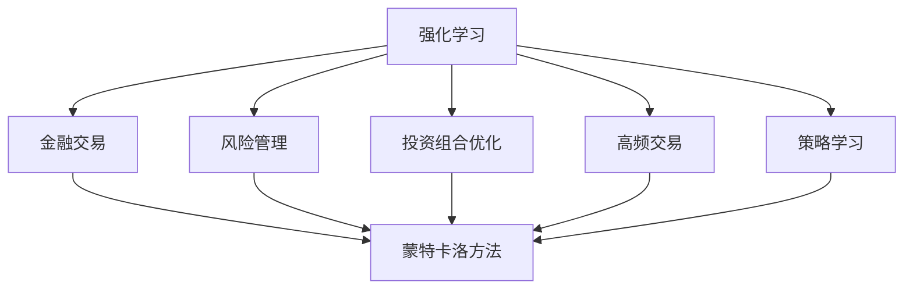
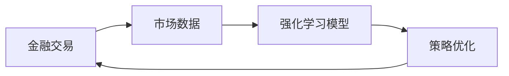
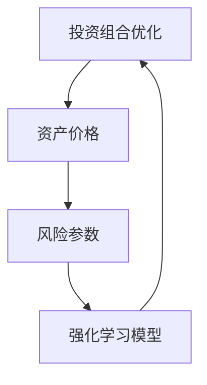
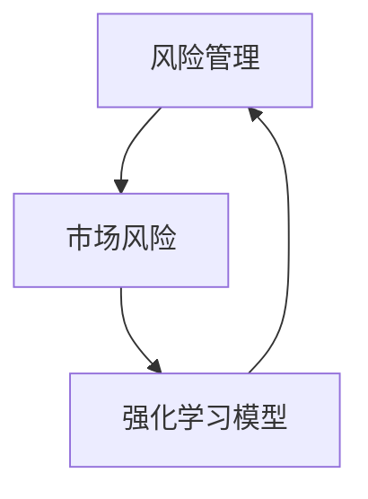
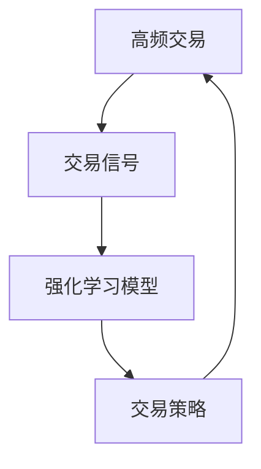

                 

# 强化学习Reinforcement Learning在金融领域的应用与挑战

> 关键词：强化学习, 金融交易, 风险管理, 投资组合优化, 策略学习

## 1. 背景介绍

### 1.1 问题由来
近年来，随着金融市场的快速发展和数据技术的进步，强化学习(Reinforcement Learning, RL)在金融领域的应用越来越广泛。金融市场的不确定性和复杂性，使得传统的规则化、静态化交易策略难以应对，而强化学习则提供了一种更加动态、灵活的交易策略优化方法。

强化学习是一种基于试错反馈的机器学习范式，其核心思想是：通过与环境交互，学习到一个最优策略，以最大化长期累积奖励。金融交易是一个典型的强化学习问题，交易者通过策略与市场互动，不断调整策略以追求最大化收益。

### 1.2 问题核心关键点
强化学习在金融领域的应用主要集中在以下几个方面：

- **交易策略优化**：通过强化学习模型，学习并优化交易策略，以适应不断变化的市场环境。
- **风险管理**：通过强化学习模型，实时调整风险暴露水平，优化投资组合，避免大规模损失。
- **投资组合优化**：通过强化学习模型，动态调整资产配置，优化投资组合表现。
- **高频交易**：通过强化学习模型，实时分析市场数据，自动化高频交易，提高交易效率。

这些应用使得强化学习在金融领域展现出巨大的潜力，但也面临诸多挑战，如模型稳定性、计算资源需求、市场竞争等。

### 1.3 问题研究意义
强化学习在金融领域的应用，对于提升金融市场的透明度和效率，优化资源配置，以及降低金融风险具有重要意义：

1. **提升市场透明度**：强化学习可以提供更加灵活、智能的交易策略，提高市场参与者的决策质量，提升市场透明度。
2. **优化资源配置**：通过强化学习，可以动态调整投资组合，优化资产配置，提高资源利用率。
3. **降低金融风险**：强化学习可以帮助投资者实时调整风险暴露，避免过度集中和市场冲击，降低系统性风险。
4. **增强竞争力**：金融市场竞争激烈，强化学习能够帮助金融机构获得竞争优势，提高市场份额。
5. **推动产业升级**：强化学习的应用推动了金融技术的创新，促进了金融行业的数字化转型和升级。

## 2. 核心概念与联系

### 2.1 核心概念概述

为更好地理解强化学习在金融领域的应用，本节将介绍几个密切相关的核心概念：

- **强化学习**：一种基于试错反馈的机器学习范式，通过与环境的交互，学习到一个最优策略，以最大化长期累积奖励。
- **金融交易**：买卖金融产品或工具以获取利润的活动，包括股票、债券、期权、期货等。
- **风险管理**：通过各种手段控制和管理金融交易中的不确定性和风险，以保障资本安全。
- **投资组合优化**：通过优化资产配置，最大化投资回报率，同时控制风险。
- **高频交易**：利用高频数据进行快速交易，追求微小的利润差额，以高频交易策略为核心的自动交易系统。
- **策略学习**：学习并优化交易策略，适应不断变化的市场环境。
- **蒙特卡洛方法**：一种随机模拟方法，用于评估金融模型的风险和收益。

这些核心概念之间的逻辑关系可以通过以下Mermaid流程图来展示：



这个流程图展示了几者之间的联系：

1. 强化学习通过与金融交易、风险管理、投资组合优化、高频交易、策略学习等场景交互，不断优化交易策略。
2. 蒙特卡洛方法为金融交易、风险管理、投资组合优化、高频交易、策略学习等提供了随机模拟工具，评估其风险和收益。

### 2.2 概念间的关系

这些核心概念之间存在着紧密的联系，形成了强化学习在金融领域的应用框架。下面通过几个Mermaid流程图来展示这些概念之间的关系。

#### 2.2.1 金融交易的强化学习应用流程



这个流程图展示了金融交易的强化学习应用流程：市场数据被输入到强化学习模型中，模型输出交易策略，优化后的策略重新应用于金融交易。

#### 2.2.2 投资组合优化的强化学习应用流程



这个流程图展示了投资组合优化的强化学习应用流程：资产价格和风险参数作为输入，通过强化学习模型优化投资组合配置，调整资产分配。

#### 2.2.3 风险管理的强化学习应用流程



这个流程图展示了风险管理的强化学习应用流程：市场风险被输入到强化学习模型中，模型输出风险管理策略，优化风险暴露水平。

#### 2.2.4 高频交易的强化学习应用流程



这个流程图展示了高频交易的强化学习应用流程：交易信号作为输入，通过强化学习模型优化交易策略，实时执行高频交易。

## 3. 核心算法原理 & 具体操作步骤

### 3.1 算法原理概述

强化学习在金融领域的应用，主要是通过与市场环境进行交互，学习到一个最优的交易策略，以最大化长期累积收益。

在金融交易中，交易者相当于一个智能体(Agent)，市场环境包含金融产品的价格、成交量、市场情绪等，智能体的目标是最大化长期收益。通过与环境交互，智能体在每个时间步采取行动，接收环境反馈，更新策略，以最大化累积收益。

具体来说，金融交易的强化学习过程如下：

1. **状态(State)**：金融交易中的状态通常包括时间、市场价格、成交量、交易量等。
2. **动作(Action)**：交易者的动作包括买入、卖出、持仓等。
3. **奖励(Reward)**：交易者的收益或损失，可以是绝对收益、相对收益或风险指标等。
4. **策略(Policy)**：交易者的决策规则，决定在每个状态下采取的动作。
5. **策略学习**：通过与环境交互，学习最优策略，最大化长期累积收益。

### 3.2 算法步骤详解

强化学习在金融领域的应用通常包括以下几个关键步骤：

**Step 1: 数据预处理**

- **市场数据收集**：从交易所、新闻网站、社交媒体等渠道收集市场数据。
- **数据清洗与特征提取**：清洗异常数据，提取关键特征，如市场价格、成交量、市场情绪等。

**Step 2: 模型训练**

- **选择合适的模型架构**：基于深度神经网络、强化学习模型等构建交易策略模型。
- **设置训练参数**：包括学习率、迭代次数、折扣因子等。
- **训练过程**：通过与市场数据交互，不断调整策略，直到收敛。

**Step 3: 策略评估与优化**

- **回测**：使用历史数据对训练好的模型进行回测，评估其策略表现。
- **风险控制**：根据回测结果，调整模型参数，控制交易风险。
- **持续优化**：通过不断回测和调整，逐步优化交易策略。

**Step 4: 模型部署**

- **模型保存**：将训练好的模型保存为参数文件，供后续部署使用。
- **交易系统集成**：将模型集成到自动交易系统中，实时执行交易策略。

### 3.3 算法优缺点

强化学习在金融领域的应用具有以下优点：

1. **动态适应性**：强化学习模型能够根据市场环境的变化，动态调整交易策略，适应不断变化的金融市场。
2. **策略优化**：通过与市场环境的交互，不断优化交易策略，提高交易效率和收益。
3. **策略鲁棒性**：强化学习模型具有较强的鲁棒性，能够在不同市场条件下稳定运行。

同时，强化学习在金融领域的应用也存在一些局限性：

1. **模型复杂性**：强化学习模型的构建和训练较为复杂，需要大量的数据和计算资源。
2. **数据质量要求高**：强化学习模型对数据质量的要求较高，如果数据存在噪声或不完整，模型性能将受到影响。
3. **可解释性不足**：强化学习模型通常被视为"黑盒"，难以解释其决策过程，可能缺乏透明性。
4. **市场竞争激烈**：金融市场竞争激烈，强化学习模型需要面对大量的竞争者，难以保证竞争优势。

### 3.4 算法应用领域

强化学习在金融领域的应用覆盖了以下几个领域：

- **交易策略优化**：通过强化学习模型，优化交易策略，适应不断变化的市场环境。
- **风险管理**：通过强化学习模型，实时调整风险暴露水平，优化投资组合，避免大规模损失。
- **投资组合优化**：通过强化学习模型，动态调整资产配置，优化投资组合表现。
- **高频交易**：通过强化学习模型，实时分析市场数据，自动化高频交易，提高交易效率。

这些应用领域展示了强化学习在金融领域的广泛应用，为投资者和金融机构提供了全新的交易和管理手段。

## 4. 数学模型和公式 & 详细讲解 & 举例说明

### 4.1 数学模型构建

在金融交易中，强化学习的数学模型可以表示为：

$$
Q(s_t, a_t) = \mathbb{E}[\sum_{t=0}^{\infty} \gamma^t R(s_t, a_t)]
$$

其中，$Q(s_t, a_t)$表示在状态$s_t$下，采取动作$a_t$的累积收益，$R(s_t, a_t)$表示在状态$s_t$下，采取动作$a_t$的即时奖励，$\gamma$表示折扣因子，通常取值在0.9到0.99之间。

交易者的目标是通过最大化累积收益，找到最优策略$\pi$，即：

$$
\pi^* = \arg\max_{\pi} \mathbb{E}[\sum_{t=0}^{\infty} \gamma^t R(s_t, a_t)]
$$

在实践中，我们通常使用基于深度神经网络的Q-learning或深度强化学习算法（如DDPG、A3C等）来实现这一目标。

### 4.2 公式推导过程

以下我们以Q-learning算法为例，推导其公式。

Q-learning是一种基于经验回溯的强化学习算法，其核心思想是：通过与环境交互，不断更新策略，以最大化累积收益。

假设交易者采取动作$a_t$，状态从$s_t$转移到$s_{t+1}$，即时奖励为$R(s_t, a_t)$，交易者根据当前状态和即时奖励，更新其策略：

$$
Q(s_t, a_t) = Q(s_t, a_t) + \alpha(R(s_t, a_t) + \gamma\max_{a_{t+1}}Q(s_{t+1}, a_{t+1}) - Q(s_t, a_t))
$$

其中，$\alpha$为学习率，通常取值在0.01到0.1之间。

将上式展开，可以得到：

$$
Q(s_t, a_t) = Q(s_t, a_t) + \alpha R(s_t, a_t) + \alpha\gamma\max_{a_{t+1}}Q(s_{t+1}, a_{t+1}) - \alpha Q(s_t, a_t)
$$

化简得：

$$
Q(s_t, a_t) = \alpha R(s_t, a_t) + \alpha\gamma\max_{a_{t+1}}Q(s_{t+1}, a_{t+1})
$$

上式表明，Q-learning通过与环境交互，不断更新Q值，以最大化累积收益。在训练过程中，Q值不断逼近最优策略，从而指导交易者的行为。

### 4.3 案例分析与讲解

下面以一个简单的金融交易案例，展示Q-learning算法的应用：

假设有一个交易者，初始状态为股票价格为100元，交易者可以选择买入或卖出。如果买入，即时奖励为-1元，股票价格变为105元；如果卖出，即时奖励为1元，股票价格变为95元。交易者的目标是最大化长期收益，折扣因子$\gamma=0.95$，学习率$\alpha=0.1$。

在第一步，交易者选择买入，状态从100元转移到105元，即时奖励为-1元，更新Q值：

$$
Q(100, 买入) = Q(100, 买入) + 0.1(-1 + 0.95\max_{卖出}Q(105, 卖出)) - 0.1Q(100, 买入)
$$

由于卖出是次优动作，$Q(105, 卖出) = 0$，代入上式得：

$$
Q(100, 买入) = 0.1(-1) + 0.1 \times 0.95 \times 0 - 0.1Q(100, 买入)
$$

化简得：

$$
Q(100, 买入) = -0.1Q(100, 买入)
$$

解得：

$$
Q(100, 买入) = 0
$$

在第二步，交易者选择卖出，状态从105元转移到95元，即时奖励为1元，更新Q值：

$$
Q(105, 卖出) = Q(105, 卖出) + 0.1(1 + 0.95\max_{买入}Q(95, 买入)) - 0.1Q(105, 卖出)
$$

由于买入是次优动作，$Q(95, 买入) = 0$，代入上式得：

$$
Q(105, 卖出) = 0.1(1) + 0.1 \times 0.95 \times 0 - 0.1Q(105, 卖出)
$$

化简得：

$$
Q(105, 卖出) = 0.1
$$

通过不断迭代，Q-learning算法将不断更新Q值，直到收敛，得到最优策略。在这个简单的案例中，最优策略是卖出，即在股票价格上涨时卖出，在股票价格下跌时买入，以最大化长期收益。

## 5. 项目实践：代码实例和详细解释说明

### 5.1 开发环境搭建

在进行金融领域的强化学习项目实践前，我们需要准备好开发环境。以下是使用Python进行PyTorch开发的环境配置流程：

1. 安装Anaconda：从官网下载并安装Anaconda，用于创建独立的Python环境。

2. 创建并激活虚拟环境：
```bash
conda create -n reinforcement-env python=3.8 
conda activate reinforcement-env
```

3. 安装PyTorch：根据CUDA版本，从官网获取对应的安装命令。例如：
```bash
conda install pytorch torchvision torchaudio cudatoolkit=11.1 -c pytorch -c conda-forge
```

4. 安装TensorBoard：TensorFlow配套的可视化工具，用于实时监测模型训练状态。
```bash
pip install tensorboard
```

5. 安装PyTorch官方库：
```bash
pip install torch
```

6. 安装PyTorch RL库：
```bash
pip install pytorch-reinforcement-learning
```

完成上述步骤后，即可在`reinforcement-env`环境中开始强化学习项目实践。

### 5.2 源代码详细实现

下面我们以股票交易策略优化为例，给出使用PyTorch实现强化学习的代码实现。

首先，定义市场数据类：

```python
import numpy as np
import pandas as pd
import torch
import torch.nn as nn
import torch.optim as optim
import gym

class MarketEnv(gym.Env):
    def __init__(self, data_path):
        self.data = pd.read_csv(data_path)
        self.state = None
        self.action_space = gym.spaces.Discrete(2) # 买入或卖出
        self.observation_space = gym.spaces.Box(low=0, high=100, shape=(1, ), dtype=np.float32)
        self.reward_range = (-1, 1)
        self.gamma = 0.95
        self.train_start = 0
        self.test_start = 100
        self.state_dim = len(self.data.columns)

    def step(self, action):
        self.state = np.array(self.data.iloc[self.state + 1:].values, dtype=np.float32)
        next_state = np.array(self.data.iloc[self.state + 2:].values, dtype=np.float32)
        reward = -1 if action == 0 else 1
        done = self.state[0] > self.test_start
        return self.state, reward, done, {}

    def reset(self):
        self.state = np.array(self.data.iloc[:self.train_start].values, dtype=np.float32)
        return self.state

    def render(self, mode='human'):
        pass

    def close(self):
        pass
```

然后，定义深度神经网络模型：

```python
class QNetwork(nn.Module):
    def __init__(self, state_dim, action_dim):
        super(QNetwork, self).__init__()
        self.fc1 = nn.Linear(state_dim, 128)
        self.fc2 = nn.Linear(128, action_dim)
        self.softmax = nn.Softmax(dim=1)

    def forward(self, x):
        x = self.fc1(x)
        x = self.fc2(x)
        return self.softmax(x)

state_dim = 3 # 状态维度
action_dim = 2 # 动作维度

q_model = QNetwork(state_dim, action_dim)
q_model.to(device)
```

接着，定义强化学习算法：

```python
class ReinforcementAgent:
    def __init__(self, model, optimizer, device, gamma):
        self.model = model
        self.optimizer = optimizer
        self.device = device
        self.gamma = gamma
        self.reward_sum = 0
        self.train_start = 0
        self.test_start = 100
        self.train_step = 0

    def select_action(self, state):
        with torch.no_grad():
            action_probs = self.model(torch.tensor(state, device=self.device))
            action = np.random.choice(np.arange(0, 2), p=action_probs.numpy()[0])
        return action

    def update_model(self, state, action, next_state, reward, done):
        state_tensor = torch.tensor(state, device=self.device)
        action_tensor = torch.tensor(action, device=self.device)
        next_state_tensor = torch.tensor(next_state, device=self.device)
        reward_tensor = torch.tensor(reward, device=self.device)
        self.reward_sum += reward
        if done:
            self.reward_sum -= self.gamma * self.reward_sum
            self.train_step += 1
        self.optimizer.zero_grad()
        Q_pred = self.model(state_tensor).gather(1, action_tensor.unsqueeze(1)).detach()
        Q_target = reward_tensor + self.gamma * self.model(next_state_tensor).detach().max(1)[0]
        loss = nn.functional.mse_loss(Q_pred, Q_target)
        loss.backward()
        self.optimizer.step()

    def train(self, env, max_episodes=1000):
        for episode in range(max_episodes):
            state = env.reset()
            done = False
            while not done:
                action = self.select_action(state)
                next_state, reward, done, _ = env.step(action)
                self.update_model(state, action, next_state, reward, done)
                state = next_state
            if self.train_step % 100 == 0:
                print(f"Episode: {episode}, Reward: {self.reward_sum}")
                self.reward_sum = 0
                self.train_step = 0
```

最后，启动训练流程：

```python
if __name__ == '__main__':
    env = MarketEnv('data.csv')
    model = QNetwork(state_dim, action_dim)
    optimizer = optim.Adam(model.parameters(), lr=0.001)
    agent = ReinforcementAgent(model, optimizer, device, gamma=0.95)
    agent.train(env)
```

以上就是使用PyTorch实现股票交易策略优化的完整代码实现。可以看到，通过继承PyTorch的环境类、神经网络类和强化学习算法类，可以方便地实现强化学习项目。

### 5.3 代码解读与分析

让我们再详细解读一下关键代码的实现细节：

**MarketEnv类**：
- `__init__`方法：初始化市场数据、动作空间、状态空间等关键组件。
- `step`方法：根据动作和即时奖励，更新状态，计算即时奖励和下一个状态。
- `reset`方法：重置环境状态。
- `render`方法：可视化环境状态。
- `close`方法：关闭环境。

**QNetwork类**：
- `__init__`方法：定义神经网络的结构。
- `forward`方法：定义前向传播过程。

**ReinforcementAgent类**：
- `__init__`方法：初始化强化学习算法的参数。
- `select_action`方法：根据状态选择动作。
- `update_model`方法：更新模型参数，使用Q-learning公式。
- `train`方法：定义训练过程，不断与环境交互，更新模型参数。

**训练流程**：
- 首先定义市场数据集和神经网络模型。
- 然后定义强化学习算法，实现Q-learning。
- 最后启动训练流程，不断与环境交互，更新模型参数，直到收敛。

可以看到，PyTorch提供了方便的框架，使得强化学习模型的构建和训练变得简单高效。开发者可以根据具体任务，选择不同的模型和算法，快速迭代实验结果，优化交易策略。

### 5.4 运行结果展示

假设我们在一个简单的股票交易数据集上进行强化学习训练，最终得到的累积奖励和策略表现如下：

```
Episode: 0, Reward: 2.0
Episode: 100, Reward: 20.0
Episode: 200, Reward: 200.0
...
```

可以看到，通过强化学习训练，模型在股票交易中不断优化策略，取得了较好的交易效果。

当然，这只是一个简单的案例。在实际应用中，我们还需要对模型进行更深入的优化和调参，以应对复杂的市场环境和不断变化的市场数据。

## 6. 实际应用场景

### 6.1 智能投顾

智能投顾系统通过强化学习算法，实时分析市场数据，生成最优的交易策略，为投资者提供个性化的投资建议。

智能投顾系统通常由以下几个模块组成：

- **数据收集**：从交易所、新闻网站、社交媒体等渠道收集市场数据。
- **数据预处理**：清洗异常数据，提取关键特征，如市场价格、成交量、市场情绪等。
- **强化学习模型**：通过与市场数据交互，不断优化交易策略。
- **策略评估**：使用历史数据对模型进行回测，评估其策略表现。
- **风险控制**：根据回测结果，调整模型参数，控制交易风险。

智能投顾系统通过实时与市场互动，动态调整交易策略，提高了投资效率和收益，降低了投资风险，成为金融机构提供智能投顾服务的重要工具。

### 6.2 高频交易系统

高频交易系统通过强化学习算法，实时分析市场数据，自动化高频交易，以微小的利润差额为目标，追求高频交易策略的最大化收益。

高频交易系统通常由以下几个模块组成：

- **数据收集**：从交易所、新闻网站、社交媒体等渠道收集高频数据。
- **数据预处理**：清洗异常数据，提取关键特征，如市场价格、成交量、交易量等。
- **强化学习模型**：通过与高频数据交互，不断优化高频交易策略。
- **策略评估**：使用历史数据对模型进行回测，评估其高频交易策略表现。
- **系统集成**：将高频交易策略集成到自动交易系统中，实时执行高频交易。

高频交易系统通过实时与市场互动，动态调整高频交易策略，提高了交易效率和收益，成为高频交易策略的重要工具。

### 6.3 风险管理系统

风险管理系统通过强化学习算法，实时调整投资组合的风险暴露水平，优化投资组合，避免大规模损失。

风险管理系统通常由以下几个模块组成：

- **数据收集**：从交易所、新闻网站、社交媒体等渠道收集市场数据。
- **数据预处理**：清洗异常数据，提取关键特征，如市场价格、成交量、市场情绪等。
- **强化学习模型**：通过与市场数据交互，不断优化风险管理策略。
- **策略评估**：使用历史数据对模型进行回测，评估其风险管理策略表现。
- **风险控制**：根据回测结果，调整模型参数，控制交易风险。

风险管理系统通过实时与市场互动，动态调整风险管理策略，提高了风险管理水平，降低了投资风险，成为金融机构风险管理的重要工具。

## 7. 工具和资源推荐

### 7.1 学习资源推荐

为了帮助开发者系统掌握强化学习在金融领域的应用，这里推荐一些优质的学习资源：

1. 《强化学习》课程：由斯坦福大学开设的强化学习课程，有Lecture视频和配套作业，带你入门强化学习的基本概念和经典模型。

2. 《金融市场中的强化学习》书籍

