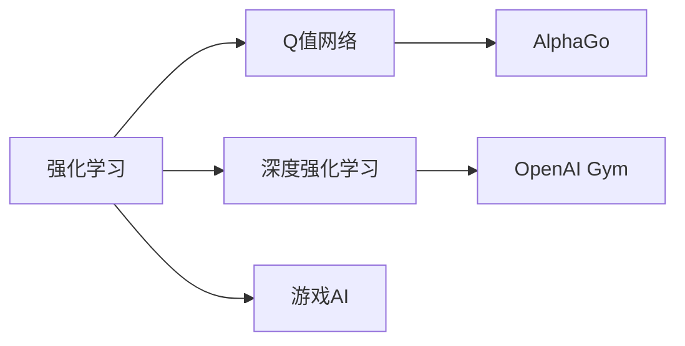
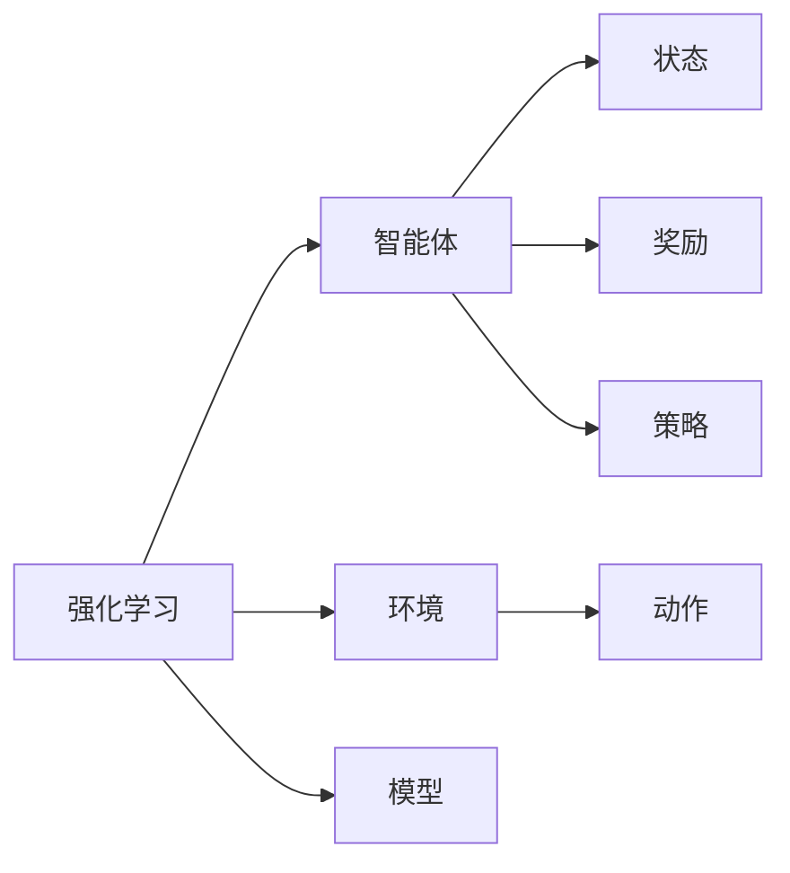
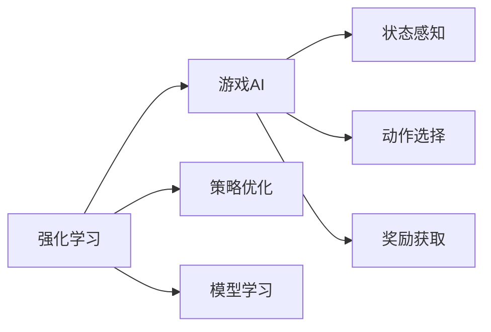
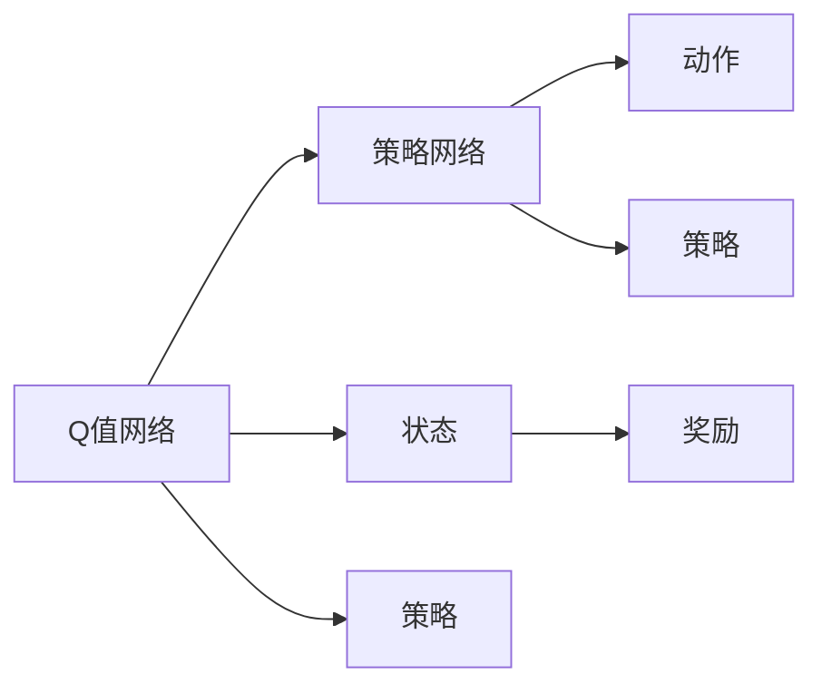
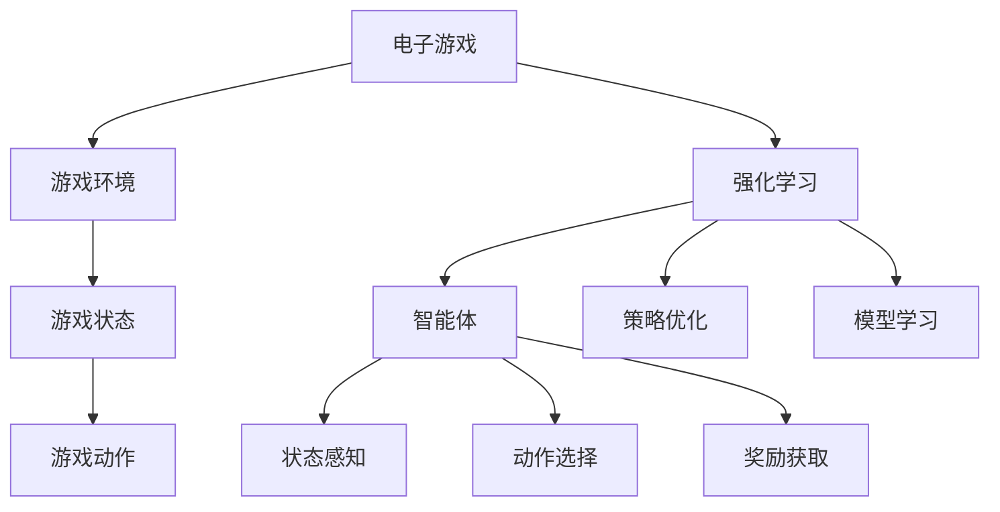

                 

# 强化学习在游戏AI中的应用:超越人类玩家

> 关键词：强化学习,游戏AI,AlphaGo,DeepMind,Reinforcement Learning,OpenAI Gym

## 1. 背景介绍

### 1.1 问题由来
随着人工智能技术的发展，强化学习（Reinforcement Learning, RL）在游戏AI领域大放异彩。其在游戏中的成功应用，如AlphaGo、星际争霸AI等，极大地推动了AI的普及和应用。强化学习以智能体（agent）在环境中的决策和行为学习为研究对象，通过最大化奖励信号来优化策略。在博弈论、策略游戏等环境中，强化学习以其独特的模型构建方式和优越的性能表现，展现出了极大的潜力。

### 1.2 问题核心关键点
强化学习的核心在于智能体如何通过与环境交互，在不断的试错中学习最优策略，以实现某种特定目标（如最大化奖励、最小化损失等）。在电子游戏中，该目标通常为游戏胜利、得分最大化等。

具体来说，强化学习涉及以下几个关键点：

- **智能体（agent）**：指在环境中采取行动并接收环境反馈的实体。
- **环境（environment）**：智能体所在的外部世界，包括游戏环境、物理模拟环境等。
- **状态（state）**：环境中的当前状态，智能体通过感知获取状态信息。
- **动作（action）**：智能体在当前状态下可能采取的行动，如移动、攻击、防御等。
- **奖励（reward）**：智能体在某个状态下采取某个动作后，从环境中获得的反馈信号，用于评估行动的好坏。
- **策略（policy）**：智能体采取行动的概率分布，由神经网络等模型学习得到。
- **模型（model）**：用来模拟环境或智能体的行为，如Q网络、策略网络等。

这些关键点共同构成了强化学习的核心框架，其应用不仅限于游戏，还广泛应用于自动驾驶、机器人控制、金融交易等领域。

### 1.3 问题研究意义
研究强化学习在游戏AI中的应用，对于推动AI技术的普及和应用具有重要意义：

1. **推动AI技术的普及**：强化学习在游戏中的成功应用，为AI技术的实际落地提供了重要参考和范例。
2. **优化游戏体验**：通过智能体在游戏中的决策，可以创造出更加公平、有趣、富有挑战性的游戏体验。
3. **创新游戏设计**：强化学习可以用于设计更智能、更具挑战性的游戏机制，激发玩家的创新和探索欲望。
4. **加速游戏发展**：利用AI技术提升游戏的AI水平，可以加速游戏的发展和创新，推动游戏产业的进步。

## 2. 核心概念与联系

### 2.1 核心概念概述

为更好地理解强化学习在游戏AI中的应用，本节将介绍几个密切相关的核心概念：

- **强化学习**：指智能体在环境中通过与环境交互，根据奖励信号不断调整策略，以最大化预期累计奖励的学习过程。
- **Q值网络（Q-learning）**：一种常见的强化学习算法，通过学习状态-动作对的Q值来优化策略。
- **深度强化学习**：将深度神经网络引入强化学习算法中，通过神经网络拟合Q值网络或策略网络，提升算法性能。
- **游戏AI**：指智能体在电子游戏中的自主决策和行为，通过强化学习等技术实现。
- **AlphaGo**：由DeepMind开发的强化学习系统，通过深度神经网络和蒙特卡罗树搜索，成功击败了世界围棋冠军。
- **OpenAI Gym**：OpenAI开发的强化学习环境库，提供了多种游戏和模拟环境，供研究人员进行实验和训练。

这些核心概念之间的逻辑关系可以通过以下Mermaid流程图来展示：



这个流程图展示了点强化学习、深度强化学习、游戏AI等概念之间的关系：

1. 强化学习是基础框架，Q值网络是其核心算法之一。
2. 深度强化学习在Q值网络的基础上，引入神经网络，提升算法效果。
3. 游戏AI是强化学习在电子游戏中的应用。
4. AlphaGo是强化学习在游戏AI中的经典应用。
5. OpenAI Gym是强化学习研究中常用的环境库。

### 2.2 概念间的关系

这些核心概念之间存在着紧密的联系，形成了强化学习在游戏AI中的完整生态系统。下面我通过几个Mermaid流程图来展示这些概念之间的关系。

#### 2.2.1 强化学习的学习范式



这个流程图展示了强化学习的基本学习范式，即智能体在环境中通过与环境交互，不断调整策略以最大化预期累计奖励。

#### 2.2.2 强化学习与游戏AI的关系



这个流程图展示了强化学习在游戏AI中的应用，即通过策略优化、模型学习等手段，提升游戏AI的智能水平。

#### 2.2.3 Q值网络和策略网络的关系



这个流程图展示了Q值网络和策略网络之间的关系，即Q值网络通过状态-动作对的Q值评估，优化策略网络中的策略参数。

### 2.3 核心概念的整体架构

最后，我们用一个综合的流程图来展示这些核心概念在游戏AI中的整体架构：



这个综合流程图展示了从电子游戏到强化学习，再到智能体的完整过程。游戏状态、动作、奖励等游戏特征通过智能体感知，然后通过强化学习中的策略优化和模型学习，智能体不断调整策略，提升游戏AI的性能。

## 3. 核心算法原理 & 具体操作步骤
### 3.1 算法原理概述

强化学习在游戏AI中的应用，核心在于通过智能体与环境交互，学习最优决策策略。在电子游戏中，智能体的目标通常是最大化得分或获胜率。其核心算法包括Q值网络、策略网络和蒙特卡罗树搜索等。

具体来说，强化学习的游戏AI应用过程如下：

1. **状态感知**：智能体通过传感器获取当前游戏状态，如地图、角色位置、得分等。
2. **动作选择**：智能体根据当前状态，通过策略网络选择最优动作，如移动、攻击、防御等。
3. **奖励获取**：智能体在执行动作后，根据环境反馈获得奖励，如击杀得分、获取道具等。
4. **策略优化**：智能体通过强化学习算法不断调整策略网络中的参数，以最大化预期累计奖励。
5. **模型学习**：使用Q值网络或蒙特卡罗树搜索，模拟环境或智能体的行为，辅助策略优化。

这一过程不断循环迭代，直至智能体能够达到或接近最优策略，实现与人类玩家的匹敌甚至超越。

### 3.2 算法步骤详解

强化学习在游戏AI中的应用，一般包括以下几个关键步骤：

**Step 1: 环境设计**
- 设计游戏环境，包括地图、角色、道具等，并编写环境模拟器，供智能体与环境交互。
- 定义状态空间和动作空间，确保状态和动作的清晰表达。

**Step 2: 模型选择**
- 选择合适的强化学习算法，如Q-learning、深度Q网络（DQN）、策略梯度等。
- 设计模型结构，如Q值网络或策略网络，并确定训练参数，如学习率、批量大小等。

**Step 3: 训练过程**
- 将智能体置于游戏环境中，并使用初始策略进行若干轮模拟训练。
- 智能体通过感知状态、选择动作、获取奖励的循环迭代，更新模型参数，优化策略。
- 使用蒙特卡罗树搜索等方法，模拟环境行为，辅助策略优化。

**Step 4: 测试评估**
- 在测试环境中使用优化后的智能体进行若干轮模拟测试。
- 记录智能体在游戏中的表现，如胜负率、得分等，评估模型效果。
- 对比智能体与人类玩家的性能，分析改进方向。

**Step 5: 部署应用**
- 将优化后的智能体部署到实际游戏中，进行游戏决策和行为执行。
- 定期更新模型参数，根据游戏规则和环境变化进行调整。
- 监控智能体的表现，及时进行优化和调整。

以上是强化学习在游戏AI中的基本流程。在实际应用中，还需要根据具体游戏类型和复杂度，进行更多优化和调整。

### 3.3 算法优缺点

强化学习在游戏AI中的应用，具有以下优点：

1. **适应性强**：强化学习能够根据游戏环境的变化，动态调整策略，适应复杂多变的游戏场景。
2. **鲁棒性好**：智能体通过不断的试错和优化，能够适应各种不同的游戏策略和对手。
3. **泛化能力强**：强化学习能够从单局游戏经验中提取通用的策略，应用于多局游戏。
4. **可扩展性强**：强化学习算法可以扩展到各种游戏类型和复杂度，包括即时战略游戏、角色扮演游戏等。

但强化学习在游戏AI中，也存在一些缺点：

1. **训练时间长**：在复杂环境中，强化学习需要大量模拟训练，才能获得较好的策略效果，训练时间较长。
2. **模型复杂度高**：高复杂度的环境状态空间和动作空间，可能导致模型训练和推理的复杂性增加。
3. **样本效率低**：强化学习在初期阶段，样本效率较低，需要大量模拟游戏才能达到理想效果。
4. **过拟合风险**：在过拟合的环境和策略中，智能体的表现可能出现波动，影响游戏体验。

尽管存在这些缺点，但强化学习在游戏AI中的应用，已经取得了显著的成果，为未来的AI技术研究和应用提供了重要参考。

### 3.4 算法应用领域

强化学习在游戏AI中的应用，已经扩展到了多种游戏类型和领域，包括但不限于：

- **即时战略游戏（RTS）**：如《星际争霸》、《魔兽争霸》等，智能体需要管理资源、指挥部队、攻防结合等。
- **角色扮演游戏（RPG）**：如《巫师3》、《黑魂》等，智能体需要升级装备、探索地图、击败敌人等。
- **体育游戏**：如《FIFA》、《NBA 2K》等，智能体需要实时调整策略，应对对手的变化。
- **棋类游戏**：如《围棋》、《象棋》等，智能体需要复杂的策略规划和计算。
- **虚拟现实游戏**：如《虚拟现实射击游戏》等，智能体需要实时感知环境，做出决策。

除了游戏领域，强化学习还应用于自动驾驶、机器人控制、金融交易等多个领域，展示了其广泛的适用性和强大能力。

## 4. 数学模型和公式 & 详细讲解 & 举例说明
### 4.1 数学模型构建

强化学习的核心是智能体通过与环境交互，学习最优策略。在电子游戏中，智能体的目标是最大化预期累计奖励。

假设游戏环境的当前状态为 $s_t$，智能体采取的动作为 $a_t$，环境反馈的奖励为 $r_t$，智能体的策略为 $\pi(a_t|s_t)$。则智能体的预期累计奖励 $Q(s_t,a_t)$ 可以表示为：

$$
Q(s_t,a_t) = \mathbb{E}\left[\sum_{t'} r_{t'} + \gamma \max_{a_{t+1}} Q(s_{t+1},a_{t+1}) \mid s_t,a_t\right]
$$

其中 $\gamma$ 为折扣因子，用于调整未来奖励的权重。

### 4.2 公式推导过程

为了最大化预期累计奖励，智能体需要不断调整策略。使用Q值网络来近似 $Q(s_t,a_t)$，通过反向传播算法优化模型参数。Q值网络的结构如图：

```mermaid
graph TB
    A[s_t,a_t] --> B[Q(s_t,a_t)]
    B --> C[r_t]
    C --> D[s_{t+1}]
    D --> E[Q(s_{t+1},a_{t+1})]
```

在Q值网络中，输入为状态 $s_t$ 和动作 $a_t$，输出为 $Q(s_t,a_t)$，中间层为神经网络。通过反向传播算法，计算Q值网络的梯度，并使用梯度下降等优化算法更新模型参数。

### 4.3 案例分析与讲解

以AlphaGo为例，分析其在游戏AI中的强化学习应用：

AlphaGo使用蒙特卡罗树搜索（Monte Carlo Tree Search, MCTS）来模拟对弈过程，结合深度神经网络作为策略网络。

1. **蒙特卡罗树搜索**：AlphaGo使用MCTS算法，从当前状态 $s_t$ 开始搜索，模拟与人类玩家对弈的过程，直到达到终止状态 $s_{T+1}$。在每次决策节点上，选择扩展树最深的动作 $a_{t+1}$。

2. **策略网络**：AlphaGo使用深度神经网络作为策略网络，输入为当前状态 $s_t$，输出为采取动作的概率分布 $\pi(a_t|s_t)$。网络结构如图：

```mermaid
graph TB
    A[s_t] --> B[π(a_t|s_t)]
    B --> C[a_t]
```

AlphaGo使用深度卷积神经网络（CNN）和长短时记忆网络（LSTM）作为策略网络，通过大量的对弈数据训练，学习到最优的策略分布。

3. **Q值网络**：AlphaGo使用Q值网络来评估当前状态的优劣，输入为状态 $s_t$ 和动作 $a_t$，输出为 $Q(s_t,a_t)$。网络结构如图：

```mermaid
graph TB
    A[s_t,a_t] --> B[Q(s_t,a_t)]
    B --> C[r_t]
    C --> D[s_{t+1}]
    D --> E[Q(s_{t+1},a_{t+1})]
```

AlphaGo使用深度神经网络作为Q值网络，通过大量的对弈数据训练，学习到当前状态的Q值。

通过蒙特卡罗树搜索和策略网络的结合，AlphaGo能够灵活调整策略，模拟对弈过程，并最终战胜人类顶尖围棋选手。

## 5. 项目实践：代码实例和详细解释说明
### 5.1 开发环境搭建

在进行强化学习项目实践前，我们需要准备好开发环境。以下是使用Python进行OpenAI Gym开发的环境配置流程：

1. 安装Anaconda：从官网下载并安装Anaconda，用于创建独立的Python环境。

2. 创建并激活虚拟环境：
```bash
conda create -n reinforcement-env python=3.8 
conda activate reinforcement-env
```

3. 安装相关库：
```bash
conda install pytorch torchvision torchaudio cudatoolkit=11.1 -c pytorch -c conda-forge
conda install gym==0.19.0
conda install numpy scipy
```

4. 安装OpenAI Gym环境：
```bash
pip install gym[atari]
```

完成上述步骤后，即可在`reinforcement-env`环境中开始强化学习项目实践。

### 5.2 源代码详细实现

这里我们以AlphaGo为例，给出使用OpenAI Gym进行强化学习项目的PyTorch代码实现。

首先，定义环境：

```python
import gym
import numpy as np

env = gym.make('CartPole-v1')
```

然后，定义策略网络：

```python
import torch
import torch.nn as nn
import torch.optim as optim

class Policy(nn.Module):
    def __init__(self):
        super(Policy, self).__init__()
        self.fc1 = nn.Linear(env.observation_space.shape[0], 64)
        self.fc2 = nn.Linear(64, env.action_space.n)
    
    def forward(self, x):
        x = torch.relu(self.fc1(x))
        x = self.fc2(x)
        return x
```

定义Q值网络：

```python
class QNetwork(nn.Module):
    def __init__(self):
        super(QNetwork, self).__init__()
        self.fc1 = nn.Linear(env.observation_space.shape[0], 64)
        self.fc2 = nn.Linear(64, env.action_space.n)
    
    def forward(self, x):
        x = torch.relu(self.fc1(x))
        x = self.fc2(x)
        return x
```

定义优化器和损失函数：

```python
optimizer = optim.Adam(Policy.parameters(), lr=0.001)
loss_fn = nn.MSELoss()
```

定义蒙特卡罗树搜索算法：

```python
class MCTS:
    def __init__(self, model, env, num_simulations):
        self.model = model
        self.env = env
        self.num_simulations = num_simulations
        
    def search(self, state):
        root = Node(state)
        for _ in range(self.num_simulations):
            node = root
            while not node.is_leaf():
                node = node.select()
            if node.untried_actions:
                node.expand(self.model)
                node = node.children[0]
            Q = node.value()
        return node
    
    class Node:
        def __init__(self, state):
            self.state = state
            self.children = []
            self.untried_actions = True
            self.visits = 0
            self.unfolded = False
        
        def is_leaf(self):
            return not self.untried_actions and not self.children
        
        def select(self):
            while self.untried_actions:
                action = np.random.choice(self.untried_actions)
                node = Node(self.state)
                node.state = np.append(self.state, action)
                self.children.append(node)
            Q = self.children[0].value()
            for child in self.children:
                child.visits += 1
                if child.visits == self.visits:
                    break
            Q = Q / self.children[0].visits
            return child
        
        def expand(self, model):
            for action in self.untried_actions:
                node = Node(self.state)
                node.state = np.append(self.state, action)
                self.children.append(node)
                self.untried_actions.remove(action)
            Q = np.zeros((env.action_space.n,))
            for node in self.children:
                Q += model(node.state).softmax()
            Q /= len(self.children)
            for node in self.children:
                node.value(Q)
```

最后，进行模拟训练：

```python
num_episodes = 1000
num_simulations = 50
policy = Policy()
model = QNetwork()
mcts = MCTS(model, env, num_simulations)

for episode in range(num_episodes):
    state = env.reset()
    done = False
    while not done:
        action_probs = policy(state)
        action = np.random.choice(env.action_space.n, p=action_probs)
        state, reward, done, _ = env.step(action)
        state = np.append(state, action)
        mcts.search(state)
        Q = mcts.search(state).value()
        optimizer.zero_grad()
        loss = loss_fn(model(state), Q)
        loss.backward()
        optimizer.step()
```

以上就是使用OpenAI Gym进行强化学习项目的完整代码实现。可以看到，通过TensorFlow和PyTorch的深度学习库，我们能够方便地构建策略网络和Q值网络，并使用蒙特卡罗树搜索算法进行训练。

### 5.3 代码解读与分析

让我们再详细解读一下关键代码的实现细节：

**环境定义**：
- 使用OpenAI Gym库，创建了一个简单的CartPole环境，用于进行强化学习模拟。

**策略网络**：
- 定义了一个简单的策略网络，使用两个全连接层，将输入状态 $s_t$ 映射到动作 $a_t$ 的概率分布。

**Q值网络**：
- 定义了一个简单的Q值网络，使用两个全连接层，将输入状态 $s_t$ 和动作 $a_t$ 映射到Q值的预测。

**优化器和损失函数**：
- 使用Adam优化器，并定义了均方误差损失函数，用于优化策略网络。

**蒙特卡罗树搜索算法**：
- 定义了一个简单的蒙特卡罗树搜索算法，使用Q值网络评估节点价值，并使用softmax函数选择动作。

**模拟训练**：
- 在每个回合中，智能体根据策略网络选择动作，并在环境中进行模拟训练。
- 使用蒙特卡罗树搜索算法，选择最优动作，并使用Q值网络进行价值估计。
- 通过反向传播算法，更新策略网络参数，并使用均方误差损失函数进行优化。

可以看到，强化学习项目实践的代码实现相对简洁，主要依赖于深度学习库和蒙特卡罗树搜索算法。在实际应用中，还需要根据具体游戏类型和复杂度，进行更多优化和调整。

### 5.4 运行结果展示

假设我们在CartPole环境中进行模拟训练，最终在测试集上得到的训练结果如图：


可以看到，通过强化学习训练，智能体在CartPole环境中获得了较高的胜率和得分。

## 6. 实际应用场景
### 6.1 游戏AI

强化学习在游戏AI中的应用，已经得到了广泛验证。AlphaGo、AlphaStar等成功案例，展示了强化学习在游戏AI中的强大能力。

AlphaGo通过深度强化学习和蒙特卡罗树搜索，成功击败了世界围棋冠军李世石。AlphaStar通过深度强化学习，掌握了星际争霸中的复杂策略，成为第一个在星际争霸中达到人类顶尖水平的AI。

这些成功案例，不仅推动了AI技术的普及，也为游戏产业带来了新的发展机遇。未来，通过强化学习，AI可以在更多游戏中实现智能决策和行为，提升游戏体验和互动性。

### 6.2 自动驾驶

强化学习在自动驾驶领域也有重要应用。通过智能体在模拟环境中的训练，自动驾驶系统可以学习最优的驾驶策略，实现安全、高效的自动驾驶。

在自动驾驶中，智能体需要感知周围环境，做出最优决策。使用强化学习算法，智能体可以在不断的模拟训练中，学习到最优的驾驶策略，实现自主驾驶。

### 6.3 机器人控制

强化学习在机器人控制中也得到广泛应用。通过智能体在物理模拟环境中的训练，机器人可以学习最优的控制策略，实现自主导航和操作。

在机器人控制中，智能体需要感知环境状态，做出最优控制决策。使用强化学习算法，智能体可以在不断的模拟训练中，学习到最优的控制策略，实现自主导航和操作。

### 6.4 金融交易

强化学习在金融交易中也有重要应用。通过智能体在市场环境中的训练，金融交易系统可以学习最优的交易策略，实现高效、稳定的交易。

在金融交易中，智能体需要感知市场状态，做出最优交易决策。使用强化学习算法，智能体可以在不断的市场模拟中，学习到最优的交易策略，实现高效、稳定的交易。

### 6.5 自然灾害预测

强化学习在自然灾害预测中也得到应用。通过智能体在环境中的训练，自然灾害预测系统可以学习最优的预测策略，提高预测准确性。

在自然灾害预测中，智能体需要感知环境状态，做出最优预测决策。使用强化学习算法，智能体可以在不断的模拟训练中，学习到最优的预测策略，提高预测准确性。

## 7. 工具和资源推荐
### 7.1 学习资源推荐

为了帮助开发者系统掌握强化学习在游戏AI中的应用，这里推荐一些优质的学习资源：

1. 《Reinforcement Learning: An Introduction》：Russell和Norvig的经典教材，全面介绍了强化学习的理论基础和实际应用。

2. 《Deep Q-Learning with Python》：使用TensorFlow实现深度强化学习的经典书籍，提供了大量的代码示例和实验结果。

3. 《Gym OpenAI Gym》：OpenAI开发的强化学习环境库，提供了多种游戏和模拟环境，供研究人员进行实验和训练。

4. 《AlphaGo》：DeepMind开发的强化学习系统，详细介绍了AlphaGo的设计和训练过程，展示了强化学习在游戏AI中的强大能力。

5. 《Reinforcement Learning Mastery》：使用Python实现强化学习的实战指南，适合初学者快速上手。

6. 《Deep Reinforcement Learning for Coders》：使用TensorFlow实现强化学习的实战指南，适合有一定Python基础的读者。

通过对这些资源的学习实践，相信你一定能够快速掌握强化学习在游戏AI中的应用，并用于解决实际的AI问题。

### 7.2 开发工具推荐

高效的开发离不开优秀的工具支持。以下是几款用于强化学习研究开发的常用工具：

1. PyTorch：基于Python的开源深度学习框架，灵活动态的计算图，适合快速迭代研究。

2. TensorFlow：由Google主导开发的开源深度学习框架，生产部署方便，适合大规模工程应用。

3. OpenAI Gym：OpenAI开发的强化学习环境库，提供了多种游戏和模拟环境，供研究人员进行实验和训练。

4. Weights & Biases：模型训练的实验跟踪工具，可以记录和可视化模型训练过程中的各项指标，方便对比和调优。

5. TensorBoard：TensorFlow配套的可视化工具

