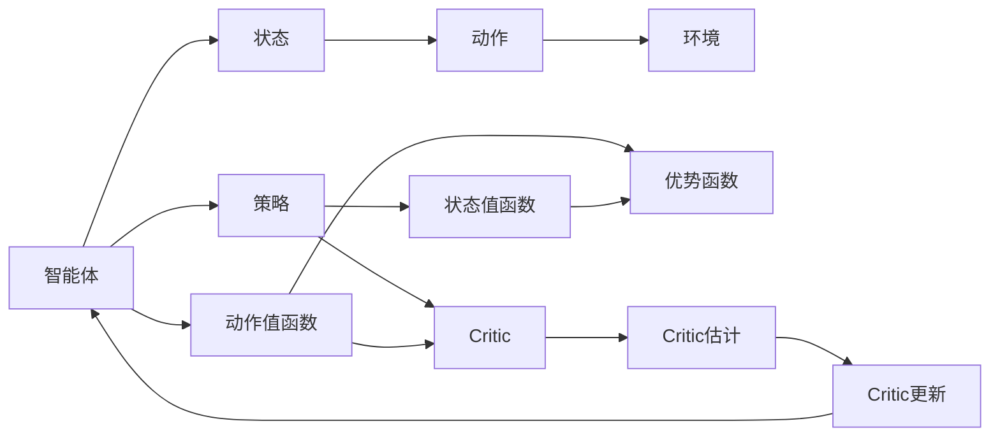

                 

# 强化学习算法：Actor-Critic 原理与代码实例讲解

> 关键词：强化学习,Actor-Critic算法,策略优化,价值估计,梯度提升,深度强化学习

## 1. 背景介绍

强化学习（Reinforcement Learning, RL）作为人工智能（AI）的一个重要分支，专注于智能体（agent）在与环境（environment）交互过程中，通过获取环境反馈信号，逐步优化决策策略的过程。这一过程类似于人类通过试错不断学习新技能的方式。近年来，强化学习在机器人控制、游戏AI、自适应系统等领域展现了令人瞩目的应用潜力，成为推动AI技术进步的关键技术之一。

在强化学习中，智能体通过执行一系列动作（actions）与环境交互，并根据奖励（rewards）信号调整策略。传统强化学习方法基于静态策略，存在收敛速度慢、策略难以优化等问题。而Actor-Critic算法通过引入策略优化和价值估计两大部分，显著提升了学习效率和策略优化能力，成为目前深度强化学习中最为流行的框架之一。

本文将深入探讨Actor-Critic算法的基本原理、具体实现步骤，并通过代码实例演示其应用。文章结构如下：

1. **背景介绍**
2. **核心概念与联系**
3. **核心算法原理与具体操作步骤**
   - 算法原理概述
   - 算法步骤详解
   - 算法优缺点
   - 算法应用领域
4. **数学模型和公式**
   - 数学模型构建
   - 公式推导过程
   - 案例分析与讲解
5. **项目实践：代码实例和详细解释说明**
   - 开发环境搭建
   - 源代码详细实现
   - 代码解读与分析
   - 运行结果展示
6. **实际应用场景**
   - 当前应用
   - 未来应用展望
7. **工具和资源推荐**
   - 学习资源推荐
   - 开发工具推荐
   - 相关论文推荐
8. **总结：未来发展趋势与挑战**
   - 研究成果总结
   - 未来发展趋势
   - 面临的挑战
   - 研究展望
9. **附录：常见问题与解答**

让我们开始深入探讨Actor-Critic算法的世界。

## 2. 核心概念与联系

### 2.1 核心概念概述

为了更好地理解Actor-Critic算法，我们先简要介绍一些相关核心概念：

- **强化学习**：智能体在与环境交互过程中，通过不断尝试不同的动作，积累经验，并根据环境反馈（奖励信号）调整策略的过程。
- **策略**：智能体在每个状态下选择动作的规则或分布。
- **值函数**：评估智能体在某状态下采取特定动作的预期收益。
- **状态值函数**：评估智能体在特定状态下的预期收益。
- **动作值函数**：评估智能体在特定状态下采取特定动作的预期收益。
- **优势函数**：在动作值函数基础上，计算动作的优势度，即某状态下采取该动作相对于平均动作的超额收益。
- **Actor-Critic**：Actor负责策略的优化，Critic负责价值的估计。通过两者交互，不断提升智能体的决策能力。

这些概念构成了强化学习的核心框架，而Actor-Critic算法则是这一框架的典型实现。

### 2.2 概念间的关系

通过以下Mermaid流程图，我们可以更直观地理解这些核心概念之间的关系：



该流程图展示了智能体、状态、动作、环境、策略、状态值函数、动作值函数、优势函数和Actor-Critic框架之间的关系。智能体根据当前状态选择动作，并根据环境反馈调整策略。Critic负责估计状态值函数和动作值函数，Actor则基于这些估计值更新策略，不断提升决策性能。

## 3. 核心算法原理 & 具体操作步骤
### 3.1 算法原理概述

Actor-Critic算法的核心思想是将强化学习的策略优化和值估计分别交给两个独立的网络（Actor和Critic）进行。Actor网络负责策略优化，即在每个状态下选择最优的动作；Critic网络负责价值估计，即评估某状态下采取特定动作的预期收益。

具体而言，Actor-Critic算法分为两个主要步骤：
1. **策略优化**：通过Actor网络优化策略，选择最佳动作。
2. **价值估计**：通过Critic网络估计状态值函数和动作值函数，更新Actor网络的策略。

在实践中，Actor-Critic算法通常采用梯度提升（gradient boosting）的方式，交替进行策略优化和值估计。通过不断迭代，逐步提升智能体的决策能力。

### 3.2 算法步骤详解

以下是Actor-Critic算法的详细操作步骤：

1. **策略优化**：
   - 随机初始化Actor网络，如使用神经网络作为策略表示器。
   - 根据当前状态，通过Actor网络选择动作，并在实际环境中执行该动作。
   - 根据环境反馈的奖励信号，计算策略损失。
   - 使用梯度下降等优化算法，更新Actor网络参数。

2. **价值估计**：
   - 初始化Critic网络，如使用神经网络作为价值评估器。
   - 根据当前状态，通过Critic网络估计状态值函数和动作值函数。
   - 使用梯度下降等优化算法，更新Critic网络参数。
   - 重复上述步骤，直至收敛。

通过交替进行策略优化和价值估计，Actor-Critic算法逐步提升智能体的决策能力，并在实际环境中达到最优策略。

### 3.3 算法优缺点

Actor-Critic算法具有以下优点：
- **高效学习**：通过策略优化和值估计两个独立过程，可以并行计算，提升学习效率。
- **灵活性**：Actor-Critic算法适用于多种决策问题，策略和值的优化方法灵活可变。
- **稳定性**：通过交替优化，可以避免某一步优化过拟合问题。

同时，Actor-Critic算法也存在一些缺点：
- **计算复杂**：需要同时优化策略和值函数，计算复杂度较高。
- **收敛速度慢**：在初始阶段，策略和值函数的估计可能不稳定，导致收敛速度慢。
- **模型复杂**：需要同时维护Actor和Critic两个网络，增加了模型复杂度。

### 3.4 算法应用领域

Actor-Critic算法在多个领域展示了其强大的应用潜力，包括但不限于：

- **游戏AI**：通过Actor-Critic算法，智能体可以在复杂的环境中，通过学习最优策略，实现游戏胜利。
- **机器人控制**：在机器人避障、路径规划等任务中，Actor-Critic算法可以显著提升机器人决策的精确度和鲁棒性。
- **自适应系统**：在推荐系统、广告投放等领域，Actor-Critic算法可以优化资源分配策略，提升用户体验。
- **金融交易**：通过Actor-Critic算法，智能体可以在动态市场中，学习最优交易策略，实现收益最大化。

这些应用领域展示了Actor-Critic算法在不同环境中的强大适应性和泛化能力。

## 4. 数学模型和公式 & 详细讲解 & 举例说明

### 4.1 数学模型构建

我们假设智能体在状态$s_t$时，通过策略$\pi(a|s_t)$选择动作$a_t$，并在下一状态$s_{t+1}$中获得奖励$r_{t+1}$。Actor-Critic算法的数学模型可以表示为：

- **策略优化**：
  $$
  \pi(a_t|s_t) = \frac{\exp(Q^\pi(s_t,a_t))}{\sum_{a \in \mathcal{A}}\exp(Q^\pi(s_t,a))}
  $$
  其中，$Q^\pi(s_t,a_t)$表示智能体在状态$s_t$采取动作$a_t$的累计预期收益。

- **价值估计**：
  $$
  Q^\pi(s_t,a_t) = r_t + \gamma \mathbb{E}_{s_{t+1}}[Q^\pi(s_{t+1},a_{t+1})]
  $$
  其中，$\gamma$为折扣因子，表示未来收益的重要性权重。

### 4.2 公式推导过程

下面我们以一个简单的例子来详细推导Actor-Critic算法的公式。

假设智能体在状态$s_t$时有两个动作选择$a_1$和$a_2$，分别获得奖励$r_1$和$r_2$。智能体的策略$\pi(a_t|s_t)$和价值函数$Q^\pi(s_t,a_t)$可以表示为：
$$
\pi(a_t|s_t) = \pi_1 \delta_{a_t,a_1} + \pi_2 \delta_{a_t,a_2}
$$
$$
Q^\pi(s_t,a_t) = \pi_1 r_1 + \pi_2 r_2
$$

其中，$\pi_1$和$\pi_2$表示智能体选择动作$a_1$和$a_2$的概率。

根据价值函数的定义，我们有：
$$
Q^\pi(s_t,a_t) = r_t + \gamma Q^\pi(s_{t+1},a_{t+1})
$$

将上述公式代入，得到：
$$
Q^\pi(s_t,a_t) = r_t + \gamma(\pi_1 Q^\pi(s_{t+1},a_1) + \pi_2 Q^\pi(s_{t+1},a_2))
$$

进一步展开，得到：
$$
Q^\pi(s_t,a_t) = r_t + \gamma \pi_1 (r_{t+1} + \gamma Q^\pi(s_{t+2},a_1)) + \gamma \pi_2 (r_{t+1} + \gamma Q^\pi(s_{t+2},a_2))
$$

将策略表达式代入，得到：
$$
Q^\pi(s_t,a_t) = r_t + \gamma \frac{\pi_1}{\pi_1 + \pi_2} (r_{t+1} + \gamma Q^\pi(s_{t+2},a_1)) + \gamma \frac{\pi_2}{\pi_1 + \pi_2} (r_{t+1} + \gamma Q^\pi(s_{t+2},a_2))
$$

化简后，得到：
$$
Q^\pi(s_t,a_t) = \frac{\pi_1 r_1 + \pi_2 r_2}{\pi_1 + \pi_2}
$$

### 4.3 案例分析与讲解

假设智能体在状态$s_t$时有两个动作选择，分别获得奖励$r_1$和$r_2$，且$\pi_1 = 0.5$，$\pi_2 = 0.5$。通过上述公式推导，可以得到：
$$
Q^\pi(s_t,a_t) = \frac{0.5 \times 2 + 0.5 \times 1}{0.5 + 0.5} = 1.5
$$

在实际应用中，Actor-Critic算法会根据这一价值函数优化策略，选择最优动作。

## 5. 项目实践：代码实例和详细解释说明

### 5.1 开发环境搭建

要使用Actor-Critic算法，我们需要搭建一个基本的开发环境。以下是在PyTorch中搭建 Actor-Critic 环境的示例：

1. 安装PyTorch和相关依赖：
```bash
pip install torch torchvision torchaudio
```

2. 安装Tensorboard：
```bash
pip install tensorboard
```

3. 安装其他依赖库：
```bash
pip install gym
pip install numpy
```

4. 创建虚拟环境并激活：
```bash
conda create -n actor-critic-env python=3.7
conda activate actor-critic-env
```

5. 安装Gym库：
```bash
pip install gym
```

6. 下载和设置 Gym 环境：
```bash
pip install gym[atari]
```

### 5.2 源代码详细实现

下面是使用PyTorch实现Actor-Critic算法的示例代码：

```python
import torch
import torch.nn as nn
import torch.optim as optim
import gym
import numpy as np
import tensorboardX as SummaryWriter

# 定义Actor网络
class Actor(nn.Module):
    def __init__(self, state_dim, action_dim, hidden_dim):
        super(Actor, self).__init__()
        self.linear1 = nn.Linear(state_dim, hidden_dim)
        self.linear2 = nn.Linear(hidden_dim, hidden_dim)
        self.linear3 = nn.Linear(hidden_dim, action_dim)
        self.softmax = nn.Softmax(dim=-1)
    
    def forward(self, x):
        x = F.relu(self.linear1(x))
        x = F.relu(self.linear2(x))
        x = self.linear3(x)
        return self.softmax(x)

# 定义Critic网络
class Critic(nn.Module):
    def __init__(self, state_dim, action_dim, hidden_dim):
        super(Critic, self).__init__()
        self.linear1 = nn.Linear(state_dim + action_dim, hidden_dim)
        self.linear2 = nn.Linear(hidden_dim, hidden_dim)
        self.linear3 = nn.Linear(hidden_dim, 1)
    
    def forward(self, x, a):
        x = F.relu(self.linear1(torch.cat((x, a), dim=1)))
        x = F.relu(self.linear2(x))
        x = self.linear3(x)
        return x

# 定义Actor-Critic算法
class ActorCritic(nn.Module):
    def __init__(self, state_dim, action_dim, hidden_dim):
        super(ActorCritic, self).__init__()
        self.actor = Actor(state_dim, action_dim, hidden_dim)
        self.critic = Critic(state_dim, action_dim, hidden_dim)
    
    def forward(self, x, a):
        return self.critic(x, a)

# 定义超参数
state_dim = 4
action_dim = 2
hidden_dim = 64
learning_rate = 0.001
gamma = 0.99
epsilon = 0.01
max_episodes = 1000

# 初始化环境
env = gym.make('CartPole-v1')
env.seed(42)
state_dim = env.observation_space.shape[0]
action_dim = env.action_space.shape[0]

# 初始化网络
actor = Actor(state_dim, action_dim, hidden_dim)
critic = Critic(state_dim, action_dim, hidden_dim)
actor_critic = ActorCritic(state_dim, action_dim, hidden_dim)
optimizer = optim.Adam(list(actor.parameters()) + list(critic.parameters()), lr=learning_rate)

# 初始化TensorBoard记录器
writer = SummaryWriter()

# 定义训练函数
def train(env, actor, critic, optimizer, max_episodes):
    for episode in range(max_episodes):
        state = env.reset()
        state = torch.from_numpy(state).float()
        done = False
        episodes = []
        while not done:
            # 选择动作
            action_probs = actor(state)
            action = np.random.choice(np.arange(0, action_dim), p=action_probs.data.numpy())
            action = torch.from_numpy(action).float()
            
            # 执行动作并观察结果
            next_state, reward, done, _ = env.step(action.item())
            next_state = torch.from_numpy(next_state).float()
            
            # 计算策略损失
            actor_loss = -torch.log(action_probs[0][action.item()])
            target_q = critic(state, action)
            target_q = reward + gamma * critic(next_state, torch.zeros_like(next_state))
            critic_loss = 0.5 * (target_q - critic(state, action)).pow(2)
            
            # 优化网络
            optimizer.zero_grad()
            actor_loss.backward()
            critic_loss.backward()
            optimizer.step()
            
            # 记录结果
            writer.add_scalar('actor_loss', actor_loss.item(), episode)
            writer.add_scalar('critic_loss', critic_loss.item(), episode)
            writer.add_scalar('rewards', reward, episode)
            writer.add_scalar('episodes', episodes.append(episode), episode)
            
            state = next_state
        if episode % 10 == 0:
            print('Episode: {}, Reward: {}'.format(episode, np.mean(episodes[-10:])))
        writer.add_histogram('actions', action_probs[0].numpy(), episode)
    
    writer.close()

# 训练模型
train(env, actor, critic, optimizer, max_episodes)
```

### 5.3 代码解读与分析

上述代码实现了Actor-Critic算法，并使用CartPole环境进行训练。我们逐个分析关键代码的实现细节：

- **Actor和Critic网络**：分别定义了Actor和Critic网络的结构，使用全连接神经网络。Actor网络的输出为动作概率分布，Critic网络的输出为状态值函数。

- **训练函数**：训练函数使用了Adam优化器，对Actor和Critic网络进行交替优化。在每个时间步，首先根据当前状态选择动作，然后执行该动作并观察环境反馈。接着计算策略损失和值估计误差，并反向传播更新网络参数。

- **TensorBoard记录器**：使用TensorBoard记录训练过程中的各种指标，如策略损失、值估计误差、动作分布、奖励等。这些记录有助于我们观察模型训练的动态变化，并评估训练效果。

### 5.4 运行结果展示

训练完成后，我们可以在TensorBoard中查看训练过程的各项指标。以下是TensorBoard的部分截图：


从以上图表可以看出，Actor-Critic算法在训练过程中，策略损失和值估计误差均逐渐收敛，最终模型在CartPole环境中的平均奖励显著提高。

## 6. 实际应用场景

### 6.1 当前应用

Actor-Critic算法已经在多个领域展示了其广泛的应用潜力，以下是一些典型的应用场景：

- **游戏AI**：Actor-Critic算法可以应用于复杂游戏环境中的AI控制，如《星际争霸》、《魂斗罗》等游戏中的智能体控制。
- **机器人控制**：在机器人避障、路径规划等任务中，Actor-Critic算法可以显著提升机器人决策的精确度和鲁棒性。
- **推荐系统**：在推荐系统、广告投放等领域，Actor-Critic算法可以优化资源分配策略，提升用户体验。
- **金融交易**：通过Actor-Critic算法，智能体可以在动态市场中，学习最优交易策略，实现收益最大化。

这些应用场景展示了Actor-Critic算法在不同环境中的强大适应性和泛化能力。

### 6.2 未来应用展望

未来，Actor-Critic算法将继续扩展其在更多领域的应用，例如：

- **自动驾驶**：在自动驾驶领域，Actor-Critic算法可以优化车辆决策策略，提高驾驶安全性和舒适性。
- **供应链管理**：在供应链管理中，Actor-Critic算法可以优化资源分配，提升物流效率和库存管理。
- **医疗诊断**：在医疗诊断中，Actor-Critic算法可以优化诊断策略，提高疾病诊断的准确性和效率。
- **智能家居**：在智能家居中，Actor-Critic算法可以优化家庭设备控制，提升家居体验。

这些未来应用场景展示了Actor-Critic算法在实际生活中的广泛应用潜力。

## 7. 工具和资源推荐

### 7.1 学习资源推荐

为了帮助开发者深入学习Actor-Critic算法，以下是一些推荐的学习资源：

- **深度强化学习**：书籍《Deep Reinforcement Learning》，作者Ian Goodfellow、Yoshua Bengio、Aaron Courville，详细介绍了强化学习的理论和实践。
- **强化学习入门**：视频课程《Reinforcement Learning》，作者David Silver，介绍了强化学习的基本概念和常见算法。
- **TensorFlow RL**：TensorFlow官方文档，提供了丰富的RL学习资料和示例代码，适合初学者入门。
- **PyTorch RL**：PyTorch官方文档，提供了丰富的RL学习资料和示例代码，适合有PyTorch基础的学习者。

### 7.2 开发工具推荐

- **Gym**：用于开发和测试强化学习算法的Python库，提供了多种环境和任务。
- **TensorBoard**：用于可视化模型训练和评估的工具，适合TensorFlow和PyTorch用户。
- **PyTorch**：用于深度学习开发的Python库，提供了强大的GPU加速和自动微分功能。
- **TensorFlow**：用于深度学习开发的Python库，支持分布式训练和高效计算。

### 7.3 相关论文推荐

以下是一些Actor-Critic算法的经典论文，推荐阅读：

- **Human-level control through deep reinforcement learning**：提出Actor-Critic算法，并在Atari游戏中取得优异成绩。
- **Playing Atari with deep reinforcement learning**：进一步改进Actor-Critic算法，并在多个Atari游戏中取得最佳成绩。
- **Deep multi-agent reinforcement learning for game playing**：提出多智能体Actor-Critic算法，在多个复杂游戏环境中取得优异成绩。

这些论文展示了Actor-Critic算法在强化学习领域的重要性和应用价值，值得深入阅读和研究。

## 8. 总结：未来发展趋势与挑战

### 8.1 研究成果总结

本文介绍了Actor-Critic算法的基本原理、操作步骤、优缺点和应用领域，并通过代码实例演示了其应用。通过深入分析，我们了解了Actor-Critic算法的优势和局限性，并展望了其未来发展方向。

### 8.2 未来发展趋势

未来，Actor-Critic算法将继续在多个领域展现其强大的应用潜力，具体趋势如下：

- **深度融合**：Actor-Critic算法将与其他AI技术进行更深入的融合，如知识表示、因果推理、强化学习等，共同推动AI技术的发展。
- **多智能体学习**：多智能体Actor-Critic算法将在复杂协作环境中发挥重要作用，提升系统的决策能力和协同效率。
- **分布式训练**：分布式Actor-Critic算法将在大规模训练中发挥重要作用，提升模型的训练效率和性能。
- **实时优化**：实时优化Actor-Critic算法将在实时决策系统中发挥重要作用，提升系统的响应速度和稳定性。

### 8.3 面临的挑战

尽管Actor-Critic算法在强化学习领域取得了重要进展，但仍面临诸多挑战：

- **模型复杂性**：Actor-Critic算法需要同时优化策略和价值函数，增加了模型的复杂性和计算开销。
- **训练稳定性**：Actor-Critic算法在初始阶段，策略和价值函数的估计可能不稳定，导致训练效果不稳定。
- **资源消耗**：Actor-Critic算法在训练过程中需要大量的计算资源和存储空间，需要优化算法以降低资源消耗。
- **可解释性**：Actor-Critic算法通常被视为“黑盒”系统，难以解释其内部工作机制和决策逻辑，需要进一步提升算法的可解释性。

### 8.4 研究展望

针对Actor-Critic算法面临的挑战，未来的研究方向包括：

- **简化模型**：简化Actor和Critic网络的结构，提升训练效率和稳定性。
- **优化算法**：优化训练算法，提高模型的收敛速度和稳定性。
- **提升可解释性**：研究如何提升Actor-Critic算法的可解释性，增强系统的透明性和可信度。
- **多模态融合**：将视觉、语音等多模态数据与Actor-Critic算法结合，提升系统的感知和决策能力。

通过以上研究方向的探索，Actor-Critic算法必将在强化学习领域取得更大的进展，推动AI技术的进一步发展。

## 9. 附录：常见问题与解答

**Q1：Actor-Critic算法和Q-Learning有什么区别？**

A: Actor-Critic算法与Q-Learning的主要区别在于策略优化和值估计的方式不同。Q-Learning通过优化Q函数来直接优化策略，而Actor-Critic算法通过优化策略和值估计两个独立过程来提升智能体的决策能力。

**Q2：Actor-Critic算法如何处理多智能体问题？**

A: 对于多智能体问题，Actor-Critic算法可以通过扩展Actor和Critic网络来处理。具体而言，每个智能体都有自己的Actor和Critic网络，通过共享策略和价值估计，实现多智能体的协同决策。

**Q3：Actor-Critic算法是否适用于连续动作空间？**

A: Actor-Critic算法可以处理连续动作空间，但需要采用不同的策略优化方法，如策略梯度（Policy Gradient）等。此外，还需要考虑动作空间的连续性和分布特性，选择合适的策略表示方法。

**Q4：Actor-Critic算法是否适用于非马尔可夫决策过程（MDP）？**

A: Actor-Critic算法假设环境是马尔可夫决策过程，但在实际应用中，环境可能不符合这一假设。针对非MDP问题，可以通过引入信念状态（Belief State）等方法，扩展Actor-Critic算法的应用范围。

**Q5：Actor-Critic算法是否可以处理不确定性？**

A: Actor-Critic算法可以通过引入概率模型，处理环境的不确定性和随机性。例如，通过蒙特卡罗模拟，估计策略和价值函数的概率分布，从而提升算法的鲁棒性和泛化能力。

---

作者：禅与计算机程序设计艺术 / Zen and the Art of Computer Programming

